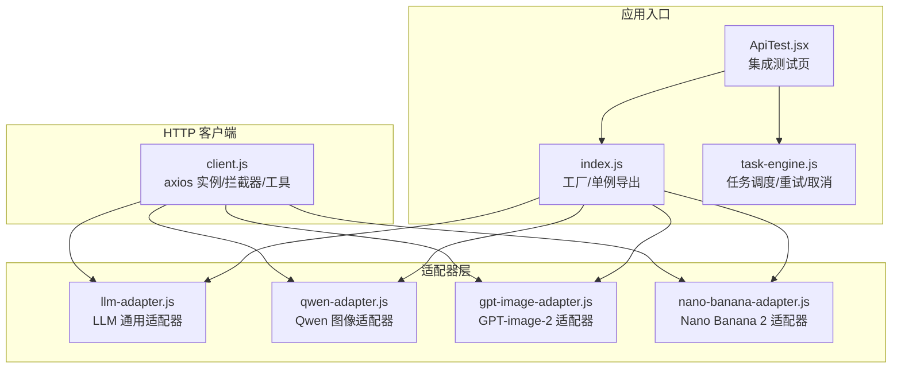
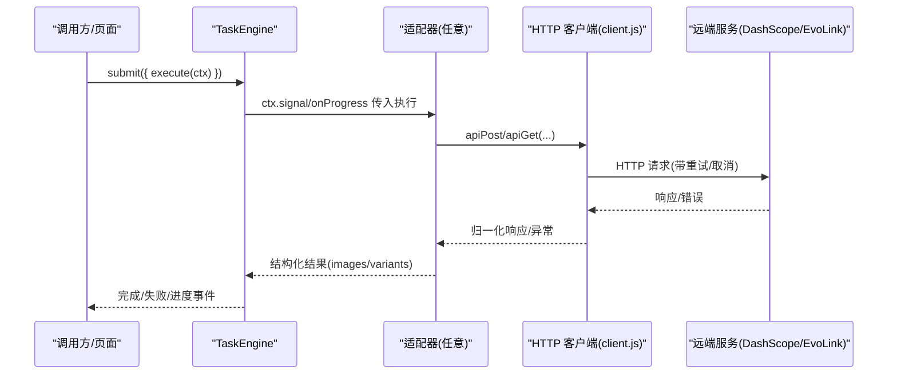
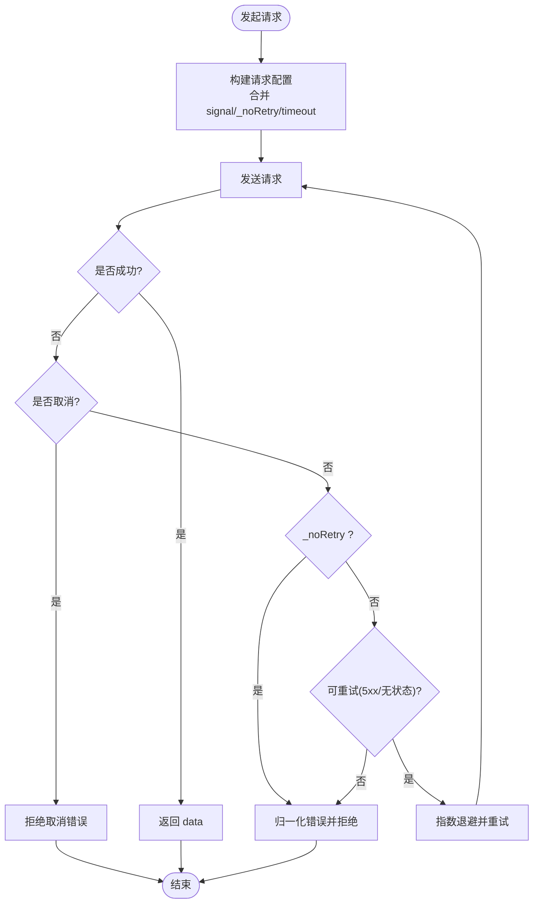
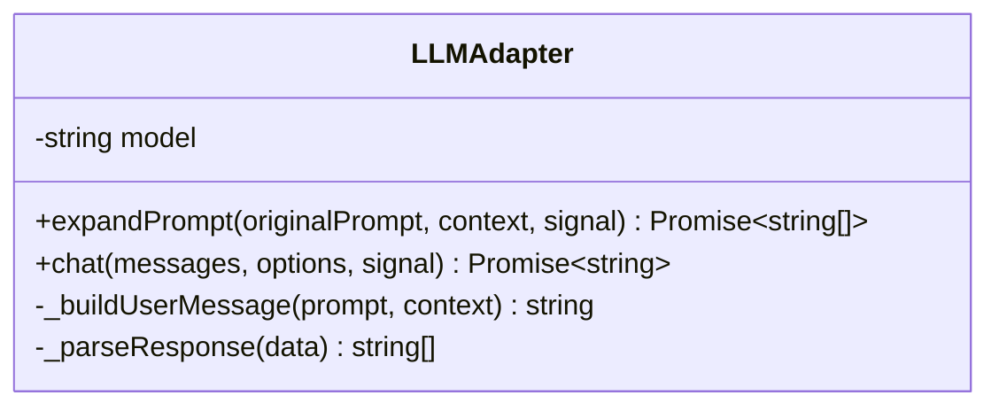
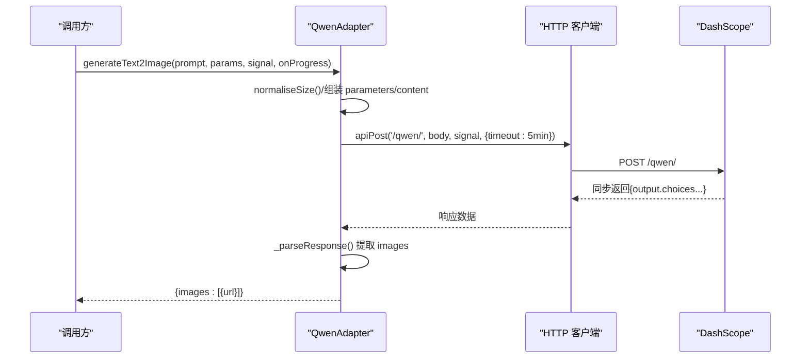
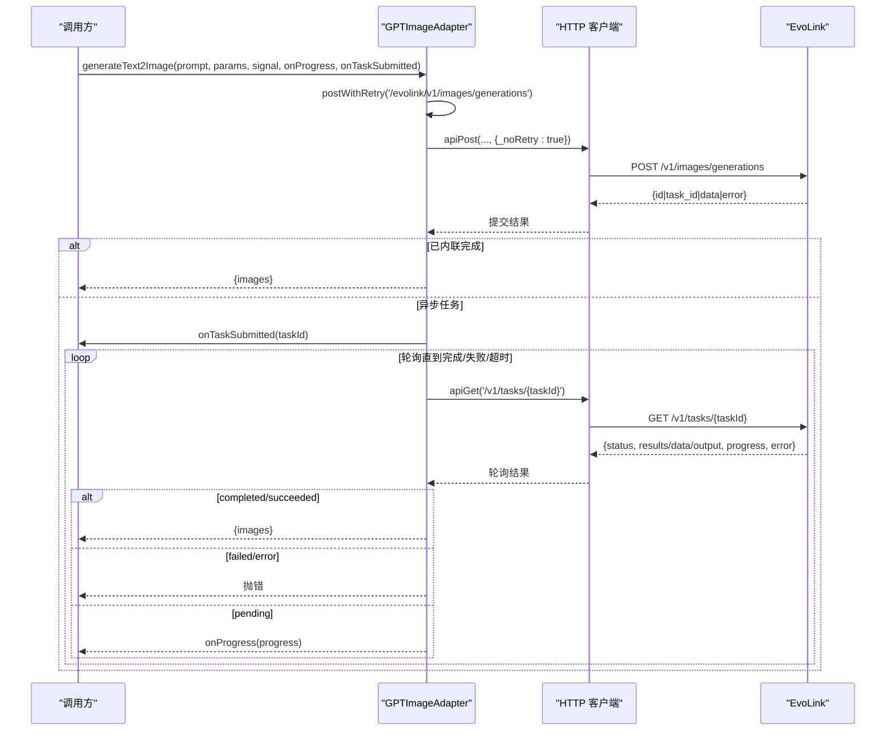
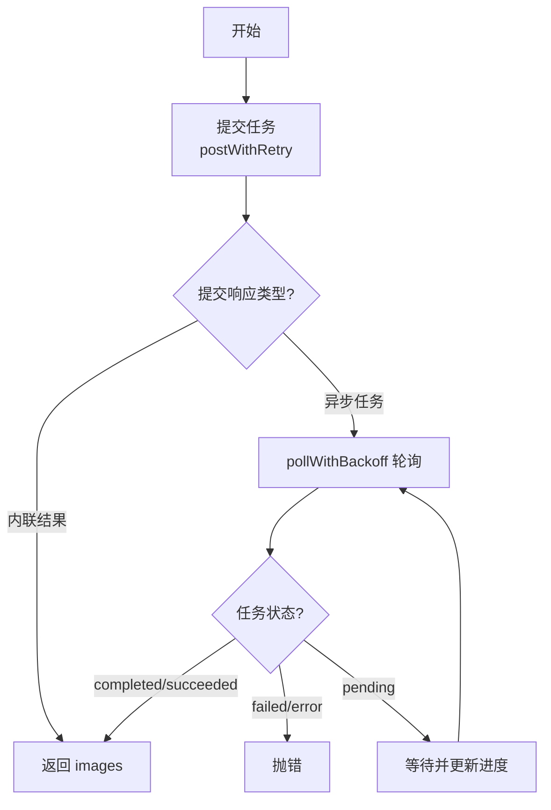
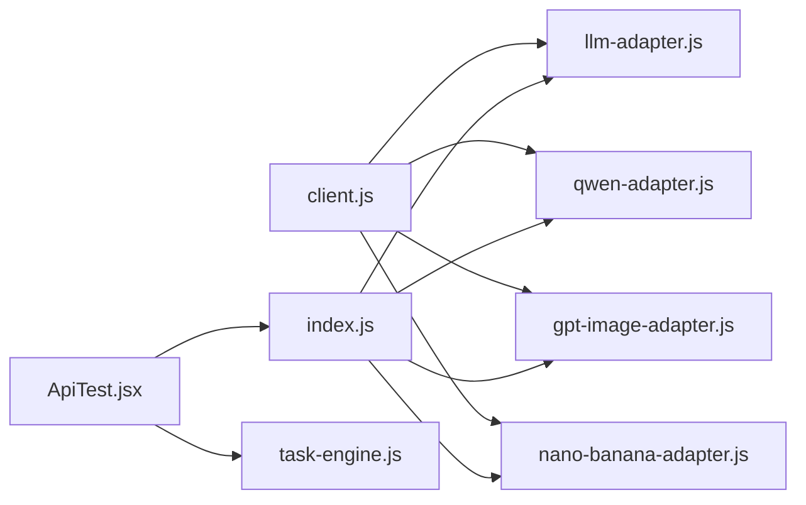

# API 适配层

<cite>
**本文引用的文件**   
- [app/src/services/api/client.js](file://app/src/services/api/client.js)
- [app/src/services/api/llm-adapter.js](file://app/src/services/api/llm-adapter.js)
- [app/src/services/api/qwen-adapter.js](file://app/src/services/api/qwen-adapter.js)
- [app/src/services/api/gpt-image-adapter.js](file://app/src/services/api/gpt-image-adapter.js)
- [app/src/services/api/nano-banana-adapter.js](file://app/src/services/api/nano-banana-adapter.js)
- [app/src/services/api/index.js](file://app/src/services/api/index.js)
- [app/src/constants/models.js](file://app/src/constants/models.js)
- [app/src/pages/ApiTest.jsx](file://app/src/pages/ApiTest.jsx)
- [app/src/services/task-engine.js](file://app/src/services/task-engine.js)
- [docs/qwen-image-3-api.md](file://docs/qwen-image-3-api.md)
</cite>

## 目录
1. [简介](#简介)
2. [项目结构](#项目结构)
3. [核心组件](#核心组件)
4. [架构总览](#架构总览)
5. [详细组件分析](#详细组件分析)
6. [依赖关系分析](#依赖关系分析)
7. [性能与可靠性](#性能与可靠性)
8. [故障排查指南](#故障排查指南)
9. [结论](#结论)
10. [附录：新增模型接入指南](#附录新增模型接入指南)

## 简介
本文件面向 AI Image Studio 的 API 适配层，系统性说明基于适配器模式的多模型支持架构、统一的 HTTP 客户端封装以及各 AI 模型的适配器实现。重点覆盖：
- 统一 HTTP 客户端（axios）封装：自动重试、请求取消、错误归一化、长耗时请求专用实例
- LLM 通用适配器抽象：提示词扩展与通用对话能力
- QwenAdapter、GPTImageAdapter、NanoBananaAdapter 的具体对接方法、参数映射与响应解析
- 自动重试机制、请求取消与错误处理策略
- 添加新模型支持的完整步骤与测试方法

## 项目结构
API 适配层位于 services/api 目录，采用“HTTP 客户端 + 适配器”的分层设计：
- client.js：统一 HTTP 客户端与工具函数
- llm-adapter.js：LLM 通用适配器（提示词扩展、聊天）
- qwen-adapter.js：Qwen 图像生成适配器（同步接口）
- gpt-image-adapter.js：GPT-image-2 适配器（异步提交+轮询）
- nano-banana-adapter.js：Nano Banana 2 适配器（异步提交+轮询）
- index.js：统一导出与工厂方法（按 modelId 获取适配器）

图表来源
- [app/src/services/api/client.js:1-146](file://app/src/services/api/client.js#L1-L146)
- [app/src/services/api/llm-adapter.js:1-150](file://app/src/services/api/llm-adapter.js#L1-L150)
- [app/src/services/api/qwen-adapter.js:1-209](file://app/src/services/api/qwen-adapter.js#L1-L209)
- [app/src/services/api/gpt-image-adapter.js:1-336](file://app/src/services/api/gpt-image-adapter.js#L1-L336)
- [app/src/services/api/nano-banana-adapter.js:1-265](file://app/src/services/api/nano-banana-adapter.js#L1-L265)
- [app/src/services/api/index.js:1-39](file://app/src/services/api/index.js#L1-L39)
- [app/src/services/task-engine.js:1-319](file://app/src/services/task-engine.js#L1-L319)
- [app/src/pages/ApiTest.jsx:1-391](file://app/src/pages/ApiTest.jsx#L1-L391)

章节来源
- [app/src/services/api/index.js:1-39](file://app/src/services/api/index.js#L1-L39)
- [app/src/constants/models.js:1-106](file://app/src/constants/models.js#L1-L106)

## 核心组件
- 统一 HTTP 客户端（client.js）
  - 提供 apiGet/apiPost/apiPut/apiDelete 等便捷方法
  - 内置 axios 拦截器：自动重试（指数退避）、错误归一化、AbortController 支持
  - 针对长耗时同步接口提供 longRunningClient（默认 5 分钟超时）
- LLM 通用适配器（llm-adapter.js）
  - 通过 /api/llm/chat/completions 调用 DashScope 兼容 OpenAI 风格接口
  - 提供 expandPrompt（提示词扩展）与 chat（通用对话）两个方法
  - 支持 AbortSignal 取消；返回字符串数组或纯文本
- 图像生成适配器
  - QwenAdapter：同步接口，T2I/I2I 均直接返回结果，内部做尺寸规范化与响应解析
  - GPTImageAdapter：异步接口，提交任务后轮询任务状态，支持进度回调与取消
  - NanoBananaAdapter：异步接口，与 GPTImageAdapter 类似，但模型与参数不同

章节来源
- [app/src/services/api/client.js:1-146](file://app/src/services/api/client.js#L1-L146)
- [app/src/services/api/llm-adapter.js:1-150](file://app/src/services/api/llm-adapter.js#L1-L150)
- [app/src/services/api/qwen-adapter.js:1-209](file://app/src/services/api/qwen-adapter.js#L1-L209)
- [app/src/services/api/gpt-image-adapter.js:1-336](file://app/src/services/api/gpt-image-adapter.js#L1-L336)
- [app/src/services/api/nano-banana-adapter.js:1-265](file://app/src/services/api/nano-banana-adapter.js#L1-L265)

## 架构总览
整体数据流：UI/业务层 → TaskEngine（任务调度/重试/取消）→ 适配器（构造请求体/解析响应）→ HTTP 客户端（axios 拦截器/重试/取消）→ 远端服务（DashScope/EvoLink）。

图表来源
- [app/src/services/task-engine.js:1-319](file://app/src/services/task-engine.js#L1-L319)
- [app/src/services/api/client.js:1-146](file://app/src/services/api/client.js#L1-L146)
- [app/src/services/api/qwen-adapter.js:1-209](file://app/src/services/api/qwen-adapter.js#L1-L209)
- [app/src/services/api/gpt-image-adapter.js:1-336](file://app/src/services/api/gpt-image-adapter.js#L1-L336)
- [app/src/services/api/nano-banana-adapter.js:1-265](file://app/src/services/api/nano-banana-adapter.js#L1-L265)

## 详细组件分析

### 统一 HTTP 客户端（client.js）
- 双实例设计
  - apiClient：默认 60s 超时，用于常规请求
  - longRunningClient：默认 300s 超时，用于同步图像生成等长耗时请求
- 拦截器
  - 请求拦截：将外部 _signal 注入 signal，确保 AbortController 生效
  - 响应拦截：
    - 取消错误直接上抛
    - 若配置 _noRetry=true，跳过 axios 级重试，返回归一化错误对象（含 status/data/originalError）
    - 否则对 5xx/无状态码进行指数退避重试（最多 3 次）
- 便捷方法
  - apiGet/apiPost/apiPut/apiDelete：统一封装 GET/POST/PUT/DELETE
  - createCancellable：创建可取消的请求上下文（signal/cancel）

图表来源
- [app/src/services/api/client.js:1-146](file://app/src/services/api/client.js#L1-L146)

章节来源
- [app/src/services/api/client.js:1-146](file://app/src/services/api/client.js#L1-L146)

### LLM 通用适配器（llm-adapter.js）
- 目标：通过 /api/llm/chat/completions 调用 DashScope 兼容 OpenAI 风格接口，提供提示词扩展与通用对话能力
- 关键方法
  - expandPrompt(originalPrompt, context, signal)：根据系统提示词与用户上下文，生成多条高质量图像提示词变体
  - chat(messages, options, signal)：通用对话接口，返回助手回复文本
- 参数映射
  - body.model：从环境变量 VITE_EXPANSION_LLM_MODEL 读取，默认 qwen-max
  - messages：system + user 两条消息；user 内容根据 context 动态拼接（model/style/language）
  - temperature/max_tokens：可通过 options/context 覆盖
- 响应解析
  - 优先从 choices[0].message.content 提取 JSON 数组
  - 支持去除 markdown 代码块包裹，容错处理非数组情况，回退为原始文本数组
- 取消与错误
  - 支持 AbortSignal 传递至底层 apiPost
  - 捕获并记录错误，向上抛出

图表来源
- [app/src/services/api/llm-adapter.js:1-150](file://app/src/services/api/llm-adapter.js#L1-L150)

章节来源
- [app/src/services/api/llm-adapter.js:1-150](file://app/src/services/api/llm-adapter.js#L1-L150)

### QwenAdapter（qwen-adapter.js）
- 特性
  - 同步接口：POST 直接返回结果，无需轮询
  - 支持 T2I 与 I2I 两种场景
  - 尺寸规范化：T2I 宽高需为 16 的倍数；I2I 宽高需为 32 的倍数
  - 长耗时：默认使用 5 分钟超时
- 关键方法
  - generateText2Image(prompt, params, signal, onProgress)
  - generateImage2Image(prompt, imageUrls, params, signal, onProgress)
- 参数映射
  - parameters：prompt_extend/prompt_extend_mode/n/size/negative_prompt/watermark/seed
  - seed 仅当为非负整数时传入，否则由服务端随机
  - content：T2I 为 [{text}]；I2I 为 [{image}, ..., {text}]
- 响应解析
  - 从 output.choices[].message.content[].image 提取图片 URL 列表
- 错误处理
  - 提取 DashScope 错误信息（code/message/request_id），包装为友好错误

图表来源
- [app/src/services/api/qwen-adapter.js:1-209](file://app/src/services/api/qwen-adapter.js#L1-L209)
- [app/src/services/api/client.js:1-146](file://app/src/services/api/client.js#L1-L146)
- [docs/qwen-image-3-api.md:1-221](file://docs/qwen-image-3-api.md#L1-L221)

章节来源
- [app/src/services/api/qwen-adapter.js:1-209](file://app/src/services/api/qwen-adapter.js#L1-L209)
- [docs/qwen-image-3-api.md:1-221](file://docs/qwen-image-3-api.md#L1-L221)

### GPTImageAdapter（gpt-image-adapter.js）
- 特性
  - 异步接口：先提交任务，再轮询任务状态直至完成
  - 提交重试：postWithRetry 对网络/5xx 错误进行指数退避重试（最多 3 次）
  - 轮询策略：初始 2s，指数增长至最大 10s，最长等待 5 分钟
  - 支持取消：AbortSignal 在提交与轮询中均被检查
- 关键方法
  - submitGeneration(prompt, params, signal)
  - pollResult(taskId, onProgress, signal)
  - generateText2Image(prompt, params, signal, onProgress, onTaskSubmitted)
  - submitImageEdit(prompt, imageBase64, maskBase64, params, signal)
  - editImage(prompt, imageBase64, maskBase64, params, signal, onProgress, onTaskSubmitted)
- 参数映射
  - 提交体包含 model/prompt/size/n/quality(image edit 额外 image/mask)
  - 轮询查询 /v1/tasks/{taskId}
- 响应解析
  - parseSubmitResponse：兼容多种返回格式（id/task_id/data/error/results/output）
  - 解析结果项：支持字符串 URL 或对象 {url/b64_json}
- 错误处理
  - 提交阶段：网络/5xx 重试；上游 error 字段直接抛错
  - 轮询阶段：error 且无 status 视为错误；completed/succeeded 返回结果；failed/error 抛错

图表来源
- [app/src/services/api/gpt-image-adapter.js:1-336](file://app/src/services/api/gpt-image-adapter.js#L1-L336)
- [app/src/services/api/client.js:1-146](file://app/src/services/api/client.js#L1-L146)

章节来源
- [app/src/services/api/gpt-image-adapter.js:1-336](file://app/src/services/api/gpt-image-adapter.js#L1-L336)

### NanoBananaAdapter（nano-banana-adapter.js）
- 特性
  - 异步接口：与 GPTImageAdapter 相同的提交+轮询流程
  - 模型：gemini-3.1-flash-image-preview
  - 支持 I2I：image_urls 数组作为参考图
- 关键方法
  - submitGeneration(prompt, params, signal)
  - pollResult(taskId, onProgress, signal)
  - generateText2Image(prompt, params, signal, onProgress, onTaskSubmitted)
  - generateImage2Image(prompt, imageUrls, params, signal, onProgress, onTaskSubmitted)
- 参数映射
  - 提交体包含 model/prompt/image_urls/size/quality
- 响应解析
  - 与 GPTImageAdapter 类似的 parseSubmitResponse/parseResults 逻辑
- 错误处理
  - 提交重试与轮询错误处理策略一致

图表来源
- [app/src/services/api/nano-banana-adapter.js:1-265](file://app/src/services/api/nano-banana-adapter.js#L1-L265)
- [app/src/services/api/client.js:1-146](file://app/src/services/api/client.js#L1-L146)

章节来源
- [app/src/services/api/nano-banana-adapter.js:1-265](file://app/src/services/api/nano-banana-adapter.js#L1-L265)

### 工厂与导出（index.js）
- 统一导出：apiClient、apiGet/Post/Put/Delete、createCancellable
- 适配器导出：QwenAdapter/GPTImageAdapter/NanoBananaAdapter/LLMAdapter
- 工厂方法
  - getModelAdapter(modelId)：根据 modelId 返回对应适配器实例
  - getLLMAdapter()：返回 LLMAdapter 单例

章节来源
- [app/src/services/api/index.js:1-39](file://app/src/services/api/index.js#L1-L39)

## 依赖关系分析
- 耦合与内聚
  - 适配器仅依赖 HTTP 客户端，不感知具体网络细节，内聚良好
  - 工厂集中管理模型到适配器的映射，便于扩展
- 外部依赖
  - axios：HTTP 通信
  - uuid：任务 ID 生成（TaskEngine）
  - IndexedDB：任务持久化（TaskEngine）
- 潜在循环依赖
  - 当前分层清晰，未发现循环依赖

图表来源
- [app/src/services/api/client.js:1-146](file://app/src/services/api/client.js#L1-L146)
- [app/src/services/api/llm-adapter.js:1-150](file://app/src/services/api/llm-adapter.js#L1-L150)
- [app/src/services/api/qwen-adapter.js:1-209](file://app/src/services/api/qwen-adapter.js#L1-L209)
- [app/src/services/api/gpt-image-adapter.js:1-336](file://app/src/services/api/gpt-image-adapter.js#L1-L336)
- [app/src/services/api/nano-banana-adapter.js:1-265](file://app/src/services/api/nano-banana-adapter.js#L1-L265)
- [app/src/services/api/index.js:1-39](file://app/src/services/api/index.js#L1-L39)
- [app/src/pages/ApiTest.jsx:1-391](file://app/src/pages/ApiTest.jsx#L1-L391)
- [app/src/services/task-engine.js:1-319](file://app/src/services/task-engine.js#L1-L319)

章节来源
- [app/src/services/api/index.js:1-39](file://app/src/services/api/index.js#L1-L39)
- [app/src/services/task-engine.js:1-319](file://app/src/services/task-engine.js#L1-L319)

## 性能与可靠性
- 自动重试
  - HTTP 客户端层：对 5xx/无状态码进行指数退避重试（最多 3 次）
  - 适配器层：GPT/Nano 的提交阶段也具备独立重试逻辑，避免一次性失败
- 请求取消
  - 所有适配器方法均接受 AbortSignal，TaskEngine 在 cancel/pause 时触发 abort
- 超时控制
  - 常规请求 60s；同步图像生成（Qwen）使用 5 分钟超时
  - 异步轮询最长 5 分钟，指数退避上限 10s
- 进度反馈
  - 适配器在合适时机调用 onProgress，TaskEngine 持久化并广播进度事件
- 并发控制
  - TaskEngine 默认最大并发 3，FIFO 队列，避免资源争用

章节来源
- [app/src/services/api/client.js:1-146](file://app/src/services/api/client.js#L1-L146)
- [app/src/services/api/gpt-image-adapter.js:1-336](file://app/src/services/api/gpt-image-adapter.js#L1-L336)
- [app/src/services/api/nano-banana-adapter.js:1-265](file://app/src/services/api/nano-banana-adapter.js#L1-L265)
- [app/src/services/task-engine.js:1-319](file://app/src/services/task-engine.js#L1-L319)

## 故障排查指南
- 常见问题定位
  - 网络/代理错误：查看控制台日志中的 status=0 或 message 包含 network/fetch/timeout/ECONN
  - 上游错误：GPT/Nano 适配器会打印完整响应键与内容，便于比对期望格式
  - Qwen 错误：extractDashScopeError 会输出 code/message/request_id，结合 docs/qwen-image-3-api.md 对照
- 调试建议
  - 使用 ApiTest 页面逐项验证各适配器
  - 开启浏览器 Network 面板观察请求/响应
  - 关注 TaskEngine 的状态机转换与重试次数
- 常见错误与对策
  - 超时：增大 timeout 或优化 prompt/参数；确认后端可用性
  - 取消：确认上层是否正确传递 signal 并在需要时调用 cancel
  - 响应格式不符：核对适配器解析逻辑与上游文档差异

章节来源
- [app/src/services/api/qwen-adapter.js:1-209](file://app/src/services/api/qwen-adapter.js#L1-L209)
- [app/src/services/api/gpt-image-adapter.js:1-336](file://app/src/services/api/gpt-image-adapter.js#L1-L336)
- [app/src/services/api/nano-banana-adapter.js:1-265](file://app/src/services/api/nano-banana-adapter.js#L1-L265)
- [app/src/pages/ApiTest.jsx:1-391](file://app/src/pages/ApiTest.jsx#L1-L391)
- [docs/qwen-image-3-api.md:1-221](file://docs/qwen-image-3-api.md#L1-L221)

## 结论
API 适配层通过清晰的层次划分与适配器模式，实现了多模型能力的统一接入与稳定运行。HTTP 客户端封装提供了可靠的重试、取消与错误归一化能力；各适配器专注于协议差异与参数映射；TaskEngine 负责任务编排与状态管理。该设计具备良好的可扩展性与可维护性，便于快速接入新模型。

## 附录：新增模型接入指南
- 步骤概览
  1) 新建适配器文件：例如 new-model-adapter.js
     - 定义类与方法（如 generateText2Image/generateImage2Image）
     - 使用 client.js 提供的 apiPost/apiGet 进行请求
     - 实现参数映射与响应解析，遵循统一返回结构 { images: [{ url }] }
     - 支持 AbortSignal 与可选 onProgress
  2) 注册到工厂：修改 index.js 的 getModelAdapter，增加新 modelId 分支
  3) 配置常量：在 constants/models.js 中添加模型能力、尺寸、默认参数等
  4) 集成测试：在 ApiTest.jsx 中新增测试按钮，调用 getModelAdapter(newModelId) 执行端到端测试
  5) 文档与注释：为新适配器补充注释与错误处理说明
- 注意事项
  - 同步接口：使用 longRunningClient 或 opts.timeout 设置合理超时
  - 异步接口：实现提交+轮询流程，注意进度上报与取消检测
  - 错误处理：尽量归一化为友好错误信息，保留原始错误以便调试
  - 兼容性：保持返回结构一致，便于上层统一消费

章节来源
- [app/src/services/api/index.js:1-39](file://app/src/services/api/index.js#L1-L39)
- [app/src/constants/models.js:1-106](file://app/src/constants/models.js#L1-L106)
- [app/src/pages/ApiTest.jsx:1-391](file://app/src/pages/ApiTest.jsx#L1-L391)
- [app/src/services/api/client.js:1-146](file://app/src/services/api/client.js#L1-L146)