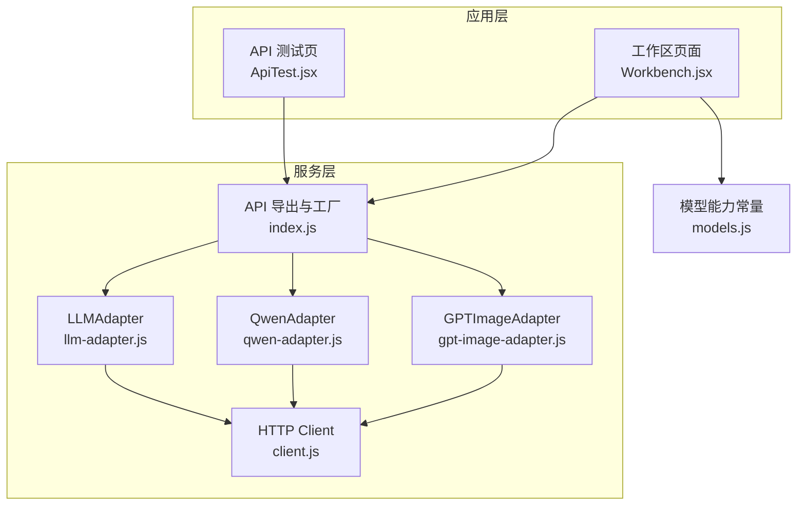
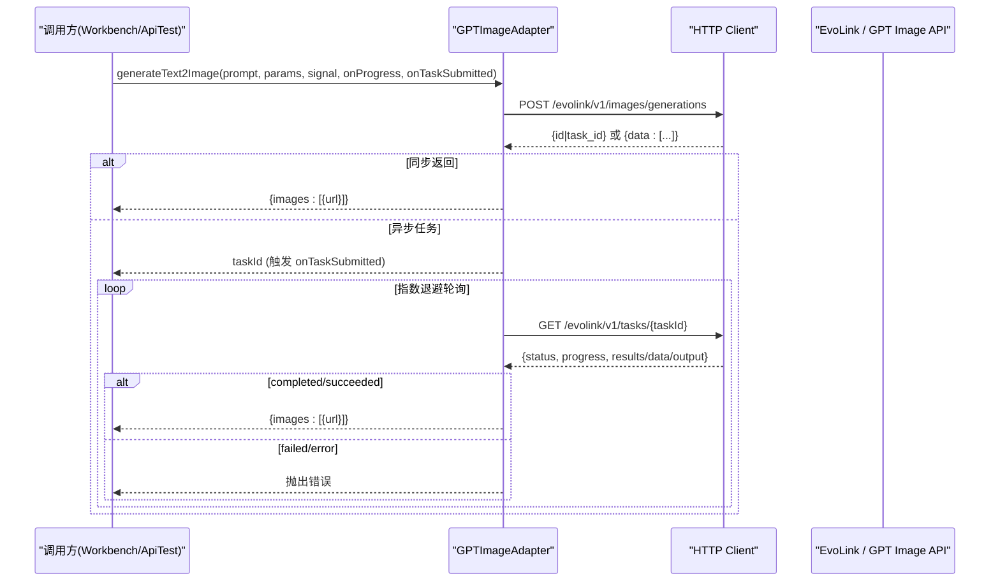
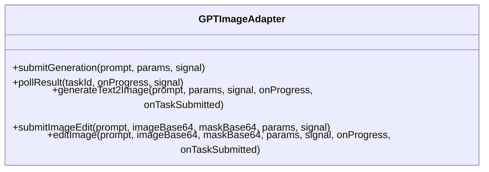
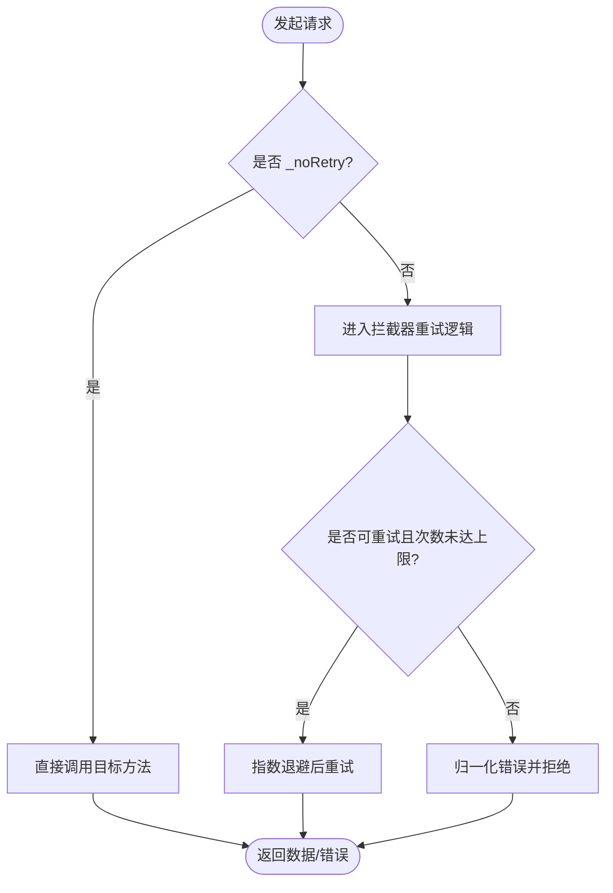
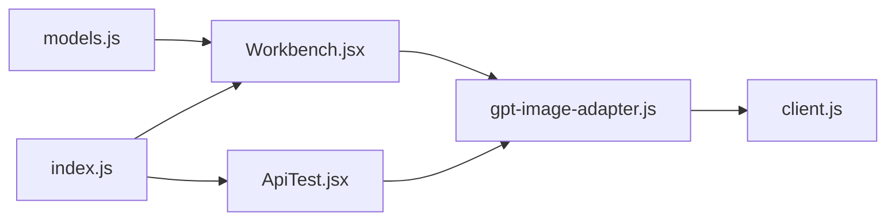
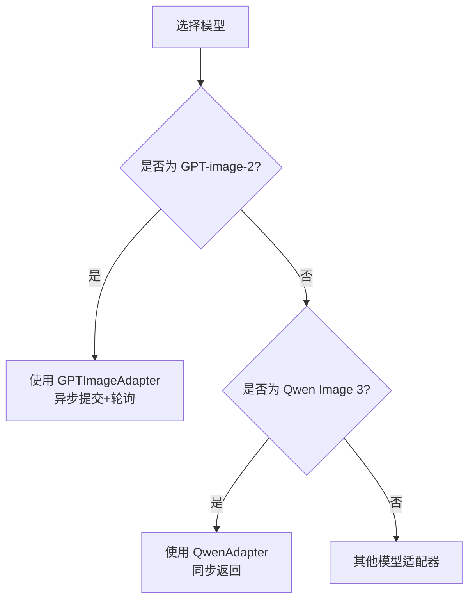

# GPT Image 适配器

<cite>
**本文引用的文件**   
- [gpt-image-adapter.js](file://app/src/services/api/gpt-image-adapter.js)
- [qwen-adapter.js](file://app/src/services/api/qwen-adapter.js)
- [client.js](file://app/src/services/api/client.js)
- [index.js](file://app/src/services/api/index.js)
- [models.js](file://app/src/constants/models.js)
- [Workbench.jsx](file://app/src/pages/Workbench.jsx)
- [ApiTest.jsx](file://app/src/pages/ApiTest.jsx)
- [qwen-image-3-api.md](file://docs/qwen-image-3-api.md)
</cite>

## 目录
1. [简介](#简介)
2. [项目结构](#项目结构)
3. [核心组件](#核心组件)
4. [架构总览](#架构总览)
5. [详细组件分析](#详细组件分析)
6. [依赖关系分析](#依赖关系分析)
7. [性能与可靠性](#性能与可靠性)
8. [安全与配额限制](#安全与配额限制)
9. [与 Qwen 适配器的差异对比与迁移指南](#与-qwen-适配器的差异对比与迁移指南)
10. [故障排查](#故障排查)
11. [结论](#结论)

## 简介
本文件为 GPT Image 适配器的技术文档，聚焦于 GPTImageAdapter 类对 OpenAI DALL-E/GPT Image API（通过 EvoLink 代理）的适配实现。内容涵盖：
- API 版本兼容性与请求参数标准化
- 多模态输入处理（文本生成、图像编辑/局部重绘）
- 响应格式转换与进度回调
- 支持的图像生成选项、错误处理与重试策略
- 与 Qwen 适配器的差异对比及迁移建议

## 项目结构
GPT Image 适配器位于服务层 API 模块中，统一由工厂函数暴露，并在工作区页面中被调用。

图表来源
- [gpt-image-adapter.js:1-336](file://app/src/services/api/gpt-image-adapter.js#L1-L336)
- [qwen-adapter.js:1-209](file://app/src/services/api/qwen-adapter.js#L1-L209)
- [client.js:1-146](file://app/src/services/api/client.js#L1-L146)
- [index.js:1-39](file://app/src/services/api/index.js#L1-L39)
- [models.js:1-106](file://app/src/constants/models.js#L1-L106)
- [Workbench.jsx:368-406](file://app/src/pages/Workbench.jsx#L368-L406)
- [ApiTest.jsx:1-57](file://app/src/pages/ApiTest.jsx#L1-L57)

章节来源
- [gpt-image-adapter.js:1-336](file://app/src/services/api/gpt-image-adapter.js#L1-L336)
- [index.js:1-39](file://app/src/services/api/index.js#L1-L39)
- [models.js:1-106](file://app/src/constants/models.js#L1-L106)

## 核心组件
- GPTImageAdapter：封装 GPT-image-2 的异步任务提交、轮询、结果解析与图片编辑流程；提供统一的进度回调与取消支持。
- HTTP Client：基于 axios 的统一客户端，包含拦截器、自动重试、长连接超时等能力。
- 工厂与导出：统一暴露各适配器实例与 LLM 扩写工具。

章节来源
- [gpt-image-adapter.js:156-336](file://app/src/services/api/gpt-image-adapter.js#L156-L336)
- [client.js:1-146](file://app/src/services/api/client.js#L1-L146)
- [index.js:1-39](file://app/src/services/api/index.js#L1-L39)

## 架构总览
GPTImageAdapter 采用“提交 + 轮询”的异步模式，适配后端可能返回同步或异步两种形态的响应，并统一转换为标准结果对象。

图表来源
- [gpt-image-adapter.js:156-336](file://app/src/services/api/gpt-image-adapter.js#L156-L336)
- [client.js:1-146](file://app/src/services/api/client.js#L1-L146)

## 详细组件分析

### GPTImageAdapter 类
- 职责
  - 文本到图像：submitGeneration -> parseSubmitResponse -> pollResult
  - 图像编辑（含可选 mask）：submitImageEdit -> parseSubmitResponse -> pollResult
  - 组合接口：generateText2Image、editImage（内部协调提交与轮询，支持进度与任务通知）
- 关键特性
  - 提交重试：网络错误、5xx、代理 502 等可重试场景，指数退避
  - 轮询策略：初始间隔 2s，指数增长至最大 10s，最长等待 5 分钟
  - 响应兼容：同时兼容 id/task_id、results/data/output、OpenAI 标准 data 数组
  - 进度上报：优先使用服务端 progress，否则按时间估算（上限 90%）
  - 取消支持：AbortSignal 贯穿提交与轮询

图表来源
- [gpt-image-adapter.js:156-336](file://app/src/services/api/gpt-image-adapter.js#L156-L336)

章节来源
- [gpt-image-adapter.js:156-336](file://app/src/services/api/gpt-image-adapter.js#L156-L336)

### HTTP 客户端与重试机制
- 默认客户端：baseURL=/api，默认超时 60s
- 长时客户端：用于同步耗时接口（如 Qwen），超时 5 分钟
- 拦截器：统一错误归一化、自动重试（最多 3 次，指数退避）、支持 AbortController
- 外部重试：postWithRetry 在适配器层自行控制重试，避免与拦截器重复

图表来源
- [client.js:1-146](file://app/src/services/api/client.js#L1-L146)
- [gpt-image-adapter.js:33-54](file://app/src/services/api/gpt-image-adapter.js#L33-L54)

章节来源
- [client.js:1-146](file://app/src/services/api/client.js#L1-L146)
- [gpt-image-adapter.js:33-54](file://app/src/services/api/gpt-image-adapter.js#L33-L54)

### 请求参数标准化与多模态输入
- 文本生成
  - model: gpt-image-2
  - prompt: 用户提示词
  - size: 默认 1024x1024，支持多种比例
  - n: 生成数量
  - quality: 仅在非 auto 时传入
- 图像编辑
  - 额外字段：image（源图 base64）、mask（可选，掩码 base64）
  - 其余字段与文本生成一致
- 多模态输入
  - 支持纯文本生成
  - 支持带掩码的局部重绘（mask）

章节来源
- [gpt-image-adapter.js:164-190](file://app/src/services/api/gpt-image-adapter.js#L164-L190)
- [gpt-image-adapter.js:283-303](file://app/src/services/api/gpt-image-adapter.js#L283-L303)

### 响应格式转换
- 提交响应
  - 异步任务：返回 {id|task_id}，后续需轮询
  - 同步结果：返回 {data:[...]}，可直接解析
  - 上游错误：即使 HTTP 200，也可能包含 error 字段
- 轮询响应
  - 状态：completed/succeeded 视为完成；failed/error 视为失败
  - 结果位置：兼容 results/data/output
  - 元素格式：字符串 URL 或对象 {url|b64_json}，统一转为 {url}
- 进度
  - 若服务端提供 progress，则直接使用（上限 90%）
  - 否则按时间估算进度

章节来源
- [gpt-image-adapter.js:115-154](file://app/src/services/api/gpt-image-adapter.js#L115-L154)
- [gpt-image-adapter.js:199-241](file://app/src/services/api/gpt-image-adapter.js#L199-L241)

### 与业务层的集成
- 工作区页面通过 TaskEngine 提交任务，调用 GPTImageAdapter.editImage 执行局部重绘，并将结果持久化展示。
- API 测试页通过工厂获取适配器，进行端到端连通性验证。

章节来源
- [Workbench.jsx:368-406](file://app/src/pages/Workbench.jsx#L368-L406)
- [ApiTest.jsx:1-57](file://app/src/pages/ApiTest.jsx#L1-L57)
- [index.js:1-39](file://app/src/services/api/index.js#L1-L39)

## 依赖关系分析
- GPTImageAdapter 依赖 HTTP 客户端进行网络请求
- 工厂 index.js 统一管理适配器实例，便于扩展新模型
- models.js 定义各模型能力与默认参数，驱动 UI 行为

图表来源
- [models.js:1-106](file://app/src/constants/models.js#L1-L106)
- [index.js:1-39](file://app/src/services/api/index.js#L1-L39)
- [gpt-image-adapter.js:1-336](file://app/src/services/api/gpt-image-adapter.js#L1-L336)
- [client.js:1-146](file://app/src/services/api/client.js#L1-L146)
- [Workbench.jsx:368-406](file://app/src/pages/Workbench.jsx#L368-L406)
- [ApiTest.jsx:1-57](file://app/src/pages/ApiTest.jsx#L1-L57)

章节来源
- [models.js:1-106](file://app/src/constants/models.js#L1-L106)
- [index.js:1-39](file://app/src/services/api/index.js#L1-L39)
- [gpt-image-adapter.js:1-336](file://app/src/services/api/gpt-image-adapter.js#L1-L336)
- [client.js:1-146](file://app/src/services/api/client.js#L1-L146)

## 性能与可靠性
- 提交重试：针对网络抖动与 5xx 错误，指数退避，最多 3 次
- 轮询退避：2s→4s→8s→10s 封顶，避免频繁请求
- 超时控制：默认 60s，长时接口使用 5 分钟客户端
- 取消支持：AbortSignal 贯穿全流程，避免资源浪费
- 进度反馈：服务端进度优先，否则按时间估算，提升用户体验

章节来源
- [gpt-image-adapter.js:33-91](file://app/src/services/api/gpt-image-adapter.js#L33-L91)
- [client.js:1-146](file://app/src/services/api/client.js#L1-L146)

## 安全与配额限制
- 安全过滤
  - 适配器层不实现内容安全过滤，具体策略由上游 API/EvoLink 决定
  - 建议在业务层对 prompt 做前置校验与脱敏（例如长度、敏感词检测）
- 配额限制
  - 适配器层未内置配额检查；如需限流，可在调用前结合后端返回的错误码或自定义中间件实现
  - 对于并发与速率限制，建议在 TaskEngine 或上层调度器中统一管控

[本节为通用指导，不直接分析具体文件]

## 与 Qwen 适配器的差异对比与迁移指南

### 差异对比
- 交互模式
  - GPTImageAdapter：异步任务（提交 + 轮询）
  - QwenAdapter：同步直返（单次请求返回结果）
- 尺寸规范
  - GPTImageAdapter：size 使用 x 分隔（如 1024x1024）
  - QwenAdapter：size 使用 * 分隔（如 1024*1024），T2I 需 16 倍数，I2I 需 32 倍数
- 质量与分辨率
  - GPTImageAdapter：quality 支持 low/medium/high/auto
  - QwenAdapter：无 quality 字段，但支持 seed、negative_prompt、prompt_extend 等
- 多图参考
  - GPTImageAdapter：单图编辑（含可选 mask）
  - QwenAdapter：I2I 支持 1-3 张参考图
- 错误与日志
  - GPTImageAdapter：统一错误包装与详细日志
  - QwenAdapter：DashScope 错误提取与规范化

图表来源
- [gpt-image-adapter.js:156-336](file://app/src/services/api/gpt-image-adapter.js#L156-L336)
- [qwen-adapter.js:1-209](file://app/src/services/api/qwen-adapter.js#L1-L209)
- [models.js:1-106](file://app/src/constants/models.js#L1-L106)

### 迁移指南（从 Qwen 到 GPT）
- 参数映射
  - size：将 Qwen 的 W*H 转换为 GPT 的 WxH
  - n：保持一致
  - seed/negative_prompt/prompt_extend：GPT 不支持，忽略或移除
  - quality：根据需求设置 low/medium/high/auto
- 调用方式
  - Qwen：直接调用 generateText2Image/generateImage2Image 并等待结果
  - GPT：调用 generateText2Image/editImage，处理可能的 taskId 与轮询
- 结果处理
  - 两者均返回 {images:[{url}]}，无需改动展示逻辑
- 错误处理
  - 注意区分上游错误与网络错误，统一向上抛出

章节来源
- [qwen-adapter.js:60-105](file://app/src/services/api/qwen-adapter.js#L60-L105)
- [qwen-adapter.js:116-173](file://app/src/services/api/qwen-adapter.js#L116-L173)
- [gpt-image-adapter.js:164-190](file://app/src/services/api/gpt-image-adapter.js#L164-L190)
- [gpt-image-adapter.js:283-303](file://app/src/services/api/gpt-image-adapter.js#L283-L303)
- [models.js:1-106](file://app/src/constants/models.js#L1-L106)

## 故障排查
- 常见问题
  - 提交失败：检查网络、代理 5xx、API Key 有效性
  - 轮询超时：确认任务仍在处理，或上游已失败
  - 结果缺失：检查响应结构中 results/data/output 是否存在
- 定位建议
  - 查看控制台日志中的请求体与响应键名
  - 使用 ApiTest 页面快速验证连通性与错误信息
  - 在工作区观察进度回调与任务状态

章节来源
- [gpt-image-adapter.js:115-154](file://app/src/services/api/gpt-image-adapter.js#L115-L154)
- [gpt-image-adapter.js:199-241](file://app/src/services/api/gpt-image-adapter.js#L199-L241)
- [ApiTest.jsx:1-57](file://app/src/pages/ApiTest.jsx#L1-L57)

## 结论
GPTImageAdapter 以稳健的重试与轮询机制，屏蔽了底层异步任务的复杂性，提供了统一的文本生成与图像编辑能力。其参数标准化与响应转换确保了跨模型的一致性体验。与 Qwen 适配器相比，二者在交互模式、参数规范与能力边界上存在明显差异，但在结果结构与上层集成层面保持良好对齐，便于平滑迁移与扩展。