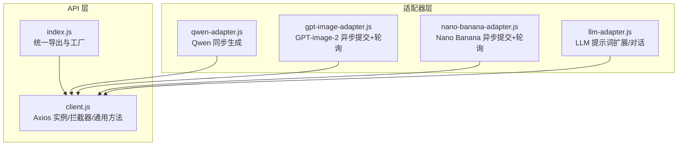
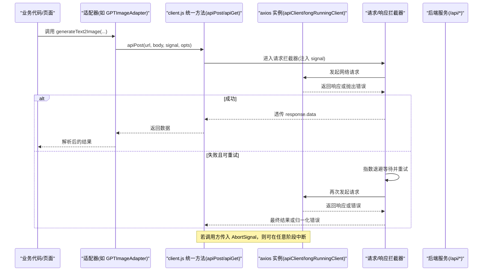
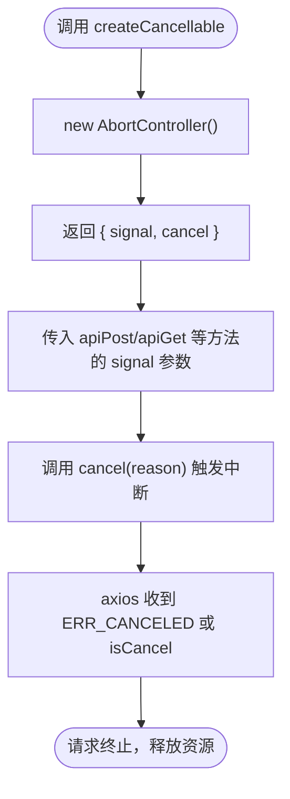
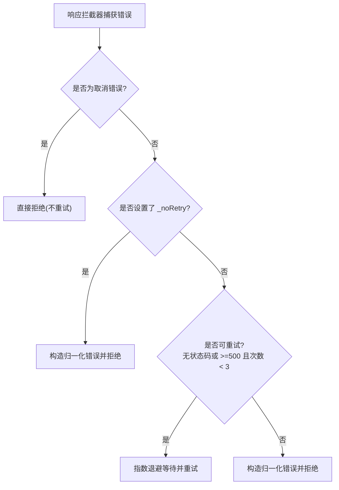
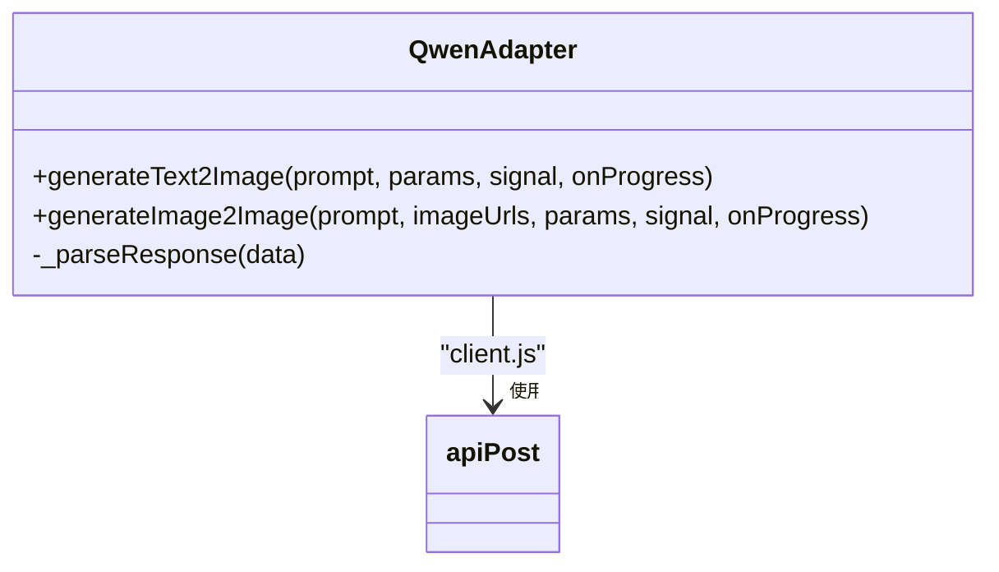
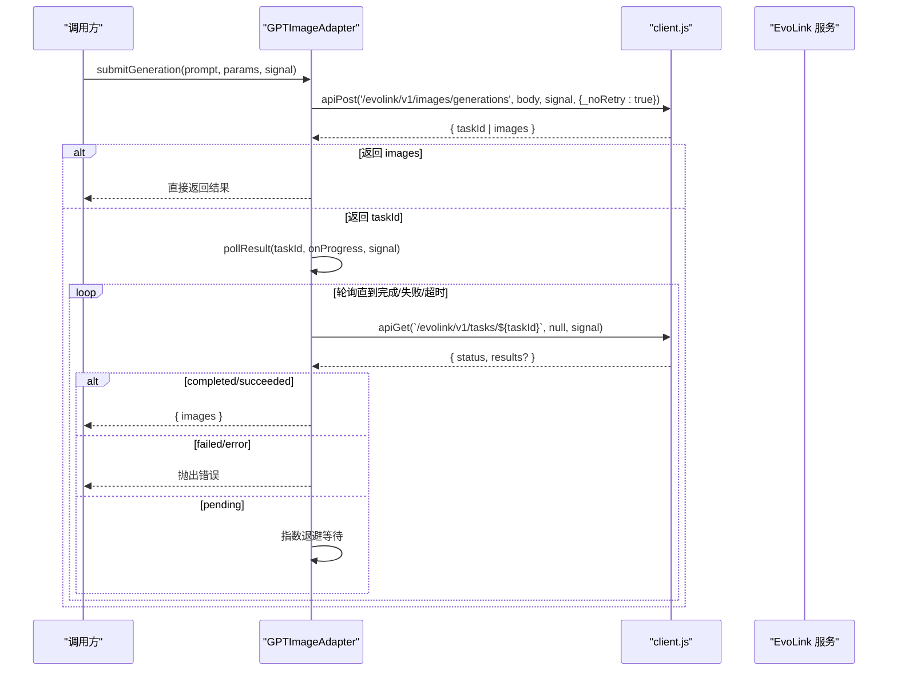
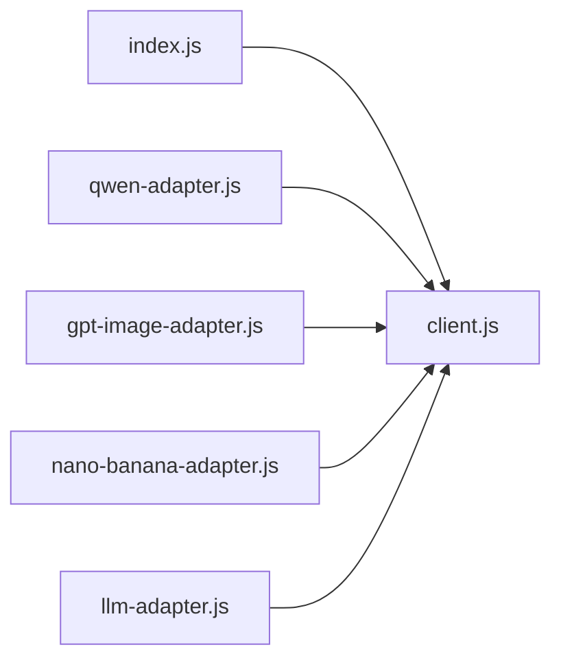

# HTTP 客户端封装

<cite>
**本文引用的文件**
- [client.js](file://app/src/services/api/client.js)
- [index.js](file://app/src/services/api/index.js)
- [qwen-adapter.js](file://app/src/services/api/qwen-adapter.js)
- [gpt-image-adapter.js](file://app/src/services/api/gpt-image-adapter.js)
- [nano-banana-adapter.js](file://app/src/services/api/nano-banana-adapter.js)
- [llm-adapter.js](file://app/src/services/api/llm-adapter.js)
</cite>

## 目录
1. [简介](#简介)
2. [项目结构](#项目结构)
3. [核心组件](#核心组件)
4. [架构总览](#架构总览)
5. [详细组件分析](#详细组件分析)
6. [依赖关系分析](#依赖关系分析)
7. [性能与超时](#性能与超时)
8. [故障排查指南](#故障排查指南)
9. [结论](#结论)
10. [附录：使用示例与最佳实践](#附录使用示例与最佳实践)

## 简介
本文件面向前端开发者，系统化梳理基于 Axios 的 HTTP 客户端封装。内容涵盖统一的请求方法（apiGet、apiPost、apiPut、apiDelete）、请求拦截器配置、响应处理机制、错误处理策略；并深入解释 createCancellable 函数的取消请求能力（AbortController）与内存泄漏防护；同时提供重试机制、超时配置、认证令牌管理与调试日志输出等高级功能的配置和使用要点。

## 项目结构
HTTP 客户端位于 services/api 目录下，采用“基础客户端 + 适配器”的分层组织方式：
- client.js：Axios 实例、拦截器、统一方法与取消工具
- index.js：对外导出入口与模型适配器工厂
- qwen-adapter.js / gpt-image-adapter.js / nano-banana-adapter.js / llm-adapter.js：各模型/服务的业务适配层，复用统一客户端

图表来源
- [index.js:1-39](file://app/src/services/api/index.js#L1-L39)
- [client.js:1-146](file://app/src/services/api/client.js#L1-L146)

章节来源
- [index.js:1-39](file://app/src/services/api/index.js#L1-L39)
- [client.js:1-146](file://app/src/services/api/client.js#L1-L146)

## 核心组件
- 统一请求方法
  - apiGet(url, params?, signal?)：GET 请求，支持查询参数与取消信号
  - apiPost(url, data, signal?, opts?)：POST 请求，支持自定义超时与是否启用拦截器重试
  - apiPut(url, data, signal?)：PUT 请求
  - apiDelete(url, signal?)：DELETE 请求
- 取消请求
  - createCancellable()：返回 { signal, cancel(reason) }，便于在组件生命周期或用户交互中主动取消
- 双实例与长耗时任务
  - apiClient：默认 baseURL=/api，默认超时 60s
  - longRunningClient：用于同步长耗时图像生成（如 Qwen），默认超时 5 分钟
- 拦截器与重试
  - 请求拦截器：将外部传入的 _signal 映射为 axios 的 signal，确保取消生效
  - 响应拦截器：统一错误归一化、可插拔的重试逻辑（指数退避，最多 3 次）
- 适配器层
  - QwenAdapter：同步调用，直接返回图片结果
  - GPTImageAdapter/NanoBananaAdapter：异步提交任务后轮询，带进度回调与取消支持
  - LLMAdapter：提示词扩展与通用对话

章节来源
- [client.js:18-33](file://app/src/services/api/client.js#L18-L33)
- [client.js:38-88](file://app/src/services/api/client.js#L38-L88)
- [client.js:100-143](file://app/src/services/api/client.js#L100-L143)
- [qwen-adapter.js:51-209](file://app/src/services/api/qwen-adapter.js#L51-L209)
- [gpt-image-adapter.js:156-336](file://app/src/services/api/gpt-image-adapter.js#L156-L336)
- [nano-banana-adapter.js:125-265](file://app/src/services/api/nano-banana-adapter.js#L125-L265)
- [llm-adapter.js:23-150](file://app/src/services/api/llm-adapter.js#L23-L150)

## 架构总览
下图展示了从业务适配器到 Axios 实例的调用链，以及取消信号在各层的传递路径。

图表来源
- [client.js:38-88](file://app/src/services/api/client.js#L38-L88)
- [client.js:100-143](file://app/src/services/api/client.js#L100-L143)
- [gpt-image-adapter.js:164-272](file://app/src/services/api/gpt-image-adapter.js#L164-L272)

## 详细组件分析

### 统一请求方法与取消能力
- apiGet/apiPost/apiPut/apiDelete
  - 均接受可选的 AbortSignal，用于在组件卸载、用户取消等场景中断请求
  - apiPost 支持 opts.timeout 与 opts._noRetry：当 timeout > 60s 时自动切换至 longRunningClient；_noRetry=true 时禁用拦截器内重试，交由上层自行实现重试
- createCancellable
  - 创建 AbortController，暴露 signal 与 cancel(reason)
  - 建议在 React/Vue 等框架中于 useEffect 清理函数或 onUnmounted 中调用 cancel，避免内存泄漏

图表来源
- [client.js:137-143](file://app/src/services/api/client.js#L137-L143)
- [client.js:100-132](file://app/src/services/api/client.js#L100-L132)

章节来源
- [client.js:100-143](file://app/src/services/api/client.js#L100-L143)

### 请求拦截器与重试机制
- 请求拦截器
  - 将 config._signal 映射为 axios 的 signal，保证取消语义一致
- 响应拦截器
  - 取消错误快速返回（不重试）
  - 若未显式设置 _noRetry，则对服务端 5xx 或无状态码的错误进行指数退避重试，最多 3 次
  - 非重试或达到上限时，返回归一化错误对象，包含 message、status、data、originalError

图表来源
- [client.js:49-84](file://app/src/services/api/client.js#L49-L84)

章节来源
- [client.js:38-88](file://app/src/services/api/client.js#L38-L88)

### 适配器层：Qwen（同步）
- 特点
  - 同步接口，直接返回图片 URL 列表
  - 使用 longRunningClient 或 apiPost 的超时选项，默认 5 分钟
  - 尺寸规范化（T2I 按 16 对齐，I2I 按 32 对齐）
- 错误处理
  - 提取 DashScope 错误信息，包装为统一错误抛出
- 进度回调
  - 通过 onProgress 回调上报 10/90/100 进度点

图表来源
- [qwen-adapter.js:51-209](file://app/src/services/api/qwen-adapter.js#L51-L209)
- [client.js:112-116](file://app/src/services/api/client.js#L112-L116)

章节来源
- [qwen-adapter.js:51-209](file://app/src/services/api/qwen-adapter.js#L51-L209)

### 适配器层：GPT-image-2（异步提交+轮询）
- 流程
  - 提交任务：POST /evolink/v1/images/generations，支持重试（postWithRetry）
  - 轮询结果：GET /evolink/v1/tasks/{taskId}，指数退避，最长 5 分钟
  - 支持取消：所有网络调用均接收 AbortSignal
- 进度与通知
  - onProgress(percent) 回调
  - onTaskSubmitted(taskId) 回调，便于 UI 展示任务 ID
- 错误处理
  - 提交阶段：网络错误/5xx 指数退避重试
  - 轮询阶段：根据 status 判断完成/失败/继续轮询

图表来源
- [gpt-image-adapter.js:164-272](file://app/src/services/api/gpt-image-adapter.js#L164-L272)
- [gpt-image-adapter.js:199-241](file://app/src/services/api/gpt-image-adapter.js#L199-L241)
- [client.js:100-116](file://app/src/services/api/client.js#L100-L116)

章节来源
- [gpt-image-adapter.js:156-336](file://app/src/services/api/gpt-image-adapter.js#L156-L336)

### 适配器层：Nano Banana（异步提交+轮询）
- 与 GPT-image-2 类似，差异在于模型名与部分字段
- 同样支持 postWithRetry 与 pollWithBackoff，具备取消与进度回调

章节来源
- [nano-banana-adapter.js:125-265](file://app/src/services/api/nano-banana-adapter.js#L125-L265)

### 适配器层：LLM（提示词扩展/对话）
- 功能
  - expandPrompt：将简短描述扩展为多条高质量提示词
  - chat：通用对话接口
- 特性
  - 通过环境变量选择模型
  - 内置系统提示词，返回 JSON 数组格式
  - 容错解析：支持 Markdown 代码块包裹与正则抽取

章节来源
- [llm-adapter.js:23-150](file://app/src/services/api/llm-adapter.js#L23-L150)

## 依赖关系分析
- 模块耦合
  - 适配器层仅依赖 client.js 的统一方法，低耦合、高内聚
  - index.js 作为统一出口，屏蔽内部实现细节
- 外部依赖
  - axios：网络请求与拦截器
  - AbortController：浏览器原生取消能力
- 潜在循环依赖
  - 当前结构清晰，未发现循环引用

图表来源
- [index.js:1-39](file://app/src/services/api/index.js#L1-L39)
- [client.js:1-146](file://app/src/services/api/client.js#L1-L146)

章节来源
- [index.js:1-39](file://app/src/services/api/index.js#L1-L39)
- [client.js:1-146](file://app/src/services/api/client.js#L1-L146)

## 性能与超时
- 默认超时
  - apiClient：60s
  - longRunningClient：300s（适用于同步长耗时图像生成）
- 动态超时
  - apiPost 的 opts.timeout 可覆盖默认值；大于 60s 时自动切换到 longRunningClient
- 重试策略
  - 拦截器内重试：针对 5xx 或无状态码错误，指数退避，最多 3 次
  - 上层重试：适配器中的 postWithRetry 在 _noRetry=true 下接管重试，避免双重重试
- 取消与内存泄漏防护
  - 每次请求均可传入 AbortSignal；在组件卸载或用户取消时调用 cancel(reason)
  - 建议将 createCancellable 的结果保存在组件作用域，并在清理函数中调用 cancel

章节来源
- [client.js:18-33](file://app/src/services/api/client.js#L18-L33)
- [client.js:112-116](file://app/src/services/api/client.js#L112-L116)
- [client.js:49-84](file://app/src/services/api/client.js#L49-L84)
- [gpt-image-adapter.js:33-54](file://app/src/services/api/gpt-image-adapter.js#L33-L54)
- [nano-banana-adapter.js:26-47](file://app/src/services/api/nano-banana-adapter.js#L26-L47)

## 故障排查指南
- 常见错误类型
  - 取消错误：axios.isCancel 或 ERR_CANCELED，不会触发重试
  - 网络/代理错误：status=0 或包含 network/fetch/timeout/ECONN 等关键字，可能触发重试
  - 服务端错误：status>=500，触发重试；超过上限后返回归一化错误
- 定位步骤
  - 检查控制台日志：适配器层会打印请求体、响应键与关键信息
  - 确认是否传入 signal 并在合适时机调用 cancel
  - 核对超时配置：长耗时任务需使用 opts.timeout 或 longRunningClient
- 归一化错误结构
  - message：人类可读消息
  - status：HTTP 状态码或 0
  - data：服务端返回的原始数据
  - originalError：原始 axios 错误对象

章节来源
- [client.js:49-84](file://app/src/services/api/client.js#L49-L84)
- [gpt-image-adapter.js:115-154](file://app/src/services/api/gpt-image-adapter.js#L115-L154)
- [nano-banana-adapter.js:82-114](file://app/src/services/api/nano-banana-adapter.js#L82-L114)
- [qwen-adapter.js:41-49](file://app/src/services/api/qwen-adapter.js#L41-L49)

## 结论
该 HTTP 客户端封装以 Axios 为基础，提供了统一的请求方法、完善的拦截器与错误归一化、可插拔的重试与取消能力，并通过适配器模式将不同模型的复杂流程抽象为一致的调用接口。配合合理的超时与进度回调，可满足图像生成与 LLM 对话等典型场景的需求。

## 附录：使用示例与最佳实践

- 基本用法
  - GET：使用 apiGet(url, params, signal)
  - POST：使用 apiPost(url, data, signal, { timeout, _noRetry })
  - PUT/DELETE：使用 apiPut/apiDelete
  - 取消：使用 createCancellable() 获取 signal 与 cancel，并在适当时机调用 cancel(reason)

- 长耗时任务
  - 对于同步长耗时接口（如 Qwen），在 apiPost 中传入 opts.timeout 或使用适配器提供的默认长超时

- 重试策略
  - 一般场景：依赖拦截器内重试（指数退避，最多 3 次）
  - 需要更精细控制：在适配器中使用 postWithRetry 并设置 _noRetry=true，避免双重重试

- 认证令牌管理
  - 当前封装未内置认证头注入逻辑。可通过以下两种方式扩展：
    - 在请求拦截器中添加 Authorization 头（例如从全局存储读取 token）
    - 在业务侧组装 headers 并传入 axios 配置
  - 注意：token 刷新与失效处理应在拦截器中集中实现，以保证一致性

- 调试日志输出
  - 适配器层已内置大量 console.log/console.warn/console.error 输出，便于定位问题
  - 生产环境建议通过环境变量开关日志级别，减少噪音

- 取消与内存泄漏防护
  - 在组件挂载时创建 { signal, cancel }，在卸载或用户取消时调用 cancel(reason)
  - 避免在多个组件间共享同一 signal，以免误取消其他请求

章节来源
- [client.js:100-143](file://app/src/services/api/client.js#L100-L143)
- [client.js:38-88](file://app/src/services/api/client.js#L38-L88)
- [gpt-image-adapter.js:33-54](file://app/src/services/api/gpt-image-adapter.js#L33-L54)
- [nano-banana-adapter.js:26-47](file://app/src/services/api/nano-banana-adapter.js#L26-L47)
- [qwen-adapter.js:90-104](file://app/src/services/api/qwen-adapter.js#L90-L104)
- [llm-adapter.js:48-60](file://app/src/services/api/llm-adapter.js#L48-L60)