# LLM 通用适配器

<cite>
**本文引用的文件**
- [llm-adapter.js](file://app/src/services/api/llm-adapter.js)
- [index.js](file://app/src/services/api/index.js)
- [client.js](file://app/src/services/api/client.js)
- [qwen-adapter.js](file://app/src/services/api/qwen-adapter.js)
- [nano-banana-adapter.js](file://app/src/services/api/nano-banana-adapter.js)
- [models.js](file://app/src/constants/models.js)
- [useGenerationStore.js](file://app/src/stores/useGenerationStore.js)
- [ApiTest.jsx](file://app/src/pages/ApiTest.jsx)
</cite>

## 目录
1. [简介](#简介)
2. [项目结构](#项目结构)
3. [核心组件](#核心组件)
4. [架构总览](#架构总览)
5. [详细组件分析](#详细组件分析)
6. [依赖关系分析](#依赖关系分析)
7. [性能与可靠性](#性能与可靠性)
8. [故障排查指南](#故障排查指南)
9. [结论](#结论)
10. [附录：扩展新模型指南](#附录扩展新模型指南)

## 简介
本文件面向“LLM 通用适配器”的设计与实现，聚焦以下目标：
- 说明 LLMAdapter 单例类如何提供统一的文本生成接口，支持提示词扩写、对话聊天等能力。
- 解释抽象的适配器接口设计思想、模型选择策略与响应格式标准化。
- 阐述流式响应处理、上下文管理与会话状态维护的实现细节（当前实现为同步请求，预留扩展点）。
- 提供扩展新 LLM 模型的实践指南。

## 项目结构
与 LLM 通用适配器相关的代码主要位于 services/api 层，配合 store 层进行业务编排，并通过常量配置管理模型能力。

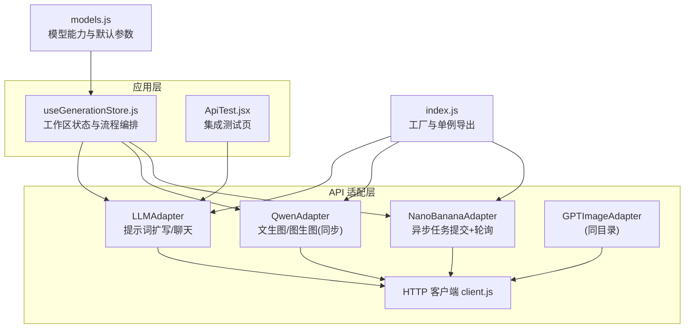

图示来源
- [llm-adapter.js:1-150](file://app/src/services/api/llm-adapter.js#L1-L150)
- [client.js:1-146](file://app/src/services/api/client.js#L1-L146)
- [qwen-adapter.js:1-209](file://app/src/services/api/qwen-adapter.js#L1-L209)
- [nano-banana-adapter.js:1-265](file://app/src/services/api/nano-banana-adapter.js#L1-L265)
- [useGenerationStore.js:1-360](file://app/src/stores/useGenerationStore.js#L1-L360)
- [models.js:1-106](file://app/src/constants/models.js#L1-L106)
- [index.js:1-39](file://app/src/services/api/index.js#L1-L39)

章节来源
- [llm-adapter.js:1-150](file://app/src/services/api/llm-adapter.js#L1-L150)
- [index.js:1-39](file://app/src/services/api/index.js#L1-L39)
- [client.js:1-146](file://app/src/services/api/client.js#L1-L146)
- [qwen-adapter.js:1-209](file://app/src/services/api/qwen-adapter.js#L1-L209)
- [nano-banana-adapter.js:1-265](file://app/src/services/api/nano-banana-adapter.js#L1-L265)
- [models.js:1-106](file://app/src/constants/models.js#L1-L106)
- [useGenerationStore.js:1-360](file://app/src/stores/useGenerationStore.js#L1-L360)
- [ApiTest.jsx:186-203](file://app/src/pages/ApiTest.jsx#L186-L203)

## 核心组件
- LLMAdapter：提供统一文本生成接口，包括提示词扩写与通用聊天；通过单例模式对外暴露。
- HTTP 客户端 client.js：封装 axios，提供重试、超时、取消信号、错误归一化等能力。
- 模型适配器族：QwenAdapter、NanoBananaAdapter、GPTImageAdapter 分别对接不同后端 API。
- 模型配置 models.js：集中定义各模型的能力、尺寸、质量等级与默认参数。
- 工厂与单例 index.js：按 modelId 返回图像生成适配器实例；提供 getLLMAdapter 获取 LLMAdapter 单例。
- 使用方 useGenerationStore.js：在生成流程中调用 LLMAdapter 做提示词扩写，并编排图像生成任务。

章节来源
- [llm-adapter.js:23-149](file://app/src/services/api/llm-adapter.js#L23-L149)
- [client.js:18-146](file://app/src/services/api/client.js#L18-L146)
- [index.js:20-38](file://app/src/services/api/index.js#L20-L38)
- [models.js:8-92](file://app/src/constants/models.js#L8-L92)
- [useGenerationStore.js:295-308](file://app/src/stores/useGenerationStore.js#L295-L308)

## 架构总览
LLM 通用适配器处于“文本侧”的统一入口，负责将用户意图转化为结构化消息体，调用 OpenAI/DashScope 兼容的 chat/completions 接口，并对响应进行解析与标准化。

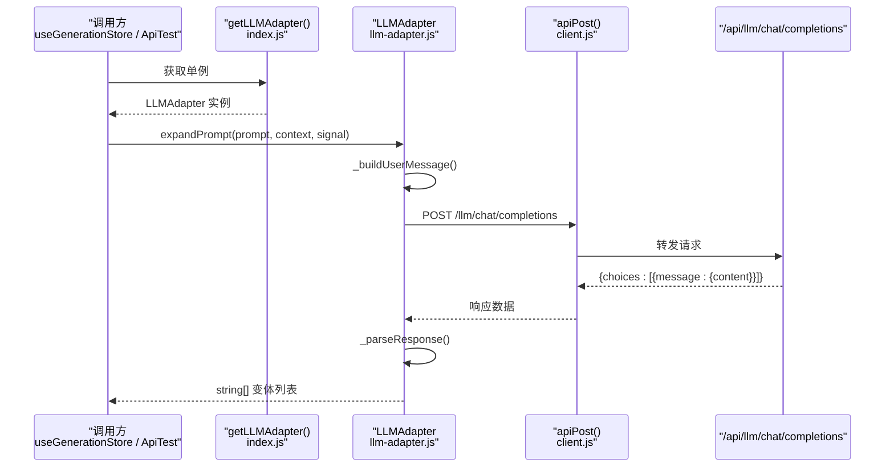

图示来源
- [llm-adapter.js:35-61](file://app/src/services/api/llm-adapter.js#L35-L61)
- [llm-adapter.js:85-122](file://app/src/services/api/llm-adapter.js#L85-L122)
- [client.js:112-116](file://app/src/services/api/client.js#L112-L116)
- [index.js:34-38](file://app/src/services/api/index.js#L34-L38)

## 详细组件分析

### LLMAdapter 类
职责与能力
- 提示词扩写：根据系统提示词与用户输入，构造 messages，调用 chat/completions，返回字符串数组形式的多个高质量变体。
- 通用聊天：接收多轮 messages，返回助手回复文本，便于未来扩展如智能推荐、自动描述等场景。
- 响应标准化：对可能包含 Markdown 代码块或包裹文本的响应进行健壮解析，失败时回退为原始内容。

关键方法
- constructor：从环境变量读取模型名，默认 qwen-max。
- expandPrompt(originalPrompt, context, signal)：构建 system + user 消息，发送请求并解析结果。
- _buildUserMessage(prompt, context)：拼接上下文提示（目标模型、风格偏好、输出语言）。
- _parseResponse(data)：提取 JSON 数组，过滤空项，异常时回退为单元素数组。
- chat(messages, options, signal)：通用聊天接口，返回纯文本。

上下文与参数
- context.model/style/language：用于增强提示词，使扩写更贴合目标模型与风格。
- temperature/max_tokens：控制生成多样性与长度。

取消与错误
- 支持 AbortSignal 传入，底层通过 axios 的 signal 实现请求取消。
- 网络/服务端错误由 client.js 拦截器归一化后抛出，上层可捕获处理。

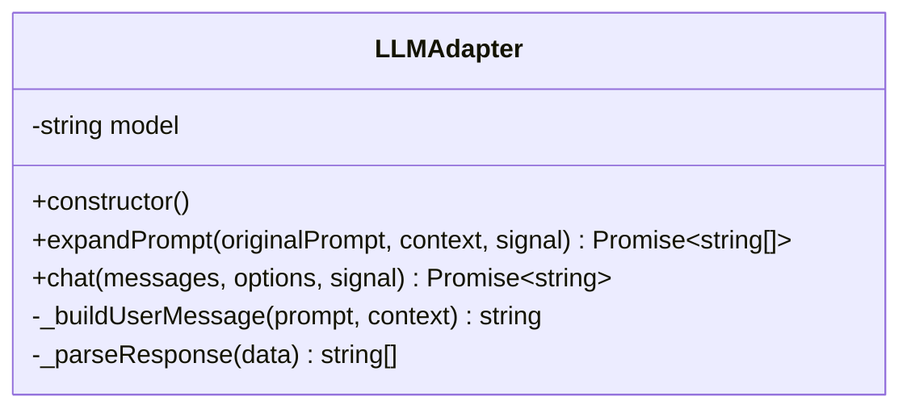

图示来源
- [llm-adapter.js:23-149](file://app/src/services/api/llm-adapter.js#L23-L149)

章节来源
- [llm-adapter.js:23-149](file://app/src/services/api/llm-adapter.js#L23-L149)

### 单例与工厂
- getLLMAdapter()：保证全局仅一个 LLMAdapter 实例，避免重复创建与资源浪费。
- getModelAdapter(modelId)：针对图像生成模型（Qwen/GPT/NanoBanana）返回对应适配器实例。

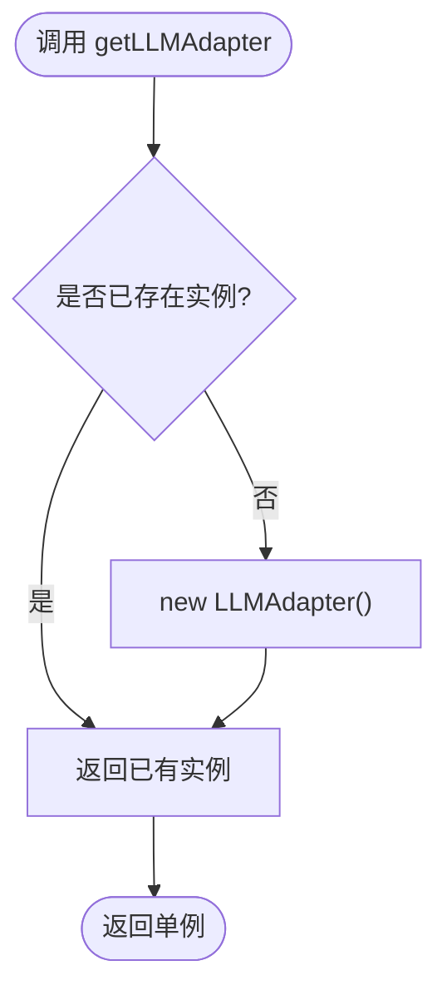

图示来源
- [index.js:34-38](file://app/src/services/api/index.js#L34-L38)

章节来源
- [index.js:20-38](file://app/src/services/api/index.js#L20-L38)

### HTTP 客户端与重试/取消
- apiPost/apiGet：统一封装，自动注入 AbortSignal，支持长耗时请求切换 longRunningClient。
- 重试机制：axios 拦截器内对 5xx/无状态码进行指数退避重试（最多 3 次），也可通过 _noRetry 交由上层自定义重试。
- 错误归一化：将 response.data.message、status、data 等字段规范化，便于上层统一处理。

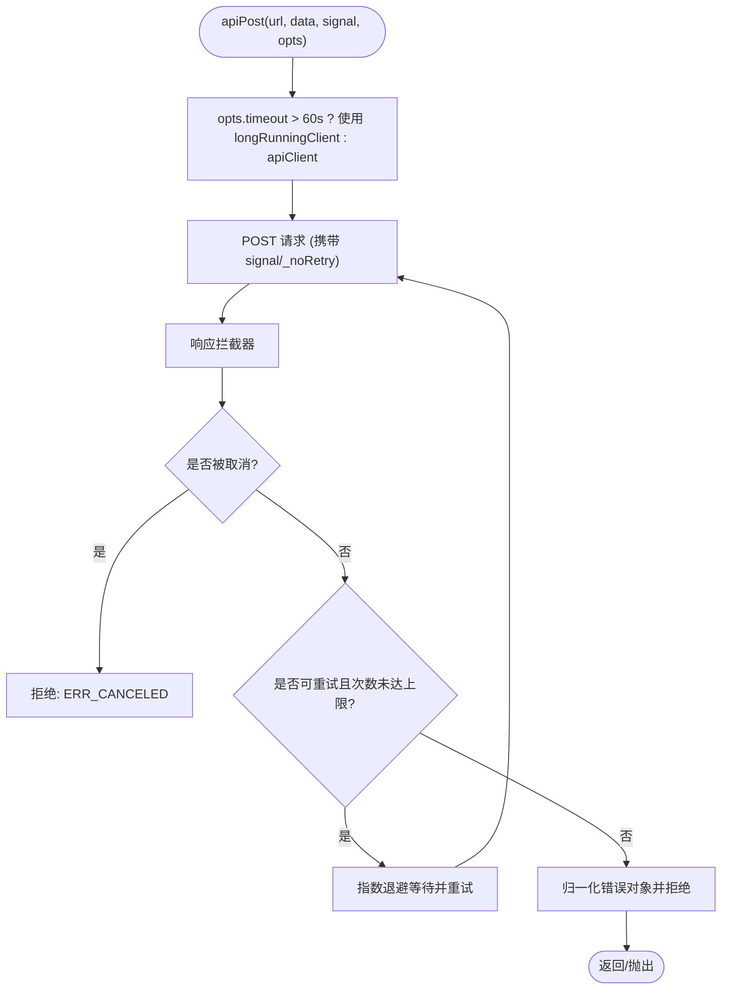

图示来源
- [client.js:112-116](file://app/src/services/api/client.js#L112-L116)
- [client.js:38-85](file://app/src/services/api/client.js#L38-L85)

章节来源
- [client.js:18-146](file://app/src/services/api/client.js#L18-L146)

### 模型选择策略与能力配置
- models.js 集中定义每个模型的 id、名称、提供方、能力开关（如 text2image/image2image/promptExtend/negativePrompt/seedControl）、可选尺寸、质量等级与默认参数。
- useGenerationStore 根据 currentModel 加载默认参数，并在生成前校验 prompt 与参考图数量。
- 工厂函数按 modelId 返回具体适配器实例，屏蔽差异。

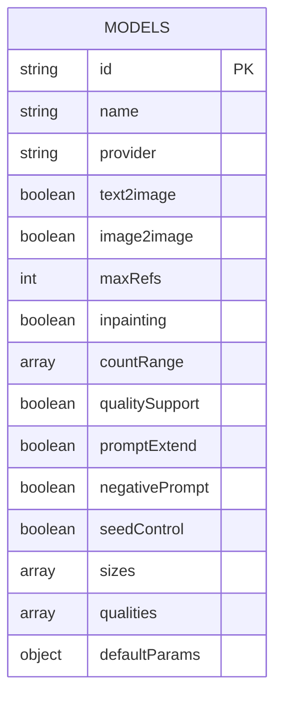

图示来源
- [models.js:8-92](file://app/src/constants/models.js#L8-L92)

章节来源
- [models.js:1-106](file://app/src/constants/models.js#L1-L106)
- [useGenerationStore.js:22-52](file://app/src/stores/useGenerationStore.js#L22-L52)

### 与业务层的协作（提示词扩写）
- useGenerationStore.expandPrompt：获取 LLMAdapter 单例，调用 expandPrompt，并将结果写入 expandedPrompts，供用户选择作为最终提示词。
- ApiTest.jsx：演示直接调用 LLMAdapter 的端到端测试流程。

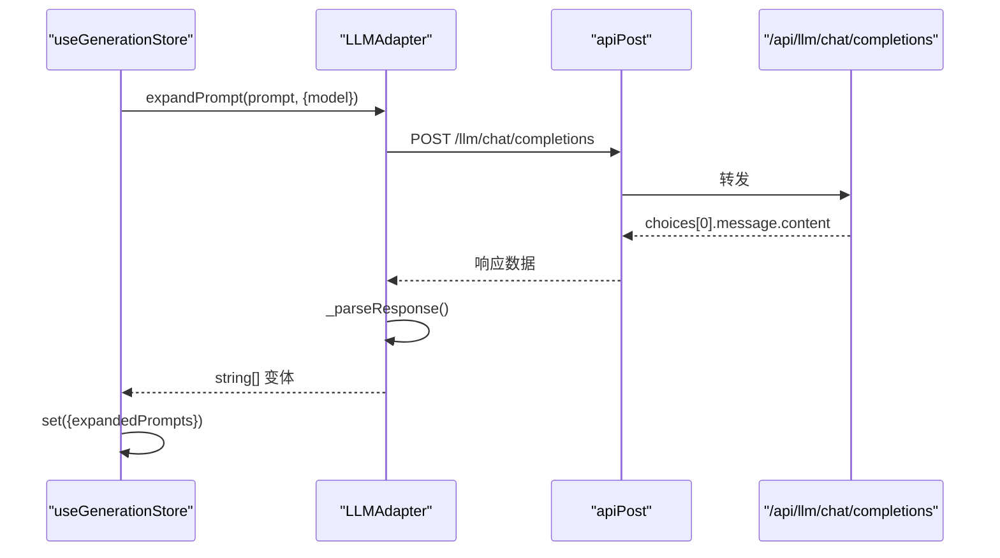

图示来源
- [useGenerationStore.js:295-308](file://app/src/stores/useGenerationStore.js#L295-L308)
- [llm-adapter.js:35-61](file://app/src/services/api/llm-adapter.js#L35-L61)
- [llm-adapter.js:85-122](file://app/src/services/api/llm-adapter.js#L85-L122)
- [client.js:112-116](file://app/src/services/api/client.js#L112-L116)

章节来源
- [useGenerationStore.js:295-308](file://app/src/stores/useGenerationStore.js#L295-L308)
- [ApiTest.jsx:186-203](file://app/src/pages/ApiTest.jsx#L186-L203)

## 依赖关系分析
- LLMAdapter 依赖 client.js 的 apiPost 完成网络请求。
- 工厂 index.js 聚合所有适配器并提供统一入口。
- useGenerationStore 依赖 models.js 的默认参数与能力信息，驱动生成流程。
- QwenAdapter/NanoBananaAdapter 虽属图像生成适配器，但与 LLMAdapter 共同构成“文本→图像”的完整链路。

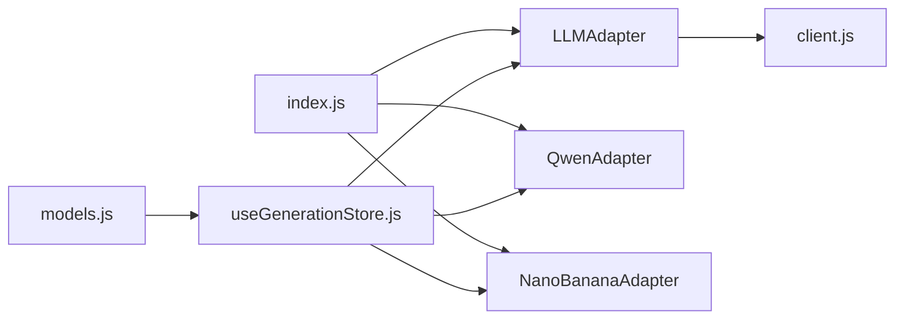

图示来源
- [llm-adapter.js:1-150](file://app/src/services/api/llm-adapter.js#L1-L150)
- [client.js:1-146](file://app/src/services/api/client.js#L1-L146)
- [index.js:1-39](file://app/src/services/api/index.js#L1-L39)
- [qwen-adapter.js:1-209](file://app/src/services/api/qwen-adapter.js#L1-L209)
- [nano-banana-adapter.js:1-265](file://app/src/services/api/nano-banana-adapter.js#L1-L265)
- [useGenerationStore.js:1-360](file://app/src/stores/useGenerationStore.js#L1-L360)
- [models.js:1-106](file://app/src/constants/models.js#L1-L106)

章节来源
- [llm-adapter.js:1-150](file://app/src/services/api/llm-adapter.js#L1-L150)
- [index.js:1-39](file://app/src/services/api/index.js#L1-L39)
- [client.js:1-146](file://app/src/services/api/client.js#L1-L146)
- [useGenerationStore.js:1-360](file://app/src/stores/useGenerationStore.js#L1-L360)
- [models.js:1-106](file://app/src/constants/models.js#L1-L106)

## 性能与可靠性
- 超时与重试：默认 60s 超时，长耗时请求自动切换到 5min 客户端；5xx/网络错误指数退避重试，提升稳定性。
- 取消支持：通过 AbortController 传递 signal，可在用户主动取消时快速中断请求。
- 解析容错：LLMAdapter 对非标准 JSON 包裹具备鲁棒性，失败时回退为原始文本，保障可用性。
- 进度反馈：图像生成适配器提供 onProgress 回调；LLMAdapter 当前为同步返回，可扩展为流式增量更新。

[本节为通用指导，不直接分析具体文件]

## 故障排查指南
常见问题与定位建议
- 请求被取消：检查是否传入了 AbortSignal 并在适当时机调用 cancel(reason)。
- 网络/服务端错误：查看 client.js 拦截器抛出的归一化错误对象中的 status/message/data。
- 解析失败：确认 LLM 返回的 content 是否为合法 JSON 数组；必要时调整 _parseResponse 的容错逻辑。
- 超时：若后端响应慢，考虑增大 timeout 或使用 longRunningClient。

章节来源
- [client.js:38-85](file://app/src/services/api/client.js#L38-L85)
- [llm-adapter.js:85-122](file://app/src/services/api/llm-adapter.js#L85-L122)

## 结论
LLMAdapter 以单例形式提供统一的文本生成接口，结合 client.js 的重试/取消/超时能力，实现了稳定可靠的提示词扩写与通用聊天能力。配合 models.js 的模型能力配置与 useGenerationStore 的流程编排，形成“文本→图像”的完整闭环。当前实现为同步请求，但已预留扩展点，便于后续接入流式响应与会话上下文管理。

[本节为总结性内容，不直接分析具体文件]

## 附录：扩展新模型指南

### 新增图像生成适配器（示例：MyAdapter）
- 新建适配器文件，例如 my-adapter.js，实现 generateText2Image 与 generateImage2Image 两个方法，遵循统一返回格式 { images: [{ url }] }。
- 在 index.js 的 getModelAdapter 中添加映射分支，返回 new MyAdapter()。
- 在 models.js 中补充该模型的 capabilities、sizes、qualities、defaultParams 等信息。
- 在 useGenerationStore 中无需改动即可使用（基于 currentModel 动态选择适配器）。

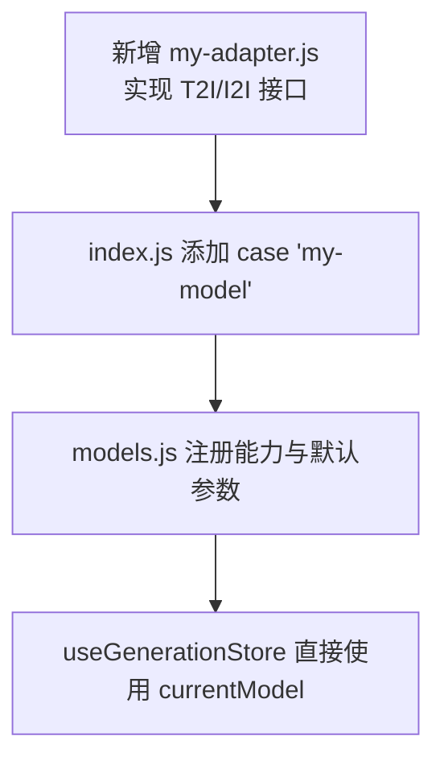

图示来源
- [index.js:20-31](file://app/src/services/api/index.js#L20-L31)
- [models.js:8-92](file://app/src/constants/models.js#L8-L92)
- [useGenerationStore.js:112-187](file://app/src/stores/useGenerationStore.js#L112-L187)

### 扩展 LLMAdapter 的流式响应
- 在 llm-adapter.js 的 expandPrompt/chat 中，将 apiPost 替换为 SSE/ReadableStream 消费方式，逐段追加 token 到本地状态。
- 在调用方（如 useGenerationStore）增加 onToken 回调，实时渲染中间结果。
- 保持 _parseResponse 的容错逻辑，确保最终结果仍为标准数组。

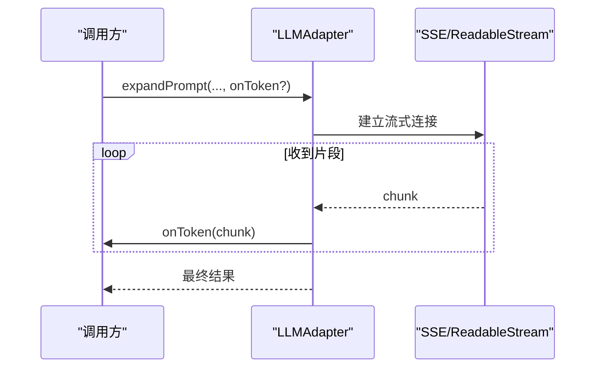

图示来源
- [llm-adapter.js:35-61](file://app/src/services/api/llm-adapter.js#L35-L61)
- [llm-adapter.js:131-148](file://app/src/services/api/llm-adapter.js#L131-L148)

### 会话上下文与状态维护
- 在 LLMAdapter 内部维护 messages 历史，chat 方法追加 role=assistant 的回复，实现简单多轮对话。
- 在 useGenerationStore 中保存会话 ID 与消息列表，刷新后恢复上下文。
- 注意上下文长度与 token 限制，必要时裁剪历史消息。

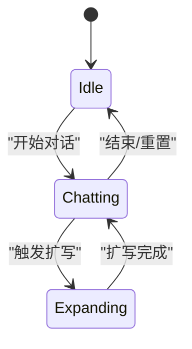

图示来源
- [llm-adapter.js:131-148](file://app/src/services/api/llm-adapter.js#L131-L148)
- [useGenerationStore.js:295-308](file://app/src/stores/useGenerationStore.js#L295-L308)