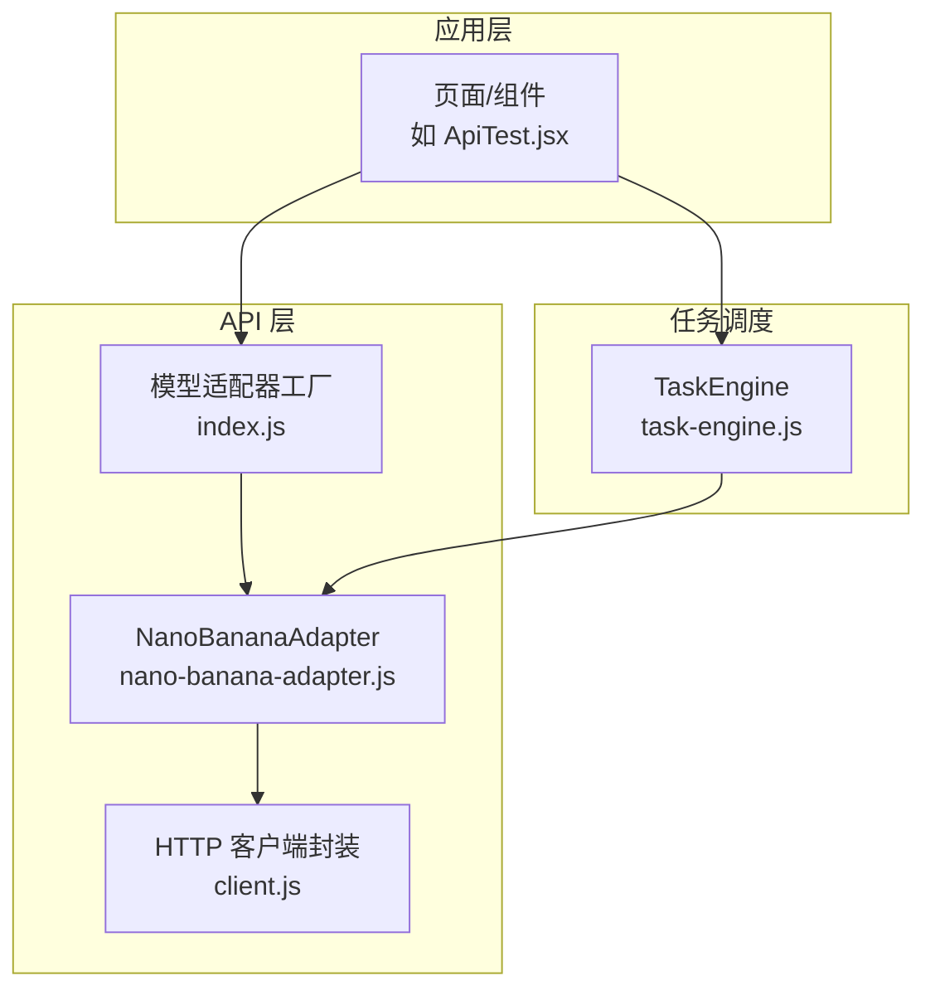
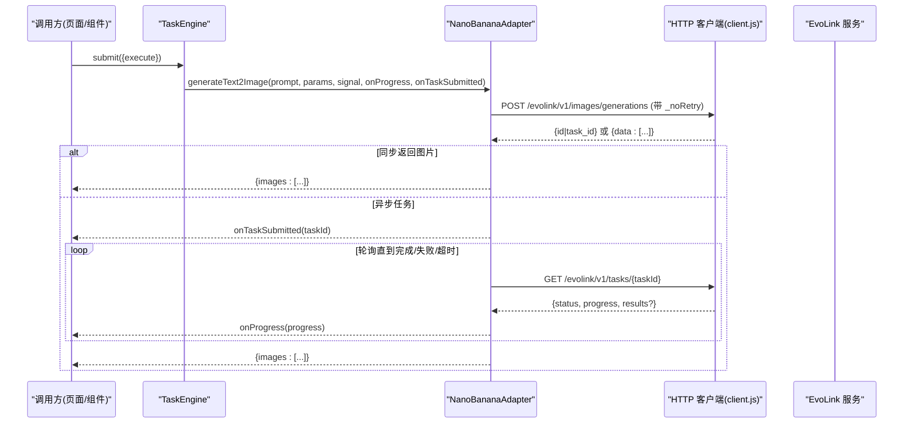
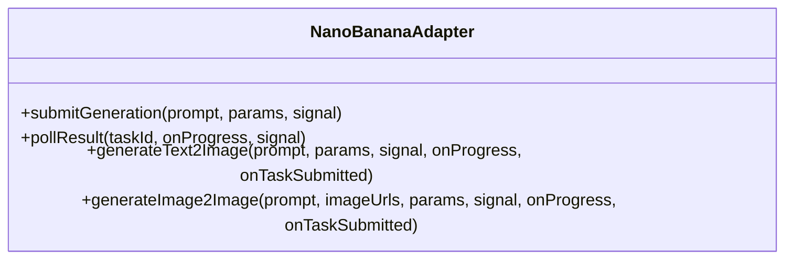
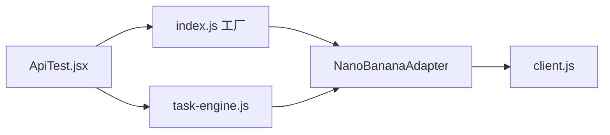
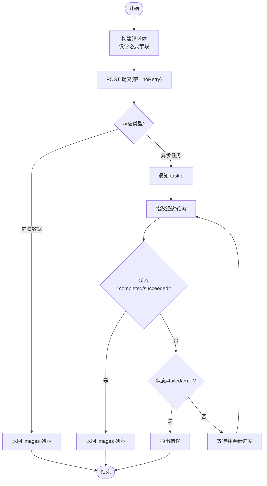

# Nano Banana 适配器

<cite>
**本文引用的文件**
- [app/src/services/api/nano-banana-adapter.js](file://app/src/services/api/nano-banana-adapter.js)
- [app/src/services/api/client.js](file://app/src/services/api/client.js)
- [app/src/services/api/index.js](file://app/src/services/api/index.js)
- [app/src/services/task-engine.js](file://app/src/services/task-engine.js)
- [app/src/pages/ApiTest.jsx](file://app/src/pages/ApiTest.jsx)
</cite>

## 目录
1. [简介](#简介)
2. [项目结构](#项目结构)
3. [核心组件](#核心组件)
4. [架构总览](#架构总览)
5. [详细组件分析](#详细组件分析)
6. [依赖关系分析](#依赖关系分析)
7. [性能与优化](#性能与优化)
8. [故障排查指南](#故障排查指南)
9. [结论](#结论)
10. [附录](#附录)

## 简介
本文件为 Nano Banana 适配器的全面技术文档，聚焦于 NanoBananaAdapter 类对 Nano Banana AI 服务的适配实现。内容涵盖：
- 轻量级 API 调用封装、参数压缩策略
- 异步任务提交与轮询的流式进度反馈
- 重试与退避、错误降级处理
- 与其他适配器的集成方式与使用场景建议
- 性能特征分析与调优建议

## 项目结构
Nano Banana 适配器位于服务层 API 模块中，通过统一的工厂方法对外暴露，并与 HTTP 客户端、任务调度引擎协同工作。

图表来源
- [app/src/services/api/index.js:1-38](file://app/src/services/api/index.js#L1-L38)
- [app/src/services/api/nano-banana-adapter.js:1-264](file://app/src/services/api/nano-banana-adapter.js#L1-L264)
- [app/src/services/api/client.js:1-146](file://app/src/services/api/client.js#L1-L146)
- [app/src/services/task-engine.js:1-319](file://app/src/services/task-engine.js#L1-L319)
- [app/src/pages/ApiTest.jsx:1-57](file://app/src/pages/ApiTest.jsx#L1-L57)

章节来源
- [app/src/services/api/index.js:1-38](file://app/src/services/api/index.js#L1-L38)
- [app/src/services/api/nano-banana-adapter.js:1-264](file://app/src/services/api/nano-banana-adapter.js#L1-L264)
- [app/src/services/api/client.js:1-146](file://app/src/services/api/client.js#L1-L146)
- [app/src/services/task-engine.js:1-319](file://app/src/services/task-engine.js#L1-L319)
- [app/src/pages/ApiTest.jsx:1-57](file://app/src/pages/ApiTest.jsx#L1-L57)

## 核心组件
- NanoBananaAdapter：封装 Nano Banana 2（EvoLink）的文本到图像与图像到图像生成流程，包含提交、轮询、结果解析与进度回调。
- HTTP 客户端 client.js：统一 axios 实例、拦截器、自动重试、取消信号支持。
- 工厂 index.js：按 modelId 返回对应适配器实例，便于上层以统一接口调用不同模型。
- TaskEngine：后台任务队列、并发控制、状态机、持久化与事件通知。

章节来源
- [app/src/services/api/nano-banana-adapter.js:125-264](file://app/src/services/api/nano-banana-adapter.js#L125-L264)
- [app/src/services/api/client.js:18-88](file://app/src/services/api/client.js#L18-L88)
- [app/src/services/api/index.js:20-31](file://app/src/services/api/index.js#L20-L31)
- [app/src/services/task-engine.js:33-81](file://app/src/services/task-engine.js#L33-L81)

## 架构总览
Nano Banana 适配器采用“提交-轮询”异步模式，结合指数退避与超时控制，提供稳定的长耗时任务体验；同时通过 AbortSignal 支持请求取消，配合 TaskEngine 实现可恢复的任务生命周期管理。

图表来源
- [app/src/services/api/nano-banana-adapter.js:125-264](file://app/src/services/api/nano-banana-adapter.js#L125-L264)
- [app/src/services/api/client.js:100-116](file://app/src/services/api/client.js#L100-L116)
- [app/src/services/task-engine.js:222-297](file://app/src/services/task-engine.js#L222-L297)

## 详细组件分析

### NanoBananaAdapter 类
职责与能力
- 文本到图像：submitGeneration + pollResult 组合为 generateText2Image
- 图像到图像：generateImage2Image 支持传入参考图 URL 列表
- 响应解析：兼容多种上游返回格式（id/task_id、inline data、error）
- 进度回调：onProgress(percent)，最大至 90%，完成后置 100%
- 取消支持：通过 AbortSignal 中断提交与轮询

关键方法与行为
- submitGeneration：构造最小必要参数体，仅当 size 非 auto 时附带 size，quality 可选
- pollResult：指数退避轮询，初始间隔 2s，上限 10s，总超时 5 分钟
- parseSubmitResponse：统一解析提交响应，区分异步任务与内联结果
- parseResults：将字符串 URL 或对象 {url,b64_json} 归一化为 {url}
- generateText2Image / generateImage2Image：封装提交与轮询流程，并在需要时触发 onTaskSubmitted

图表来源
- [app/src/services/api/nano-banana-adapter.js:125-264](file://app/src/services/api/nano-banana-adapter.js#L125-L264)

章节来源
- [app/src/services/api/nano-banana-adapter.js:26-47](file://app/src/services/api/nano-banana-adapter.js#L26-L47)
- [app/src/services/api/nano-banana-adapter.js:52-76](file://app/src/services/api/nano-banana-adapter.js#L52-L76)
- [app/src/services/api/nano-banana-adapter.js:82-123](file://app/src/services/api/nano-banana-adapter.js#L82-L123)
- [app/src/services/api/nano-banana-adapter.js:129-152](file://app/src/services/api/nano-banana-adapter.js#L129-L152)
- [app/src/services/api/nano-banana-adapter.js:157-193](file://app/src/services/api/nano-banana-adapter.js#L157-L193)
- [app/src/services/api/nano-banana-adapter.js:199-217](file://app/src/services/api/nano-banana-adapter.js#L199-L217)
- [app/src/services/api/nano-banana-adapter.js:223-263](file://app/src/services/api/nano-banana-adapter.js#L223-L263)

### HTTP 客户端 client.js
- 统一 baseURL=/api，默认超时 60s，提供 longRunningClient（5 分钟）用于同步长耗时接口
- 请求拦截：透传 AbortController.signal
- 响应拦截：
  - 标准化错误对象（message/status/data/originalError）
  - 全局自动重试（最多 3 次，指数退避），可通过 _noRetry 禁用
- 便捷方法：apiGet/apiPost/apiPut/apiDelete/createCancellable

章节来源
- [app/src/services/api/client.js:18-88](file://app/src/services/api/client.js#L18-L88)
- [app/src/services/api/client.js:100-146](file://app/src/services/api/client.js#L100-L146)

### 工厂 index.js
- getModelAdapter(modelId) 根据模型标识返回具体适配器实例
- nanobanana-2 映射到 NanoBananaAdapter

章节来源
- [app/src/services/api/index.js:20-31](file://app/src/services/api/index.js#L20-L31)

### 任务调度 TaskEngine
- 并发控制、FIFO 队列、状态机（queued/running/completed/failed/cancelled/paused）
- 自动重试（网络/5xx）、指数退避、IndexedDB 持久化
- 事件系统：task:queued/started/progress/completed/failed/retry/cancelled/paused
- 浏览器通知：成功/失败通知

章节来源
- [app/src/services/task-engine.js:33-81](file://app/src/services/task-engine.js#L33-L81)
- [app/src/services/task-engine.js:222-297](file://app/src/services/task-engine.js#L222-L297)

## 依赖关系分析
- NanoBananaAdapter 依赖 client.js 的 apiPost/apiGet 进行网络访问
- 上层通过 index.js 的工厂获取适配器实例，屏蔽差异
- TaskEngine 在业务侧组织执行上下文，注入 signal 与 onProgress，驱动适配器执行

图表来源
- [app/src/services/api/index.js:1-38](file://app/src/services/api/index.js#L1-L38)
- [app/src/services/api/nano-banana-adapter.js:1-264](file://app/src/services/api/nano-banana-adapter.js#L1-L264)
- [app/src/services/api/client.js:1-146](file://app/src/services/api/client.js#L1-L146)
- [app/src/services/task-engine.js:1-319](file://app/src/services/task-engine.js#L1-L319)
- [app/src/pages/ApiTest.jsx:1-57](file://app/src/pages/ApiTest.jsx#L1-L57)

章节来源
- [app/src/services/api/index.js:1-38](file://app/src/services/api/index.js#L1-L38)
- [app/src/services/api/nano-banana-adapter.js:1-264](file://app/src/services/api/nano-banana-adapter.js#L1-L264)
- [app/src/services/api/client.js:1-146](file://app/src/services/api/client.js#L1-L146)
- [app/src/services/task-engine.js:1-319](file://app/src/services/task-engine.js#L1-L319)
- [app/src/pages/ApiTest.jsx:1-57](file://app/src/pages/ApiTest.jsx#L1-L57)

## 性能与优化

### 轻量级 API 调用优化
- 参数压缩：仅在 size 非 auto 时附加 size，quality 按需传递，减少冗余字段
- 响应归一化：parseResults 将多形态返回统一为 {url}，避免上层重复判断
- 短路径优先：若提交即返回 inline 结果，直接返回 images，跳过轮询

章节来源
- [app/src/services/api/nano-banana-adapter.js:129-152](file://app/src/services/api/nano-banana-adapter.js#L129-L152)
- [app/src/services/api/nano-banana-adapter.js:119-123](file://app/src/services/api/nano-banana-adapter.js#L119-L123)
- [app/src/services/api/nano-banana-adapter.js:82-114](file://app/src/services/api/nano-banana-adapter.js#L82-L114)

### 批量请求合并与缓存机制
- 当前 NanoBananaAdapter 未内置批量合并与本地缓存逻辑
- 如需批量合并，可在 TaskEngine 层聚合多个相同参数的任务，合并后一次性提交并分发结果
- 如需缓存，可在 adapter 外部增加基于 prompt+params 的键值缓存（注意失效策略）

[本节为通用建议，不直接分析具体文件]

### 错误降级与重试
- 提交阶段：postWithRetry 针对网络错误与 5xx 进行指数退避重试（最多 3 次）
- 轮询阶段：pollWithBackoff 指数退避，最长等待 5 分钟，期间支持取消
- 全局重试：client.js 拦截器提供默认重试，适配器提交时使用 _noRetry 交由自身控制

章节来源
- [app/src/services/api/nano-banana-adapter.js:26-47](file://app/src/services/api/nano-banana-adapter.js#L26-L47)
- [app/src/services/api/nano-banana-adapter.js:52-76](file://app/src/services/api/nano-banana-adapter.js#L52-L76)
- [app/src/services/api/client.js:56-84](file://app/src/services/api/client.js#L56-L84)

### 与其他适配器的对比与建议
- 与 GPT-image-2/Qwen Image 3 相比，Nano Banana 2 走 EvoLink 异步任务模式，更适合长时间生成任务
- 适用场景：
  - 需要稳定长耗时任务的文生图/图生图
  - 需要进度反馈与可取消的交互体验
  - 对稳定性要求高，需具备重试与退避能力的生产环境
- 不适用场景：
  - 强实时性、低延迟要求的即时预览
  - 无后端代理、直连受限的网络环境（需确保 /api 路由可达）

[本节为概念性对比，不直接分析具体文件]

## 故障排查指南
常见问题与定位要点
- 提交失败（网络/5xx）：检查 postWithRetry 的重试日志与 status，确认是否命中可重试条件
- 轮询超时：确认 pollWithBackoff 总超时时间设置与 onProgress 回调是否正常触发
- 响应格式异常：查看 parseSubmitResponse 的 keys 输出，确认上游返回是否符合 id/task_id 或 data 数组
- 取消无效：确认调用方是否正确传入 AbortController.signal，且未被覆盖
- 任务被 TaskEngine 重试：检查 _isRetryableError 判定与数据库中的 retryCount

章节来源
- [app/src/services/api/nano-banana-adapter.js:26-47](file://app/src/services/api/nano-banana-adapter.js#L26-L47)
- [app/src/services/api/nano-banana-adapter.js:52-76](file://app/src/services/api/nano-banana-adapter.js#L52-L76)
- [app/src/services/api/nano-banana-adapter.js:82-114](file://app/src/services/api/nano-banana-adapter.js#L82-L114)
- [app/src/services/api/client.js:56-84](file://app/src/services/api/client.js#L56-L84)
- [app/src/services/task-engine.js:299-305](file://app/src/services/task-engine.js#L299-L305)

## 结论
NanoBananaAdapter 以简洁的参数压缩、稳健的异步轮询与完善的错误重试机制，提供了对 Nano Banana 2 的高可用适配。结合 TaskEngine 的并发与持久化能力，适合在生产环境中承载长耗时图像生成任务。对于批量与缓存需求，建议在业务层扩展，保持适配器本身的单一职责与可测试性。

[本节为总结性内容，不直接分析具体文件]

## 附录

### 关键流程图：提交与轮询

图表来源
- [app/src/services/api/nano-banana-adapter.js:82-123](file://app/src/services/api/nano-banana-adapter.js#L82-L123)
- [app/src/services/api/nano-banana-adapter.js:157-193](file://app/src/services/api/nano-banana-adapter.js#L157-L193)