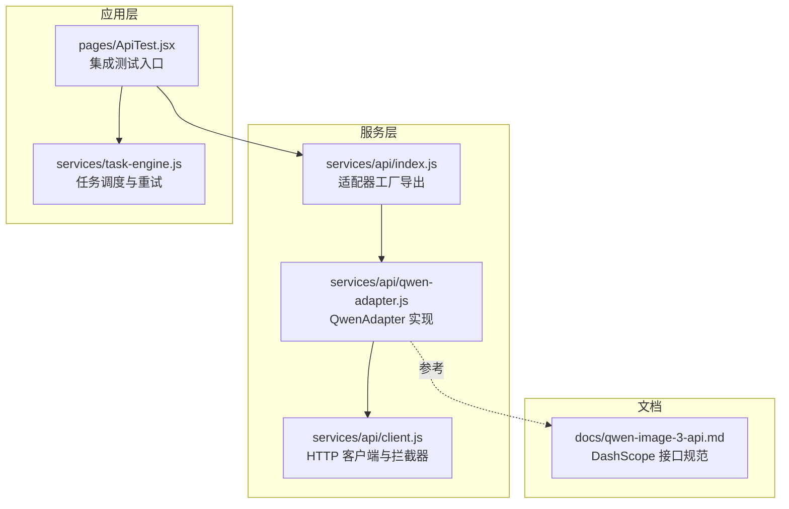
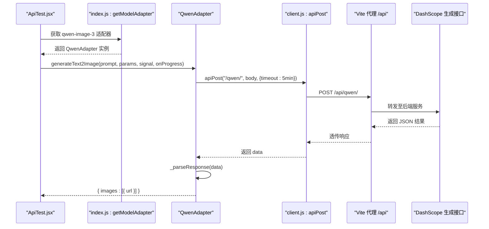
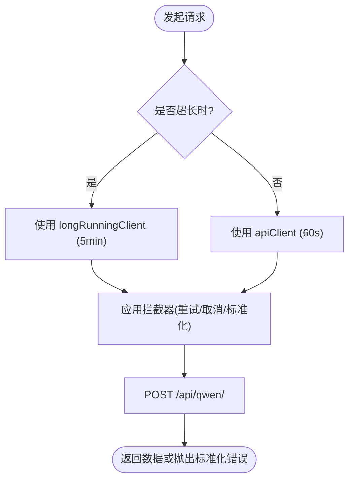
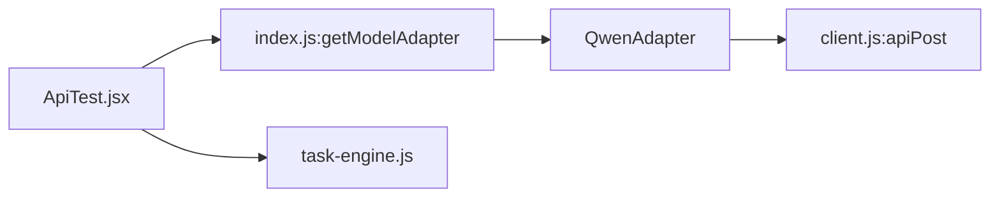
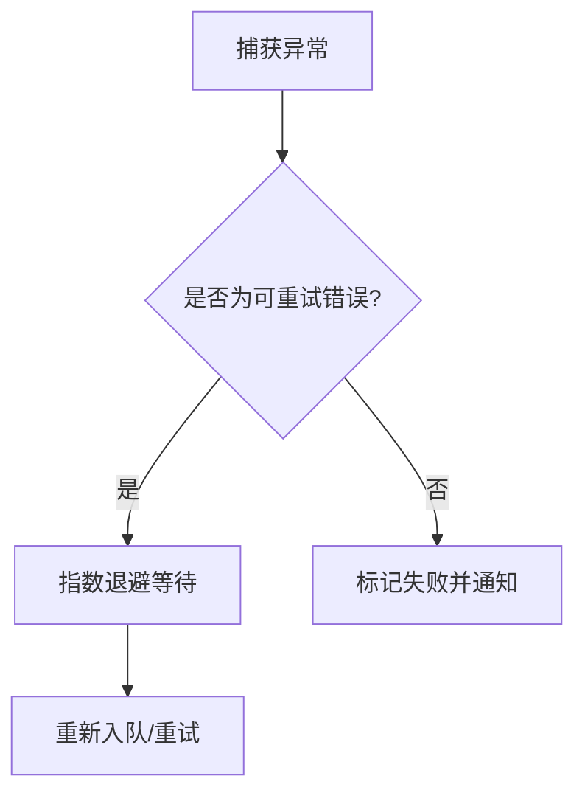

# Qwen 图像生成适配器

<cite>
**本文引用的文件**
- [qwen-adapter.js](file://app/src/services/api/qwen-adapter.js)
- [client.js](file://app/src/services/api/client.js)
- [index.js](file://app/src/services/api/index.js)
- [qwen-image-3-api.md](file://docs/qwen-image-3-api.md)
- [ApiTest.jsx](file://app/src/pages/ApiTest.jsx)
- [task-engine.js](file://app/src/services/task-engine.js)
</cite>

## 目录
1. [简介](#简介)
2. [项目结构](#项目结构)
3. [核心组件](#核心组件)
4. [架构总览](#架构总览)
5. [详细组件分析](#详细组件分析)
6. [依赖关系分析](#依赖关系分析)
7. [性能与超时特性](#性能与超时特性)
8. [错误码与重试机制](#错误码与重试机制)
9. [调用示例](#调用示例)
10. [常见问题排查](#常见问题排查)
11. [结论](#结论)

## 简介
本文件为 Qwen 图像生成适配器的完整技术文档，聚焦于 QwenAdapter 类如何对接通义千问（DashScope）图像生成 API。内容涵盖：
- 模型参数映射与提示词格式转换
- 图片上传处理（I2I 场景）
- 响应数据解析
- 支持的图像生成参数（尺寸、风格、质量等）
- 错误码处理与重试策略
- 完整的调用示例与常见问题解决方案

Qwen 的图像生成接口为同步返回模式，但生成耗时较长（通常数十秒到数分钟），因此适配器采用长超时策略并配合任务引擎进行进度反馈与重试管理。

## 项目结构
与 Qwen 适配器相关的代码主要位于 services/api 层，并通过统一的工厂方法对外暴露；API 文档位于 docs 目录；测试页面在 pages 中提供端到端验证。



图表来源
- [qwen-adapter.js:1-209](file://app/src/services/api/qwen-adapter.js#L1-L209)
- [client.js:1-146](file://app/src/services/api/client.js#L1-L146)
- [index.js:1-39](file://app/src/services/api/index.js#L1-L39)
- [qwen-image-3-api.md:1-221](file://docs/qwen-image-3-api.md#L1-L221)
- [ApiTest.jsx:1-391](file://app/src/pages/ApiTest.jsx#L1-L391)
- [task-engine.js:1-319](file://app/src/services/task-engine.js#L1-L319)

章节来源
- [qwen-adapter.js:1-209](file://app/src/services/api/qwen-adapter.js#L1-L209)
- [client.js:1-146](file://app/src/services/api/client.js#L1-L146)
- [index.js:1-39](file://app/src/services/api/index.js#L1-L39)
- [qwen-image-3-api.md:1-221](file://docs/qwen-image-3-api.md#L1-L221)
- [ApiTest.jsx:1-391](file://app/src/pages/ApiTest.jsx#L1-L391)
- [task-engine.js:1-319](file://app/src/services/task-engine.js#L1-L319)

## 核心组件
- QwenAdapter：封装 DashScope 文生图（T2I）与图生图（I2I）能力，负责参数校验、请求体构造、响应解析与错误提取。
- HTTP 客户端（client.js）：基于 axios 的统一请求封装，包含自动重试、取消信号支持、长连接客户端用于同步长耗时接口。
- 适配器工厂（index.js）：根据 modelId 返回对应适配器实例，统一对外暴露。
- 任务引擎（task-engine.js）：提供并发控制、状态机、指数退避重试、进度上报与持久化。
- API 文档（qwen-image-3-api.md）：定义 DashScope 接口的请求/响应结构与参数说明。

章节来源
- [qwen-adapter.js:1-209](file://app/src/services/api/qwen-adapter.js#L1-L209)
- [client.js:1-146](file://app/src/services/api/client.js#L1-L146)
- [index.js:1-39](file://app/src/services/api/index.js#L1-L39)
- [task-engine.js:1-319](file://app/src/services/task-engine.js#L1-L319)
- [qwen-image-3-api.md:1-221](file://docs/qwen-image-3-api.md#L1-L221)

## 架构总览
下图展示了从 UI 测试页到 QwenAdapter 再到 DashScope 的完整调用链路，以及任务引擎对进度与重试的参与。



图表来源
- [ApiTest.jsx:86-117](file://app/src/pages/ApiTest.jsx#L86-L117)
- [index.js:20-31](file://app/src/services/api/index.js#L20-L31)
- [qwen-adapter.js:60-105](file://app/src/services/api/qwen-adapter.js#L60-L105)
- [client.js:112-116](file://app/src/services/api/client.js#L112-L116)

## 详细组件分析

### QwenAdapter 类
- 职责
  - 将上层业务参数映射为 DashScope 请求体
  - 规范化尺寸（T2I 按 16 倍数，I2I 按 32 倍数）
  - 构建 T2I/I2I 的 content/messages 结构
  - 解析响应中的图片 URL 列表
  - 提取 DashScope 错误信息并抛出友好错误
- 关键方法与流程
  - generateText2Image：构造 T2I 请求体，调用 apiPost，解析响应
  - generateImage2Image：校验输入图数量（最多 3 张），构造 I2I 请求体，调用 apiPost，解析响应
  - _parseResponse：遍历 choices -> message.content，收集 image 字段
  - normaliseSize：确保宽高符合倍数约束
  - extractDashScopeError：从标准化错误对象中提取 code/message/request_id

```mermaid
classDiagram
class QwenAdapter {
+generateText2Image(prompt, params, signal, onProgress) Promise~{images}~
+generateImage2Image(prompt, imageUrls, params, signal, onProgress) Promise~{images}~
-_parseResponse(data) {images}
-normaliseSize(size, base) string
-extractDashScopeError(data) string|null
}
```

图表来源
- [qwen-adapter.js:28-49](file://app/src/services/api/qwen-adapter.js#L28-L49)
- [qwen-adapter.js:60-105](file://app/src/services/api/qwen-adapter.js#L60-L105)
- [qwen-adapter.js:116-173](file://app/src/services/api/qwen-adapter.js#L116-L173)
- [qwen-adapter.js:179-207](file://app/src/services/api/qwen-adapter.js#L179-L207)

章节来源
- [qwen-adapter.js:1-209](file://app/src/services/api/qwen-adapter.js#L1-L209)

#### 参数映射与提示词格式转换
- 通用参数
  - prompt_extend：是否开启提示词智能改写（默认 true）
  - prompt_extend_mode：改写方式（默认 "direct"）
  - n：输出图片数量（默认 1）
  - size：分辨率字符串 "宽*高"（T2I 需为 16 的倍数，I2I 需为 32 的倍数）
  - negative_prompt：反向提示词（默认空串）
  - watermark：是否添加水印（默认 false）
  - seed：随机种子（非负整数时传入，否则省略由服务端随机）
- T2I 请求体
  - model：预置 T2I 模型名
  - input.messages[0].content：仅包含一个 text 对象
- I2I 请求体
  - model：预置 I2I 模型名
  - input.messages[0].content：先若干 image 对象（URL），再一个 text 对象

章节来源
- [qwen-adapter.js:60-88](file://app/src/services/api/qwen-adapter.js#L60-L88)
- [qwen-adapter.js:125-156](file://app/src/services/api/qwen-adapter.js#L125-L156)
- [qwen-image-3-api.md:124-144](file://docs/qwen-image-3-api.md#L124-L144)

#### 图片上传处理（I2I）
- 支持 1-3 张参考图，超过 3 张会被截断
- 图片以公网 URL（HTTP/HTTPS）、OSS 临时链接或 Base64 形式传入
- 建议图片尺寸 384~2048 像素，文件大小不超过 10MB

章节来源
- [qwen-adapter.js:116-143](file://app/src/services/api/qwen-adapter.js#L116-L143)
- [qwen-image-3-api.md:104-121](file://docs/qwen-image-3-api.md#L104-L121)

#### 响应数据解析
- 成功响应结构
  - output.choices[].message.content[] 中包含 image 字段即为图片 URL
- 解析逻辑
  - 遍历 choices，收集所有 content 项中的 image 值，返回统一格式 { images: [{ url }] }
- 注意事项
  - 返回的图片 URL 有效期约 24 小时，调用方应及时下载并缓存

章节来源
- [qwen-adapter.js:179-207](file://app/src/services/api/qwen-adapter.js#L179-L207)
- [qwen-image-3-api.md:147-188](file://docs/qwen-image-3-api.md#L147-L188)

### HTTP 客户端与长连接
- 基础客户端
  - baseURL 指向 /api，通过 Vite 代理转发
  - 默认超时 60s
- 长连接客户端
  - 针对同步长耗时接口（如 Qwen 图像生成）使用 5 分钟超时
- 拦截器
  - 自动重试：网络错误或 5xx 状态码时指数退避重试（最多 3 次）
  - 取消支持：AbortController 信号透传
  - 错误标准化：将 response.data.message 等归一化为标准错误对象



图表来源
- [client.js:18-33](file://app/src/services/api/client.js#L18-L33)
- [client.js:38-88](file://app/src/services/api/client.js#L38-L88)
- [client.js:112-116](file://app/src/services/api/client.js#L112-L116)

章节来源
- [client.js:1-146](file://app/src/services/api/client.js#L1-L146)

### 适配器工厂与导出
- 通过 getModelAdapter(modelId) 返回具体适配器实例
- 当前支持 'qwen-image-3' 返回 QwenAdapter

章节来源
- [index.js:20-31](file://app/src/services/api/index.js#L20-L31)

## 依赖关系分析
- QwenAdapter 依赖 client.js 的 apiPost 发送请求
- ApiTest.jsx 通过 index.js 的工厂方法获取 QwenAdapter 并执行测试
- TaskEngine 提供任务队列、并发控制与重试，与适配器解耦



图表来源
- [ApiTest.jsx:86-117](file://app/src/pages/ApiTest.jsx#L86-L117)
- [index.js:20-31](file://app/src/services/api/index.js#L20-L31)
- [qwen-adapter.js:60-105](file://app/src/services/api/qwen-adapter.js#L60-L105)
- [client.js:112-116](file://app/src/services/api/client.js#L112-L116)
- [task-engine.js:57-81](file://app/src/services/task-engine.js#L57-L81)

章节来源
- [ApiTest.jsx:1-391](file://app/src/pages/ApiTest.jsx#L1-L391)
- [index.js:1-39](file://app/src/services/api/index.js#L1-L39)
- [qwen-adapter.js:1-209](file://app/src/services/api/qwen-adapter.js#L1-L209)
- [client.js:1-146](file://app/src/services/api/client.js#L1-L146)
- [task-engine.js:1-319](file://app/src/services/task-engine.js#L1-L319)

## 性能与超时特性
- 同步长耗时接口
  - Qwen 图像生成属于同步返回，但耗时可达 30s–120s+，适配器使用 5 分钟超时避免误判
- 进度回调
  - 适配器在请求前、成功后、解析后分别触发 onProgress(10/90/100)，便于 UI 展示
- 并发与队列
  - TaskEngine 默认最大并发 3，FIFO 队列，失败可指数退避重试（最多 3 次）

章节来源
- [qwen-adapter.js:20-21](file://app/src/services/api/qwen-adapter.js#L20-L21)
- [qwen-adapter.js:90-104](file://app/src/services/api/qwen-adapter.js#L90-L104)
- [qwen-adapter.js:158-172](file://app/src/services/api/qwen-adapter.js#L158-L172)
- [task-engine.js:33-48](file://app/src/services/task-engine.js#L33-L48)
- [task-engine.js:269-292](file://app/src/services/task-engine.js#L269-L292)

## 错误码与重试机制
- DashScope 错误格式
  - 典型结构包含 code、message、request_id
  - 适配器会提取这些字段并包装为友好错误信息
- 客户端重试
  - 当出现网络错误或 5xx 状态码时，自动重试（指数退避，最多 3 次）
  - 可通过 _noRetry 禁用客户端层重试（由上层自行处理）
- 任务级重试
  - TaskEngine 对可重试错误（5xx、网络错误）进行指数退避重试（最多 3 次）
  - 失败后将状态更新为 failed，并提供手动重试能力



图表来源
- [qwen-adapter.js:41-49](file://app/src/services/api/qwen-adapter.js#L41-L49)
- [client.js:51-84](file://app/src/services/api/client.js#L51-L84)
- [task-engine.js:299-305](file://app/src/services/task-engine.js#L299-L305)

章节来源
- [qwen-adapter.js:41-49](file://app/src/services/api/qwen-adapter.js#L41-L49)
- [client.js:51-84](file://app/src/services/api/client.js#L51-L84)
- [task-engine.js:269-305](file://app/src/services/task-engine.js#L269-L305)
- [qwen-image-3-api.md:203-212](file://docs/qwen-image-3-api.md#L203-L212)

## 调用示例
以下示例来自集成测试页面，演示如何通过工厂方法获取 QwenAdapter 并调用 T2I 接口。

- 获取适配器
  - 使用 getModelAdapter('qwen-image-3') 返回 QwenAdapter 实例
- 调用 T2I
  - 调用 adapter.generateText2Image(prompt, { size: '1024*1024', n: 1 }, ctx.signal, onProgress)
  - 返回 { images: [{ url }] }，可在 UI 中直接渲染图片

章节来源
- [ApiTest.jsx:86-117](file://app/src/pages/ApiTest.jsx#L86-L117)
- [index.js:20-31](file://app/src/services/api/index.js#L20-L31)

## 常见问题排查
- 尺寸不合法
  - 现象：请求被拒绝或返回错误
  - 原因：size 未满足倍数约束（T2I 需 16 的倍数，I2I 需 32 的倍数）
  - 解决：使用 normaliseSize 自动对齐，或传入合规尺寸
- 图片数量超限
  - 现象：I2I 报错或忽略多余图片
  - 原因：仅支持 1-3 张参考图
  - 解决：限制输入数组长度不超过 3
- 图片 URL 失效
  - 现象：图片无法加载
  - 原因：返回的 URL 有效期约 24 小时
  - 解决：及时下载并本地缓存
- 超时
  - 现象：请求长时间无响应
  - 原因：生成耗时较长
  - 解决：确认使用长连接客户端（5 分钟超时），并在 UI 显示进度
- 认证错误
  - 现象：返回 InvalidApiKey 等错误
  - 原因：API Key 无效或未配置
  - 解决：检查代理与鉴权头配置
- 网络错误与服务端错误
  - 现象：网络中断或 5xx 错误
  - 原因：网络不稳定或服务端异常
  - 解决：启用客户端与任务级重试，必要时人工重试

章节来源
- [qwen-adapter.js:28-35](file://app/src/services/api/qwen-adapter.js#L28-L35)
- [qwen-adapter.js:116-123](file://app/src/services/api/qwen-adapter.js#L116-L123)
- [qwen-image-3-api.md:188-189](file://docs/qwen-image-3-api.md#L188-L189)
- [client.js:51-84](file://app/src/services/api/client.js#L51-L84)
- [task-engine.js:269-305](file://app/src/services/task-engine.js#L269-L305)
- [qwen-image-3-api.md:203-212](file://docs/qwen-image-3-api.md#L203-L212)

## 结论
QwenAdapter 以简洁清晰的接口封装了 DashScope 图像生成的复杂细节，包括参数映射、提示词与图片内容组装、响应解析与错误提取。结合长连接客户端与任务引擎，系统实现了稳定的长耗时任务执行、进度反馈与重试保障。遵循尺寸与图片数量约束、及时处理图片 URL 过期问题，可有效提升整体稳定性与用户体验。