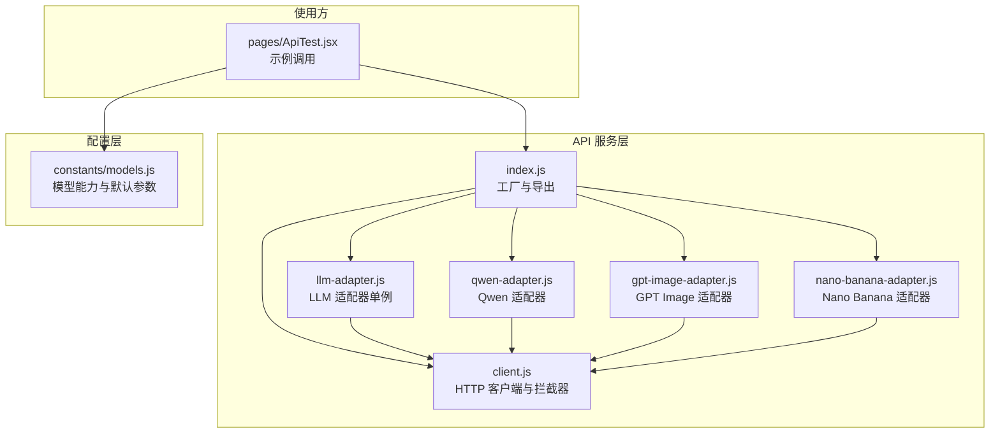
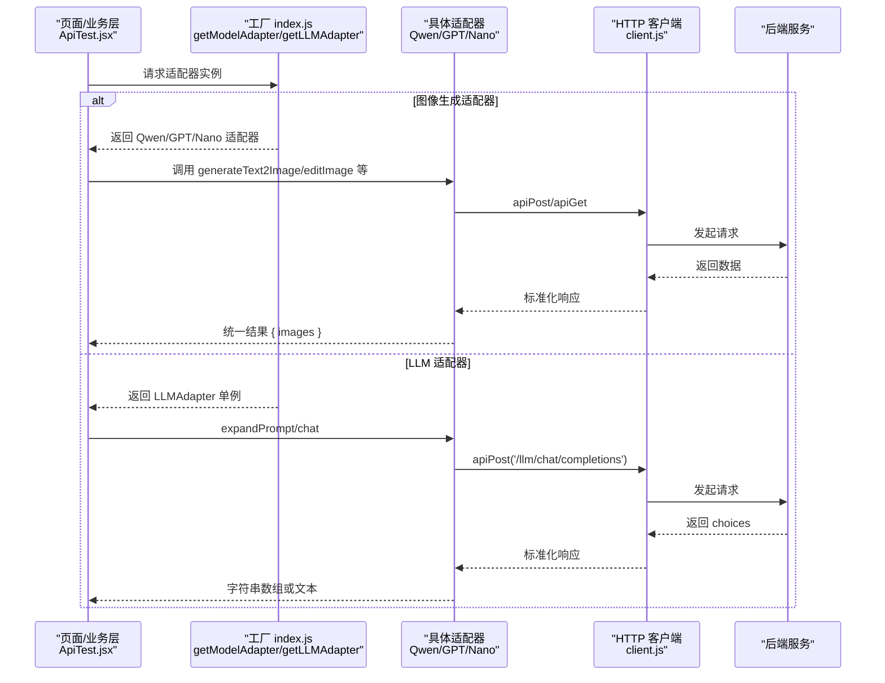
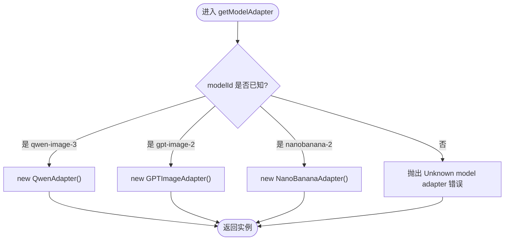
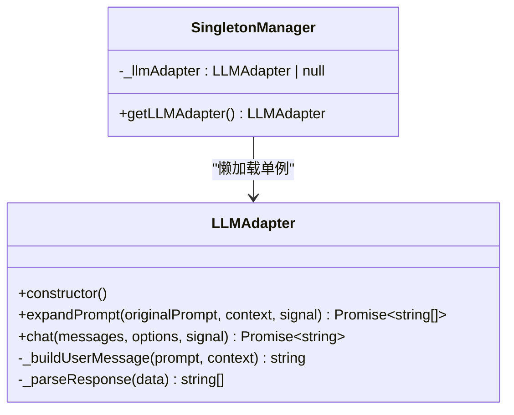
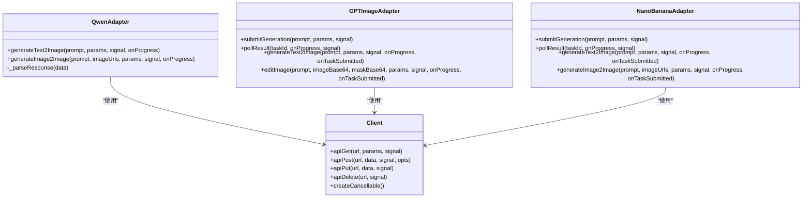
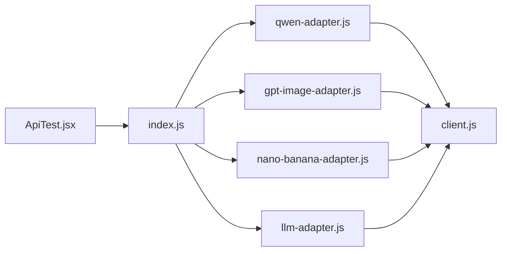

# 适配器工厂模式

<cite>
**本文引用的文件**
- [app/src/services/api/index.js](file://app/src/services/api/index.js)
- [app/src/services/api/llm-adapter.js](file://app/src/services/api/llm-adapter.js)
- [app/src/services/api/qwen-adapter.js](file://app/src/services/api/qwen-adapter.js)
- [app/src/services/api/gpt-image-adapter.js](file://app/src/services/api/gpt-image-adapter.js)
- [app/src/services/api/nano-banana-adapter.js](file://app/src/services/api/nano-banana-adapter.js)
- [app/src/services/api/client.js](file://app/src/services/api/client.js)
- [app/src/constants/models.js](file://app/src/constants/models.js)
- [app/src/pages/ApiTest.jsx](file://app/src/pages/ApiTest.jsx)
</cite>

## 目录
1. [简介](#简介)
2. [项目结构](#项目结构)
3. [核心组件](#核心组件)
4. [架构总览](#架构总览)
5. [详细组件分析](#详细组件分析)
6. [依赖关系分析](#依赖关系分析)
7. [性能与可靠性](#性能与可靠性)
8. [故障排查指南](#故障排查指南)
9. [结论](#结论)
10. [附录：新增模型适配器的步骤与最佳实践](#附录新增模型适配器的步骤与最佳实践)

## 简介
本文件围绕“适配器工厂模式”在图像生成系统中的设计与实现，系统性说明以下要点：
- getModelAdapter 工厂函数如何根据模型 ID 动态创建对应适配器实例
- 工厂模式的优点、扩展机制与类型安全保障
- getLLMAdapter 单例管理器的实现原理与生命周期管理
- 添加新模型适配器的完整步骤与最佳实践

该设计将不同后端模型的差异封装到各自适配器中，上层业务通过统一的工厂获取具体适配器，从而获得一致的调用体验。

## 项目结构
与适配器工厂相关的代码集中在 services/api 目录，配合 constants/models 中的模型配置常量，形成“配置 + 工厂 + 适配器 + HTTP 客户端”的分层结构。

图示来源
- [app/src/services/api/index.js:1-39](file://app/src/services/api/index.js#L1-L39)
- [app/src/services/api/llm-adapter.js:1-150](file://app/src/services/api/llm-adapter.js#L1-L150)
- [app/src/services/api/qwen-adapter.js:1-209](file://app/src/services/api/qwen-adapter.js#L1-L209)
- [app/src/services/api/gpt-image-adapter.js:1-336](file://app/src/services/api/gpt-image-adapter.js#L1-L336)
- [app/src/services/api/nano-banana-adapter.js:1-265](file://app/src/services/api/nano-banana-adapter.js#L1-L265)
- [app/src/services/api/client.js:1-146](file://app/src/services/api/client.js#L1-L146)
- [app/src/constants/models.js:1-106](file://app/src/constants/models.js#L1-L106)
- [app/src/pages/ApiTest.jsx:1-219](file://app/src/pages/ApiTest.jsx#L1-L219)

章节来源
- [app/src/services/api/index.js:1-39](file://app/src/services/api/index.js#L1-L39)
- [app/src/constants/models.js:1-106](file://app/src/constants/models.js#L1-L106)

## 核心组件
- 工厂函数：getModelAdapter(modelId)
  - 依据 modelId 返回对应的适配器实例
  - 未知 modelId 抛出错误，便于快速发现配置问题
- 单例管理器：getLLMAdapter()
  - 全局唯一 LLMAdapter 实例，用于提示词扩写与通用对话
- 适配器类
  - QwenAdapter：同步长耗时接口，内部处理尺寸对齐、超时与响应解析
  - GPTImageAdapter：异步任务提交+轮询，含重试与指数退避
  - NanoBananaAdapter：异步任务提交+轮询，策略同上
  - LLMAdapter：基于 OpenAI 风格 /api/llm/chat/completions 的提示词扩写
- HTTP 客户端：client.js
  - 统一 baseURL、自动重试、取消信号支持、长连接客户端

章节来源
- [app/src/services/api/index.js:15-38](file://app/src/services/api/index.js#L15-L38)
- [app/src/services/api/llm-adapter.js:23-149](file://app/src/services/api/llm-adapter.js#L23-L149)
- [app/src/services/api/qwen-adapter.js:51-208](file://app/src/services/api/qwen-adapter.js#L51-L208)
- [app/src/services/api/gpt-image-adapter.js:156-335](file://app/src/services/api/gpt-image-adapter.js#L156-L335)
- [app/src/services/api/nano-banana-adapter.js:125-264](file://app/src/services/api/nano-banana-adapter.js#L125-L264)
- [app/src/services/api/client.js:1-146](file://app/src/services/api/client.js#L1-L146)

## 架构总览
下图展示从页面调用到各适配器与 HTTP 客户端的交互路径。

图示来源
- [app/src/pages/ApiTest.jsx:186-203](file://app/src/pages/ApiTest.jsx#L186-L203)
- [app/src/services/api/index.js:20-38](file://app/src/services/api/index.js#L20-L38)
- [app/src/services/api/qwen-adapter.js:60-105](file://app/src/services/api/qwen-adapter.js#L60-L105)
- [app/src/services/api/gpt-image-adapter.js:164-190](file://app/src/services/api/gpt-image-adapter.js#L164-L190)
- [app/src/services/api/nano-banana-adapter.js:129-152](file://app/src/services/api/nano-banana-adapter.js#L129-L152)
- [app/src/services/api/llm-adapter.js:35-61](file://app/src/services/api/llm-adapter.js#L35-L61)
- [app/src/services/api/client.js:112-116](file://app/src/services/api/client.js#L112-L116)

## 详细组件分析

### 工厂函数：getModelAdapter
- 职责：根据 modelId 返回对应适配器实例；未知 ID 抛错
- 行为特征：
  - 简单分支映射，清晰直观
  - 失败即抛，利于早期暴露配置错误
- 类型安全建议：
  - 使用 JSDoc 标注入参与返回值类型，辅助 IDE 推断
  - 可结合常量 MODEL_ORDER 与 MODELS 做白名单校验

图示来源
- [app/src/services/api/index.js:20-31](file://app/src/services/api/index.js#L20-L31)
- [app/src/constants/models.js:95-106](file://app/src/constants/models.js#L95-L106)

章节来源
- [app/src/services/api/index.js:15-31](file://app/src/services/api/index.js#L15-L31)
- [app/src/constants/models.js:95-106](file://app/src/constants/models.js#L95-L106)

### 单例管理器：getLLMAdapter
- 职责：提供全局唯一的 LLMAdapter 实例，避免重复创建
- 生命周期：
  - 首次调用时初始化并缓存
  - 后续调用直接返回缓存实例
  - 应用级生命周期，随模块加载而存在
- 适用场景：提示词扩写、通用对话等无状态或轻量状态服务

图示来源
- [app/src/services/api/index.js:33-38](file://app/src/services/api/index.js#L33-L38)
- [app/src/services/api/llm-adapter.js:23-149](file://app/src/services/api/llm-adapter.js#L23-L149)

章节来源
- [app/src/services/api/index.js:33-38](file://app/src/services/api/index.js#L33-L38)
- [app/src/services/api/llm-adapter.js:23-149](file://app/src/services/api/llm-adapter.js#L23-L149)

### 适配器类族与 HTTP 客户端
- QwenAdapter
  - 同步长耗时：内置较长超时与尺寸规范化
  - 响应解析：提取图片 URL 列表
- GPTImageAdapter
  - 异步任务：提交后轮询，指数退避，支持取消
  - 提交重试：网络/服务端错误自动重试
- NanoBananaAdapter
  - 异步任务：与 GPTImageAdapter 类似，统一进度回调与错误处理
- client.js
  - 统一 baseURL、自动重试、取消信号、长连接客户端

图示来源
- [app/src/services/api/qwen-adapter.js:51-208](file://app/src/services/api/qwen-adapter.js#L51-L208)
- [app/src/services/api/gpt-image-adapter.js:156-335](file://app/src/services/api/gpt-image-adapter.js#L156-L335)
- [app/src/services/api/nano-banana-adapter.js:125-264](file://app/src/services/api/nano-banana-adapter.js#L125-L264)
- [app/src/services/api/client.js:100-143](file://app/src/services/api/client.js#L100-L143)

章节来源
- [app/src/services/api/qwen-adapter.js:51-208](file://app/src/services/api/qwen-adapter.js#L51-L208)
- [app/src/services/api/gpt-image-adapter.js:156-335](file://app/src/services/api/gpt-image-adapter.js#L156-L335)
- [app/src/services/api/nano-banana-adapter.js:125-264](file://app/src/services/api/nano-banana-adapter.js#L125-L264)
- [app/src/services/api/client.js:100-143](file://app/src/services/api/client.js#L100-L143)

## 依赖关系分析
- 耦合与内聚
  - 工厂仅负责实例化，低耦合
  - 适配器内聚各自协议细节，高内聚
  - HTTP 客户端被所有适配器复用，降低重复逻辑
- 外部依赖
  - axios 作为 HTTP 基础库
  - 环境变量控制 LLM 模型名
- 潜在循环依赖
  - 当前为单向依赖：页面 → 工厂 → 适配器 → 客户端，无环

图示来源
- [app/src/pages/ApiTest.jsx:1-219](file://app/src/pages/ApiTest.jsx#L1-219)
- [app/src/services/api/index.js:1-39](file://app/src/services/api/index.js#L1-L39)
- [app/src/services/api/client.js:1-146](file://app/src/services/api/client.js#L1-L146)

章节来源
- [app/src/services/api/index.js:1-39](file://app/src/services/api/index.js#L1-L39)
- [app/src/services/api/client.js:1-146](file://app/src/services/api/client.js#L1-L146)

## 性能与可靠性
- 重试与退避
  - 客户端层对 5xx/网络错误进行指数退避重试
  - 部分适配器在提交阶段也实现了自定义重试，避免双重重试冲突
- 轮询与超时
  - 异步任务采用指数退避轮询，上限 5 分钟，支持 AbortSignal 取消
- 长耗时同步接口
  - Qwen 使用独立长超时客户端，避免误判超时
- 资源占用
  - LLMAdapter 单例减少对象创建开销
- 建议
  - 合理设置 onProgress 回调，提升用户体验
  - 对关键路径增加日志与指标埋点

[本节为通用指导，不直接分析具体文件]

## 故障排查指南
- 常见错误定位
  - 未知模型 ID：检查传入的 modelId 是否在工厂分支中
  - 轮询超时：确认后端任务是否完成，检查网络与代理
  - 提交失败：查看重试次数与退避间隔，关注服务端 5xx
  - 响应解析异常：核对后端返回字段是否符合预期
- 调试技巧
  - 利用适配器内的 console.log 输出请求体与响应键
  - 使用 createCancellable 主动取消长时间任务
  - 在 client.js 中观察拦截器错误归一化后的 message/status/data

章节来源
- [app/src/services/api/index.js:20-31](file://app/src/services/api/index.js#L20-L31)
- [app/src/services/api/gpt-image-adapter.js:115-154](file://app/src/services/api/gpt-image-adapter.js#L115-L154)
- [app/src/services/api/nano-banana-adapter.js:82-114](file://app/src/services/api/nano-banana-adapter.js#L82-L114)
- [app/src/services/api/qwen-adapter.js:179-207](file://app/src/services/api/qwen-adapter.js#L179-L207)
- [app/src/services/api/client.js:38-85](file://app/src/services/api/client.js#L38-L85)

## 结论
通过工厂模式与适配器模式，系统以统一入口屏蔽多模型差异，既保证了可扩展性，又提升了可维护性与可测试性。配合单例管理与健壮的重试/轮询机制，整体具备较好的稳定性与用户体验。

[本节为总结性内容，不直接分析具体文件]

## 附录：新增模型适配器的步骤与最佳实践

- 步骤
  1. 新建适配器类文件（例如 new-model-adapter.js），实现与现有适配器一致的接口约定（如 generateText2Image、可选的 editImage 等）
     - 参考：[qwen-adapter.js:51-208](file://app/src/services/api/qwen-adapter.js#L51-L208)、[gpt-image-adapter.js:156-335](file://app/src/services/api/gpt-image-adapter.js#L156-L335)、[nano-banana-adapter.js:125-264](file://app/src/services/api/nano-banana-adapter.js#L125-L264)
  2. 在 index.js 中导入新适配器，并在 getModelAdapter 中添加分支映射
     - 参考：[index.js 工厂分支:20-31](file://app/src/services/api/index.js#L20-L31)
  3. 在 models.js 中补充模型配置（ID、名称、能力、默认参数、尺寸/质量枚举等）
     - 参考：[models.js 配置结构:8-92](file://app/src/constants/models.js#L8-L92)
  4. 如需 LLM 扩写，确保 LLMAdapter 的模型与环境变量匹配
     - 参考：[llm-adapter.js 构造与模型选择:23-26](file://app/src/services/api/llm-adapter.js#L23-L26)
  5. 在页面或业务层通过 getModelAdapter(newModelId) 获取并使用
     - 参考：[ApiTest.jsx 使用示例:186-203](file://app/src/pages/ApiTest.jsx#L186-L203)

- 最佳实践
  - 保持适配器方法签名一致，便于工厂与上层调用统一
  - 使用 AbortSignal 支持取消，避免悬挂请求
  - 对异步任务实现合理的重试与轮询策略，并提供进度回调
  - 对响应进行严格解析与容错，必要时给出降级策略
  - 在 models.js 中明确 capabilities，驱动 UI 动态渲染可用功能
  - 使用 JSDoc 标注类型，提升 IDE 提示与静态检查效果

章节来源
- [app/src/services/api/index.js:20-31](file://app/src/services/api/index.js#L20-L31)
- [app/src/constants/models.js:8-92](file://app/src/constants/models.js#L8-L92)
- [app/src/services/api/llm-adapter.js:23-26](file://app/src/services/api/llm-adapter.js#L23-L26)
- [app/src/pages/ApiTest.jsx:186-203](file://app/src/pages/ApiTest.jsx#L186-L203)