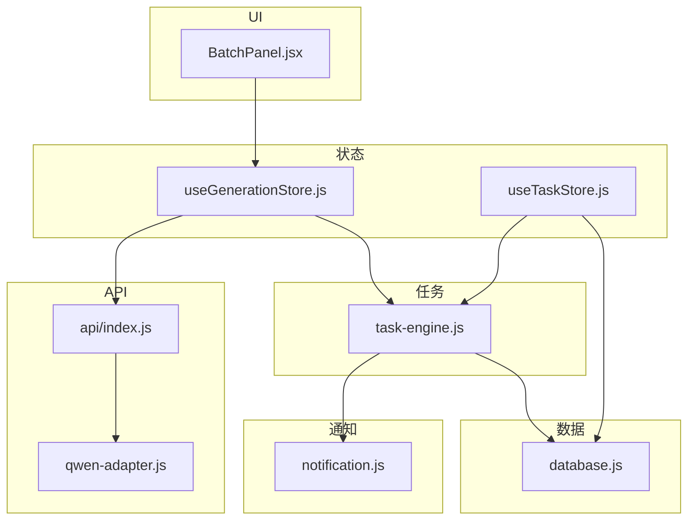
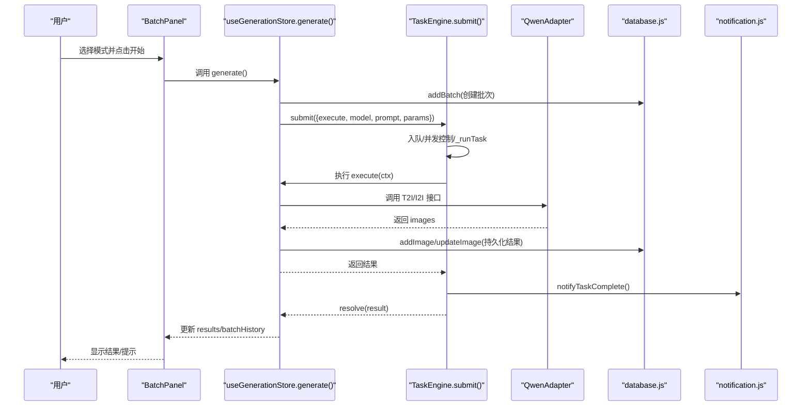
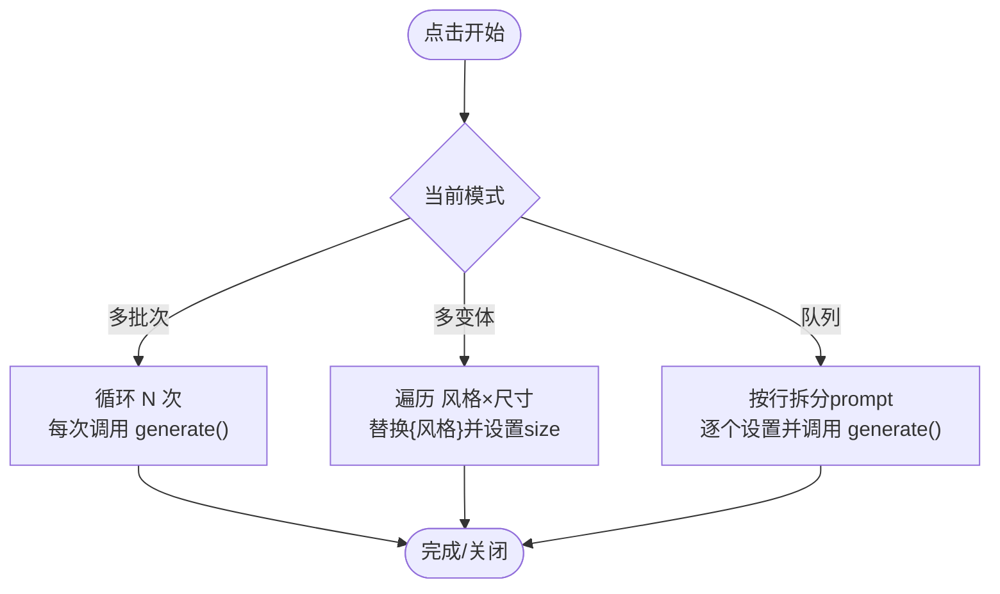
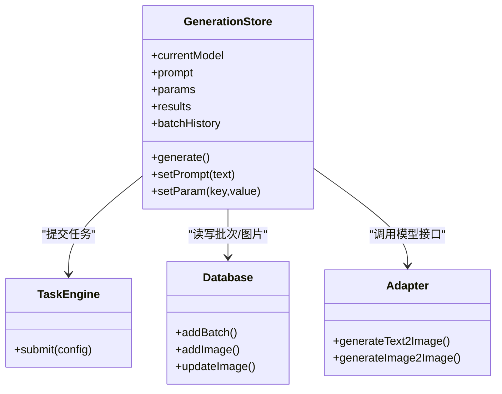
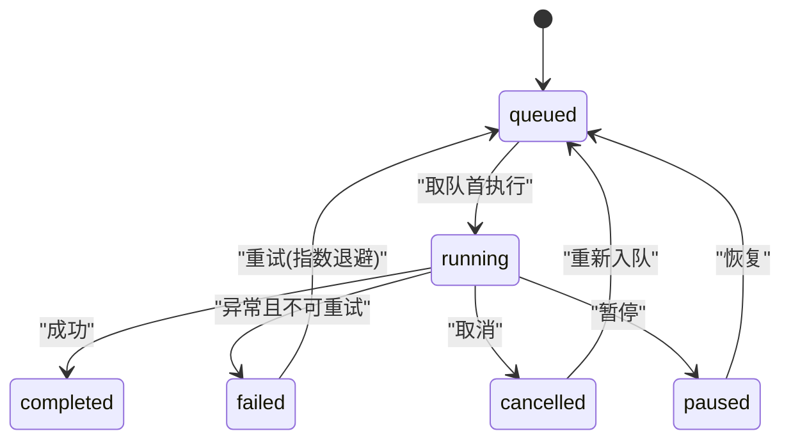
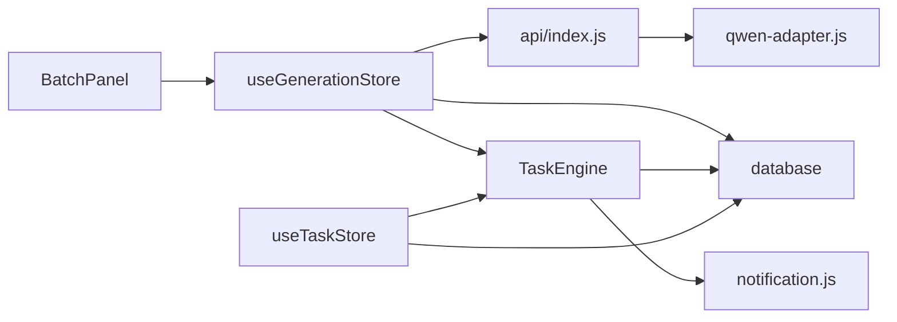

# BatchPanel 批量面板组件

<cite>
**本文引用的文件**   
- [BatchPanel.jsx](file://app/src/components/BatchPanel.jsx)
- [useGenerationStore.js](file://app/src/stores/useGenerationStore.js)
- [task-engine.js](file://app/src/services/task-engine.js)
- [useTaskStore.js](file://app/src/stores/useTaskStore.js)
- [database.js](file://app/src/db/database.js)
- [api/index.js](file://app/src/services/api/index.js)
- [qwen-adapter.js](file://app/src/services/api/qwen-adapter.js)
- [notification.js](file://app/src/services/notification.js)
</cite>

## 目录
1. [简介](#简介)
2. [项目结构](#项目结构)
3. [核心组件](#核心组件)
4. [架构总览](#架构总览)
5. [详细组件分析](#详细组件分析)
6. [依赖关系分析](#依赖关系分析)
7. [性能与并发优化](#性能与并发优化)
8. [故障排查指南](#故障排查指南)
9. [结论](#结论)
10. [附录：属性、事件与使用示例](#附录属性事件与使用示例)

## 简介
本文件为 BatchPanel 批量面板组件的完整技术文档，聚焦于“批量图像生成”能力。内容覆盖多提示词输入、批量任务创建、进度跟踪与结果展示；解释队列管理、并发控制与错误处理；提供组件属性配置、事件回调接口与使用示例；说明与任务引擎的集成方式、性能优化建议，以及撤销/恢复机制和数据持久化策略。

## 项目结构
围绕 BatchPanel 的关键代码分布在以下模块：
- UI 层：批量面板组件（多批次、多变体、Prompt 队列）
- 状态层：生成状态 store（当前模型、提示词、参数、结果、批历史等）
- 任务层：后台任务调度器（FIFO 队列、并发上限、重试、事件总线）
- 数据层：IndexedDB 持久化（任务、图片、批次等）
- 适配层：模型 API 适配器（文本到图、图到图）
- 通知层：浏览器通知（完成/失败）

图表来源
- [BatchPanel.jsx:1-675](file://app/src/components/BatchPanel.jsx#L1-L675)
- [useGenerationStore.js:1-360](file://app/src/stores/useGenerationStore.js#L1-L360)
- [task-engine.js:1-319](file://app/src/services/task-engine.js#L1-L319)
- [useTaskStore.js:1-173](file://app/src/stores/useTaskStore.js#L1-L173)
- [database.js:1-339](file://app/src/db/database.js#L1-L339)
- [api/index.js:1-39](file://app/src/services/api/index.js#L1-L39)
- [qwen-adapter.js:1-209](file://app/src/services/api/qwen-adapter.js#L1-L209)
- [notification.js:1-113](file://app/src/services/notification.js#L1-L113)

章节来源
- [BatchPanel.jsx:1-675](file://app/src/components/BatchPanel.jsx#L1-L675)
- [useGenerationStore.js:1-360](file://app/src/stores/useGenerationStore.js#L1-L360)
- [task-engine.js:1-319](file://app/src/services/task-engine.js#L1-L319)
- [useTaskStore.js:1-173](file://app/src/stores/useTaskStore.js#L1-L173)
- [database.js:1-339](file://app/src/db/database.js#L1-L339)
- [api/index.js:1-39](file://app/src/services/api/index.js#L1-L39)
- [qwen-adapter.js:1-209](file://app/src/services/api/qwen-adapter.js#L1-L209)
- [notification.js:1-113](file://app/src/services/notification.js#L1-L113)

## 核心组件
- BatchPanel：提供三种批量模式
  - 多批次：同一 prompt + 参数重复 N 次生成
  - 多变体：基于变量组合（风格 × 尺寸）批量生成
  - Prompt 队列：逐行输入多个不同 prompt，依次生成
- useGenerationStore：封装一次生成的完整流程（创建批次、提交任务、持久化结果、更新 UI）
- TaskEngine：后台任务调度器（并发、队列、重试、事件、持久化）
- useTaskStore：将 TaskEngine 事件桥接到 Zustand 状态，供任务面板实时刷新
- database：IndexedDB 持久化（images、batches、tasks 等）
- api/index.js + qwen-adapter.js：模型适配器工厂与具体实现
- notification.js：浏览器通知

章节来源
- [BatchPanel.jsx:1-675](file://app/src/components/BatchPanel.jsx#L1-L675)
- [useGenerationStore.js:1-360](file://app/src/stores/useGenerationStore.js#L1-L360)
- [task-engine.js:1-319](file://app/src/services/task-engine.js#L1-L319)
- [useTaskStore.js:1-173](file://app/src/stores/useTaskStore.js#L1-L173)
- [database.js:1-339](file://app/src/db/database.js#L1-L339)
- [api/index.js:1-39](file://app/src/services/api/index.js#L1-L39)
- [qwen-adapter.js:1-209](file://app/src/services/api/qwen-adapter.js#L1-L209)
- [notification.js:1-113](file://app/src/services/notification.js#L1-L113)

## 架构总览
下图展示了从用户点击“开始批量生成”到最终结果落库与通知的全链路。

图表来源
- [BatchPanel.jsx:48-101](file://app/src/components/BatchPanel.jsx#L48-L101)
- [useGenerationStore.js:112-290](file://app/src/stores/useGenerationStore.js#L112-L290)
- [task-engine.js:57-92](file://app/src/services/task-engine.js#L57-L92)
- [qwen-adapter.js:60-105](file://app/src/services/api/qwen-adapter.js#L60-L105)
- [database.js:144-171](file://app/src/db/database.js#L144-L171)
- [notification.js:78-88](file://app/src/services/notification.js#L78-L88)

## 详细组件分析

### BatchPanel 组件
- 功能要点
  - 三种模式切换：多批次、多变体、Prompt 队列
  - 多批次：循环调用 generate() N 次
  - 多变体：遍历“风格 × 尺寸”组合，替换占位符并设置 size 后调用 generate()
  - Prompt 队列：按行拆分 prompt，逐个设置 prompt 后调用 generate()
  - 交互反馈：isSubmitting 禁用按钮、Toast 提示成功/失败
- 关键逻辑路径
  - 多批次提交：[handleBatchSubmit:48-62](file://app/src/components/BatchPanel.jsx#L48-L62)
  - 多变体提交：[handleVariantSubmit:64-83](file://app/src/components/BatchPanel.jsx#L64-L83)
  - 队列提交：[handleQueueSubmit:85-101](file://app/src/components/BatchPanel.jsx#L85-L101)
- 与全局状态的交互
  - 读取/设置 prompt、参数：通过 useGenerationStore 的 setPrompt/setParam
  - 触发生成：调用 useGenerationStore 的 generate
  - 通知：useUIStore.addToast

图表来源
- [BatchPanel.jsx:48-101](file://app/src/components/BatchPanel.jsx#L48-L101)

章节来源
- [BatchPanel.jsx:1-675](file://app/src/components/BatchPanel.jsx#L1-L675)

### useGenerationStore（生成状态与流程）
- 职责
  - 维护当前模型、提示词、参考图、参数、结果、批历史、生成标志
  - 封装一次完整的生成流程：创建批次、提交任务、持久化结果、更新 UI
- 生成流程关键点
  - 创建批次记录：addBatch
  - 构建 execute 函数：根据是否包含参考图选择 T2I 或 I2I 适配器
  - onTaskSubmitted 钩子：在异步任务提交后立即写入 pending 图片记录，确保刷新后可恢复
  - 结果回写：优先更新 pending 记录，否则新增图片记录
  - 更新 results 与 batchHistory
- 错误处理
  - 捕获适配器异常，尝试将 pending 记录标记为 failed
  - 统一抛出错误，由上层（如 BatchPanel）捕获并 Toast

图表来源
- [useGenerationStore.js:112-290](file://app/src/stores/useGenerationStore.js#L112-L290)
- [task-engine.js:57-92](file://app/src/services/task-engine.js#L57-L92)
- [database.js:144-171](file://app/src/db/database.js#L144-L171)
- [qwen-adapter.js:60-105](file://app/src/services/api/qwen-adapter.js#L60-L105)

章节来源
- [useGenerationStore.js:1-360](file://app/src/stores/useGenerationStore.js#L1-L360)

### TaskEngine（任务调度器）
- 设计要点
  - FIFO 队列 + 最大并发（默认 3）
  - 状态机：queued → running → completed/failed/cancelled/paused；failed 可重试
  - 指数退避重试（最多 3 次），仅对可重试错误（5xx、网络错误、超时）生效
  - 事件总线：task:queued/started/progress/completed/failed/cancelled/paused/retry
  - 自动持久化：所有状态变更均落库 tasks 表
- 取消/暂停/恢复
  - cancel：若运行中则 AbortController.abort；若在队列则移除并重拒
  - pause：运行中则中止；队列中则标记 paused
  - resume：将 paused 任务重新入队（注意：pause 会丢失 execute 引用，需外部重提）
- 进度上报
  - ctx.onProgress(percent) 持久化并广播 task:progress

图表来源
- [task-engine.js:24-31](file://app/src/services/task-engine.js#L24-L31)
- [task-engine.js:94-178](file://app/src/services/task-engine.js#L94-L178)
- [task-engine.js:222-297](file://app/src/services/task-engine.js#L222-L297)

章节来源
- [task-engine.js:1-319](file://app/src/services/task-engine.js#L1-L319)

### useTaskStore（任务状态桥接）
- 职责
  - 初始化时订阅 TaskEngine 全部事件，统一刷新本地任务列表
  - 提供 addTask/updateTask/removeTask/retryTask/cancelTask/pauseTask/resumeTask/getTaskStats/clearCompleted 等动作
- 与 UI 的关系
  - 任务面板通过该 store 获取实时任务状态与统计

章节来源
- [useTaskStore.js:1-173](file://app/src/stores/useTaskStore.js#L1-L173)

### 数据库层（IndexedDB）
- 表结构
  - images：生成的图片记录（含 batchId、model、status、url 等）
  - batches：批次记录（关联一组图片）
  - tasks：后台任务记录（type、status、progress、error、retryCount 等）
- 关键操作
  - addBatch/getBatches/deleteBatch
  - addImage/updateImage/deleteImage/searchImages/toggleImageFavorite
  - addTask/getTasks/updateTask/deleteTask/getTaskStats

章节来源
- [database.js:1-339](file://app/src/db/database.js#L1-L339)

### API 适配层
- 工厂方法
  - getModelAdapter(modelId)：根据模型 ID 返回对应适配器实例
- QwenAdapter
  - generateText2Image / generateImage2Image：支持 n、size、seed、negative_prompt、watermark 等参数
  - 同步长耗时请求（最长 5 分钟超时）
  - 解析响应并标准化为 { images: [{ url }] }

章节来源
- [api/index.js:1-39](file://app/src/services/api/index.js#L1-L39)
- [qwen-adapter.js:1-209](file://app/src/services/api/qwen-adapter.js#L1-L209)

### 通知服务
- 完成/失败通知：notifyTaskComplete / notifyTaskFailed
- 权限申请：requestPermission

章节来源
- [notification.js:1-113](file://app/src/services/notification.js#L1-L113)

## 依赖关系分析
- 组件耦合
  - BatchPanel 仅依赖 useGenerationStore 与 useUIStore，保持 UI 薄层
  - useGenerationStore 依赖 TaskEngine、database、API 适配器
  - TaskEngine 依赖 database 与 notification
  - useTaskStore 作为 TaskEngine 与 UI 的桥接层
- 外部依赖
  - Dexie（IndexedDB 封装）
  - uuid（ID 生成）
  - 浏览器 Notification API

图表来源
- [BatchPanel.jsx:1-675](file://app/src/components/BatchPanel.jsx#L1-L675)
- [useGenerationStore.js:1-360](file://app/src/stores/useGenerationStore.js#L1-L360)
- [task-engine.js:1-319](file://app/src/services/task-engine.js#L1-L319)
- [useTaskStore.js:1-173](file://app/src/stores/useTaskStore.js#L1-L173)
- [database.js:1-339](file://app/src/db/database.js#L1-L339)
- [api/index.js:1-39](file://app/src/services/api/index.js#L1-L39)
- [qwen-adapter.js:1-209](file://app/src/services/api/qwen-adapter.js#L1-L209)
- [notification.js:1-113](file://app/src/services/notification.js#L1-L113)

## 性能与并发优化
- 并发控制
  - TaskEngine 默认最大并发 3，可通过 setMaxConcurrent(n) 调整
  - 建议根据后端限流与带宽动态调优
- 队列与重试
  - FIFO 队列保证顺序性；失败自动重试（指数退避，最多 3 次）
  - 仅对 5xx、网络错误、超时进行重试，避免无意义重试
- 持久化与断点续跑
  - 任务状态与图片 pending 记录均落库，页面刷新后可恢复
  - 建议在应用启动时加载任务列表并恢复 UI
- 前端渲染
  - 批量模式下，结果以批次为单位更新，避免频繁重绘
  - 大图建议懒加载与缩略图缓存
- 网络与超时
  - 长耗时接口（Qwen）设置较长超时，避免误判失败
  - 合理设置 n（每批图片数）与 size，平衡质量与速度

[本节为通用性能建议，不直接分析具体文件]

## 故障排查指南
- 常见问题定位
  - 未输入提示词：BatchPanel 会在提交前校验并提示
  - 适配器报错：查看 console 中的适配器日志与错误信息
  - 任务失败：检查 TaskEngine 的失败原因与重试次数
  - 通知未弹出：确认浏览器通知权限已授予
- 调试手段
  - 打开任务面板查看任务状态与错误详情
  - 在 IndexedDB 中检查 tasks/images/batches 表记录
  - 监听 TaskEngine 事件（task:failed/task:completed）辅助定位

章节来源
- [BatchPanel.jsx:48-101](file://app/src/components/BatchPanel.jsx#L48-L101)
- [task-engine.js:259-305](file://app/src/services/task-engine.js#L259-L305)
- [notification.js:19-43](file://app/src/services/notification.js#L19-L43)

## 结论
BatchPanel 通过简洁的 UI 与清晰的职责分层，实现了高效的批量图像生成工作流。借助 TaskEngine 的并发与重试机制、IndexedDB 的持久化保障，以及适配器的统一抽象，系统具备良好的可扩展性与稳定性。配合 useTaskStore 的事件桥接，可实现实时的任务监控与反馈。

[本节为总结性内容，不直接分析具体文件]

## 附录：属性、事件与使用示例

### 组件属性（Props）
- isOpen: boolean — 控制面板可见性
- onClose: function — 关闭回调
- initialMode: 'batch' | 'variants' | 'queue' — 初始模式

章节来源
- [BatchPanel.jsx:8-27](file://app/src/components/BatchPanel.jsx#L8-L27)

### 事件与回调
- 内部 Toast 提示：成功/失败/警告
- 外部可监听（如需）：
  - 通过 useTaskStore.initBridge() 订阅 TaskEngine 事件（task:queued/started/progress/completed/failed/cancelled/paused/retry）
  - 或通过自定义事件总线扩展

章节来源
- [useTaskStore.js:39-64](file://app/src/stores/useTaskStore.js#L39-L64)
- [task-engine.js:191-211](file://app/src/services/task-engine.js#L191-L211)

### 使用示例（步骤）
- 在页面中引入并挂载 BatchPanel
- 传入 isOpen/onClose/initialMode
- 用户选择模式并输入提示词后点击开始
- 结果自动写入 IndexedDB 并在 UI 展示
- 可在任务面板查看任务状态与错误详情

章节来源
- [BatchPanel.jsx:103-675](file://app/src/components/BatchPanel.jsx#L103-L675)

### 撤销/恢复机制
- 撤销（取消/暂停）
  - 运行中：cancel 会中断执行；pause 会中止并标记 paused
  - 队列中：cancel 会从队列移除；pause 会标记 paused
- 恢复
  - resume 会将 paused 任务重新入队（注意：pause 会丢失 execute 引用，需要外部重新提交任务）
  - retry 可将 failed 任务重新入队（带指数退避）
- 数据持久化
  - 任务状态、进度、错误、重试次数均落库
  - 图片生成过程中先写入 pending 记录，成功后再更新为实际结果

章节来源
- [task-engine.js:94-178](file://app/src/services/task-engine.js#L94-L178)
- [useGenerationStore.js:141-161](file://app/src/stores/useGenerationStore.js#L141-L161)
- [database.js:235-274](file://app/src/db/database.js#L235-L274)