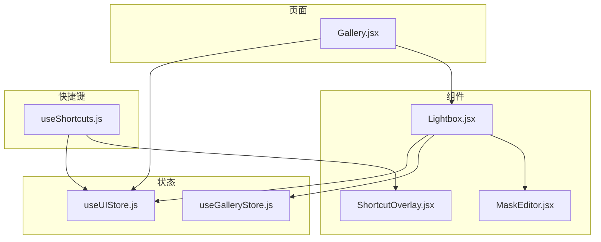
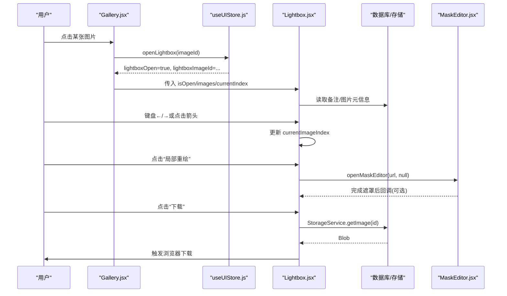
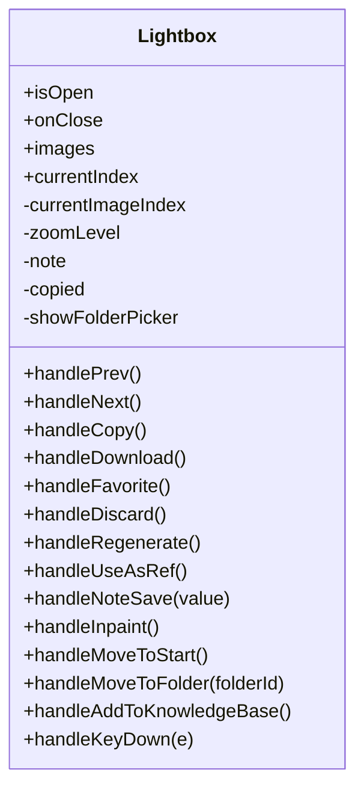
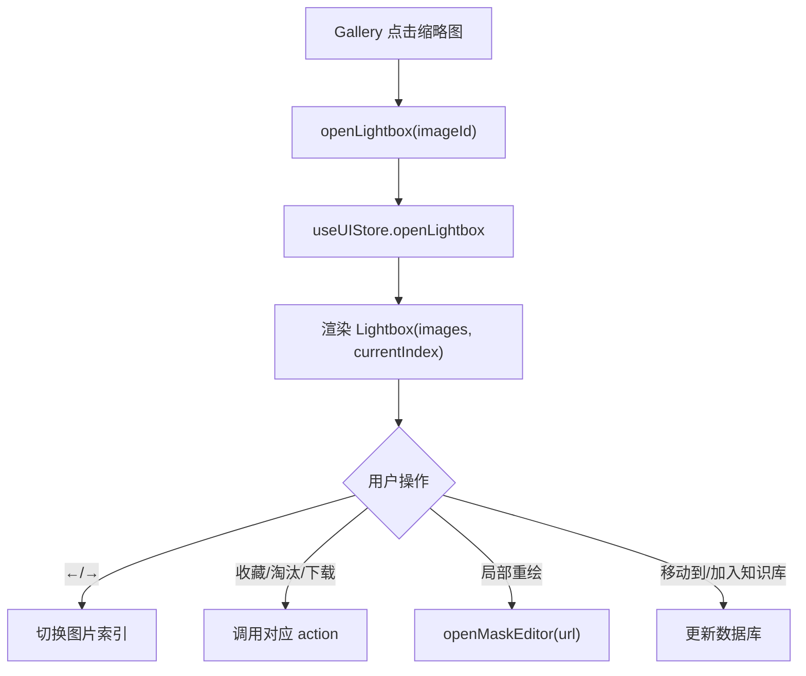
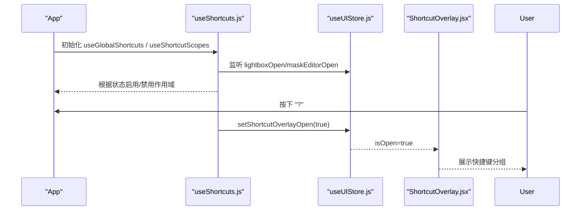
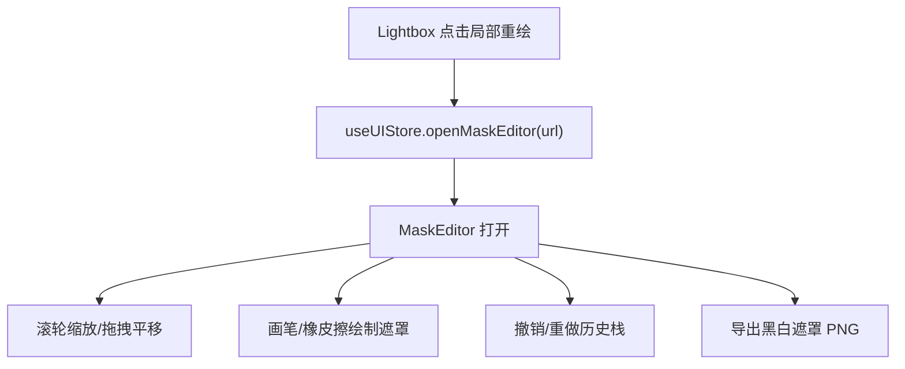
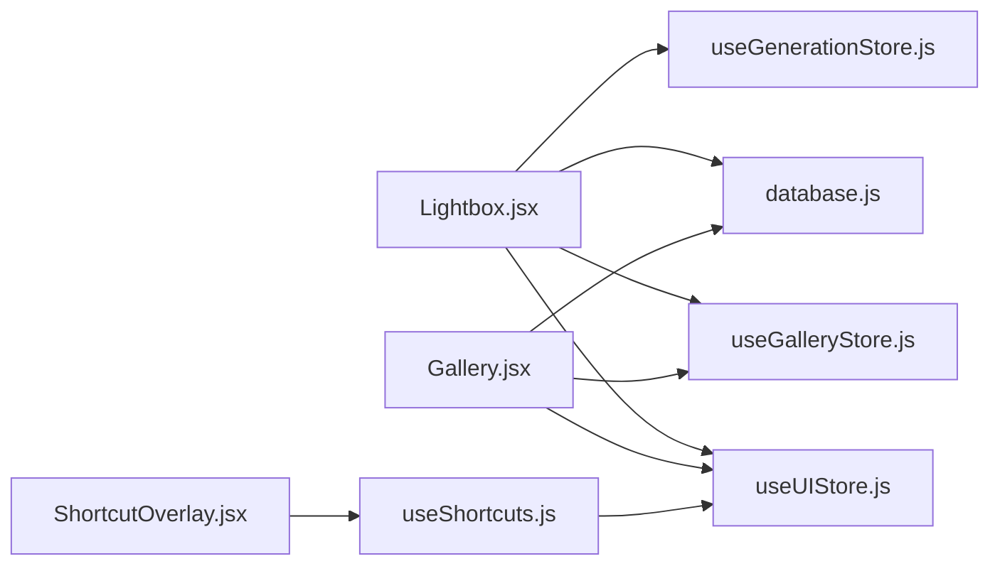

# Lightbox 图片查看器组件

<cite>
**本文引用的文件**
- [Lightbox.jsx](file://app/src/components/Lightbox.jsx)
- [Gallery.jsx](file://app/src/pages/Gallery.jsx)
- [useShortcuts.js](file://app/src/hooks/useShortcuts.js)
- [useUIStore.js](file://app/src/stores/useUIStore.js)
- [useGalleryStore.js](file://app/src/stores/useGalleryStore.js)
- [MaskEditor.jsx](file://app/src/components/MaskEditor.jsx)
- [ShortcutOverlay.jsx](file://app/src/components/ShortcutOverlay.jsx)
</cite>

## 目录
1. [简介](#简介)
2. [项目结构](#项目结构)
3. [核心组件](#核心组件)
4. [架构总览](#架构总览)
5. [详细组件分析](#详细组件分析)
6. [依赖关系分析](#依赖关系分析)
7. [性能与优化](#性能与优化)
8. [故障排查指南](#故障排查指南)
9. [结论](#结论)
10. [附录：属性、事件与快捷键](#附录属性事件与快捷键)

## 简介
本组件文档聚焦于 Lightbox 全屏图片查看器，围绕以下目标展开：
- 全屏浏览能力：当前实现以固定比例容器承载图片，支持缩放（按钮控制）与左右切换。
- 交互操作：键盘导航（上一张/下一张/关闭）、鼠标点击切换、右侧面板操作（收藏、淘汰、下载、加入知识库等）。
- 扩展能力：与 MaskEditor 局部重绘集成；与图库 Gallery 的数据流联动；全局快捷键系统统一管理上下文范围。
- 数据与状态：通过 UI Store 控制打开/关闭与选中图 ID，图库 Store 提供图片列表与筛选。
- 性能与内存：基于 Blob URL 的下载与对象 URL 释放策略；懒加载与分页展示在图库层实现，减轻 Lightbox 渲染压力。

注意：当前 Lightbox 未实现平移、旋转、滚轮缩放、触摸手势等高级交互，这些内容在“性能与优化”和“扩展建议”中给出可落地的方案。

## 项目结构
与 Lightbox 直接相关的代码分布在组件、页面、状态与快捷键模块中：
- 组件层：Lightbox 负责全屏查看与基础交互；MaskEditor 提供局部重绘能力。
- 页面层：Gallery 作为入口，触发 Lightbox 打开并传递图片 ID。
- 状态层：useUIStore 管理 Lightbox 开关与选中图 ID；useGalleryStore 维护图片集合与筛选。
- 快捷键层：useShortcuts 提供全局与上下文感知的快捷键体系，ShortcutOverlay 展示快捷键说明。

图表来源
- [Gallery.jsx:1-120](file://app/src/pages/Gallery.jsx#L1-L120)
- [Lightbox.jsx:1-120](file://app/src/components/Lightbox.jsx#L1-L120)
- [useUIStore.js:1-80](file://app/src/stores/useUIStore.js#L1-L80)
- [useGalleryStore.js:1-60](file://app/src/stores/useGalleryStore.js#L1-L60)
- [useShortcuts.js:1-60](file://app/src/hooks/useShortcuts.js#L1-L60)
- [ShortcutOverlay.jsx:1-40](file://app/src/components/ShortcutOverlay.jsx#L1-L40)

章节来源
- [Gallery.jsx:1-120](file://app/src/pages/Gallery.jsx#L1-L120)
- [Lightbox.jsx:1-120](file://app/src/components/Lightbox.jsx#L1-L120)
- [useUIStore.js:1-80](file://app/src/stores/useUIStore.js#L1-L80)
- [useGalleryStore.js:1-60](file://app/src/stores/useGalleryStore.js#L1-L60)
- [useShortcuts.js:1-60](file://app/src/hooks/useShortcuts.js#L1-L60)
- [ShortcutOverlay.jsx:1-40](file://app/src/components/ShortcutOverlay.jsx#L1-L40)

## 核心组件
- Lightbox：全屏遮罩 + 图片显示区 + 右侧信息面板 + 底部缩放工具栏。提供上一张/下一张、复制提示词、下载、收藏、淘汰、重新生成、设为参考、移动到文件夹、加入知识库等操作。
- Gallery：图库页，负责图片导入、筛选、批量操作、右键菜单、以及打开 Lightbox。
- useUIStore：集中管理 Lightbox 开关、选中图 ID、主题、通知等全局 UI 状态。
- useGalleryStore：管理图片列表、文件夹、视图模式、搜索与过滤、选择集、批量动作。
- useShortcuts：基于 react-hotkeys-hook 的上下文感知快捷键系统，定义全局与工作区、图库、Lightbox、遮罩编辑器的作用域。
- ShortcutOverlay：快捷键速查浮层，按组展示所有可用快捷键。
- MaskEditor：Canvas 双画布（背景图+遮罩），支持画笔/橡皮擦、撤销/重做、滚轮缩放、拖拽平移、对比预览等。

章节来源
- [Lightbox.jsx:1-120](file://app/src/components/Lightbox.jsx#L1-L120)
- [Gallery.jsx:1-120](file://app/src/pages/Gallery.jsx#L1-L120)
- [useUIStore.js:1-80](file://app/src/stores/useUIStore.js#L1-L80)
- [useGalleryStore.js:1-60](file://app/src/stores/useGalleryStore.js#L1-L60)
- [useShortcuts.js:1-60](file://app/src/hooks/useShortcuts.js#L1-L60)
- [ShortcutOverlay.jsx:1-40](file://app/src/components/ShortcutOverlay.jsx#L1-L40)
- [MaskEditor.jsx:1-100](file://app/src/components/MaskEditor.jsx#L1-L100)

## 架构总览
Lightbox 与图库、状态、快捷键之间的协作如下：

图表来源
- [Gallery.jsx:430-460](file://app/src/pages/Gallery.jsx#L430-L460)
- [useUIStore.js:45-53](file://app/src/stores/useUIStore.js#L45-L53)
- [Lightbox.jsx:13-40](file://app/src/components/Lightbox.jsx#L13-L40)
- [Lightbox.jsx:167-180](file://app/src/components/Lightbox.jsx#L167-L180)
- [Lightbox.jsx:59-69](file://app/src/components/Lightbox.jsx#L59-L69)
- [Lightbox.jsx:102-120](file://app/src/components/Lightbox.jsx#L102-L120)
- [MaskEditor.jsx:1-40](file://app/src/components/MaskEditor.jsx#L1-L40)

## 详细组件分析

### Lightbox 组件
- 功能要点
  - 全屏遮罩与布局：顶部显示序号与快捷键提示，中间为图片显示区，右侧为信息面板，底部为缩放控制条。
  - 图片切换：内部维护 currentImageIndex，支持循环切换。
  - 缩放：通过 setZoomLevel 控制 transform: scale(...)，并提供放大、缩小、适应窗口、1:1 原始大小按钮。
  - 键盘：监听 window keydown，Esc 关闭，←/→ 切换。
  - 右侧面板：提示词、模型、参数、用户备注（持久化到数据库）、操作按钮（收藏、淘汰、重新生成、设为参考、局部重绘、移动到、加入知识库、下载）。
  - 移动与知识库：弹出文件夹选择弹窗，调用数据库更新；将图片打包加入知识库。
  - 下载：从存储服务获取 Blob，创建临时 ObjectURL 触发下载，完成后释放 URL。
- 数据结构与复杂度
  - 状态：currentImageIndex、zoomLevel、note、copied、showFolderPicker。均为 O(1) 读写。
  - 副作用：根据 currentImage.id 异步加载备注，时间复杂度取决于数据库查询。
- 错误处理
  - 下载失败、移动失败、加入知识库失败均捕获异常并通过 Toast 反馈。
- 性能考虑
  - 使用 CSS transform 进行缩放，避免重排大图。
  - 下载时及时 revokeObjectURL，防止内存泄漏。
  - 右侧面板仅渲染当前图片信息，避免全量渲染开销。

图表来源
- [Lightbox.jsx:13-180](file://app/src/components/Lightbox.jsx#L13-L180)
- [Lightbox.jsx:186-702](file://app/src/components/Lightbox.jsx#L186-L702)

章节来源
- [Lightbox.jsx:13-180](file://app/src/components/Lightbox.jsx#L13-L180)
- [Lightbox.jsx:186-702](file://app/src/components/Lightbox.jsx#L186-L702)

### 图库 Gallery 与 Lightbox 集成
- 打开流程
  - 用户在网格/列表视图中点击缩略图，调用 openLightbox(imageId)。
  - useUIStore.openLightbox 设置 lightboxOpen 与 lightboxImageId。
  - 父级（通常为 App 或路由容器）根据 store 状态渲染 Lightbox，并将 images 与 currentIndex 传入。
- 数据流
  - Gallery 通过 useGalleryStore 获取 images、folders、viewMode 等。
  - Lightbox 通过 useGenerationStore/useUIStore/useGalleryStore 访问相关状态与动作。
- 交互闭环
  - 在 Lightbox 内执行“局部重绘”，调用 openMaskEditor 打开遮罩编辑器。
  - 下载操作通过 StorageService 获取 Blob 并触发浏览器下载。

图表来源
- [Gallery.jsx:430-460](file://app/src/pages/Gallery.jsx#L430-L460)
- [useUIStore.js:45-53](file://app/src/stores/useUIStore.js#L45-L53)
- [Lightbox.jsx:167-180](file://app/src/components/Lightbox.jsx#L167-L180)
- [Lightbox.jsx:102-120](file://app/src/components/Lightbox.jsx#L102-L120)

章节来源
- [Gallery.jsx:430-460](file://app/src/pages/Gallery.jsx#L430-L460)
- [useUIStore.js:45-53](file://app/src/stores/useUIStore.js#L45-L53)
- [Lightbox.jsx:167-180](file://app/src/components/Lightbox.jsx#L167-L180)
- [Lightbox.jsx:102-120](file://app/src/components/Lightbox.jsx#L102-L120)

### 全局快捷键系统与上下文作用域
- 作用域优先级（从高到低）：mask-editor > lightbox > workbench > gallery > global。
- 关键行为
  - 全局：? 打开快捷键速查；Esc 关闭遮罩或 Lightbox；G+W/G+G/G+K/G+T 快速跳转页面。
  - 工作区：Cmd/Ctrl+Enter 生成；E 扩写提示词；1/2/3 切换模型。
  - Lightbox：←/→ 切换；F 收藏；D 下载；C 复制 Prompt；Esc 关闭。
- 实现方式
  - useGlobalShortcuts 注册各作用域的快捷键。
  - useShortcutScopes 根据 UI 状态动态启用/禁用作用域。
  - ShortcutOverlay 展示分组快捷键说明。

图表来源
- [useShortcuts.js:22-110](file://app/src/hooks/useShortcuts.js#L22-L110)
- [useShortcuts.js:116-134](file://app/src/hooks/useShortcuts.js#L116-L134)
- [useShortcuts.js:139-184](file://app/src/hooks/useShortcuts.js#L139-L184)
- [useUIStore.js:147-158](file://app/src/stores/useUIStore.js#L147-L158)
- [ShortcutOverlay.jsx:1-40](file://app/src/components/ShortcutOverlay.jsx#L1-L40)

章节来源
- [useShortcuts.js:22-110](file://app/src/hooks/useShortcuts.js#L22-L110)
- [useShortcuts.js:116-134](file://app/src/hooks/useShortcuts.js#L116-L134)
- [useShortcuts.js:139-184](file://app/src/hooks/useShortcuts.js#L139-L184)
- [useUIStore.js:147-158](file://app/src/stores/useUIStore.js#L147-L158)
- [ShortcutOverlay.jsx:1-40](file://app/src/components/ShortcutOverlay.jsx#L1-L40)

### 遮罩编辑器 MaskEditor（与 Lightbox 的集成点）
- 双画布架构：bgCanvas 静态背景图，maskCanvas 透明遮罩层。
- 交互能力：画笔/橡皮擦、撤销/重做、滚轮缩放、拖拽平移、Space 对比原图。
- 与 Lightbox 的衔接：Lightbox 的“局部重绘”按钮调用 openMaskEditor，传入图片 URL。

图表来源
- [Lightbox.jsx:102-120](file://app/src/components/Lightbox.jsx#L102-L120)
- [useUIStore.js:135-143](file://app/src/stores/useUIStore.js#L135-L143)
- [MaskEditor.jsx:1-100](file://app/src/components/MaskEditor.jsx#L1-L100)
- [MaskEditor.jsx:258-264](file://app/src/components/MaskEditor.jsx#L258-L264)

章节来源
- [Lightbox.jsx:102-120](file://app/src/components/Lightbox.jsx#L102-L120)
- [useUIStore.js:135-143](file://app/src/stores/useUIStore.js#L135-L143)
- [MaskEditor.jsx:1-100](file://app/src/components/MaskEditor.jsx#L1-L100)
- [MaskEditor.jsx:258-264](file://app/src/components/MaskEditor.jsx#L258-L264)

## 依赖关系分析
- 组件耦合
  - Lightbox 依赖 useUIStore（打开/关闭、Toast）、useGenerationStore（收藏/淘汰/重新生成/参考图）、useGalleryStore（文件夹列表）、数据库服务（备注/移动/知识库）。
  - Gallery 依赖 useUIStore（打开 Lightbox）、useGalleryStore（图片/文件夹/筛选/批量操作）、数据库服务（导入/删除/移动）。
  - 快捷键系统依赖 useUIStore 与路由状态，用于作用域切换。
- 外部依赖
  - lucide-react 图标库。
  - react-hotkeys-hook 用于快捷键。
  - zustand + immer 用于状态管理与不可变更新。
  - uuid 用于生成 toast id。

图表来源
- [Lightbox.jsx:1-20](file://app/src/components/Lightbox.jsx#L1-L20)
- [Gallery.jsx:1-20](file://app/src/pages/Gallery.jsx#L1-L20)
- [useShortcuts.js:1-20](file://app/src/hooks/useShortcuts.js#L1-L20)
- [ShortcutOverlay.jsx:1-10](file://app/src/components/ShortcutOverlay.jsx#L1-L10)

章节来源
- [Lightbox.jsx:1-20](file://app/src/components/Lightbox.jsx#L1-L20)
- [Gallery.jsx:1-20](file://app/src/pages/Gallery.jsx#L1-L20)
- [useShortcuts.js:1-20](file://app/src/hooks/useShortcuts.js#L1-L20)
- [ShortcutOverlay.jsx:1-10](file://app/src/components/ShortcutOverlay.jsx#L1-L10)

## 性能与优化
- 当前实现
  - 缩放：CSS transform scale，GPU 加速友好，避免重排大图。
  - 下载：Blob URL 创建后立即触发下载，并在完成后立即 revokeObjectURL，降低内存占用。
  - 图库分页：Gallery 使用 displayCount 与滚动阈值增量加载，减少首屏渲染压力。
- 潜在瓶颈
  - 大图渲染：若 images 中包含高分辨率图片，首次加载可能卡顿。
  - 频繁 DOM 操作：右侧面板与底部工具栏在每次缩放/切换时更新，需确保最小化重绘。
- 优化建议
  - 图片加载优化
    - 优先使用 thumbnailUrl 或 blobUrl 作为缩略图，仅在需要时加载 full-size url。
    - 对大尺寸图片进行服务端裁剪或生成多分辨率版本，前端按需请求。
  - 内存管理
    - 统一回收 ObjectURL：在下载、预览结束后显式 revokeObjectURL。
    - 避免在 state 中保存大量二进制数据，尽量使用引用或 URL。
  - 渲染性能
    - 使用 React.memo 包裹 Lightbox 子区域（如右侧面板），减少不必要的重渲染。
    - 将缩放计算封装为 useMemo，避免每帧重复计算。
  - 交互增强（可扩展）
    - 滚轮缩放：在图片容器上监听 wheel 事件，结合中心点计算缩放与平移。
    - 拖拽平移：pointerdown/pointermove/pointerup 组合，记录起始位置与偏移量。
    - 触摸手势：touchstart/touchmove/touchend 支持双指缩放与单指拖动。
    - 旋转：增加 rotate 状态与旋转按钮，或使用 transform: rotate(...)。
    - 双击重置：双击图片回到 1:1 或适应窗口。

[本节为通用指导，不直接分析具体文件]

## 故障排查指南
- 常见问题
  - 图片无法下载：检查 StorageService.getImage 返回是否为空；确认图片是否处于冷存储且存在 ossUrl。
  - 移动失败：确认当前图片 id 有效，数据库 updateImage 成功；检查网络与权限。
  - 加入知识库失败：校验 imageId 来源链（id -> imageId -> url 派生），确保必填字段完整。
  - 快捷键无效：确认当前作用域已启用（例如 Lightbox 打开时，gallery 作用域会被禁用）。
- 定位方法
  - 使用浏览器控制台查看 addToast 输出与 console.error 日志。
  - 在 useUIStore 与 useGalleryStore 中打印状态变更，确认数据流是否正确。
  - 在 Lightbox 的 keydown 处理器中添加断点，验证 Esc/←/→ 是否触发。

章节来源
- [Lightbox.jsx:59-69](file://app/src/components/Lightbox.jsx#L59-L69)
- [Lightbox.jsx:127-139](file://app/src/components/Lightbox.jsx#L127-L139)
- [Lightbox.jsx:142-165](file://app/src/components/Lightbox.jsx#L142-L165)
- [useShortcuts.js:116-134](file://app/src/hooks/useShortcuts.js#L116-L134)

## 结论
Lightbox 在当前仓库中提供了稳定的全屏图片浏览体验，具备基础的缩放与切换能力，并与图库、状态、快捷键系统良好集成。针对更丰富的交互（平移、旋转、滚轮缩放、触摸手势），可在现有基础上平滑扩展，同时配合图片加载与内存管理策略，进一步提升性能与用户体验。

[本节为总结性内容，不直接分析具体文件]

## 附录：属性、事件与快捷键

### Lightbox 属性
- isOpen: boolean，控制是否显示。
- onClose: function，关闭回调。
- images: array，图片数组（每项包含 id/url/prompt/model/params 等）。
- currentIndex: number，初始显示的索引。

章节来源
- [Lightbox.jsx:13-20](file://app/src/components/Lightbox.jsx#L13-L20)

### 事件与回调
- 键盘事件：Esc 关闭；←/→ 切换图片。
- 鼠标事件：点击左右箭头切换；点击底部缩放按钮调整缩放；点击右侧面板按钮执行相应操作。
- 自定义回调：无对外暴露的回调接口，主要通过 useUIStore.addToast 反馈结果。

章节来源
- [Lightbox.jsx:167-180](file://app/src/components/Lightbox.jsx#L167-L180)
- [Lightbox.jsx:610-696](file://app/src/components/Lightbox.jsx#L610-L696)

### 快捷键速查（Lightbox 相关）
- ←：上一张
- →：下一张
- F：收藏/取消收藏
- D：下载
- C：复制 Prompt
- Esc：关闭

章节来源
- [useShortcuts.js:162-170](file://app/src/hooks/useShortcuts.js#L162-L170)
- [ShortcutOverlay.jsx:100-136](file://app/src/components/ShortcutOverlay.jsx#L100-L136)