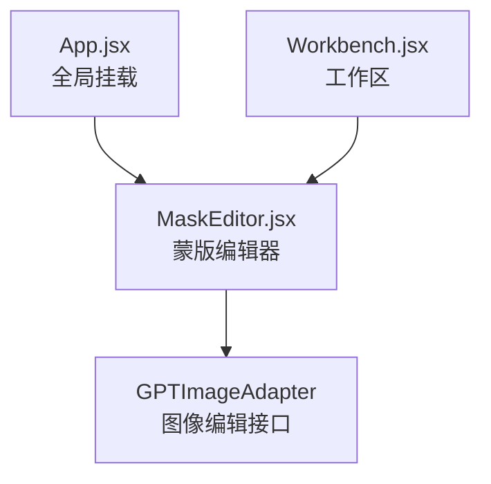
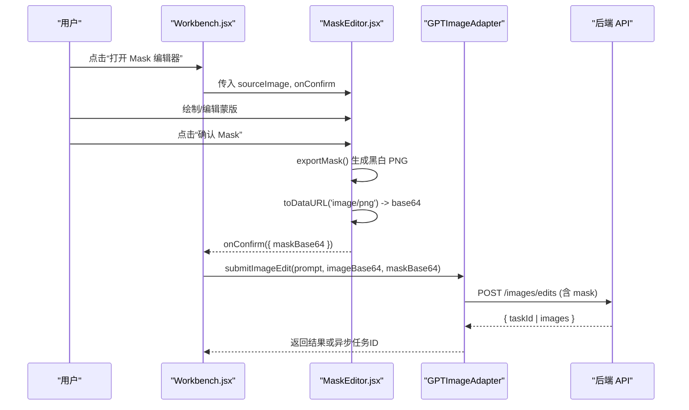
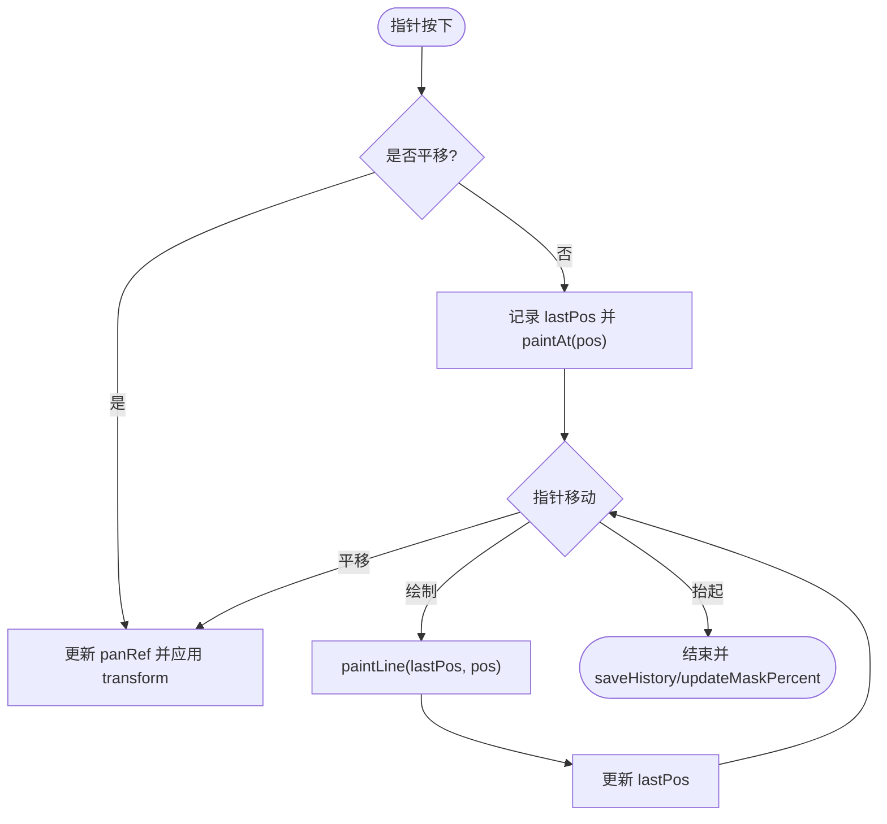
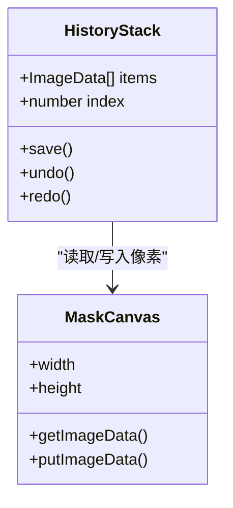
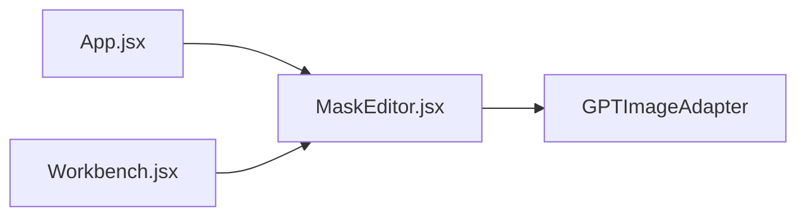

# MaskEditor 蒙版编辑器组件

<cite>
**本文引用的文件列表**
- [MaskEditor.jsx](file://app/src/components/MaskEditor.jsx)
- [gpt-image-adapter.js](file://app/src/services/api/gpt-image-adapter.js)
- [Workbench.jsx](file://app/src/pages/Workbench.jsx)
- [App.jsx](file://app/src/App.jsx)
</cite>

## 目录
1. [简介](#简介)
2. [项目结构](#项目结构)
3. [核心组件](#核心组件)
4. [架构总览](#架构总览)
5. [详细组件分析](#详细组件分析)
6. [依赖关系分析](#依赖关系分析)
7. [性能与优化](#性能与优化)
8. [故障排查指南](#故障排查指南)
9. [结论](#结论)
10. [附录：API 数据格式与兼容性](#附录api-数据格式与兼容性)

## 简介
MaskEditor 是一个基于 Canvas 的局部重绘蒙版编辑器，用于为 GPT-image-2 等图像编辑模型提供“需要重新生成”的区域掩码。它采用双画布架构（背景图 + 透明蒙版叠加），支持画笔、橡皮擦、选区操作（全选/清除/反转）、缩放平移、对比预览、撤销/重做、外部蒙版导入以及导出黑白 PNG 供 API 使用。

## 项目结构
- 组件入口：应用层在 App.jsx 中挂载 MaskEditor，并通过 props 传入 sourceImage 和回调 onConfirm/onClose。
- 工作流入口：Workbench.jsx 提供“打开 Mask 编辑器”按钮，将当前结果图作为 sourceImage 传入。
- 服务集成：确认后将蒙版转换为 base64，通过 GPTImageAdapter 提交图像编辑任务。

图表来源
- [App.jsx:343-348](file://app/src/App.jsx#L343-L348)
- [Workbench.jsx:1053-1066](file://app/src/pages/Workbench.jsx#L1053-L1066)
- [MaskEditor.jsx:348-360](file://app/src/components/MaskEditor.jsx#L348-L360)
- [gpt-image-adapter.js:283-303](file://app/src/services/api/gpt-image-adapter.js#L283-L303)

章节来源
- [App.jsx:343-348](file://app/src/App.jsx#L343-L348)
- [Workbench.jsx:1053-1066](file://app/src/pages/Workbench.jsx#L1053-L1066)
- [MaskEditor.jsx:1-20](file://app/src/components/MaskEditor.jsx#L1-L20)

## 核心组件
- 双画布架构
  - 背景画布：仅绘制静态原图，缩放/平移时重绘。
  - 蒙版画布：半透明红色覆盖层，用户在此绘制需要重绘区域。
- 工具集
  - 画笔：以圆形笔刷绘制半透明红色蒙版。
  - 橡皮擦：使用合成模式擦除蒙版像素。
  - 选区操作：全选（填充）、清除（清空）、反转（按透明度取反）。
- 交互能力
  - 鼠标滚轮缩放、按住空格或中键平移。
  - 对比模式：隐藏蒙版显示原图，便于精确定位。
  - 键盘快捷键：B/E 切换工具、[ / ] 调整笔刷大小、Ctrl+Z/Ctrl+Shift+Z 撤销/重做、Space 对比。
- 历史管理
  - 固定长度历史记录栈，保存 ImageData 快照；撤销/重做直接 putImageData 恢复。
- 导出与上传
  - 导出：将蒙版 Alpha 通道转为黑白 PNG（白=蒙版区域）。
  - 上传：从外部图片导入蒙版，将亮度大于阈值的区域映射为蒙版。

章节来源
- [MaskEditor.jsx:43-87](file://app/src/components/MaskEditor.jsx#L43-L87)
- [MaskEditor.jsx:156-256](file://app/src/components/MaskEditor.jsx#L156-L256)
- [MaskEditor.jsx:266-316](file://app/src/components/MaskEditor.jsx#L266-L316)
- [MaskEditor.jsx:319-360](file://app/src/components/MaskEditor.jsx#L319-L360)
- [MaskEditor.jsx:362-395](file://app/src/components/MaskEditor.jsx#L362-L395)
- [MaskEditor.jsx:397-429](file://app/src/components/MaskEditor.jsx#L397-L429)

## 架构总览
下图展示了从用户操作到 API 调用的完整流程，包括蒙版导出、base64 转换与服务端适配器的调用。

图表来源
- [Workbench.jsx:1053-1066](file://app/src/pages/Workbench.jsx#L1053-L1066)
- [MaskEditor.jsx:348-360](file://app/src/components/MaskEditor.jsx#L348-L360)
- [gpt-image-adapter.js:283-303](file://app/src/services/api/gpt-image-adapter.js#L283-L303)

## 详细组件分析

### 蒙版数据模型与存储格式
- 内部表示
  - 蒙版存储在独立 Canvas 的 ImageData 中，Alpha 通道 > 0 表示被蒙版覆盖（需要重绘）。
- 导出格式
  - 导出为黑白 PNG：Alpha > 0 的像素输出为白色（R=G=B=255），否则黑色（R=G=B=0），并设置不透明 Alpha=255。
- 上传兼容
  - 支持上传外部黑白蒙版图片，将亮度均值大于阈值（约 128）的像素视为蒙版区域，映射为半透明红色覆盖。

章节来源
- [MaskEditor.jsx:319-346](file://app/src/components/MaskEditor.jsx#L319-L346)
- [MaskEditor.jsx:362-395](file://app/src/components/MaskEditor.jsx#L362-L395)

### 绘图与交互实现
- 坐标换算
  - 根据 getBoundingClientRect 与 canvas.width/height 计算缩放比例，将屏幕坐标映射到画布像素坐标。
- 绘制算法
  - 点绘：paintAt 绘制圆形笔触。
  - 线绘：paintLine 使用 lineCap=lineJoin=round 平滑连接，避免断点。
  - 橡皮擦：使用 globalCompositeOperation='destination-out' 擦除。
- 缩放与平移
  - 通过 CSS transform scale/translate 对两个画布同步变换，保持蒙版与原图对齐。
- 对比模式
  - 通过蒙版画布 opacity 控制显示/隐藏，配合 Space 键临时切换。

图表来源
- [MaskEditor.jsx:156-256](file://app/src/components/MaskEditor.jsx#L156-L256)
- [MaskEditor.jsx:89-100](file://app/src/components/MaskEditor.jsx#L89-L100)

章节来源
- [MaskEditor.jsx:156-256](file://app/src/components/MaskEditor.jsx#L156-L256)
- [MaskEditor.jsx:89-100](file://app/src/components/MaskEditor.jsx#L89-L100)

### 透明度控制与边缘平滑
- 透明度控制
  - 蒙版颜色为固定半透明红色，Alpha 值恒定；导出时将 Alpha 二值化（有/无蒙版）。
- 边缘平滑
  - 使用 round 线帽与线连接减少锯齿；未实现高斯模糊等后处理，边缘由笔刷半径与采样密度决定。

章节来源
- [MaskEditor.jsx:169-217](file://app/src/components/MaskEditor.jsx#L169-L217)
- [MaskEditor.jsx:319-346](file://app/src/components/MaskEditor.jsx#L319-L346)

### 历史记录管理与撤销/重做
- 数据结构
  - 固定长度数组，元素为 ImageData 快照；超出最大长度自动丢弃最旧项。
- 操作语义
  - 每次绘制结束保存一次快照；撤销/重做通过 putImageData 恢复对应快照。
- 边界条件
  - 初始空状态即保存一条历史；撤销至第一条后禁用撤销按钮；重做至最后一条后禁用重做按钮。

图表来源
- [MaskEditor.jsx:102-139](file://app/src/components/MaskEditor.jsx#L102-L139)

章节来源
- [MaskEditor.jsx:102-139](file://app/src/components/MaskEditor.jsx#L102-L139)

### 选区操作
- 全选：用蒙版色填充整个画布。
- 清除：清空画布。
- 反转：新建画布填充蒙版色，再以 destination-out 方式擦除原蒙版区域，得到取反结果。

章节来源
- [MaskEditor.jsx:266-316](file://app/src/components/MaskEditor.jsx#L266-L316)

### 属性配置选项与事件回调
- 属性（props）
  - isOpen: boolean，控制弹窗显示。
  - onClose: function，关闭编辑器。
  - sourceImage: object，包含 url 字段，用于加载源图。
  - onConfirm: function，接收 { maskBase64, maskCanvas } 回调。
- 事件/行为
  - 键盘快捷键：B/E 切换工具、[ / ] 调整笔刷大小、Ctrl+Z/Ctrl+Shift+Z 撤销/重做、Space 对比。
  - 鼠标滚轮缩放、按住空格或中键平移。

章节来源
- [MaskEditor.jsx:20-41](file://app/src/components/MaskEditor.jsx#L20-L41)
- [MaskEditor.jsx:397-429](file://app/src/components/MaskEditor.jsx#L397-L429)
- [App.jsx:343-348](file://app/src/App.jsx#L343-L348)

### 使用示例（集成要点）
- 在工作区打开编辑器
  - 当存在生成结果且模型支持蒙版时，点击“打开 Mask 编辑器”，将当前结果图 URL 作为 sourceImage 传入。
- 确认蒙版后发起编辑
  - onConfirm 回调中获取 maskBase64，随后调用图像编辑接口提交任务。

章节来源
- [Workbench.jsx:1053-1066](file://app/src/pages/Workbench.jsx#L1053-L1066)
- [MaskEditor.jsx:348-360](file://app/src/components/MaskEditor.jsx#L348-L360)

## 依赖关系分析
- 组件耦合
  - MaskEditor 与上层 App/Workbench 通过 props 解耦，职责清晰。
  - 与 GPTImageAdapter 通过回调传递 base64 数据，适配器负责请求封装与重试/轮询。
- 外部依赖
  - Canvas 2D API、浏览器事件系统、URL.createObjectURL（上传蒙版）。
- 潜在循环依赖
  - 无直接循环引用；组件间通过单向数据流与回调通信。

图表来源
- [App.jsx:343-348](file://app/src/App.jsx#L343-L348)
- [Workbench.jsx:1053-1066](file://app/src/pages/Workbench.jsx#L1053-L1066)
- [MaskEditor.jsx:348-360](file://app/src/components/MaskEditor.jsx#L348-L360)
- [gpt-image-adapter.js:283-303](file://app/src/services/api/gpt-image-adapter.js#L283-L303)

章节来源
- [App.jsx:343-348](file://app/src/App.jsx#L343-L348)
- [Workbench.jsx:1053-1066](file://app/src/pages/Workbench.jsx#L1053-L1066)
- [MaskEditor.jsx:348-360](file://app/src/components/MaskEditor.jsx#L348-L360)
- [gpt-image-adapter.js:283-303](file://app/src/services/api/gpt-image-adapter.js#L283-L303)

## 性能与优化
- 采样统计
  - 蒙版百分比统计每 16 个像素采样一次，降低全量遍历开销。
- 频繁读取优化
  - 使用 willReadFrequently: true 创建上下文，提升 getImageData 性能。
- 变换策略
  - 通过 CSS transform 进行缩放/平移，避免频繁重绘背景图。
- 历史容量限制
  - 固定最大历史条目数，防止内存占用过大。
- 建议优化方向
  - 引入离屏 Canvas 缓存中间结果，减少重复计算。
  - 对大尺寸图像采用分块统计或 Web Worker 加速像素扫描。
  - 可选增加边缘平滑（如轻微高斯模糊）以提升 API 识别质量。

章节来源
- [MaskEditor.jsx:142-154](file://app/src/components/MaskEditor.jsx#L142-L154)
- [MaskEditor.jsx:79-87](file://app/src/components/MaskEditor.jsx#L79-L87)
- [MaskEditor.jsx:89-100](file://app/src/components/MaskEditor.jsx#L89-L100)
- [MaskEditor.jsx:102-116](file://app/src/components/MaskEditor.jsx#L102-L116)

## 故障排查指南
- 蒙版无法导出或为空
  - 检查是否已涂抹任何区域（maskPercent > 0）。
  - 确认导出逻辑是否正确将 Alpha > 0 映射为白色像素。
- 上传外部蒙版无效
  - 确保上传图为黑白图，且亮区代表蒙版；亮度阈值约为 128。
- 撤销/重做异常
  - 检查历史索引边界条件；确认 putImageData 尺寸与当前画布一致。
- 缩放/平移不同步
  - 确认两个画布的 transform 同步更新，pointerEvents 仅在蒙版画布上拦截。
- API 提交失败
  - 检查 maskBase64 是否为纯 base64（不含 dataURL 前缀）。
  - 查看适配器日志与重试/轮询状态。

章节来源
- [MaskEditor.jsx:319-360](file://app/src/components/MaskEditor.jsx#L319-L360)
- [MaskEditor.jsx:362-395](file://app/src/components/MaskEditor.jsx#L362-L395)
- [MaskEditor.jsx:102-139](file://app/src/components/MaskEditor.jsx#L102-L139)
- [gpt-image-adapter.js:283-303](file://app/src/services/api/gpt-image-adapter.js#L283-L303)

## 结论
MaskEditor 提供了直观高效的局部重绘蒙版绘制体验，具备完善的工具集、历史管理与导出能力，并与 GPT-image-2 图像编辑 API 无缝对接。其双画布架构与 CSS 变换策略在保证交互流畅的同时，兼顾了性能与可维护性。后续可在边缘平滑、批量处理与更精细的选区操作上进一步增强。

## 附录：API 数据格式与兼容性
- 蒙版传输格式
  - 从 MaskEditor 导出的黑白 PNG 经 toDataURL('image/png') 提取 base64 字符串，不包含 dataURL 前缀。
- 服务端适配
  - GPTImageAdapter.submitImageEdit 将 prompt、image（base64）、mask（可选，base64）等参数组装为请求体，提交至 /images/edits。
- 响应兼容
  - 适配器统一解析多种响应形态（异步任务 ID、内联结果、错误信息），并支持指数退避轮询与取消信号。

章节来源
- [MaskEditor.jsx:348-360](file://app/src/components/MaskEditor.jsx#L348-L360)
- [gpt-image-adapter.js:283-303](file://app/src/services/api/gpt-image-adapter.js#L283-L303)
- [gpt-image-adapter.js:115-154](file://app/src/services/api/gpt-image-adapter.js#L115-L154)
- [gpt-image-adapter.js:199-241](file://app/src/services/api/gpt-image-adapter.js#L199-L241)