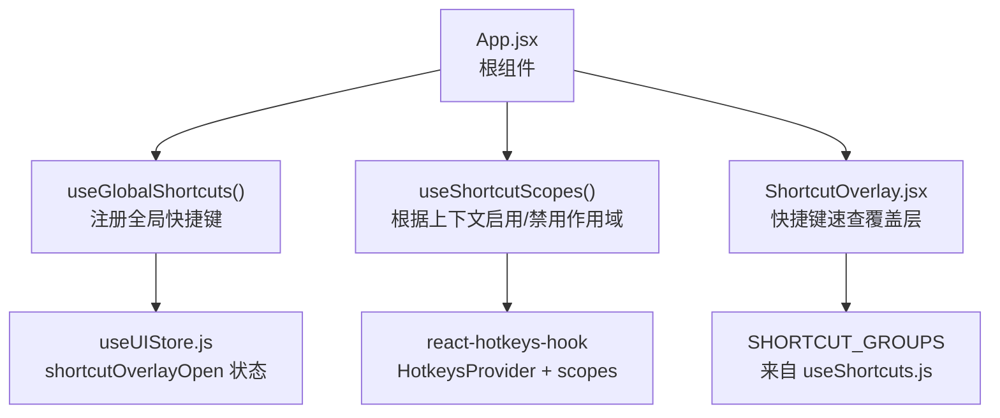
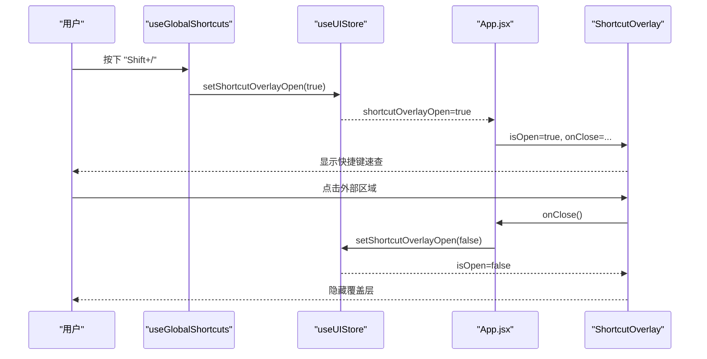
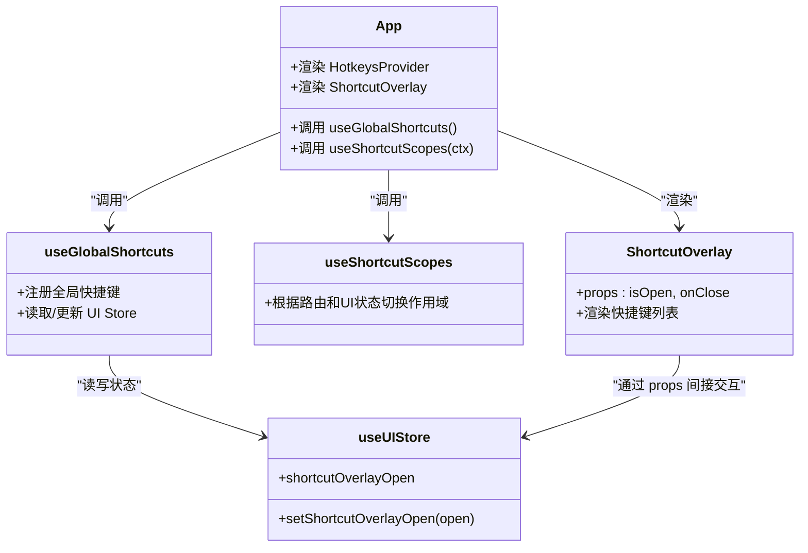
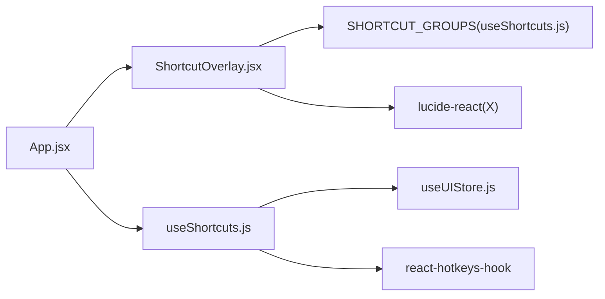

# ShortcutOverlay 快捷键覆盖层组件

<cite>
**本文引用的文件**
- [ShortcutOverlay.jsx](file://app/src/components/ShortcutOverlay.jsx)
- [useShortcuts.js](file://app/src/hooks/useShortcuts.js)
- [App.jsx](file://app/src/App.jsx)
- [useUIStore.js](file://app/src/stores/useUIStore.js)
</cite>

## 目录
1. [简介](#简介)
2. [项目结构](#项目结构)
3. [核心组件与数据流](#核心组件与数据流)
4. [架构总览](#架构总览)
5. [详细组件分析](#详细组件分析)
6. [依赖关系分析](#依赖关系分析)
7. [性能与可访问性](#性能与可访问性)
8. [跨浏览器与移动端适配](#跨浏览器与移动端适配)
9. [故障排查指南](#故障排查指南)
10. [结论](#结论)

## 简介
本文件为 ShortcutOverlay 快捷键覆盖层组件的完整技术文档。内容涵盖：
- 全局快捷键监听与处理机制（按键捕获、组合键识别、冲突解决）
- 快捷键配置的展示结构与扩展方式
- 组件属性配置、事件回调接口与使用示例
- 与 useShortcuts Hook 的协作方式与扩展机制
- 跨浏览器兼容性与移动端适配建议
- 常见问题定位与排障方法

## 项目结构
ShortcutOverlay 位于应用顶层，由 App 渲染；其显示状态由全局 UI Store 管理；快捷键触发逻辑集中在 useShortcuts Hook 中，通过 react-hotkeys-hook 实现基于作用域（scope）的优先级控制。

图示来源
- [App.jsx:353-363](file://app/src/App.jsx#L353-L363)
- [App.jsx:245-270](file://app/src/App.jsx#L245-L270)
- [useShortcuts.js:22-110](file://app/src/hooks/useShortcuts.js#L22-L110)
- [useShortcuts.js:139-184](file://app/src/hooks/useShortcuts.js#L139-L184)
- [useUIStore.js:26-28](file://app/src/stores/useUIStore.js#L26-L28)

章节来源
- [App.jsx:245-270](file://app/src/App.jsx#L245-L270)
- [App.jsx:333-337](file://app/src/App.jsx#L333-L337)
- [useShortcuts.js:22-110](file://app/src/hooks/useShortcuts.js#L22-L110)
- [useShortcuts.js:139-184](file://app/src/hooks/useShortcuts.js#L139-L184)
- [useUIStore.js:26-28](file://app/src/stores/useUIStore.js#L26-L28)

## 核心组件与数据流
- 组件职责
  - ShortcutOverlay：全屏覆盖层，展示当前所有快捷键分组与说明，支持点击外部或按 Esc 关闭。
  - useGlobalShortcuts：集中注册全局快捷键，包括打开/关闭覆盖层、页面导航等。
  - useShortcutScopes：根据路由与 UI 状态动态切换作用域，确保快捷键优先级正确。
  - useUIStore：提供 shortcutOverlayOpen 状态及 setter。

- 关键数据流
  - 用户按下 Shift+/ → useGlobalShortcuts 更新 store 中的 shortcutOverlayOpen → App 将新值传入 ShortcutOverlay → 组件渲染覆盖层。
  - 用户点击覆盖层外部或按 Esc → 调用 setShortcutOverlayOpen(false) → 组件隐藏。

图示来源
- [useShortcuts.js:52-55](file://app/src/hooks/useShortcuts.js#L52-L55)
- [useUIStore.js:147-150](file://app/src/stores/useUIStore.js#L147-L150)
- [App.jsx:333-337](file://app/src/App.jsx#L333-L337)
- [ShortcutOverlay.jsx:24-25](file://app/src/components/ShortcutOverlay.jsx#L24-L25)

章节来源
- [useShortcuts.js:52-63](file://app/src/hooks/useShortcuts.js#L52-L63)
- [useUIStore.js:147-157](file://app/src/stores/useUIStore.js#L147-L157)
- [App.jsx:333-337](file://app/src/App.jsx#L333-L337)
- [ShortcutOverlay.jsx:9-11](file://app/src/components/ShortcutOverlay.jsx#L9-L11)

## 架构总览
系统采用“Hook 驱动 + 作用域优先”的快捷键架构：
- 全局作用域 global 始终激活
- 工作区 workbench、图库 gallery、Lightbox、遮罩编辑器 mask-editor 根据 UI 状态动态启用
- 优先级从高到低：mask-editor > lightbox > workbench > gallery > global

图示来源
- [App.jsx:353-363](file://app/src/App.jsx#L353-L363)
- [App.jsx:245-270](file://app/src/App.jsx#L245-L270)
- [useShortcuts.js:22-110](file://app/src/hooks/useShortcuts.js#L22-L110)
- [useShortcuts.js:116-134](file://app/src/hooks/useShortcuts.js#L116-L134)
- [useUIStore.js:147-157](file://app/src/stores/useUIStore.js#L147-L157)

## 详细组件分析

### 组件 API 与行为
- 属性
  - isOpen: boolean，是否显示覆盖层
  - onClose: () => void，关闭回调
- 行为
  - 当 isOpen 为 false 时不渲染任何节点
  - 点击外层遮罩触发 onClose
  - 内部容器阻止冒泡，避免误关
  - 标题、提示文案、分组列表均从 SHORTCUT_GROUPS 渲染

章节来源
- [ShortcutOverlay.jsx:9-11](file://app/src/components/ShortcutOverlay.jsx#L9-L11)
- [ShortcutOverlay.jsx:24-37](file://app/src/components/ShortcutOverlay.jsx#L24-L37)
- [ShortcutOverlay.jsx:69-115](file://app/src/components/ShortcutOverlay.jsx#L69-L115)

### 快捷键配置与展示
- 数据来源：SHORTCUT_GROUPS（数组），包含多个分组，每个分组含标题与快捷条目
- 条目结构：keys（键名数组）、description（描述文本）
- 渲染策略：两列网格布局，每组内纵向排列条目，键名以 kbd 标签呈现并用 “+” 连接多键

章节来源
- [useShortcuts.js:139-184](file://app/src/hooks/useShortcuts.js#L139-L184)
- [ShortcutOverlay.jsx:69-115](file://app/src/components/ShortcutOverlay.jsx#L69-L115)

### 全局快捷键监听与处理
- 触发覆盖层
  - 组合键：Shift+/
  - 动作：切换 shortcutOverlayOpen
- 关闭覆盖层
  - 按键：Esc
  - 动作：若覆盖层打开则关闭；否则若 Lightbox 打开则关闭 Lightbox
- 其他全局导航
  - 序列键：G>W / G>G / G>K / G>T 分别跳转到工作台、图库、知识库、任务中心

章节来源
- [useShortcuts.js:52-72](file://app/src/hooks/useShortcuts.js#L52-L72)

### 作用域与冲突解决策略
- 作用域定义
  - global：始终启用
  - workbench：仅在首页且无 Lightbox/MaskEditor 时启用
  - gallery：仅在图库页且无 Lightbox 时启用
  - lightbox：Lightbox 打开且无 MaskEditor 时启用
  - mask-editor：MaskEditor 打开时启用（最高优先级）
- 冲突解决
  - 通过 react-hotkeys-hook 的 scopes 机制，仅当前最高优先级作用域生效
  - 使用 toggleScope 在 useEffect 中根据 UI 状态动态切换
  - 对可能拦截默认行为的快捷键显式设置 preventDefault

章节来源
- [useShortcuts.js:116-134](file://app/src/hooks/useShortcuts.js#L116-L134)
- [App.jsx:353-363](file://app/src/App.jsx#L353-L363)

### 与 useShortcuts Hook 的协作与扩展
- 集成点
  - App 初始化 HotkeysProvider，并调用 useGlobalShortcuts 与 useShortcutScopes
  - useGlobalShortcuts 通过 useUIStore 读写覆盖层开关
  - ShortcutOverlay 消费 SHORTCUT_GROUPS 进行展示
- 扩展方式
  - 新增快捷键：在 useGlobalShortcuts 中增加 useHotkeys 注册，必要时调整作用域
  - 新增分组展示：在 SHORTCUT_GROUPS 追加分组与条目
  - 新增作用域：在 useShortcutScopes 中增加 toggleScope 条件判断，并在 App 中保证初始作用域正确

章节来源
- [App.jsx:245-270](file://app/src/App.jsx#L245-L270)
- [useShortcuts.js:22-110](file://app/src/hooks/useShortcuts.js#L22-L110)
- [useShortcuts.js:116-134](file://app/src/hooks/useShortcuts.js#L116-L134)
- [useShortcuts.js:139-184](file://app/src/hooks/useShortcuts.js#L139-L184)

### 使用示例（集成到应用）
- 在根组件中包裹 HotkeysProvider，并传入初始作用域
- 在页面级组件中调用 useGlobalShortcuts 与 useShortcutScopes
- 在需要的位置渲染 ShortcutOverlay，并将 store 中的开关状态与 setter 作为 props 传入

章节来源
- [App.jsx:353-363](file://app/src/App.jsx#L353-L363)
- [App.jsx:245-270](file://app/src/App.jsx#L245-L270)
- [App.jsx:333-337](file://app/src/App.jsx#L333-L337)

## 依赖关系分析
- 组件依赖
  - ShortcutOverlay 依赖 SHORTCUT_GROUPS（来自 useShortcuts）
  - App 依赖 ShortcutOverlay、useGlobalShortcuts、useShortcutScopes、useUIStore
  - useGlobalShortcuts 依赖 react-hotkeys-hook、useUIStore、useGenerationStore、路由钩子
- 外部库
  - react-hotkeys-hook：提供 useHotkeys、useHotkeysContext、HotkeysProvider
  - lucide-react：图标 X
  - zustand：useUIStore 状态管理

图示来源
- [ShortcutOverlay.jsx:1-3](file://app/src/components/ShortcutOverlay.jsx#L1-L3)
- [useShortcuts.js:13-17](file://app/src/hooks/useShortcuts.js#L13-L17)
- [App.jsx:1-16](file://app/src/App.jsx#L1-L16)

章节来源
- [ShortcutOverlay.jsx:1-3](file://app/src/components/ShortcutOverlay.jsx#L1-L3)
- [useShortcuts.js:13-17](file://app/src/hooks/useShortcuts.js#L13-L17)
- [App.jsx:1-16](file://app/src/App.jsx#L1-L16)

## 性能与可访问性
- 性能
  - 覆盖层仅在 isOpen 为 true 时渲染，减少不必要的 DOM 开销
  - 列表渲染基于静态配置数组，计算量小
- 可访问性
  - 关闭按钮具备 aria-label
  - 键盘操作友好：Esc 可关闭，外部点击可关闭
  - 建议：为覆盖层添加焦点陷阱与 Tab 导航顺序，提升无障碍体验

章节来源
- [ShortcutOverlay.jsx:9-11](file://app/src/components/ShortcutOverlay.jsx#L9-L11)
- [ShortcutOverlay.jsx:44-60](file://app/src/components/ShortcutOverlay.jsx#L44-L60)

## 跨浏览器与移动端适配
- 兼容性
  - 使用 react-hotkeys-hook 抽象了底层 keydown 事件差异
  - 组合键与序列键语法由库统一解析
- 移动端
  - 物理键盘场景下组合键可用；纯触屏设备需考虑软键盘与虚拟按键映射
  - 建议在移动端提供替代入口（如悬浮按钮）以打开覆盖层
  - 触控交互已支持点击外部关闭，无需额外处理

[本节为通用指导，不直接分析具体文件]

## 故障排查指南
- 快捷键未触发
  - 检查是否在正确的作用域内（例如 Lightbox/MaskEditor 打开时会屏蔽低优先级作用域）
  - 确认 HotkeysProvider 已包裹应用且 initialScopes 包含 'global'
  - 查看是否有其他组件自行处理 keydown 导致事件被拦截
- 覆盖层无法关闭
  - 确认 onClose 是否正确传递至 ShortcutOverlay
  - 检查 ESC 处理逻辑是否被其他作用域拦截
- 快捷键冲突
  - 调整作用域优先级或在 useShortcutScopes 中细化启用条件
  - 对可能影响默认行为的快捷键显式 preventDefault

章节来源
- [useShortcuts.js:116-134](file://app/src/hooks/useShortcuts.js#L116-L134)
- [App.jsx:353-363](file://app/src/App.jsx#L353-L363)
- [useShortcuts.js:52-63](file://app/src/hooks/useShortcuts.js#L52-L63)

## 结论
ShortcutOverlay 通过简洁的组件设计与集中化的快捷键 Hook 实现了高内聚、低耦合的快捷键体系。借助作用域机制，系统在复杂 UI 状态下仍能保持清晰的快捷键优先级与一致的用户体验。未来可在可访问性增强、移动端交互优化以及配置持久化方面进一步演进。