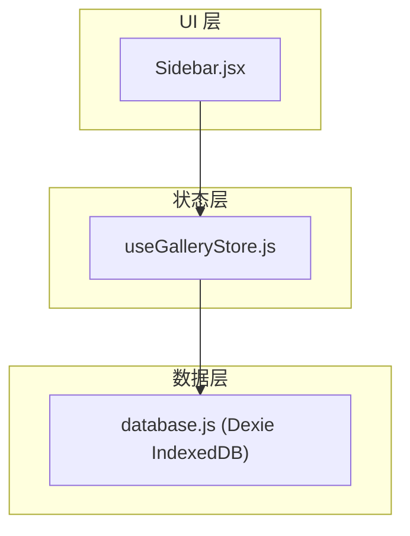
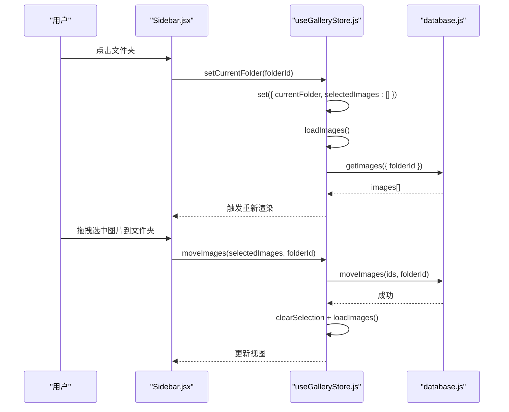
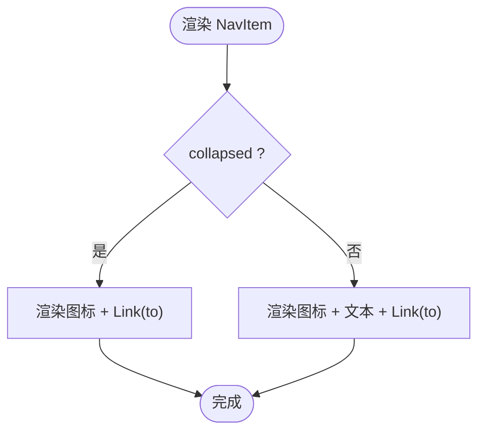
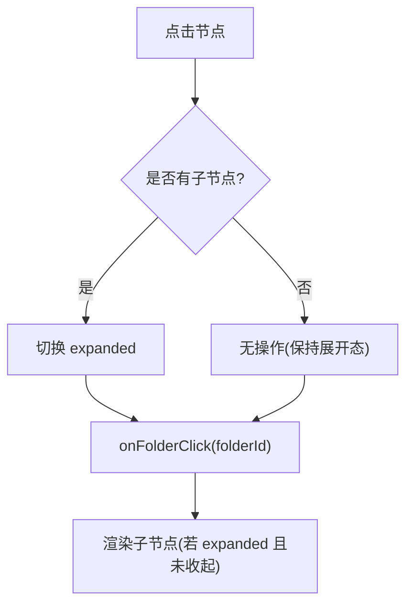
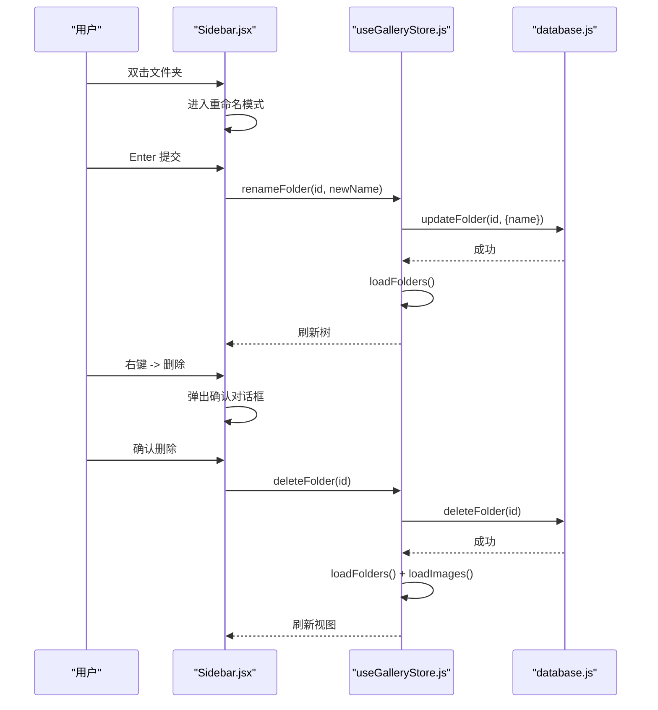
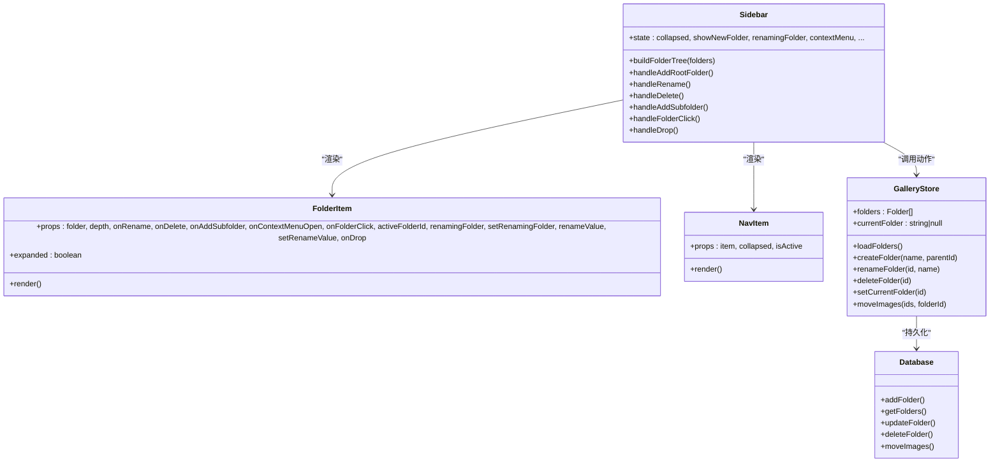

# Sidebar 侧边栏组件

<cite>
**本文引用的文件**
- [Sidebar.jsx](file://app/src/components/Sidebar.jsx)
- [useGalleryStore.js](file://app/src/stores/useGalleryStore.js)
- [database.js](file://app/src/db/database.js)
</cite>

## 目录
1. [简介](#简介)
2. [项目结构](#项目结构)
3. [核心组件与特性](#核心组件与特性)
4. [架构总览](#架构总览)
5. [详细组件分析](#详细组件分析)
6. [依赖关系分析](#依赖关系分析)
7. [性能与体验优化建议](#性能与体验优化建议)
8. [故障排查指南](#故障排查指南)
9. [结论](#结论)
10. [附录：属性接口与事件契约](#附录属性接口与事件契约)

## 简介
本文件为 Sidebar 侧边栏组件的完整技术文档，聚焦以下目标：
- 导航功能：顶部/底部导航项、路由激活状态判断、图标与文本标签管理。
- 文件夹树形结构管理：从扁平列表构建层级树、递归渲染、折叠展开控制。
- 交互能力：拖拽移动图片到文件夹、右键菜单（重命名/删除）、双击重命名、子文件夹创建。
- 状态管理集成：与 useGalleryStore 的深度协作，包括加载、创建、重命名、删除、切换当前文件夹、批量移动等。
- 使用示例与最佳实践：如何在页面中组合使用，以及常见问题的处理策略。

## 项目结构
与 Sidebar 相关的代码主要分布在三个位置：
- 组件实现：app/src/components/Sidebar.jsx
- 状态管理：app/src/stores/useGalleryStore.js
- 数据持久化：app/src/db/database.js

图表来源
- [Sidebar.jsx:154-371](file://app/src/components/Sidebar.jsx#L154-L371)
- [useGalleryStore.js:11-204](file://app/src/stores/useGalleryStore.js#L11-L204)
- [database.js:196-229](file://app/src/db/database.js#L196-L229)

章节来源
- [Sidebar.jsx:1-371](file://app/src/components/Sidebar.jsx#L1-L371)
- [useGalleryStore.js:1-204](file://app/src/stores/useGalleryStore.js#L1-L204)
- [database.js:1-339](file://app/src/db/database.js#L1-L339)

## 核心组件与特性
- 导航项 NavItem
  - 根据路由路径与查询参数计算激活态，支持 exact 匹配与带 query 的路径匹配。
  - 在收起模式下仅显示图标并附带 tooltip；展开模式显示图标+文本。
- 文件夹树 FolderItem
  - 基于扁平 folder 列表构建层级树，递归渲染子节点。
  - 支持点击切换展开/折叠、双击进入重命名、右键菜单（重命名/删除）、悬停显示“新增子文件夹”按钮。
  - 支持拖拽放置：将选中的图片移动到目标文件夹。
- 侧边栏 Sidebar
  - 维护本地 UI 状态（收起/展开、新建/重命名/子文件夹输入、上下文菜单、删除确认）。
  - 通过 useGalleryStore 调用后端动作（创建/重命名/删除文件夹、切换当前文件夹、移动图片）。
  - 提供根级“新建文件夹”入口与文件夹标题区操作。

章节来源
- [Sidebar.jsx:11-25](file://app/src/components/Sidebar.jsx#L11-L25)
- [Sidebar.jsx:27-42](file://app/src/components/Sidebar.jsx#L27-L42)
- [Sidebar.jsx:44-130](file://app/src/components/Sidebar.jsx#L44-L130)
- [Sidebar.jsx:132-152](file://app/src/components/Sidebar.jsx#L132-L152)
- [Sidebar.jsx:154-371](file://app/src/components/Sidebar.jsx#L154-L371)

## 架构总览
Sidebar 作为 UI 容器，负责用户交互与局部状态；业务逻辑与数据持久化委托给 useGalleryStore 与 database 层。

图表来源
- [Sidebar.jsx:231-244](file://app/src/components/Sidebar.jsx#L231-L244)
- [useGalleryStore.js:101-108](file://app/src/stores/useGalleryStore.js#L101-L108)
- [database.js:122-127](file://app/src/db/database.js#L122-L127)
- [useGalleryStore.js:148-152](file://app/src/stores/useGalleryStore.js#L148-L152)
- [database.js:56-76](file://app/src/db/database.js#L56-L76)

## 详细组件分析

### 导航项 NavItem
- 作用：渲染单个导航链接，包含图标与可选文本，依据 isActive 决定高亮样式。
- 激活态判断：由父级 Sidebar 的 isActive(item) 计算，支持 exact 与 query 匹配。
- 收起模式：隐藏文本，保留图标，并通过 data-tooltip 提供提示。
- 交互：hover 时改变背景与文字色，提升可发现性。

图表来源
- [Sidebar.jsx:132-152](file://app/src/components/Sidebar.jsx#L132-L152)
- [Sidebar.jsx:187-193](file://app/src/components/Sidebar.jsx#L187-L193)

章节来源
- [Sidebar.jsx:132-152](file://app/src/components/Sidebar.jsx#L132-L152)
- [Sidebar.jsx:187-193](file://app/src/components/Sidebar.jsx#L187-L193)

### 文件夹项 FolderItem
- 作用：渲染单个文件夹节点，支持展开/折叠、重命名、新增子文件夹、右键菜单、拖拽放置。
- 关键行为：
  - 展开/折叠：当存在子节点时，点击切换 expanded 状态。
  - 重命名：双击进入编辑，Enter 提交，Escape 取消。
  - 右键菜单：打开后提供“重命名”和“删除”，由父级 Sidebar 统一处理。
  - 新增子文件夹：悬停显示“+”按钮，点击在当前节点下插入输入框。
  - 拖拽：接收 drop 事件，将当前选中的图片移动到该文件夹。
- 视觉反馈：hover 高亮、active 高亮、展开箭头旋转、文件夹图标变化。

图表来源
- [Sidebar.jsx:44-130](file://app/src/components/Sidebar.jsx#L44-L130)

章节来源
- [Sidebar.jsx:44-130](file://app/src/components/Sidebar.jsx#L44-L130)

### 侧边栏 Sidebar
- 职责：
  - 管理本地 UI 状态（收起/展开、新建/重命名/子文件夹输入、上下文菜单、删除确认）。
  - 构建文件夹树：将 store.folders 扁平列表转换为树结构。
  - 路由联动：点击文件夹时设置 currentFolder 并导航至 /gallery?folder=...。
  - 事件分发：将用户操作转发到 useGalleryStore 的动作方法。
- 关键流程：
  - 初始化：挂载时加载 folders。
  - 新建根文件夹：输入名称后调用 createFolder。
  - 重命名/删除：通过上下文菜单或双击触发，调用 renameFolder/deleteFolder。
  - 拖拽移动：读取全局 selectedImages，调用 moveImages。

图表来源
- [Sidebar.jsx:208-229](file://app/src/components/Sidebar.jsx#L208-L229)
- [useGalleryStore.js:132-146](file://app/src/stores/useGalleryStore.js#L132-L146)
- [database.js:215-229](file://app/src/db/database.js#L215-L229)

章节来源
- [Sidebar.jsx:154-371](file://app/src/components/Sidebar.jsx#L154-L371)
- [useGalleryStore.js:11-204](file://app/src/stores/useGalleryStore.js#L11-L204)
- [database.js:196-229](file://app/src/db/database.js#L196-L229)

## 依赖关系分析
- 组件依赖
  - Sidebar.jsx 依赖 react-router-dom 进行导航与路由解析。
  - Sidebar.jsx 依赖 lucide-react 图标库。
  - Sidebar.jsx 依赖 useGalleryStore 与 useUIStore 进行状态与通知。
- 状态与数据
  - useGalleryStore 封装了所有与图片/文件夹相关的读写操作，内部调用 database.js。
  - database.js 基于 Dexie 对 IndexedDB 进行操作，定义表结构与 CRUD 方法。

图表来源
- [Sidebar.jsx:44-152](file://app/src/components/Sidebar.jsx#L44-L152)
- [useGalleryStore.js:11-204](file://app/src/stores/useGalleryStore.js#L11-L204)
- [database.js:196-229](file://app/src/db/database.js#L196-L229)

章节来源
- [Sidebar.jsx:1-371](file://app/src/components/Sidebar.jsx#L1-L371)
- [useGalleryStore.js:1-204](file://app/src/stores/useGalleryStore.js#L1-L204)
- [database.js:1-339](file://app/src/db/database.js#L1-L339)

## 性能与体验优化建议
- 树构建复杂度
  - buildFolderTree 采用两次遍历 O(n)，适合中等规模文件夹数量。若文件夹数量极大，可考虑增量更新或缓存已构建的树。
- 渲染优化
  - FolderItem 的展开/折叠状态为组件内局部状态，避免整棵树重渲染。
  - 对于深层树，可考虑虚拟滚动或按需加载子节点（懒加载），减少首屏渲染压力。
- 拖拽体验
  - 当前拖拽仅支持“放置到文件夹”，未实现跨层级拖拽排序。如需更丰富的拖拽体验，可引入受控的 dragSource/dragTarget 机制。
- 路由与筛选
  - 当前点击文件夹会设置 currentFolder 并导航到 /gallery?folder=...，建议在 Gallery 页面同时监听 URL 参数以同步视图。

[本节为通用建议，不直接分析具体文件]

## 故障排查指南
- 无法加载文件夹
  - 检查 useGalleryStore.loadFolders 是否被调用，确认 database.getFolders 返回数据。
  - 查看控制台错误日志，确认 IndexedDB 初始化成功。
- 重命名无效
  - 确认 handleRename 是否正确调用 renameFolder，并在成功后触发 loadFolders。
- 删除后视图未更新
  - 确保 deleteFolder 在删除后调用 loadFolders 与 loadImages，并清理 currentFolder。
- 拖拽移动失败
  - 检查 selectedImages 是否为空，moveImages 是否成功执行，随后是否清空选择并刷新图片列表。
- 上下文菜单不消失
  - 确认 document click 监听器是否正确移除旧监听器，避免内存泄漏。

章节来源
- [useGalleryStore.js:64-72](file://app/src/stores/useGalleryStore.js#L64-L72)
- [useGalleryStore.js:132-146](file://app/src/stores/useGalleryStore.js#L132-L146)
- [useGalleryStore.js:101-108](file://app/src/stores/useGalleryStore.js#L101-L108)
- [Sidebar.jsx:185](file://app/src/components/Sidebar.jsx#L185)

## 结论
Sidebar 组件通过清晰的职责划分与良好的状态管理集成，提供了完整的导航与文件夹管理能力。其核心优势在于：
- 简洁的树构建与递归渲染，易于扩展与维护。
- 完善的交互覆盖：折叠/展开、重命名、删除、新增子文件夹、拖拽移动。
- 与 useGalleryStore 的紧密协作，保证数据一致性与用户体验。

在实际使用中，建议结合 Gallery 页面的路由参数同步视图，并根据需要引入懒加载与虚拟滚动以提升大规模数据下的性能。

[本节为总结性内容，不直接分析具体文件]

## 附录：属性接口与事件契约

### NavItem 属性
- item: 导航项配置对象
  - label: 文本标签
  - icon: 图标组件
  - to: 路由路径（可含查询参数）
  - exact: 是否精确匹配路径
- collapsed: 是否收起模式
- isActive: 是否处于激活态

章节来源
- [Sidebar.jsx:132-152](file://app/src/components/Sidebar.jsx#L132-L152)
- [Sidebar.jsx:187-193](file://app/src/components/Sidebar.jsx#L187-L193)

### FolderItem 属性
- folder: 文件夹节点对象（含 id、name、children）
- collapsed: 是否收起模式
- depth: 层级深度（用于缩进）
- onRename(folderId, newName): 重命名回调
- onDelete(folderId): 删除回调
- onAddSubfolder(parentId): 新增子文件夹回调
- onContextMenuOpen(context): 打开上下文菜单回调
- onFolderClick(folderId): 点击文件夹回调
- activeFolderId: 当前激活的文件夹 ID
- renamingFolder: 正在重命名的文件夹 ID
- setRenamingFolder(id): 设置重命名状态
- renameValue: 重命名输入值
- setRenameValue(value): 设置重命名输入值
- onDrop(folderId): 拖拽放置回调

章节来源
- [Sidebar.jsx:44-130](file://app/src/components/Sidebar.jsx#L44-L130)

### Sidebar 对外暴露的行为
- 新建根文件夹：通过顶部“+”按钮触发，调用 createFolder。
- 重命名/删除：通过双击或右键菜单触发，调用 renameFolder/deleteFolder。
- 新增子文件夹：通过悬停“+”按钮触发，调用 createFolder(parentId)。
- 切换当前文件夹：点击文件夹行，调用 setCurrentFolder 并导航。
- 拖拽移动：drop 到文件夹，调用 moveImages。

章节来源
- [Sidebar.jsx:195-244](file://app/src/components/Sidebar.jsx#L195-L244)
- [useGalleryStore.js:125-152](file://app/src/stores/useGalleryStore.js#L125-L152)

### 与 useGalleryStore 的集成要点
- 读取状态：folders、currentFolder、selectedImages。
- 调用动作：loadFolders、createFolder、renameFolder、deleteFolder、setCurrentFolder、moveImages。
- 结果刷新：各写操作完成后均会触发 loadFolders/loadImages，确保视图与数据一致。

章节来源
- [useGalleryStore.js:11-204](file://app/src/stores/useGalleryStore.js#L11-L204)
- [database.js:196-229](file://app/src/db/database.js#L196-L229)