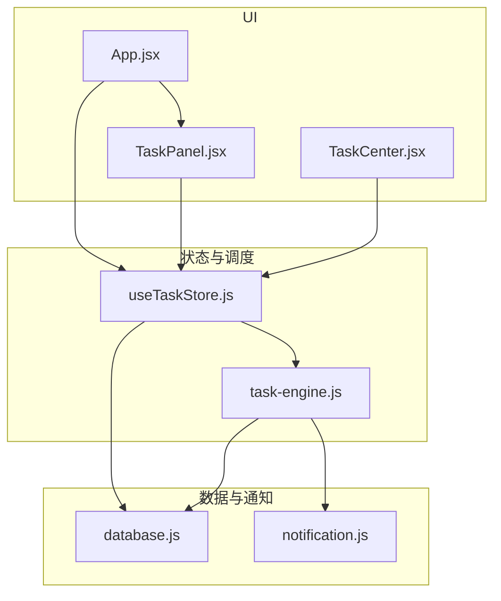
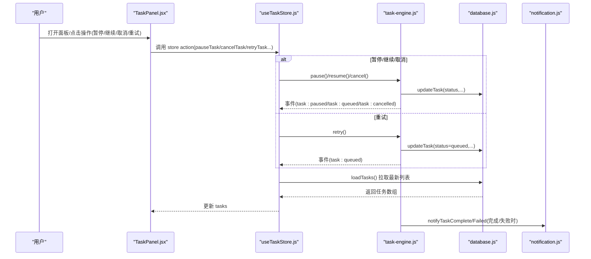
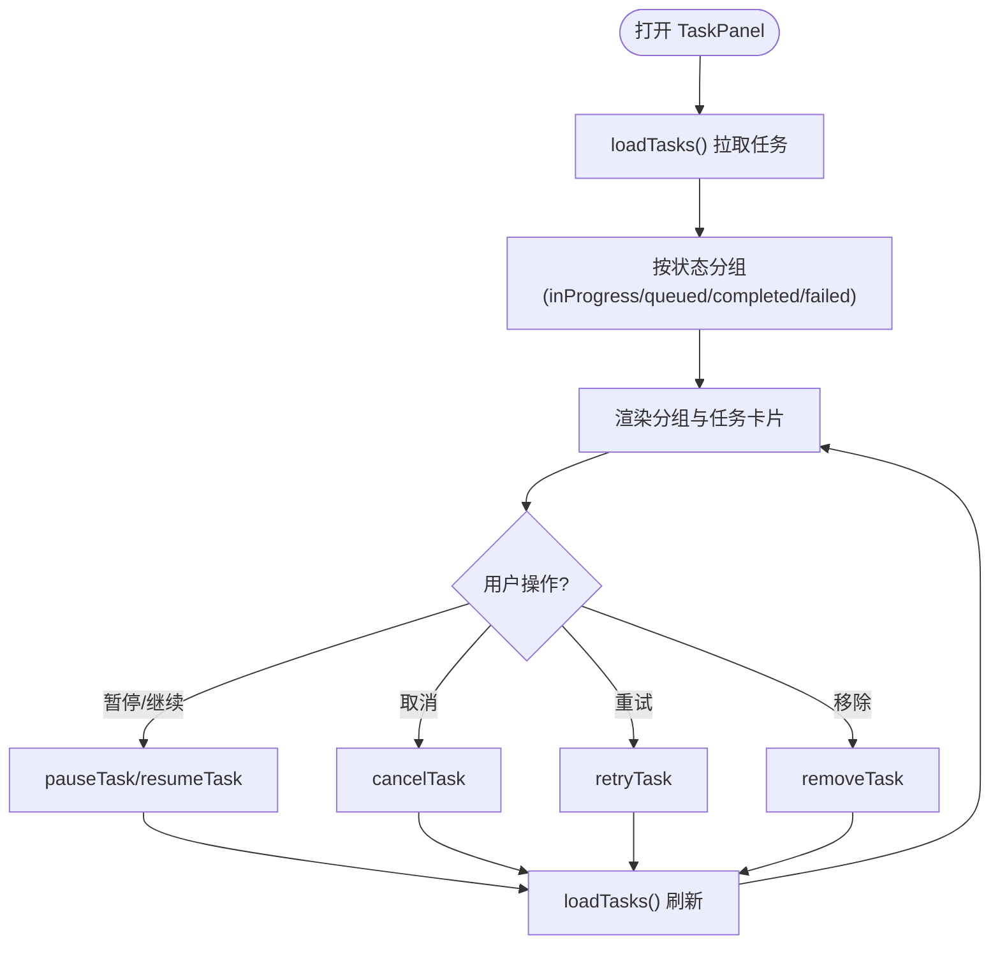
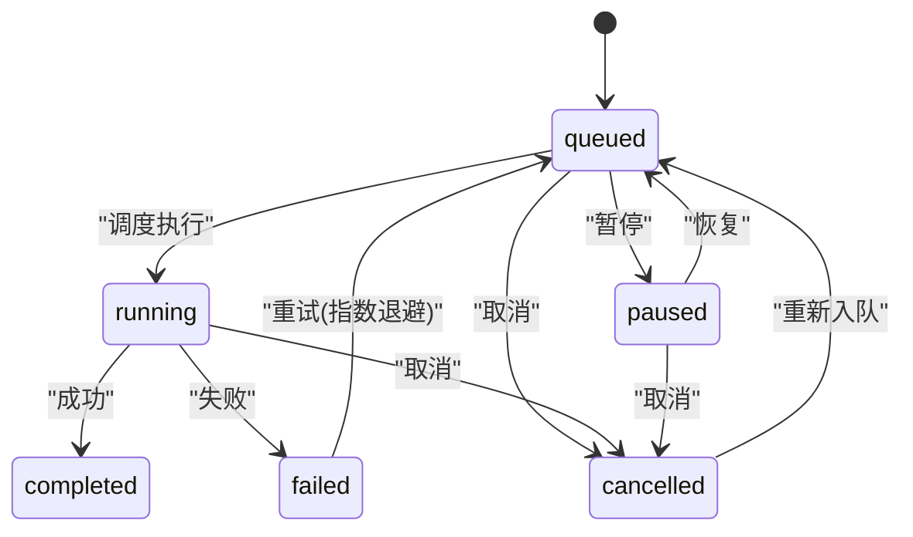
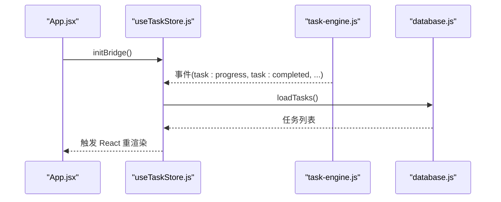
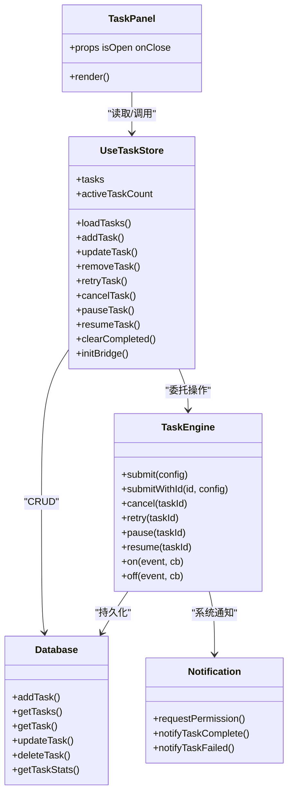

# TaskPanel 任务面板组件

<cite>
**本文引用的文件**   
- [TaskPanel.jsx](file://app/src/components/TaskPanel.jsx)
- [useTaskStore.js](file://app/src/stores/useTaskStore.js)
- [task-engine.js](file://app/src/services/task-engine.js)
- [database.js](file://app/src/db/database.js)
- [notification.js](file://app/src/services/notification.js)
- [App.jsx](file://app/src/App.jsx)
- [TaskCenter.jsx](file://app/src/pages/TaskCenter.jsx)
</cite>

## 目录
1. [简介](#简介)
2. [项目结构](#项目结构)
3. [核心组件](#核心组件)
4. [架构总览](#架构总览)
5. [详细组件分析](#详细组件分析)
6. [依赖关系分析](#依赖关系分析)
7. [性能考量](#性能考量)
8. [故障排查指南](#故障排查指南)
9. [结论](#结论)
10. [附录：属性与事件接口](#附录属性与事件接口)

## 简介
TaskPanel 是应用右侧的任务侧边栏，用于实时展示后台任务的运行状态、进度条、错误信息，并提供暂停/继续、取消、重试、移除等交互。它与任务引擎（TaskEngine）通过事件桥接和 IndexedDB 持久化实现状态同步，确保 UI 与任务执行保持一致。

## 项目结构
围绕 TaskPanel 的关键文件与职责如下：
- 组件层：TaskPanel.jsx 负责渲染与用户交互
- 状态层：useTaskStore.js 管理任务列表、操作封装、事件桥接
- 调度层：task-engine.js 提供并发控制、状态机、重试、通知
- 数据层：database.js 基于 Dexie 的 IndexedDB 读写
- 通知层：notification.js 浏览器系统通知
- 集成入口：App.jsx 挂载 TaskPanel 并初始化事件桥
- 全量页面：TaskCenter.jsx 提供完整任务中心视图（可作为参考对比）

图表来源
- [TaskPanel.jsx:1-538](file://app/src/components/TaskPanel.jsx#L1-L538)
- [useTaskStore.js:1-173](file://app/src/stores/useTaskStore.js#L1-L173)
- [task-engine.js:1-319](file://app/src/services/task-engine.js#L1-L319)
- [database.js:1-339](file://app/src/db/database.js#L1-L339)
- [notification.js:1-113](file://app/src/services/notification.js#L1-L113)
- [App.jsx:1-364](file://app/src/App.jsx#L1-L364)
- [TaskCenter.jsx:1-218](file://app/src/pages/TaskCenter.jsx#L1-L218)

章节来源
- [TaskPanel.jsx:1-538](file://app/src/components/TaskPanel.jsx#L1-L538)
- [useTaskStore.js:1-173](file://app/src/stores/useTaskStore.js#L1-L173)
- [task-engine.js:1-319](file://app/src/services/task-engine.js#L1-L319)
- [database.js:1-339](file://app/src/db/database.js#L1-L339)
- [notification.js:1-113](file://app/src/services/notification.js#L1-L113)
- [App.jsx:1-364](file://app/src/App.jsx#L1-L364)
- [TaskCenter.jsx:1-218](file://app/src/pages/TaskCenter.jsx#L1-L218)

## 核心组件
- TaskPanel 组件
  - 功能：分组显示“进行中/排队中/已完成/失败”任务；展示模型名、提示词、进度百分比与进度条；支持暂停/继续、取消、重试、移除；底部提供跳转“查看全部任务”链接。
  - 数据来源：useTaskStore 暴露的 tasks 列表及 actions。
  - 交互响应：点击按钮调用 store 方法，store 再委托给 TaskEngine 或数据库。
- useTaskStore 状态管理
  - 功能：加载任务、增删改查、重试/取消/暂停/恢复、统计、清理完成项；订阅 TaskEngine 事件并刷新本地任务列表。
  - 事件桥：initBridge 监听 engine 的事件，统一触发 loadTasks 以拉取最新数据。
- TaskEngine 任务引擎
  - 功能：最大并发、FIFO 队列、指数退避重试、状态机转换、进度上报、自动持久化、系统通知。
  - 状态机：queued -> running | cancelled | paused；running -> completed | failed | cancelled；paused -> queued | cancelled；failed -> queued（重试）。
- database 数据层
  - 功能：基于 Dexie 的 IndexedDB 表定义与 CRUD；tasks 表包含 id、type、status、model、prompt、params、progress、error、result、retryCount、createdAt、updatedAt 等字段。
- notification 通知服务
  - 功能：请求权限、发送系统通知；在任务完成/失败时推送消息。

章节来源
- [TaskPanel.jsx:1-538](file://app/src/components/TaskPanel.jsx#L1-L538)
- [useTaskStore.js:1-173](file://app/src/stores/useTaskStore.js#L1-L173)
- [task-engine.js:1-319](file://app/src/services/task-engine.js#L1-L319)
- [database.js:1-339](file://app/src/db/database.js#L1-L339)
- [notification.js:1-113](file://app/src/services/notification.js#L1-L113)

## 架构总览
TaskPanel 通过 Zustand store 订阅任务数据，store 与 TaskEngine 通过事件桥接保持同步，所有状态变更均持久化到 IndexedDB。

图表来源
- [TaskPanel.jsx:1-538](file://app/src/components/TaskPanel.jsx#L1-L538)
- [useTaskStore.js:1-173](file://app/src/stores/useTaskStore.js#L1-L173)
- [task-engine.js:1-319](file://app/src/services/task-engine.js#L1-L319)
- [database.js:1-339](file://app/src/db/database.js#L1-L339)
- [notification.js:1-113](file://app/src/services/notification.js#L1-L113)

## 详细组件分析

### TaskPanel 组件
- 界面元素
  - 头部：标题与任务总数徽标，关闭按钮。
  - 分组区域：进行中（含已暂停）、排队中、已完成、失败。
  - 任务卡片：提示词、模型标签、进度百分比、进度条、操作按钮。
  - 底部：跳转到“任务中心”的全量页面。
- 状态显示与进度条
  - 进行中任务显示 progress 百分比与宽度动画；暂停时进度条使用警告色。
  - 失败任务展示 error 文本，默认“未知错误”。
- 用户交互
  - 暂停/继续：根据当前状态切换按钮图标与行为。
  - 取消：从队列或活动任务中移除并标记为 cancelled。
  - 重试：仅对失败任务可用，成功后弹出 toast 提示。
  - 移除：删除任务记录。
- 展开/折叠
  - 各分组可独立展开/折叠，提升长列表可读性。
- 路由联动
  - 底部链接跳转到 #/task-center 查看全量任务。

图表来源
- [TaskPanel.jsx:1-538](file://app/src/components/TaskPanel.jsx#L1-L538)
- [useTaskStore.js:1-173](file://app/src/stores/useTaskStore.js#L1-L173)

章节来源
- [TaskPanel.jsx:1-538](file://app/src/components/TaskPanel.jsx#L1-L538)

### 任务状态机与转换逻辑
- 合法转换
  - queued -> running | cancelled | paused
  - running -> completed | failed | cancelled
  - paused -> queued | cancelled
  - failed -> queued（重试）
  - completed -> 无出边
  - cancelled -> queued（重新入队）
- 触发点
  - 提交任务：进入 queued，随后被调度器取出进入 running。
  - 任务执行成功：completed，进度置 100%。
  - 任务异常：根据是否可重试决定进入 queued（带 backoff）或 failed。
  - 用户操作：暂停/继续/取消分别对应 paused/queued/cancelled。

图表来源
- [task-engine.js:18-31](file://app/src/services/task-engine.js#L18-L31)

章节来源
- [task-engine.js:18-31](file://app/src/services/task-engine.js#L18-L31)

### 实时更新机制
- 事件桥
  - App 启动时调用 useTaskStore.initBridge()，订阅 engine 的所有关键事件（queued/started/progress/completed/failed/cancelled/paused/retry），每次事件后统一 loadTasks() 拉取最新数据。
- 数据一致性
  - TaskEngine 在执行过程中持续更新 IndexedDB（状态、进度、错误、结果、时间戳），UI 通过 store 的 loadTasks 读取一致快照。
- 通知
  - 任务完成/失败时，engine 调用通知服务推送系统通知。

图表来源
- [App.jsx:272-279](file://app/src/App.jsx#L272-L279)
- [useTaskStore.js:39-64](file://app/src/stores/useTaskStore.js#L39-L64)
- [task-engine.js:222-297](file://app/src/services/task-engine.js#L222-L297)
- [database.js:243-251](file://app/src/db/database.js#L243-L251)

章节来源
- [App.jsx:272-279](file://app/src/App.jsx#L272-L279)
- [useTaskStore.js:39-64](file://app/src/stores/useTaskStore.js#L39-L64)
- [task-engine.js:222-297](file://app/src/services/task-engine.js#L222-L297)
- [database.js:243-251](file://app/src/db/database.js#L243-L251)

### 与任务引擎的状态同步策略
- 写入路径
  - 用户操作 -> store action -> TaskEngine API -> 更新 IndexedDB -> 事件广播 -> store 刷新 -> UI 更新。
- 幂等与容错
  - 所有写操作均有 try/catch，失败时回退到直接更新本地状态，保证 UI 不崩溃。
- 进度上报
  - execute(ctx) 中的 ctx.onProgress(percent) 会持久化并广播进度事件，驱动 UI 平滑更新。

章节来源
- [useTaskStore.js:109-157](file://app/src/stores/useTaskStore.js#L109-L157)
- [task-engine.js:230-237](file://app/src/services/task-engine.js#L230-L237)

### 筛选、排序与批量操作
- 筛选与排序
  - TaskPanel 内部按状态分组展示，未提供关键词搜索与多列排序。
  - 全量页面 TaskCenter 同样按状态分组，未内置高级筛选与排序。
- 批量操作
  - 当前未提供批量选择与批量操作能力。
- 建议扩展
  - 在 store 层增加 filter/sort 派生状态，或在 UI 层引入轻量过滤输入框与下拉排序。
  - 批量操作可通过多选 + 批量取消/重试/移除实现。

章节来源
- [TaskPanel.jsx:30-37](file://app/src/components/TaskPanel.jsx#L30-L37)
- [TaskCenter.jsx:43-53](file://app/src/pages/TaskCenter.jsx#L43-L53)

## 依赖关系分析
- 组件耦合
  - TaskPanel 仅依赖 useTaskStore 暴露的 state 与 actions，低耦合、易测试。
- 外部依赖
  - Dexie（IndexedDB）、uuid（任务 ID）、lucide-react（图标）。
- 事件总线
  - TaskEngine 作为单例，提供 on/off/_emit 事件机制，store 作为消费者订阅。

图表来源
- [TaskPanel.jsx:1-538](file://app/src/components/TaskPanel.jsx#L1-L538)
- [useTaskStore.js:1-173](file://app/src/stores/useTaskStore.js#L1-L173)
- [task-engine.js:1-319](file://app/src/services/task-engine.js#L1-L319)
- [database.js:1-339](file://app/src/db/database.js#L1-L339)
- [notification.js:1-113](file://app/src/services/notification.js#L1-L113)

章节来源
- [TaskPanel.jsx:1-538](file://app/src/components/TaskPanel.jsx#L1-L538)
- [useTaskStore.js:1-173](file://app/src/stores/useTaskStore.js#L1-L173)
- [task-engine.js:1-319](file://app/src/services/task-engine.js#L1-L319)
- [database.js:1-339](file://app/src/db/database.js#L1-L339)
- [notification.js:1-113](file://app/src/services/notification.js#L1-L113)

## 性能考量
- 渲染优化
  - 使用 useMemo 进行分组计算，避免每次渲染重复遍历。
  - 列表 key 使用唯一 taskId，减少不必要的重排。
- 数据刷新频率
  - 采用事件驱动 + loadTasks 拉取，避免高频轮询；若需更细粒度更新，可在进度事件中局部增量更新（需谨慎避免抖动）。
- 并发与吞吐
  - TaskEngine 默认最大并发 3，可按需 setMaxConcurrent 调整。
- 存储开销
  - 定期清理已完成任务（clearCompleted）可减少 IndexedDB 体积。
- 样式与动画
  - 进度条使用 CSS transition，避免 JS 频繁布局。

[本节为通用指导，无需具体文件引用]

## 故障排查指南
- 面板不显示任务
  - 检查 App 是否在启动时调用了 loadTasks 与 initBridge。
  - 确认 IndexedDB 初始化成功且 tasks 表存在。
- 操作无效
  - 查看 store action 的 catch 分支是否触发了回退更新。
  - 确认 TaskEngine 对应方法是否抛出异常或被拦截。
- 进度不更新
  - 确认 execute 中是否调用 ctx.onProgress。
  - 检查 engine 是否广播了 task:progress 事件。
- 无法收到系统通知
  - 检查 requestPermission 是否调用且用户授权。
  - 确认浏览器是否支持 Notification API。

章节来源
- [App.jsx:272-284](file://app/src/App.jsx#L272-L284)
- [useTaskStore.js:23-33](file://app/src/stores/useTaskStore.js#L23-L33)
- [task-engine.js:259-297](file://app/src/services/task-engine.js#L259-L297)
- [notification.js:19-43](file://app/src/services/notification.js#L19-L43)

## 结论
TaskPanel 以简洁的侧边栏形态提供了完整的任务监控与管理体验。其设计将 UI 与调度解耦，通过事件桥与持久化保障状态一致性，具备较好的可扩展性与可维护性。后续可在筛选、排序与批量操作上进一步增强，以满足更复杂的任务管理需求。

[本节为总结，无需具体文件引用]

## 附录：属性与事件接口

### TaskPanel 组件属性
- isOpen: boolean，是否显示面板
- onClose: function，关闭面板回调

章节来源
- [TaskPanel.jsx:9](file://app/src/components/TaskPanel.jsx#L9-L9)

### useTaskStore 暴露的常用方法与状态
- 状态
  - tasks: 任务数组
  - activeTaskCount: 活跃任务计数
- 方法
  - loadTasks(): 加载任务列表
  - addTask(taskConfig): 新增任务
  - updateTask(taskId, changes): 更新任务字段
  - removeTask(taskId): 删除任务
  - retryTask(taskId): 重试失败任务
  - cancelTask(taskId): 取消任务
  - pauseTask(taskId): 暂停任务
  - resumeTask(taskId): 恢复任务
  - clearCompleted(): 清空已完成任务
  - getTaskStats(): 获取统计
  - initBridge(): 初始化事件桥（返回清理函数）

章节来源
- [useTaskStore.js:14-172](file://app/src/stores/useTaskStore.js#L14-L172)

### TaskEngine 对外 API
- submit(config): 提交任务，返回 Promise
- submitWithId(dbTaskId, config): 使用已有任务 ID 提交
- cancel(taskId): 取消任务
- retry(taskId): 重试任务
- pause(taskId): 暂停任务
- resume(taskId): 恢复任务
- setMaxConcurrent(n): 设置最大并发
- on(event, callback)/off(event, callback): 事件订阅/取消
- getStats(): 获取统计信息

章节来源
- [task-engine.js:44-187](file://app/src/services/task-engine.js#L44-L187)

### 事件类型（供 store 订阅）
- task:queued / task:started / task:progress / task:completed / task:failed / task:cancelled / task:paused / task:retry

章节来源
- [useTaskStore.js:45-49](file://app/src/stores/useTaskStore.js#L45-L49)
- [task-engine.js:222-297](file://app/src/services/task-engine.js#L222-L297)

### 数据库任务表字段（tasks）
- id, type, status, model, prompt, params, progress, error, result, retryCount, createdAt, updatedAt

章节来源
- [database.js:22-31](file://app/src/db/database.js#L22-L31)
- [database.js:235-274](file://app/src/db/database.js#L235-L274)