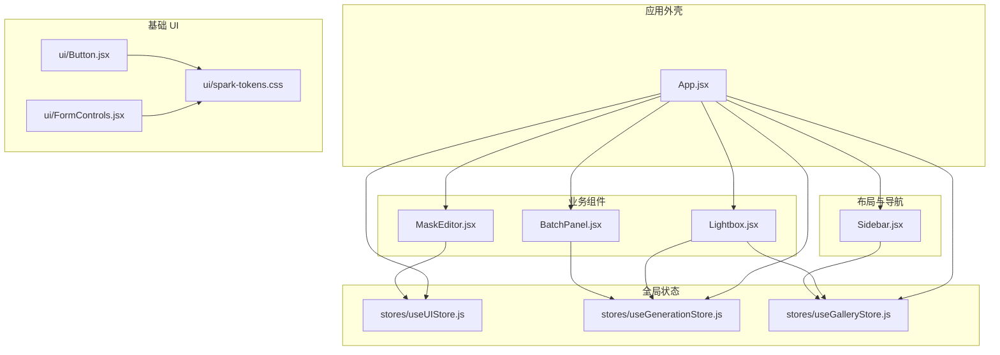
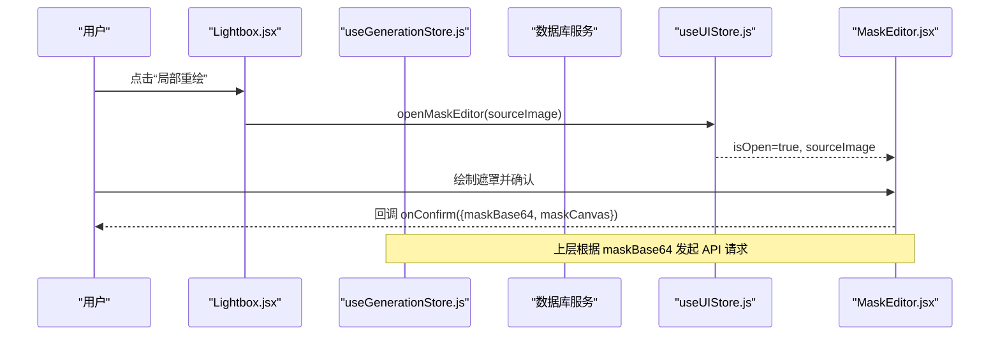
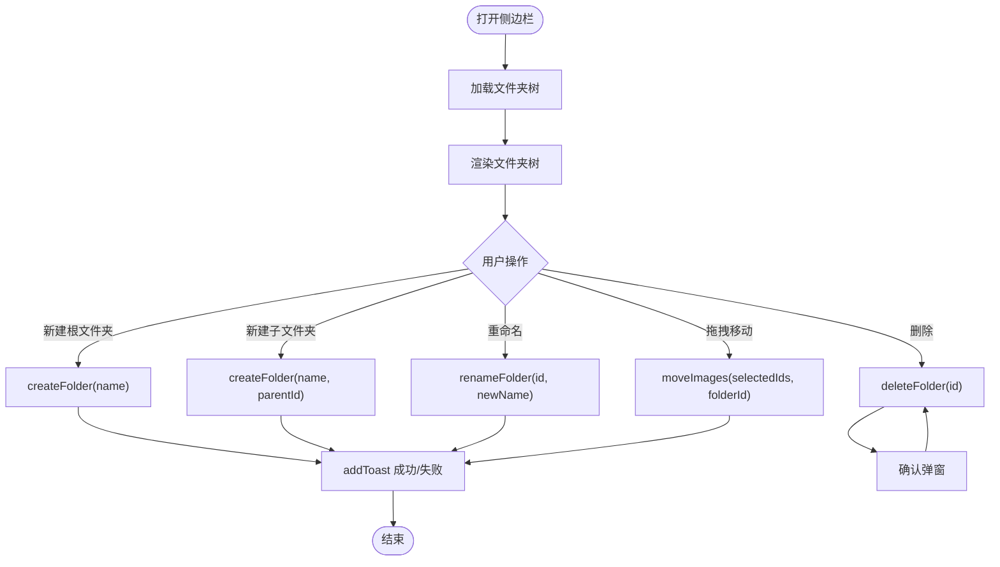
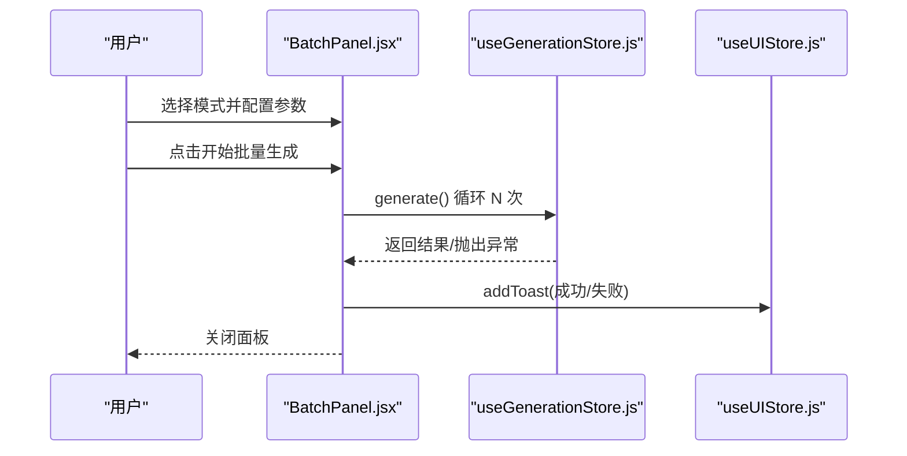
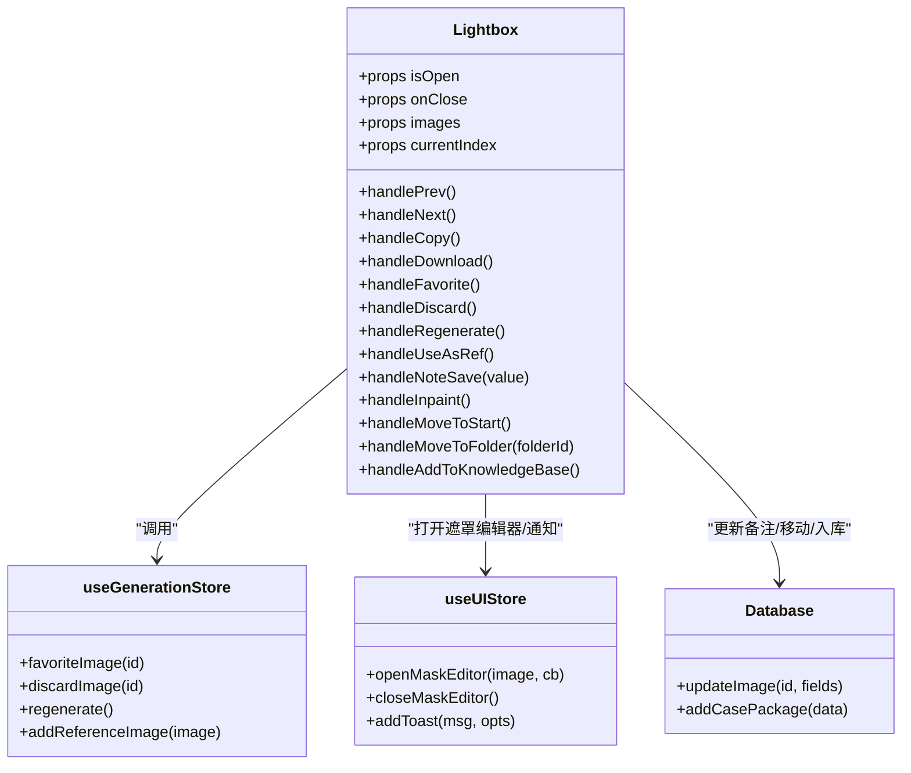
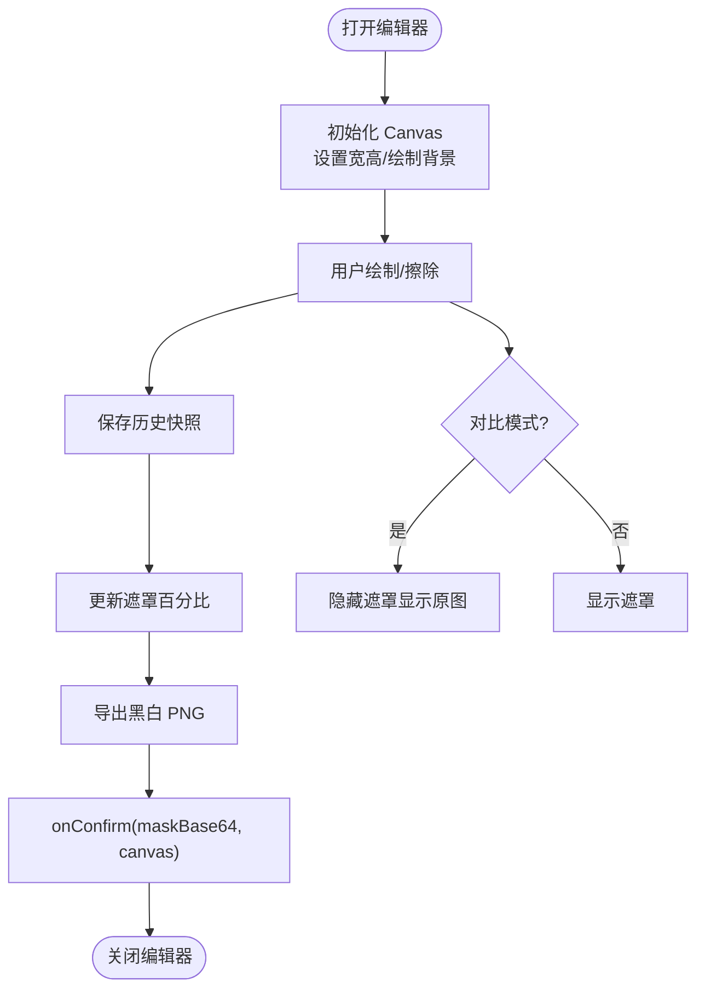
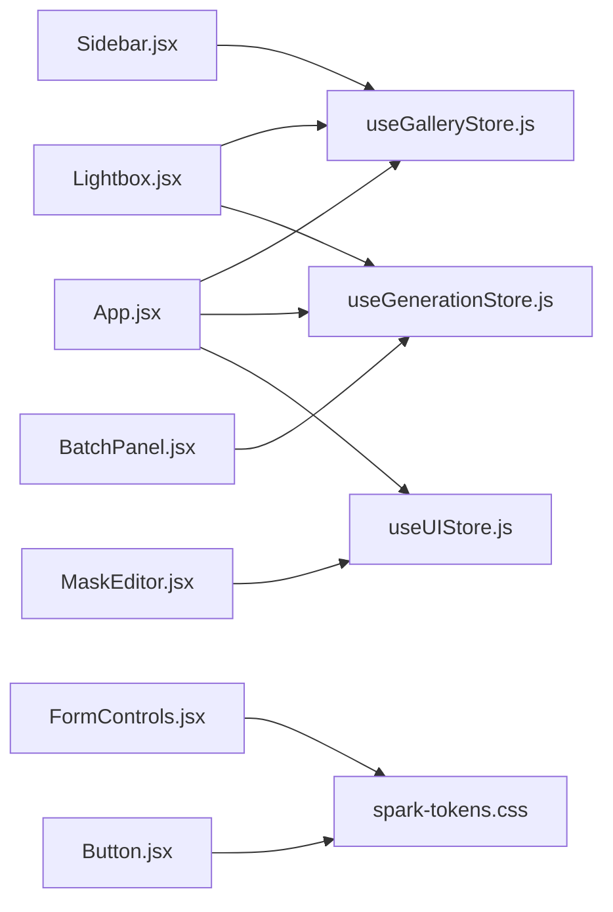

# UI 组件库

<cite>
**本文引用的文件**   
- [app/src/App.jsx](file://app/src/App.jsx)
- [app/src/components/Sidebar.jsx](file://app/src/components/Sidebar.jsx)
- [app/src/components/BatchPanel.jsx](file://app/src/components/BatchPanel.jsx)
- [app/src/components/Lightbox.jsx](file://app/src/components/Lightbox.jsx)
- [app/src/components/MaskEditor.jsx](file://app/src/components/MaskEditor.jsx)
- [app/src/components/ui/Button.jsx](file://app/src/components/ui/Button.jsx)
- [app/src/components/ui/FormControls.jsx](file://app/src/components/ui/FormControls.jsx)
- [app/src/components/ui/spark-tokens.css](file://app/src/components/ui/spark-tokens.css)
- [app/src/stores/useUIStore.js](file://app/src/stores/useUIStore.js)
- [app/src/stores/useGenerationStore.js](file://app/src/stores/useGenerationStore.js)
- [app/src/stores/useGalleryStore.js](file://app/src/stores/useGalleryStore.js)
</cite>

## 目录
1. [简介](#简介)
2. [项目结构](#项目结构)
3. [核心组件](#核心组件)
4. [架构总览](#架构总览)
5. [详细组件分析](#详细组件分析)
6. [依赖关系分析](#依赖关系分析)
7. [性能与可访问性](#性能与可访问性)
8. [故障排查指南](#故障排查指南)
9. [结论](#结论)
10. [附录：API 与使用示例](#附录api-与使用示例)

## 简介
本文件为 AI Image Studio 的 UI 组件库文档，聚焦于 React 组件化架构下的业务组件与基础 UI 组件。内容涵盖：
- 侧边栏导航 Sidebar、批量面板 BatchPanel、图片查看器 Lightbox、蒙版编辑器 MaskEditor 等核心业务组件的功能特性、属性接口与使用方法
- Button、FormControls 等基础组件的样式定制、事件处理与组合模式
- 组件设计最佳实践与扩展指南

## 项目结构
UI 组件位于 app/src/components 下，其中 ui 子目录提供通用基础组件；业务组件分布在同级目录中；全局状态由 Zustand store 管理；主题与设计令牌通过 CSS 变量桥接 Spark 命名规范。

图表来源
- [app/src/App.jsx:1-364](file://app/src/App.jsx#L1-L364)
- [app/src/components/Sidebar.jsx:1-371](file://app/src/components/Sidebar.jsx#L1-L371)
- [app/src/components/BatchPanel.jsx:1-675](file://app/src/components/BatchPanel.jsx#L1-L675)
- [app/src/components/Lightbox.jsx:1-702](file://app/src/components/Lightbox.jsx#L1-L702)
- [app/src/components/MaskEditor.jsx:1-804](file://app/src/components/MaskEditor.jsx#L1-L804)
- [app/src/components/ui/Button.jsx:1-57](file://app/src/components/ui/Button.jsx#L1-L57)
- [app/src/components/ui/FormControls.jsx:1-62](file://app/src/components/ui/FormControls.jsx#L1-L62)
- [app/src/components/ui/spark-tokens.css:1-53](file://app/src/components/ui/spark-tokens.css#L1-L53)
- [app/src/stores/useUIStore.js:1-159](file://app/src/stores/useUIStore.js#L1-L159)
- [app/src/stores/useGenerationStore.js:1-360](file://app/src/stores/useGenerationStore.js#L1-L360)
- [app/src/stores/useGalleryStore.js:1-204](file://app/src/stores/useGalleryStore.js#L1-L204)

章节来源
- [app/src/App.jsx:1-364](file://app/src/App.jsx#L1-L364)

## 核心组件
本节概述各组件的职责、对外暴露的属性（Props）与常用用法要点。

- Sidebar 侧边栏导航
  - 职责：主导航入口、文件夹树展示与管理、折叠/展开控制、右键菜单与拖拽移动图片
  - 关键 Props：无（内部通过路由与 Store 驱动）
  - 交互：点击导航项切换页面；双击文件夹重命名；右键菜单支持重命名/删除；拖拽选中图片到目标文件夹
  - 数据源：useGalleryStore（folders、currentFolder、moveImages 等）、useUIStore（addToast）

- BatchPanel 批量面板
  - 职责：提供“多批次”、“多变体”、“Prompt 队列”三种批量生成模式
  - 关键 Props：isOpen, onClose, initialMode
  - 交互：选择模式后配置参数并提交；提交时调用 useGenerationStore.generate 循环执行
  - 数据源：useGenerationStore（prompt、setParam、generate），useUIStore（addToast）

- Lightbox 图片查看器
  - 职责：全屏查看图片、复制提示词、收藏/淘汰/重新生成、设为参考图、移动到文件夹、加入知识库、下载、缩放与键盘导航
  - 关键 Props：isOpen, onClose, images, currentIndex
  - 交互：左右箭头切换、Esc 关闭、底部工具栏操作；右侧面板显示模型与参数、备注编辑
  - 数据源：useGenerationStore（favoriteImage/discardImage/regenerate/addReferenceImage），useGalleryStore（folders），数据库更新（updateImage、addCasePackage）

- MaskEditor 蒙版编辑器
  - 职责：基于双 Canvas 的局部重绘遮罩绘制，支持画笔/橡皮擦、撤销/重做、全选/清除/反转、上传外部 Mask、对比原图、导出黑白 PNG
  - 关键 Props：isOpen, onClose, sourceImage, onConfirm
  - 交互：鼠标/滚轮绘制与平移缩放；快捷键 Space 对比、Ctrl+Z/Ctrl+Shift+Z 撤销重做；确认回调返回 maskBase64 与 canvas
  - 数据源：useUIStore（openMaskEditor/closeMaskEditor）

- Button 基础按钮
  - 职责：统一按钮样式与尺寸变体
  - 关键 Props：variant（primary/ghost/subtle/danger）、size（sm/md/lg）、disabled、className、children
  - 组合：IconButton 用于图标按钮场景

- FormControls 表单控件
  - 职责：Input、Textarea、Select、Switch、Checkbox 的统一封装
  - 关键 Props：label、error、checked/onChange 等受控属性
  - 组合：与样式系统配合，支持错误提示与标签对齐

章节来源
- [app/src/components/Sidebar.jsx:1-371](file://app/src/components/Sidebar.jsx#L1-L371)
- [app/src/components/BatchPanel.jsx:1-675](file://app/src/components/BatchPanel.jsx#L1-L675)
- [app/src/components/Lightbox.jsx:1-702](file://app/src/components/Lightbox.jsx#L1-L702)
- [app/src/components/MaskEditor.jsx:1-804](file://app/src/components/MaskEditor.jsx#L1-L804)
- [app/src/components/ui/Button.jsx:1-57](file://app/src/components/ui/Button.jsx#L1-L57)
- [app/src/components/ui/FormControls.jsx:1-62](file://app/src/components/ui/FormControls.jsx#L1-L62)

## 架构总览
UI 层通过 Zustand store 进行跨组件状态共享，业务组件负责用户交互与流程编排，基础 UI 组件提供一致的视觉与交互体验。

图表来源
- [app/src/components/Lightbox.jsx:100-120](file://app/src/components/Lightbox.jsx#L100-L120)
- [app/src/stores/useUIStore.js:133-143](file://app/src/stores/useUIStore.js#L133-L143)
- [app/src/components/MaskEditor.jsx:348-360](file://app/src/components/MaskEditor.jsx#L348-L360)

## 详细组件分析

### Sidebar 侧边栏导航
- 功能特性
  - 顶部品牌区与导航列表（生成、全部图片、最近生成、收藏、知识库）
  - 文件夹树：创建根/子文件夹、重命名、删除、拖拽移动图片
  - 折叠态：仅显示图标与提示
  - 底部设置、任务中心、API 测试入口
- 关键实现细节
  - 文件夹树构建：将扁平列表转为树形结构，递归渲染 FolderItem
  - 活动项高亮：根据路由路径与查询参数匹配
  - 上下文菜单：右键触发重命名/删除，带确认弹窗
  - 拖拽移动：从 Gallery 选中图片拖入目标文件夹，调用 moveImages
- 事件与副作用
  - 监听 document click 关闭上下文菜单
  - 输入框自动聚焦与回车/ESC 提交或取消
- 建议与扩展
  - 新增导航项：在 navItems/bottomItems 数组中添加
  - 自定义文件夹图标/颜色：通过 CSS 变量或类名覆盖
  - 权限控制：可在渲染前过滤不可见文件夹

图表来源
- [app/src/components/Sidebar.jsx:27-42](file://app/src/components/Sidebar.jsx#L27-L42)
- [app/src/components/Sidebar.jsx:195-244](file://app/src/components/Sidebar.jsx#L195-L244)
- [app/src/stores/useGalleryStore.js:125-146](file://app/src/stores/useGalleryStore.js#L125-L146)

章节来源
- [app/src/components/Sidebar.jsx:1-371](file://app/src/components/Sidebar.jsx#L1-L371)
- [app/src/stores/useGalleryStore.js:1-204](file://app/src/stores/useGalleryStore.js#L1-L204)

### BatchPanel 批量面板
- 功能特性
  - 多批次：同一 prompt 重复 N 次生成，每批 4 张
  - 多变体：定义 Prompt 变量与参数变量（如尺寸），排列组合批量生成
  - Prompt 队列：逐行输入多个 prompt，依次生成
- 关键实现细节
  - 模式切换：activeMode 控制 Tab 内容
  - 计算预览：实时显示预计生成数量与耗时估算
  - 提交逻辑：循环调用 generate()，捕获异常并通过 addToast 反馈
- 事件与副作用
  - 禁用提交按钮防止重复提交
  - 关闭面板后重置状态（可选）
- 建议与扩展
  - 增加更多参数变量类型（质量、模型等）
  - 支持导入/导出队列文本
  - 并发控制：限制同时运行的任务数

图表来源
- [app/src/components/BatchPanel.jsx:48-101](file://app/src/components/BatchPanel.jsx#L48-L101)
- [app/src/stores/useGenerationStore.js:112-290](file://app/src/stores/useGenerationStore.js#L112-L290)

章节来源
- [app/src/components/BatchPanel.jsx:1-675](file://app/src/components/BatchPanel.jsx#L1-L675)
- [app/src/stores/useGenerationStore.js:1-360](file://app/src/stores/useGenerationStore.js#L1-L360)

### Lightbox 图片查看器
- 功能特性
  - 全屏浏览、左右切换、缩放、键盘导航（Esc、←、→）
  - 右侧面板：提示词、模型、参数、备注编辑
  - 操作：收藏、淘汰、重新生成、设为参考、移动到文件夹、加入知识库、下载
  - 局部重绘：打开 MaskEditor 并传入当前图片
- 关键实现细节
  - 动态加载备注：根据 currentImage.id 异步读取数据库
  - 下载：通过 StorageService.getImage 获取 Blob 并触发下载
  - 移动到文件夹：弹出文件夹选择器，调用 updateImage 更新 folderId
  - 加入知识库：构造案例包并持久化
- 事件与副作用
  - 窗口级键盘事件监听，注意清理
  - 剪贴板复制提示词并反馈
- 建议与扩展
  - 增加图片元信息编辑（标签、描述）
  - 批量操作（多选移动/删除）
  - 图片对比模式（与原图/历史版本）

图表来源
- [app/src/components/Lightbox.jsx:13-165](file://app/src/components/Lightbox.jsx#L13-L165)
- [app/src/stores/useGenerationStore.js:315-344](file://app/src/stores/useGenerationStore.js#L315-L344)
- [app/src/stores/useUIStore.js:133-143](file://app/src/stores/useUIStore.js#L133-L143)

章节来源
- [app/src/components/Lightbox.jsx:1-702](file://app/src/components/Lightbox.jsx#L1-L702)

### MaskEditor 蒙版编辑器
- 功能特性
  - 双 Canvas 架构：背景图与遮罩层分离，便于缩放/平移与对比
  - 工具：画笔/橡皮擦、笔刷大小调节、全选/清除/反转、上传外部 Mask
  - 历史记录：最多 20 步，支持撤销/重做
  - 导出：将遮罩转换为黑白 PNG（白=需重绘区域）
- 关键实现细节
  - 初始化：根据图片自然尺寸设置 Canvas 分辨率，绘制背景图
  - 变换：scale + translate 实现缩放和平移
  - 绘制：pointer 事件映射到 Canvas 坐标，支持线段平滑
  - 百分比：采样像素统计遮罩面积占比
  - 键盘：Space 对比原图，Ctrl+Z/Ctrl+Shift+Z 撤销重做
- 事件与副作用
  - wheel 事件非被动监听以阻止默认滚动
  - 打开/关闭生命周期内绑定/解绑事件
- 建议与扩展
  - 增加选区工具（矩形/套索）
  - 边缘柔化与羽化
  - 遮罩模板库与一键套用

图表来源
- [app/src/components/MaskEditor.jsx:43-87](file://app/src/components/MaskEditor.jsx#L43-L87)
- [app/src/components/MaskEditor.jsx:102-154](file://app/src/components/MaskEditor.jsx#L102-L154)
- [app/src/components/MaskEditor.jsx:318-360](file://app/src/components/MaskEditor.jsx#L318-L360)

章节来源
- [app/src/components/MaskEditor.jsx:1-804](file://app/src/components/MaskEditor.jsx#L1-L804)

### Button 基础按钮
- 属性接口
  - variant：primary / ghost / subtle / danger
  - size：sm / md / lg
  - disabled：布尔
  - className：附加类名
  - children：按钮内容
- 样式定制
  - 通过 CSS 变量与类名组合实现主题化
  - IconButton 用于纯图标按钮，支持 aria-label
- 组合使用
  - 与 Icon 组件搭配，形成一致的操作入口
  - 在表单与面板中作为主要交互元素

章节来源
- [app/src/components/ui/Button.jsx:1-57](file://app/src/components/ui/Button.jsx#L1-L57)
- [app/src/components/ui/spark-tokens.css:1-53](file://app/src/components/ui/spark-tokens.css#L1-L53)

### FormControls 表单控件
- 组件清单
  - Input：文本输入，支持 label 与 error 提示
  - Textarea：多行文本输入，支持 label
  - Select：下拉选择，支持 label 与 children 选项
  - Switch：开关控件，受控 checked/onChange
  - Checkbox：复选框，受控 checked/onChange
- 样式定制
  - 统一间距与字体风格，适配暗色/亮色主题
  - 错误提示使用强调色
- 组合使用
  - 与验证逻辑结合，提供即时反馈
  - 在设置页、工作台中广泛使用

章节来源
- [app/src/components/ui/FormControls.jsx:1-62](file://app/src/components/ui/FormControls.jsx#L1-L62)
- [app/src/components/ui/spark-tokens.css:1-53](file://app/src/components/ui/spark-tokens.css#L1-L53)

## 依赖关系分析
- 组件耦合
  - 业务组件强依赖对应 Store（如 Lightbox 依赖 Generation/Gallery Store）
  - 基础 UI 组件低耦合，仅依赖 CSS 变量与类名
- 外部依赖
  - 路由：react-router-dom（HashRouter、Routes、Route、Link、useLocation、useNavigate）
  - 图标：lucide-react
  - 状态：zustand、immer
  - 存储：IndexedDB（通过 database.js 封装）
- 潜在循环依赖
  - 当前未发现直接循环引用；注意在新增组件时避免反向引入 Store 之外的业务模块

图表来源
- [app/src/components/Sidebar.jsx:1-371](file://app/src/components/Sidebar.jsx#L1-L371)
- [app/src/components/BatchPanel.jsx:1-675](file://app/src/components/BatchPanel.jsx#L1-L675)
- [app/src/components/Lightbox.jsx:1-702](file://app/src/components/Lightbox.jsx#L1-L702)
- [app/src/components/MaskEditor.jsx:1-804](file://app/src/components/MaskEditor.jsx#L1-L804)
- [app/src/components/ui/Button.jsx:1-57](file://app/src/components/ui/Button.jsx#L1-L57)
- [app/src/components/ui/FormControls.jsx:1-62](file://app/src/components/ui/FormControls.jsx#L1-L62)
- [app/src/stores/useUIStore.js:1-159](file://app/src/stores/useUIStore.js#L1-L159)
- [app/src/stores/useGenerationStore.js:1-360](file://app/src/stores/useGenerationStore.js#L1-L360)
- [app/src/stores/useGalleryStore.js:1-204](file://app/src/stores/useGalleryStore.js#L1-L204)

章节来源
- [app/src/App.jsx:1-364](file://app/src/App.jsx#L1-L364)

## 性能与可访问性
- 性能
  - 懒加载页面：App 中使用 lazy/Suspense 提升首屏速度
  - 遮罩编辑器采样统计：按间隔采样像素计算遮罩占比，降低大图开销
  - 事件优化：Pointer 事件合并绘制，减少重绘次数
- 可访问性
  - 按钮与图标按钮提供 aria-label
  - 开关控件使用 role="switch" 与 aria-checked
  - 键盘导航：Lightbox 支持 Esc/方向键，MaskEditor 支持快捷键

[本节为通用指导，不直接分析具体文件]

## 故障排查指南
- 常见问题
  - 批量生成无响应：检查提示词是否为空、网络适配器是否可用、TaskEngine 是否正常启动
  - 图片无法下载：确认 StorageService.getImage 返回 Blob，检查浏览器权限与跨域策略
  - 遮罩编辑器空白：确认 sourceImage.url 有效且可加载，检查 crossOrigin 设置
  - 文件夹操作失败：检查 IndexedDB 读写权限与数据一致性
- 定位方法
  - 查看控制台日志（如 GenerationStore 的错误输出）
  - 使用浏览器开发者工具检查网络请求与 IndexedDB 数据
  - 临时关闭遮罩对比与缩放，逐步缩小问题范围

章节来源
- [app/src/stores/useGenerationStore.js:283-290](file://app/src/stores/useGenerationStore.js#L283-L290)
- [app/src/components/Lightbox.jsx:59-69](file://app/src/components/Lightbox.jsx#L59-L69)
- [app/src/components/MaskEditor.jsx:432-456](file://app/src/components/MaskEditor.jsx#L432-L456)

## 结论
本 UI 组件库围绕 React 组件化与 Zustand 状态管理构建，提供了完整的业务组件与基础 UI 能力。通过清晰的职责划分与统一的样式体系，实现了良好的可扩展性与可维护性。建议在后续迭代中持续完善可访问性、性能监控与单元测试覆盖。

[本节为总结，不直接分析具体文件]

## 附录：API 与使用示例

### 组件属性速查
- Sidebar
  - 无显式 Props；通过路由与 Store 驱动
- BatchPanel
  - isOpen: boolean
  - onClose: () => void
  - initialMode: 'batch' | 'variants' | 'queue'
- Lightbox
  - isOpen: boolean
  - onClose: () => void
  - images: Array<{id, url, prompt, params, ...}>
  - currentIndex: number
- MaskEditor
  - isOpen: boolean
  - onClose: () => void
  - sourceImage: {url, id, ...}
  - onConfirm: (payload: {maskBase64: string, maskCanvas: HTMLCanvasElement}) => void
- Button
  - variant: 'primary'|'ghost'|'subtle'|'danger'
  - size: 'sm'|'md'|'lg'
  - disabled: boolean
  - className: string
  - children: ReactNode
- FormControls
  - Input/Textarea/Select：label?: string; error?: string; 其他原生 input/select/textarea 属性
  - Switch/Checkbox：checked?: boolean; onChange?: (checked: boolean) => void; label?: string

章节来源
- [app/src/components/BatchPanel.jsx:8-27](file://app/src/components/BatchPanel.jsx#L8-L27)
- [app/src/components/Lightbox.jsx:13-29](file://app/src/components/Lightbox.jsx#L13-L29)
- [app/src/components/MaskEditor.jsx:20-26](file://app/src/components/MaskEditor.jsx#L20-L26)
- [app/src/components/ui/Button.jsx:16-34](file://app/src/components/ui/Button.jsx#L16-L34)
- [app/src/components/ui/FormControls.jsx:3-61](file://app/src/components/ui/FormControls.jsx#L3-L61)