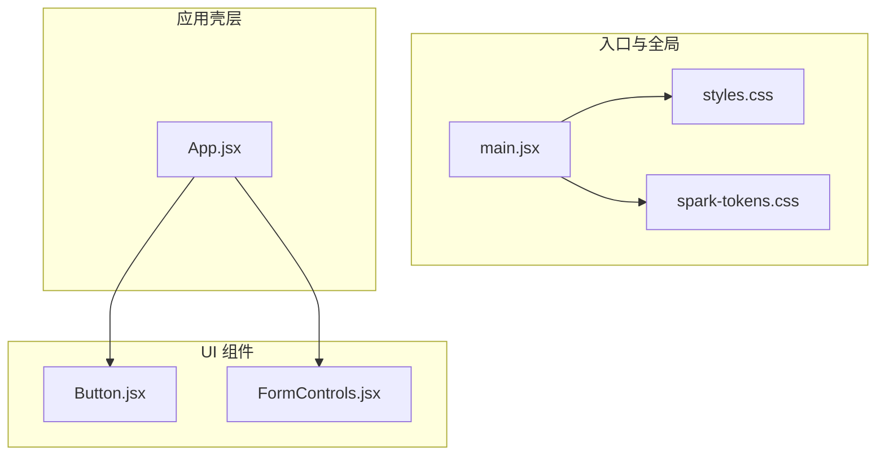
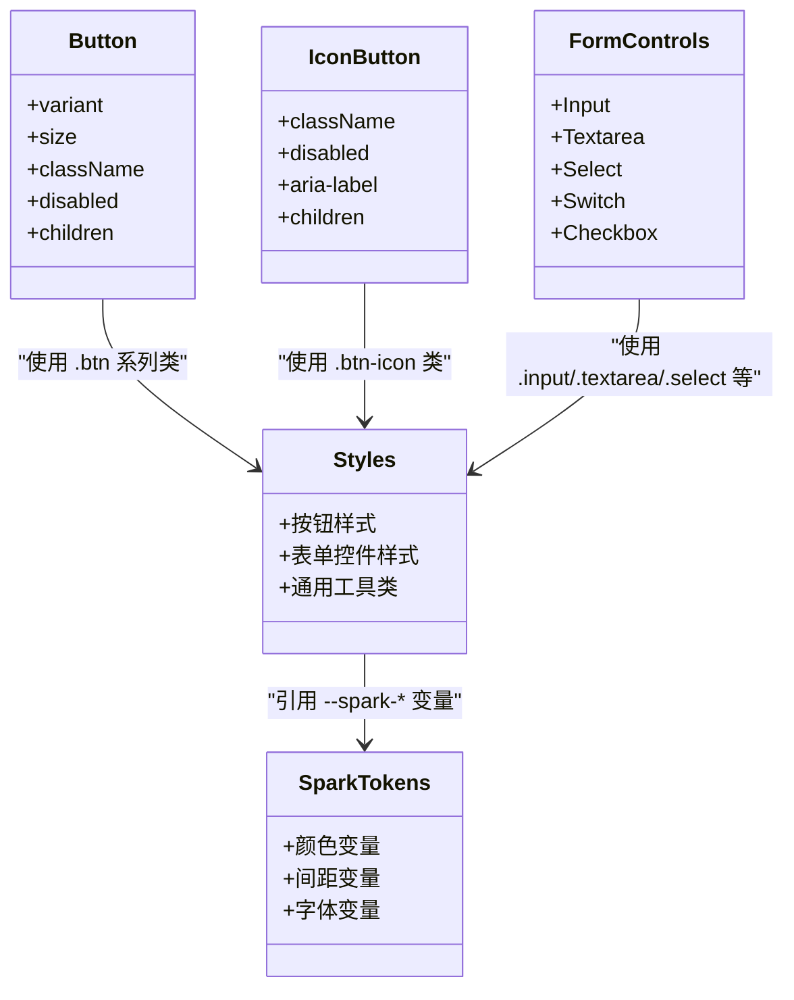
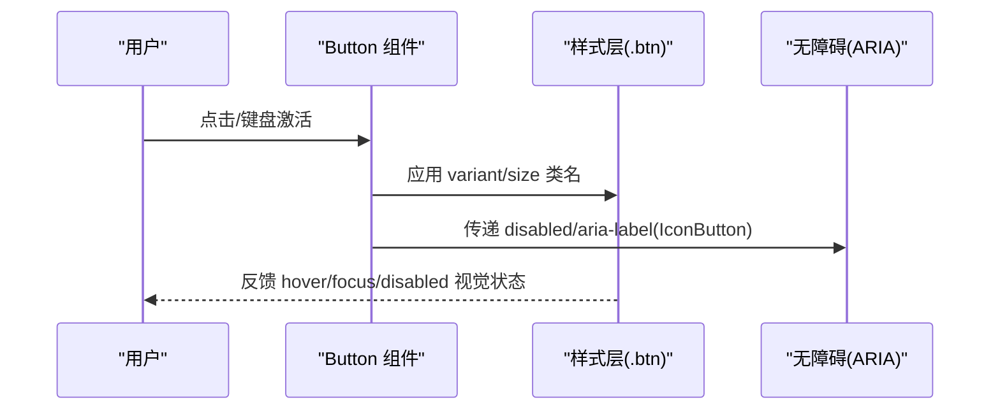
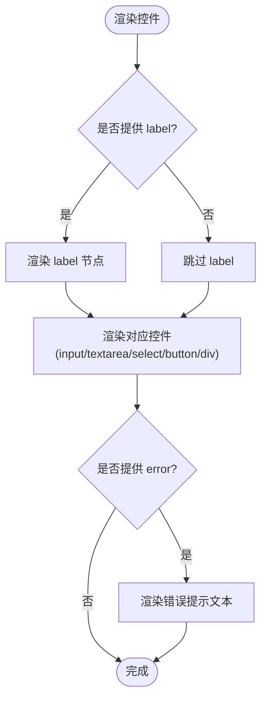
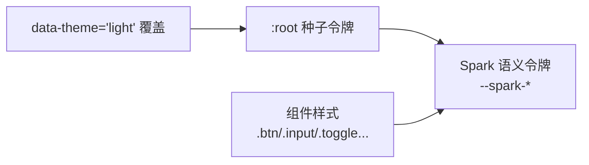
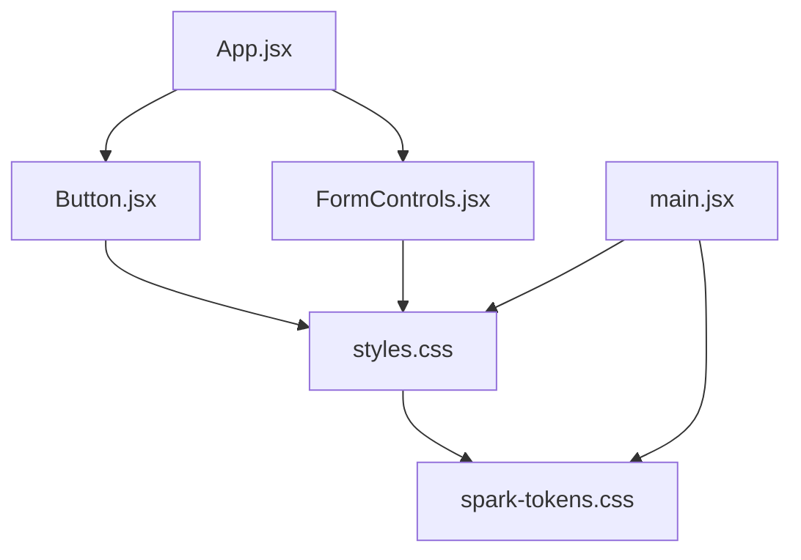

# 基础 UI 组件

<cite>
**本文引用的文件**   
- [Button.jsx](file://app/src/components/ui/Button.jsx)
- [FormControls.jsx](file://app/src/components/ui/FormControls.jsx)
- [spark-tokens.css](file://app/src/components/ui/spark-tokens.css)
- [styles.css](file://app/src/styles.css)
- [main.jsx](file://app/src/main.jsx)
- [App.jsx](file://app/src/App.jsx)
</cite>

## 目录
1. [简介](#简介)
2. [项目结构](#项目结构)
3. [核心组件](#核心组件)
4. [架构总览](#架构总览)
5. [详细组件分析](#详细组件分析)
6. [依赖关系分析](#依赖关系分析)
7. [性能与可访问性](#性能与可访问性)
8. [故障排查指南](#故障排查指南)
9. [结论](#结论)
10. [附录：属性接口与使用示例路径](#附录属性接口与使用示例路径)

## 简介
本文件为“AI Image Studio”应用中的基础 UI 组件库文档，聚焦以下三个部分：
- Button 按钮组件：变体样式、尺寸规格、交互状态与无障碍支持。
- FormControls 表单控件组件：输入框、文本域、下拉、开关、复选框的标签、错误提示与组合模式。
- Spark Tokens 设计令牌系统：颜色变量、间距规范、字体定义及主题切换机制。

目标读者包括前端开发者、UI/UX 工程师以及需要集成或定制这些组件的产品团队。

## 项目结构
基础 UI 组件位于 app/src/components/ui 目录下，样式与令牌分别由 styles.css 和 spark-tokens.css 提供，并在 main.jsx 中统一引入。

图表来源
- [main.jsx:1-32](file://app/src/main.jsx#L1-L32)
- [styles.css:1-717](file://app/src/styles.css#L1-L717)
- [spark-tokens.css:1-53](file://app/src/components/ui/spark-tokens.css#L1-L53)
- [Button.jsx:1-57](file://app/src/components/ui/Button.jsx#L1-L57)
- [FormControls.jsx:1-62](file://app/src/components/ui/FormControls.jsx#L1-L62)
- [App.jsx:1-364](file://app/src/App.jsx#L1-L364)

章节来源
- [main.jsx:1-32](file://app/src/main.jsx#L1-L32)
- [styles.css:1-717](file://app/src/styles.css#L1-L717)
- [spark-tokens.css:1-53](file://app/src/components/ui/spark-tokens.css#L1-L53)
- [Button.jsx:1-57](file://app/src/components/ui/Button.jsx#L1-L57)
- [FormControls.jsx:1-62](file://app/src/components/ui/FormControls.jsx#L1-L62)
- [App.jsx:1-364](file://app/src/App.jsx#L1-L364)

## 核心组件
本节概述各组件的职责与能力边界，后续章节将深入细节。

- Button 按钮组件
  - 提供多种语义化变体（主按钮、幽灵、弱化、危险）与尺寸（小、中、大）。
  - 支持禁用态与图标按钮形态，具备键盘与屏幕阅读器友好特性。
- FormControls 表单控件组件
  - 提供 Input、Textarea、Select、Switch、Checkbox 等常用控件。
  - 内置 label 与 error 展示逻辑，遵循统一的视觉层级与间距。
- Spark Tokens 设计令牌
  - 通过 CSS 变量暴露语义化命名空间，桥接种子令牌到 Spark 命名约定。
  - 支持明暗主题切换，所有组件均基于令牌渲染。

章节来源
- [Button.jsx:1-57](file://app/src/components/ui/Button.jsx#L1-L57)
- [FormControls.jsx:1-62](file://app/src/components/ui/FormControls.jsx#L1-L62)
- [spark-tokens.css:1-53](file://app/src/components/ui/spark-tokens.css#L1-L53)
- [styles.css:1-717](file://app/src/styles.css#L1-L717)

## 架构总览
组件与样式、令牌的依赖关系如下：

图表来源
- [Button.jsx:1-57](file://app/src/components/ui/Button.jsx#L1-L57)
- [FormControls.jsx:1-62](file://app/src/components/ui/FormControls.jsx#L1-L62)
- [styles.css:1-717](file://app/src/styles.css#L1-L717)
- [spark-tokens.css:1-53](file://app/src/components/ui/spark-tokens.css#L1-L53)

## 详细组件分析

### Button 按钮组件
- 变体样式
  - primary：强调操作，背景与边框采用强调色，悬停加深。
  - ghost：轻量外观，适合次要操作。
  - subtle：更弱化的视觉层次，用于低优先级操作。
  - danger：危险操作，使用警示色。
- 尺寸规格
  - sm：紧凑尺寸，适合密集布局。
  - md：默认尺寸。
  - lg：大号尺寸，适合重要 CTA。
- 交互状态
  - hover：背景与文字颜色变化。
  - focus-visible：可见焦点环，符合无障碍要求。
  - disabled：不可点击且降低透明度。
- 无障碍支持
  - 原生 button 元素，天然支持键盘导航。
  - IconButton 支持 aria-label 描述图标用途。
- 组合使用
  - 可与图标库配合，作为图标按钮或带图标的文本按钮。
  - 在表单提交、筛选、分页等场景中广泛使用。

图表来源
- [Button.jsx:16-35](file://app/src/components/ui/Button.jsx#L16-L35)
- [Button.jsx:37-54](file://app/src/components/ui/Button.jsx#L37-L54)
- [styles.css:234-325](file://app/src/styles.css#L234-L325)

章节来源
- [Button.jsx:1-57](file://app/src/components/ui/Button.jsx#L1-L57)
- [styles.css:234-325](file://app/src/styles.css#L234-L325)

### FormControls 表单控件组件
- Input 输入框
  - 支持 label 与 error 显示；error 以警示色呈现。
  - 使用 .input 样式，具备 focus 高亮与占位符样式。
- Textarea 多行文本
  - 支持 label；具备自适应高度与宽松行高。
- Select 下拉选择
  - 支持 label；自定义下拉箭头，保持与整体风格一致。
- Switch 开关
  - 使用 role="switch" 与 aria-checked 提升可访问性。
  - 通过 checked 控制 active 状态，点击切换值。
- Checkbox 复选框
  - 自定义勾选态，点击区域包含图标与标签。
- 错误提示与格式化
  - 当前实现以 error 字符串形式展示错误信息。
  - 格式化功能未在本组件内实现，可在上层业务组件中处理后再传入。
- 组合使用
  - 与表单校验库结合时，可将校验结果映射为 error 字段。
  - 与布局工具类（flex/gap）组合，快速构建表单网格。

图表来源
- [FormControls.jsx:3-11](file://app/src/components/ui/FormControls.jsx#L3-L11)
- [FormControls.jsx:13-20](file://app/src/components/ui/FormControls.jsx#L13-L20)
- [FormControls.jsx:22-31](file://app/src/components/ui/FormControls.jsx#L22-L31)
- [FormControls.jsx:33-46](file://app/src/components/ui/FormControls.jsx#L33-L46)
- [FormControls.jsx:48-61](file://app/src/components/ui/FormControls.jsx#L48-L61)
- [styles.css:327-388](file://app/src/styles.css#L327-L388)

章节来源
- [FormControls.jsx:1-62](file://app/src/components/ui/FormControls.jsx#L1-L62)
- [styles.css:327-388](file://app/src/styles.css#L327-L388)

### Spark Tokens 设计令牌系统
- 颜色变量
  - 背景：--spark-color-bg、--spark-color-bg-panel、--spark-color-bg-elevated、--spark-color-bg-hover、--spark-color-bg-input、--spark-color-bg-card
  - 文本：--spark-color-text、--spark-color-text-secondary、--spark-color-text-muted、--spark-color-text-disabled
  - 强调与语义：--spark-color-accent、--spark-color-accent-hover、--spark-color-accent-secondary、--spark-color-success、--spark-color-warning、--spark-color-danger
  - 边框：--spark-color-border、--spark-color-border-subtle、--spark-color-border-strong、--spark-color-border-focus
- 圆角与阴影
  - 圆角：--spark-radius-sm/md/lg/xl/full
  - 阴影：--spark-shadow-sm/md/lg
- 间距与字体
  - 间距：--spark-spacing-1/2/3/4/6/8
  - 字体族：--spark-font-sans、--spark-font-mono
- 主题切换
  - 根级 data-theme 属性切换明暗主题，覆盖种子令牌与派生变量。
  - Spark 令牌通过 var(--spark-*) 桥接到具体实现变量，确保组件与主题解耦。
- 响应式与密度
  - 通过 --density-scale 与 --type-scale 可调整整体密度与字号比例（预留扩展点）。

图表来源
- [spark-tokens.css:1-53](file://app/src/components/ui/spark-tokens.css#L1-L53)
- [styles.css:6-172](file://app/src/styles.css#L6-L172)

章节来源
- [spark-tokens.css:1-53](file://app/src/components/ui/spark-tokens.css#L1-L53)
- [styles.css:6-172](file://app/src/styles.css#L6-L172)

## 依赖关系分析
- 组件对样式的依赖
  - Button 与 IconButton 依赖 .btn、.btn-icon、.btn-sm、.btn-lg 等类。
  - FormControls 依赖 .input、.textarea、.select、.toggle、.checkbox 等类。
- 样式对令牌的依赖
  - 所有组件样式通过 --spark-* 变量获取颜色、间距、字体等设计值。
- 应用壳层的集成
  - App.jsx 中使用 IconButton 进行关闭通知等操作。
  - main.jsx 引入 styles.css 与 spark-tokens.css，确保全局可用。

图表来源
- [App.jsx:1-364](file://app/src/App.jsx#L1-L364)
- [Button.jsx:1-57](file://app/src/components/ui/Button.jsx#L1-L57)
- [FormControls.jsx:1-62](file://app/src/components/ui/FormControls.jsx#L1-L62)
- [styles.css:1-717](file://app/src/styles.css#L1-L717)
- [spark-tokens.css:1-53](file://app/src/components/ui/spark-tokens.css#L1-L53)
- [main.jsx:1-32](file://app/src/main.jsx#L1-L32)

章节来源
- [App.jsx:1-364](file://app/src/App.jsx#L1-L364)
- [Button.jsx:1-57](file://app/src/components/ui/Button.jsx#L1-L57)
- [FormControls.jsx:1-62](file://app/src/components/ui/FormControls.jsx#L1-L62)
- [styles.css:1-717](file://app/src/styles.css#L1-L717)
- [spark-tokens.css:1-53](file://app/src/components/ui/spark-tokens.css#L1-L53)
- [main.jsx:1-32](file://app/src/main.jsx#L1-L32)

## 性能与可访问性
- 性能
  - 组件均为纯函数式 React 组件，无额外运行时开销。
  - 样式通过 CSS 变量与类名组合，避免重复计算与重绘。
- 可访问性
  - 按钮与开关使用原生语义元素与 ARIA 属性，便于屏幕阅读器识别。
  - 全局 :focus-visible 提供清晰的焦点指示。
- 主题与响应式
  - 通过 data-theme 切换主题，无需重新加载页面。
  - 间距与字体基于令牌，易于在不同密度与字号体系下保持一致体验。

章节来源
- [styles.css:219-228](file://app/src/styles.css#L219-L228)
- [styles.css:149-172](file://app/src/styles.css#L149-L172)
- [FormControls.jsx:33-46](file://app/src/components/ui/FormControls.jsx#L33-L46)
- [Button.jsx:37-54](file://app/src/components/ui/Button.jsx#L37-L54)

## 故障排查指南
- 主题不生效
  - 检查是否在根节点设置了 data-theme 属性，并确保 styles.css 已引入。
- 令牌变量未生效
  - 确认 spark-tokens.css 已在 main.jsx 中引入，且未被其他样式覆盖。
- 按钮点击无效
  - 检查是否传入了 disabled 属性，或被父容器 pointer-events 阻止。
- 表单错误未显示
  - 确认向 Input 组件正确传入了 error 字符串。
- 图标按钮缺少描述
  - 为 IconButton 提供 aria-label，以便屏幕阅读器朗读。

章节来源
- [main.jsx:1-32](file://app/src/main.jsx#L1-L32)
- [styles.css:149-172](file://app/src/styles.css#L149-L172)
- [Button.jsx:16-35](file://app/src/components/ui/Button.jsx#L16-L35)
- [Button.jsx:37-54](file://app/src/components/ui/Button.jsx#L37-L54)
- [FormControls.jsx:3-11](file://app/src/components/ui/FormControls.jsx#L3-L11)

## 结论
本基础 UI 组件库以 Spark Tokens 为核心，通过 CSS 变量与语义化类名实现了高内聚、低耦合的组件体系。Button 与 FormControls 提供了常用的交互与表单能力，并具备良好的可访问性与主题切换支持。建议在实际项目中：
- 优先使用 Spark Tokens 进行样式定制。
- 在业务层集中处理输入验证与格式化，再将结果传递给 FormControls。
- 为所有可交互元素提供合适的 ARIA 描述，确保无障碍体验。

## 附录：属性接口与使用示例路径
- Button
  - 属性：variant、size、className、disabled、children、其余原生 button 属性透传。
  - 使用示例路径：[App.jsx 中 IconButton 的使用:107-109](file://app/src/App.jsx#L107-L109)
- IconButton
  - 属性：className、disabled、aria-label、children、其余原生 button 属性透传。
  - 使用示例路径：[App.jsx 中关闭通知按钮:107-109](file://app/src/App.jsx#L107-L109)
- FormControls
  - Input：label、error、className、其余原生 input 属性透传。
  - Textarea：label、className、其余原生 textarea 属性透传。
  - Select：label、className、children、其余原生 select 属性透传。
  - Switch：checked、onChange、label、其余原生 button 属性透传。
  - Checkbox：checked、onChange、label、其余原生 div/button 属性透传。
  - 使用示例路径：[FormControls 组件定义:1-62](file://app/src/components/ui/FormControls.jsx#L1-L62)

章节来源
- [Button.jsx:16-35](file://app/src/components/ui/Button.jsx#L16-L35)
- [Button.jsx:37-54](file://app/src/components/ui/Button.jsx#L37-L54)
- [FormControls.jsx:1-62](file://app/src/components/ui/FormControls.jsx#L1-L62)
- [App.jsx:107-109](file://app/src/App.jsx#L107-L109)