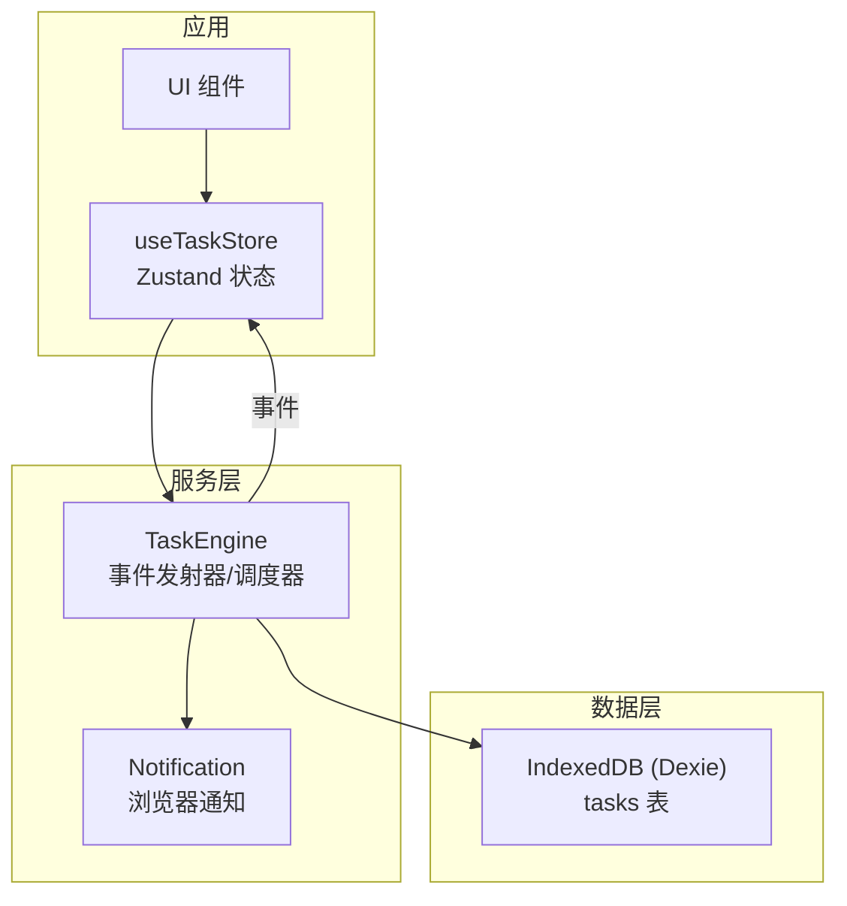
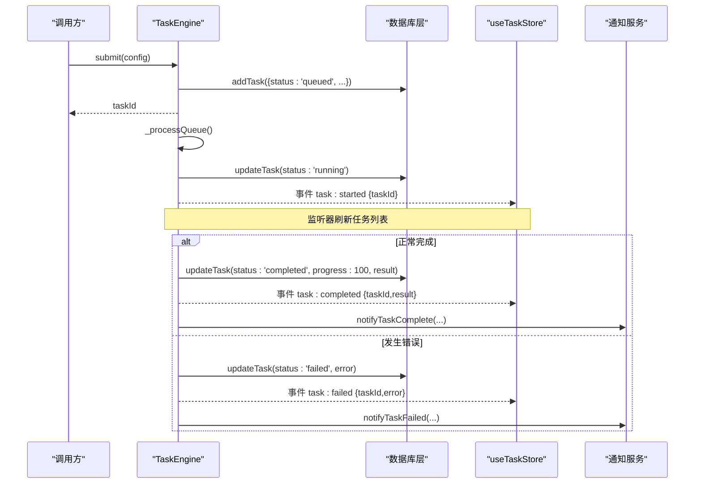
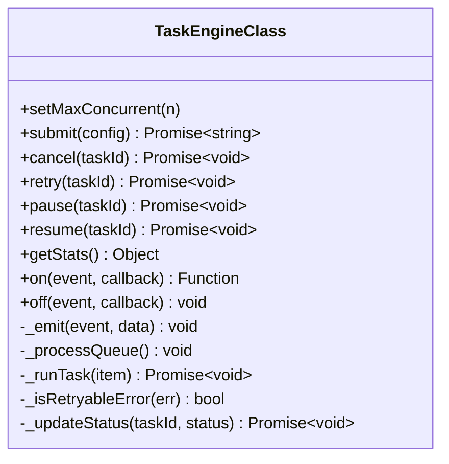
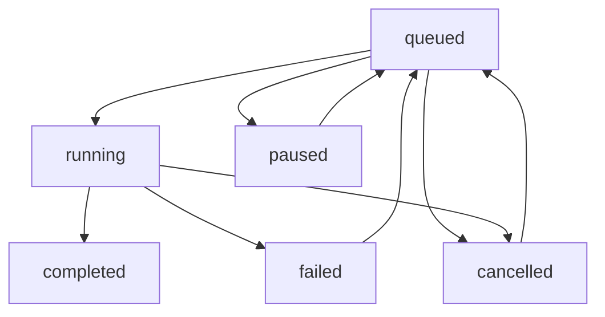
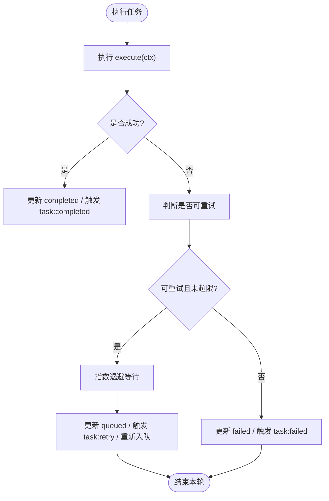
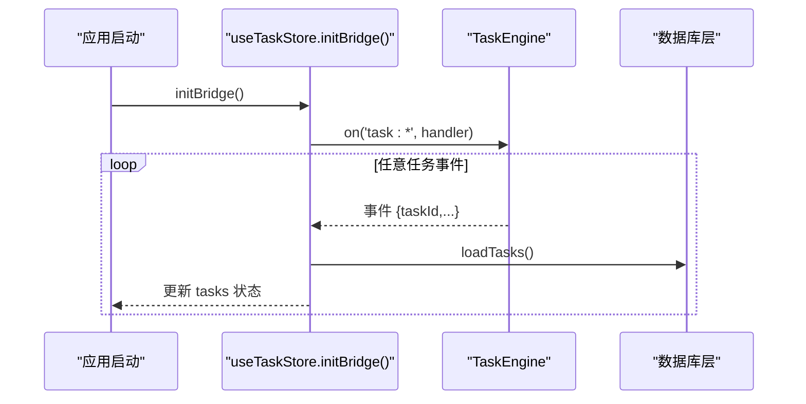
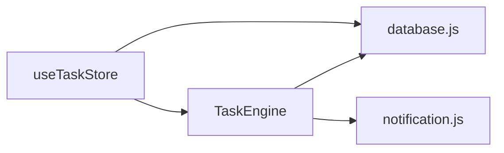

# 事件系统

<cite>
**本文引用的文件**
- [task-engine.js](file://app/src/services/task-engine.js)
- [useTaskStore.js](file://app/src/stores/useTaskStore.js)
- [database.js](file://app/src/db/database.js)
- [notification.js](file://app/src/services/notification.js)
</cite>

## 目录
1. [简介](#简介)
2. [项目结构](#项目结构)
3. [核心组件](#核心组件)
4. [架构总览](#架构总览)
5. [详细组件分析](#详细组件分析)
6. [依赖关系分析](#依赖关系分析)
7. [性能考虑](#性能考虑)
8. [故障排查指南](#故障排查指南)
9. [结论](#结论)
10. [附录：事件与数据结构参考](#附录事件与数据结构参考)

## 简介
本文件围绕任务引擎的事件发射器系统，系统化说明事件监听器的注册、注销与触发机制；梳理所有可用事件类型（task:queued、task:started、task:progress、task:completed、task:failed、task:cancelled、task:paused、task:retry）及其数据载荷；给出监听器回调的使用模式、最佳实践与性能建议。读者无需深入源码即可理解并正确使用该事件系统。

## 项目结构
事件系统由以下关键模块协作完成：
- 任务引擎（TaskEngine）：负责任务调度、状态机、重试与事件发射。
- 任务存储桥接（useTaskStore）：订阅 TaskEngine 事件，驱动 UI 状态刷新。
- 数据库层（database.js）：持久化任务记录与状态变更。
- 通知服务（notification.js）：在任务完成或失败时推送浏览器通知。

图表来源
- [task-engine.js:1-319](file://app/src/services/task-engine.js#L1-L319)
- [useTaskStore.js:1-173](file://app/src/stores/useTaskStore.js#L1-L173)
- [database.js:232-274](file://app/src/db/database.js#L232-L274)
- [notification.js:78-103](file://app/src/services/notification.js#L78-L103)

章节来源
- [task-engine.js:1-319](file://app/src/services/task-engine.js#L1-L319)
- [useTaskStore.js:1-173](file://app/src/stores/useTaskStore.js#L1-L173)
- [database.js:232-274](file://app/src/db/database.js#L232-L274)
- [notification.js:1-113](file://app/src/services/notification.js#L1-L113)

## 核心组件
- TaskEngine（事件发射器与任务调度器）
  - 提供 on/off/_emit 实现事件订阅与分发。
  - 维护任务队列与并发执行集合，控制任务生命周期与状态转换。
  - 在关键状态点发射事件，并持久化状态到 IndexedDB。
- useTaskStore（事件桥接与状态管理）
  - 在应用启动时初始化事件桥接，统一订阅所有任务事件。
  - 收到事件后刷新任务列表，驱动 UI 更新。
- database.js（持久化）
  - 提供任务的增删改查与统计接口。
- notification.js（通知）
  - 在任务完成或失败时发送浏览器通知。

章节来源
- [task-engine.js:33-211](file://app/src/services/task-engine.js#L33-L211)
- [useTaskStore.js:39-64](file://app/src/stores/useTaskStore.js#L39-L64)
- [database.js:235-274](file://app/src/db/database.js#L235-L274)
- [notification.js:78-103](file://app/src/services/notification.js#L78-L103)

## 架构总览
下图展示了从任务提交到事件广播的完整流程，以及各组件之间的交互关系。

图表来源
- [task-engine.js:57-81](file://app/src/services/task-engine.js#L57-L81)
- [task-engine.js:222-297](file://app/src/services/task-engine.js#L222-L297)
- [useTaskStore.js:44-56](file://app/src/stores/useTaskStore.js#L44-L56)
- [notification.js:78-103](file://app/src/services/notification.js#L78-L103)

## 详细组件分析

### 事件发射器 API 与使用模式
- 注册监听器
  - 方法：on(event, callback)
  - 行为：将回调加入指定事件的监听集合；返回一个取消函数，用于移除该监听器。
  - 典型用法：在组件挂载时注册，卸载时调用返回的取消函数。
- 注销监听器
  - 方法：off(event, callback)
  - 行为：从指定事件中删除对应回调。
  - 注意：若未显式保存回调引用，建议使用 on 返回的取消函数进行注销。
- 触发事件
  - 内部方法：_emit(event, data)
  - 行为：遍历事件的所有监听器并依次调用；对每个监听器包裹 try/catch，避免单个监听器异常影响其他监听器。

图表来源
- [task-engine.js:33-211](file://app/src/services/task-engine.js#L33-L211)

章节来源
- [task-engine.js:191-211](file://app/src/services/task-engine.js#L191-L211)

### 事件类型与数据载荷
以下为任务引擎发射的全部事件类型及载荷字段说明：

- task:queued
  - 触发时机：任务入队（包括初次提交、重试、恢复）。
  - 载荷：{ taskId }
- task:started
  - 触发时机：任务开始执行（进入 running 状态）。
  - 载荷：{ taskId }
- task:progress
  - 触发时机：任务进度更新（execute 上下文中的 onProgress 被调用）。
  - 载荷：{ taskId, progress }
- task:completed
  - 触发时机：任务成功结束（completed 状态）。
  - 载荷：{ taskId, result }
- task:failed
  - 触发时机：任务失败且不再重试（failed 状态）。
  - 载荷：{ taskId, error }
- task:cancelled
  - 触发时机：任务被取消（cancelled 状态）。
  - 载荷：{ taskId }
- task:paused
  - 触发时机：任务暂停（paused 状态）。
  - 载荷：{ taskId }
- task:retry
  - 触发时机：任务因可重试错误进入指数退避并重试。
  - 载荷：{ taskId, retryCount }

章节来源
- [task-engine.js:77-91](file://app/src/services/task-engine.js#L77-L91)
- [task-engine.js:101-116](file://app/src/services/task-engine.js#L101-L116)
- [task-engine.js:142-145](file://app/src/services/task-engine.js#L142-L145)
- [task-engine.js:154-165](file://app/src/services/task-engine.js#L154-L165)
- [task-engine.js:172-178](file://app/src/services/task-engine.js#L172-L178)
- [task-engine.js:226-236](file://app/src/services/task-engine.js#L226-L236)
- [task-engine.js:253-257](file://app/src/services/task-engine.js#L253-L257)
- [task-engine.js:279-291](file://app/src/services/task-engine.js#L279-L291)

### 事件驱动的状态流转与处理逻辑
任务状态机与事件的关系如下：

图表来源
- [task-engine.js:24-31](file://app/src/services/task-engine.js#L24-L31)

章节来源
- [task-engine.js:24-31](file://app/src/services/task-engine.js#L24-L31)

### 重试与退避策略
- 触发条件：当任务抛出错误且满足“可重试”判定（如服务端 5xx、网络错误等），则进入重试分支。
- 指数退避：等待时间随重试次数递增（以毫秒为单位），随后将任务重新入队并触发 task:retry。
- 最大重试次数：默认上限为 3 次。超过上限则标记为 failed 并触发 task:failed。

图表来源
- [task-engine.js:259-297](file://app/src/services/task-engine.js#L259-L297)
- [task-engine.js:299-305](file://app/src/services/task-engine.js#L299-L305)

章节来源
- [task-engine.js:259-305](file://app/src/services/task-engine.js#L259-L305)

### 事件桥接与 UI 联动
- 初始化：在应用启动时调用 initBridge，一次性订阅全部任务事件。
- 刷新策略：每次收到事件后，统一通过 loadTasks 拉取最新任务列表，确保 UI 与后端一致。
- 清理：initBridge 返回取消函数，应在合适时机（如页面卸载）调用以避免内存泄漏。

图表来源
- [useTaskStore.js:39-64](file://app/src/stores/useTaskStore.js#L39-L64)
- [useTaskStore.js:23-33](file://app/src/stores/useTaskStore.js#L23-L33)

章节来源
- [useTaskStore.js:39-64](file://app/src/stores/useTaskStore.js#L39-L64)
- [useTaskStore.js:23-33](file://app/src/stores/useTaskStore.js#L23-L33)

## 依赖关系分析
- TaskEngine 依赖
  - 数据库层：addTask、updateTask、getTask、getTasks、getTaskStats 等。
  - 通知服务：notifyTaskComplete、notifyTaskFailed。
- useTaskStore 依赖
  - TaskEngine：通过 on/off 订阅事件，并通过 cancel/retry/pause/resume 等方法控制任务。
  - 数据库层：loadTasks/updateTask/removeTask 等。
- 通知服务
  - 仅作为副作用输出，不影响主流程。

图表来源
- [task-engine.js:14-16](file://app/src/services/task-engine.js#L14-L16)
- [useTaskStore.js:10-12](file://app/src/stores/useTaskStore.js#L10-L12)
- [database.js:235-274](file://app/src/db/database.js#L235-L274)
- [notification.js:78-103](file://app/src/services/notification.js#L78-L103)

章节来源
- [task-engine.js:14-16](file://app/src/services/task-engine.js#L14-L16)
- [useTaskStore.js:10-12](file://app/src/stores/useTaskStore.js#L10-L12)
- [database.js:235-274](file://app/src/db/database.js#L235-L274)
- [notification.js:78-103](file://app/src/services/notification.js#L78-L103)

## 性能考虑
- 事件监听器数量控制
  - 避免重复注册：在组件挂载前检查是否已注册，或使用唯一标识去重。
  - 及时注销：组件卸载时调用 on 返回的取消函数，防止内存泄漏。
- 事件频率控制
  - task:progress 可能高频触发，建议在监听器中做节流或合并更新，减少 UI 重渲染压力。
- 批量刷新优化
  - 当前实现每次事件都刷新全量任务列表。对于大量任务场景，可考虑增量更新或局部状态更新以减少 IO 与渲染开销。
- 并发与队列
  - 合理设置最大并发数，避免过多并发导致资源争用与频繁重试。
- 错误隔离
  - 监听器内部异常不会影响其他监听器，但仍应避免在监听器中进行耗时操作。

[本节为通用指导，不直接分析具体文件]

## 故障排查指南
- 监听器无响应
  - 确认是否正确调用 on 并保存了取消函数；检查是否在合适的生命周期内注册与注销。
  - 查看控制台是否有监听器异常日志（内部已捕获并打印）。
- 事件顺序与竞态
  - 若业务强依赖事件顺序，可在监听器内增加本地状态校验，避免乱序导致的误判。
- 重试风暴
  - 若出现频繁重试，检查错误是否属于可重试范围；必要时调整最大重试次数或退避策略。
- 通知未弹出
  - 确认已请求权限且未被用户拒绝；检查浏览器是否支持 Notification API。

章节来源
- [task-engine.js:203-211](file://app/src/services/task-engine.js#L203-L211)
- [notification.js:19-43](file://app/src/services/notification.js#L19-L43)

## 结论
任务引擎的事件系统提供了清晰、可扩展的任务状态广播能力。通过统一的 on/off/_emit 接口，结合 useTaskStore 的事件桥接，实现了从底层调度到上层 UI 的解耦与联动。遵循本文的最佳实践与性能建议，可以在保证可靠性的同时获得良好的用户体验。

[本节为总结性内容，不直接分析具体文件]

## 附录：事件与数据结构参考

### 事件清单与载荷
- task:queued → { taskId }
- task:started → { taskId }
- task:progress → { taskId, progress }
- task:completed → { taskId, result }
- task:failed → { taskId, error }
- task:cancelled → { taskId }
- task:paused → { taskId }
- task:retry → { taskId, retryCount }

章节来源
- [task-engine.js:77-91](file://app/src/services/task-engine.js#L77-L91)
- [task-engine.js:101-116](file://app/src/services/task-engine.js#L101-L116)
- [task-engine.js:142-145](file://app/src/services/task-engine.js#L142-L145)
- [task-engine.js:154-165](file://app/src/services/task-engine.js#L154-L165)
- [task-engine.js:172-178](file://app/src/services/task-engine.js#L172-L178)
- [task-engine.js:226-236](file://app/src/services/task-engine.js#L226-L236)
- [task-engine.js:253-257](file://app/src/services/task-engine.js#L253-L257)
- [task-engine.js:279-291](file://app/src/services/task-engine.js#L279-L291)

### 任务对象关键字段（持久化）
- id、type、status、model、prompt、params、progress、error、result、retryCount、createdAt、updatedAt

章节来源
- [database.js:235-274](file://app/src/db/database.js#L235-L274)

### 监听器回调使用模式（示例路径）
- 注册与注销
  - 参考：[useTaskStore.js:39-64](file://app/src/stores/useTaskStore.js#L39-L64)
- 事件处理与刷新
  - 参考：[useTaskStore.js:44-56](file://app/src/stores/useTaskStore.js#L44-L56)
- 任务执行上下文 with onProgress
  - 参考：[task-engine.js:230-236](file://app/src/services/task-engine.js#L230-L236)