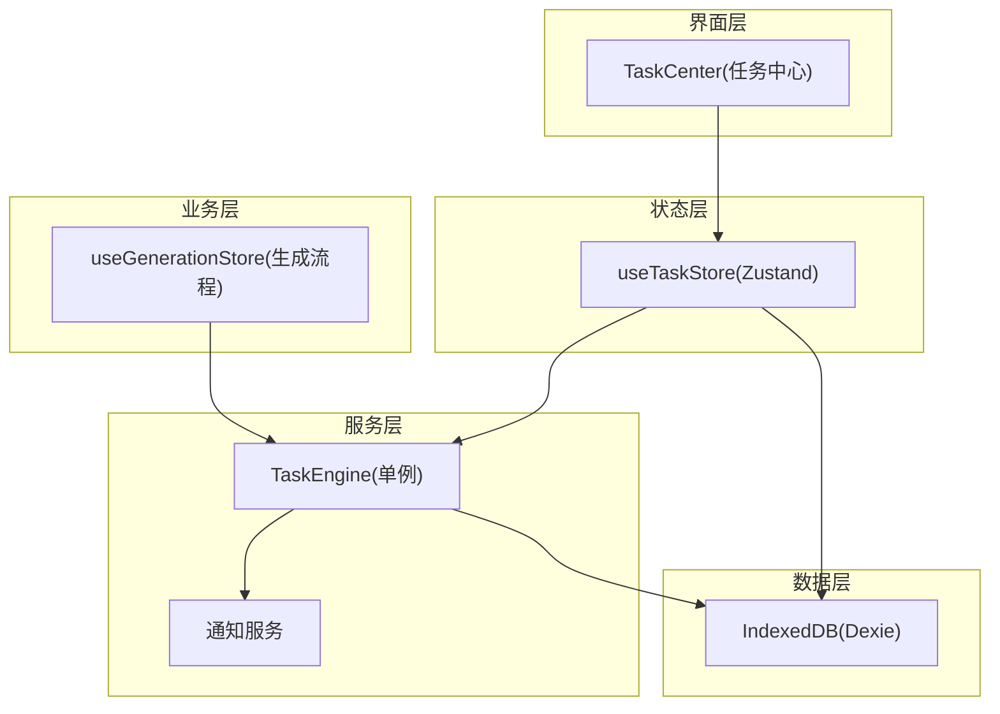
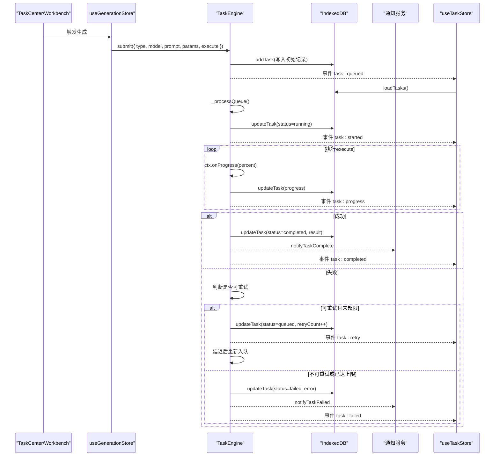
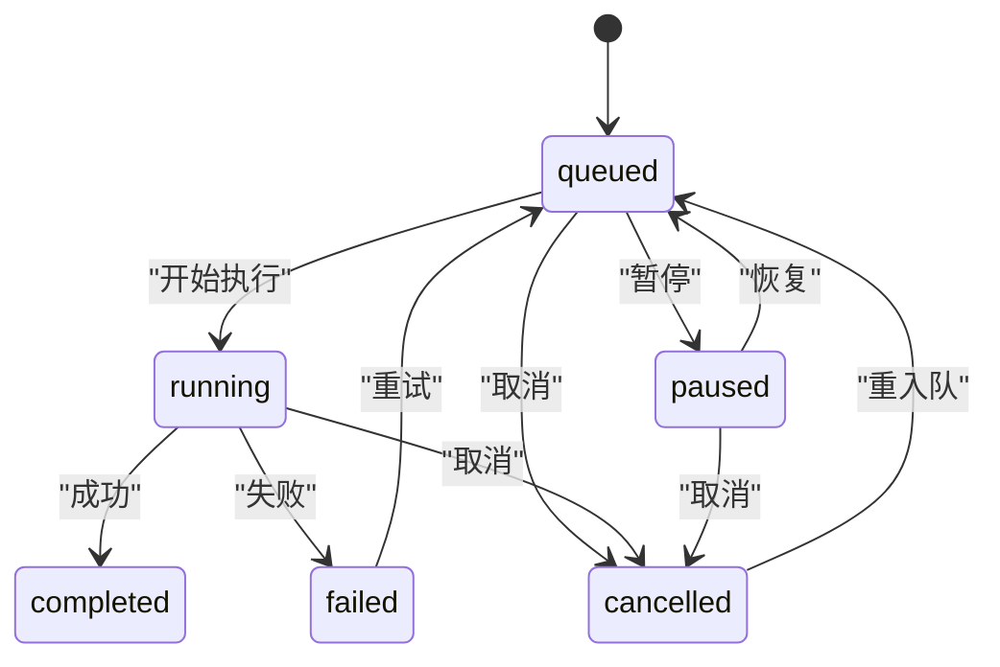
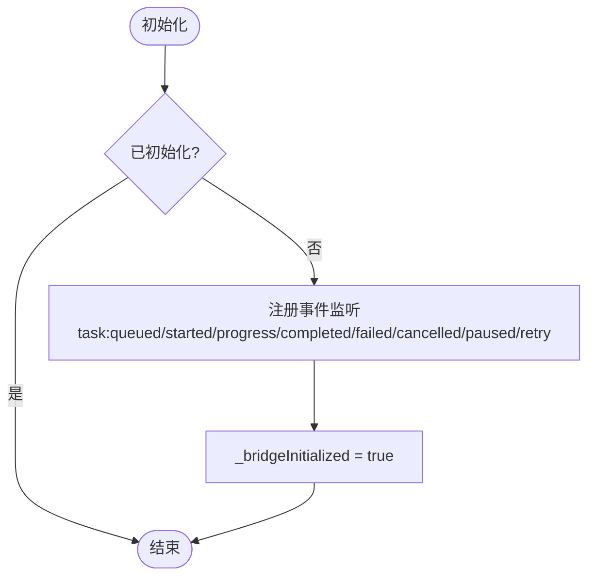
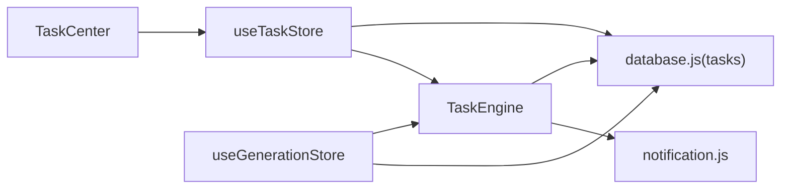

# 任务引擎

<cite>
**本文引用的文件**   
- [task-engine.js](file://app/src/services/task-engine.js)
- [useTaskStore.js](file://app/src/stores/useTaskStore.js)
- [database.js](file://app/src/db/database.js)
- [notification.js](file://app/src/services/notification.js)
- [TaskCenter.jsx](file://app/src/pages/TaskCenter.jsx)
- [useGenerationStore.js](file://app/src/stores/useGenerationStore.js)
</cite>

## 目录
1. [简介](#简介)
2. [项目结构](#项目结构)
3. [核心组件](#核心组件)
4. [架构总览](#架构总览)
5. [详细组件分析](#详细组件分析)
6. [依赖关系分析](#依赖关系分析)
7. [性能与并发特性](#性能与并发特性)
8. [配置与扩展](#配置与扩展)
9. [故障排除指南](#故障排除指南)
10. [结论](#结论)

## 简介
本文件为 AI Image Studio 的任务引擎提供系统化文档。该引擎基于单例模式的后台任务调度器，负责：
- 任务队列管理与 FIFO 执行顺序
- 可配置的并发控制（默认最大并发数）
- 状态机驱动的任务生命周期管理（queued → running → completed/failed/cancelled/paused）
- 指数退避重试算法与错误分类策略
- 进度跟踪、取消机制与事件通知
- 持久化到 IndexedDB 的自动状态落盘
- 面向 UI 的事件桥接与统计聚合

## 项目结构
围绕任务引擎的相关代码分布在服务层、存储层、UI 页面与生成流程中：
- 服务层：任务引擎、通知服务
- 数据层：IndexedDB 封装（Dexie）
- 状态层：Zustand Store（任务列表与事件桥接）
- 业务层：工作台的图像生成流程通过任务引擎提交异步任务
- 界面层：任务中心页面展示任务分组、操作与统计

图表来源
- [task-engine.js:1-319](file://app/src/services/task-engine.js#L1-L319)
- [useTaskStore.js:1-173](file://app/src/stores/useTaskStore.js#L1-L173)
- [database.js:1-339](file://app/src/db/database.js#L1-L339)
- [notification.js:1-113](file://app/src/services/notification.js#L1-L113)
- [useGenerationStore.js:1-360](file://app/src/stores/useGenerationStore.js#L1-L360)
- [TaskCenter.jsx:1-218](file://app/src/pages/TaskCenter.jsx#L1-L218)

章节来源
- [task-engine.js:1-319](file://app/src/services/task-engine.js#L1-L319)
- [useTaskStore.js:1-173](file://app/src/stores/useTaskStore.js#L1-L173)
- [database.js:1-339](file://app/src/db/database.js#L1-L339)
- [notification.js:1-113](file://app/src/services/notification.js#L1-L113)
- [useGenerationStore.js:1-360](file://app/src/stores/useGenerationStore.js#L1-L360)
- [TaskCenter.jsx:1-218](file://app/src/pages/TaskCenter.jsx#L1-L218)

## 核心组件
- 任务引擎（TaskEngine）
  - 单例导出，维护内部队列、活跃任务集合、事件监听器
  - 提供 submit、cancel、pause、resume、retry、setMaxConcurrent、getStats、on/off 等 API
  - 内置状态机与指数退避重试逻辑
- 任务存储（useTaskStore）
  - 将 TaskEngine 事件桥接到 Zustand 状态，统一刷新任务列表
  - 提供 add/update/remove/retry/cancel/pause/resume/getTaskStats/clearCompleted 等操作
- 数据库层（database.js）
  - 使用 Dexie 定义 tasks 表及索引，提供增删改查与统计接口
- 通知服务（notification.js）
  - 包装浏览器 Notification API，在任务完成或失败时推送系统通知
- 生成流程（useGenerationStore）
  - 构建 execute 函数并通过 TaskEngine.submit 提交任务
  - 处理 onProgress、onTaskSubmitted 回调，持久化中间态与结果
- 任务中心（TaskCenter）
  - 按状态分组展示任务，支持暂停、恢复、取消、重试、清空已完成等交互

章节来源
- [task-engine.js:1-319](file://app/src/services/task-engine.js#L1-L319)
- [useTaskStore.js:1-173](file://app/src/stores/useTaskStore.js#L1-L173)
- [database.js:1-339](file://app/src/db/database.js#L1-L339)
- [notification.js:1-113](file://app/src/services/notification.js#L1-L113)
- [useGenerationStore.js:1-360](file://app/src/stores/useGenerationStore.js#L1-L360)
- [TaskCenter.jsx:1-218](file://app/src/pages/TaskCenter.jsx#L1-L218)

## 架构总览
下图展示了从业务调用到任务执行、状态更新与 UI 反馈的完整链路。

图表来源
- [task-engine.js:57-296](file://app/src/services/task-engine.js#L57-L296)
- [useTaskStore.js:39-64](file://app/src/stores/useTaskStore.js#L39-L64)
- [database.js:235-274](file://app/src/db/database.js#L235-L274)
- [notification.js:78-103](file://app/src/services/notification.js#L78-L103)
- [useGenerationStore.js:112-290](file://app/src/stores/useGenerationStore.js#L112-L290)

## 详细组件分析

### 任务引擎类（TaskEngineClass）
- 设计要点
  - 单例模式：模块级实例导出，全局共享
  - 并发控制：_maxConcurrent 限制同时运行任务数量
  - 队列模型：FIFO 数组，元素包含 taskId、config、resolve、reject
  - 活跃任务：Map(taskId -> { config, controller, resolve, reject })
  - 事件总线：on/off/_emit 实现轻量发布订阅
- 关键方法
  - setMaxConcurrent(n)：动态调整并发度并尝试消费队列
  - submit(config)：生成 taskId，持久化初始记录，入队并触发事件
  - cancel(taskId)：若在执行中则 AbortController.abort；若在队列中则移除并标记 cancelled
  - pause(taskId)/resume(taskId)：暂停/恢复（恢复仅重入队，不保留 execute 引用）
  - retry(taskId)：校验状态后重入队并递增 retryCount
  - getStats()：返回 active/queued/maxConcurrent 聚合信息
  - _runTask(item)：核心执行循环，含进度上报、异常捕获、重试与最终清理
  - _isRetryableError(err)：判定 5xx、网络错误、超时等可重试条件
  - _updateStatus(taskId, status)：安全更新状态并记录时间戳
- 状态机
  - 允许转换：
    - queued → running | cancelled | paused
    - running → completed | failed | cancelled
    - paused → queued | cancelled
    - failed → queued（重试）
    - cancelled → queued（重入队）
  - 注意：completed 为终态，无出边

图表来源
- [task-engine.js:24-31](file://app/src/services/task-engine.js#L24-L31)
- [task-engine.js:222-296](file://app/src/services/task-engine.js#L222-L296)

章节来源
- [task-engine.js:33-314](file://app/src/services/task-engine.js#L33-L314)

### 任务存储（useTaskStore）
- 职责
  - 初始化事件桥接，监听所有任务事件并刷新任务列表
  - 暴露统一的 CRUD 与状态变更动作，供 UI 与业务层调用
- 关键点
  - initBridge()：一次性注册事件监听，返回清理函数
  - loadTasks()：从 DB 读取任务并计算活跃计数
  - retryTask/cancelTask/pauseTask/resumeTask：优先委托 TaskEngine，失败回退本地更新
  - clearCompleted()：批量删除已完成任务

图表来源
- [useTaskStore.js:39-64](file://app/src/stores/useTaskStore.js#L39-L64)

章节来源
- [useTaskStore.js:14-172](file://app/src/stores/useTaskStore.js#L14-L172)

### 数据库层（tasks 表）
- 表结构与索引
  - 字段：id、type、status、model、prompt、params、progress、error、result、retryCount、createdAt、updatedAt
  - 索引：[status+createdAt] 用于按状态和时间排序查询
- 常用接口
  - addTask/getTasks/getTask/updateTask/deleteTask/getTaskStats

章节来源
- [database.js:22-31](file://app/src/db/database.js#L22-L31)
- [database.js:235-274](file://app/src/db/database.js#L235-L274)

### 通知服务（notification.js）
- 功能
  - 请求权限、发送系统通知
  - 任务完成/失败时推送消息，点击聚焦窗口并自动关闭
- 集成点
  - 任务引擎在 completed/failed 分支调用对应通知函数

章节来源
- [notification.js:19-103](file://app/src/services/notification.js#L19-L103)
- [task-engine.js:256-291](file://app/src/services/task-engine.js#L256-L291)

### 生成流程（useGenerationStore）
- 生成流程
  - 创建批次记录
  - 构造 execute 函数，根据文本/图像输入选择适配器方法
  - 通过 TaskEngine.submit 提交任务
  - 处理 onProgress 与 onTaskSubmitted 回调，持久化中间态与结果
- 与任务引擎协作
  - 传递 signal 以支持取消
  - 通过 onProgress 上报进度
  - 在异常路径中更新 pending 图片状态

章节来源
- [useGenerationStore.js:112-290](file://app/src/stores/useGenerationStore.js#L112-L290)

### 任务中心（TaskCenter）
- 功能
  - 按状态分组显示任务，展示进度条、模型、提示词、耗时等信息
  - 提供暂停、恢复、取消、重试、移除、清空已完成等操作
- 数据来源
  - useTaskStore.tasks 与相关 actions

章节来源
- [TaskCenter.jsx:24-218](file://app/src/pages/TaskCenter.jsx#L24-L218)

## 依赖关系分析
- 组件耦合
  - TaskEngine 依赖 database.js 与 notification.js
  - useTaskStore 依赖 database.js 与 TaskEngine
  - useGenerationStore 依赖 TaskEngine 与 database.js
  - TaskCenter 依赖 useTaskStore
- 外部依赖
  - Dexie（IndexedDB 封装）
  - uuid（任务 ID 生成）
  - 浏览器 Notification API

图表来源
- [task-engine.js:14-16](file://app/src/services/task-engine.js#L14-L16)
- [useTaskStore.js:10-12](file://app/src/stores/useTaskStore.js#L10-L12)
- [useGenerationStore.js:18-20](file://app/src/stores/useGenerationStore.js#L18-L20)
- [TaskCenter.jsx:7-8](file://app/src/pages/TaskCenter.jsx#L7-L8)

章节来源
- [task-engine.js:14-16](file://app/src/services/task-engine.js#L14-L16)
- [useTaskStore.js:10-12](file://app/src/stores/useTaskStore.js#L10-L12)
- [useGenerationStore.js:18-20](file://app/src/stores/useGenerationStore.js#L18-L20)
- [TaskCenter.jsx:7-8](file://app/src/pages/TaskCenter.jsx#L7-L8)

## 性能与并发特性
- 并发控制
  - 默认最大并发数为 3，可通过 setMaxConcurrent 动态调整
  - 队列消费采用 while 循环，确保在空闲槽位出现时尽可能推进任务
- 重试与退避
  - 指数退避：基础间隔 1s，按 2^(retryCount-1) 增长
  - 最大重试次数为 3 次
  - 可重试错误包括 5xx、网络错误、超时等
- 进度上报
  - 通过 ctx.onProgress(percent) 持久化并广播事件，UI 实时渲染
- 取消机制
  - 使用 AbortController.signal 传递给 execute，便于中断长耗时 I/O
- 内存占用
  - 活跃任务 Map 与队列长度受并发与队列规模影响，建议合理设置并发与定期清理已完成任务

章节来源
- [task-engine.js:34-48](file://app/src/services/task-engine.js#L34-L48)
- [task-engine.js:215-220](file://app/src/services/task-engine.js#L215-L220)
- [task-engine.js:269-281](file://app/src/services/task-engine.js#L269-L281)
- [task-engine.js:299-305](file://app/src/services/task-engine.js#L299-L305)
- [useTaskStore.js:164-171](file://app/src/stores/useTaskStore.js#L164-L171)

## 配置与扩展
- 配置项
  - 最大并发数：setMaxConcurrent(n)，n ≥ 1
  - 重试上限：内部固定为 3 次（可在 _runTask 中调整）
  - 退避基数：内部固定为 1000ms（可在 _runTask 中调整）
  - 可重试错误判定：_isRetryableError(err) 可扩展更多条件
- 扩展点
  - 自定义 execute：在 submit 的 config.execute 中实现具体业务逻辑
  - 自定义通知：替换 notifyTaskComplete/notifyTaskFailed 的实现
  - 自定义持久化：扩展 database.js 的 tasks 表字段或索引
  - 自定义事件：在 _emit 处增加新事件类型，并在 useTaskStore 中订阅
- 优先级
  - 当前实现为 FIFO 队列，未实现优先级队列
  - 如需优先级，可将 _queue 改为优先级堆，并在 _processQueue 中选择最高优先级任务出队

章节来源
- [task-engine.js:44-48](file://app/src/services/task-engine.js#L44-L48)
- [task-engine.js:269-281](file://app/src/services/task-engine.js#L269-L281)
- [task-engine.js:299-305](file://app/src/services/task-engine.js#L299-L305)
- [database.js:22-31](file://app/src/db/database.js#L22-L31)

## 故障排除指南
- 常见问题
  - 任务无法启动：检查并发上限是否为 0 或负数；确认队列非空且存在空闲槽位
  - 任务被卡住：检查 execute 是否正确响应 AbortController.signal；确认 onProgress 正常上报
  - 重复重试：查看 _isRetryableError 是否误判；必要时放宽或收紧可重试条件
  - 通知未弹出：确认浏览器通知权限已授予；检查通知服务是否被调用
  - UI 不同步：确认 useTaskStore.initBridge 已调用且事件未被提前卸载
- 定位步骤
  - 打开控制台查看日志前缀 [TaskEngine]/[TaskStore]/[db]/[Notification]
  - 在 TaskCenter 中观察各状态分组计数变化
  - 在 IndexedDB 中检查 tasks 表的状态与 progress 字段
- 恢复手段
  - 对失败任务执行重试；对暂停任务执行恢复；对取消任务可重新提交
  - 清理已完成任务以减少 UI 负载

章节来源
- [task-engine.js:259-296](file://app/src/services/task-engine.js#L259-L296)
- [useTaskStore.js:39-64](file://app/src/stores/useTaskStore.js#L39-L64)
- [notification.js:19-43](file://app/src/services/notification.js#L19-L43)
- [TaskCenter.jsx:24-98](file://app/src/pages/TaskCenter.jsx#L24-L98)

## 结论
任务引擎以单例为核心，结合状态机、并发控制与指数退避重试，提供了稳定可靠的后台任务处理能力。配合 Zustand 事件桥接与 IndexedDB 持久化，实现了端到端的一致性与可观测性。对于更高阶需求（如优先级队列、更细粒度的错误分类、分布式任务），可在现有扩展点上平滑演进。