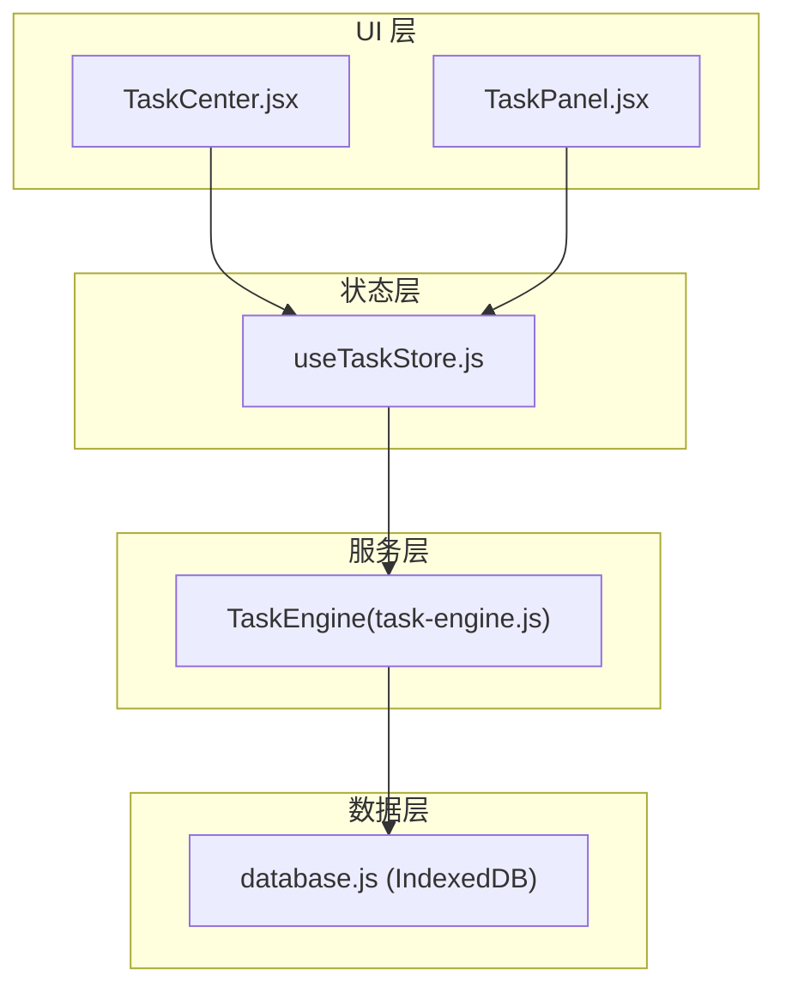
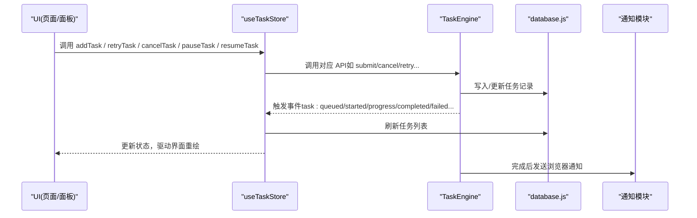
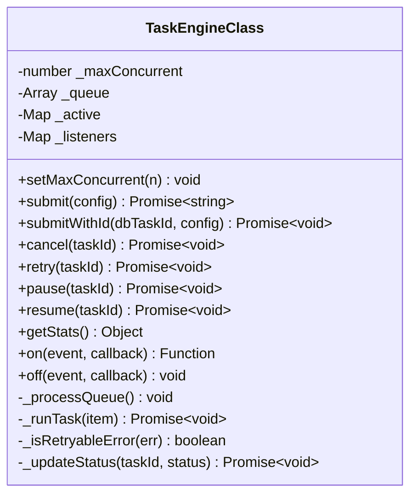
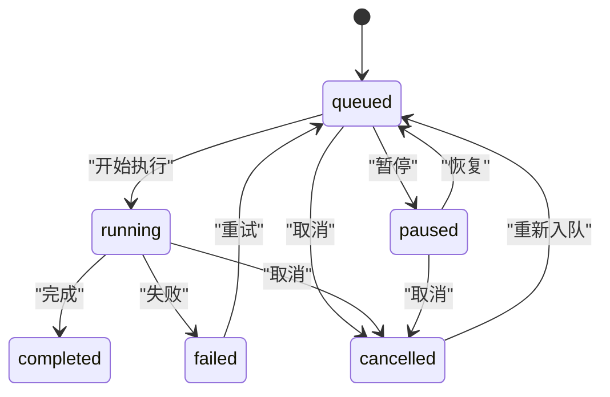
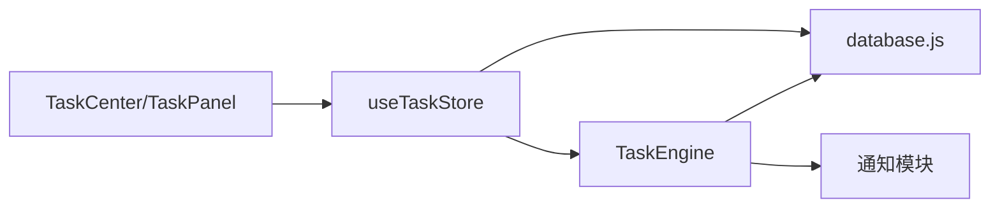

# 任务操作接口

<cite>
**本文引用的文件**   
- [task-engine.js](file://app/src/services/task-engine.js)
- [useTaskStore.js](file://app/src/stores/useTaskStore.js)
- [database.js](file://app/src/db/database.js)
- [useGenerationStore.js](file://app/src/stores/useGenerationStore.js)
- [TaskCenter.jsx](file://app/src/pages/TaskCenter.jsx)
- [TaskPanel.jsx](file://app/src/components/TaskPanel.jsx)
</cite>

## 目录
1. [简介](#简介)
2. [项目结构](#项目结构)
3. [核心组件](#核心组件)
4. [架构总览](#架构总览)
5. [详细组件分析](#详细组件分析)
6. [依赖关系分析](#依赖关系分析)
7. [性能与并发特性](#性能与并发特性)
8. [故障排查指南](#故障排查指南)
9. [结论](#结论)
10. [附录：API 参考与最佳实践](#附录api-参考与最佳实践)

## 简介
本文件面向“任务引擎”的公共操作接口，系统化说明以下能力的使用方式、参数格式、返回值与使用场景：
- 提交任务：submit、submitWithId
- 控制任务：cancel、retry、pause、resume
- 配置与统计：setMaxConcurrent、getStats
- 事件订阅：on/off（用于进度、完成、失败等状态变更）
同时给出任务配置对象的结构定义、execute 函数的编写规范与上下文 ctx 的使用方法，并提供完整示例路径与最佳实践建议。

## 项目结构
与任务操作相关的核心代码分布在服务层、存储层、数据库层与 UI 层：
- 服务层：任务调度器 TaskEngine（单例），负责队列、并发、重试、事件与持久化
- 存储层：useTaskStore（Zustand），桥接 TaskEngine 事件到 UI 状态
- 数据层：database.js（IndexedDB），提供任务记录的增删改查与统计
- 业务层：useGenerationStore 中演示了如何构造 execute 并调用 submit
- UI 层：TaskCenter、TaskPanel 展示任务列表与操作入口

图表来源
- [task-engine.js:1-319](file://app/src/services/task-engine.js#L1-L319)
- [useTaskStore.js:1-173](file://app/src/stores/useTaskStore.js#L1-L173)
- [database.js:1-339](file://app/src/db/database.js#L1-L339)
- [TaskCenter.jsx:1-218](file://app/src/pages/TaskCenter.jsx#L1-L218)
- [TaskPanel.jsx:1-538](file://app/src/components/TaskPanel.jsx#L1-L538)

章节来源
- [task-engine.js:1-319](file://app/src/services/task-engine.js#L1-L319)
- [useTaskStore.js:1-173](file://app/src/stores/useTaskStore.js#L1-L173)
- [database.js:1-339](file://app/src/db/database.js#L1-L339)
- [TaskCenter.jsx:1-218](file://app/src/pages/TaskCenter.jsx#L1-L218)
- [TaskPanel.jsx:1-538](file://app/src/components/TaskPanel.jsx#L1-L538)

## 核心组件
- TaskEngine（任务引擎）
  - 职责：任务入队、并发执行、状态机流转、指数退避重试、事件广播、进度上报、结果持久化
  - 关键属性：最大并发数、队列、活跃任务集合、监听器映射
  - 关键方法：submit、submitWithId、cancel、retry、pause、resume、setMaxConcurrent、getStats、on/off
- useTaskStore（任务状态桥）
  - 职责：加载任务列表、初始化事件桥、封装 cancel/retry/pause/resume 等操作，统一刷新 UI
- database.js（IndexedDB 封装）
  - 职责：任务的 CRUD、统计查询、初始化
- UI 组件
  - TaskCenter、TaskPanel：基于 useTaskStore 渲染任务分组、提供用户操作入口

章节来源
- [task-engine.js:33-319](file://app/src/services/task-engine.js#L33-L319)
- [useTaskStore.js:14-172](file://app/src/stores/useTaskStore.js#L14-L172)
- [database.js:235-274](file://app/src/db/database.js#L235-L274)

## 架构总览
下图展示了从 UI 发起任务到引擎执行、持久化与事件回传的完整链路。

图表来源
- [useTaskStore.js:39-64](file://app/src/stores/useTaskStore.js#L39-L64)
- [task-engine.js:222-297](file://app/src/services/task-engine.js#L222-L297)
- [database.js:235-274](file://app/src/db/database.js#L235-L274)

## 详细组件分析

### 任务引擎类图

图表来源
- [task-engine.js:33-319](file://app/src/services/task-engine.js#L33-L319)

#### 公开 API 详解

- setMaxConcurrent(n)
  - 作用：设置最大并发任务数（最小为 1），并尝试立即处理队列
  - 参数：n 为正整数
  - 返回：无
  - 使用场景：根据设备或网络情况动态调整并发度

- submit(config)
  - 作用：提交新任务，自动生成 taskId，持久化后入队
  - 参数 config 结构：
    - type: string，任务类型（如 generation）
    - model: string，模型标识
    - prompt: string，提示词/描述
    - params: object，业务参数
    - execute: async function(ctx)，实际工作函数
  - 返回值：Promise<string>，解析为 taskId
  - 使用场景：大多数业务提交入口；execute 内部可调用 ctx.onProgress 上报进度

- submitWithId(dbTaskId, config)
  - 作用：以已存在的任务 ID 入队（常用于先写库再执行）
  - 参数：dbTaskId 为已有任务 ID；config 同上
  - 返回值：Promise<void>
  - 使用场景：需要与外部系统共享任务 ID 时

- cancel(taskId)
  - 作用：取消任务（若运行中则通过 AbortController 中断；若在队列则移除）
  - 参数：taskId
  - 返回值：Promise<void>
  - 注意：会触发 task:cancelled 事件

- retry(taskId)
  - 作用：对失败或已取消的任务进行重试（重置状态、递增重试计数、重新入队）
  - 参数：taskId
  - 返回值：Promise<void>
  - 约束：仅允许在 failed 或 cancelled 状态下重试

- pause(taskId)
  - 作用：暂停任务（运行中则中断；排队中则标记为 paused）
  - 参数：taskId
  - 返回值：Promise<void>
  - 注意：暂停后 execute 引用丢失，恢复需由调用方重新提交

- resume(taskId)
  - 作用：将 paused 任务重新入队
  - 参数：taskId
  - 返回值：Promise<void>
  - 注意：由于暂停后 execute 丢失，通常应配合新的 submit 使用

- getStats()
  - 作用：获取当前活跃任务数、队列长度、最大并发数
  - 返回值：{ active, queued, maxConcurrent }

- on(event, callback) / off(event, callback)
  - 作用：订阅/取消订阅任务事件
  - 支持事件：task:queued、task:started、task:progress、task:completed、task:failed、task:cancelled、task:paused、task:retry
  - 返回值：on 返回一个解绑函数

章节来源
- [task-engine.js:44-211](file://app/src/services/task-engine.js#L44-L211)
- [task-engine.js:215-313](file://app/src/services/task-engine.js#L215-L313)

#### 任务配置对象结构定义
- type: string，可选，默认 'generation'
- model: string，模型名
- prompt: string，提示词
- params: object，业务参数
- execute: async function(ctx) => result
  - ctx 上下文对象：
    - signal: AbortSignal，用于中断长耗时请求
    - taskId: string，当前任务 ID
    - onProgress(percent: number): Promise<void>，上报进度（0-100）

章节来源
- [task-engine.js:50-81](file://app/src/services/task-engine.js#L50-L81)
- [task-engine.js:229-245](file://app/src/services/task-engine.js#L229-L245)

#### execute 函数编写规范与最佳实践
- 必须为异步函数，返回最终结果（会被持久化为 task.result）
- 使用 ctx.signal 检查是否被取消，及时中止网络请求或循环
- 使用 ctx.onProgress 定期上报进度，便于 UI 显示
- 抛出错误时，引擎会根据错误类型决定是否自动重试（见“重试策略”）
- 避免阻塞主线程，尽量使用异步 I/O

章节来源
- [task-engine.js:222-297](file://app/src/services/task-engine.js#L222-L297)

#### 使用示例（路径引用）
- 生成任务示例（含 execute 构造与 submit 调用）
  - [useGenerationStore.js:200-282](file://app/src/stores/useGenerationStore.js#L200-L282)
- 任务中心 UI 中的取消/重试/暂停/恢复操作
  - [TaskCenter.jsx:60-66](file://app/src/pages/TaskCenter.jsx#L60-L66)
- 侧边任务面板中的操作
  - [TaskPanel.jsx:244-272](file://app/src/components/TaskPanel.jsx#L244-L272)

#### 事件与状态机
- 状态转换规则：
  - queued -> running | cancelled | paused
  - running -> completed | failed | cancelled
  - paused -> queued | cancelled
  - failed -> queued（重试）
  - completed -> 终态
  - cancelled -> queued（可重新入队）
- 事件流：
  - task:queued：入队
  - task:started：开始执行
  - task:progress：进度更新
  - task:completed：成功完成
  - task:failed：失败
  - task:cancelled：取消
  - task:paused：暂停
  - task:retry：进入重试

图表来源
- [task-engine.js:18-31](file://app/src/services/task-engine.js#L18-L31)

## 依赖关系分析
- TaskEngine 依赖：
  - IndexedDB 数据层（database.js）：读写任务记录、更新状态与进度
  - 通知模块：任务完成/失败时推送浏览器通知
- useTaskStore 依赖：
  - TaskEngine：调用其公共 API
  - database.js：读取任务列表与统计
  - 事件桥：订阅 TaskEngine 事件并刷新本地状态
- UI 组件依赖：
  - useTaskStore：获取任务列表与操作方法

图表来源
- [task-engine.js:14-16](file://app/src/services/task-engine.js#L14-L16)
- [useTaskStore.js:10-12](file://app/src/stores/useTaskStore.js#L10-L12)
- [database.js:235-274](file://app/src/db/database.js#L235-L274)

章节来源
- [task-engine.js:14-16](file://app/src/services/task-engine.js#L14-L16)
- [useTaskStore.js:10-12](file://app/src/stores/useTaskStore.js#L10-L12)
- [database.js:235-274](file://app/src/db/database.js#L235-L274)

## 性能与并发特性
- 并发控制：默认最大并发数为 3，可通过 setMaxConcurrent 调整
- 队列策略：FIFO，按提交顺序执行
- 重试策略：指数退避，最多 3 次；仅对特定错误（如 5xx、网络错误、超时）自动重试
- 进度上报：通过 ctx.onProgress 持久化并广播事件，减少轮询开销
- 取消机制：AbortController 信号，避免无效资源占用

章节来源
- [task-engine.js:34-48](file://app/src/services/task-engine.js#L34-L48)
- [task-engine.js:269-282](file://app/src/services/task-engine.js#L269-L282)

## 故障排查指南
- 常见问题
  - 任务无法重试：确认任务状态是否为 failed 或 cancelled
  - 暂停后无法恢复：暂停会丢失 execute 引用，需重新提交任务
  - 进度不更新：确保在 execute 中调用 ctx.onProgress
  - 取消无效：检查是否在运行中且未正确监听 signal
- 定位手段
  - 订阅事件：使用 on('task:*') 观察状态变化
  - 查看数据库：通过 database.js 提供的 getTasks/getTask 查询任务详情
  - 控制台日志：引擎内部对监听器异常有兜底打印

章节来源
- [task-engine.js:118-178](file://app/src/services/task-engine.js#L118-L178)
- [useTaskStore.js:39-64](file://app/src/stores/useTaskStore.js#L39-L64)
- [database.js:243-274](file://app/src/db/database.js#L243-L274)

## 结论
任务引擎提供了稳定可靠的后台任务管理能力，涵盖提交、控制、重试、进度与事件机制。通过合理的 execute 实现与 ctx 上下文使用，可以构建高可用、可观测的任务流程。结合 useTaskStore 的事件桥与 UI 组件，可实现流畅的用户体验。

## 附录：API 参考与最佳实践

### API 速览
- 提交
  - submit(config)：返回 taskId
  - submitWithId(dbTaskId, config)：复用已有任务 ID
- 控制
  - cancel(taskId)、retry(taskId)、pause(taskId)、resume(taskId)
- 配置与统计
  - setMaxConcurrent(n)、getStats()
- 事件
  - on(event, cb)/off(event, cb)

章节来源
- [task-engine.js:44-211](file://app/src/services/task-engine.js#L44-L211)

### 任务配置对象字段
- type: string（可选，默认 'generation'）
- model: string
- prompt: string
- params: object
- execute: async function(ctx)

章节来源
- [task-engine.js:50-81](file://app/src/services/task-engine.js#L50-L81)

### ctx 上下文对象
- signal: AbortSignal
- taskId: string
- onProgress(percent: number): Promise<void>

章节来源
- [task-engine.js:229-245](file://app/src/services/task-engine.js#L229-L245)

### 使用示例路径
- 生成任务示例（含 execute 与 submit）
  - [useGenerationStore.js:200-282](file://app/src/stores/useGenerationStore.js#L200-L282)
- 任务中心操作入口
  - [TaskCenter.jsx:60-66](file://app/src/pages/TaskCenter.jsx#L60-L66)
- 侧边任务面板操作入口
  - [TaskPanel.jsx:244-272](file://app/src/components/TaskPanel.jsx#L244-L272)

### 最佳实践
- 合理设置并发：根据设备与网络状况调整 setMaxConcurrent
- 及时上报进度：在长时间操作中周期性调用 ctx.onProgress
- 响应取消：定期检查 ctx.signal.aborted 或捕获 abort 错误
- 错误分类：区分可重试与不可重试错误，必要时抛出自定义错误
- 幂等设计：重试时应保证业务幂等，避免重复副作用
- 清理资源：在 finally 中释放临时资源，避免内存泄漏

[本节为通用指导，无需具体文件来源]