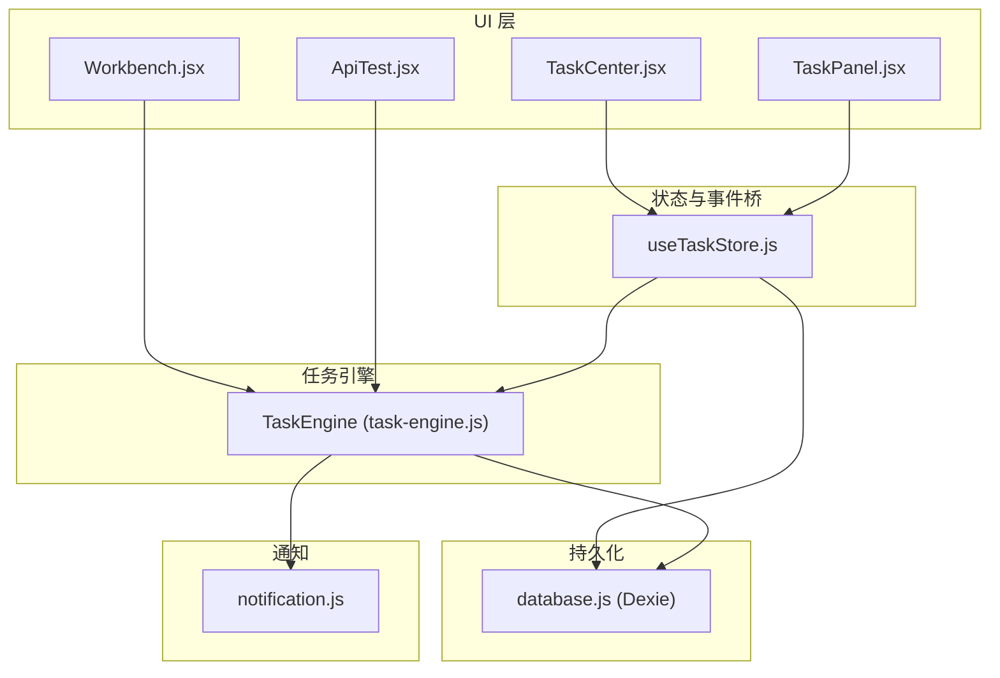
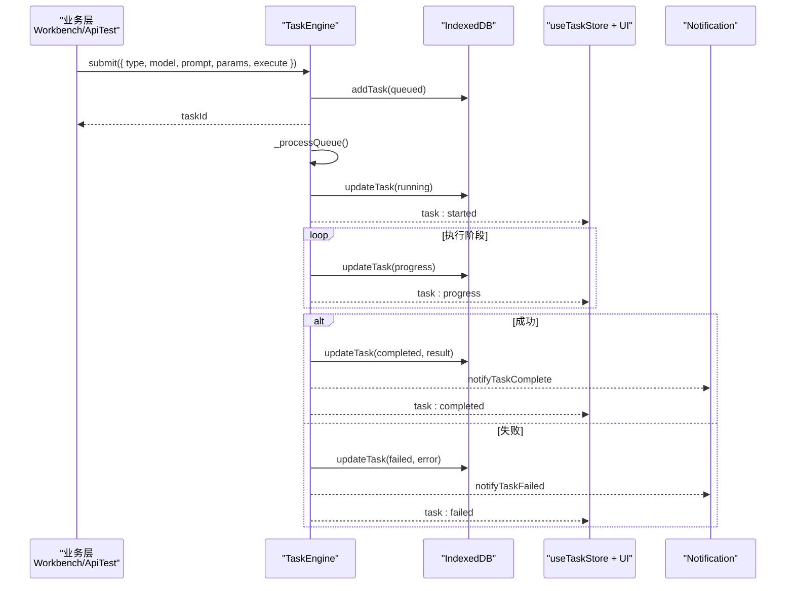
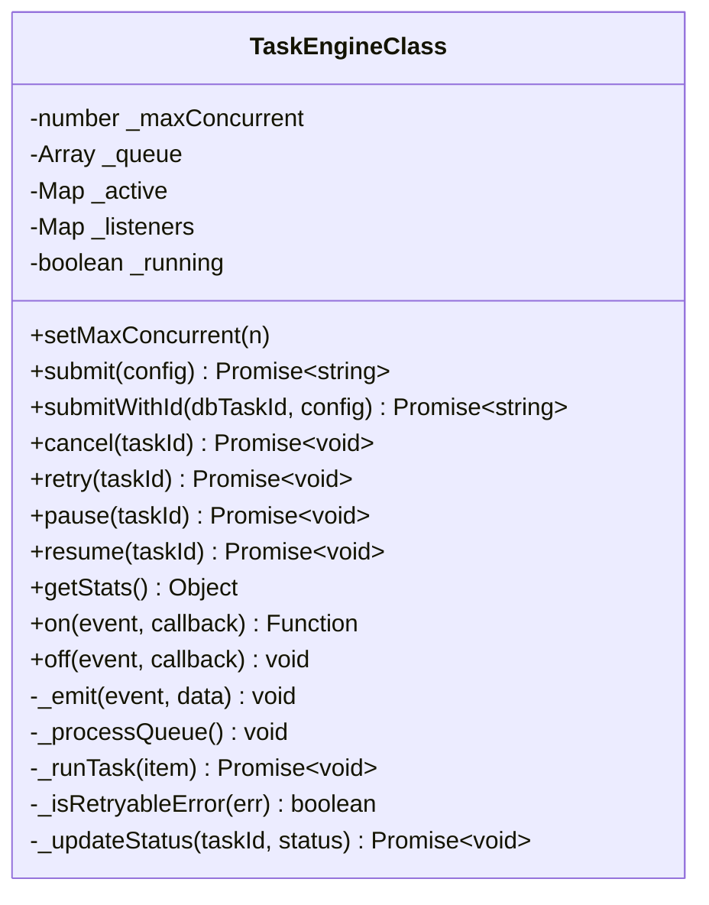
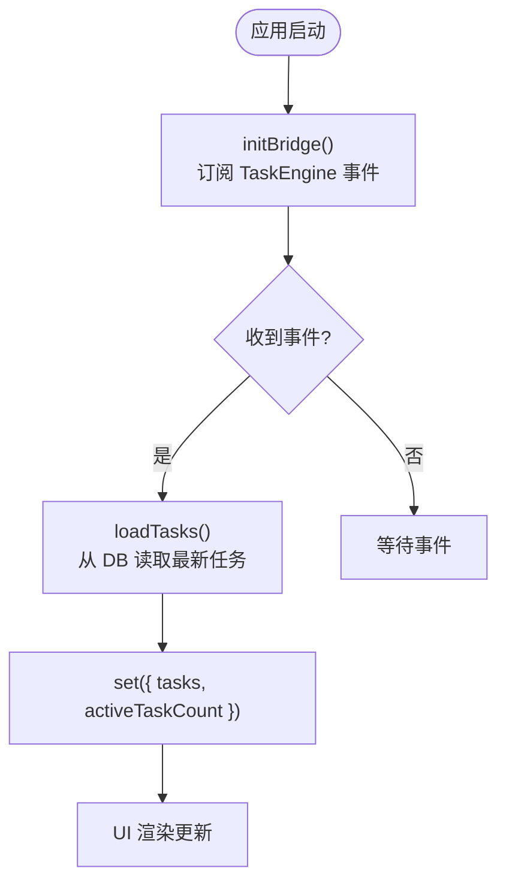
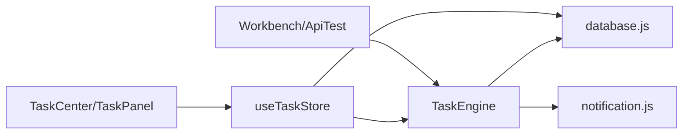
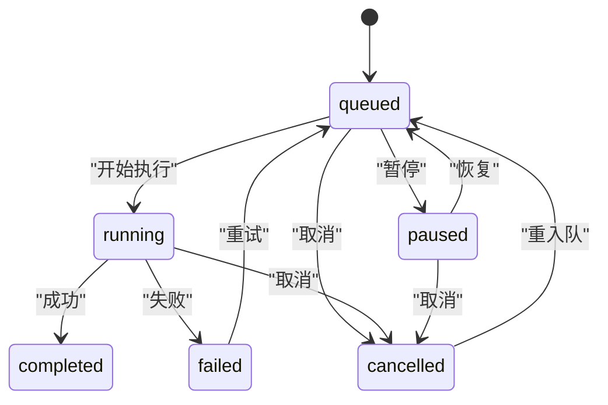
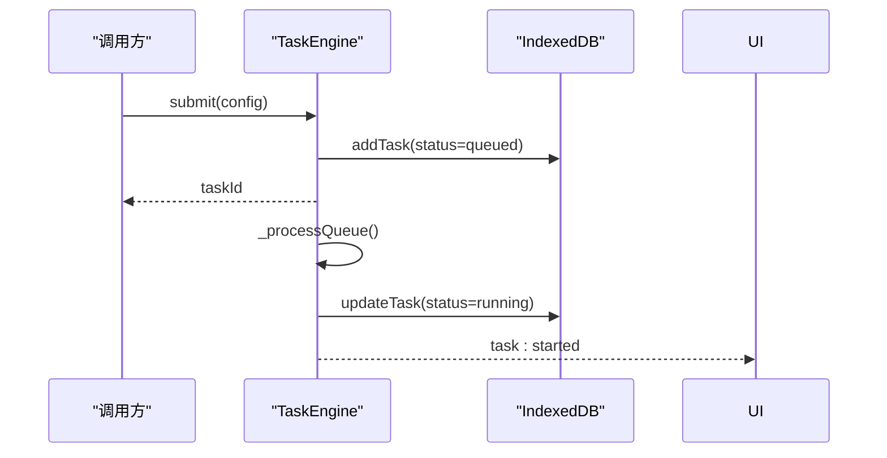
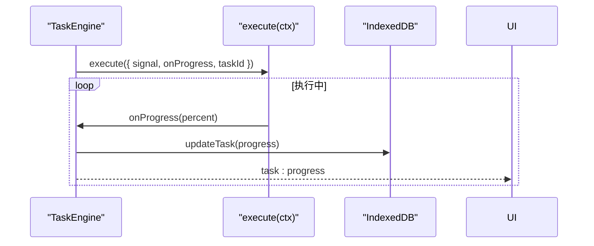
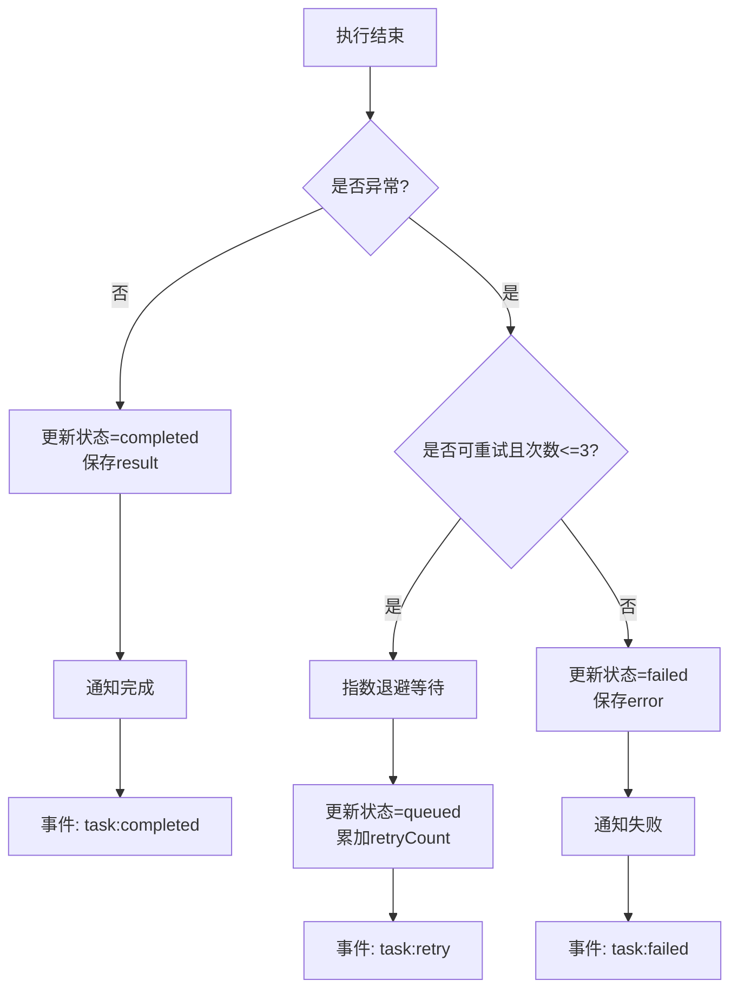

# 任务生命周期管理

<cite>
**本文引用的文件**
- [task-engine.js](file://app/src/services/task-engine.js)
- [useTaskStore.js](file://app/src/stores/useTaskStore.js)
- [database.js](file://app/src/db/database.js)
- [notification.js](file://app/src/services/notification.js)
- [TaskCenter.jsx](file://app/src/pages/TaskCenter.jsx)
- [TaskPanel.jsx](file://app/src/components/TaskPanel.jsx)
- [ApiTest.jsx](file://app/src/pages/ApiTest.jsx)
- [Workbench.jsx](file://app/src/pages/Workbench.jsx)
</cite>

## 目录
1. [简介](#简介)
2. [项目结构](#项目结构)
3. [核心组件](#核心组件)
4. [架构总览](#架构总览)
5. [详细组件分析](#详细组件分析)
6. [依赖关系分析](#依赖关系分析)
7. [性能与并发特性](#性能与并发特性)
8. [故障排查指南](#故障排查指南)
9. [结论](#结论)
10. [附录：状态机与使用示例](#附录状态机与使用示例)

## 简介
本文件围绕“任务引擎”的生命周期管理系统，系统化说明任务的完整状态机设计、状态转换规则、触发条件、限制与持久化机制，并给出任务创建、启动、执行、完成、失败、取消和暂停的实现逻辑。文档同时提供状态转换图与使用示例，帮助在不同状态下进行任务操作与监控。

## 项目结构
任务生命周期相关代码主要分布在服务层、存储层、UI 层与数据库层：
- 服务层：任务调度与状态机（TaskEngine）
- 存储层：IndexedDB 持久化（Dexie）
- UI 层：任务中心页面与侧边面板，以及事件桥接的 Zustand Store
- 通知层：浏览器通知封装
- 业务调用方：工作区与 API 测试页面向 TaskEngine 提交任务

图表来源
- [task-engine.js:1-319](file://app/src/services/task-engine.js#L1-L319)
- [useTaskStore.js:1-173](file://app/src/stores/useTaskStore.js#L1-L173)
- [database.js:1-339](file://app/src/db/database.js#L1-L339)
- [notification.js:1-113](file://app/src/services/notification.js#L1-L113)
- [TaskCenter.jsx:1-218](file://app/src/pages/TaskCenter.jsx#L1-L218)
- [TaskPanel.jsx:1-538](file://app/src/components/TaskPanel.jsx#L1-L538)
- [ApiTest.jsx:120-154](file://app/src/pages/ApiTest.jsx#L120-L154)
- [Workbench.jsx:368-406](file://app/src/pages/Workbench.jsx#L368-L406)

章节来源
- [task-engine.js:1-319](file://app/src/services/task-engine.js#L1-L319)
- [useTaskStore.js:1-173](file://app/src/stores/useTaskStore.js#L1-L173)
- [database.js:1-339](file://app/src/db/database.js#L1-L339)
- [notification.js:1-113](file://app/src/services/notification.js#L1-L113)
- [TaskCenter.jsx:1-218](file://app/src/pages/TaskCenter.jsx#L1-L218)
- [TaskPanel.jsx:1-538](file://app/src/components/TaskPanel.jsx#L1-L538)
- [ApiTest.jsx:120-154](file://app/src/pages/ApiTest.jsx#L120-L154)
- [Workbench.jsx:368-406](file://app/src/pages/Workbench.jsx#L368-L406)

## 核心组件
- 任务引擎（TaskEngine）：单例，负责任务队列、并发控制、状态机、重试、进度上报、事件广播与持久化。
- 任务存储桥（useTaskStore）：将 TaskEngine 的事件桥接到 Zustand 状态，驱动 UI 实时刷新。
- 数据库层（database.js）：基于 Dexie 的 IndexedDB 封装，提供任务 CRUD 与统计。
- 通知服务（notification.js）：浏览器通知封装，在任务完成或失败时推送消息。
- UI 组件（TaskCenter.jsx、TaskPanel.jsx）：按状态分组展示任务并提供操作入口。
- 业务调用方（Workbench.jsx、ApiTest.jsx）：通过 TaskEngine.submit 提交具体执行逻辑。

章节来源
- [task-engine.js:1-319](file://app/src/services/task-engine.js#L1-L319)
- [useTaskStore.js:1-173](file://app/src/stores/useTaskStore.js#L1-L173)
- [database.js:1-339](file://app/src/db/database.js#L1-L339)
- [notification.js:1-113](file://app/src/services/notification.js#L1-L113)
- [TaskCenter.jsx:1-218](file://app/src/pages/TaskCenter.jsx#L1-L218)
- [TaskPanel.jsx:1-538](file://app/src/components/TaskPanel.jsx#L1-L538)
- [Workbench.jsx:368-406](file://app/src/pages/Workbench.jsx#L368-L406)
- [ApiTest.jsx:120-154](file://app/src/pages/ApiTest.jsx#L120-L154)

## 架构总览
任务从业务层提交到 TaskEngine，进入队列；引擎根据并发上限拉取任务执行，期间持续更新状态与进度并持久化；完成后或失败后触发通知与事件，UI 通过 store 监听事件刷新列表。

图表来源
- [task-engine.js:57-81](file://app/src/services/task-engine.js#L57-L81)
- [task-engine.js:222-297](file://app/src/services/task-engine.js#L222-L297)
- [database.js:235-274](file://app/src/db/database.js#L235-L274)
- [notification.js:78-103](file://app/src/services/notification.js#L78-L103)
- [useTaskStore.js:39-64](file://app/src/stores/useTaskStore.js#L39-L64)

## 详细组件分析

### 任务引擎（TaskEngine）
- 并发与队列
  - 最大并发数可配置，默认 3。
  - FIFO 队列，空闲时自动拉取任务执行。
- 状态机
  - 定义合法转换表，确保状态迁移一致性。
  - 支持 queued → running | cancelled | paused；running → completed | failed | cancelled；paused → queued | cancelled；failed → queued（重试）。
- 执行上下文
  - 为 execute 函数提供 signal（用于取消）、taskId、onProgress(percent)（用于进度上报）。
- 重试策略
  - 指数退避重试，最多 3 次；仅对特定错误（如 5xx、网络错误）重试。
- 事件系统
  - 内部事件包括：task:queued、task:started、task:progress、task:completed、task:failed、task:cancelled、task:paused、task:retry。
- 持久化
  - 所有关键状态变更均落库，保证崩溃恢复与跨会话可见性。

图表来源
- [task-engine.js:33-40](file://app/src/services/task-engine.js#L33-L40)
- [task-engine.js:44-48](file://app/src/services/task-engine.js#L44-L48)
- [task-engine.js:57-81](file://app/src/services/task-engine.js#L57-L81)
- [task-engine.js:94-116](file://app/src/services/task-engine.js#L94-L116)
- [task-engine.js:118-146](file://app/src/services/task-engine.js#L118-L146)
- [task-engine.js:148-178](file://app/src/services/task-engine.js#L148-L178)
- [task-engine.js:180-187](file://app/src/services/task-engine.js#L180-L187)
- [task-engine.js:191-211](file://app/src/services/task-engine.js#L191-L211)
- [task-engine.js:215-220](file://app/src/services/task-engine.js#L215-L220)
- [task-engine.js:222-297](file://app/src/services/task-engine.js#L222-L297)
- [task-engine.js:299-305](file://app/src/services/task-engine.js#L299-L305)
- [task-engine.js:307-313](file://app/src/services/task-engine.js#L307-L313)

章节来源
- [task-engine.js:1-319](file://app/src/services/task-engine.js#L1-L319)

### 任务存储桥（useTaskStore）
- 职责
  - 维护 tasks 列表与活跃计数。
  - 初始化 TaskEngine 事件桥，统一刷新任务列表。
  - 暴露 add/update/remove/retry/cancel/pause/resume/getStats/clearCompleted 等动作。
- 事件桥
  - 订阅 engine 的所有状态事件，每次变更后重新加载任务列表，保障 UI 与持久化一致。

图表来源
- [useTaskStore.js:39-64](file://app/src/stores/useTaskStore.js#L39-L64)
- [useTaskStore.js:23-33](file://app/src/stores/useTaskStore.js#L23-L33)

章节来源
- [useTaskStore.js:1-173](file://app/src/stores/useTaskStore.js#L1-L173)

### 数据库层（database.js）
- 任务表
  - 字段包含 id、type、status、model、prompt、params、progress、error、result、retryCount、createdAt、updatedAt 等。
  - 索引：按 createdAt 倒序查询；按 status+createdAt 复合索引便于分页与筛选。
- 常用接口
  - addTask/getTasks/getTask/updateTask/deleteTask/getTaskStats。

章节来源
- [database.js:235-274](file://app/src/db/database.js#L235-L274)

### 通知服务（notification.js）
- 功能
  - 请求权限、发送通知、自动关闭、点击聚焦窗口。
- 集成点
  - 任务完成/失败时由 TaskEngine 调用，向用户推送结果摘要或错误信息。

章节来源
- [notification.js:1-113](file://app/src/services/notification.js#L1-L113)

### UI 组件（TaskCenter.jsx、TaskPanel.jsx）
- 分组展示
  - 进行中、排队中、已完成、失败、已暂停（部分视图）。
- 操作入口
  - 暂停/继续、取消、重试、移除、清空已完成。
- 交互反馈
  - 按钮点击后调用 store 动作，store 再委托 TaskEngine 或 DB 操作，随后刷新列表。

章节来源
- [TaskCenter.jsx:1-218](file://app/src/pages/TaskCenter.jsx#L1-L218)
- [TaskPanel.jsx:1-538](file://app/src/components/TaskPanel.jsx#L1-L538)

### 业务调用方（Workbench.jsx、ApiTest.jsx）
- 典型用法
  - 构造 execute(ctx) 回调，在其中调用适配器方法，传入 ctx.signal 与 ctx.onProgress。
  - 将返回结果写入图片库或返回给上层。
- 异步任务适配
  - 对于需要轮询的任务，适配器内部实现 pollResult，结合 onProgress 上报进度。

章节来源
- [Workbench.jsx:368-406](file://app/src/pages/Workbench.jsx#L368-L406)
- [ApiTest.jsx:120-154](file://app/src/pages/ApiTest.jsx#L120-L154)

## 依赖关系分析
- TaskEngine 依赖
  - database.js：读写任务记录与统计。
  - notification.js：完成/失败通知。
  - uuid：生成唯一 taskId。
- useTaskStore 依赖
  - TaskEngine：事件订阅与操作委托。
  - database.js：数据源。
- UI 组件依赖
  - useTaskStore：获取状态与操作方法。
- 业务层依赖
  - TaskEngine：提交任务。
  - 适配器：实际模型调用（不在本仓库范围）。

图表来源
- [task-engine.js:1-319](file://app/src/services/task-engine.js#L1-L319)
- [useTaskStore.js:1-173](file://app/src/stores/useTaskStore.js#L1-L173)
- [database.js:1-339](file://app/src/db/database.js#L1-L339)
- [notification.js:1-113](file://app/src/services/notification.js#L1-L113)
- [TaskCenter.jsx:1-218](file://app/src/pages/TaskCenter.jsx#L1-L218)
- [TaskPanel.jsx:1-538](file://app/src/components/TaskPanel.jsx#L1-L538)
- [Workbench.jsx:368-406](file://app/src/pages/Workbench.jsx#L368-L406)
- [ApiTest.jsx:120-154](file://app/src/pages/ApiTest.jsx#L120-L154)

章节来源
- [task-engine.js:1-319](file://app/src/services/task-engine.js#L1-L319)
- [useTaskStore.js:1-173](file://app/src/stores/useTaskStore.js#L1-L173)
- [database.js:1-339](file://app/src/db/database.js#L1-L339)
- [notification.js:1-113](file://app/src/services/notification.js#L1-L113)
- [TaskCenter.jsx:1-218](file://app/src/pages/TaskCenter.jsx#L1-L218)
- [TaskPanel.jsx:1-538](file://app/src/components/TaskPanel.jsx#L1-L538)
- [Workbench.jsx:368-406](file://app/src/pages/Workbench.jsx#L368-L406)
- [ApiTest.jsx:120-154](file://app/src/pages/ApiTest.jsx#L120-L154)

## 性能与并发特性
- 并发控制
  - 通过最大并发数限制同时运行的任务数量，避免资源争用。
- 队列调度
  - 空闲即消费，FIFO 顺序，减少延迟。
- 重试与退避
  - 指数退避降低瞬时压力，提高成功率。
- 进度上报
  - 高频 onProgress 会触发多次 DB 更新与事件广播，建议合理合并或节流（当前实现直接更新）。
- 事件桥刷新
  - 每次事件都 loadTasks 全量刷新，适合中小规模任务集；若任务量大，可考虑增量更新。

[本节为通用指导，不直接分析具体文件]

## 故障排查指南
- 任务无法启动
  - 检查是否达到最大并发上限；查看队列长度与活跃任务数。
- 任务被意外取消
  - 确认是否有外部 cancel 调用；检查 AbortController 信号是否被触发。
- 任务一直重试
  - 检查错误类型是否为可重试（5xx、网络错误）；必要时调整业务错误语义。
- 进度不更新
  - 确认 execute 中是否正确调用 onProgress；检查 DB 更新是否成功。
- UI 未刷新
  - 确认 initBridge 已调用；检查事件订阅是否生效。

章节来源
- [task-engine.js:94-116](file://app/src/services/task-engine.js#L94-L116)
- [task-engine.js:222-297](file://app/src/services/task-engine.js#L222-L297)
- [useTaskStore.js:39-64](file://app/src/stores/useTaskStore.js#L39-L64)

## 结论
该任务生命周期管理系统以 TaskEngine 为核心，结合 IndexedDB 持久化与事件驱动的 UI 刷新，实现了高内聚、低耦合的任务调度与状态管理。状态机清晰、可观测性强，具备完善的取消、暂停、重试与通知能力，适用于图像生成等长耗时异步任务场景。

[本节为总结，不直接分析具体文件]

## 附录：状态机与使用示例

### 状态机定义与转换规则
- 状态集合：queued、running、completed、failed、cancelled、paused
- 合法转换
  - queued → running | cancelled | paused
  - running → completed | failed | cancelled
  - paused → queued | cancelled
  - failed → queued（重试）
  - completed 无出边（终态）
  - cancelled → queued（重入队）

图表来源
- [task-engine.js:24-31](file://app/src/services/task-engine.js#L24-L31)

### 关键流程时序

#### 任务创建与启动

图表来源
- [task-engine.js:57-81](file://app/src/services/task-engine.js#L57-L81)
- [task-engine.js:222-227](file://app/src/services/task-engine.js#L222-L227)
- [database.js:235-241](file://app/src/db/database.js#L235-L241)

#### 任务执行与进度上报

图表来源
- [task-engine.js:229-237](file://app/src/services/task-engine.js#L229-L237)
- [database.js:257-259](file://app/src/db/database.js#L257-L259)

#### 任务完成与失败处理

图表来源
- [task-engine.js:247-297](file://app/src/services/task-engine.js#L247-L297)
- [task-engine.js:299-305](file://app/src/services/task-engine.js#L299-L305)

### 使用示例（路径引用）
- 在工作区提交图像生成任务
  - [Workbench.jsx:368-406](file://app/src/pages/Workbench.jsx#L368-L406)
- 在 API 测试页提交任务
  - [ApiTest.jsx:120-154](file://app/src/pages/ApiTest.jsx#L120-L154)
- 在任务中心查看与管理任务
  - [TaskCenter.jsx:1-218](file://app/src/pages/TaskCenter.jsx#L1-L218)
- 在侧边面板快速操作任务
  - [TaskPanel.jsx:1-538](file://app/src/components/TaskPanel.jsx#L1-L538)
- 初始化事件桥与状态刷新
  - [useTaskStore.js:39-64](file://app/src/stores/useTaskStore.js#L39-L64)