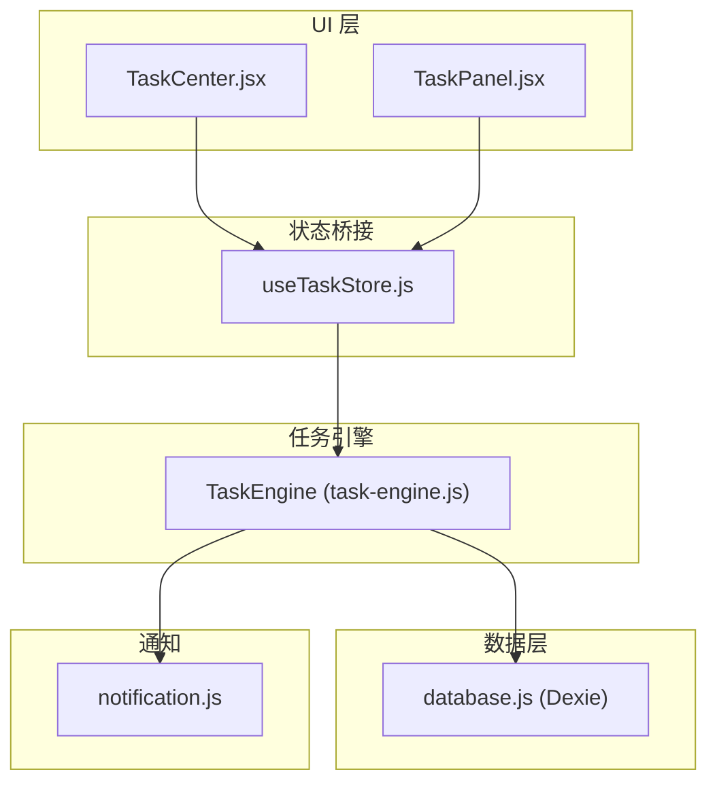
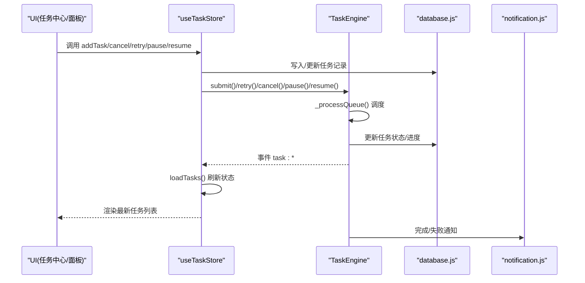
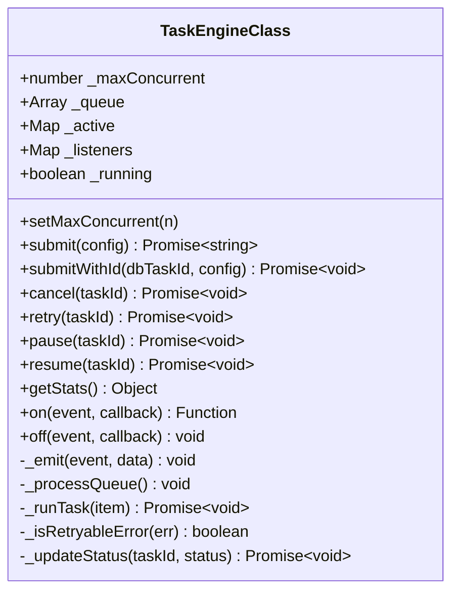
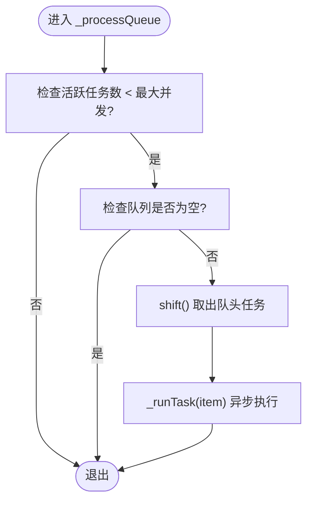
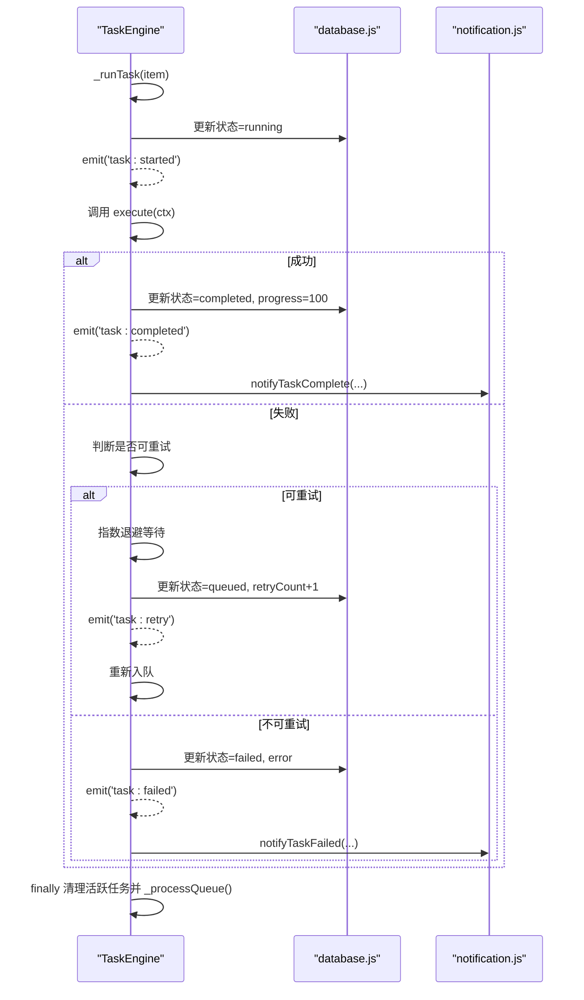
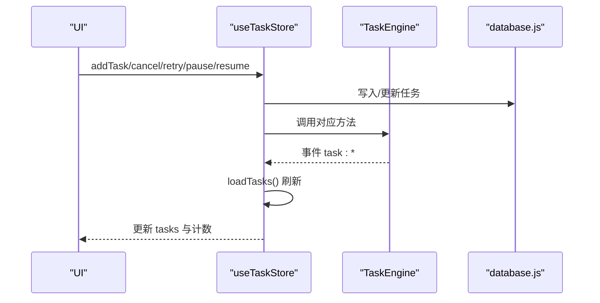
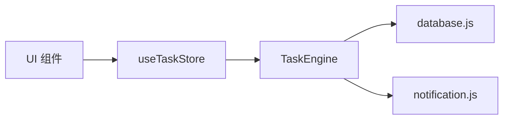

# 任务队列管理

<cite>
**本文引用的文件**   
- [task-engine.js](file://app/src/services/task-engine.js)
- [useTaskStore.js](file://app/src/stores/useTaskStore.js)
- [database.js](file://app/src/db/database.js)
- [notification.js](file://app/src/services/notification.js)
- [TaskCenter.jsx](file://app/src/pages/TaskCenter.jsx)
- [TaskPanel.jsx](file://app/src/components/TaskPanel.jsx)
</cite>

## 目录
1. [简介](#简介)
2. [项目结构](#项目结构)
3. [核心组件](#核心组件)
4. [架构总览](#架构总览)
5. [详细组件分析](#详细组件分析)
6. [依赖关系分析](#依赖关系分析)
7. [性能与优化建议](#性能与优化建议)
8. [故障排查指南](#故障排查指南)
9. [结论](#结论)

## 简介
本文件面向“任务引擎的队列管理系统”，聚焦于 FIFO（先进先出）队列的实现原理、数据结构设计、入队/出队流程、并发限制机制，以及关键处理算法 _processQueue 的实现细节。文档同时覆盖任务调度策略、错误重试与退避、状态机流转、事件驱动更新、持久化与通知等能力，并提供监控统计与性能优化建议，帮助读者快速理解并高效使用该系统。

## 项目结构
围绕任务队列的关键代码分布在服务层、存储层、UI 层：
- 服务层：任务引擎 TaskEngine（FIFO 队列、并发控制、事件总线、重试与进度）
- 存储层：IndexedDB 封装（任务记录 CRUD、统计查询）
- UI 层：任务中心页面与侧边面板（分组展示、操作入口、实时刷新）
- 通知服务：浏览器通知（完成/失败提示）

图表来源
- [task-engine.js:1-319](file://app/src/services/task-engine.js#L1-L319)
- [useTaskStore.js:1-173](file://app/src/stores/useTaskStore.js#L1-L173)
- [database.js:1-339](file://app/src/db/database.js#L1-L339)
- [notification.js:1-113](file://app/src/services/notification.js#L1-L113)
- [TaskCenter.jsx:1-218](file://app/src/pages/TaskCenter.jsx#L1-L218)
- [TaskPanel.jsx:1-538](file://app/src/components/TaskPanel.jsx#L1-L538)

章节来源
- [task-engine.js:1-319](file://app/src/services/task-engine.js#L1-L319)
- [useTaskStore.js:1-173](file://app/src/stores/useTaskStore.js#L1-L173)
- [database.js:1-339](file://app/src/db/database.js#L1-L339)
- [notification.js:1-113](file://app/src/services/notification.js#L1-L113)
- [TaskCenter.jsx:1-218](file://app/src/pages/TaskCenter.jsx#L1-L218)
- [TaskPanel.jsx:1-538](file://app/src/components/TaskPanel.jsx#L1-L538)

## 核心组件
- 任务引擎 TaskEngine
  - 职责：维护 FIFO 队列、并发执行器、任务生命周期与状态机、事件广播、重试与退避、进度上报、持久化集成。
  - 关键属性：
    - 最大并发数（默认 3）
    - 队列数组（FIFO）
    - 活跃任务 Map（按 taskId 索引）
    - 事件监听器集合
- 任务存储 useTaskStore
  - 职责：桥接 TaskEngine 事件到 Zustand 状态，提供加载、增删改查、重试/取消/暂停/恢复等操作，驱动 UI 实时更新。
- 数据库 database.js
  - 职责：基于 Dexie 的 IndexedDB 封装，提供任务表 CRUD 与统计查询。
- 通知 notification.js
  - 职责：浏览器通知 API 封装，在任务完成或失败时推送系统通知。
- UI 组件 TaskCenter.jsx / TaskPanel.jsx
  - 职责：按状态分组展示任务列表，提供交互按钮（取消、重试、暂停、恢复、清空已完成），通过 store 触发引擎动作并刷新视图。

章节来源
- [task-engine.js:33-40](file://app/src/services/task-engine.js#L33-L40)
- [useTaskStore.js:14-64](file://app/src/stores/useTaskStore.js#L14-L64)
- [database.js:235-274](file://app/src/db/database.js#L235-L274)
- [notification.js:78-103](file://app/src/services/notification.js#L78-L103)
- [TaskCenter.jsx:24-66](file://app/src/pages/TaskCenter.jsx#L24-L66)
- [TaskPanel.jsx:9-37](file://app/src/components/TaskPanel.jsx#L9-L37)

## 架构总览
下图展示了从 UI 发起任务到引擎调度、执行、持久化与通知的全链路流程。

图表来源
- [useTaskStore.js:39-64](file://app/src/stores/useTaskStore.js#L39-L64)
- [task-engine.js:57-92](file://app/src/services/task-engine.js#L57-L92)
- [task-engine.js:215-220](file://app/src/services/task-engine.js#L215-L220)
- [database.js:235-274](file://app/src/db/database.js#L235-L274)
- [notification.js:78-103](file://app/src/services/notification.js#L78-L103)

## 详细组件分析

### 任务引擎 TaskEngine（FIFO 队列与并发控制）
- 数据结构
  - 队列：数组实现 FIFO，元素包含 taskId、配置对象、Promise resolve/reject。
  - 活跃任务：Map 以 taskId 为键，保存执行上下文、AbortController、Promise 回调。
  - 事件：事件名到回调集合的映射，支持 on/off/_emit。
- 并发限制
  - 通过 _maxConcurrent 控制同时运行的任务数量；_processQueue 循环将队头任务移入活跃集，直到达到上限或队列为空。
- 入队与出队
  - 入队：submit/submitWithId 将任务项推入队列尾部，并触发 _processQueue。
  - 出队：_processQueue 中 shift() 取出队头任务，交由 _runTask 执行。
- 任务执行与生命周期
  - 启动：创建 AbortController，置状态为 running，发出 started 事件。
  - 执行：构造执行上下文 ctx（含 signal、taskId、onProgress），调用 config.execute(ctx)。
  - 成功：更新状态 completed、进度 100%，发出 completed 事件，resolve 结果，发送完成通知。
  - 失败：根据是否可重试进行指数退避后重新入队；否则标记 failed，发出 failed 事件，reject 错误，发送失败通知。
  - 取消/暂停：对运行中的任务通过 AbortController.abort 中断；对排队中的任务直接移除或标记 paused。
- 重试与退避
  - 仅对特定错误（如 5xx、网络错误）进行重试，最多 3 次，退避时间随次数指数增长。
- 事件与持久化
  - 所有状态变更均持久化至 IndexedDB，并通过事件通知 Store 刷新 UI。

图表来源
- [task-engine.js:33-40](file://app/src/services/task-engine.js#L33-L40)
- [task-engine.js:44-92](file://app/src/services/task-engine.js#L44-L92)
- [task-engine.js:94-178](file://app/src/services/task-engine.js#L94-L178)
- [task-engine.js:180-211](file://app/src/services/task-engine.js#L180-L211)
- [task-engine.js:215-313](file://app/src/services/task-engine.js#L215-L313)

章节来源
- [task-engine.js:33-40](file://app/src/services/task-engine.js#L33-L40)
- [task-engine.js:57-92](file://app/src/services/task-engine.js#L57-L92)
- [task-engine.js:94-178](file://app/src/services/task-engine.js#L94-L178)
- [task-engine.js:180-211](file://app/src/services/task-engine.js#L180-L211)
- [task-engine.js:215-313](file://app/src/services/task-engine.js#L215-L313)

#### 队列处理算法 _processQueue 详解
- 目标：在不超过最大并发的前提下，尽可能多地从队列中取任务执行。
- 流程要点：
  - 条件判断：活跃任务数 < 最大并发 且 队列非空。
  - 出队：shift() 取出队头任务。
  - 执行：调用 _runTask 异步执行任务。
  - 收尾：当任务结束（成功/失败/取消/暂停）后，再次调用 _processQueue 以继续消费队列。

图表来源
- [task-engine.js:215-220](file://app/src/services/task-engine.js#L215-L220)
- [task-engine.js:222-297](file://app/src/services/task-engine.js#L222-L297)

章节来源
- [task-engine.js:215-220](file://app/src/services/task-engine.js#L215-L220)
- [task-engine.js:222-297](file://app/src/services/task-engine.js#L222-L297)

#### 任务执行与错误处理时序

图表来源
- [task-engine.js:222-297](file://app/src/services/task-engine.js#L222-L297)
- [notification.js:78-103](file://app/src/services/notification.js#L78-L103)

章节来源
- [task-engine.js:222-297](file://app/src/services/task-engine.js#L222-L297)
- [notification.js:78-103](file://app/src/services/notification.js#L78-L103)

### 任务存储 useTaskStore（事件桥接与状态同步）
- 初始化桥接：在应用启动时订阅 TaskEngine 的所有事件，统一刷新任务列表，确保 UI 与引擎状态一致。
- 操作封装：addTask/updateTask/removeTask/retryTask/cancelTask/pauseTask/resumeTask/getTaskStats/clearCompleted 等方法，内部调用数据库与引擎接口，并在异常时提供降级逻辑。
- 状态聚合：tasks 数组与 activeTaskCount 用于 UI 展示与统计。

图表来源
- [useTaskStore.js:39-64](file://app/src/stores/useTaskStore.js#L39-L64)
- [useTaskStore.js:66-172](file://app/src/stores/useTaskStore.js#L66-L172)
- [task-engine.js:57-92](file://app/src/services/task-engine.js#L57-L92)
- [database.js:235-274](file://app/src/db/database.js#L235-L274)

章节来源
- [useTaskStore.js:39-64](file://app/src/stores/useTaskStore.js#L39-L64)
- [useTaskStore.js:66-172](file://app/src/stores/useTaskStore.js#L66-L172)

### 数据库 database.js（任务表与统计）
- 任务表 schema：包含 id、type、status、model、createdAt 等字段，并建立复合索引以支持按状态与时间排序。
- 常用接口：addTask/getTasks/getTask/updateTask/deleteTask/getTaskStats。
- 统计：返回 total、active、queued、completed、failed 等汇总信息。

章节来源
- [database.js:22-31](file://app/src/db/database.js#L22-L31)
- [database.js:235-274](file://app/src/db/database.js#L235-L274)

### 通知 notification.js（完成/失败提示）
- 功能：请求权限、发送通知、自动关闭、点击聚焦窗口。
- 集成点：任务完成或失败时由引擎调用相应函数推送系统通知。

章节来源
- [notification.js:19-43](file://app/src/services/notification.js#L19-L43)
- [notification.js:78-103](file://app/src/services/notification.js#L78-L103)

### UI 组件（TaskCenter.jsx / TaskPanel.jsx）
- 分组展示：按 running/queued/completed/failed/paused 分组，显示进度条、模型名称、时间戳、错误信息等。
- 交互操作：取消、重试、暂停、恢复、清空已完成，均通过 store 调用引擎与数据库。
- 实时刷新：依赖 store 的事件桥接，自动拉取最新任务列表。

章节来源
- [TaskCenter.jsx:24-66](file://app/src/pages/TaskCenter.jsx#L24-L66)
- [TaskPanel.jsx:9-37](file://app/src/components/TaskPanel.jsx#L9-L37)

## 依赖关系分析
- 模块耦合
  - TaskEngine 依赖 database.js 与 notification.js，不直接依赖 UI。
  - useTaskStore 作为中间层，解耦 UI 与引擎，负责事件桥接与状态同步。
  - UI 组件仅依赖 useTaskStore，避免直接访问底层引擎与数据库。
- 外部依赖
  - Dexie（IndexedDB 封装）
  - uuid（生成任务 ID）
  - 浏览器 Notification API

图表来源
- [useTaskStore.js:10-12](file://app/src/stores/useTaskStore.js#L10-L12)
- [task-engine.js:14-16](file://app/src/services/task-engine.js#L14-L16)

章节来源
- [useTaskStore.js:10-12](file://app/src/stores/useTaskStore.js#L10-L12)
- [task-engine.js:14-16](file://app/src/services/task-engine.js#L14-L16)

## 性能与优化建议
- 并发度调优
  - 根据后端 API 限流与资源占用调整 _maxConcurrent，避免过载导致超时或 5xx。
- 队列长度控制
  - 当前未设置硬性上限，建议在提交前检查队列长度，必要时拒绝新任务或提示用户稍后再试。
- 批量入队与节流
  - 高频提交时可合并多次入队，减少 _processQueue 调用开销。
- 重试退避策略
  - 指数退避已实现，可根据业务场景增加抖动因子，降低雪崩风险。
- 进度上报频率
  - onProgress 频繁调用会引发大量 DB 写操作，建议合并或降频（例如每 N% 或固定间隔）。
- 内存与事件监听
  - 注意组件卸载时注销事件监听，避免内存泄漏。
- 统计与监控
  - 利用 getStats 与 getTaskStats 定期采集指标，结合前端埋点观察吞吐、延迟与失败率。

[本节为通用指导，无需具体文件引用]

## 故障排查指南
- 常见问题定位
  - 任务无法开始：检查 _maxConcurrent 与队列长度，确认 _processQueue 被正确触发。
  - 任务卡住：查看是否因网络错误或长时间阻塞导致，关注 _isRetryableError 判定与退避逻辑。
  - 取消无效：确认任务是否在活跃集中，若已在队列中需从数组中移除。
  - 进度不更新：检查 onProgress 调用路径与 DB 更新是否成功。
- 日志与事件
  - 通过 console 输出与 TaskEngine 事件（task:queued/started/progress/completed/failed/cancelled/paused/retry）辅助定位问题。
- 降级与容错
  - useTaskStore 在调用引擎失败时提供本地状态回退，确保 UI 仍可操作。

章节来源
- [task-engine.js:299-313](file://app/src/services/task-engine.js#L299-L313)
- [useTaskStore.js:109-157](file://app/src/stores/useTaskStore.js#L109-L157)

## 结论
该任务队列管理系统采用简洁高效的 FIFO 队列与 Map 活跃集组合，配合事件驱动与 IndexedDB 持久化，实现了可靠的后台任务调度与可视化管控。通过可配置的并发限制、指数退避重试、进度上报与系统通知，系统在稳定性与用户体验之间取得良好平衡。建议在生产环境中结合业务负载动态调整并发度与重试策略，并完善监控与告警体系，进一步提升整体可靠性与可观测性。