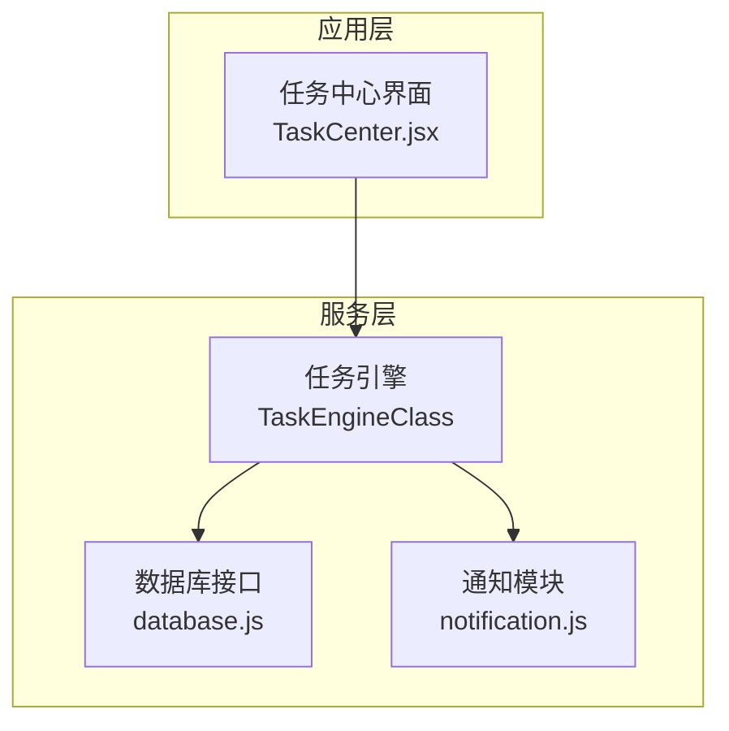
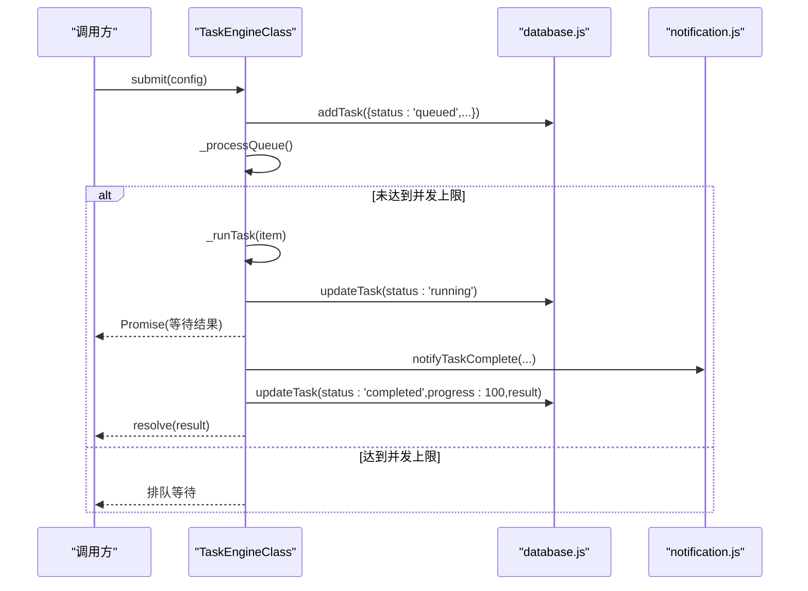
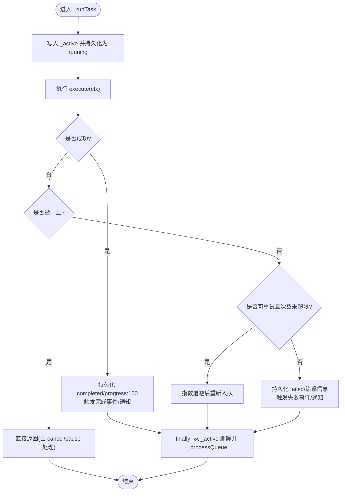
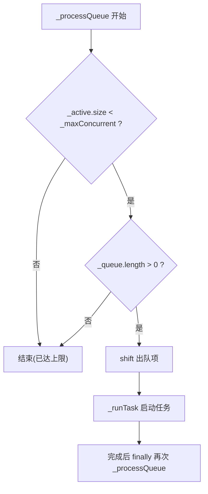
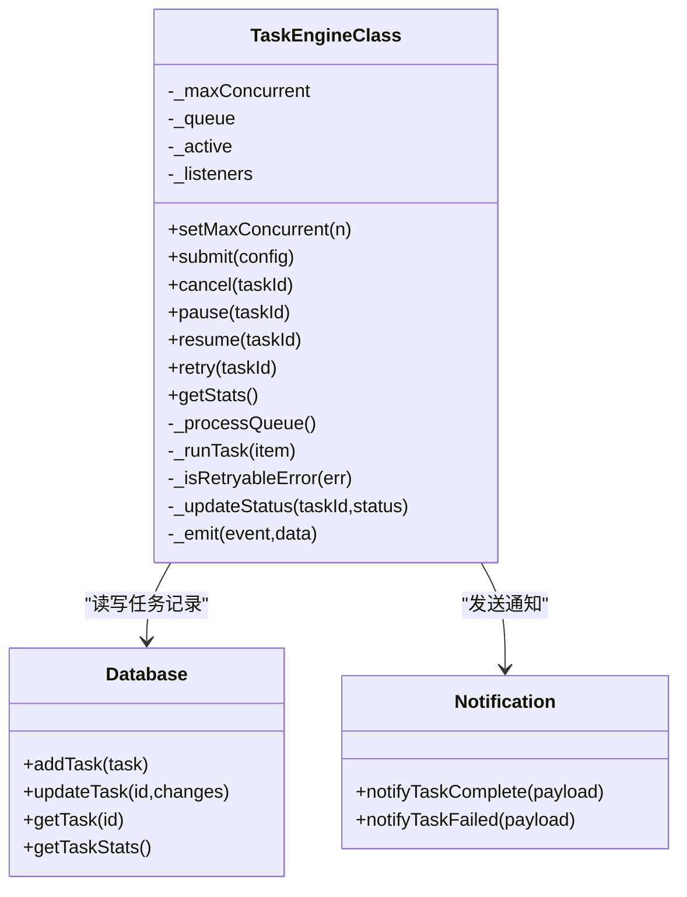

# 并发控制机制

<cite>
**本文引用的文件**   
- [task-engine.js](file://app/src/services/task-engine.js)
- [database.js](file://app/src/db/database.js)
- [TaskCenter.jsx](file://app/src/pages/TaskCenter.jsx)
</cite>

## 目录
1. [简介](#简介)
2. [项目结构](#项目结构)
3. [核心组件](#核心组件)
4. [架构总览](#架构总览)
5. [详细组件分析](#详细组件分析)
6. [依赖关系分析](#依赖关系分析)
7. [性能与调优建议](#性能与调优建议)
8. [故障排查指南](#故障排查指南)
9. [结论](#结论)

## 简介
本文件聚焦任务引擎的并发控制系统，围绕最大并发数配置 _maxConcurrent 的设置与管理、活动任务集合 _active 的激活/跟踪/清理逻辑、以及确保不超过最大并发限制的调度算法进行系统化说明。同时提供可操作的并发调优建议与监控方法，帮助读者在真实业务场景中稳定高效地运行后台任务。

## 项目结构
与并发控制直接相关的代码位于服务层与数据持久化层：
- 任务引擎服务：实现并发控制、队列调度、状态机、重试与事件通知
- 数据库层：基于 IndexedDB（Dexie）持久化任务记录
- 页面层：展示任务统计与交互入口（用于观察并发效果）

图表来源
- [task-engine.js:33-40](file://app/src/services/task-engine.js#L33-L40)
- [database.js:235-274](file://app/src/db/database.js#L235-L274)
- [TaskCenter.jsx:86-98](file://app/src/pages/TaskCenter.jsx#L86-L98)

章节来源
- [task-engine.js:1-40](file://app/src/services/task-engine.js#L1-L40)
- [database.js:1-30](file://app/src/db/database.js#L1-L30)
- [TaskCenter.jsx:86-98](file://app/src/pages/TaskCenter.jsx#L86-L98)

## 核心组件
- TaskEngineClass：单例任务调度器，负责并发上限控制、FIFO 队列、任务生命周期管理、指数退避重试、进度上报与事件广播。
- database.js：IndexedDB 封装，提供任务的增删改查与统计接口。
- TaskCenter.jsx：任务列表与统计面板，便于观察并发状态。

章节来源
- [task-engine.js:33-40](file://app/src/services/task-engine.js#L33-L40)
- [database.js:235-274](file://app/src/db/database.js#L235-L274)
- [TaskCenter.jsx:86-98](file://app/src/pages/TaskCenter.jsx#L86-L98)

## 架构总览
下图展示了从提交任务到执行完成的关键流程，包括并发限制检查、活动集更新、状态持久化与事件通知。

图表来源
- [task-engine.js:57-81](file://app/src/services/task-engine.js#L57-L81)
- [task-engine.js:215-220](file://app/src/services/task-engine.js#L215-L220)
- [task-engine.js:222-297](file://app/src/services/task-engine.js#L222-L297)
- [database.js:235-259](file://app/src/db/database.js#L235-L259)

## 详细组件分析

### 最大并发数配置 _maxConcurrent 的设置与管理
- 默认值与约束
  - 构造时初始化默认并发数为 3。
  - 通过 setMaxConcurrent(n) 动态调整，内部使用 Math.max(1, n) 保证最小值为 1，避免非法配置导致死锁或无任务执行。
- 生效时机
  - 设置后立即触发 _processQueue，尝试将队列中的任务提升到活动集，直至达到新的并发上限。
- 典型用法
  - 在应用启动或用户切换“并发度”设置后调用 setMaxConcurrent，以适配不同网络/后端能力。

章节来源
- [task-engine.js:34-40](file://app/src/services/task-engine.js#L34-L40)
- [task-engine.js:44-48](file://app/src/services/task-engine.js#L44-L48)

### 活动任务集合 _active 的管理方式
- 数据结构
  - _active 为 Map，键为 taskId，值为包含 { config, controller, resolve, reject } 的对象，用于追踪当前正在运行的任务及其取消控制器和 Promise 回调。
- 任务激活
  - _runTask 中创建 AbortController，写入 _active，并持久化状态为 running，随后触发 task:started 事件。
- 任务清理
  - 正常完成或失败后，finally 分支统一从 _active 删除该任务，并再次尝试 _processQueue，以便后续任务继续入队。
- 取消与暂停
  - cancel/pause 会主动查找 _active，若命中则调用 controller.abort() 并删除条目，同时持久化状态并触发相应事件；若未命中则在队列中移除或标记为 paused。

图表来源
- [task-engine.js:222-297](file://app/src/services/task-engine.js#L222-L297)
- [task-engine.js:95-116](file://app/src/services/task-engine.js#L95-L116)
- [task-engine.js:148-165](file://app/src/services/task-engine.js#L148-L165)

章节来源
- [task-engine.js:222-297](file://app/src/services/task-engine.js#L222-L297)
- [task-engine.js:95-116](file://app/src/services/task-engine.js#L95-L116)
- [task-engine.js:148-165](file://app/src/services/task-engine.js#L148-L165)

### 并发控制算法的实现原理与不超并发保证
- 核心循环
  - _processQueue 使用 while 条件：_active.size < _maxConcurrent 且 _queue.length > 0。只要满足条件就 shift 一个任务并调用 _runTask。
- 不变式
  - 任意时刻 _active.size 不会超过 _maxConcurrent，因为只有在小于上限时才允许入队新任务。
- 触发点
  - 每次任务完成/失败/取消/暂停后都会再次调用 _processQueue，从而把队列中的下一个任务提升为活动任务，维持吞吐。
- 幂等性
  - 即使多次并发触发 _processQueue，由于 _active.size 与 _queue.length 的原子性判断与操作在同一线程事件循环内，不会出现超并发。

图表来源
- [task-engine.js:215-220](file://app/src/services/task-engine.js#L215-L220)
- [task-engine.js:222-297](file://app/src/services/task-engine.js#L222-L297)

章节来源
- [task-engine.js:215-220](file://app/src/services/task-engine.js#L215-L220)
- [task-engine.js:222-297](file://app/src/services/task-engine.js#L222-L297)

### 任务状态机与事件
- 状态定义与合法迁移
  - queued -> running | cancelled | paused
  - running -> completed | failed | cancelled
  - paused -> queued | cancelled
  - failed -> queued（重试）
  - completed / cancelled 为终态（但 cancelled 支持 re-queue）
- 事件
  - task:queued、task:started、task:progress、task:completed、task:failed、task:cancelled、task:paused、task:retry
- 用途
  - 前端监听事件驱动 UI 更新；通知模块在完成/失败时推送系统通知。

章节来源
- [task-engine.js:18-31](file://app/src/services/task-engine.js#L18-L31)
- [task-engine.js:191-211](file://app/src/services/task-engine.js#L191-L211)
- [task-engine.js:226-297](file://app/src/services/task-engine.js#L226-L297)

### 重试与退避策略
- 触发条件
  - 捕获异常后，若错误类型属于可重试（如 5xx、网络错误），且 retryCount <= 3，则进入重试流程。
- 指数退避
  - 等待时间 = 1000 * 2^(retryCount - 1)，即 1s、2s、4s 递增。
- 重入队
  - 更新任务状态为 queued，增加 retryCount，并将任务重新推入队列，由 _processQueue 在下一次空闲槽位执行。

章节来源
- [task-engine.js:259-297](file://app/src/services/task-engine.js#L259-L297)

### 与数据库层的协作
- 任务持久化
  - 新增任务时写入 tasks 表，初始 status=queued；运行中、完成、失败、重试均同步更新状态与进度。
- 统计查询
  - getTaskStats 提供按状态聚合的统计，便于上层展示与监控。

章节来源
- [database.js:235-274](file://app/src/db/database.js#L235-L274)
- [task-engine.js:57-81](file://app/src/services/task-engine.js#L57-L81)
- [task-engine.js:226-297](file://app/src/services/task-engine.js#L226-L297)

### 与界面的集成与观测
- 任务中心界面展示进行中、排队中、已完成、失败数量，并提供暂停/取消/重试等操作入口，便于验证并发行为与问题定位。

章节来源
- [TaskCenter.jsx:86-98](file://app/src/pages/TaskCenter.jsx#L86-L98)

## 依赖关系分析
- 低耦合设计
  - TaskEngine 仅依赖数据库抽象与通知模块，不直接感知 UI 细节。
- 关键依赖
  - database.js：提供 addTask/updateTask/getTask/getTaskStats 等接口。
  - notification.js：完成/失败时触发浏览器通知。
- 可能的扩展点
  - 将 _isRetryableError 的策略外置为插件式判定器，便于接入更多错误分类。
  - 将 _processQueue 的调度策略替换为优先级队列或加权公平队列。

图表来源
- [task-engine.js:33-40](file://app/src/services/task-engine.js#L33-L40)
- [task-engine.js:44-48](file://app/src/services/task-engine.js#L44-L48)
- [task-engine.js:215-220](file://app/src/services/task-engine.js#L215-L220)
- [task-engine.js:222-297](file://app/src/services/task-engine.js#L222-L297)
- [database.js:235-274](file://app/src/db/database.js#L235-L274)

章节来源
- [task-engine.js:33-40](file://app/src/services/task-engine.js#L33-L40)
- [database.js:235-274](file://app/src/db/database.js#L235-L274)

## 性能与调优建议
- 合理设置 _maxConcurrent
  - 根据后端 QPS 限制、网络带宽与 CPU 占用综合评估。一般可从默认 3 起步，逐步上调至 5~10，观察错误率与延迟变化。
- 关注活动集大小与队列长度
  - 通过 getStats() 获取 active/queued/maxConcurrent，结合 UI 统计面板观察是否存在长期积压。
- 利用事件进行细粒度监控
  - 订阅 task:started/task:completed/task:failed/task:progress，计算平均耗时、成功率、P95/P99 延迟。
- 重试策略优化
  - 对频繁失败的端点，适当降低重试次数或增大退避间隔，避免雪崩。
- 资源隔离
  - 将高负载任务与轻量任务分属不同队列或不同 _maxConcurrent 实例，避免相互影响。
- 进度上报节流
  - onProgress 频率过高会增加 IndexedDB 压力，建议合并或节流上报。

[本节为通用指导，无需特定文件引用]

## 故障排查指南
- 现象：任务一直排队不执行
  - 检查 _maxConcurrent 是否为 0 或被误设为 1 且已有任务占满；确认 _processQueue 是否在任务结束时被调用。
- 现象：任务无法取消/暂停
  - 确认任务是否已在 _active 中；若在队列中，需先移出队列再更新状态。
- 现象：频繁失败且不断重试
  - 查看 _isRetryableError 的判断条件，确认错误类型是否符合预期；必要时调整重试阈值或退避策略。
- 现象：UI 显示与实际不一致
  - 核对数据库状态是否与内存一致；检查 _updateStatus 是否抛出异常被吞掉。

章节来源
- [task-engine.js:44-48](file://app/src/services/task-engine.js#L44-L48)
- [task-engine.js:95-116](file://app/src/services/task-engine.js#L95-L116)
- [task-engine.js:148-165](file://app/src/services/task-engine.js#L148-L165)
- [task-engine.js:259-297](file://app/src/services/task-engine.js#L259-L297)
- [task-engine.js:307-313](file://app/src/services/task-engine.js#L307-L313)

## 结论
任务引擎通过 _maxConcurrent 与 _active 的组合实现了严格的并发上限控制，配合 FIFO 队列、状态机与指数退避重试，提供了稳定可靠的后台任务执行模型。借助事件与数据库统计，可在运行时持续观测与调优，满足不同场景下的吞吐与稳定性需求。