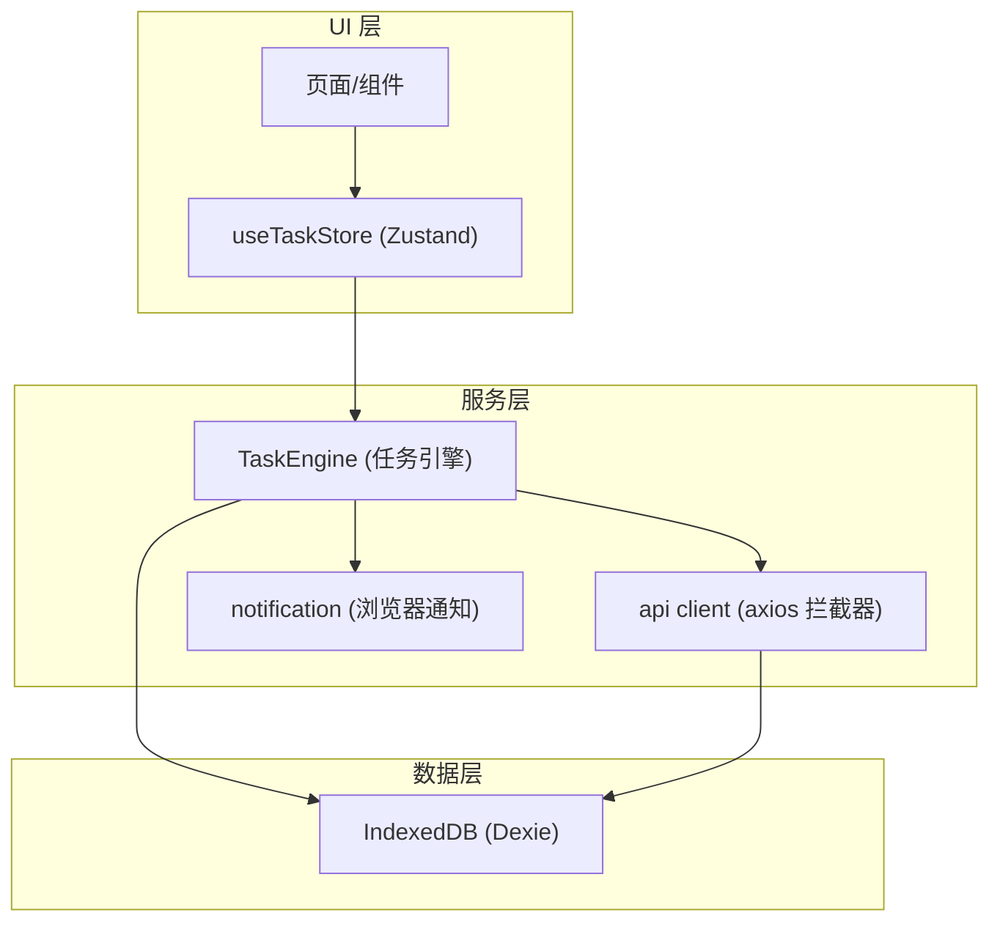
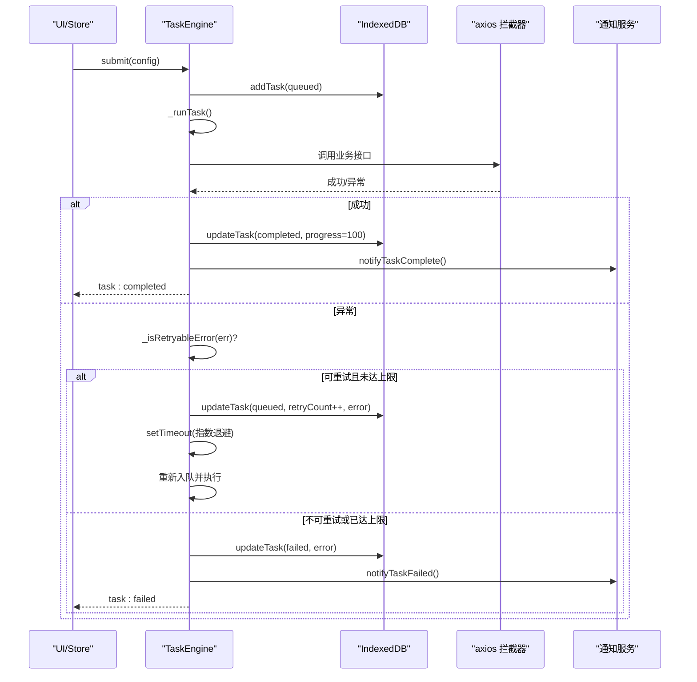
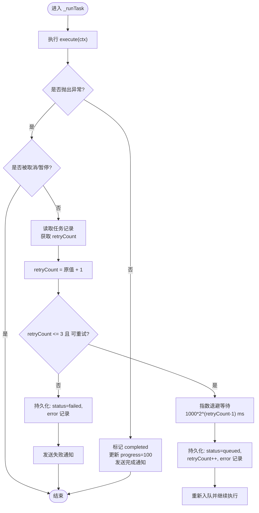
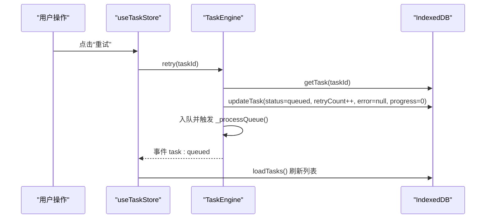
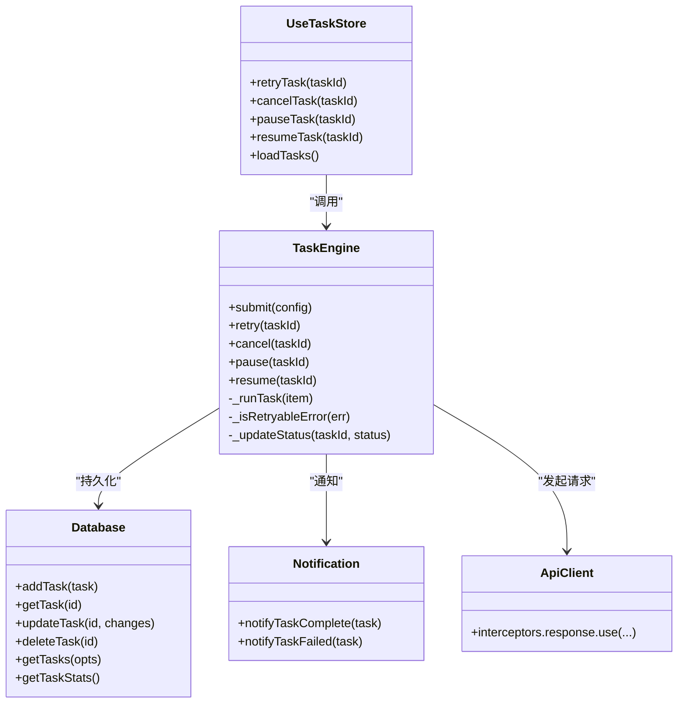

# 错误处理和重试机制

<cite>
**本文引用的文件**
- [task-engine.js](file://app/src/services/task-engine.js)
- [useTaskStore.js](file://app/src/stores/useTaskStore.js)
- [database.js](file://app/src/db/database.js)
- [client.js](file://app/src/services/api/client.js)
- [notification.js](file://app/src/services/notification.js)
</cite>

## 目录
1. [简介](#简介)
2. [项目结构](#项目结构)
3. [核心组件](#核心组件)
4. [架构总览](#架构总览)
5. [详细组件分析](#详细组件分析)
6. [依赖关系分析](#依赖关系分析)
7. [性能与可靠性考量](#性能与可靠性考量)
8. [故障排除指南](#故障排除指南)
9. [结论](#结论)

## 简介
本文件聚焦任务引擎的错误处理与重试系统，系统性说明以下要点：
- 指数退避重试算法的实现细节（默认最大重试次数、间隔计算方式）
- 可重试错误的识别逻辑（网络错误、5xx 服务器错误、超时错误）
- 错误持久化与重试状态管理
- 手动重试功能的使用与实现
- 错误诊断与故障排除建议

## 项目结构
与错误处理和重试相关的代码主要分布在服务层、存储层与 UI 状态桥接层：
- 服务层：任务调度与重试策略（TaskEngine）、HTTP 客户端拦截器（axios 层重试）
- 数据层：IndexedDB 持久化任务记录（Dexie）
- 状态层：Zustand Store 将引擎事件同步到 UI
- 通知层：浏览器通知提示任务完成/失败

图表来源
- [task-engine.js:1-319](file://app/src/services/task-engine.js#L1-L319)
- [useTaskStore.js:1-173](file://app/src/stores/useTaskStore.js#L1-L173)
- [database.js:1-339](file://app/src/db/database.js#L1-L339)
- [client.js:47-145](file://app/src/services/api/client.js#L47-L145)
- [notification.js:1-113](file://app/src/services/notification.js#L1-L113)

章节来源
- [task-engine.js:1-319](file://app/src/services/task-engine.js#L1-L319)
- [useTaskStore.js:1-173](file://app/src/stores/useTaskStore.js#L1-L173)
- [database.js:1-339](file://app/src/db/database.js#L1-L339)
- [client.js:47-145](file://app/src/services/api/client.js#L47-L145)
- [notification.js:1-113](file://app/src/services/notification.js#L1-L113)

## 核心组件
- TaskEngine：负责任务生命周期、并发控制、自动重试、进度上报、事件广播与持久化。
- useTaskStore：桥接 TaskEngine 事件到 Zustand 状态，提供手动重试、取消、暂停、恢复等动作。
- database：基于 Dexie 的 IndexedDB 封装，持久化任务记录（含 status、error、retryCount、progress 等）。
- api client：axios 实例与响应拦截器，内置 HTTP 级重试（与任务级重试互补）。
- notification：在任务完成或失败时触发浏览器通知。

章节来源
- [task-engine.js:1-319](file://app/src/services/task-engine.js#L1-L319)
- [useTaskStore.js:1-173](file://app/src/stores/useTaskStore.js#L1-L173)
- [database.js:1-339](file://app/src/db/database.js#L1-L339)
- [client.js:47-145](file://app/src/services/api/client.js#L47-L145)
- [notification.js:1-113](file://app/src/services/notification.js#L1-L113)

## 架构总览
下图展示了“任务执行—错误捕获—重试判定—持久化—通知”的端到端流程。

图表来源
- [task-engine.js:222-305](file://app/src/services/task-engine.js#L222-L305)
- [client.js:47-84](file://app/src/services/api/client.js#L47-L84)
- [notification.js:77-103](file://app/src/services/notification.js#L77-L103)
- [database.js:235-274](file://app/src/db/database.js#L235-L274)

## 详细组件分析

### 任务引擎（TaskEngine）错误处理与重试
- 任务状态机与转换
  - 支持 queued → running → completed/failed/cancelled/paused；failed 可通过重试回到 queued。
- 自动重试策略
  - 最大重试次数：默认 3 次。
  - 指数退避间隔：以毫秒为单位，按 1000 * 2^(retryCount-1) 递增，即第 1 次重试约 1s，第 2 次约 2s，第 3 次约 4s。
  - 重试条件：由 _isRetryableError 判断是否属于可重试错误。
- 可重试错误识别（_isRetryableError）
  - 服务端错误：HTTP 状态码为 5xx（>=500）。
  - 网络错误：当无 HTTP 状态码且错误消息包含 “Network”。
  - 超时错误：当前实现中未显式匹配超时标志，需结合上层 axios 拦截器的超时配置与错误对象形态进行扩展。
- 错误持久化
  - 每次状态变更均通过数据库更新任务记录，包括 status、error、retryCount、progress、updatedAt 等字段。
- 事件与通知
  - 任务完成/失败分别触发 task:completed / task:failed 事件，并调用通知服务推送浏览器通知。
- 并发与队列
  - 维护活跃任务集合与 FIFO 队列，按最大并发度拉取任务执行。

图表来源
- [task-engine.js:222-305](file://app/src/services/task-engine.js#L222-L305)

章节来源
- [task-engine.js:24-31](file://app/src/services/task-engine.js#L24-L31)
- [task-engine.js:222-305](file://app/src/services/task-engine.js#L222-L305)
- [task-engine.js:299-305](file://app/src/services/task-engine.js#L299-L305)
- [database.js:235-274](file://app/src/db/database.js#L235-L274)
- [notification.js:77-103](file://app/src/services/notification.js#L77-L103)

### 可重试错误识别逻辑（_isRetryableError）
- 规则
  - 若错误对象携带 HTTP 状态码且 >= 500，视为可重试。
  - 若无状态码且错误消息包含 “Network”，视为可重试（典型网络中断/连接失败）。
  - 其他情况不可重试。
- 超时错误处理现状
  - 当前实现未直接识别超时错误（如 axios 的 ECONNABORTED 或自定义超时消息），如需纳入重试，可在 _isRetryableError 中增加对超时相关标志或消息的匹配。
- 与 axios 拦截器的协作
  - axios 拦截器内部也实现了针对 5xx 和空状态码的重试（受 MAX_RETRIES 限制），采用相同的指数退避策略。任务级重试与请求级重试形成双重保障：请求级重试快速恢复瞬时抖动，任务级重试兜底更高层的业务错误。

章节来源
- [task-engine.js:299-305](file://app/src/services/task-engine.js#L299-L305)
- [client.js:47-84](file://app/src/services/api/client.js#L47-L84)

### 指数退避重试算法
- 重试次数限制
  - 任务级默认最大重试次数为 3 次。
- 间隔计算
  - 第 n 次重试等待时间 = 1000 * 2^(n-1) 毫秒。
- 适用场景
  - 适用于服务端暂时不可用、限流、网络抖动等可恢复性错误。
- 注意事项
  - 长时间运行的任务应配合 AbortController 避免阻塞。
  - 若业务侧已在上层（axios 拦截器）做了多次重试，任务级重试应避免过度叠加导致总延迟过大。

章节来源
- [task-engine.js:265-281](file://app/src/services/task-engine.js#L265-L281)
- [client.js:66-75](file://app/src/services/api/client.js#L66-L75)

### 错误持久化与重试状态管理
- 持久化字段
  - status：任务状态（queued/running/completed/failed/cancelled/paused）
  - error：最后一次错误信息
  - retryCount：累计重试次数
  - progress：进度百分比
  - updatedAt：更新时间戳
- 关键写入点
  - 提交任务：初始化为 queued，progress=0，error=null，retryCount=0
  - 运行中：更新 status=running
  - 完成：status=completed，progress=100，result 写入
  - 失败：status=failed，error 写入
  - 重试：status=queued，retryCount++，error 保留以便追踪
- 查询与统计
  - 提供按状态过滤、分页、统计总数等能力，便于前端展示与运维排查。

章节来源
- [database.js:235-274](file://app/src/db/database.js#L235-L274)
- [task-engine.js:57-81](file://app/src/services/task-engine.js#L57-L81)
- [task-engine.js:247-296](file://app/src/services/task-engine.js#L247-L296)

### 手动重试功能
- 入口
  - useTaskStore.retryTask(taskId) 调用 TaskEngine.retry(taskId)。
- 行为
  - 校验任务状态仅允许 failed 或 cancelled 的任务重试。
  - 将任务状态重置为 queued，清空 error 与 progress，并将 retryCount+1。
  - 重新入队后由引擎按正常流程执行。
- 回退策略
  - 若引擎重试失败，store 会尝试直接更新本地状态为 queued，保证 UI 一致性。

图表来源
- [useTaskStore.js:109-124](file://app/src/stores/useTaskStore.js#L109-L124)
- [task-engine.js:118-146](file://app/src/services/task-engine.js#L118-L146)
- [database.js:235-274](file://app/src/db/database.js#L235-L274)

章节来源
- [useTaskStore.js:109-124](file://app/src/stores/useTaskStore.js#L109-L124)
- [task-engine.js:118-146](file://app/src/services/task-engine.js#L118-L146)

### 与 axios 拦截器重试的关系
- 请求级重试
  - 在 axios 响应拦截器中，对 5xx 或无状态码的错误进行指数退避重试，受 MAX_RETRIES 限制。
- 任务级重试
  - 在 TaskEngine 层再次捕获异常，依据 _isRetryableError 决定是否重试，最多 3 次。
- 协同效果
  - 请求级重试优先解决短时抖动；任务级重试作为兜底，确保整体任务的可恢复性。

章节来源
- [client.js:47-84](file://app/src/services/api/client.js#L47-L84)
- [task-engine.js:265-296](file://app/src/services/task-engine.js#L265-L296)

## 依赖关系分析
- TaskEngine 依赖
  - database：读写任务记录
  - notification：任务完成/失败通知
  - axios（通过业务适配器间接使用）：发起网络请求
- useTaskStore 依赖
  - TaskEngine：驱动任务执行与重试
  - database：持久化与查询
- 耦合与内聚
  - 任务引擎与数据库解耦良好，通过函数式接口访问。
  - 事件驱动降低 UI 与引擎的直接耦合。
  - 请求级重试与任务级重试职责清晰，分层明确。

图表来源
- [task-engine.js:1-319](file://app/src/services/task-engine.js#L1-L319)
- [useTaskStore.js:1-173](file://app/src/stores/useTaskStore.js#L1-L173)
- [database.js:1-339](file://app/src/db/database.js#L1-L339)
- [client.js:47-145](file://app/src/services/api/client.js#L47-L145)
- [notification.js:1-113](file://app/src/services/notification.js#L1-L113)

章节来源
- [task-engine.js:1-319](file://app/src/services/task-engine.js#L1-L319)
- [useTaskStore.js:1-173](file://app/src/stores/useTaskStore.js#L1-L173)
- [database.js:1-339](file://app/src/db/database.js#L1-L339)
- [client.js:47-145](file://app/src/services/api/client.js#L47-L145)
- [notification.js:1-113](file://app/src/services/notification.js#L1-L113)

## 性能与可靠性考量
- 并发控制
  - 通过最大并发数限制避免资源争用与雪崩。
- 指数退避
  - 有效缓解服务端压力，降低重试风暴风险。
- 幂等性与副作用
  - 对于非幂等的写操作，建议在业务层保证幂等（例如使用唯一请求 ID），避免重复提交造成副作用。
- 超时与取消
  - 使用 AbortController 支持任务取消与超时，避免长期占用线程。
- 观测性
  - 利用事件与持久化字段（error、retryCount、updatedAt）构建监控面板，辅助定位问题。

[本节为通用指导，不直接分析具体文件]

## 故障排除指南
- 常见问题与定位
  - 任务频繁失败
    - 检查数据库中的 error 字段与 retryCount，确认是否为 5xx 或网络错误。
    - 查看浏览器控制台是否有 Network 相关错误或 axios 超时日志。
  - 重试未生效
    - 确认 _isRetryableError 是否能识别当前错误类型（特别是超时错误）。
    - 检查是否已达到最大重试次数（默认 3 次）。
  - 手动重试无效
    - 确认任务状态是否为 failed 或 cancelled。
    - 观察 store 的回退逻辑是否正确更新了本地状态。
- 建议的诊断步骤
  - 打开 IndexedDB 开发者工具，筛选 tasks 表，关注 status、error、retryCount、updatedAt。
  - 在浏览器网络面板中查看请求状态码与耗时，区分服务端错误与网络错误。
  - 启用任务事件监听（task:retry、task:failed），打印详细上下文。
- 改进建议
  - 在 _isRetryableError 中补充对超时错误的识别（如 axios 的 ECONNABORTED 或特定 message 片段）。
  - 为不同错误类型设置差异化退避策略（如限流 429 与 5xx 可采用不同系数）。
  - 引入重试上限与熔断机制，防止极端情况下无限重试。

章节来源
- [task-engine.js:265-305](file://app/src/services/task-engine.js#L265-L305)
- [useTaskStore.js:109-124](file://app/src/stores/useTaskStore.js#L109-L124)
- [database.js:235-274](file://app/src/db/database.js#L235-L274)
- [client.js:47-84](file://app/src/services/api/client.js#L47-L84)

## 结论
该错误处理与重试系统通过“请求级 + 任务级”双层重试、指数退避、严格的状态机与持久化，提供了较强的容错能力与可观测性。当前实现已覆盖网络错误与 5xx 错误，但超时错误尚未显式纳入可重试范围。建议在此基础上完善超时识别、差异化退避与熔断策略，进一步提升系统的稳定性与用户体验。