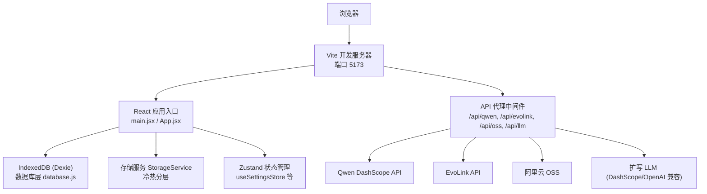
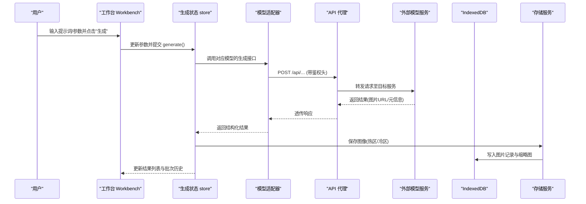
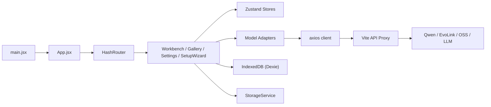

# 快速开始

<cite>
**本文引用的文件**   
- [README.md](file://README.md)
- [package.json](file://app/package.json)
- [vite.config.js](file://app/vite.config.js)
- [index.html](file://app/index.html)
- [main.jsx](file://app/src/main.jsx)
- [App.jsx](file://app/src/App.jsx)
- [database.js](file://app/src/db/database.js)
- [api-proxy.js](file://app/src/server/api-proxy.js)
- [client.js](file://app/src/services/api/client.js)
- [storage.js](file://app/src/services/storage.js)
- [useSettingsStore.js](file://app/src/stores/useSettingsStore.js)
- [models.js](file://app/src/constants/models.js)
- [SetupWizard.jsx](file://app/src/pages/SetupWizard.jsx)
</cite>

## 更新摘要
**所做更改**   
- 更新了项目结构说明，反映完整的 Vite + React 架构
- 增强了环境准备和依赖安装指南
- 完善了开发服务器启动配置说明
- 添加了详细的环境变量配置指导
- 更新了首次运行和基本操作流程
- 增强了故障排除指南

## 目录
1. [简介](#简介)
2. [项目结构](#项目结构)
3. [核心组件](#核心组件)
4. [架构总览](#架构总览)
5. [详细组件分析](#详细组件分析)
6. [依赖分析](#依赖分析)
7. [性能考虑](#性能考虑)
8. [故障排除指南](#故障排除指南)
9. [结论](#结论)
10. [附录](#附录)

## 简介
AI Image Studio 是一个专业级 AI 图像生成工作站，支持多模型统一接入、提示词工程、批量生成、知识库 RAG 与完整资产管理。本快速开始指南帮助你在最短时间内完成环境准备、安装依赖、启动开发服务器并完成首次图像生成。

## 项目结构
本项目采用 Vite + React 的前端工程化方案，通过自定义 Vite 插件在开发环境下代理后端 API（Qwen、EvoLink、OSS、LLM），前端使用 IndexedDB 持久化设置与图片元数据，结合阿里云 OSS 实现冷热分层存储。



**图表来源**
- [vite.config.js:5-12](file://app/vite.config.js#L5-L12)
- [api-proxy.js:121-189](file://app/src/server/api-proxy.js#L121-L189)
- [main.jsx:1-32](file://app/src/main.jsx#L1-L32)
- [App.jsx:353-364](file://app/src/App.jsx#L353-L364)
- [database.js:20-31](file://app/src/db/database.js#L20-L31)
- [storage.js:44-80](file://app/src/services/storage.js#L44-L80)
- [useSettingsStore.js:64-72](file://app/src/stores/useSettingsStore.js#L64-L72)

**章节来源**
- [README.md:1-10](file://README.md#L1-L10)
- [package.json:1-30](file://app/package.json#L1-L30)
- [vite.config.js:1-13](file://app/vite.config.js#L1-L13)
- [index.html:1-16](file://app/index.html#L1-L16)

## 核心组件
- **应用入口与初始化**：在页面加载时打开 IndexedDB、加载持久化设置后挂载 React 应用。
- **路由与页面**：基于 HashRouter 的页面路由，包含工作台、图库、任务中心、设置、向导等。
- **数据库层**：基于 Dexie 的 IndexedDB 封装，提供图片、批次、会话、文件夹、任务、设置、案例包等表操作。
- **API 客户端**：统一的 axios 实例，内置重试、超时、取消信号与错误归一化；长耗时请求使用独立实例。
- **代理服务**：Vite 插件在开发环境将 /api/* 转发到 Qwen/EvoLink/OSS/LLM，并注入鉴权头。
- **存储服务**：本地热区（IndexedDB）+ 云端冷区（OSS）冷热分层，自动缩略图生成与容量迁移。
- **设置与向导**：引导式配置模型、存储、扩写与偏好，持久化到 IndexedDB。

**章节来源**
- [main.jsx:10-31](file://app/src/main.jsx#L10-L31)
- [App.jsx:245-364](file://app/src/App.jsx#L245-L364)
- [database.js:1-348](file://app/src/db/database.js#L1-L348)
- [client.js:1-160](file://app/src/services/api/client.js#L1-L160)
- [api-proxy.js:121-221](file://app/src/server/api-proxy.js#L121-L221)
- [storage.js:1-200](file://app/src/services/storage.js#L1-L200)
- [useSettingsStore.js:1-179](file://app/src/stores/useSettingsStore.js#L1-L179)
- [SetupWizard.jsx:75-200](file://app/src/pages/SetupWizard.jsx#L75-L200)

## 架构总览
下图展示了从用户操作到最终图像生成的关键流程，包括 UI 交互、状态管理、适配器调用、代理转发与存储落盘。



**图表来源**
- [client.js:18-33](file://app/src/services/api/client.js#L18-L33)
- [api-proxy.js:140-183](file://app/src/server/api-proxy.js#L140-L183)
- [storage.js:51-80](file://app/src/services/storage.js#L51-L80)
- [database.js:43-50](file://app/src/db/database.js#L43-L50)

## 详细组件分析

### 环境与依赖准备
- **Node.js 版本要求**
  - 本项目使用 ES Module 与 Vite 6，建议使用 Node.js 18 及以上版本以获得最佳兼容性。
- **浏览器兼容性**
  - 现代浏览器即可运行，需支持 ES Modules、Fetch、AbortController、Canvas（缩略图）、IndexedDB。
- **依赖安装**
  - 进入 app 目录执行依赖安装命令。
  - 示例：
    ```bash
    cd app
    npm install
    # 或使用其他包管理器
    yarn install
    pnpm install
    ```
- **环境变量配置**
  - 在 app 目录下创建 `.env` 文件，填入以下键值（按需配置）：
    ```env
    # Qwen DashScope 配置
    VITE_QWEN_API_KEY=your_qwen_api_key
    VITE_QWEN_API_BASE=https://dashscope.aliyuncs.com/compatible-mode
    
    # EvoLink 配置
    VITE_EVOLINK_API_KEY=your_evolink_api_key
    VITE_EVOLINK_API_BASE=https://api.evolink.ai
    
    # 阿里云 OSS 配置
    VITE_OSS_ACCESS_KEY_ID=your_oss_access_key_id
    VITE_OSS_ACCESS_KEY_SECRET=your_oss_access_key_secret
    VITE_OSS_BUCKET=your_bucket_name
    VITE_OSS_REGION=your_region
    
    # 扩写 LLM 配置
    VITE_EXPANSION_LLM_KEY=your_llm_api_key
    VITE_EXPANSION_LLM_BASE=https://your-llm-api-base
    VITE_EXPANSION_LLM_MODEL=qwen-max
    ```
  - **注意**：这些变量仅用于开发服务器代理与运行时读取，不会打包进客户端代码。

**章节来源**
- [package.json:1-30](file://app/package.json#L1-L30)
- [api-proxy.js:126-137](file://app/src/server/api-proxy.js#L126-L137)
- [useSettingsStore.js:15-38](file://app/src/stores/useSettingsStore.js#L15-L38)

### 启动开发服务器
- **启动命令**
  ```bash
  cd app
  npm run dev
  # 或使用其他包管理器
  yarn dev
  pnpm dev
  ```
- **默认地址**
  - http://127.0.0.1:5173
- **端口与主机配置**
  - 默认 host 为 127.0.0.1，端口 5173，严格占用端口避免冲突。
- **构建与预览**
  ```bash
  npm run build
  npm run preview
  ```

**章节来源**
- [package.json:6-10](file://app/package.json#L6-L10)
- [vite.config.js:5-12](file://app/vite.config.js#L5-L12)

### 首次运行与基本操作流程
- **首次访问**
  - 打开 http://127.0.0.1:5173，若未配置过，会自动跳转到设置向导。
- **设置向导步骤**
  - **欢迎页**：了解产品能力。
  - **模型配置**：启用至少一个模型，填写 Endpoint 与 API Key，可测试连接。
  - **存储配置**（可选）：配置阿里云 OSS Bucket/Region/AccessKey，启用冷热分层。
  - **扩写 LLM**（可选）：配置提示词扩写模型，提升 Prompt 质量。
  - **偏好设置**：热区大小、默认模型等。
  - **完成**：保存配置并跳转工作区。
- **在工作台生成第一张图**
  - 选择模型（如 Qwen Image 3 或 GPT Image 2）。
  - 输入提示词，必要时上传参考图。
  - 调整尺寸、数量、质量等参数。
  - 点击"生成"，等待结果出现并可下载或加入图库。

**章节来源**
- [SetupWizard.jsx:75-200](file://app/src/pages/SetupWizard.jsx#L75-L200)
- [models.js:8-95](file://app/src/constants/models.js#L8-L95)

### 应用初始化与数据库
- **初始化顺序**
  - 打开 IndexedDB → 加载持久化设置 → 渲染 React 应用。
- **数据库表结构**
  - `images`：生成的/上传的图片
  - `batches`：一次提示词生成的图片组
  - `sessions`：工作会话
  - `folders`：用户创建的文件夹
  - `tasks`：后台任务记录
  - `settings`：键值对应用设置
  - `casePackages`：保存的图片+提示词包
- **常用操作**
  - 新增/查询/更新/删除图片、批次、任务、设置等。

**章节来源**
- [main.jsx:12-29](file://app/src/main.jsx#L12-L29)
- [database.js:20-31](file://app/src/db/database.js#L20-L31)
- [database.js:43-138](file://app/src/db/database.js#L43-L138)

### API 客户端与服务适配
- **统一客户端**
  - 基础 baseURL 为 `/api`，默认超时 60s，支持指数退避重试与取消信号。
  - 长耗时请求使用专用实例（例如同步图像生成，超时 5 分钟）。
- **适配器工厂**
  - 根据模型 ID 返回对应适配器实例（Qwen/GPT/Nano Banana）。
- **代理路由**
  - `/api/qwen` → Qwen DashScope
  - `/api/evolink` → EvoLink
  - `/api/oss` → 阿里云 OSS
  - `/api/llm` → 扩写 LLM
  - `/api/proxy-image` → 图片跨域代理

**章节来源**
- [client.js:18-33](file://app/src/services/api/client.js#L18-L33)
- [client.js:38-88](file://app/src/services/api/client.js#L38-L88)
- [client.js:100-160](file://app/src/services/api/client.js#L100-L160)
- [api-proxy.js:140-214](file://app/src/server/api-proxy.js#L140-L214)

### 存储与冷热分层
- **热区（IndexedDB）**
  - 快速访问，适合近期频繁使用的图片。
  - 存储 Blob 对象和缩略图 URL。
- **冷区（OSS）**
  - 长期归档，节省本地空间。
  - 使用阿里云 OSS SDK 进行上传下载。
- **缩略图生成**
  - 使用 Canvas API 生成最大 200px 的缩略图，加速预览。
- **容量迁移**
  - 当热区使用超过阈值时，按时间顺序将旧图迁移到冷区。

**章节来源**
- [storage.js:44-80](file://app/src/services/storage.js#L44-L80)
- [storage.js:160-196](file://app/src/services/storage.js#L160-L196)

### 设置与向导
- **设置项分类**
  - 模型配置：各模型的 API Key、Endpoint、默认参数
  - 存储配置：热区大小、OSS 配置、缩略图设置
  - 扩写配置：LLM 模型、温度、变体数量
  - 通用配置：主题、语言、并发任务数
- **持久化机制**
  - 所有设置均保存到 IndexedDB，应用启动时自动加载。
- **向导校验**
  - 支持在线测试模型与扩写 LLM 的连接性。

**章节来源**
- [useSettingsStore.js:64-179](file://app/src/stores/useSettingsStore.js#L64-L179)
- [SetupWizard.jsx:75-200](file://app/src/pages/SetupWizard.jsx#L75-L200)

## 依赖分析
- **运行时依赖**
  - React、ReactDOM、zustand、immer、dexie、axios、ali-oss、lucide-react、react-router-dom、uuid、react-hotkeys-hook
- **开发依赖**
  - vite、@vitejs/plugin-react、dotenv
- **关键关系**
  - main.jsx 初始化数据库与设置后挂载 App。
  - App 内通过路由懒加载各页面。
  - Workbench 调用适配器进行生成，存储服务负责落盘。
  - api-proxy 在开发环境代理外部 API。



**图表来源**
- [main.jsx:1-32](file://app/src/main.jsx#L1-L32)
- [App.jsx:353-364](file://app/src/App.jsx#L353-L364)
- [client.js:18-33](file://app/src/services/api/client.js#L18-L33)
- [api-proxy.js:121-189](file://app/src/server/api-proxy.js#L121-L189)
- [database.js:20-31](file://app/src/db/database.js#L20-L31)
- [storage.js:44-80](file://app/src/services/storage.js#L44-L80)

**章节来源**
- [package.json:11-28](file://app/package.json#L11-L28)

## 性能考虑
- **请求优化**
  - 使用长耗时客户端处理同步图像生成接口，避免默认超时导致失败。
  - 指数退避重试减少瞬时网络抖动影响。
- **存储优化**
  - 缩略图降低大图渲染开销。
  - 冷热分层控制热区容量，避免 IndexedDB 过大影响性能。
- **渲染优化**
  - 路由懒加载减少首屏体积。
  - Zustand + Immer 高效状态更新。

## 故障排除指南
- **无法访问 /api/* 代理**
  - 检查 `.env` 是否包含必要变量且未被误删。
  - 确认 Vite 开发服务器已启动且端口未被占用。
  - 查看控制台日志中代理路由是否激活。
- **模型连接失败**
  - 在设置向导中点击"测试连接"，观察返回消息。
  - 若提示 API Key 无效，请核对密钥与 Endpoint。
  - 检查网络连接和防火墙设置。
- **OSS 上传/下载失败**
  - 检查 Bucket/Region/AccessKey 是否正确。
  - 确认跨域与权限策略允许浏览器直连。
  - 验证 OSS 存储空间是否可用。
- **本地存储空间不足**
  - 调整热区大小阈值，触发自动迁移到冷区。
  - 清理不需要的图片和缩略图。
- **浏览器不支持**
  - 确保使用现代浏览器，开启 ES Modules、Fetch、AbortController、Canvas、IndexedDB。
  - 推荐使用 Chrome 90+、Firefox 88+、Safari 14+。
- **开发服务器启动失败**
  - 检查端口 5173 是否被占用。
  - 确认 Node.js 版本符合要求（18+）。
  - 重新安装依赖：`rm -rf node_modules && npm install`

**章节来源**
- [api-proxy.js:185-214](file://app/src/server/api-proxy.js#L185-L214)
- [SetupWizard.jsx:156-200](file://app/src/pages/SetupWizard.jsx#L156-L200)
- [storage.js:160-196](file://app/src/services/storage.js#L160-L196)

## 结论
通过以上步骤，你可以在几分钟内完成环境准备、安装依赖、启动开发服务器并完成首次图像生成。建议后续完善 OSS 配置与扩写 LLM，以获得更稳定的体验与更高的提示词质量。

## 附录
- **常用命令行示例**
  ```bash
  # 安装依赖
  cd app && npm install
  
  # 启动开发服务器
  npm run dev
  
  # 构建生产包
  npm run build
  
  # 预览构建产物
  npm run preview
  ```
- **环境变量清单**
  ```env
  # Qwen DashScope
  VITE_QWEN_API_KEY=your_api_key
  VITE_QWEN_API_BASE=https://dashscope.aliyuncs.com/compatible-mode
  
  # EvoLink
  VITE_EVOLINK_API_KEY=your_api_key
  VITE_EVOLINK_API_BASE=https://api.evolink.ai
  
  # 阿里云 OSS
  VITE_OSS_ACCESS_KEY_ID=your_access_key_id
  VITE_OSS_ACCESS_KEY_SECRET=your_access_key_secret
  VITE_OSS_BUCKET=your_bucket_name
  VITE_OSS_REGION=your_region
  
  # 扩写 LLM
  VITE_EXPANSION_LLM_KEY=your_llm_api_key
  VITE_EXPANSION_LLM_BASE=https://your-llm-api-base
  VITE_EXPANSION_LLM_MODEL=qwen-max
  ```

**章节来源**
- [package.json:6-10](file://app/package.json#L6-L10)
- [api-proxy.js:126-137](file://app/src/server/api-proxy.js#L126-L137)
- [useSettingsStore.js:15-38](file://app/src/stores/useSettingsStore.js#L15-L38)