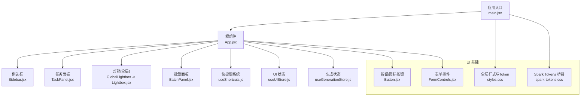
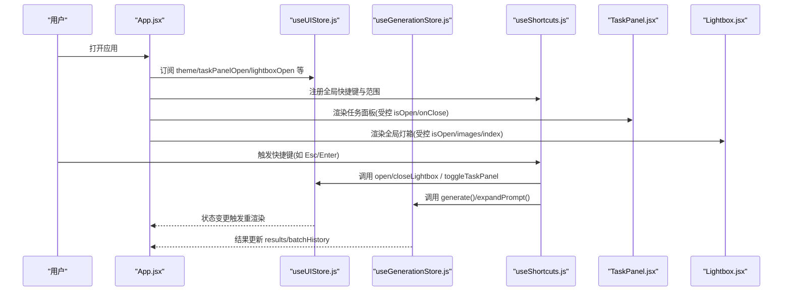
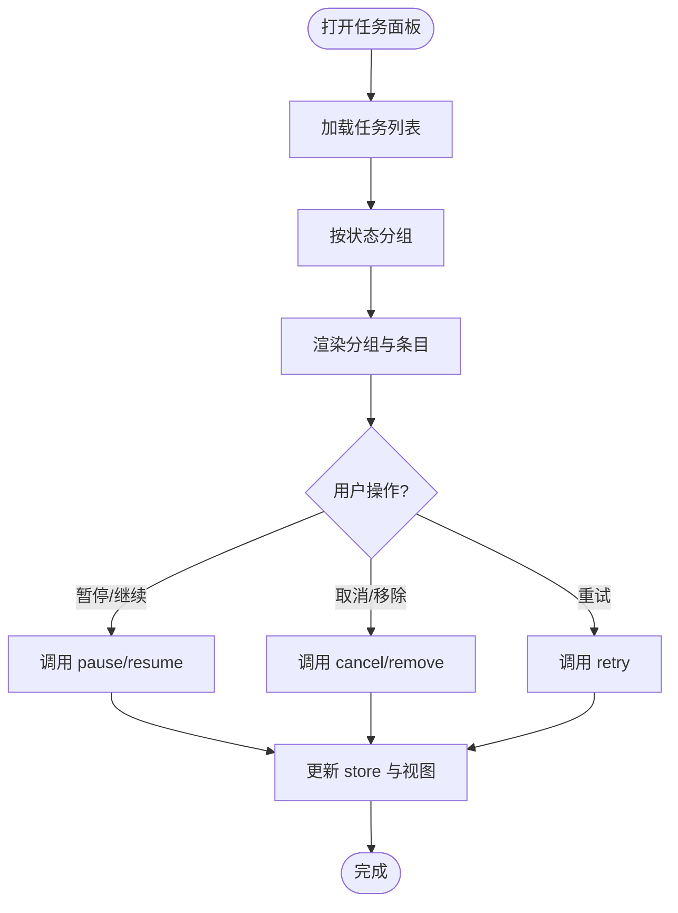
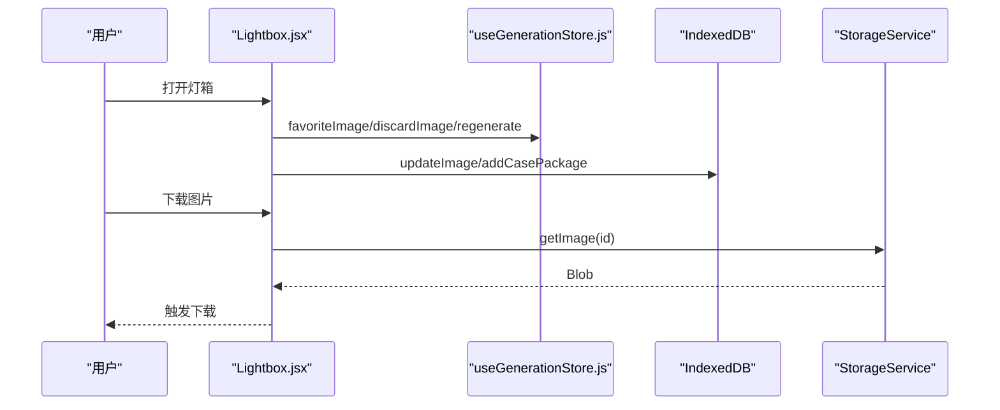
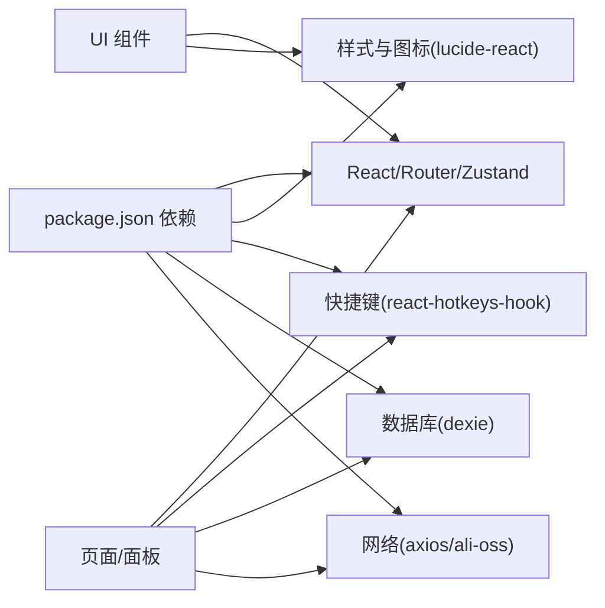

# UI 组件扩展

<cite>
**本文引用的文件**   
- [README.md](file://README.md)
- [package.json](file://app/package.json)
- [main.jsx](file://app/src/main.jsx)
- [styles.css](file://app/src/styles.css)
- [spark-tokens.css](file://app/src/components/ui/spark-tokens.css)
- [Button.jsx](file://app/src/components/ui/Button.jsx)
- [FormControls.jsx](file://app/src/components/ui/FormControls.jsx)
- [App.jsx](file://app/src/App.jsx)
- [Sidebar.jsx](file://app/src/components/Sidebar.jsx)
- [Lightbox.jsx](file://app/src/components/Lightbox.jsx)
- [TaskPanel.jsx](file://app/src/components/TaskPanel.jsx)
- [BatchPanel.jsx](file://app/src/components/BatchPanel.jsx)
- [useUIStore.js](file://app/src/stores/useUIStore.js)
- [useGenerationStore.js](file://app/src/stores/useGenerationStore.js)
- [useShortcuts.js](file://app/src/hooks/useShortcuts.js)
</cite>

## 目录
1. [简介](#简介)
2. [项目结构](#项目结构)
3. [核心组件](#核心组件)
4. [架构总览](#架构总览)
5. [详细组件分析](#详细组件分析)
6. [依赖分析](#依赖分析)
7. [性能考虑](#性能考虑)
8. [故障排查指南](#故障排查指南)
9. [结论](#结论)
10. [附录](#附录)

## 简介
本指南面向 AI Image Studio 的 UI 组件扩展，基于 Spark Tokens 设计系统与现有组件库，提供可复用 UI 组件的设计规范、样式令牌使用与主题定制机制说明。文档涵盖组件 API 设计原则、Props 定义规范、事件处理模式、响应式布局与动画实现、无障碍访问支持、测试方法、文档编写与版本管理，以及与 Zustand 状态管理的集成方式和性能优化技巧。目标是帮助开发者在统一的设计语言下高效构建一致、可维护、可测试的 UI 组件。

## 项目结构
本项目采用 React + Vite 技术栈，UI 组件集中在 app/src/components/ui 目录，基础样式与 Token 桥接位于 styles.css 与 spark-tokens.css；应用入口 main.jsx 负责初始化数据库与设置并挂载应用；全局布局与路由由 App.jsx 组织；业务面板与页面位于 components 与 pages 目录；状态管理通过多个 Zustand store 拆分职责。

图表来源
- [main.jsx:1-32](file://app/src/main.jsx#L1-L32)
- [App.jsx:1-364](file://app/src/App.jsx#L1-L364)
- [Button.jsx:1-57](file://app/src/components/ui/Button.jsx#L1-L57)
- [FormControls.jsx:1-62](file://app/src/components/ui/FormControls.jsx#L1-L62)
- [spark-tokens.css:1-53](file://app/src/components/ui/spark-tokens.css#L1-L53)
- [styles.css:1-717](file://app/src/styles.css#L1-L717)

章节来源
- [README.md:1-10](file://README.md#L1-L10)
- [package.json:1-30](file://app/package.json#L1-L30)
- [main.jsx:1-32](file://app/src/main.jsx#L1-L32)
- [App.jsx:1-364](file://app/src/App.jsx#L1-L364)

## 核心组件
本节聚焦 UI 基础组件与 Token 体系，说明如何基于 Spark Tokens 进行样式定制与主题切换。

- 按钮与图标按钮
  - 提供 Button 与 IconButton 两个导出组件，支持 variant（primary/ghost/subtle/danger）与 size（sm/md/lg），并通过 className 透传以组合样式。
  - 无障碍：IconButton 暴露 aria-label 属性，便于屏幕阅读器识别。
  - 参考路径：[Button.jsx:1-57](file://app/src/components/ui/Button.jsx#L1-L57)

- 表单控件
  - Input、Textarea、Select、Switch、Checkbox 均遵循统一的标签、输入框与错误提示布局，使用 CSS 变量控制字体大小、颜色与间距。
  - Switch 使用 role="switch" 与 aria-checked 提升可访问性。
  - 参考路径：[FormControls.jsx:1-62](file://app/src/components/ui/FormControls.jsx#L1-L62)

- Spark Tokens 桥接
  - spark-tokens.css 将底层 seed tokens 映射为 --spark-* 语义化变量，确保组件层使用一致的命名约定。
  - 参考路径：[spark-tokens.css:1-53](file://app/src/components/ui/spark-tokens.css#L1-L53)

- 全局样式与主题
  - styles.css 定义了完整的 Token 体系（背景、文本、强调色、边框、圆角、阴影、排版、过渡等），并提供 light 主题覆盖。
  - 通过 data-theme 属性切换主题，UI Store 中 setTheme/toggleTheme 会同步更新 DOM 属性。
  - 参考路径：[styles.css:1-717](file://app/src/styles.css#L1-L717)、[useUIStore.js:120-131](file://app/src/stores/useUIStore.js#L120-L131)

章节来源
- [Button.jsx:1-57](file://app/src/components/ui/Button.jsx#L1-L57)
- [FormControls.jsx:1-62](file://app/src/components/ui/FormControls.jsx#L1-L62)
- [spark-tokens.css:1-53](file://app/src/components/ui/spark-tokens.css#L1-L53)
- [styles.css:1-717](file://app/src/styles.css#L1-L717)
- [useUIStore.js:120-131](file://app/src/stores/useUIStore.js#L120-L131)

## 架构总览
UI 组件与状态管理、快捷键系统、全局布局之间的交互关系如下：

图表来源
- [App.jsx:1-364](file://app/src/App.jsx#L1-L364)
- [useUIStore.js:1-159](file://app/src/stores/useUIStore.js#L1-L159)
- [useGenerationStore.js:1-360](file://app/src/stores/useGenerationStore.js#L1-L360)
- [useShortcuts.js:1-185](file://app/src/hooks/useShortcuts.js#L1-L185)
- [TaskPanel.jsx:1-538](file://app/src/components/TaskPanel.jsx#L1-L538)
- [Lightbox.jsx:1-702](file://app/src/components/Lightbox.jsx#L1-L702)

## 详细组件分析

### 组件 API 设计与 Props 规范
- 通用原则
  - 最小必要 Props：仅暴露必要的配置项，其余通过 ...props 透传给原生元素。
  - 默认值与类型：为关键 Props 提供合理默认值，并在文档中明确类型与取值范围。
  - 可组合性：className 透传允许外部覆盖或组合样式；children 用于内容注入。
  - 可访问性：为交互元素提供 aria-* 与 role，确保键盘可达与屏幕阅读器友好。
  - 事件模型：回调函数命名清晰（如 onChange/onClose/onConfirm），参数简洁且稳定。

- 示例：Button/IconButton
  - Props：variant、size、className、disabled、aria-label（IconButton）、children、...props
  - 行为：根据 variant/size 组合类名；disabled 禁用交互；透传原生 button 属性。
  - 参考路径：[Button.jsx:1-57](file://app/src/components/ui/Button.jsx#L1-L57)

- 示例：表单控件
  - Props：label、error、checked、onChange、className、...props
  - 行为：统一标签与错误提示布局；Switch 使用 role/aria-checked；Checkbox 点击区域包含 label。
  - 参考路径：[FormControls.jsx:1-62](file://app/src/components/ui/FormControls.jsx#L1-L62)

章节来源
- [Button.jsx:1-57](file://app/src/components/ui/Button.jsx#L1-L57)
- [FormControls.jsx:1-62](file://app/src/components/ui/FormControls.jsx#L1-L62)

### 样式令牌与主题定制
- Token 分层
  - Seed tokens：基础色彩与半径等原始值。
  - Semantic tokens：按用途命名的变量（如 --bg-base、--text-primary）。
  - Spark tokens：--spark-* 别名，供组件层统一引用。
- 主题切换
  - 通过 data-theme 切换 light/dark，CSS 变量覆盖对应语义 token。
  - useUIStore.setTheme/toggleTheme 同步更新 DOM 属性。
- 参考路径：
  - [styles.css:1-717](file://app/src/styles.css#L1-L717)
  - [spark-tokens.css:1-53](file://app/src/components/ui/spark-tokens.css#L1-L53)
  - [useUIStore.js:120-131](file://app/src/stores/useUIStore.js#L120-L131)

章节来源
- [styles.css:1-717](file://app/src/styles.css#L1-L717)
- [spark-tokens.css:1-53](file://app/src/components/ui/spark-tokens.css#L1-L53)
- [useUIStore.js:120-131](file://app/src/stores/useUIStore.js#L120-L131)

### 响应式布局与动画效果
- 响应式布局
  - 使用 CSS 变量控制间距与尺寸，结合 flex/grid 布局实现自适应。
  - 侧边栏宽度通过 --sidebar-width/--sidebar-collapsed 控制，配合 transition 平滑展开/收起。
- 动画效果
  - 骨架屏 shimmer 动画、Toast 入场动画、进度条过渡、按钮 hover 过渡等，统一使用 --transition-* 变量。
- 参考路径：
  - [styles.css:494-503](file://app/src/styles.css#L494-L503)
  - [styles.css:505-535](file://app/src/styles.css#L505-L535)
  - [styles.css:234-325](file://app/src/styles.css#L234-L325)
  - [App.jsx:64-77](file://app/src/App.jsx#L64-L77)

章节来源
- [styles.css:234-325](file://app/src/styles.css#L234-L325)
- [styles.css:494-503](file://app/src/styles.css#L494-L503)
- [styles.css:505-535](file://app/src/styles.css#L505-L535)
- [App.jsx:64-77](file://app/src/App.jsx#L64-L77)

### 无障碍访问支持
- 焦点可见性：全局 :focus-visible 样式提供清晰的焦点指示。
- 角色与属性：Switch 使用 role="switch" 与 aria-checked；按钮提供 aria-label。
- 键盘导航：全局快捷键系统支持多场景范围切换，避免冲突。
- 参考路径：
  - [styles.css:219-223](file://app/src/styles.css#L219-L223)
  - [FormControls.jsx:33-46](file://app/src/components/ui/FormControls.jsx#L33-L46)
  - [useShortcuts.js:1-185](file://app/src/hooks/useShortcuts.js#L1-L185)

章节来源
- [styles.css:219-223](file://app/src/styles.css#L219-L223)
- [FormControls.jsx:33-46](file://app/src/components/ui/FormControls.jsx#L33-L46)
- [useShortcuts.js:1-185](file://app/src/hooks/useShortcuts.js#L1-L185)

### 与 Zustand 状态管理的集成
- UI 状态
  - useUIStore 管理侧边栏折叠、灯箱开关、任务面板、通知、主题、遮罩编辑器等。
  - 提供 addToast/removeToast/clearToasts 等通知操作，自动定时移除。
- 生成状态
  - useGenerationStore 管理当前模型、提示词、参考图、参数、结果、批次历史、生成标志与进度。
  - generate 流程：创建批次、提交任务、持久化待处理记录、适配器执行、结果落库与状态更新。
- 参考路径：
  - [useUIStore.js:1-159](file://app/src/stores/useUIStore.js#L1-L159)
  - [useGenerationStore.js:1-360](file://app/src/stores/useGenerationStore.js#L1-L360)

章节来源
- [useUIStore.js:1-159](file://app/src/stores/useUIStore.js#L1-L159)
- [useGenerationStore.js:1-360](file://app/src/stores/useGenerationStore.js#L1-L360)

### 完整组件开发示例：任务面板 TaskPanel
- 功能要点
  - 分组展示进行中/排队中/已完成/失败任务，支持展开/折叠。
  - 提供暂停/继续/取消/重试/移除等操作，反馈到 useTaskStore。
  - 使用 Badge 显示计数，进度条反映任务进度。
- 数据流
  - 打开时加载任务列表；状态变化驱动视图更新；操作回调更新 store。
- 参考路径：[TaskPanel.jsx:1-538](file://app/src/components/TaskPanel.jsx#L1-L538)

图表来源
- [TaskPanel.jsx:1-538](file://app/src/components/TaskPanel.jsx#L1-L538)

章节来源
- [TaskPanel.jsx:1-538](file://app/src/components/TaskPanel.jsx#L1-L538)

### 完整组件开发示例：灯箱 Lightbox
- 功能要点
  - 图片浏览、缩放、复制提示词、收藏/淘汰、重新生成、设为参考、局部重绘、移动到文件夹、加入知识库、下载。
  - 键盘导航：Esc 关闭、左右箭头切换。
- 数据流
  - 从 useGenerationStore/useGalleryStore 获取图片与操作能力；通过 updateImage/addCasePackage 持久化变更。
- 参考路径：[Lightbox.jsx:1-702](file://app/src/components/Lightbox.jsx#L1-L702)

图表来源
- [Lightbox.jsx:1-702](file://app/src/components/Lightbox.jsx#L1-L702)
- [useGenerationStore.js:1-360](file://app/src/stores/useGenerationStore.js#L1-L360)

章节来源
- [Lightbox.jsx:1-702](file://app/src/components/Lightbox.jsx#L1-L702)

### 完整组件开发示例：批量面板 BatchPanel
- 功能要点
  - 三种模式：多批次、多变体、Prompt 队列；计算预计产出数量；提交后循环调用 generate。
  - 使用 addToast 反馈成功/失败信息。
- 参考路径：[BatchPanel.jsx:1-675](file://app/src/components/BatchPanel.jsx#L1-L675)

章节来源
- [BatchPanel.jsx:1-675](file://app/src/components/BatchPanel.jsx#L1-L675)

### 全局布局与快捷键
- 布局
  - App.jsx 作为外壳，整合 Sidebar、TaskPanel、Toast、ShortcutOverlay、GlobalLightbox、MaskEditor。
  - 使用 Suspense 与懒加载页面，LoadingSkeleton 提供骨架屏体验。
- 快捷键
  - useShortcuts.js 基于 react-hotkeys-hook 实现范围化快捷键，支持全局/工作台/图库/灯箱/遮罩编辑器等。
  - App.jsx 中启用 HotkeysProvider 并管理作用域激活。
- 参考路径：
  - [App.jsx:1-364](file://app/src/App.jsx#L1-L364)
  - [useShortcuts.js:1-185](file://app/src/hooks/useShortcuts.js#L1-L185)

章节来源
- [App.jsx:1-364](file://app/src/App.jsx#L1-L364)
- [useShortcuts.js:1-185](file://app/src/hooks/useShortcuts.js#L1-L185)

## 依赖分析
- 运行时依赖
  - React/ReactDOM、react-router-dom、zustand、immer、lucide-react、react-hotkeys-hook、dexie、axios、ali-oss、uuid 等。
- 开发依赖
  - vite、@vitejs/plugin-react、dotenv。
- 组件耦合
  - UI 组件主要依赖样式与 Token，状态通过 Zustand store 解耦；页面级组件（如 Sidebar、Lightbox、TaskPanel、BatchPanel）订阅相应 store 并触发 actions。
- 外部集成点
  - IndexedDB（Dexie）用于持久化；存储服务（OSS/本地）用于图片存取；API 适配层用于模型调用。

图表来源
- [package.json:1-30](file://app/package.json#L1-L30)

章节来源
- [package.json:1-30](file://app/package.json#L1-L30)

## 性能考虑
- 懒加载与代码分割
  - 使用 React.lazy 与 Suspense 对页面进行按需加载，减少首屏体积。
- 状态订阅粒度
  - 在 store 中使用选择器精确订阅所需字段，避免不必要的重渲染。
- 动画与过渡
  - 使用 CSS 变量与硬件加速属性（transform/opacity）提升动画性能。
- 图片与存储
  - 大图优先使用缩略图与懒加载；冷区图片按需拉取，避免重复请求。
- 任务队列
  - 使用 TaskEngine 统一管理异步任务，避免阻塞主线程。

[本节为通用指导，不直接分析具体文件]

## 故障排查指南
- 启动与初始化
  - 检查数据库初始化与设置加载是否成功；若失败仍会渲染应用，但功能可能受限。
  - 参考路径：[main.jsx:12-29](file://app/src/main.jsx#L12-L29)
- 主题未生效
  - 确认 data-theme 属性是否正确设置；检查 useUIStore.setTheme 是否被调用。
  - 参考路径：[useUIStore.js:120-131](file://app/src/stores/useUIStore.js#L120-L131)
- 快捷键冲突
  - 检查作用域激活逻辑，确保高优先级范围（如遮罩编辑器）正确覆盖其他范围。
  - 参考路径：[useShortcuts.js:116-134](file://app/src/hooks/useShortcuts.js#L116-L134)
- 任务失败与重试
  - 查看失败任务详情与错误信息；使用重试功能重新提交任务。
  - 参考路径：[TaskPanel.jsx:406-505](file://app/src/components/TaskPanel.jsx#L406-L505)

章节来源
- [main.jsx:12-29](file://app/src/main.jsx#L12-L29)
- [useUIStore.js:120-131](file://app/src/stores/useUIStore.js#L120-L131)
- [useShortcuts.js:116-134](file://app/src/hooks/useShortcuts.js#L116-L134)
- [TaskPanel.jsx:406-505](file://app/src/components/TaskPanel.jsx#L406-L505)

## 结论
通过 Spark Tokens 与统一的 CSS 变量体系，AI Image Studio 实现了高度一致的主题与样式管理；Zustand store 将 UI 状态与业务状态解耦，配合快捷键系统与全局布局，形成可扩展的组件生态。遵循本文档的 API 设计原则、无障碍规范与性能建议，可在保证用户体验的同时提升开发效率与维护性。

[本节为总结，不直接分析具体文件]

## 附录
- 组件测试方法
  - 单元测试：针对纯函数与工具方法进行断言；使用 React Testing Library 模拟用户交互与断言 DOM 输出。
  - 集成测试：验证组件与 store 的交互（如点击按钮触发 action、状态变更后视图更新）。
  - 快照测试：谨慎使用，关注关键 UI 结构变化。
- 文档编写
  - 每个组件提供 Props 表、使用示例、注意事项与可访问性说明；保持与代码同步更新。
- 版本管理
  - 遵循语义化版本；变更记录新增/废弃/破坏性变更；发布前进行回归测试与兼容性验证。

[本节为通用指导，不直接分析具体文件]