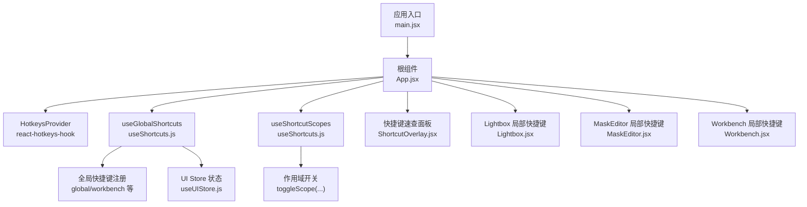
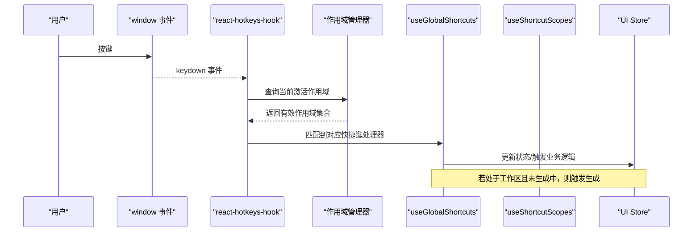
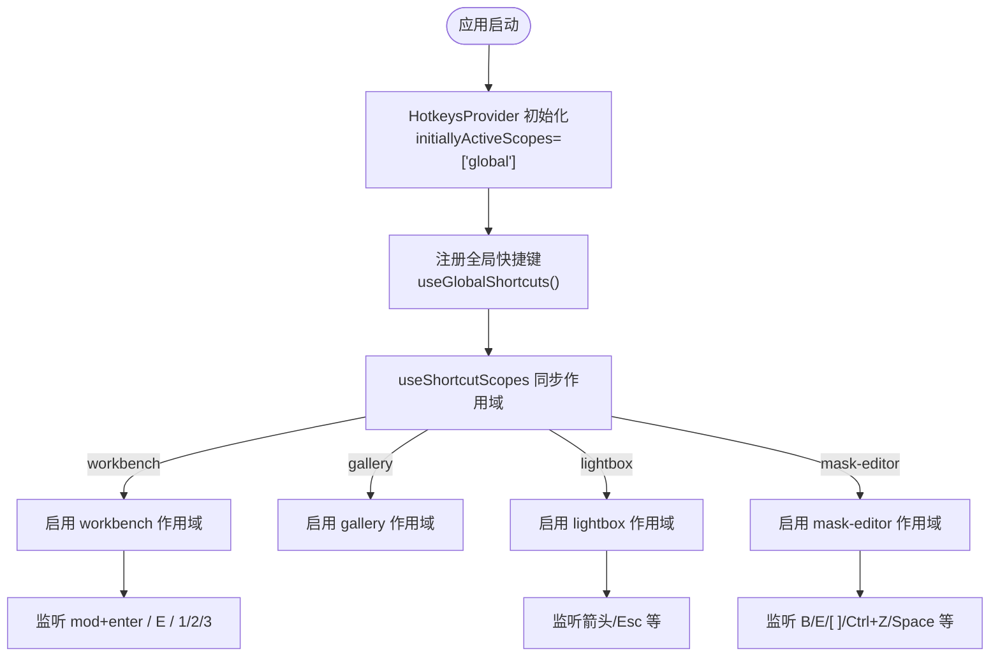
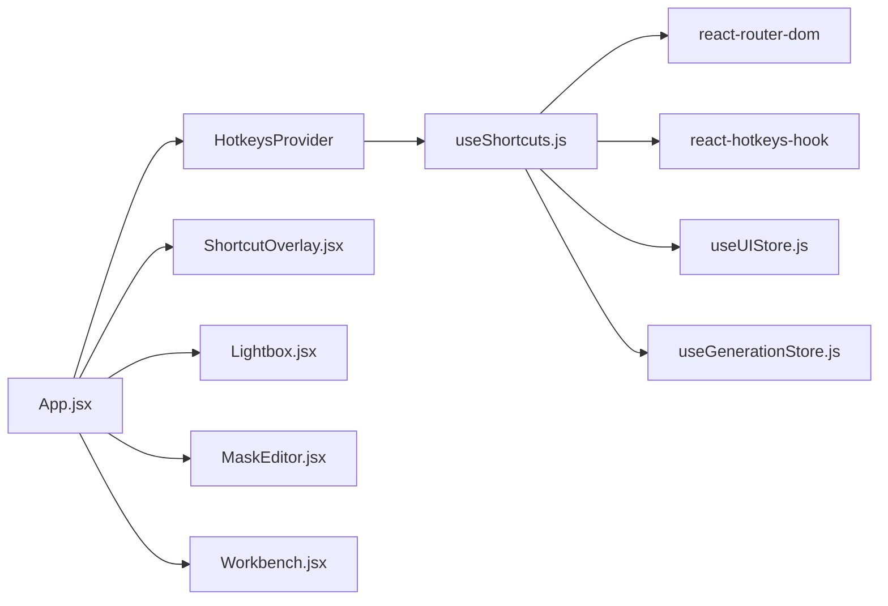

# 快捷键系统扩展

<cite>
**本文引用的文件**   
- [app/src/hooks/useShortcuts.js](file://app/src/hooks/useShortcuts.js)
- [app/src/components/ShortcutOverlay.jsx](file://app/src/components/ShortcutOverlay.jsx)
- [app/src/App.jsx](file://app/src/App.jsx)
- [app/src/main.jsx](file://app/src/main.jsx)
- [app/src/components/Lightbox.jsx](file://app/src/components/Lightbox.jsx)
- [app/src/components/MaskEditor.jsx](file://app/src/components/MaskEditor.jsx)
- [app/src/pages/Workbench.jsx](file://app/src/pages/Workbench.jsx)
- [app/src/stores/useUIStore.js](file://app/src/stores/useUIStore.js)
</cite>

## 目录
1. [简介](#简介)
2. [项目结构](#项目结构)
3. [核心组件](#核心组件)
4. [架构总览](#架构总览)
5. [详细组件分析](#详细组件分析)
6. [依赖关系分析](#依赖关系分析)
7. [性能与兼容性](#性能与兼容性)
8. [故障排查指南](#故障排查指南)
9. [结论](#结论)
10. [附录：扩展步骤与示例路径](#附录扩展步骤与示例路径)

## 简介
本指南面向需要在 AI Image Studio 中扩展快捷键系统的开发者。文档基于 useShortcuts Hook 的实现机制，详细说明如何添加自定义键盘快捷键、注册流程、事件监听机制、冲突检测与优先级管理；并给出快捷键组合定义格式、修饰键支持、平台兼容处理、提示系统集成、用户自定义配置思路以及调试技巧与常见问题解决方案。

## 项目结构
快捷键系统围绕以下关键文件组织：
- 全局快捷方式与范围控制：hooks/useShortcuts.js
- 应用入口与 HotkeysProvider 初始化：App.jsx
- 快捷键速查面板：components/ShortcutOverlay.jsx
- 页面级局部快捷键（如 Lightbox、MaskEditor、Workbench）：对应组件文件
- UI 状态集中管理：stores/useUIStore.js

图表来源
- [app/src/main.jsx:1-32](file://app/src/main.jsx#L1-L32)
- [app/src/App.jsx:353-364](file://app/src/App.jsx#L353-L364)
- [app/src/hooks/useShortcuts.js:1-134](file://app/src/hooks/useShortcuts.js#L1-L134)
- [app/src/components/ShortcutOverlay.jsx:1-136](file://app/src/components/ShortcutOverlay.jsx#L1-L136)
- [app/src/components/Lightbox.jsx:167-180](file://app/src/components/Lightbox.jsx#L167-L180)
- [app/src/components/MaskEditor.jsx:397-429](file://app/src/components/MaskEditor.jsx#L397-L429)
- [app/src/pages/Workbench.jsx:431-441](file://app/src/pages/Workbench.jsx#L431-L441)
- [app/src/stores/useUIStore.js:12-159](file://app/src/stores/useUIStore.js#L12-L159)

章节来源
- [app/src/main.jsx:1-32](file://app/src/main.jsx#L1-L32)
- [app/src/App.jsx:353-364](file://app/src/App.jsx#L353-L364)
- [app/src/hooks/useShortcuts.js:1-134](file://app/src/hooks/useShortcuts.js#L1-L134)
- [app/src/components/ShortcutOverlay.jsx:1-136](file://app/src/components/ShortcutOverlay.jsx#L1-L136)
- [app/src/stores/useUIStore.js:12-159](file://app/src/stores/useUIStore.js#L12-L159)

## 核心组件
- useGlobalShortcuts：集中注册全局与工作区快捷键，读取路由与 UI 状态，调用 store 方法执行动作。
- useShortcutScopes：根据当前页面与 UI 状态动态启用/禁用不同作用域，实现优先级控制。
- SHORTCUT_GROUPS：用于“快捷键速查”面板的静态描述数据。
- App.jsx：提供 HotkeysProvider 初始作用域，并在 AppInner 中调用上述两个 Hook。
- ShortcutOverlay：展示所有快捷键分组与说明。
- Lightbox/MaskEditor/Workbench：各自在组件内通过原生 keydown 监听或 Hook 实现局部快捷键。

章节来源
- [app/src/hooks/useShortcuts.js:22-134](file://app/src/hooks/useShortcuts.js#L22-L134)
- [app/src/App.jsx:245-271](file://app/src/App.jsx#L245-L271)
- [app/src/components/ShortcutOverlay.jsx:1-136](file://app/src/components/ShortcutOverlay.jsx#L1-L136)

## 架构总览
快捷键系统采用“全局 + 作用域 + 局部”三层模型：
- 全局层：始终可用，负责导航、打开/关闭覆盖层等。
- 作用域层：根据页面与 UI 状态动态启用，例如 workbench/gallery/lightbox/mask-editor。
- 局部层：特定组件内部直接监听 window 事件，拥有最高优先级（如 MaskEditor）。

图表来源
- [app/src/hooks/useShortcuts.js:22-134](file://app/src/hooks/useShortcuts.js#L22-L134)
- [app/src/App.jsx:353-364](file://app/src/App.jsx#L353-L364)
- [app/src/stores/useUIStore.js:12-159](file://app/src/stores/useUIStore.js#L12-L159)

## 详细组件分析

### 全局与作用域管理（useShortcuts）
- 作用域优先级（从高到低）：mask-editor > lightbox > workbench > gallery > global
- 使用 react-hotkeys-hook 的 scopes 参数进行隔离，配合 toggleScope 动态切换
- 全局快捷键包括：
  - 打开/关闭快捷键速查面板
  - Esc 关闭覆盖层或 Lightbox
  - 序列导航：G+W/G+G/G+K/G+T
- 工作区快捷键：
  - mod+enter 触发生成（防重复）
  - E 扩写提示词
  - 1/2/3 快速切换模型

图表来源
- [app/src/App.jsx:353-364](file://app/src/App.jsx#L353-L364)
- [app/src/hooks/useShortcuts.js:116-134](file://app/src/hooks/useShortcuts.js#L116-L134)
- [app/src/hooks/useShortcuts.js:22-110](file://app/src/hooks/useShortcuts.js#L22-L110)

章节来源
- [app/src/hooks/useShortcuts.js:1-134](file://app/src/hooks/useShortcuts.js#L1-L134)
- [app/src/App.jsx:245-271](file://app/src/App.jsx#L245-L271)

### 快捷键速查面板（ShortcutOverlay）
- 数据来源：SHORTCUT_GROUPS（位于 useShortcuts.js）
- 交互：点击外部区域或按 Esc 关闭
- 展示：按分组渲染快捷键键位与说明

章节来源
- [app/src/components/ShortcutOverlay.jsx:1-136](file://app/src/components/ShortcutOverlay.jsx#L1-L136)
- [app/src/hooks/useShortcuts.js:139-184](file://app/src/hooks/useShortcuts.js#L139-L184)

### Lightbox 局部快捷键
- 使用 window.addEventListener('keydown') 直接监听
- 支持：Esc 关闭、左右箭头切换图片

章节来源
- [app/src/components/Lightbox.jsx:167-180](file://app/src/components/Lightbox.jsx#L167-L180)

### MaskEditor 局部快捷键
- 使用 window.addEventListener('keydown'/'keyup') 直接监听
- 支持：空格对比原图、Ctrl+Z 撤销、Ctrl+Shift+Z 重做
- 工具切换与笔刷大小调整由按钮和标题提示引导（B/E/[ ]）

章节来源
- [app/src/components/MaskEditor.jsx:397-429](file://app/src/components/MaskEditor.jsx#L397-L429)

### Workbench 局部快捷键
- 使用 window.addEventListener('keydown') 直接监听
- 支持：mod+Enter 触发生成（当可生成且未正在生成时）

章节来源
- [app/src/pages/Workbench.jsx:431-441](file://app/src/pages/Workbench.jsx#L431-L441)

## 依赖关系分析
- App.jsx 包裹 HotkeysProvider，为子树提供作用域能力
- useGlobalShortcuts 依赖：
  - react-router-dom（useNavigate、useLocation）
  - react-hotkeys-hook（useHotkeys、useHotkeysContext）
  - Zustand stores（useUIStore、useGenerationStore）
- useShortcutScopes 依赖：
  - useHotkeysContext.toggleScope
  - UI 状态（lightboxOpen、maskEditorOpen、路由判断）

图表来源
- [app/src/App.jsx:353-364](file://app/src/App.jsx#L353-L364)
- [app/src/hooks/useShortcuts.js:13-17](file://app/src/hooks/useShortcuts.js#L13-L17)
- [app/src/stores/useUIStore.js:12-159](file://app/src/stores/useUIStore.js#L12-L159)

章节来源
- [app/src/App.jsx:353-364](file://app/src/App.jsx#L353-L364)
- [app/src/hooks/useShortcuts.js:13-17](file://app/src/hooks/useShortcuts.js#L13-L17)

## 性能与兼容性
- 作用域切换仅在状态变化时触发，避免频繁重建监听器
- 局部组件使用原生事件监听，减少框架层开销，适合高频操作（如遮罩编辑）
- 修饰键：
  - mod 表示跨平台的 Command/Ctrl
  - shift、ctrl、alt 可直接组合
- 平台差异：
  - 输入框聚焦时，部分浏览器会拦截默认行为，必要时在处理器中显式 preventDefault
  - 某些功能需区分 metaKey/ctrlKey（如 Workbench 中的本地监听）

[本节为通用指导，不直接分析具体文件]

## 故障排查指南
- 快捷键无效
  - 检查当前作用域是否被正确启用（useShortcutScopes）
  - 确认是否在输入框中导致默认行为未被阻止
  - 查看是否有更高优先级的局部监听已消费事件
- 冲突与优先级
  - 高优先级作用域（mask-editor）会屏蔽低优先级（workbench/gallery/global）
  - 如需在同一场景下共存，请拆分作用域或使用条件分支
- 调试技巧
  - 在 useGlobalShortcuts 的处理器中增加日志输出
  - 打开“快捷键速查”面板核对键位是否与预期一致
  - 临时禁用某个作用域以定位问题

章节来源
- [app/src/hooks/useShortcuts.js:116-134](file://app/src/hooks/useShortcuts.js#L116-L134)
- [app/src/components/ShortcutOverlay.jsx:1-136](file://app/src/components/ShortcutOverlay.jsx#L1-L136)

## 结论
本系统通过“全局 + 作用域 + 局部”的分层设计，实现了清晰、可扩展的快捷键体系。新增快捷键时，建议优先使用 useShortcuts 提供的 Hook 与作用域机制，保持统一的行为与体验；对于需要精细控制的场景，可在组件内使用原生事件监听。

[本节为总结性内容，不直接分析具体文件]

## 附录：扩展步骤与示例路径

### 添加自定义快捷键的步骤
1. 确定作用域
   - 全局：适用于全站（如打开帮助面板）
   - 工作区：仅在工作台生效
   - 其他作用域：gallery、lightbox、mask-editor
2. 在 useGlobalShortcuts 中注册
   - 使用 useHotkeys 绑定键位与回调
   - 指定 scopes 数组，确保只在目标作用域生效
3. 更新作用域开关
   - 在 useShortcutScopes 中根据 UI 状态启用/禁用相应作用域
4. 更新快捷键速查面板
   - 在 SHORTCUT_GROUPS 中添加新条目，便于用户查阅
5. 测试与调试
   - 在不同页面与 UI 状态下验证
   - 注意输入框焦点与默认行为

章节来源
- [app/src/hooks/useShortcuts.js:22-134](file://app/src/hooks/useShortcuts.js#L22-L134)
- [app/src/hooks/useShortcuts.js:139-184](file://app/src/hooks/useShortcuts.js#L139-L184)

### 快捷键组合定义格式与修饰键
- 基本键名：字母、数字、方向键、Enter、Escape 等
- 修饰键：shift、ctrl、alt、meta（自动映射为 mod）
- 组合键：用 + 连接，如 shift+/、mod+enter
- 序列键：用 > 连接，如 g>w、g>g、g>k、g>t
- 平台兼容：
  - mod 自动适配 Mac 的 Command 与 Windows/Linux 的 Ctrl
  - 特殊情况下可在组件内自行判断 metaKey/ctrlKey

章节来源
- [app/src/hooks/useShortcuts.js:52-72](file://app/src/hooks/useShortcuts.js#L52-L72)
- [app/src/hooks/useShortcuts.js:77-92](file://app/src/hooks/useShortcuts.js#L77-L92)

### 在不同页面组件中绑定快捷键的参考路径
- 全局与工作区快捷键注册：[app/src/hooks/useShortcuts.js:22-110](file://app/src/hooks/useShortcuts.js#L22-L110)
- 作用域动态开关：[app/src/hooks/useShortcuts.js:116-134](file://app/src/hooks/useShortcuts.js#L116-L134)
- 全局提供商初始化：[app/src/App.jsx:353-364](file://app/src/App.jsx#L353-L364)
- Lightbox 局部快捷键：[app/src/components/Lightbox.jsx:167-180](file://app/src/components/Lightbox.jsx#L167-L180)
- MaskEditor 局部快捷键：[app/src/components/MaskEditor.jsx:397-429](file://app/src/components/MaskEditor.jsx#L397-L429)
- Workbench 局部快捷键：[app/src/pages/Workbench.jsx:431-441](file://app/src/pages/Workbench.jsx#L431-L441)

### 快捷键提示系统集成
- 数据来源：SHORTCUT_GROUPS
- 显示组件：ShortcutOverlay
- 触发方式：全局 shift+/ 打开，Esc 关闭

章节来源
- [app/src/hooks/useShortcuts.js:139-184](file://app/src/hooks/useShortcuts.js#L139-L184)
- [app/src/components/ShortcutOverlay.jsx:1-136](file://app/src/components/ShortcutOverlay.jsx#L1-L136)

### 用户自定义配置（建议方案）
- 将 SHORTCUT_GROUPS 与 useGlobalShortcuts 中的键位映射抽取至配置文件或设置项
- 在 Settings 页面提供可视化编辑器，持久化到 IndexedDB 或后端
- 运行时加载配置，动态注册/替换快捷键
- 注意：
  - 冲突检测：解析后校验重复键位
  - 作用域约束：限制用户可修改的范围
  - 回退策略：配置无效时使用默认值

[本节为概念性建议，不直接分析具体文件]

### 调试技巧与常见问题
- 打印事件对象：在处理器中输出 e.key/e.code/modifiers
- 临时禁用作用域：在 useShortcutScopes 中强制关闭某作用域以定位
- 防止默认行为：对输入框场景在处理器中调用 preventDefault
- 常见错误：
  - 忘记在 App.jsx 中包裹 HotkeysProvider
  - 未在 useShortcutScopes 中启用对应作用域
  - 局部监听与全局监听同时存在导致冲突

章节来源
- [app/src/App.jsx:353-364](file://app/src/App.jsx#L353-L364)
- [app/src/hooks/useShortcuts.js:116-134](file://app/src/hooks/useShortcuts.js#L116-L134)