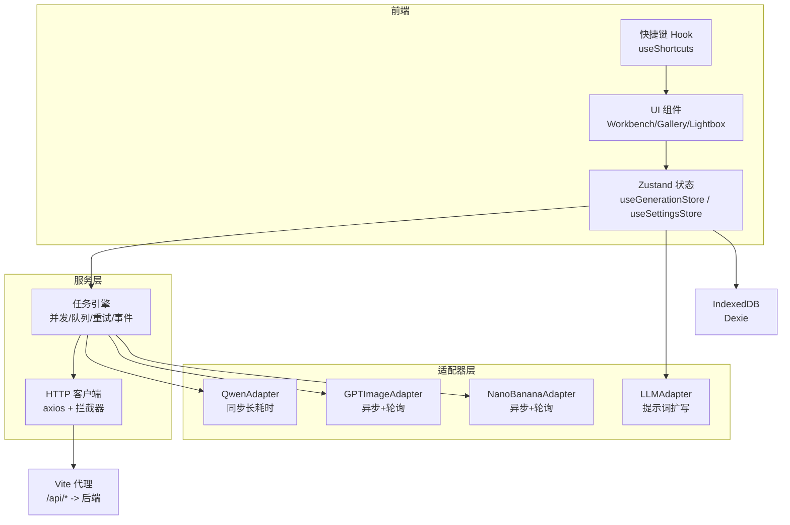
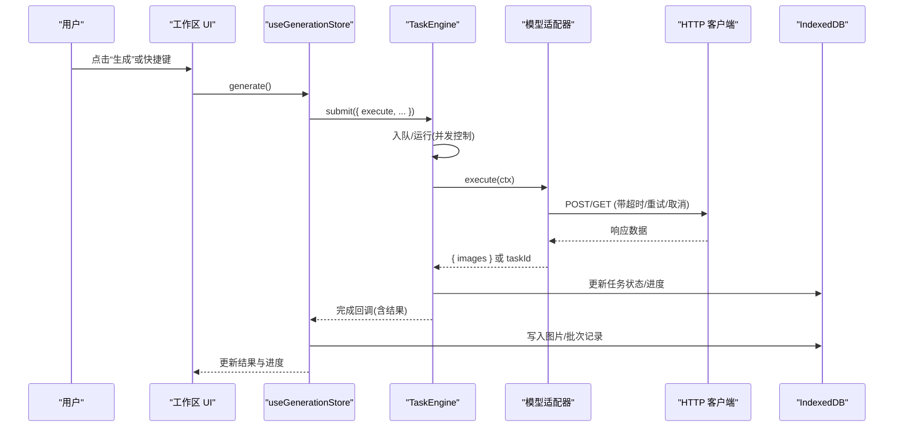
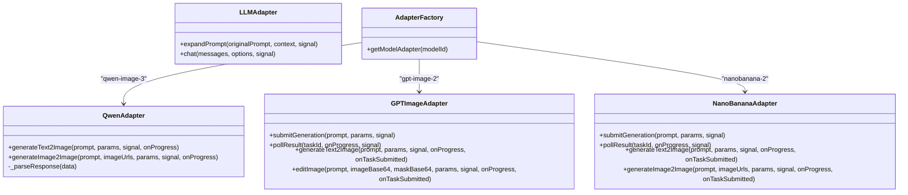
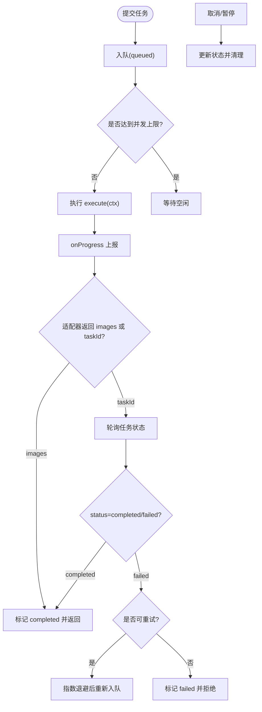
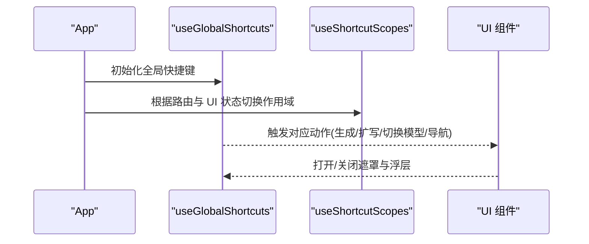
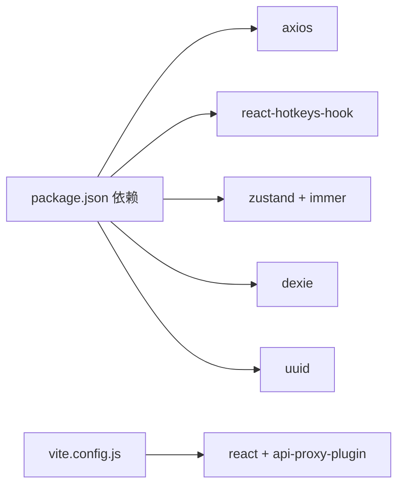

# 扩展开发

<cite>
**本文引用的文件**   
- [app/AGENTS.md](file://app/AGENTS.md)
- [app/src/services/api/index.js](file://app/src/services/api/index.js)
- [app/src/services/api/client.js](file://app/src/services/api/client.js)
- [app/src/services/api/qwen-adapter.js](file://app/src/services/api/qwen-adapter.js)
- [app/src/services/api/gpt-image-adapter.js](file://app/src/services/api/gpt-image-adapter.js)
- [app/src/services/api/nano-banana-adapter.js](file://app/src/services/api/nano-banana-adapter.js)
- [app/src/services/api/llm-adapter.js](file://app/src/services/api/llm-adapter.js)
- [app/src/constants/models.js](file://app/src/constants/models.js)
- [app/src/hooks/useShortcuts.js](file://app/src/hooks/useShortcuts.js)
- [app/src/components/ShortcutOverlay.jsx](file://app/src/components/ShortcutOverlay.jsx)
- [app/src/stores/useGenerationStore.js](file://app/src/stores/useGenerationStore.js)
- [app/src/stores/useSettingsStore.js](file://app/src/stores/useSettingsStore.js)
- [app/src/services/task-engine.js](file://app/src/services/task-engine.js)
- [app/package.json](file://app/package.json)
- [app/vite.config.js](file://app/vite.config.js)
</cite>

## 目录
1. [简介](#简介)
2. [项目结构](#项目结构)
3. [核心组件](#核心组件)
4. [架构总览](#架构总览)
5. [详细组件分析](#详细组件分析)
6. [依赖分析](#依赖分析)
7. [性能考虑](#性能考虑)
8. [故障排查指南](#故障排查指南)
9. [结论](#结论)
10. [附录](#附录)

## 简介
本指南面向希望在 AI Image Studio 中新增 AI 模型支持、扩展快捷键系统与扩展应用功能的开发者。文档基于项目的插件化架构，系统阐述：
- 模型适配器的开发规范与 API 对接流程
- 任务调度与生命周期钩子（提交、进度、完成、失败、取消）
- 快捷键系统的扩展机制与配置管理
- 完整的开发示例路径、代码规范与调试技巧
- 遵循 AGENTS.md 的开发约定与最佳实践

## 项目结构
本项目采用“服务层 + 适配器 + 状态管理 + 任务引擎”的分层架构：
- 服务层：HTTP 客户端封装、统一错误处理、重试与取消
- 适配器层：各 AI 模型的差异化实现（同步/异步、轮询策略等）
- 状态层：工作区生成状态、设置与持久化
- 任务引擎：并发控制、队列、重试、事件通知与持久化
- 快捷键系统：基于作用域的集中式快捷键注册与覆盖

图表来源
- [app/src/services/api/client.js:1-146](file://app/src/services/api/client.js#L1-L146)
- [app/src/services/task-engine.js:1-319](file://app/src/services/task-engine.js#L1-L319)
- [app/src/services/api/qwen-adapter.js:1-209](file://app/src/services/api/qwen-adapter.js#L1-L209)
- [app/src/services/api/gpt-image-adapter.js:1-336](file://app/src/services/api/gpt-image-adapter.js#L1-L336)
- [app/src/services/api/nano-banana-adapter.js:1-265](file://app/src/services/api/nano-banana-adapter.js#L1-L265)
- [app/src/services/api/llm-adapter.js:1-150](file://app/src/services/api/llm-adapter.js#L1-L150)
- [app/src/stores/useGenerationStore.js:1-360](file://app/src/stores/useGenerationStore.js#L1-L360)
- [app/src/hooks/useShortcuts.js:1-185](file://app/src/hooks/useShortcuts.js#L1-L185)

章节来源
- [app/AGENTS.md:1-45](file://app/AGENTS.md#L1-L45)
- [app/package.json:1-30](file://app/package.json#L1-L30)
- [app/vite.config.js:1-13](file://app/vite.config.js#L1-L13)

## 核心组件
- HTTP 客户端与重试/取消
  - 提供统一的 axios 实例、请求/响应拦截器、指数退避重试、AbortController 支持、长耗时专用客户端。
- 模型适配器工厂
  - 通过 modelId 动态返回具体适配器实例；新增模型需在此处注册。
- 任务引擎
  - 单例任务调度器，负责并发限制、FIFO 队列、状态机、重试、事件、进度上报与 IndexedDB 持久化。
- 生成状态管理
  - 维护当前模型、参数、参考图、结果、批次历史、生成标志与错误信息；驱动任务引擎执行并落库。
- 快捷键系统
  - 基于作用域（全局/工作台/图库/Lightbox/Mask 编辑器）的优先级覆盖；提供快捷键面板展示与切换。
- 设置与配置
  - 模型开关、默认参数、存储策略、扩写配置、通用设置；启动加载与变更持久化。

章节来源
- [app/src/services/api/client.js:1-146](file://app/src/services/api/client.js#L1-L146)
- [app/src/services/api/index.js:1-39](file://app/src/services/api/index.js#L1-L39)
- [app/src/services/task-engine.js:1-319](file://app/src/services/task-engine.js#L1-L319)
- [app/src/stores/useGenerationStore.js:1-360](file://app/src/stores/useGenerationStore.js#L1-L360)
- [app/src/hooks/useShortcuts.js:1-185](file://app/src/hooks/useShortcuts.js#L1-L185)
- [app/src/stores/useSettingsStore.js:1-162](file://app/src/stores/useSettingsStore.js#L1-L162)

## 架构总览
下图展示了从用户触发到模型调用、任务调度、结果落库与 UI 更新的完整链路。

图表来源
- [app/src/stores/useGenerationStore.js:112-290](file://app/src/stores/useGenerationStore.js#L112-L290)
- [app/src/services/task-engine.js:57-297](file://app/src/services/task-engine.js#L57-L297)
- [app/src/services/api/client.js:1-146](file://app/src/services/api/client.js#L1-L146)
- [app/src/services/api/qwen-adapter.js:60-105](file://app/src/services/api/qwen-adapter.js#L60-L105)
- [app/src/services/api/gpt-image-adapter.js:164-272](file://app/src/services/api/gpt-image-adapter.js#L164-L272)
- [app/src/services/api/nano-banana-adapter.js:129-217](file://app/src/services/api/nano-banana-adapter.js#L129-L217)

## 详细组件分析

### 模型适配器开发规范与接入流程
- 适配器职责
  - 将上层统一参数映射为下游 API 所需格式
  - 处理同步/异步差异（如轮询、进度回调）
  - 解析响应并归一化为 { images: [{ url }] }
- 接口约定
  - 文本生成：generateText2Image(prompt, params, signal?, onProgress?, onTaskSubmitted?)
  - 图像编辑：generateImage2Image(prompt, imageUrls, params, signal?, onProgress?, onTaskSubmitted?)
  - 可选：submitGeneration/pollResult/editImage 等内部方法
- 错误与取消
  - 使用 AbortSignal 支持取消
  - 对网络/服务端错误进行规范化抛出
- 注册与发现
  - 在适配器工厂中按 modelId 返回实例
  - 在模型常量中声明能力集、尺寸、质量档位、默认参数
- 日志与可观测性
  - 关键节点输出结构化日志（请求体、响应键、状态码等），便于定位问题

图表来源
- [app/src/services/api/qwen-adapter.js:51-207](file://app/src/services/api/qwen-adapter.js#L51-L207)
- [app/src/services/api/gpt-image-adapter.js:156-335](file://app/src/services/api/gpt-image-adapter.js#L156-L335)
- [app/src/services/api/nano-banana-adapter.js:125-264](file://app/src/services/api/nano-banana-adapter.js#L125-L264)
- [app/src/services/api/llm-adapter.js:23-149](file://app/src/services/api/llm-adapter.js#L23-L149)
- [app/src/services/api/index.js:20-31](file://app/src/services/api/index.js#L20-L31)

章节来源
- [app/src/services/api/index.js:1-39](file://app/src/services/api/index.js#L1-L39)
- [app/src/constants/models.js:1-106](file://app/src/constants/models.js#L1-L106)
- [app/src/services/api/qwen-adapter.js:1-209](file://app/src/services/api/qwen-adapter.js#L1-L209)
- [app/src/services/api/gpt-image-adapter.js:1-336](file://app/src/services/api/gpt-image-adapter.js#L1-L336)
- [app/src/services/api/nano-banana-adapter.js:1-265](file://app/src/services/api/nano-banana-adapter.js#L1-L265)
- [app/src/services/api/llm-adapter.js:1-150](file://app/src/services/api/llm-adapter.js#L1-L150)

#### 新增模型接入步骤（实操清单）
- 定义模型常量
  - 在模型常量文件中新增条目，包含 id、名称、提供方、能力集、尺寸/质量、默认参数等。
- 编写适配器
  - 新建适配器类，实现 generateText2Image 与/或 generateImage2Image
  - 若为异步任务，实现 submitGeneration 与 pollResult，并在组合方法中暴露 onTaskSubmitted 回调
  - 使用 HTTP 客户端发起请求，处理重试与取消
  - 将响应归一化为 { images: [{ url }] }
- 注册适配器
  - 在适配器工厂中增加 case 分支，返回新适配器实例
- 绑定快捷键（可选）
  - 在工作台作用域中添加数字键切换新模型
- 测试与验证
  - 使用 ApiTest 页面或控制台快速验证
  - 观察任务引擎事件与 IndexedDB 记录

章节来源
- [app/src/constants/models.js:8-92](file://app/src/constants/models.js#L8-L92)
- [app/src/services/api/index.js:20-31](file://app/src/services/api/index.js#L20-L31)
- [app/src/hooks/useShortcuts.js:89-92](file://app/src/hooks/useShortcuts.js#L89-L92)

### 任务引擎与生命周期钩子
- 生命周期状态机
  - queued → running → completed/failed/cancelled
  - failed → queued（自动重试）
  - paused ↔ queued（暂停/恢复）
- 事件总线
  - task:queued / task:started / task:progress / task:completed / task:failed / task:cancelled / task:retry / task:paused
- 上下文注入
  - ctx.signal：用于取消
  - ctx.onProgress(percent)：上报进度并持久化
  - ctx.taskId：任务标识
- 重试策略
  - 指数退避，最大重试次数由错误类型判定
- 集成点
  - useGenerationStore 在适配器返回 taskId 时立即落库 pending 记录，完成后更新为 completed

图表来源
- [app/src/services/task-engine.js:18-31](file://app/src/services/task-engine.js#L18-L31)
- [app/src/services/task-engine.js:222-297](file://app/src/services/task-engine.js#L222-L297)
- [app/src/stores/useGenerationStore.js:141-161](file://app/src/stores/useGenerationStore.js#L141-L161)

章节来源
- [app/src/services/task-engine.js:1-319](file://app/src/services/task-engine.js#L1-L319)
- [app/src/stores/useGenerationStore.js:112-290](file://app/src/stores/useGenerationStore.js#L112-L290)

### 快捷键系统扩展机制
- 作用域优先级
  - Mask 编辑器 > Lightbox > 工作台 > 图库 > 全局
- 注册方式
  - 使用 Hook 注册快捷键，指定 scopes 与作用域开关
- 扩展建议
  - 新增全局导航：在 global 作用域添加组合键
  - 新增工作台操作：在 workbench 作用域添加快捷键
  - 在快捷键面板 SHORTCUT_GROUPS 中补充说明
- 显示与交互
  - 通过 ShortcutOverlay 展示分组与按键组合

图表来源
- [app/src/hooks/useShortcuts.js:22-134](file://app/src/hooks/useShortcuts.js#L22-L134)
- [app/src/components/ShortcutOverlay.jsx:1-137](file://app/src/components/ShortcutOverlay.jsx#L1-L137)

章节来源
- [app/src/hooks/useShortcuts.js:1-185](file://app/src/hooks/useShortcuts.js#L1-L185)
- [app/src/components/ShortcutOverlay.jsx:1-137](file://app/src/components/ShortcutOverlay.jsx#L1-L137)

### 配置管理与生命周期钩子
- 配置项
  - 模型配置：启用开关、默认参数
  - 存储配置：热/冷存储、缩略图尺寸、OSS 桶/区域
  - 扩写配置：LLM 模型、变体数量、温度
  - 通用配置：主题、语言、自动保存、并发任务数
- 生命周期
  - 启动加载：从 IndexedDB 读取并合并默认值
  - 变更持久化：任意修改后自动保存
  - 重置：一键恢复默认配置
- 与生成的联动
  - setModel 会按模型常量重置参数与清空中间态

章节来源
- [app/src/stores/useSettingsStore.js:1-162](file://app/src/stores/useSettingsStore.js#L1-L162)
- [app/src/stores/useGenerationStore.js:38-52](file://app/src/stores/useGenerationStore.js#L38-L52)
- [app/src/constants/models.js:8-92](file://app/src/constants/models.js#L8-L92)

### 开发示例与最佳实践
- 示例路径
  - 新增模型：参考现有适配器与工厂注册位置
  - 扩写提示词：参考 LLM 适配器与 store 中的 expandPrompt
  - 自定义快捷键：参考 useShortcuts 中的全局与工作区快捷键
- 代码规范
  - 统一错误对象结构，避免吞异常
  - 所有外部 I/O 均支持 AbortSignal
  - 对外暴露最小必要接口，内部方法以私有前缀区分
  - 关键路径输出结构化日志，便于追踪
- 调试技巧
  - 使用浏览器控制台查看适配器日志（请求体、响应键、状态）
  - 通过任务引擎事件监听任务状态变化
  - 检查 IndexedDB 中任务与图片记录的状态流转

章节来源
- [app/src/services/api/llm-adapter.js:35-61](file://app/src/services/api/llm-adapter.js#L35-L61)
- [app/src/stores/useGenerationStore.js:295-308](file://app/src/stores/useGenerationStore.js#L295-L308)
- [app/src/hooks/useShortcuts.js:49-92](file://app/src/hooks/useShortcuts.js#L49-L92)

## 依赖分析
- 运行时依赖
  - axios：HTTP 请求与拦截器
  - react-hotkeys-hook：作用域快捷键
  - zustand + immer：状态管理与不可变更新
  - dexie：IndexedDB 封装
  - uuid：唯一 ID 生成
- 构建与代理
  - Vite + React 插件
  - 自定义代理插件转发 /api/* 到后端

图表来源
- [app/package.json:11-28](file://app/package.json#L11-L28)
- [app/vite.config.js:1-13](file://app/vite.config.js#L1-L13)

章节来源
- [app/package.json:1-30](file://app/package.json#L1-L30)
- [app/vite.config.js:1-13](file://app/vite.config.js#L1-L13)

## 性能考虑
- 并发与队列
  - 合理设置最大并发数，避免阻塞 UI 与后端
- 重试与退避
  - 针对网络抖动与 5xx 错误自动重试，降低瞬时失败影响
- 长耗时任务
  - 使用独立长超时客户端，避免误判超时
- 进度反馈
  - 轮询任务时按时间估算进度，提升用户体验
- 资源清理
  - 及时取消未完成的请求，释放内存与带宽

[本节为通用指导，不直接分析具体文件]

## 故障排查指南
- 常见问题定位
  - 适配器日志：查看请求 URL、Body、响应键与状态
  - 任务状态：检查 IndexedDB 中任务 status、progress、error
  - 事件监听：订阅 task:* 事件，确认状态流转是否符合预期
- 典型错误
  - 未知模型适配器：检查工厂注册与 modelId 匹配
  - 轮询超时：检查任务查询端点与服务器返回字段
  - 响应解析失败：核对不同上游返回结构的兼容逻辑
- 辅助工具
  - 使用 ApiTest 页面进行端到端验证
  - 使用快捷键面板确认作用域是否正确激活

章节来源
- [app/src/services/api/qwen-adapter.js:90-104](file://app/src/services/api/qwen-adapter.js#L90-L104)
- [app/src/services/api/gpt-image-adapter.js:115-154](file://app/src/services/api/gpt-image-adapter.js#L115-L154)
- [app/src/services/api/nano-banana-adapter.js:82-114](file://app/src/services/api/nano-banana-adapter.js#L82-L114)
- [app/src/services/task-engine.js:259-297](file://app/src/services/task-engine.js#L259-L297)

## 结论
通过统一的适配器抽象、健壮的任务引擎与可扩展的快捷键系统，AI Image Studio 提供了良好的插件化基础。按照本文规范新增模型与功能，可在保持架构一致性的同时快速交付。建议在迭代过程中持续完善日志与事件观测，确保问题可追溯、体验可感知。

[本节为总结，不直接分析具体文件]

## 附录
- 开发约定
  - 优先编辑源码而非生成产物
  - 保持布局意图与交互流不变，除非明确要求重构
  - 变更后运行可用命令并报告风险
- 常用脚本与环境
  - 开发：npm run dev
  - 构建：npm run build
  - 预览：npm run preview

章节来源
- [app/AGENTS.md:18-44](file://app/AGENTS.md#L18-L44)
- [app/package.json:6-10](file://app/package.json#L6-L10)