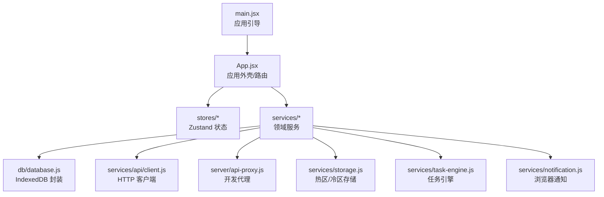
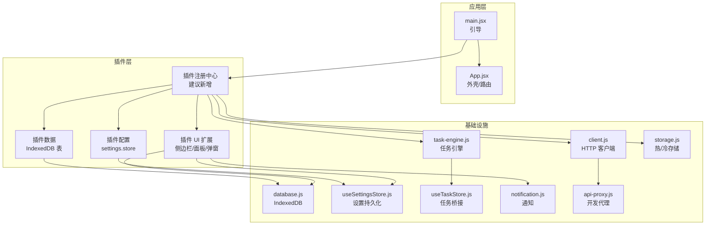
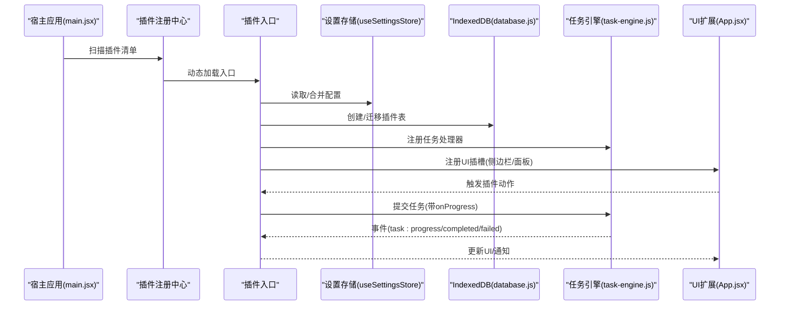
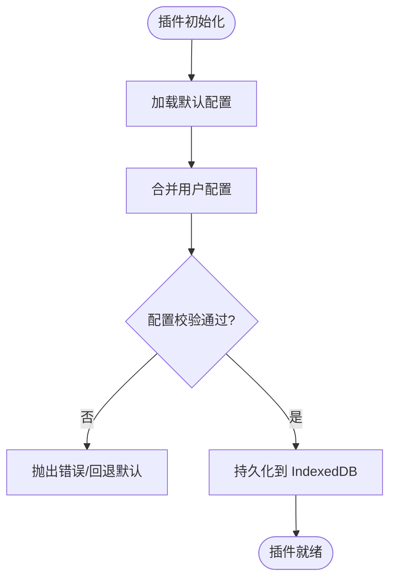
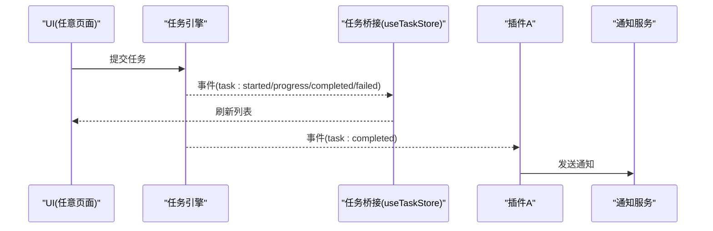
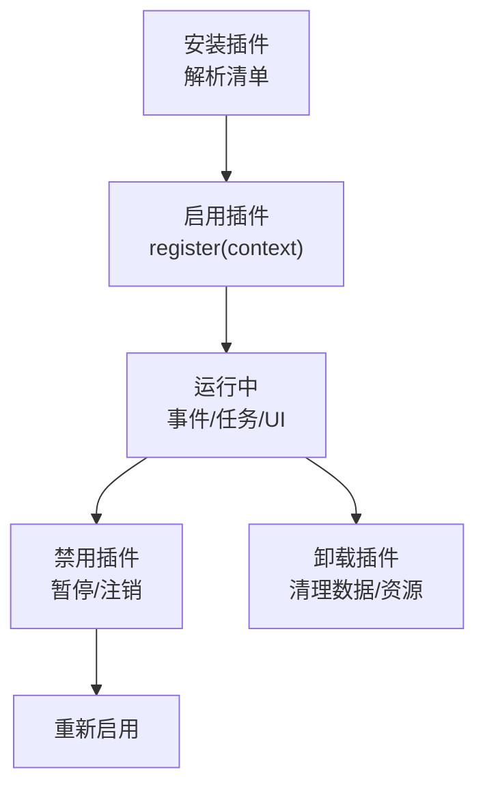
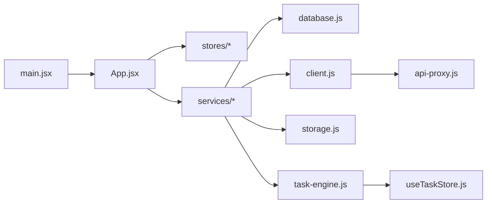

# 插件开发指南

<cite>
**本文引用的文件**   
- [main.jsx](file://app/src/main.jsx)
- [App.jsx](file://app/src/App.jsx)
- [database.js](file://app/src/db/database.js)
- [useSettingsStore.js](file://app/src/stores/useSettingsStore.js)
- [storage.js](file://app/src/services/storage.js)
- [task-engine.js](file://app/src/services/task-engine.js)
- [useTaskStore.js](file://app/src/stores/useTaskStore.js)
- [notification.js](file://app/src/services/notification.js)
- [client.js](file://app/src/services/api/client.js)
- [api-proxy.js](file://app/src/server/api-proxy.js)
- [AGENTS.md](file://app/AGENTS.md)
</cite>

## 目录
1. [简介](#简介)
2. [项目结构](#项目结构)
3. [核心组件](#核心组件)
4. [架构总览](#架构总览)
5. [详细组件分析](#详细组件分析)
6. [依赖关系分析](#依赖关系分析)
7. [性能考量](#性能考量)
8. [故障排查指南](#故障排查指南)
9. [结论](#结论)
10. [附录](#附录)

## 简介
本指南面向希望在 AI Image Studio 中扩展能力的开发者，围绕现有代码库的“可插拔”能力进行系统化说明。当前仓库已具备以下与插件化密切相关的基石：
- 应用启动与初始化流程（数据库、设置加载）
- 基于 Zustand 的状态管理与持久化
- 任务引擎的事件驱动模型与状态机
- IndexedDB 数据层与 OSS 冷存储策略
- API 客户端与代理中间件
- 通知服务与错误边界

基于这些基础，本文给出插件生命周期管理、配置系统、存储机制、接口规范、依赖注入模式、事件通信协议、目录结构与入口约定、安装启用禁用卸载流程、测试调试与发布规范的完整方案，并严格遵循 AGENTS.md 的开发约定。

## 项目结构
AI Image Studio 采用 React + Vite 前端工程，关键目录与职责如下：
- app/src/main.jsx：应用引导，打开数据库、加载设置后挂载根组件
- app/src/App.jsx：应用外壳、路由、全局 UI 与错误边界
- app/src/db/database.js：IndexedDB 表结构与 CRUD 封装
- app/src/stores/*：Zustand 状态模块（设置、任务、画廊等）
- app/src/services/*：领域服务（存储、任务引擎、通知、API 客户端）
- app/src/server/api-proxy.js：Vite 开发代理中间件，转发到外部服务
- app/AGENTS.md：开发与编辑约定

图表来源
- [main.jsx:1-32](file://app/src/main.jsx#L1-L32)
- [App.jsx:1-364](file://app/src/App.jsx#L1-L364)
- [database.js:1-339](file://app/src/db/database.js#L1-L339)
- [useSettingsStore.js:1-162](file://app/src/stores/useSettingsStore.js#L1-L162)
- [storage.js:1-315](file://app/src/services/storage.js#L1-L315)
- [task-engine.js:1-242](file://app/src/services/task-engine.js#L1-L242)
- [notification.js:1-50](file://app/src/services/notification.js#L1-L50)
- [client.js:78-145](file://app/src/services/api/client.js#L78-L145)
- [api-proxy.js:105-178](file://app/src/server/api-proxy.js#L105-L178)

章节来源
- [main.jsx:1-32](file://app/src/main.jsx#L1-L32)
- [App.jsx:1-364](file://app/src/App.jsx#L1-L364)
- [AGENTS.md:1-45](file://app/AGENTS.md#L1-L45)

## 核心组件
本节聚焦与插件体系直接相关的基础设施：
- 应用引导与初始化：在渲染前完成数据库打开与设置加载，为插件提供稳定的运行时环境
- 设置与配置系统：集中式配置对象，支持模型、存储、扩展与通用设置，持久化至 IndexedDB
- 任务引擎：事件驱动的任务调度器，提供状态机、并发控制、重试与进度回调
- 存储层：热区（IndexedDB Blob）+ 冷区（OSS）两级存储，自动迁移与统计
- API 客户端与代理：统一 HTTP 封装与开发期代理，便于插件调用后端能力
- 通知服务：跨页面提示，适合插件结果反馈

章节来源
- [main.jsx:10-31](file://app/src/main.jsx#L10-L31)
- [useSettingsStore.js:1-162](file://app/src/stores/useSettingsStore.js#L1-L162)
- [task-engine.js:1-242](file://app/src/services/task-engine.js#L1-L242)
- [storage.js:1-315](file://app/src/services/storage.js#L1-L315)
- [client.js:78-145](file://app/src/services/api/client.js#L78-L145)
- [api-proxy.js:105-178](file://app/src/server/api-proxy.js#L105-L178)
- [notification.js:1-50](file://app/src/services/notification.js#L1-L50)

## 架构总览
下图展示插件如何接入现有系统：通过“插件注册中心”在应用引导阶段注入能力；插件使用统一的 API 客户端访问后端；通过任务引擎执行异步工作；通过设置与存储读写自身数据；通过事件总线与 UI 交互。

图表来源
- [main.jsx:10-31](file://app/src/main.jsx#L10-L31)
- [App.jsx:1-364](file://app/src/App.jsx#L1-L364)
- [database.js:1-339](file://app/src/db/database.js#L1-L339)
- [useSettingsStore.js:1-162](file://app/src/stores/useSettingsStore.js#L1-L162)
- [task-engine.js:1-242](file://app/src/services/task-engine.js#L1-L242)
- [useTaskStore.js:1-173](file://app/src/stores/useTaskStore.js#L1-L173)
- [notification.js:1-50](file://app/src/services/notification.js#L1-L50)
- [client.js:78-145](file://app/src/services/api/client.js#L78-L145)
- [api-proxy.js:105-178](file://app/src/server/api-proxy.js#L105-L178)
- [storage.js:1-315](file://app/src/services/storage.js#L1-L315)

## 详细组件分析

### 插件生命周期管理
目标：定义插件从发现、加载、初始化、运行到销毁的完整生命周期，确保与宿主应用解耦且可观测。

- 发现与清单
  - 建议新增“插件清单”（JSON），包含 id、版本、名称、描述、入口、权限、依赖、配置项等元信息
  - 清单校验：类型、必填字段、版本号语义化
- 加载与沙箱
  - 动态导入插件入口模块（ESM），限制副作用执行时机
  - 隔离插件作用域，避免污染全局命名空间
- 初始化
  - 读取插件配置（合并默认值与用户设置）
  - 注册事件监听、UI 插槽、任务处理器
  - 申请必要权限（如通知、存储）
- 运行
  - 暴露受控 API（生成、查询、导出等）
  - 通过任务引擎提交后台任务，订阅进度与结果
- 销毁
  - 取消未完成任务、移除事件监听、释放资源（URL、定时器）
  - 清理插件私有数据（可选）

图表来源
- [main.jsx:10-31](file://app/src/main.jsx#L10-L31)
- [App.jsx:1-364](file://app/src/App.jsx#L1-L364)
- [useSettingsStore.js:1-162](file://app/src/stores/useSettingsStore.js#L1-L162)
- [database.js:1-339](file://app/src/db/database.js#L1-L339)
- [task-engine.js:1-242](file://app/src/services/task-engine.js#L1-L242)

章节来源
- [main.jsx:10-31](file://app/src/main.jsx#L10-L31)
- [App.jsx:1-364](file://app/src/App.jsx#L1-L364)
- [useSettingsStore.js:1-162](file://app/src/stores/useSettingsStore.js#L1-L162)
- [database.js:1-339](file://app/src/db/database.js#L1-L339)
- [task-engine.js:1-242](file://app/src/services/task-engine.js#L1-L242)

### 配置系统与存储机制
- 配置分层
  - 默认配置：由插件提供，不可被覆盖
  - 用户配置：来自 settings.store，可持久化
  - 运行时配置：根据环境变量或上下文动态计算
- 持久化策略
  - 使用 IndexedDB 的 key/value 表保存配置块
  - 变更时立即落盘，失败时降级内存态
- 插件数据
  - 建议在 database.js 中新增独立表（如 plugins_data），按 pluginId 分片
  - 提供增删改查与分页/过滤方法，避免与业务表耦合

图表来源
- [useSettingsStore.js:1-162](file://app/src/stores/useSettingsStore.js#L1-L162)
- [database.js:1-339](file://app/src/db/database.js#L1-L339)

章节来源
- [useSettingsStore.js:1-162](file://app/src/stores/useSettingsStore.js#L1-L162)
- [database.js:1-339](file://app/src/db/database.js#L1-L339)

### 插件接口规范
为保证插件与宿主稳定协作，建议定义如下契约：
- 插件清单 schema
  - id: string（唯一标识）
  - version: string（语义化版本）
  - name/title: string
  - description: string
  - entry: string（入口模块路径）
  - permissions: string[]（通知、存储、网络等）
  - dependencies: string[]（其他插件 id）
  - configSchema: object（配置项 JSON Schema）
- 插件入口函数
  - register(context): void
    - context 提供：
      - api：HTTP 客户端、代理路径
      - store：设置读写、插件数据读写
      - task：任务引擎提交与事件订阅
      - ui：注册侧边栏、面板、弹窗、菜单项
      - notify：发送通知
- 事件协议
  - 插件可订阅宿主事件（如 image:created、task:completed）
  - 插件可发布自定义事件（如 plugin:action），宿主与其余插件订阅

章节来源
- [client.js:78-145](file://app/src/services/api/client.js#L78-L145)
- [useSettingsStore.js:1-162](file://app/src/stores/useSettingsStore.js#L1-L162)
- [task-engine.js:1-242](file://app/src/services/task-engine.js#L1-L242)
- [notification.js:1-50](file://app/src/services/notification.js#L1-L50)

### 依赖注入模式
- 容器化上下文
  - 在应用引导阶段构建 context 对象，注入 api、store、task、ui、notify 等能力
  - 插件仅依赖 context，不直接耦合宿主实现
- 按需加载
  - 插件模块延迟加载，仅在需要时实例化
- 版本兼容
  - 通过清单中的 version 与最小宿主版本约束，避免破坏性升级

章节来源
- [main.jsx:10-31](file://app/src/main.jsx#L10-L31)
- [App.jsx:1-364](file://app/src/App.jsx#L1-L364)

### 事件通信协议
- 事件命名
  - 宿主事件：host:*（如 host:themeChanged）
  - 插件事件：plugin:*（如 plugin:exportCompleted）
- 事件载荷
  - 固定字段：eventId、timestamp、sourcePluginId
  - 业务字段：随事件类型定义
- 可靠性
  - 重要事件持久化（IndexedDB）并在恢复时重放
  - 去抖与限流，防止风暴

图表来源
- [task-engine.js:1-242](file://app/src/services/task-engine.js#L1-L242)
- [useTaskStore.js:1-173](file://app/src/stores/useTaskStore.js#L1-L173)
- [notification.js:1-50](file://app/src/services/notification.js#L1-L50)

章节来源
- [task-engine.js:1-242](file://app/src/services/task-engine.js#L1-L242)
- [useTaskStore.js:1-173](file://app/src/stores/useTaskStore.js#L1-L173)
- [notification.js:1-50](file://app/src/services/notification.js#L1-L50)

### 插件目录结构与入口文件
建议的插件包结构（示例）：
- package.json：插件元信息与依赖
- manifest.json：插件清单（id、version、entry、permissions、configSchema 等）
- src/index.js：插件入口，导出 register(context)
- src/config.js：默认配置与校验
- src/ui.jsx：UI 扩展（侧边栏/面板/弹窗）
- src/tasks.js：任务处理器（供任务引擎调用）
- src/data.js：插件数据读写（基于 database.js 的新表）
- assets/*：静态资源（图标、样式）

入口约定：
- 必须实现 register(context)
- 在 register 中完成：配置合并、数据表初始化、事件订阅、UI 注册、任务处理器注册

章节来源
- [database.js:1-339](file://app/src/db/database.js#L1-L339)
- [useSettingsStore.js:1-162](file://app/src/stores/useSettingsStore.js#L1-L162)
- [task-engine.js:1-242](file://app/src/services/task-engine.js#L1-L242)

### 功能增强、UI 扩展与数据集成示例
- 功能增强
  - 通过任务引擎提交长耗时任务，使用 onProgress 上报进度
  - 使用 api 客户端调用后端接口（经代理转发）
- UI 扩展
  - 在 App.jsx 的导航或主内容区域注册新路由或面板
  - 复用现有 UI 组件与主题变量，保持风格一致
- 数据集成
  - 使用 database.js 提供的表操作，或新增插件专属表
  - 将大对象以 Blob 形式存入热区，必要时迁移到冷区

章节来源
- [App.jsx:1-364](file://app/src/App.jsx#L1-L364)
- [storage.js:1-315](file://app/src/services/storage.js#L1-L315)
- [client.js:78-145](file://app/src/services/api/client.js#L78-L145)
- [database.js:1-339](file://app/src/db/database.js#L1-L339)

### 安装、启用、禁用与卸载流程
- 安装
  - 将插件包放入指定目录，解析 manifest.json 并校验
  - 写入插件注册表（IndexedDB 表）
- 启用
  - 加载插件入口，执行 register(context)
  - 初始化配置与数据表，注册事件与 UI
- 禁用
  - 暂停插件任务、移除 UI 插槽、注销事件监听
  - 保留数据以便重新启用
- 卸载
  - 停止所有任务、删除插件数据（可选）、清理资源
  - 从注册表移除

[此图为概念流程图，无需图表来源]

## 依赖关系分析
- 低耦合高内聚
  - 插件通过 context 访问能力，不直接依赖宿主内部模块
  - 各服务（存储、任务、通知、API）职责清晰
- 关键依赖链
  - main.jsx → App.jsx → stores/services → database.js
  - services/task-engine.js ↔ stores/useTaskStore.js（事件桥接）
  - services/storage.js ↔ database.js（热/冷区）
  - services/api/client.js → server/api-proxy.js（开发代理）

图表来源
- [main.jsx:1-32](file://app/src/main.jsx#L1-L32)
- [App.jsx:1-364](file://app/src/App.jsx#L1-L364)
- [database.js:1-339](file://app/src/db/database.js#L1-L339)
- [client.js:78-145](file://app/src/services/api/client.js#L78-L145)
- [api-proxy.js:105-178](file://app/src/server/api-proxy.js#L105-L178)
- [storage.js:1-315](file://app/src/services/storage.js#L1-L315)
- [task-engine.js:1-242](file://app/src/services/task-engine.js#L1-L242)
- [useTaskStore.js:1-173](file://app/src/stores/useTaskStore.js#L1-L173)

章节来源
- [main.jsx:1-32](file://app/src/main.jsx#L1-L32)
- [App.jsx:1-364](file://app/src/App.jsx#L1-L364)
- [database.js:1-339](file://app/src/db/database.js#L1-L339)
- [client.js:78-145](file://app/src/services/api/client.js#L78-L145)
- [api-proxy.js:105-178](file://app/src/server/api-proxy.js#L105-L178)
- [storage.js:1-315](file://app/src/services/storage.js#L1-L315)
- [task-engine.js:1-242](file://app/src/services/task-engine.js#L1-L242)
- [useTaskStore.js:1-173](file://app/src/stores/useTaskStore.js#L1-L173)

## 性能考量
- 任务并发与队列
  - 合理设置最大并发，避免阻塞 UI
  - 使用指数退避重试，降低瞬时失败影响
- 存储冷热分离
  - 热区（IndexedDB）用于频繁访问，冷区（OSS）用于归档
  - 定期检查热区容量并迁移旧数据
- 网络请求
  - 使用可取消的请求信号，避免无用开销
  - 对长耗时任务使用专用客户端与超时策略
- UI 渲染
  - 懒加载页面与重型组件
  - 使用事件驱动更新，减少不必要的重渲染

章节来源
- [task-engine.js:1-242](file://app/src/services/task-engine.js#L1-L242)
- [storage.js:1-315](file://app/src/services/storage.js#L1-L315)
- [client.js:78-145](file://app/src/services/api/client.js#L78-L145)
- [App.jsx:1-364](file://app/src/App.jsx#L1-L364)

## 故障排查指南
- 常见问题定位
  - 数据库初始化失败：检查 initDatabase 与 IndexedDB 权限
  - 设置加载异常：查看 loadSettings 的错误日志与默认值回退
  - 任务执行失败：检查任务状态机转换与重试策略
  - 网络代理问题：确认 api-proxy 中间件与环境变量
  - 通知未显示：确认权限与浏览器支持
- 调试技巧
  - 在关键路径添加结构化日志（含时间戳与上下文）
  - 使用浏览器开发者工具监控 IndexedDB 与网络请求
  - 对长耗时任务增加进度日志与断点
- 错误边界
  - 应用级错误边界捕获渲染异常并提供恢复入口

章节来源
- [main.jsx:10-31](file://app/src/main.jsx#L10-L31)
- [useSettingsStore.js:1-162](file://app/src/stores/useSettingsStore.js#L1-L162)
- [task-engine.js:1-242](file://app/src/services/task-engine.js#L1-L242)
- [api-proxy.js:105-178](file://app/src/server/api-proxy.js#L105-L178)
- [notification.js:1-50](file://app/src/services/notification.js#L1-L50)
- [App.jsx:26-62](file://app/src/App.jsx#L26-L62)

## 结论
通过在应用引导阶段建立插件注册中心、统一上下文注入、明确事件协议与配置/存储规范，AI Image Studio 可在不侵入核心逻辑的前提下，安全、可控地扩展功能。结合任务引擎与冷热存储，插件既能提供即时交互，也能处理大规模异步任务。遵循 AGENTS.md 的开发约定，有助于保证代码质量与团队协作效率。

## 附录
- 开发约定
  - 优先编辑源码而非生成产物
  - 保持布局意图、文案、数据与交互流程不变，除非明确要求重构
  - 使用 tokens/CSS 变量/Tailwind 类进行视觉调整
  - 修改后运行可用的类型检查/构建/测试命令并报告风险

章节来源
- [AGENTS.md:1-45](file://app/AGENTS.md#L1-L45)