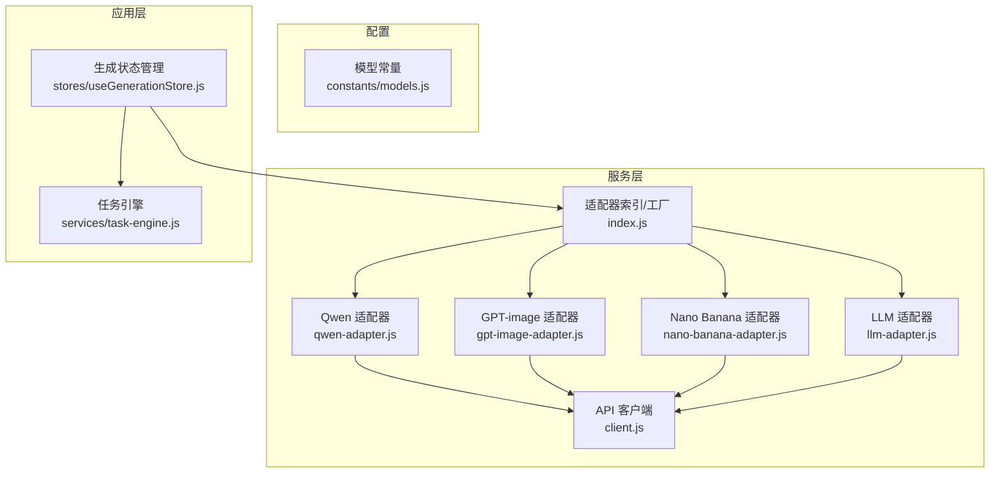
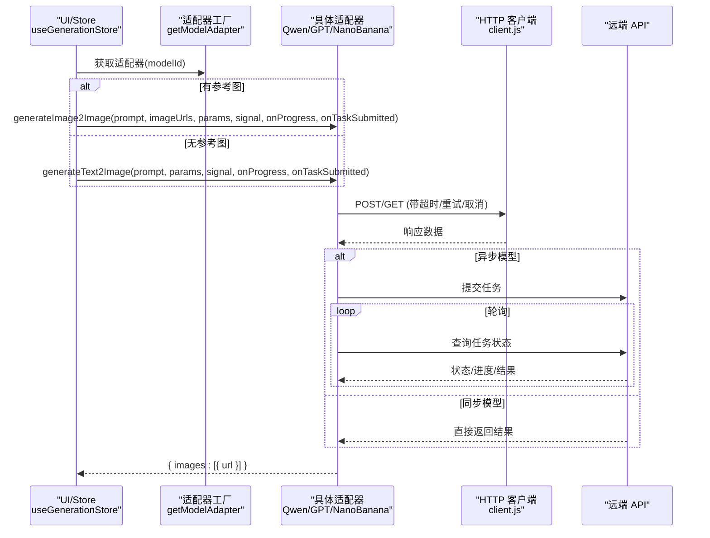
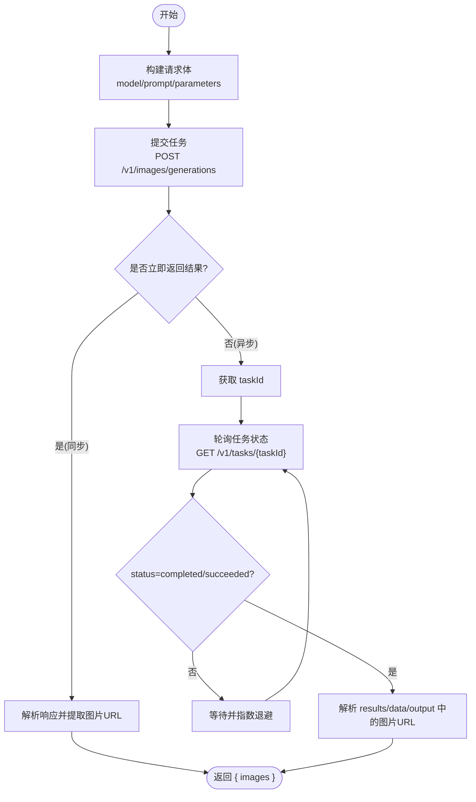
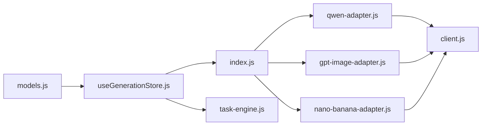

# 模型适配器开发

<cite>
**本文引用的文件**   
- [llm-adapter.js](file://app/src/services/api/llm-adapter.js)
- [gpt-image-adapter.js](file://app/src/services/api/gpt-image-adapter.js)
- [nano-banana-adapter.js](file://app/src/services/api/nano-banana-adapter.js)
- [qwen-adapter.js](file://app/src/services/api/qwen-adapter.js)
- [index.js](file://app/src/services/api/index.js)
- [client.js](file://app/src/services/api/client.js)
- [models.js](file://app/src/constants/models.js)
- [useGenerationStore.js](file://app/src/stores/useGenerationStore.js)
- [task-engine.js](file://app/src/services/task-engine.js)
</cite>

## 目录
1. [简介](#简介)
2. [项目结构](#项目结构)
3. [核心组件](#核心组件)
4. [架构总览](#架构总览)
5. [详细组件分析](#详细组件分析)
6. [依赖关系分析](#依赖关系分析)
7. [性能考虑](#性能考虑)
8. [故障排查指南](#故障排查指南)
9. [结论](#结论)
10. [附录：新增模型适配器的步骤清单](#附录新增模型适配器的步骤清单)

## 简介
本指南面向希望在 AI Image Studio 中接入新 AI 图像生成模型的开发者。文档基于现有适配器模式与工厂机制，系统阐述如何扩展新的模型支持，包括：
- 适配器接口规范与能力声明配置
- LLMAdapter 基类的作用与继承机制说明（本项目为组合式而非严格继承）
- 参数映射规则与默认参数设置
- text2image、image2image、inpainting 等功能的实现要点
- 调试技巧、错误处理策略与性能优化建议
- 命名约定与代码规范

## 项目结构
与模型适配器相关的核心目录与文件如下：
- services/api：HTTP 客户端与各模型适配器实现
- constants/models：模型能力、尺寸、质量与默认参数配置
- stores：状态管理与调用流程编排
- services/task-engine：任务调度、重试、进度上报与持久化



图表来源
- [client.js:1-146](file://app/src/services/api/client.js#L1-L146)
- [llm-adapter.js:1-150](file://app/src/services/api/llm-adapter.js#L1-L150)
- [qwen-adapter.js:1-209](file://app/src/services/api/qwen-adapter.js#L1-L209)
- [gpt-image-adapter.js:1-336](file://app/src/services/api/gpt-image-adapter.js#L1-L336)
- [nano-banana-adapter.js:1-265](file://app/src/services/api/nano-banana-adapter.js#L1-L265)
- [index.js:1-39](file://app/src/services/api/index.js#L1-L39)
- [models.js:1-106](file://app/src/constants/models.js#L1-L106)
- [useGenerationStore.js:1-360](file://app/src/stores/useGenerationStore.js#L1-L360)
- [task-engine.js:1-319](file://app/src/services/task-engine.js#L1-L319)

章节来源
- [client.js:1-146](file://app/src/services/api/client.js#L1-L146)
- [index.js:1-39](file://app/src/services/api/index.js#L1-L39)
- [models.js:1-106](file://app/src/constants/models.js#L1-L106)
- [useGenerationStore.js:1-360](file://app/src/stores/useGenerationStore.js#L1-L360)
- [task-engine.js:1-319](file://app/src/services/task-engine.js#L1-L319)

## 核心组件
- HTTP 客户端 client.js
  - 提供 apiGet/apiPost/apiPut/apiDelete 统一封装
  - 内置请求拦截器与响应拦截器，自动重试与错误归一化
  - 支持 AbortController 取消
  - 提供 longRunningClient 用于长耗时同步 API（如 Qwen）
- 适配器工厂 index.js
  - getModelAdapter(modelId) 根据模型 ID 返回具体适配器实例
  - getLLMAdapter() 返回单例 LLM 适配器
- 模型常量 models.js
  - MODELS 定义各模型的能力、尺寸、质量选项、默认参数
  - MODEL_ORDER 控制 UI 展示顺序
  - 辅助函数 getModelById/getModelsByCapability
- 任务引擎 task-engine.js
  - 并发控制、FIFO 队列、指数退避重试
  - 状态机：queued -> running -> completed/failed/cancelled/paused
  - 事件与 IndexedDB 持久化
- 生成状态 useGenerationStore.js
  - 选择模型、构建执行函数、调用适配器、结果落库与状态更新
  - 对异步任务提交时保存 pending 记录，失败时回写错误

章节来源
- [client.js:1-146](file://app/src/services/api/client.js#L1-L146)
- [index.js:1-39](file://app/src/services/api/index.js#L1-L39)
- [models.js:1-106](file://app/src/constants/models.js#L1-L106)
- [task-engine.js:1-319](file://app/src/services/task-engine.js#L1-L319)
- [useGenerationStore.js:1-360](file://app/src/stores/useGenerationStore.js#L1-L360)

## 架构总览
整体调用链从 UI 到适配器再到远端 API，关键路径如下：
- 用户触发生成 → useGenerationStore.generate()
- 通过工厂获取适配器 → getModelAdapter(modelId)
- 根据是否包含参考图决定调用 generateImage2Image 或 generateText2Image
- 适配器内部使用 client.js 发起 HTTP 请求
- 对于异步模型（EvoLink），适配器负责提交任务并轮询；对于同步模型（DashScope/Qwen），直接等待响应
- 任务引擎负责并发、重试、进度上报与持久化



图表来源
- [useGenerationStore.js:112-290](file://app/src/stores/useGenerationStore.js#L112-L290)
- [index.js:20-31](file://app/src/services/api/index.js#L20-L31)
- [qwen-adapter.js:59-173](file://app/src/services/api/qwen-adapter.js#L59-L173)
- [gpt-image-adapter.js:164-334](file://app/src/services/api/gpt-image-adapter.js#L164-L334)
- [nano-banana-adapter.js:129-263](file://app/src/services/api/nano-banana-adapter.js#L129-L263)
- [client.js:100-146](file://app/src/services/api/client.js#L100-L146)

## 详细组件分析

### 适配器接口规范与能力声明
- 适配器方法约定
  - text2image: generateText2Image(prompt, params, signal, onProgress, onTaskSubmitted?)
  - image2image: generateImage2Image(prompt, imageUrls, params, signal, onProgress, onTaskSubmitted?)
  - inpainting: 由具备 mask 支持的适配器提供（例如 GPT-image-2 的 editImage/submitImageEdit）
  - 返回值统一为 { images: Array<{ url }> }
- 能力声明与默认参数
  - 在 constants/models.js 的 MODELS 中声明 capabilities、sizes、qualities、defaultParams
  - 前端据此动态渲染可用功能与参数控件
- 工厂注册
  - 在 index.js 的 getModelAdapter 中添加新 modelId 分支，返回新适配器实例

章节来源
- [models.js:8-92](file://app/src/constants/models.js#L8-L92)
- [index.js:20-31](file://app/src/services/api/index.js#L20-L31)
- [useGenerationStore.js:133-187](file://app/src/stores/useGenerationStore.js#L133-L187)

### LLMAdapter 基类与“继承”机制说明
- 本项目未采用严格的类继承体系，而是以“组合 + 工厂”的方式组织适配器
- LLMAdapter 并非所有图像适配器的父类，它独立承担提示词扩写与通用对话能力
- 图像适配器各自实现自己的 HTTP 交互逻辑，并通过统一的返回值格式被上层消费

```mermaid
classDiagram
class LLMAdapter {
+expandPrompt(originalPrompt, context, signal) Promise~string[]~
+chat(messages, options, signal) Promise~string~
}
class QwenAdapter {
+generateText2Image(prompt, params, signal, onProgress) Promise~{images}~
+generateImage2Image(prompt, imageUrls, params, signal, onProgress) Promise~{images}~
}
class GPTImageAdapter {
+generateText2Image(prompt, params, signal, onProgress, onTaskSubmitted) Promise~{images}~
+editImage(prompt, imageBase64, maskBase64, params, signal, onProgress, onTaskSubmitted) Promise~{images}~
}
class NanoBananaAdapter {
+generateText2Image(prompt, params, signal, onProgress, onTaskSubmitted) Promise~{images}~
+generateImage2Image(prompt, imageUrls, params, signal, onProgress, onTaskSubmitted) Promise~{images}~
}
class Index {
+getModelAdapter(modelId)
+getLLMAdapter()
}
Index --> QwenAdapter : "返回实例"
Index --> GPTImageAdapter : "返回实例"
Index --> NanoBananaAdapter : "返回实例"
Index --> LLMAdapter : "返回单例"
```

图表来源
- [llm-adapter.js:23-149](file://app/src/services/api/llm-adapter.js#L23-L149)
- [qwen-adapter.js:51-173](file://app/src/services/api/qwen-adapter.js#L51-L173)
- [gpt-image-adapter.js:156-334](file://app/src/services/api/gpt-image-adapter.js#L156-L334)
- [nano-banana-adapter.js:125-263](file://app/src/services/api/nano-banana-adapter.js#L125-L263)
- [index.js:20-38](file://app/src/services/api/index.js#L20-L38)

章节来源
- [llm-adapter.js:1-150](file://app/src/services/api/llm-adapter.js#L1-L150)
- [index.js:1-39](file://app/src/services/api/index.js#L1-L39)

### 文本到图像（text2image）实现要点
- 同步模型（Qwen）
  - 构造 body 时按模型要求组装 parameters（size 需满足倍数约束）、input.messages 等
  - 使用长超时客户端或 opts.timeout 避免超时
  - 解析 output.choices[].message.content 中的图片 URL
- 异步模型（GPT-image-2、Nano Banana 2）
  - 提交任务后返回 taskId，进入轮询流程
  - 轮询策略：初始间隔、指数增长、最大间隔、总超时上限
  - 支持 onProgress 回调与 onTaskSubmitted 回调（用于持久化 pending 记录）



图表来源
- [qwen-adapter.js:59-105](file://app/src/services/api/qwen-adapter.js#L59-L105)
- [gpt-image-adapter.js:164-272](file://app/src/services/api/gpt-image-adapter.js#L164-L272)
- [nano-banana-adapter.js:129-217](file://app/src/services/api/nano-banana-adapter.js#L129-L217)

章节来源
- [qwen-adapter.js:59-105](file://app/src/services/api/qwen-adapter.js#L59-L105)
- [gpt-image-adapter.js:164-272](file://app/src/services/api/gpt-image-adapter.js#L164-L272)
- [nano-banana-adapter.js:129-217](file://app/src/services/api/nano-banana-adapter.js#L129-L217)

### 图像到图像（image2image）实现要点
- Qwen
  - 输入为 1-3 张参考图 URL，先放图片再放文本
  - size 需满足 32 的倍数
- GPT-image-2
  - 提供 submitImageEdit/editImage，支持可选 mask（掩码）以实现局部重绘
- Nano Banana 2
  - 通过 image_urls 传入参考图列表，遵循其 API 规范

章节来源
- [qwen-adapter.js:115-173](file://app/src/services/api/qwen-adapter.js#L115-L173)
- [gpt-image-adapter.js:283-334](file://app/src/services/api/gpt-image-adapter.js#L283-L334)
- [nano-banana-adapter.js:222-263](file://app/src/services/api/nano-banana-adapter.js#L222-L263)

### Inpainting（局部重绘）实现要点
- 仅 GPT-image-2 当前提供掩码编辑能力
- 使用 submitImageEdit/editImage，将 base64 编码的源图与可选 mask 一并提交
- 返回结构与 T2I/I2I 一致，上层无需关心差异

章节来源
- [gpt-image-adapter.js:283-334](file://app/src/services/api/gpt-image-adapter.js#L283-L334)

### 参数映射规则与默认参数
- 参数来源
  - 默认值来自 models.js 中对应模型的 defaultParams
  - 用户在界面调整后的参数覆盖默认值
- 映射原则
  - 不同模型对 size 的格式与约束不同（Qwen 使用 16/32 倍数，GPT/Nano 使用 x 或比例）
  - quality 仅在模型支持且非 auto 时加入请求体
  - seed 仅在非负整数时加入请求体
- 示例路径
  - Qwen 参数构建与校验：[qwen-adapter.js:60-105](file://app/src/services/api/qwen-adapter.js#L60-L105)
  - GPT/Nano 参数构建与条件注入：[gpt-image-adapter.js:164-190](file://app/src/services/api/gpt-image-adapter.js#L164-L190)、[nano-banana-adapter.js:129-152](file://app/src/services/api/nano-banana-adapter.js#L129-L152)

章节来源
- [models.js:32-91](file://app/src/constants/models.js#L32-L91)
- [qwen-adapter.js:60-105](file://app/src/services/api/qwen-adapter.js#L60-L105)
- [gpt-image-adapter.js:164-190](file://app/src/services/api/gpt-image-adapter.js#L164-L190)
- [nano-banana-adapter.js:129-152](file://app/src/services/api/nano-banana-adapter.js#L129-L152)

### 错误处理策略
- 客户端层
  - 自动重试（指数退避）与错误归一化，支持 _noRetry 让上层自行处理重试
- 适配器层
  - 区分上游错误（data.error）与网络错误
  - 异步模型在轮询阶段检测 status=failed/error 并抛出明确错误
- 任务引擎层
  - 可重试错误判定（5xx、网络错误、超时）
  - 最多 3 次重试，指数退避
- 生成存储层
  - 若已创建 pending 记录，失败时更新为 failed 并写入错误信息

章节来源
- [client.js:38-88](file://app/src/services/api/client.js#L38-L88)
- [gpt-image-adapter.js:115-154](file://app/src/services/api/gpt-image-adapter.js#L115-L154)
- [nano-banana-adapter.js:82-114](file://app/src/services/api/nano-banana-adapter.js#L82-L114)
- [task-engine.js:259-305](file://app/src/services/task-engine.js#L259-L305)
- [useGenerationStore.js:167-186](file://app/src/stores/useGenerationStore.js#L167-L186)

### 性能优化建议
- 合理设置并发度（TaskEngine 默认 3）
- 使用 onProgress 反馈进度，提升用户体验
- 对同步长耗时 API 使用长超时客户端或 opts.timeout
- 对异步轮询采用指数退避与最大间隔限制，避免风暴
- 及时下载并缓存远端图片 URL（部分模型 URL 有效期有限）

章节来源
- [task-engine.js:33-48](file://app/src/services/task-engine.js#L33-L48)
- [client.js:26-33](file://app/src/services/api/client.js#L26-L33)
- [gpt-image-adapter.js:63-91](file://app/src/services/api/gpt-image-adapter.js#L63-L91)
- [nano-banana-adapter.js:52-76](file://app/src/services/api/nano-banana-adapter.js#L52-L76)

## 依赖关系分析
- 适配器均依赖 client.js 提供的 HTTP 能力
- 工厂 index.js 集中管理模型到适配器的映射
- 生成流程由 useGenerationStore.js 编排，借助 TaskEngine 进行并发与重试
- 模型能力与默认参数由 constants/models.js 驱动 UI 与参数校验



图表来源
- [models.js:1-106](file://app/src/constants/models.js#L1-L106)
- [useGenerationStore.js:1-360](file://app/src/stores/useGenerationStore.js#L1-L360)
- [index.js:1-39](file://app/src/services/api/index.js#L1-L39)
- [qwen-adapter.js:1-209](file://app/src/services/api/qwen-adapter.js#L1-L209)
- [gpt-image-adapter.js:1-336](file://app/src/services/api/gpt-image-adapter.js#L1-L336)
- [nano-banana-adapter.js:1-265](file://app/src/services/api/nano-banana-adapter.js#L1-L265)
- [client.js:1-146](file://app/src/services/api/client.js#L1-L146)
- [task-engine.js:1-319](file://app/src/services/task-engine.js#L1-L319)

章节来源
- [index.js:1-39](file://app/src/services/api/index.js#L1-L39)
- [useGenerationStore.js:1-360](file://app/src/stores/useGenerationStore.js#L1-L360)
- [task-engine.js:1-319](file://app/src/services/task-engine.js#L1-L319)

## 性能考虑
- 并发与队列：TaskEngine 控制最大并发，避免浏览器资源耗尽
- 重试与退避：客户端与适配器双重保障，降低瞬时失败影响
- 进度上报：onProgress 与任务引擎 progress 字段联动，减少卡顿感
- 长连接与超时：同步模型使用长超时客户端，避免误判超时
- 结果缓存：对有效时间有限的图片 URL 应尽快下载并本地缓存

[本节为通用指导，不直接分析具体文件]

## 故障排查指南
- 常见问题定位
  - 检查 models.js 中该模型 capabilities 是否正确开启
  - 确认 index.js 的工厂映射是否包含新 modelId
  - 查看控制台日志：适配器会输出请求 URL、body、响应 keys 等
  - 关注 TaskEngine 的事件与 IndexedDB 中的任务状态
- 断点与日志
  - 在适配器 submit/poll 处添加 console.log 或断点
  - 使用 ApiTest 页面快速验证端到端连通性
- 错误分类
  - 网络错误：检查代理与跨域
  - 上游错误：根据 data.error.message 定位
  - 轮询超时：检查服务端任务状态与进度

章节来源
- [gpt-image-adapter.js:115-154](file://app/src/services/api/gpt-image-adapter.js#L115-L154)
- [nano-banana-adapter.js:82-114](file://app/src/services/api/nano-banana-adapter.js#L82-L114)
- [task-engine.js:259-305](file://app/src/services/task-engine.js#L259-L305)

## 结论
通过统一的适配器接口、工厂分发与能力声明配置，AI Image Studio 能够以最小改动接入新的图像生成模型。开发者只需：
- 在 constants/models.js 声明能力与默认参数
- 实现适配器类并提供标准方法
- 在 index.js 注册工厂映射
- 复用现有的任务引擎、客户端与状态管理即可

[本节为总结，不直接分析具体文件]

## 附录：新增模型适配器的步骤清单
- 在 constants/models.js 中添加新模型条目
  - 填写 id、name、provider、capabilities、sizes、qualities、defaultParams
- 新建适配器文件（如 my-model-adapter.js）
  - 实现 generateText2Image 与 generateImage2Image（如需 inpainting 则实现相应方法）
  - 使用 client.js 的 apiPost/apiGet 发起请求
  - 对异步模型实现 postWithRetry 与 pollWithBackoff 风格的重试与轮询
  - 统一返回 { images: [{ url }] }
- 在 index.js 的 getModelAdapter 中注册新 modelId
- 在 useGenerationStore.js 中无需修改（只要方法签名一致）
- 测试与调试
  - 使用 ApiTest 页面进行端到端验证
  - 观察控制台日志与 IndexedDB 任务状态
  - 必要时调整 TaskEngine 并发度与重试策略

章节来源
- [models.js:8-92](file://app/src/constants/models.js#L8-L92)
- [index.js:20-31](file://app/src/services/api/index.js#L20-L31)
- [useGenerationStore.js:112-187](file://app/src/stores/useGenerationStore.js#L112-L187)