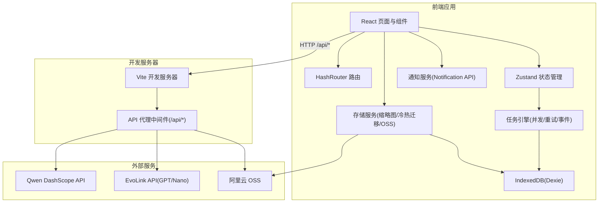
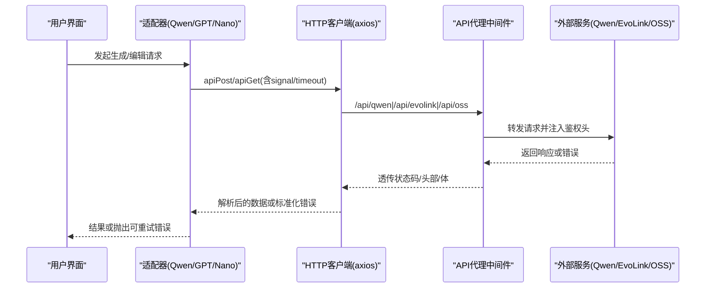
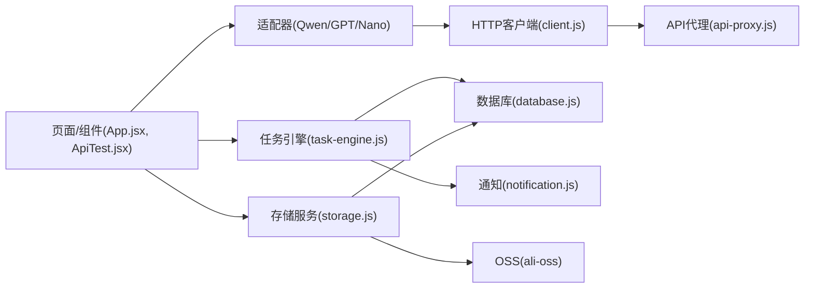

# 故障排除

<cite>
**本文引用的文件**   
- [README.md](file://README.md)
- [package.json](file://app/package.json)
- [vite.config.js](file://app/vite.config.js)
- [api-proxy.js](file://app/src/server/api-proxy.js)
- [client.js](file://app/src/services/api/client.js)
- [index.js](file://app/src/services/api/index.js)
- [qwen-adapter.js](file://app/src/services/api/qwen-adapter.js)
- [gpt-image-adapter.js](file://app/src/services/api/gpt-image-adapter.js)
- [database.js](file://app/src/db/database.js)
- [task-engine.js](file://app/src/services/task-engine.js)
- [useTaskStore.js](file://app/src/stores/useTaskStore.js)
- [storage.js](file://app/src/services/storage.js)
- [notification.js](file://app/src/services/notification.js)
- [App.jsx](file://app/src/App.jsx)
- [ApiTest.jsx](file://app/src/pages/ApiTest.jsx)
</cite>

## 目录
1. [简介](#简介)
2. [项目结构](#项目结构)
3. [核心组件](#核心组件)
4. [架构总览](#架构总览)
5. [详细组件分析](#详细组件分析)
6. [依赖关系分析](#依赖关系分析)
7. [性能与容量调优](#性能与容量调优)
8. [常见问题与解决方案](#常见问题与解决方案)
9. [调试与诊断指南](#调试与诊断指南)
10. [社区支持与反馈流程](#社区支持与反馈流程)
11. [结论](#结论)

## 简介
本指南面向 AI Image Studio 的使用者与开发者，聚焦于数据库连接、API 调用失败、任务执行异常、浏览器兼容性与性能问题等常见故障的定位与修复。文档提供端到端的错误诊断方法、日志分析技巧、开发环境调试工具使用、网络请求排查、内存泄漏定位策略，以及社区支持渠道和问题反馈流程。

## 项目结构
AI Image Studio 采用 Vite + React 前端工程化方案，通过自定义 Vite 插件实现 API 代理，统一封装 HTTP 客户端（axios），结合 IndexedDB（Dexie）进行本地持久化，并通过任务引擎调度后台任务。OSS 作为冷存储后端，配合缩略图生成与冷热分层迁移策略。

图表来源
- [vite.config.js:1-13](file://app/vite.config.js#L1-L13)
- [api-proxy.js:121-189](file://app/src/server/api-proxy.js#L121-L189)
- [client.js:18-33](file://app/src/services/api/client.js#L18-L33)
- [database.js:20-31](file://app/src/db/database.js#L20-L31)
- [task-engine.js:33-40](file://app/src/services/task-engine.js#L33-L40)
- [storage.js:44-42](file://app/src/services/storage.js#L44-L42)
- [notification.js:19-43](file://app/src/services/notification.js#L19-L43)

章节来源
- [README.md:1-10](file://README.md#L1-L10)
- [package.json:1-30](file://app/package.json#L1-L30)
- [vite.config.js:1-13](file://app/vite.config.js#L1-L13)

## 核心组件
- 统一 HTTP 客户端：基于 axios，内置超时、拦截器、自动重试与取消信号支持；提供短/长超时实例以适配同步图像生成接口。
- API 代理中间件：在开发环境下将 /api/* 转发至各外部服务并注入鉴权头，避免密钥泄露到客户端。
- 任务引擎：单例并发调度器，支持队列、最大并发、指数退避重试、状态机、进度上报与持久化。
- 存储服务：热区（IndexedDB Blob）+ 冷区（OSS）分层存储，缩略图生成与自动迁移。
- 通知服务：封装浏览器 Notification API，用于任务完成/失败提醒。
- 设置与模型配置：集中管理模型参数、存储配置、LLM 扩展配置，持久化到 IndexedDB。

章节来源
- [client.js:1-146](file://app/src/services/api/client.js#L1-L146)
- [api-proxy.js:1-190](file://app/src/server/api-proxy.js#L1-L190)
- [task-engine.js:1-319](file://app/src/services/task-engine.js#L1-L319)
- [storage.js:1-393](file://app/src/services/storage.js#L1-L393)
- [notification.js:1-113](file://app/src/services/notification.js#L1-L113)
- [index.js:1-39](file://app/src/services/api/index.js#L1-L39)

## 架构总览
下图展示了从用户操作到外部服务的完整链路，包括错误处理与重试路径。

图表来源
- [client.js:38-88](file://app/src/services/api/client.js#L38-L88)
- [api-proxy.js:55-116](file://app/src/server/api-proxy.js#L55-L116)
- [qwen-adapter.js:60-105](file://app/src/services/api/qwen-adapter.js#L60-L105)
- [gpt-image-adapter.js:164-190](file://app/src/services/api/gpt-image-adapter.js#L164-L190)

## 详细组件分析

### 数据库层（IndexedDB/Dexie）
- 职责：定义表结构与索引，提供增删改查与统计方法；启动时初始化数据库。
- 常见问题：
  - 数据库打开失败：检查浏览器是否启用 IndexedDB、磁盘配额不足、隐私模式限制。
  - 查询性能差：确认 orderBy/filter 字段是否命中索引；避免全表扫描。
  - 删除文件夹级联：确保子文件夹递归删除逻辑正确执行。
- 诊断要点：
  - 查看初始化日志输出，确认数据库成功打开。
  - 对大数据量列表分页加载，避免一次性拉取全部记录。
  - 监控 blobUrl 引用数量，及时释放以避免内存泄漏。

章节来源
- [database.js:20-31](file://app/src/db/database.js#L20-L31)
- [database.js:327-336](file://app/src/db/database.js#L327-L336)
- [database.js:219-229](file://app/src/db/database.js#L219-L229)

### 统一 HTTP 客户端（axios）
- 职责：创建基础与长超时实例；请求/响应拦截器；自动重试（指数退避）；支持 AbortController 取消。
- 常见问题：
  - 请求被代理拒绝：检查 Vite 代理中间件是否挂载、环境变量是否正确。
  - 超时错误：区分业务长耗时接口与默认超时，必要时使用长超时实例。
  - 重复重试：当上层已实现重试时，需禁用拦截器重试以避免双重重试。
- 诊断要点：
  - 关注拦截器抛出的标准化错误对象（包含 message/status/data）。
  - 使用 createCancellable 为长时间任务提供取消能力。

章节来源
- [client.js:18-33](file://app/src/services/api/client.js#L18-L33)
- [client.js:38-88](file://app/src/services/api/client.js#L38-L88)
- [client.js:137-143](file://app/src/services/api/client.js#L137-L143)

### API 代理中间件（Vite 插件）
- 职责：读取 .env 中的密钥，按路由转发到 Qwen/EvoLink/OSS/LLM，注入 Authorization 等头，透传响应。
- 常见问题：
  - 401/403：密钥缺失或无效；Host/CORS 头不匹配。
  - 502/504：上游不可达或超时；请求体大小不一致导致服务端拒绝。
  - 跨域：开发环境由代理解决，生产部署需独立网关或反向代理。
- 诊断要点：
  - 观察代理日志（目标 URL、请求体大小、响应状态、Content-Type）。
  - 校验环境变量前缀与命名是否与加载逻辑一致。

章节来源
- [api-proxy.js:121-189](file://app/src/server/api-proxy.js#L121-L189)
- [api-proxy.js:55-116](file://app/src/server/api-proxy.js#L55-L116)

### 任务引擎（并发/重试/状态机）
- 职责：维护队列与活跃任务集；状态转换；指数退避重试；进度上报；事件广播；持久化。
- 常见问题：
  - 任务卡住：检查 _processQueue 循环条件与 active 集合清理。
  - 无法重试：确认错误类型是否被判定为可重试（5xx/网络/超时）。
  - 并发过高：调整最大并发数，避免阻塞 UI 或触发上游限流。
- 诊断要点：
  - 监听 task:* 事件，观察状态流转与重试次数。
  - 对比任务持久化状态与实际运行状态，定位不一致原因。

章节来源
- [task-engine.js:24-31](file://app/src/services/task-engine.js#L24-L31)
- [task-engine.js:215-220](file://app/src/services/task-engine.js#L215-L220)
- [task-engine.js:299-305](file://app/src/services/task-engine.js#L299-L305)

### 存储服务（热区/冷区/OSS）
- 职责：热区 IndexedDB 快速访问；缩略图生成；上传/下载 OSS；冷热迁移与用量统计。
- 常见问题：
  - OSS 配置不完整：缺少 Bucket/Region/AccessKey 导致构造客户端失败。
  - 上传失败：签名/权限/CORS 配置错误；Content-Type 不匹配。
  - 内存泄漏：未释放 ObjectURL；缩略图生成异常。
- 诊断要点：
  - 使用 checkOSSConnection 验证连通性与权限。
  - 监控 hot zone 使用量，合理设置阈值触发迁移。

章节来源
- [storage.js:20-42](file://app/src/services/storage.js#L20-L42)
- [storage.js:138-151](file://app/src/services/storage.js#L138-L151)
- [storage.js:181-197](file://app/src/services/storage.js#L181-L197)
- [storage.js:252-298](file://app/src/services/storage.js#L252-L298)

### 通知服务（Notification API）
- 职责：请求权限、发送任务完成/失败通知、点击聚焦窗口。
- 常见问题：
  - 权限被拒：需在用户交互后请求，且仅 HTTPS 或 localhost 可用。
  - 浏览器不支持：降级处理，不影响主流程。
- 诊断要点：
  - 检查 permission 状态与 requestPermission 返回值。

章节来源
- [notification.js:19-43](file://app/src/services/notification.js#L19-L43)
- [notification.js:49-72](file://app/src/services/notification.js#L49-L72)

### 适配器（Qwen/GPT/Nano/LLM）
- 职责：封装不同模型的提交与结果解析；GPT/Nano 支持异步任务提交+轮询；Qwen 同步直出。
- 常见问题：
  - 参数格式不符：尺寸倍数、必填字段缺失。
  - 响应结构变化：解析失败需适配多形态返回。
  - 轮询超时：上限时间与间隔策略需合理。
- 诊断要点：
  - 打印请求体与响应键值，便于比对接口契约。
  - 捕获标准化错误信息，向上层抛出明确提示。

章节来源
- [qwen-adapter.js:60-105](file://app/src/services/api/qwen-adapter.js#L60-L105)
- [gpt-image-adapter.js:164-190](file://app/src/services/api/gpt-image-adapter.js#L164-L190)
- [gpt-image-adapter.js:199-241](file://app/src/services/api/gpt-image-adapter.js#L199-L241)
- [index.js:20-31](file://app/src/services/api/index.js#L20-L31)

### 任务面板与测试页
- 职责：展示任务状态、日志与结果；提供一键测试入口，辅助定位问题。
- 常见问题：
  - 日志为空：未正确订阅事件或未刷新任务列表。
  - 按钮无响应：任务仍在运行或被禁用。
- 诊断要点：
  - 使用 ApiTest 页面逐项验证各适配器连通性。
  - 对照任务中心表格与底层任务持久化状态。

章节来源
- [ApiTest.jsx:87-117](file://app/src/pages/ApiTest.jsx#L87-L117)
- [useTaskStore.js:39-64](file://app/src/stores/useTaskStore.js#L39-L64)

## 依赖关系分析
- 组件耦合：
  - 适配器依赖 HTTP 客户端；客户端依赖代理中间件；任务引擎依赖数据库与通知服务；存储服务依赖数据库与 OSS SDK。
- 潜在环依赖：
  - 当前未发现直接循环导入；注意在新增模块时保持单向依赖。
- 外部依赖：
  - axios、dexie、ali-oss、react、zustand 等版本需与构建脚本保持一致。

图表来源
- [client.js:1-146](file://app/src/services/api/client.js#L1-L146)
- [api-proxy.js:121-189](file://app/src/server/api-proxy.js#L121-L189)
- [task-engine.js:1-319](file://app/src/services/task-engine.js#L1-L319)
- [storage.js:1-393](file://app/src/services/storage.js#L1-L393)
- [App.jsx:245-351](file://app/src/App.jsx#L245-L351)
- [ApiTest.jsx:60-117](file://app/src/pages/ApiTest.jsx#L60-L117)

章节来源
- [package.json:11-28](file://app/package.json#L11-L28)

## 性能与容量调优
- 并发控制：根据设备性能与上游限流调整最大并发，避免资源争用。
- 重试策略：区分网络抖动与服务端错误，合理设置退避与上限，避免雪崩。
- 存储分层：设置合适的热区阈值，定期迁移旧图片至冷区，降低 IndexedDB 压力。
- 缩略图优化：限制最大维度与质量，减少内存占用与渲染开销。
- 请求取消：为长耗时任务提供取消信号，避免无用请求堆积。

[本节为通用建议，无需特定文件引用]

## 常见问题与解决方案

### 数据库连接问题
- 现象：应用启动时报错，无法打开数据库；列表加载缓慢或失败。
- 可能原因：
  - 浏览器禁用 IndexedDB 或处于隐私模式受限。
  - 磁盘配额不足或存储空间已满。
  - 表结构变更未生效或索引缺失。
- 诊断步骤：
  - 检查数据库初始化日志，确认 open 成功。
  - 在控制台执行简单读写测试，验证基本可用性。
  - 针对高频查询字段建立复合索引，避免全表扫描。
- 修复建议：
  - 清理浏览器缓存与站点数据后重试。
  - 升级 Dexie 版本并确保 schema 向后兼容。
  - 对大数据集实施分页与懒加载。

章节来源
- [database.js:327-336](file://app/src/db/database.js#L327-L336)
- [database.js:56-76](file://app/src/db/database.js#L56-L76)

### API 调用失败
- 现象：生成/编辑请求报错，或返回空结果。
- 可能原因：
  - 代理未正确转发（环境变量缺失、路由不匹配）。
  - 鉴权失败（Bearer Token 无效或过期）。
  - 上游限流/配额不足/模型不可用。
  - 请求体过大或 Content-Length 不一致。
- 诊断步骤：
  - 查看代理日志的目标 URL、请求体大小、响应状态与 Content-Type。
  - 使用 ApiTest 页面逐项验证各适配器连通性。
  - 检查客户端拦截器的标准化错误对象（message/status/data）。
- 修复建议：
  - 修正环境变量命名与前缀，确保代理能读取密钥。
  - 对关键接口启用长超时实例，避免误判超时。
  - 在上层实现幂等重试，避免重复提交。

章节来源
- [api-proxy.js:55-116](file://app/src/server/api-proxy.js#L55-L116)
- [client.js:38-88](file://app/src/services/api/client.js#L38-L88)
- [ApiTest.jsx:87-117](file://app/src/pages/ApiTest.jsx#L87-L117)

### 任务执行异常
- 现象：任务卡在 queued/running，或频繁失败。
- 可能原因：
  - 并发过高导致上游限流或资源耗尽。
  - 错误未被识别为可重试，导致直接失败。
  - 事件桥未初始化，UI 未刷新。
- 诊断步骤：
  - 监听任务事件，观察状态流转与重试次数。
  - 核对任务持久化状态与实际运行状态是否一致。
  - 检查任务引擎的 _isRetryableError 判定逻辑。
- 修复建议：
  - 降低最大并发，增加退避时间。
  - 完善错误分类，提升可重试范围。
  - 确保 initBridge 在应用启动时调用一次。

章节来源
- [task-engine.js:215-220](file://app/src/services/task-engine.js#L215-L220)
- [task-engine.js:299-305](file://app/src/services/task-engine.js#L299-L305)
- [useTaskStore.js:39-64](file://app/src/stores/useTaskStore.js#L39-L64)

### 浏览器兼容性问题
- 现象：通知不显示、Canvas 缩略图生成失败、IndexedDB 不可用。
- 可能原因：
  - 浏览器不支持相应 API 或权限被拒。
  - 非安全上下文（非 HTTPS/localhost）导致部分 API 受限。
- 诊断步骤：
  - 检查 Notification 权限状态与 requestPermission 返回值。
  - 在控制台检测 API 可用性（如 'Notification' in window）。
- 修复建议：
  - 降级处理：在不支持的浏览器中静默忽略相关功能。
  - 引导用户在受信任上下文中运行应用。

章节来源
- [notification.js:19-43](file://app/src/services/notification.js#L19-L43)
- [storage.js:323-347](file://app/src/services/storage.js#L323-L347)

### 存储与 OSS 问题
- 现象：上传失败、下载失败、冷热迁移未触发。
- 可能原因：
  - OSS 配置不完整或权限不足。
  - CORS 或签名规则不匹配。
  - 热区阈值设置不合理。
- 诊断步骤：
  - 使用 checkOSSConnection 验证连通性与权限。
  - 查看上传/下载日志与错误消息。
  - 检查热区使用量与阈值配置。
- 修复建议：
  - 补齐 Bucket/Region/AccessKey，确保域名与协议正确。
  - 调整阈值与迁移策略，避免频繁迁移影响性能。

章节来源
- [storage.js:181-197](file://app/src/services/storage.js#L181-L197)
- [storage.js:252-298](file://app/src/services/storage.js#L252-L298)

## 调试与诊断指南

### 开发环境调试工具
- 使用 Vite 开发服务器与自定义代理中间件，集中查看请求/响应日志。
- 在控制台过滤关键字段（如 [api-proxy]、[db]、[StorageService]、[TaskEngine]）快速定位问题。
- 使用 ApiTest 页面逐项验证各适配器连通性与参数组合。

章节来源
- [vite.config.js:1-13](file://app/vite.config.js#L1-L13)
- [api-proxy.js:121-189](file://app/src/server/api-proxy.js#L121-L189)
- [ApiTest.jsx:207-391](file://app/src/pages/ApiTest.jsx#L207-L391)

### 网络请求调试
- 检查代理日志中的目标 URL、请求体大小、响应状态与 Content-Type。
- 对于长耗时接口，使用长超时实例并开启取消信号。
- 若出现重复重试，确认上层是否已实现重试逻辑，避免双重重试。

章节来源
- [client.js:38-88](file://app/src/services/api/client.js#L38-L88)
- [client.js:112-116](file://app/src/services/api/client.js#L112-L116)
- [api-proxy.js:55-116](file://app/src/server/api-proxy.js#L55-L116)

### 内存泄漏排查
- 关注 ObjectURL 的创建与释放：删除图片、迁移冷热区时需及时 revoke。
- 监控缩略图生成过程中的临时对象与 Canvas 资源。
- 使用浏览器性能面板观察堆快照，定位未释放引用。

章节来源
- [storage.js:120-128](file://app/src/services/storage.js#L120-L128)
- [storage.js:219-226](file://app/src/services/storage.js#L219-L226)
- [storage.js:354-368](file://app/src/services/storage.js#L354-L368)

### 全局错误边界
- 应用顶层 ErrorBoundary 捕获渲染期错误并提供重新加载入口。
- 在 componentDidCatch 中记录错误上下文，便于后续分析。

章节来源
- [App.jsx:26-62](file://app/src/App.jsx#L26-L62)

## 社区支持与反馈流程
- 问题反馈：
  - 收集必要信息：浏览器版本、操作系统、复现步骤、错误日志片段、任务 ID。
  - 使用 ApiTest 页面导出日志截图，附上代理与客户端错误信息。
- 支持渠道：
  - 项目仓库 Issues 区提交问题，标注“故障排除”标签。
  - 参与讨论区交流经验，分享配置与优化方案。
- 贡献方式：
  - 提交最小复现代码与修复建议，遵循现有代码风格与注释规范。

[本节为通用流程说明，无需特定文件引用]

## 结论
通过系统化的日志分析与分层诊断，大多数数据库、网络、任务与存储问题均可快速定位与修复。建议在上线前完成端到端连通性测试与容量规划，持续监控任务与存储指标，结合合理的重试与并发策略，保障用户体验与系统稳定性。