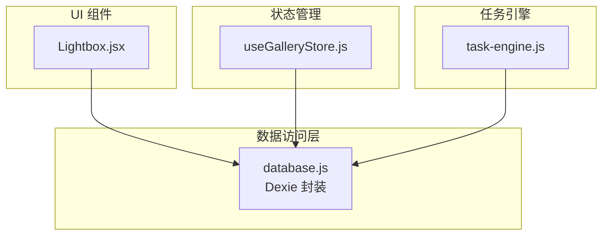
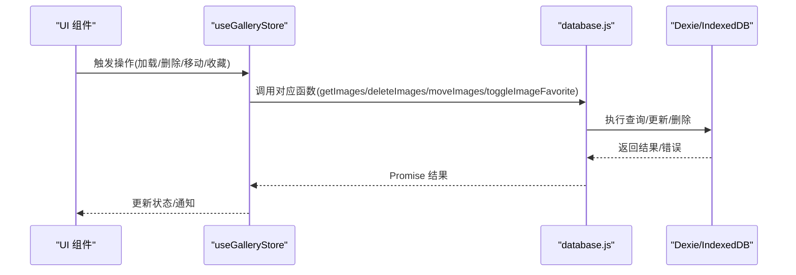
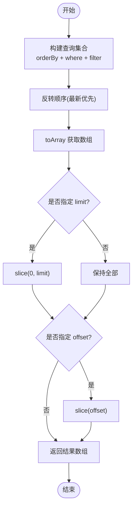
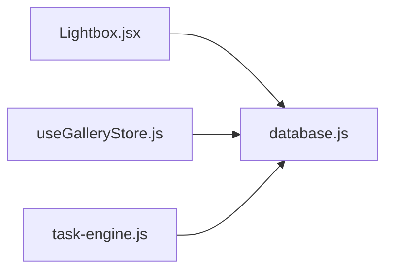

# CRUD 操作封装

<cite>
**本文引用的文件**
- [database.js](file://app/src/db/database.js)
- [useGalleryStore.js](file://app/src/stores/useGalleryStore.js)
- [Lightbox.jsx](file://app/src/components/Lightbox.jsx)
- [task-engine.js](file://app/src/services/task-engine.js)
</cite>

## 目录
1. [简介](#简介)
2. [项目结构](#项目结构)
3. [核心组件](#核心组件)
4. [架构总览](#架构总览)
5. [详细组件分析](#详细组件分析)
6. [依赖关系分析](#依赖关系分析)
7. [性能考虑](#性能考虑)
8. [故障排查指南](#故障排查指南)
9. [结论](#结论)
10. [附录：使用示例与最佳实践](#附录使用示例与最佳实践)

## 简介
本文件为 AI Image Studio 的数据库层（基于 Dexie/IndexedDB）提供全面的 CRUD 文档，聚焦图片实体的增删改查方法，包括 addImage、getImages、updateImage、deleteImage 等函数的参数规范、返回值类型与错误处理。同时覆盖批量操作方法（如 bulkDelete、bulkUpdate）的使用场景与性能考量，并给出事务处理和并发安全的最佳实践。文末提供完整的使用示例路径，涵盖条件查询、分页处理与复杂更新操作。

## 项目结构
本项目采用分层组织方式：
- 数据访问层：位于 app/src/db/database.js，封装 IndexedDB 表结构与所有 CRUD 函数。
- 状态管理层：位于 app/src/stores/useGalleryStore.js，聚合 UI 状态并调用数据访问层。
- 组件层：例如 Lightbox.jsx 直接调用数据库层的更新接口。
- 任务引擎：services/task-engine.js 负责后台任务的调度与状态同步，间接使用数据库层。

图表来源
- [database.js:1-339](file://app/src/db/database.js#L1-L339)
- [useGalleryStore.js:1-204](file://app/src/stores/useGalleryStore.js#L1-L204)
- [Lightbox.jsx:1-200](file://app/src/components/Lightbox.jsx#L1-L200)
- [task-engine.js:1-300](file://app/src/services/task-engine.js#L1-L300)

章节来源
- [database.js:1-339](file://app/src/db/database.js#L1-L339)
- [useGalleryStore.js:1-204](file://app/src/stores/useGalleryStore.js#L1-L204)
- [Lightbox.jsx:1-200](file://app/src/components/Lightbox.jsx#L1-L200)
- [task-engine.js:1-300](file://app/src/services/task-engine.js#L1-L300)

## 核心组件
本节对图片实体相关的核心函数进行说明，包括参数、返回类型与错误行为。

- addImage(image)
  - 参数：image 对象，包含 batchId、folderId、model、prompt、url、thumbnailUrl、params、favorite、storageZone、createdAt、width、height 等字段。未提供的字段会设置默认值（如 favorite=false、storageZone='hot'、createdAt=当前时间）。
  - 返回：新记录的自增 id（number）。
  - 异常：抛出 Dexie 约束或写入异常（如主键冲突、索引失败等），由调用方捕获。
  - 参考实现位置：[addImage:43-50](file://app/src/db/database.js#L43-L50)

- getImages(opts)
  - 参数：opts 可选对象，支持 folderId、model、favorite、limit、offset、orderBy 等过滤与分页选项。
  - 返回：图片数组（Array<Object>），按 createdAt 倒序（默认），支持 limit/offset 切片。
  - 注意：当指定 folderId 时，使用 where('folderId').equals(...)；model/favorite 使用客户端 filter；orderBy 可自定义排序字段。
  - 参考实现位置：[getImages:56-76](file://app/src/db/database.js#L56-L76)

- getImage(id)
  - 参数：id（number|string）。
  - 返回：单条记录或 undefined。
  - 参考实现位置：[getImage:79-81](file://app/src/db/database.js#L79-L81)

- updateImage(id, changes)
  - 参数：id 与要更新的字段对象 changes。
  - 返回：受影响的行数（通常为 1 或 0）。
  - 参考实现位置：[updateImage:84-86](file://app/src/db/database.js#L84-L86)

- deleteImage(id)
  - 参数：id。
  - 返回：受影响的行数（通常为 1 或 0）。
  - 参考实现位置：[deleteImage:89-91](file://app/src/db/database.js#L89-L91)

- deleteImages(ids)
  - 参数：id 数组。
  - 返回：Promise<void>（底层调用 bulkDelete）。
  - 参考实现位置：[deleteImages:94-96](file://app/src/db/database.js#L94-L96)

- moveImages(ids, folderId)
  - 参数：ids 数组与目标 folderId。
  - 返回：Promise<number[]>（批量更新结果）。
  - 参考实现位置：[moveImages:123-127](file://app/src/db/database.js#L123-L127)

- toggleImageFavorite(id)
  - 功能：切换收藏标记并返回新值。
  - 参考实现位置：[toggleImageFavorite:113-120](file://app/src/db/database.js#L113-L120)

- searchImages(keyword)
  - 功能：在 prompt、model、tags 中进行简单子串匹配（大小写不敏感）。
  - 参考实现位置：[searchImages:99-110](file://app/src/db/database.js#L99-L110)

- getImageStats()
  - 功能：统计 total、hotZone、coldZone、favorites 数量。
  - 参考实现位置：[getImageStats:130-138](file://app/src/db/database.js#L130-L138)

章节来源
- [database.js:43-50](file://app/src/db/database.js#L43-L50)
- [database.js:56-76](file://app/src/db/database.js#L56-L76)
- [database.js:79-81](file://app/src/db/database.js#L79-L81)
- [database.js:84-86](file://app/src/db/database.js#L84-L86)
- [database.js:89-91](file://app/src/db/database.js#L89-L91)
- [database.js:94-96](file://app/src/db/database.js#L94-L96)
- [database.js:99-110](file://app/src/db/database.js#L99-L110)
- [database.js:113-120](file://app/src/db/database.js#L113-L120)
- [database.js:123-127](file://app/src/db/database.js#L123-L127)
- [database.js:130-138](file://app/src/db/database.js#L130-L138)

## 架构总览
下图展示了从 UI 到数据库的关键调用路径，以及批量操作的典型流程。

图表来源
- [useGalleryStore.js:30-123](file://app/src/stores/useGalleryStore.js#L30-L123)
- [database.js:56-127](file://app/src/db/database.js#L56-L127)

章节来源
- [useGalleryStore.js:30-123](file://app/src/stores/useGalleryStore.js#L30-L123)
- [database.js:56-127](file://app/src/db/database.js#L56-L127)

## 详细组件分析

### 图片实体 CRUD 与批量操作
- 新增图片
  - 入口：addImage
  - 默认值策略：favorite、storageZone、createdAt 缺失时自动填充
  - 适用场景：生成完成后落库、导入本地图片后入库
  - 参考：[addImage:43-50](file://app/src/db/database.js#L43-L50)

- 查询图片
  - 入口：getImages
  - 过滤能力：folderId（服务端索引）、model/favorite（客户端 filter）
  - 排序与分页：orderBy 默认 createdAt；reverse 保证最新优先；limit/offset 用于分页
  - 参考：[getImages:56-76](file://app/src/db/database.js#L56-L76)

- 更新图片
  - 入口：updateImage
  - 常见用法：修改 note、folderId、favorite、storageZone 等
  - 参考：[updateImage:84-86](file://app/src/db/database.js#L84-L86)、[Lightbox 中的使用:90-130](file://app/src/components/Lightbox.jsx#L90-L130)

- 删除图片
  - 单删：deleteImage
  - 批量：deleteImages（底层调用 bulkDelete）
  - 参考：[deleteImage:89-91](file://app/src/db/database.js#L89-L91)、[deleteImages:94-96](file://app/src/db/database.js#L94-L96)

- 批量更新
  - 入口：moveImages（内部使用 bulkUpdate）
  - 适用场景：将多个图片移动到同一文件夹
  - 参考：[moveImages:123-127](file://app/src/db/database.js#L123-L127)

图表来源
- [database.js:56-76](file://app/src/db/database.js#L56-L76)

章节来源
- [database.js:43-50](file://app/src/db/database.js#L43-L50)
- [database.js:56-76](file://app/src/db/database.js#L56-L76)
- [database.js:84-86](file://app/src/db/database.js#L84-L86)
- [database.js:89-91](file://app/src/db/database.js#L89-L91)
- [database.js:94-96](file://app/src/db/database.js#L94-L96)
- [database.js:123-127](file://app/src/db/database.js#L123-L127)
- [Lightbox.jsx:90-130](file://app/src/components/Lightbox.jsx#L90-L130)

### 搜索与筛选
- 关键词搜索：searchImages
  - 在 prompt、model、tags 中做大小写不敏感的子串匹配
  - 适合快速检索，但大数据量下建议结合索引字段优化
  - 参考：[searchImages:99-110](file://app/src/db/database.js#L99-L110)

- 组合筛选：getImages + 客户端 dateRange
  - useGalleryStore 在加载后根据 filters.dateRange 再次过滤
  - 参考：[loadImages 日期范围过滤:49-55](file://app/src/stores/useGalleryStore.js#L49-L55)

章节来源
- [database.js:99-110](file://app/src/db/database.js#L99-L110)
- [useGalleryStore.js:49-55](file://app/src/stores/useGalleryStore.js#L49-L55)

### 收藏与移动
- 收藏切换：toggleImageFavorite
  - 先读取当前记录，再更新 favorite 取反，返回新值
  - 参考：[toggleImageFavorite:113-120](file://app/src/db/database.js#L113-L120)

- 批量移动：moveImages
  - 通过 bulkUpdate 将 ids 对应的记录统一设置 folderId
  - 参考：[moveImages:123-127](file://app/src/db/database.js#L123-L127)

章节来源
- [database.js:113-120](file://app/src/db/database.js#L113-L120)
- [database.js:123-127](file://app/src/db/database.js#L123-L127)

### 任务与存储联动
- 任务引擎在运行过程中会更新任务状态与进度，间接影响图片生命周期（例如生成成功后落库）
- 参考：[task-engine 状态更新:222-242](file://app/src/services/task-engine.js#L222-L242)

章节来源
- [task-engine.js:222-242](file://app/src/services/task-engine.js#L222-L242)

## 依赖关系分析
- 组件与状态管理
  - Lightbox.jsx 直接调用 database.js 的 updateImage 等方法
  - useGalleryStore.js 集中调用 database.js 的查询与批量操作
- 数据访问层
  - database.js 基于 Dexie 定义表结构与索引，并提供统一的异步 API
- 任务引擎
  - task-engine.js 通过数据库层维护任务状态，驱动 UI 与持久化一致性

图表来源
- [Lightbox.jsx:90-130](file://app/src/components/Lightbox.jsx#L90-L130)
- [useGalleryStore.js:30-123](file://app/src/stores/useGalleryStore.js#L30-L123)
- [task-engine.js:222-242](file://app/src/services/task-engine.js#L222-L242)
- [database.js:1-339](file://app/src/db/database.js#L1-L339)

章节来源
- [Lightbox.jsx:90-130](file://app/src/components/Lightbox.jsx#L90-L130)
- [useGalleryStore.js:30-123](file://app/src/stores/useGalleryStore.js#L30-L123)
- [task-engine.js:222-242](file://app/src/services/task-engine.js#L222-L242)
- [database.js:1-339](file://app/src/db/database.js#L1-L339)

## 性能考虑
- 查询性能
  - 使用 where('folderId') 走索引，避免全表扫描
  - model/favorite 使用客户端 filter，建议在数据量大时增加服务端索引或拆分查询
  - orderBy 与 reverse 配合，确保列表展示性能
- 分页与滚动加载
  - 使用 limit/offset 控制单次加载量，避免一次性拉取过多数据
  - 前端可结合滚动事件增量加载（见 Gallery 组件逻辑）
- 批量操作
  - 使用 bulkDelete/bulkUpdate 减少往返次数，提升吞吐
  - 大批量更新前建议分批提交，避免长时间占用事务
- 统计与缓存
  - getImageStats 会遍历全表，适合低频调用或在内存中缓存结果

章节来源
- [database.js:56-76](file://app/src/db/database.js#L56-L76)
- [database.js:94-96](file://app/src/db/database.js#L94-L96)
- [database.js:123-127](file://app/src/db/database.js#L123-L127)
- [database.js:130-138](file://app/src/db/database.js#L130-L138)

## 故障排查指南
- 常见问题
  - 主键冲突：重复插入相同 id 的记录会抛错，检查业务逻辑是否正确生成唯一 id
  - 索引失败：ensure 或 schema 变更导致索引重建失败，检查 Dexie 版本与迁移
  - 空指针：查询结果为 undefined 时需判空处理
- 日志与调试
  - 初始化失败：initDatabase 捕获异常并输出日志
  - 任务状态不一致：检查 task-engine 的状态更新与 UI 同步
- 建议
  - 在关键路径添加 try/catch 与用户提示
  - 对批量操作进行分片与重试机制

章节来源
- [database.js:327-336](file://app/src/db/database.js#L327-L336)
- [task-engine.js:222-242](file://app/src/services/task-engine.js#L222-L242)

## 结论
本仓库的数据库层以 Dexie 为核心，提供了清晰、一致的 CRUD 接口。通过合理的索引设计、分页与批量操作，能够满足画廊浏览、批量管理与任务驱动的复杂场景。建议在生产环境中结合事务与分片策略，进一步提升一致性与性能。

## 附录：使用示例与最佳实践

### 基本操作示例（仅路径引用）
- 新增图片
  - 参考：[addImage:43-50](file://app/src/db/database.js#L43-L50)
- 查询图片（含条件与分页）
  - 参考：[getImages:56-76](file://app/src/db/database.js#L56-L76)
- 更新图片字段
  - 参考：[updateImage:84-86](file://app/src/db/database.js#L84-L86)
- 删除图片（单条/批量）
  - 参考：[deleteImage:89-91](file://app/src/db/database.js#L89-L91)、[deleteImages:94-96](file://app/src/db/database.js#L94-L96)
- 批量移动图片
  - 参考：[moveImages:123-127](file://app/src/db/database.js#L123-L127)

### 条件查询与分页
- 按文件夹过滤
  - 参考：[getImages 中 folderId 过滤:59-61](file://app/src/db/database.js#L59-L61)
- 按模型/收藏过滤
  - 参考：[getImages 中 model/favorite 过滤:62-67](file://app/src/db/database.js#L62-L67)
- 分页（limit/offset）
  - 参考：[getImages 中 limit/offset 切片:72-74](file://app/src/db/database.js#L72-L74)

### 复杂更新操作
- 切换收藏
  - 参考：[toggleImageFavorite:113-120](file://app/src/db/database.js#L113-L120)
- 批量移动至文件夹
  - 参考：[moveImages:123-127](file://app/src/db/database.js#L123-L127)
- 在组件中更新备注
  - 参考：[Lightbox 中 updateImage 使用:90-130](file://app/src/components/Lightbox.jsx#L90-L130)

### 事务处理与并发安全最佳实践
- 使用 Dexie 事务
  - 将多个写操作包裹在同一事务中，保证原子性
  - 示例思路：db.transaction('rw', db.images, async () => { ... })
- 批量操作分片
  - 将大批量更新拆分为若干批次，每批内使用事务
- 并发控制
  - 使用任务引擎限制并发度，避免阻塞浏览器线程
  - 参考：[task-engine 并发控制:215-220](file://app/src/services/task-engine.js#L215-L220)
- 乐观锁与幂等
  - 对频繁更新字段（如 favorite）采用读-改-写模式，必要时加版本号
- 错误恢复
  - 捕获异常并回滚事务，向用户反馈失败原因
  - 对网络或 I/O 错误实施重试与退避

章节来源
- [database.js:56-76](file://app/src/db/database.js#L56-L76)
- [database.js:113-120](file://app/src/db/database.js#L113-L120)
- [database.js:123-127](file://app/src/db/database.js#L123-L127)
- [Lightbox.jsx:90-130](file://app/src/components/Lightbox.jsx#L90-L130)
- [task-engine.js:215-220](file://app/src/services/task-engine.js#L215-L220)