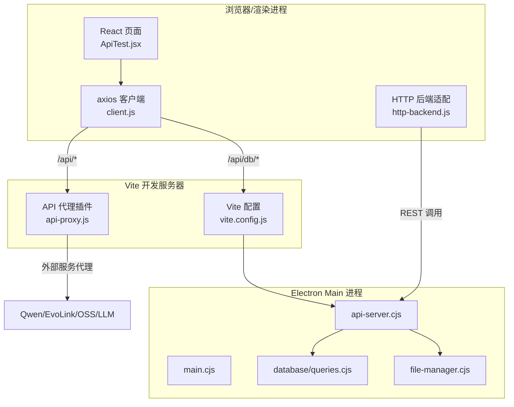
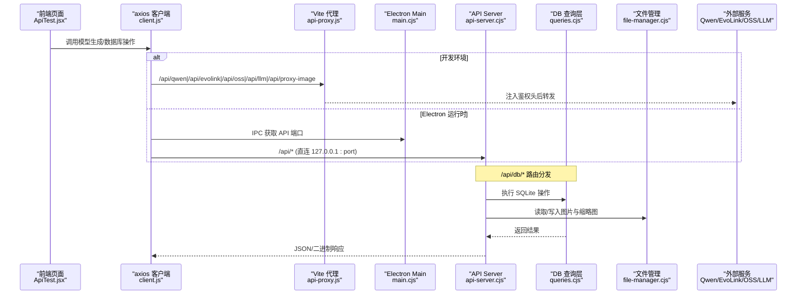
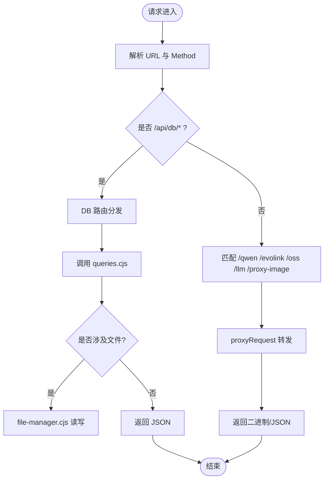
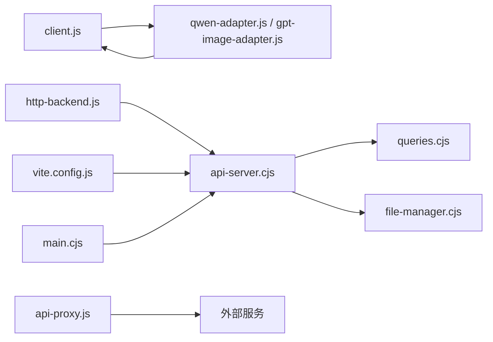

# HTTP 后端与 REST API

<cite>
**本文引用的文件**   
- [app/electron/api-server.cjs](file://app/electron/api-server.cjs)
- [app/src/server/api-proxy.js](file://app/src/server/api-proxy.js)
- [app/vite.config.js](file://app/vite.config.js)
- [app/electron/main.cjs](file://app/electron/main.cjs)
- [app/electron/file-manager.cjs](file://app/electron/file-manager.cjs)
- [app/electron/database/queries.cjs](file://app/electron/database/queries.cjs)
- [app/src/db/http-backend.js](file://app/src/db/http-backend.js)
- [app/src/services/api/client.js](file://app/src/services/api/client.js)
- [app/src/services/api/index.js](file://app/src/services/api/index.js)
- [app/src/services/api/qwen-adapter.js](file://app/src/services/api/qwen-adapter.js)
- [app/src/services/api/gpt-image-adapter.js](file://app/src/services/api/gpt-image-adapter.js)
- [app/src/pages/ApiTest.jsx](file://app/src/pages/ApiTest.jsx)
</cite>

## 目录
1. [简介](#简介)
2. [项目结构](#项目结构)
3. [核心组件](#核心组件)
4. [架构总览](#架构总览)
5. [详细组件分析](#详细组件分析)
6. [依赖关系分析](#依赖关系分析)
7. [性能考量](#性能考量)
8. [故障排查指南](#故障排查指南)
9. [结论](#结论)

## 简介
本仓库为 AI 图像工作室的前端应用，采用 Electron + Vite + React 技术栈。HTTP 后端与 REST API 的核心职责包括：
- 在 Electron main 进程内启动轻量 HTTP 服务器，提供本地代理与数据库 REST 接口
- 在开发环境通过 Vite 插件实现 API 代理，将前端请求转发到外部服务（如 Qwen、EvoLink、阿里云 OSS、LLM）
- 在前端统一封装 axios 客户端，支持自动重试、取消、Electron 端口动态解析
- 提供浏览器模式下的 HTTP 后端适配层，将 Dexie/Electron 后端抽象映射到 /api/db/* REST 接口
- 提供适配器层对接不同模型供应商（Qwen、GPT-image-2、Nano Banana 2、通用 LLM）

## 项目结构
围绕 HTTP 后端与 REST API 的关键路径如下：
- Electron 主进程启动并创建内置 HTTP 服务器，挂载 DB 路由与外部服务代理
- 开发期 Vite 插件注入中间件，完成对外部服务的代理
- 前端通过统一客户端访问 /api/*，在 Electron 环境下动态指向 main 进程的本地端口
- 浏览器模式下，/api/db/* 由 Vite 代理转发至 Electron 的 API server

图表来源
- [app/src/pages/ApiTest.jsx:1-391](file://app/src/pages/ApiTest.jsx#L1-L391)
- [app/src/services/api/client.js:1-191](file://app/src/services/api/client.js#L1-L191)
- [app/src/db/http-backend.js:1-345](file://app/src/db/http-backend.js#L1-L345)
- [app/src/server/api-proxy.js:1-221](file://app/src/server/api-proxy.js#L1-L221)
- [app/vite.config.js:1-20](file://app/vite.config.js#L1-L20)
- [app/electron/main.cjs:1-126](file://app/electron/main.cjs#L1-L126)
- [app/electron/api-server.cjs:1-606](file://app/electron/api-server.cjs#L1-L606)
- [app/electron/database/queries.cjs:1-721](file://app/electron/database/queries.cjs#L1-L721)
- [app/electron/file-manager.cjs:1-196](file://app/electron/file-manager.cjs#L1-L196)

章节来源
- [app/electron/main.cjs:1-126](file://app/electron/main.cjs#L1-L126)
- [app/electron/api-server.cjs:1-606](file://app/electron/api-server.cjs#L1-L606)
- [app/src/server/api-proxy.js:1-221](file://app/src/server/api-proxy.js#L1-L221)
- [app/vite.config.js:1-20](file://app/vite.config.js#L1-L20)

## 核心组件
- Electron API Server：基于 Node http.createServer，提供 /api/db/* 与外部服务代理路由，支持 CORS、二进制流、错误归一化
- Vite API 代理插件：在开发期注册中间件，将 /api/qwen、/api/evolink、/api/oss、/api/llm、/api/proxy-image 转发到外部服务
- 前端 axios 客户端：统一 baseURL、超时、重试、取消信号；在 Electron 中动态解析 API 端口
- HTTP 后端适配层：将 Dexie/Electron 后端方法映射为对 /api/db/* 的 fetch 调用，处理元数据与二进制分步上传
- 模型适配器：QwenAdapter（同步）、GPTImageAdapter（异步提交+轮询），以及 NanoBanana/LLM 适配器入口
- 文件管理器：负责原图、缩略图、导入图片的读写与删除，供 API Server 使用

章节来源
- [app/electron/api-server.cjs:1-606](file://app/electron/api-server.cjs#L1-L606)
- [app/src/server/api-proxy.js:1-221](file://app/src/server/api-proxy.js#L1-L221)
- [app/src/services/api/client.js:1-191](file://app/src/services/api/client.js#L1-L191)
- [app/src/db/http-backend.js:1-345](file://app/src/db/http-backend.js#L1-L345)
- [app/src/services/api/index.js:1-39](file://app/src/services/api/index.js#L1-L39)
- [app/src/services/api/qwen-adapter.js:1-209](file://app/src/services/api/qwen-adapter.js#L1-L209)
- [app/src/services/api/gpt-image-adapter.js:1-431](file://app/src/services/api/gpt-image-adapter.js#L1-L431)
- [app/electron/file-manager.cjs:1-196](file://app/electron/file-manager.cjs#L1-L196)

## 架构总览
下图展示了从前端发起请求到最终落库或外部调用的完整链路，包含开发环境与 Electron 运行时的差异。

图表来源
- [app/src/pages/ApiTest.jsx:1-391](file://app/src/pages/ApiTest.jsx#L1-L391)
- [app/src/services/api/client.js:1-191](file://app/src/services/api/client.js#L1-L191)
- [app/src/server/api-proxy.js:1-221](file://app/src/server/api-proxy.js#L1-L221)
- [app/electron/main.cjs:1-126](file://app/electron/main.cjs#L1-L126)
- [app/electron/api-server.cjs:1-606](file://app/electron/api-server.cjs#L1-L606)
- [app/electron/database/queries.cjs:1-721](file://app/electron/database/queries.cjs#L1-L721)
- [app/electron/file-manager.cjs:1-196](file://app/electron/file-manager.cjs#L1-L196)

## 详细组件分析

### Electron API Server（/api/*）
- 功能要点
  - 加载 .env 环境变量，构建各外部服务 base URL 与鉴权信息
  - 提供通用代理函数：读取请求体、拼接目标 URL、注入额外请求头、回写状态码与响应头、处理二进制响应
  - 路由分组：/api/db/*、/api/qwen/*、/api/evolink/*、/api/oss/*、/api/llm/*、/api/proxy-image
  - DB 路由：按资源域（images/batches/sessions/folders/tasks/settings/casePackages）拆分处理，支持元数据与二进制分步上传下载
  - CORS 预检与 404 兜底
- 关键流程
  - 请求进入 createRequestHandler → 匹配前缀 → 选择对应处理器（DB Router 或 proxyRequest）
  - DB Router 内部根据 urlPath 与方法精确匹配，调用 queries.cjs 与 fileManager
  - 代理请求统一走 proxyRequest，避免重复逻辑

图表来源
- [app/electron/api-server.cjs:1-606](file://app/electron/api-server.cjs#L1-L606)
- [app/electron/database/queries.cjs:1-721](file://app/electron/database/queries.cjs#L1-L721)
- [app/electron/file-manager.cjs:1-196](file://app/electron/file-manager.cjs#L1-L196)

章节来源
- [app/electron/api-server.cjs:1-606](file://app/electron/api-server.cjs#L1-L606)

### Vite API 代理插件（开发期）
- 功能要点
  - 通过 vite-plugin 的 configureServer 注入中间件
  - 读取 Vite loadEnv 的环境变量，构造外部服务 targetUrl
  - 提供与 api-server 一致的通用代理逻辑，确保请求体、头部、响应体一致处理
  - 暴露 /api/proxy-image 用于绕过跨域直接拉取外部图片
- 与 Electron 的关系
  - 生产环境不依赖 Vite，所有 /api/* 由 Electron API Server 提供
  - 开发环境 /api/db/* 通过 vite.config.js 的 proxy 转发到 Electron API Server 的固定端口

章节来源
- [app/src/server/api-proxy.js:1-221](file://app/src/server/api-proxy.js#L1-L221)
- [app/vite.config.js:1-20](file://app/vite.config.js#L1-L20)

### 前端 axios 客户端与环境切换
- 功能要点
  - 默认 baseURL = '/api'，在 Electron 环境中通过 window.electronAPI.getApiPort 动态改写 baseURL 为 http://127.0.0.1:{port}/api
  - 统一的请求/响应拦截器：支持 AbortController、指数退避重试、错误归一化
  - 提供 longRunningClient 用于长耗时同步生成（如 Qwen）
  - 提供 proxyImageUrl 将外部图片 URL 包装为 /api/proxy-image?url=...
- 使用方式
  - 业务代码通过 apiGet/apiPost/apiPut/apiDelete 等便捷方法发起请求
  - 适配器层通过 client 进行网络调用

章节来源
- [app/src/services/api/client.js:1-191](file://app/src/services/api/client.js#L1-L191)

### HTTP 后端适配层（浏览器模式）
- 功能要点
  - 将上层后端抽象（Dexie/Electron）的方法映射为对 /api/db/* 的 fetch 调用
  - 图片上传采用两步法：先 POST 元数据获取 id，再 PUT 原始二进制到 /images/file/:id 与 /images/thumbnail/:id
  - 图片下载时根据 hasImage/hasThumbnail 标志决定是否拉取二进制并附加 Blob/URL
  - 提供 getImages/getTasks 等方法的过滤与统计字段对齐
- 适用场景
  - 纯浏览器环境（无 Electron IPC）下，仍可通过 Vite 代理访问 Electron 的 SQLite 数据

章节来源
- [app/src/db/http-backend.js:1-345](file://app/src/db/http-backend.js#L1-L345)

### 模型适配器（Qwen/GPT-image-2/Nano Banana/LLM）
- QwenAdapter
  - 同步 API：POST 返回结果，需较长超时（约 5 分钟）
  - 参数校验与尺寸规范化，错误信息提取 DashScope 格式
- GPTImageAdapter
  - 异步任务：提交后轮询任务状态，指数退避策略，支持取消
  - 兼容多种响应形状（OpenAI 标准、EvoLink 自定义）
- 适配器工厂与导出
  - index.js 统一导出适配器与工厂方法，便于页面测试与业务调用

章节来源
- [app/src/services/api/qwen-adapter.js:1-209](file://app/src/services/api/qwen-adapter.js#L1-L209)
- [app/src/services/api/gpt-image-adapter.js:1-431](file://app/src/services/api/gpt-image-adapter.js#L1-L431)
- [app/src/services/api/index.js:1-39](file://app/src/services/api/index.js#L1-L39)

### 文件管理与存储
- 目录组织
  - originals：生成的原图
  - thumbnails：缩略图
  - imports：用户导入参考图
- 能力
  - 保存/读取/删除原图与缩略图
  - 批量删除与存储统计
  - 通过 IPC 暴露给渲染进程（非 REST 路径）

章节来源
- [app/electron/file-manager.cjs:1-196](file://app/electron/file-manager.cjs#L1-L196)

### 数据库查询层（SQLite）
- 设计要点
  - 镜像 src/db/database.js 的导出函数集合，覆盖 images/batches/sessions/folders/tasks/settings/casePackages
  - 将非索引字段打包进 data JSON 列，更新时合并旧值与新变更
  - 结果对象解包：favorite 布尔转换、data JSON 合并入顶层字段
  - 统计查询聚合 hot/warm/cold、totalSize、任务状态分布等

章节来源
- [app/electron/database/queries.cjs:1-721](file://app/electron/database/queries.cjs#L1-L721)

## 依赖关系分析
- 模块耦合
  - api-server.cjs 依赖 queries.cjs 与 file-manager.cjs，形成“路由→数据/文件”的清晰分层
  - http-backend.js 仅依赖 REST 接口，屏蔽底层实现差异
  - client.js 作为网络层被所有适配器与页面复用
- 外部依赖
  - 环境变量驱动的外部服务：DashScope（Qwen）、EvoLink（GPT-image-2/Nano Banana）、阿里云 OSS、Expansion LLM
- 潜在循环依赖
  - 当前未发现循环引用；api-server 仅在需要时懒加载 queries.cjs

图表来源
- [app/src/services/api/client.js:1-191](file://app/src/services/api/client.js#L1-L191)
- [app/src/services/api/qwen-adapter.js:1-209](file://app/src/services/api/qwen-adapter.js#L1-L209)
- [app/src/services/api/gpt-image-adapter.js:1-431](file://app/src/services/api/gpt-image-adapter.js#L1-L431)
- [app/src/db/http-backend.js:1-345](file://app/src/db/http-backend.js#L1-L345)
- [app/electron/api-server.cjs:1-606](file://app/electron/api-server.cjs#L1-L606)
- [app/electron/database/queries.cjs:1-721](file://app/electron/database/queries.cjs#L1-L721)
- [app/electron/file-manager.cjs:1-196](file://app/electron/file-manager.cjs#L1-L196)
- [app/src/server/api-proxy.js:1-221](file://app/src/server/api-proxy.js#L1-L221)
- [app/vite.config.js:1-20](file://app/vite.config.js#L1-L20)
- [app/electron/main.cjs:1-126](file://app/electron/main.cjs#L1-L126)

## 性能考量
- 二进制传输
  - 图片上传/下载采用原生 Buffer/Blob 流式处理，避免不必要的序列化开销
  - 缩略图与原图分离，减少首屏负载
- 重试与退避
  - axios 客户端默认指数退避重试，适用于临时网络抖动
  - GPT-image-2 提交阶段自实现重试，规避代理 5xx 导致的失败
- 长耗时任务
  - Qwen 同步接口使用独立长超时客户端，避免误判超时
  - GPT-image-2 轮询采用指数退避与最大间隔上限，平衡延迟与压力
- 缓存
  - 图片代理设置 Cache-Control，降低重复请求

[本节为通用指导，无需源码引用]

## 故障排查指南
- 常见问题定位
  - 环境变量缺失：检查 .env 中的 VITE_* 键值是否正确加载
  - 端口占用：Electron 开发期固定端口 19527，确认未被占用
  - 跨域问题：确认 API Server 已设置 Access-Control-Allow-* 头
  - 代理失败：查看 api-server 与 api-proxy 日志中的 targetUrl 与请求体大小
  - 数据库不可用：验证 /api/db/settings/getAll 是否可达
- 调试建议
  - 使用 ApiTest 页面逐项验证模型适配器
  - 观察控制台输出中的请求/响应摘要与错误堆栈
  - 对于二进制接口，检查 Content-Type 与 Content-Length 是否正确传递

章节来源
- [app/electron/api-server.cjs:1-606](file://app/electron/api-server.cjs#L1-L606)
- [app/src/server/api-proxy.js:1-221](file://app/src/server/api-proxy.js#L1-L221)
- [app/src/pages/ApiTest.jsx:1-391](file://app/src/pages/ApiTest.jsx#L1-L391)

## 结论
本项目通过“Electron 内置 API Server + Vite 开发代理 + 前端统一客户端 + 适配器层”的分层设计，实现了：
- 统一的 /api/* 入口，屏蔽外部服务差异
- 可插拔的模型适配器，支持同步与异步两种范式
- 浏览器与 Electron 双环境的无缝数据访问（通过 HTTP 后端适配层）
- 稳健的错误处理、重试与二进制传输机制

该架构在保证开发体验的同时，具备良好的扩展性与可维护性，适合持续集成更多模型与服务。