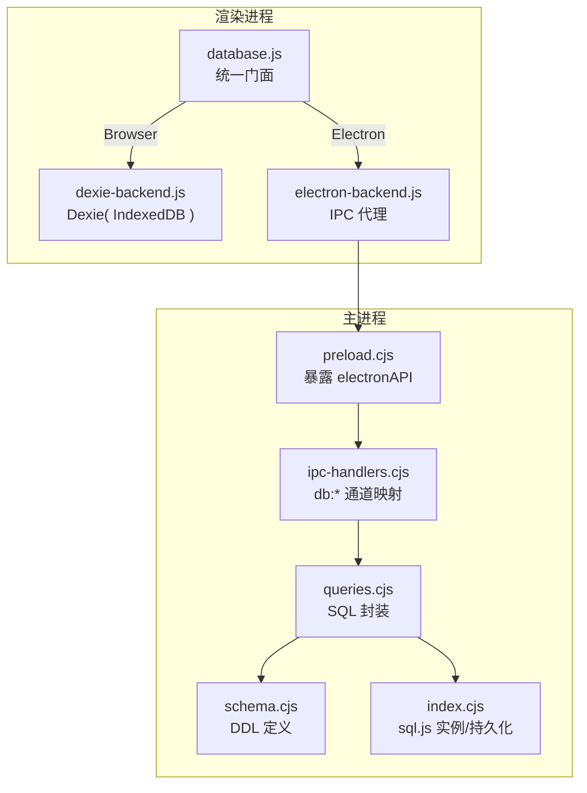
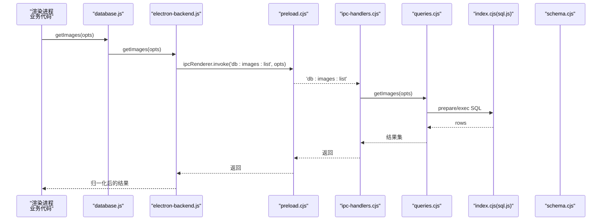
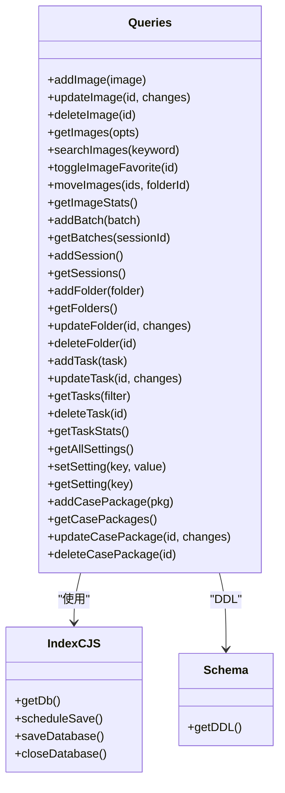
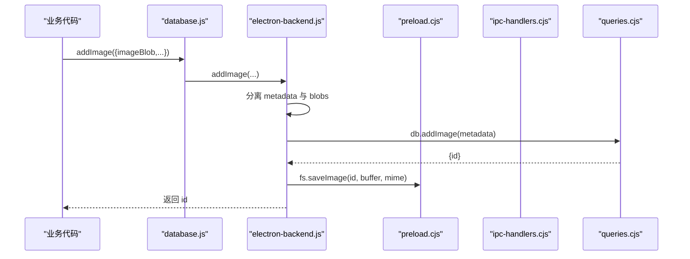
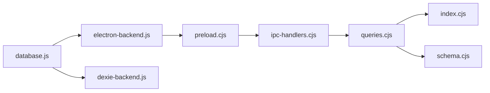
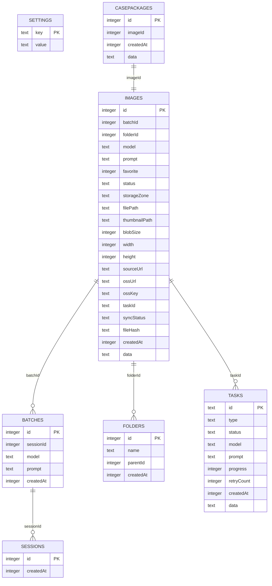

# SQLite 数据库层

<cite>
**本文引用的文件**
- [app/electron/database/index.cjs](file://app/electron/database/index.cjs)
- [app/electron/database/queries.cjs](file://app/electron/database/queries.cjs)
- [app/electron/database/schema.cjs](file://app/electron/database/schema.cjs)
- [app/src/db/database.js](file://app/src/db/database.js)
- [app/src/db/dexie-backend.js](file://app/src/db/dexie-backend.js)
- [app/src/db/electron-backend.js](file://app/src/db/electron-backend.js)
- [app/electron/main.cjs](file://app/electron/main.cjs)
- [app/electron/preload.cjs](file://app/electron/preload.cjs)
- [app/electron/ipc-handlers.cjs](file://app/electron/ipc-handlers.cjs)
</cite>

## 目录
1. [简介](#简介)
2. [项目结构](#项目结构)
3. [核心组件](#核心组件)
4. [架构总览](#架构总览)
5. [详细组件分析](#详细组件分析)
6. [依赖关系分析](#依赖关系分析)
7. [性能与一致性](#性能与一致性)
8. [故障排查指南](#故障排查指南)
9. [结论](#结论)
10. [附录：数据模型](#附录数据模型)

## 简介
本仓库的“SQLite 数据库层”采用策略模式，在 Electron 环境下通过 sql.js（WASM）运行 SQLite，并在渲染进程通过 IPC 调用主进程的查询封装；在非 Electron 环境（浏览器）下则回退到 Dexie（IndexedDB）。该设计使得上层业务代码无需感知底层存储差异。

## 项目结构
围绕数据库层的文件组织如下：
- 主进程侧（Electron main）
  - 初始化与生命周期管理：index.cjs
  - SQL 查询封装：queries.cjs
  - 表结构与索引定义：schema.cjs
  - 应用启动、IPC 注册与关闭流程：main.cjs、ipc-handlers.cjs、preload.cjs
- 渲染进程侧（Renderer）
  - 统一门面与后端选择：database.js
  - Dexie 后端实现：dexie-backend.js
  - Electron 后端实现（IPC 代理）：electron-backend.js

图表来源
- [app/src/db/database.js:1-98](file://app/src/db/database.js#L1-L98)
- [app/src/db/dexie-backend.js:1-310](file://app/src/db/dexie-backend.js#L1-L310)
- [app/src/db/electron-backend.js:1-331](file://app/src/db/electron-backend.js#L1-L331)
- [app/electron/preload.cjs:1-82](file://app/electron/preload.cjs#L1-L82)
- [app/electron/ipc-handlers.cjs:1-63](file://app/electron/ipc-handlers.cjs#L1-L63)
- [app/electron/database/queries.cjs:1-721](file://app/electron/database/queries.cjs#L1-L721)
- [app/electron/database/schema.cjs:1-115](file://app/electron/database/schema.cjs#L1-L115)
- [app/electron/database/index.cjs:1-93](file://app/electron/database/index.cjs#L1-L93)

章节来源
- [app/src/db/database.js:1-98](file://app/src/db/database.js#L1-L98)
- [app/electron/main.cjs:70-126](file://app/electron/main.cjs#L70-L126)

## 核心组件
- 门面与后端选择（database.js）
  - 根据 window.electronAPI.db 是否存在自动选择 Electron 或 Dexie 后端
  - 提供统一的函数导出，屏蔽底层差异
- Electron 后端（electron-backend.js）
  - 将渲染进程调用转换为 IPC 请求，并归一化返回值以匹配 Dexie 行为
  - 负责图片二进制与缩略图的文件系统读写协调
- 主进程数据库层（index.cjs + queries.cjs + schema.cjs）
  - index.cjs：加载 sql.js、创建/打开数据库、WAL 模式尝试、延迟持久化与关闭
  - schema.cjs：定义 images、batches、sessions、folders、tasks、settings、casePackages 七张表及索引
  - queries.crs：面向业务的 CRUD、统计、搜索等 SQL 封装，并对 JSON data 列进行打包/解包

章节来源
- [app/src/db/database.js:22-30](file://app/src/db/database.js#L22-L30)
- [app/src/db/electron-backend.js:8-44](file://app/src/db/electron-backend.js#L8-L44)
- [app/electron/database/index.cjs:19-45](file://app/electron/database/index.cjs#L19-L45)
- [app/electron/database/schema.cjs:6-112](file://app/electron/database/schema.cjs#L6-L112)
- [app/electron/database/queries.cjs:1-116](file://app/electron/database/queries.cjs#L1-L116)

## 架构总览
下图展示了从渲染进程发起一次“获取图片列表”的端到端调用链。

图表来源
- [app/src/db/database.js:34-43](file://app/src/db/database.js#L34-L43)
- [app/src/db/electron-backend.js:71-88](file://app/src/db/electron-backend.js#L71-L88)
- [app/electron/preload.cjs:13](file://app/electron/preload.cjs#L13)
- [app/electron/ipc-handlers.cjs:17](file://app/electron/ipc-handlers.cjs#L17)
- [app/electron/database/queries.cjs:217-257](file://app/electron/database/queries.cjs#L217-L257)
- [app/electron/database/index.cjs:19-45](file://app/electron/database/index.cjs#L19-L45)
- [app/electron/database/schema.cjs:6-112](file://app/electron/database/schema.cjs#L6-L112)

## 详细组件分析

### 主进程数据库初始化与生命周期（index.cjs）
- 使用 sql.js 初始化数据库实例，优先从用户数据目录加载已有 .db 文件，否则新建
- 尝试开启 WAL 模式（兼容处理），随后执行 schema.cjs 提供的 DDL
- 提供 scheduleSave/saveDatabase/closeDatabase 等接口，写入后 300ms 防抖落盘，关闭时强制保存并释放资源

图表来源
- [app/electron/database/index.cjs:19-45](file://app/electron/database/index.cjs#L19-L45)
- [app/electron/database/schema.cjs:6-112](file://app/electron/database/schema.cjs#L6-L112)

章节来源
- [app/electron/database/index.cjs:19-93](file://app/electron/database/index.cjs#L19-L93)

### 表结构与索引（schema.cjs）
- 七张核心表：images、batches、sessions、folders、tasks、settings、casePackages
- 针对常用查询字段建立复合/单列索引，如 folderId+createdAt、status+createdAt、favorite、model、batchId、storageZone 等
- 大量扩展字段通过 JSON data 列存储，避免频繁变更表结构

章节来源
- [app/electron/database/schema.cjs:6-112](file://app/electron/database/schema.cjs#L6-L112)

### 查询封装与数据建模（queries.cjs）
- 统一的数据打包/解包
  - packImageData/unpackImageRow：将非索引字段合并入 data JSON 列，读取时反序列化并合并到行对象
  - buildImageUpdateClauses：动态生成 UPDATE SET 子句，区分索引列与 data JSON 更新
- 典型操作
  - addImage/updateImage/deleteImage/getImages/searchImages/toggleImageFavorite/moveImages
  - batches/sessions/folders/tasks/settings/casePackages 的增删改查与统计
- 写操作均触发 scheduleSave() 进行延迟持久化

图表来源
- [app/electron/database/queries.cjs:1-721](file://app/electron/database/queries.cjs#L1-L721)
- [app/electron/database/index.cjs:51-93](file://app/electron/database/index.cjs#L51-L93)
- [app/electron/database/schema.cjs:6-112](file://app/electron/database/schema.cjs#L6-L112)

章节来源
- [app/electron/database/queries.cjs:1-721](file://app/electron/database/queries.cjs#L1-L721)

### 渲染进程后端选择与归一化（database.js + electron-backend.js + dexie-backend.js）
- database.js 作为门面，根据运行时环境选择后端，并导出一致的 API
- electron-backend.js 负责：
  - 将 Blob/ArrayBuffer 与文件系统交互（图片与缩略图）
  - 对返回值做归一化（例如自增 ID、统计字段名对齐）
  - 对部分能力缺失（如 deleteBatch）给出降级处理
- dexie-backend.js 提供 IndexedDB 等价实现，保持相同方法签名与返回形态

图表来源
- [app/src/db/database.js:22-30](file://app/src/db/database.js#L22-L30)
- [app/src/db/electron-backend.js:48-69](file://app/src/db/electron-backend.js#L48-L69)
- [app/electron/preload.cjs:48-51](file://app/electron/preload.cjs#L48-L51)
- [app/electron/ipc-handlers.cjs:12](file://app/electron/ipc-handlers.cjs#L12)
- [app/electron/database/queries.cjs:122-163](file://app/electron/database/queries.cjs#L122-L163)

章节来源
- [app/src/db/database.js:1-98](file://app/src/db/database.js#L1-L98)
- [app/src/db/electron-backend.js:1-331](file://app/src/db/electron-backend.js#L1-L331)
- [app/src/db/dexie-backend.js:1-310](file://app/src/db/dexie-backend.js#L1-L310)

### 应用启动与 IPC 注册（main.cjs + preload.cjs + ipc-handlers.cjs）
- main.cjs 在 app.whenReady 中：
  - 初始化数据库（index.cjs）
  - 注册数据库 IPC handlers（ipc-handlers.cjs）
  - 注册文件系统 IPC handlers
  - 启动 API 代理与 OSS 同步
  - 创建主窗口，并在首次页面加载完成后执行迁移
- preload.cjs 向渲染进程暴露 electronAPI.db 与 electronAPI.fs
- ipc-handlers.cjs 将 db:* 通道映射到 queries.cjs 的具体函数

章节来源
- [app/electron/main.cjs:70-126](file://app/electron/main.cjs#L70-L126)
- [app/electron/preload.cjs:1-82](file://app/electron/preload.cjs#L1-L82)
- [app/electron/ipc-handlers.cjs:1-63](file://app/electron/ipc-handlers.cjs#L1-L63)

## 依赖关系分析
- 模块耦合
  - queries.cjs 强依赖 index.cjs 的 getDb/scheduleSave
  - queries.cjs 依赖 schema.cjs 的 DDL
  - electron-backend.js 依赖 preload.cjs 暴露的 IPC 通道
  - database.js 同时依赖两个后端工厂，按环境选择
- 外部依赖
  - sql.js（WASM）用于在主进程内运行 SQLite
  - Dexie 用于浏览器环境的 IndexedDB 抽象

图表来源
- [app/src/db/database.js:1-98](file://app/src/db/database.js#L1-L98)
- [app/src/db/electron-backend.js:1-331](file://app/src/db/electron-backend.js#L1-L331)
- [app/src/db/dexie-backend.js:1-310](file://app/src/db/dexie-backend.js#L1-L310)
- [app/electron/preload.cjs:1-82](file://app/electron/preload.cjs#L1-L82)
- [app/electron/ipc-handlers.cjs:1-63](file://app/electron/ipc-handlers.cjs#L1-L63)
- [app/electron/database/queries.cjs:1-721](file://app/electron/database/queries.cjs#L1-L721)
- [app/electron/database/index.cjs:1-93](file://app/electron/database/index.cjs#L1-L93)
- [app/electron/database/schema.cjs:1-115](file://app/electron/database/schema.cjs#L1-L115)

## 性能与一致性
- 延迟持久化
  - 所有写操作通过 scheduleSave() 触发 300ms 防抖落盘，减少频繁 I/O
  - closeDatabase() 会强制保存并释放资源，保障退出一致性
- WAL 模式
  - 尝试启用 PRAGMA journal_mode=WAL，提升并发读性能（在 sql.js 中可能不可用，已做容错）
- 索引优化
  - 高频过滤/排序字段建立索引，如 folderId+createdAt、status+createdAt、favorite、model、batchId、storageZone
- 大数据量建议
  - 分页：getImages 支持 limit/offset
  - 批量删除：deleteImages 使用 IN 占位符批量处理
  - 大对象：二进制文件走文件系统，不在 SQLite 中存 BLOB，降低数据库体积

章节来源
- [app/electron/database/index.cjs:58-93](file://app/electron/database/index.cjs#L58-L93)
- [app/electron/database/queries.cjs:201-207](file://app/electron/database/queries.cjs#L201-L207)
- [app/electron/database/schema.cjs:35-41](file://app/electron/database/schema.cjs#L35-L41)

## 故障排查指南
- 数据库未初始化或路径问题
  - 检查 initDatabase 是否正确传入 userDataPath，并确保目录可写
  - 确认 schema.cjs 的 DDL 已成功执行
- 写入未持久化
  - 确认 write 操作后是否触发了 scheduleSave()
  - 若应用异常退出，检查 before-quit 是否调用了 closeDatabase()
- WAL 模式无效
  - 在 sql.js 环境中可能被忽略，属预期行为；不影响基本功能
- 搜索结果不符合预期
  - searchImages 基于 prompt 与 data JSON 的 LIKE 模糊匹配，注意大小写与通配符
- 图片/缩略图读取失败
  - 确认 electron-backend.js 的 readBlob/readThumbnail 逻辑与文件系统路径一致
- 统计字段不一致
  - Electron 与 Dexie 后端对 stats 字段做了归一化，若自定义统计请参照对应实现

章节来源
- [app/electron/database/index.cjs:19-45](file://app/electron/database/index.cjs#L19-L45)
- [app/electron/database/index.cjs:80-93](file://app/electron/database/index.cjs#L80-L93)
- [app/electron/database/queries.cjs:259-269](file://app/electron/database/queries.cjs#L259-L269)
- [app/src/db/electron-backend.js:22-37](file://app/src/db/electron-backend.js#L22-L37)
- [app/src/db/electron-backend.js:144-153](file://app/src/db/electron-backend.js#L144-L153)

## 结论
该数据库层通过“门面 + 双后端 + IPC 代理”的设计，实现了跨环境一致的访问体验。主进程侧使用 sql.js 与精心设计的 DDL/索引，配合延迟持久化策略，兼顾了性能与可靠性；渲染进程侧通过严格的 IPC 边界与返回值归一化，保证了前后端契约稳定。整体架构清晰、可扩展性强，适合在桌面应用中承载结构化元数据与轻量级附件。

## 附录：数据模型

图表来源
- [app/electron/database/schema.cjs:6-112](file://app/electron/database/schema.cjs#L6-L112)