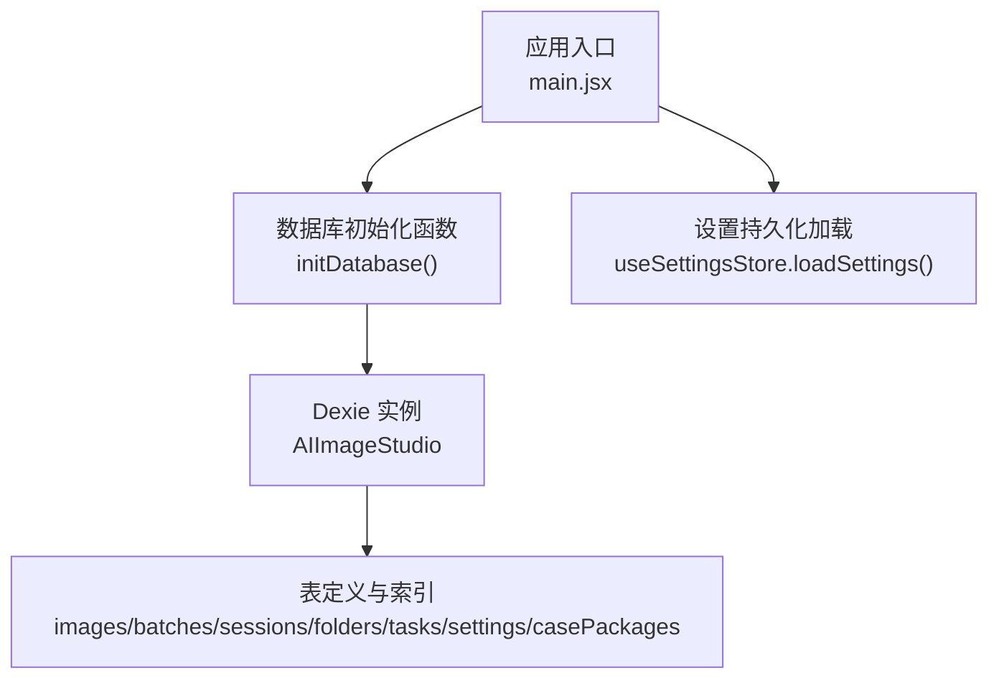
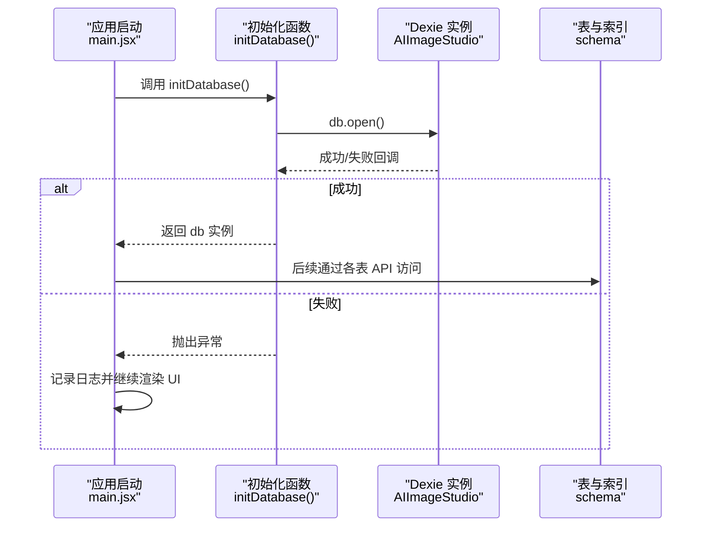
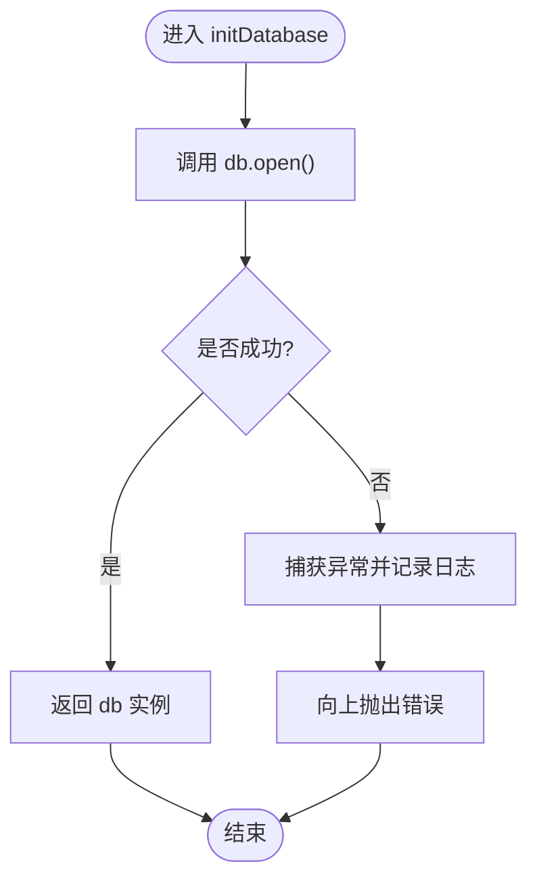
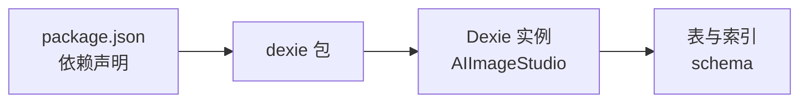

# 数据库初始化与迁移

<cite>
**本文引用的文件**   
- [database.js](file://app/src/db/database.js)
- [main.jsx](file://app/src/main.jsx)
- [package.json](file://app/package.json)
</cite>

## 目录
1. [简介](#简介)
2. [项目结构](#项目结构)
3. [核心组件](#核心组件)
4. [架构总览](#架构总览)
5. [详细组件分析](#详细组件分析)
6. [依赖关系分析](#依赖关系分析)
7. [性能考量](#性能考量)
8. [故障排查指南](#故障排查指南)
9. [结论](#结论)
10. [附录](#附录)

## 简介
本文件面向 AI Image Studio 的前端 IndexedDB 层，聚焦于数据库初始化、版本管理与迁移策略、连接管理、异常恢复、备份与恢复、环境差异与健康监控等主题。当前实现基于 Dexie.js（IndexedDB 封装），在应用启动时打开数据库并执行必要的迁移；同时提供对主要数据表的增删改查接口。

## 项目结构
与数据库相关的关键位置如下：
- 数据库定义与 API：app/src/db/database.js
- 应用启动入口：app/src/main.jsx
- 依赖声明：app/package.json（包含 dexie 版本）

图表来源
- [main.jsx:12-22](file://app/src/main.jsx#L12-L22)
- [database.js:20-31](file://app/src/db/database.js#L20-L31)
- [database.js:327-336](file://app/src/db/database.js#L327-L336)

章节来源
- [main.jsx:1-32](file://app/src/main.jsx#L1-32)
- [database.js:1-338](file://app/src/db/database.js#L1-338)
- [package.json:1-29](file://app/package.json#L1-L29)

## 核心组件
- 数据库实例与版本：使用 Dexie 创建名为 AIImageStudio 的数据库实例，并通过 db.version(1).stores(...) 声明表结构与索引。
- 初始化函数 initDatabase：负责打开数据库并触发迁移（如有）。
- 业务 API：围绕 images、batches、sessions、folders、tasks、settings、casePackages 七张表提供常用读写方法。

章节来源
- [database.js:20-31](file://app/src/db/database.js#L20-L31)
- [database.js:327-336](file://app/src/db/database.js#L327-L336)

## 架构总览
下图展示了从应用启动到数据库可用的关键流程，以及错误处理路径。

图表来源
- [main.jsx:12-22](file://app/src/main.jsx#L12-L22)
- [database.js:327-336](file://app/src/db/database.js#L327-L336)

## 详细组件分析

### 初始化函数 initDatabase 的工作流与错误处理
- 工作流
  - 在应用启动阶段被调用，内部调用 Dexie 实例的 open 方法。
  - 若存在更高版本的 schema 定义，Dexie 会在 open 过程中自动执行迁移。
  - 成功后返回 db 实例供上层使用。
- 错误处理
  - 捕获 open 抛出的异常，记录错误日志后向上抛出。
  - 上层 main.jsx 捕获该异常，打印日志并继续渲染 UI，保证应用可用性。

图表来源
- [database.js:327-336](file://app/src/db/database.js#L327-L336)
- [main.jsx:12-22](file://app/src/main.jsx#L12-L22)

章节来源
- [database.js:327-336](file://app/src/db/database.js#L327-L336)
- [main.jsx:12-22](file://app/src/main.jsx#L12-L22)

### Dexie.js 版本管理与迁移策略
- 版本声明
  - 当前代码仅声明了 version(1) 及对应 stores 定义。
- 迁移机制
  - Dexie 在首次打开或检测到本地版本低于声明版本时，会按顺序执行迁移逻辑。
  - 当需要新增字段或索引时，应递增版本号并在对应版本块中编写迁移脚本（例如添加新表、修改索引、数据回填等）。
- 建议实践
  - 每次变更 schema 都递增版本号，保持幂等迁移。
  - 迁移内避免长时间阻塞，必要时分步提交事务。
  - 为复杂迁移增加回滚策略或兼容读取逻辑。

章节来源
- [database.js:20-31](file://app/src/db/database.js#L20-L31)

### 数据库连接管理、连接池配置与异常恢复
- 连接管理
  - 采用单例 Dexie 实例，全局共享。
  - 通过 initDatabase 统一打开，避免重复 open 带来的竞争条件。
- 连接池
  - Dexie 底层基于浏览器 IndexedDB，无显式连接池概念；并发由浏览器引擎调度。
- 异常恢复
  - 初始化失败时，UI 仍可渲染，但后续 DB 操作可能失败。
  - 建议在业务层对关键读写进行 try/catch 兜底，并提供降级体验（如提示用户清理存储空间或重试）。

章节来源
- [database.js:327-336](file://app/src/db/database.js#L327-L336)
- [main.jsx:12-22](file://app/src/main.jsx#L12-L22)

### 数据库备份与恢复操作指南
说明：当前仓库未提供内置的备份/恢复实现。以下为通用方案建议（概念性指导，非现有代码）：
- 导出备份
  - 遍历所有表，将数据序列化为 JSON 字符串，打包下载。
  - 可结合 settings 表导出应用配置，便于一键迁移。
- 导入恢复
  - 解析上传的备份文件，校验数据结构与版本兼容性。
  - 开启事务批量写入目标库，失败则整体回滚。
- 增量备份
  - 利用 createdAt 等时间戳字段，定期导出增量数据。
- 注意事项
  - 大对象（如图片 URL/缩略图）建议只备份元数据，实际资源走对象存储。
  - 备份前关闭正在进行的长事务，避免不一致快照。

[本节为概念性内容，不直接分析具体文件]

### 开发环境与生产环境的数据库配置差异
- 数据库名称
  - 当前固定为 AIImageStudio。如需隔离不同环境，可在构建期注入环境变量以生成不同的数据库名。
- 版本与迁移
  - 开发环境可频繁升级版本验证迁移；生产环境需严格灰度与回滚策略。
- 日志与监控
  - 开发环境可输出更详细的调试信息；生产环境建议收敛日志级别，接入埋点。
- 存储配额与容量
  - 生产环境需关注用户磁盘配额与冷/热分区策略，避免超出限制导致写入失败。

[本节为概念性内容，不直接分析具体文件]

### 健康检查与监控指标的实现方法
说明：当前仓库未提供专门的数据库健康检查模块。以下为可落地的实现思路（概念性指导，非现有代码）：
- 健康检查
  - 定时执行一次轻量读写（如读取 settings 表某键），统计成功率与耗时。
  - 暴露一个内部状态对象，汇总最近 N 次检查结果。
- 监控指标
  - 记录关键操作的延迟分布（P50/P95/P99）、错误率、失败原因分类。
  - 聚合统计：表行数、热点/冷态数据占比、任务队列积压等。
- 告警与降级
  - 连续失败超过阈值时触发告警，并切换至只读或缓存模式。
  - 提供“重试”和“重置”按钮，引导用户修复常见环境问题（如存储空间不足）。

[本节为概念性内容，不直接分析具体文件]

## 依赖关系分析
- 运行时依赖
  - dexie：IndexedDB 封装库，用于声明 schema、版本迁移与事务。
- 版本信息
  - package.json 中声明 dexie 的版本范围，确保构建产物一致。

图表来源
- [package.json:11-22](file://app/package.json#L11-L22)
- [database.js:20-31](file://app/src/db/database.js#L20-L31)

章节来源
- [package.json:1-29](file://app/package.json#L1-L29)
- [database.js:20-31](file://app/src/db/database.js#L20-L31)

## 性能考量
- 索引设计
  - 复合索引与排序字段已在 schema 中声明，查询时应尽量命中索引以减少全表扫描。
- 分页与限流
  - 列表查询支持 limit/offset，注意大数据量下的内存占用。
- 批量操作
  - 使用 bulkUpdate/bulkDelete 减少事务次数，提高吞吐。
- 冷热分层
  - 通过 storageZone 字段区分热/冷数据，配合前端展示与后端存储策略优化 IO。

章节来源
- [database.js:22-31](file://app/src/db/database.js#L22-L31)
- [database.js:56-76](file://app/src/db/database.js#L56-L76)
- [database.js:123-127](file://app/src/db/database.js#L123-L127)

## 故障排查指南
- 常见问题定位
  - 初始化失败：检查浏览器是否禁用 IndexedDB、存储空间是否不足、跨域/安全策略是否拦截。
  - 迁移失败：确认版本号递增与迁移脚本幂等性，查看控制台错误堆栈。
  - 写入失败：检查唯一约束冲突、索引类型不匹配、对象大小超限。
- 快速自检步骤
  - 在控制台执行数据库打开与简单查询，观察是否报错。
  - 对比当前 schema 与已部署版本，确认迁移是否完整。
  - 清理站点数据后重试，排除脏数据干扰。
- 日志与上报
  - 记录关键错误上下文（表名、操作、参数、错误码）。
  - 将错误分类上报，便于追踪趋势与根因。

章节来源
- [database.js:327-336](file://app/src/db/database.js#L327-L336)
- [main.jsx:12-22](file://app/src/main.jsx#L12-L22)

## 结论
当前实现以 Dexie.js 为核心，提供了稳定的数据库初始化与基础 CRUD 能力。建议在后续迭代中完善版本迁移脚本、备份恢复工具与健康监控模块，以提升系统的可维护性与可靠性。

## 附录
- 相关入口与依赖
  - 初始化入口：main.jsx
  - 数据库层：database.js
  - 依赖版本：package.json

章节来源
- [main.jsx:1-32](file://app/src/main.jsx#L1-32)
- [database.js:1-338](file://app/src/db/database.js#L1-338)
- [package.json:1-29](file://app/package.json#L1-L29)