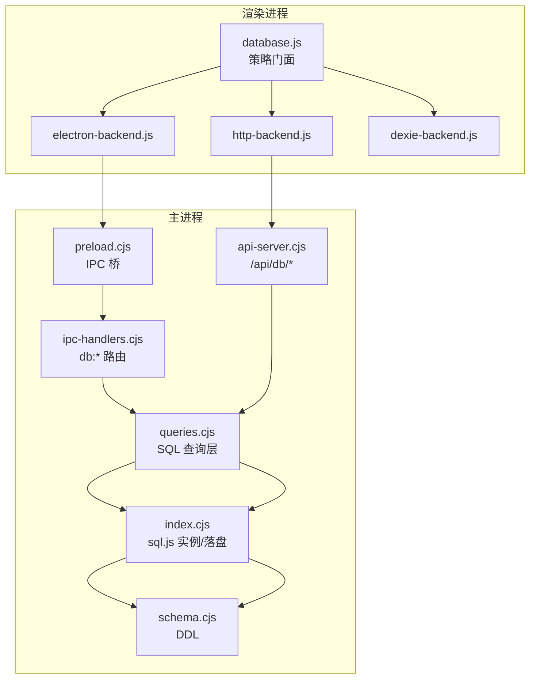
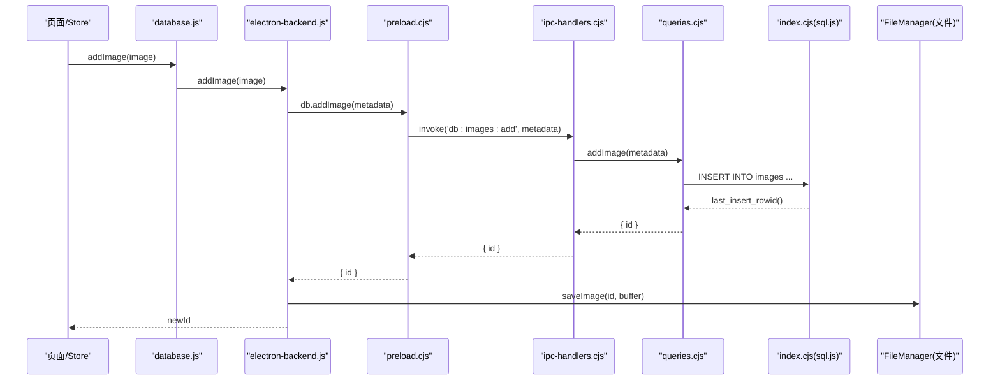
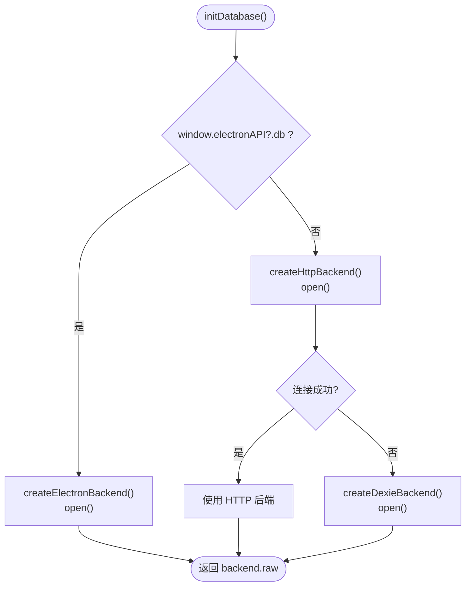
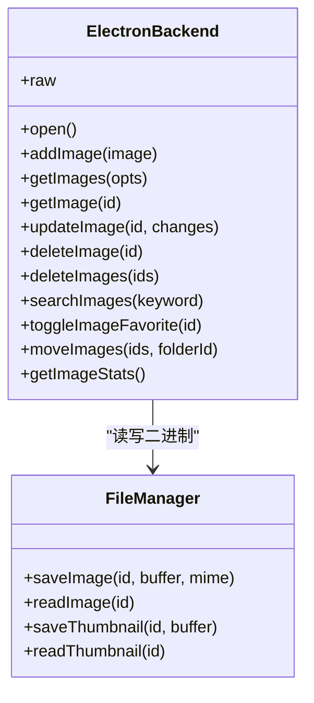
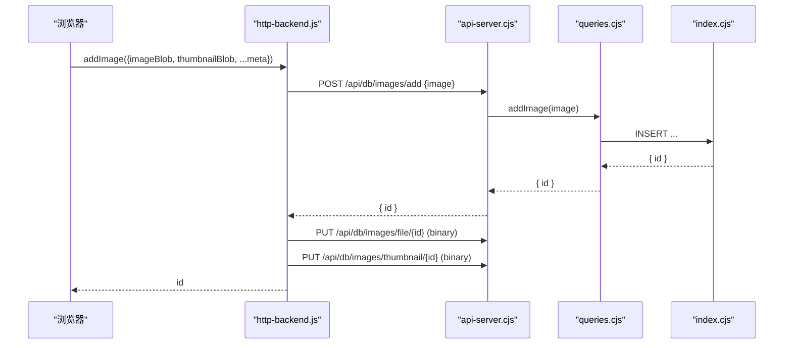
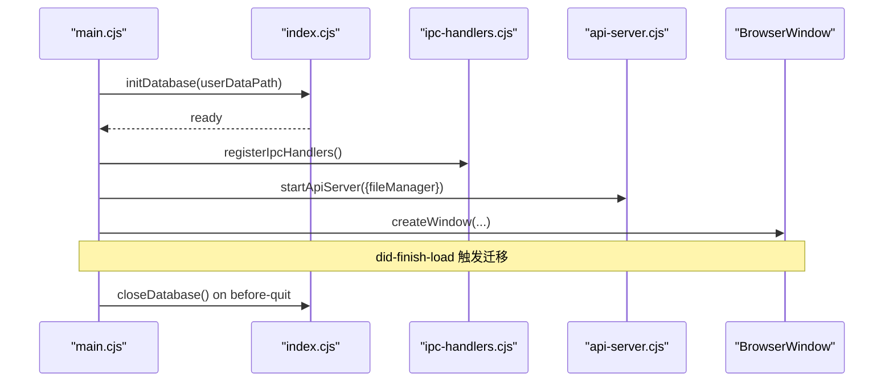
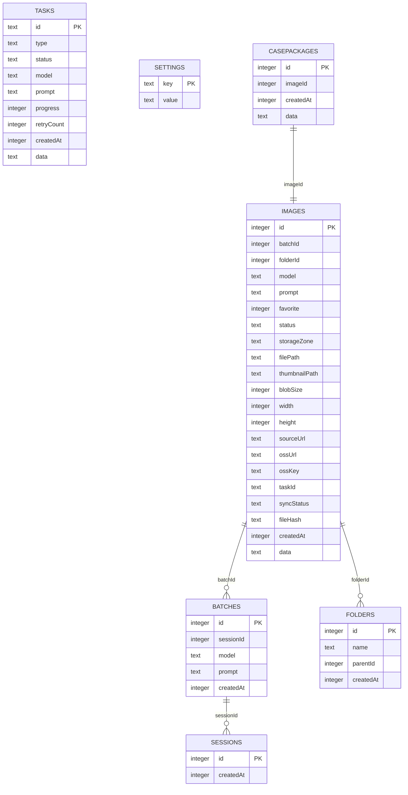
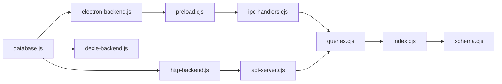

# 数据库诊断工具

<cite>
**本文引用的文件**   
- [README.md](file://README.md)
- [package.json](file://app/package.json)
- [database.js](file://app/src/db/database.js)
- [dexie-backend.js](file://app/src/db/dexie-backend.js)
- [electron-backend.js](file://app/src/db/electron-backend.js)
- [http-backend.js](file://app/src/db/http-backend.js)
- [index.cjs](file://app/electron/database/index.cjs)
- [schema.cjs](file://app/electron/database/schema.cjs)
- [queries.cjs](file://app/electron/database/queries.cjs)
- [main.cjs](file://app/electron/main.cjs)
- [preload.cjs](file://app/electron/preload.cjs)
- [ipc-handlers.cjs](file://app/electron/ipc-handlers.cjs)
- [api-server.cjs](file://app/electron/api-server.cjs)
- [_check_db.cjs](file://app/_check_db.cjs)
</cite>

## 目录
1. [简介](#简介)
2. [项目结构](#项目结构)
3. [核心组件](#核心组件)
4. [架构总览](#架构总览)
5. [详细组件分析](#详细组件分析)
6. [依赖关系分析](#依赖关系分析)
7. [性能与可靠性](#性能与可靠性)
8. [故障排查指南](#故障排查指南)
9. [结论](#结论)
10. [附录：诊断清单与命令](#附录：诊断清单与命令)

## 简介
本项目为 AI 图像工作站的本地持久化层，采用“策略模式”统一抽象数据库后端，在 Electron 环境下通过 IPC 访问 SQLite（sql.js），在浏览器模式下可回退到 Dexie/IndexedDB，或通过内置 HTTP API 访问同一 SQLite。本“数据库诊断工具”文档聚焦于数据层初始化、路由选择、IPC/HTTP 桥接、SQLite 模式与查询实现、以及迁移与诊断能力，帮助快速定位与解决数据读写、同步、序列化等常见问题。

## 项目结构
- 前端数据库门面与后端适配
  - database.js：统一入口，按运行环境选择后端并暴露一致 API
  - electron-backend.js：Electron 下通过 IPC 调用主进程 SQLite
  - dexie-backend.js：浏览器无 Electron 时回退至 IndexedDB
  - http-backend.js：浏览器通过 /api/db/* 访问主进程 SQLite
- 主进程与底层存储
  - main.cjs：应用启动、数据库初始化、API 服务器、OSS 同步、窗口创建
  - preload.cjs：向渲染进程安全暴露 db/fs/oss 等 IPC 接口
  - ipc-handlers.cjs：将 db:* 通道映射到 queries.cjs 函数
  - api-server.cjs：内嵌 HTTP 服务，提供 /api/db/* REST 路由
  - index.cjs：sql.js 实例管理、WAL 尝试、延迟落盘、关闭清理
  - schema.cjs：SQLite DDL（7 张表 + 索引）
  - queries.cjs：SQL 查询层，镜像 database.js 的导出函数
- 诊断与迁移
  - _check_db.cjs：独立脚本读取用户目录下的 SQLite 文件，输出关键统计
  - migration.cjs：首次启动时将 IndexedDB 数据迁移到 SQLite（不在本节展开）

**图表来源** 
- [database.js:1-46](file://app/src/db/database.js#L1-L46)
- [electron-backend.js:1-44](file://app/src/db/electron-backend.js#L1-L44)
- [http-backend.js:1-82](file://app/src/db/http-backend.js#L1-L82)
- [dexie-backend.js:1-28](file://app/src/db/dexie-backend.js#L1-L28)
- [preload.cjs:1-50](file://app/electron/preload.cjs#L1-L50)
- [ipc-handlers.cjs:1-63](file://app/electron/ipc-handlers.cjs#L1-L63)
- [queries.cjs:1-120](file://app/electron/database/queries.cjs#L1-L120)
- [index.cjs:1-45](file://app/electron/database/index.cjs#L1-L45)
- [schema.cjs:1-40](file://app/electron/database/schema.cjs#L1-L40)
- [api-server.cjs:182-210](file://app/electron/api-server.cjs#L182-L210)

**章节来源**
- [README.md:1-10](file://README.md#L1-L10)
- [package.json:1-43](file://app/package.json#L1-L43)

## 核心组件
- 数据库门面（strategy 模式）
  - initDatabase() 自动选择后端：Electron IPC → HTTP → Dexie
  - 统一导出 images/batches/sessions/folders/tasks/settings/casePackages 操作
- 后端实现
  - Electron 后端：IPC 调用主进程 SQL 查询，合并文件系统 blob 加载
  - HTTP 后端：REST 调用 /api/db/*，二进制分两步上传/下载
  - Dexie 后端：IndexedDB 直读直写，兼容字段名差异
- 主进程存储
  - sql.js 实例管理、WAL 尝试、300ms 防抖落盘、优雅关闭
  - 查询层封装：动态条件、JSON data 列打包/解包、批量更新
- 诊断与迁移
  - 独立脚本直接读取 ai-image-studio.db，打印表结构与计数
  - 首次启动迁移：IndexedDB → SQLite + 图片文件落地

**章节来源**
- [database.js:26-46](file://app/src/db/database.js#L26-L46)
- [electron-backend.js:41-168](file://app/src/db/electron-backend.js#L41-L168)
- [http-backend.js:75-180](file://app/src/db/http-backend.js#L75-L180)
- [dexie-backend.js:24-120](file://app/src/db/dexie-backend.js#L24-L120)
- [index.cjs:19-75](file://app/electron/database/index.cjs#L19-L75)
- [queries.cjs:122-318](file://app/electron/database/queries.cjs#L122-L318)
- [_check_db.cjs:1-28](file://app/_check_db.cjs#L1-L28)

## 架构总览

**图表来源** 
- [database.js:48-58](file://app/src/db/database.js#L48-L58)
- [electron-backend.js:48-69](file://app/src/db/electron-backend.js#L48-L69)
- [preload.cjs:12-23](file://app/electron/preload.cjs#L12-L23)
- [ipc-handlers.cjs:12-15](file://app/electron/ipc-handlers.cjs#L12-L15)
- [queries.cjs:122-163](file://app/electron/database/queries.cjs#L122-L163)
- [index.cjs:19-45](file://app/electron/database/index.cjs#L19-L45)

## 详细组件分析

### 数据库门面与后端选择
- 选择优先级
  - 若 window.electronAPI?.db 存在 → Electron IPC 后端
  - 否则尝试 HTTP 后端（需 api-server 运行）
  - 失败则回退 Dexie/IndexedDB
- 返回 raw 实例用于遗留直表访问（Dexie 模式为 Dexie 实例；Electron 模式为兼容代理）

**图表来源** 
- [database.js:26-46](file://app/src/db/database.js#L26-L46)

**章节来源**
- [database.js:16-46](file://app/src/db/database.js#L16-L46)

### Electron IPC 后端
- 职责
  - 分离 metadata 与二进制，先写入 SQLite，再保存 image/thumbnail 到文件系统
  - getImages/getImage 从文件系统回填 thumbnailBlob/imageBlob 与 URL
  - 对状态过滤进行 Dexie 语义对齐（默认排除 pending/failed）
- 返回值归一化：确保与 Dexie 行为一致（如自增 ID 类型）

**图表来源** 
- [electron-backend.js:48-168](file://app/src/db/electron-backend.js#L48-L168)

**章节来源**
- [electron-backend.js:1-44](file://app/src/db/electron-backend.js#L1-L44)
- [electron-backend.js:48-168](file://app/src/db/electron-backend.js#L48-L168)

### HTTP 后端（浏览器访问 SQLite）
- 职责
  - 通过 /api/db/* 调用主进程 SQLite
  - 二进制采用两步：POST 元数据 → PUT 原始二进制
  - 读取二进制 GET /api/db/images/file/:id 与 /thumbnail/:id
- 错误处理
  - 非 2xx 响应解析 JSON 错误体并抛出 Error

**图表来源** 
- [http-backend.js:86-103](file://app/src/db/http-backend.js#L86-L103)
- [api-server.cjs:199-210](file://app/electron/api-server.cjs#L199-L210)
- [api-server.cjs:273-290](file://app/electron/api-server.cjs#L273-L290)
- [queries.cjs:122-163](file://app/electron/database/queries.cjs#L122-L163)

**章节来源**
- [http-backend.js:1-82](file://app/src/db/http-backend.js#L1-L82)
- [http-backend.js:86-180](file://app/src/db/http-backend.js#L86-L180)
- [api-server.cjs:182-210](file://app/electron/api-server.cjs#L182-L210)

### Dexie 后端（IndexedDB）
- 职责
  - 定义版本与索引，提供与 SQLite/Electron 一致的 API
  - 默认过滤 pending/failed 状态（除非 includeAllStatus=true）
- 兼容性
  - 字段名与统计结果做最小归一化处理

**章节来源**
- [dexie-backend.js:10-28](file://app/src/db/dexie-backend.js#L10-L28)
- [dexie-backend.js:41-120](file://app/src/db/dexie-backend.js#L41-L120)

### 主进程：数据库生命周期与 IPC/HTTP 路由
- 启动顺序
  - 初始化 SQLite（加载或新建，执行 DDL，立即落盘）
  - 注册 IPC 处理器（db:* 映射到 queries.cjs）
  - 启动 API 服务器（/api/db/* 映射到 queries.cjs）
  - 创建主窗口，并在首次加载后触发迁移
- 关闭流程
  - 停止 OSS 同步、保存数据库、关闭 sql.js 实例

**图表来源** 
- [main.cjs:70-118](file://app/electron/main.cjs#L70-L118)
- [index.cjs:19-45](file://app/electron/database/index.cjs#L19-L45)
- [ipc-handlers.cjs:10-63](file://app/electron/ipc-handlers.cjs#L10-L63)
- [api-server.cjs:575-603](file://app/electron/api-server.cjs#L575-L603)

**章节来源**
- [main.cjs:70-118](file://app/electron/main.cjs#L70-L118)
- [index.cjs:19-90](file://app/electron/database/index.cjs#L19-L90)
- [ipc-handlers.cjs:10-63](file://app/electron/ipc-handlers.cjs#L10-L63)
- [api-server.cjs:575-603](file://app/electron/api-server.cjs#L575-L603)

### SQLite 模式与查询层
- 模式要点
  - 7 张表：images、batches、sessions、folders、tasks、settings、casePackages
  - 常用索引：folderId+createdAt、model、favorite、status、batchId、storageZone、parentId、status+createdAt、imageId
- 查询层特性
  - images.data 列存放非索引字段（JSON），写入时打包、读取时解包合并
  - 动态 UPDATE 仅更新变更字段，避免覆盖未传字段
  - 批量删除/移动优化占位符拼接
  - 统计聚合：images 按 zone 与 favorite 汇总；tasks 按 status 分组

**图表来源** 
- [schema.cjs:6-111](file://app/electron/database/schema.cjs#L6-L111)

**章节来源**
- [schema.cjs:6-111](file://app/electron/database/schema.cjs#L6-L111)
- [queries.cjs:122-318](file://app/electron/database/queries.cjs#L122-L318)
- [queries.cjs:573-608](file://app/electron/database/queries.cjs#L573-L608)
- [queries.cjs:614-701](file://app/electron/database/queries.cjs#L614-L701)

## 依赖关系分析
- 模块耦合
  - database.js 仅依赖三个后端工厂，零业务耦合
  - electron-backend.js 依赖 preload.cjs 暴露的 db/fs 接口
  - http-backend.js 依赖 api-server.cjs 提供的 /api/db/*
  - ipc-handlers.cjs 与 queries.cjs 强绑定，负责 IPC→SQL 映射
  - index.cjs 与 schema.cjs 组合完成初始化与持久化
- 外部依赖
  - sql.js（WASM SQLite）、Dexie（IndexedDB）、axios/fetch（HTTP）

**图表来源** 
- [database.js:12-17](file://app/src/db/database.js#L12-L17)
- [electron-backend.js:8-10](file://app/src/db/electron-backend.js#L8-L10)
- [http-backend.js:15-26](file://app/src/db/http-backend.js#L15-L26)
- [ipc-handlers.cjs:6-8](file://app/electron/ipc-handlers.cjs#L6-L8)
- [queries.cjs:6-7](file://app/electron/database/queries.cjs#L6-L7)
- [index.cjs:6-9](file://app/electron/database/index.cjs#L6-L9)
- [schema.cjs:1-5](file://app/electron/database/schema.cjs#L1-L5)
- [api-server.cjs:575-586](file://app/electron/api-server.cjs#L575-L586)

**章节来源**
- [package.json:19-33](file://app/package.json#L19-L33)

## 性能与可靠性
- 写入落盘
  - 300ms 防抖合并多次写入，减少频繁磁盘 I/O
  - 关闭前强制 flush 并关闭 sql.js 实例，降低数据丢失风险
- WAL 模式
  - 尝试启用 PRAGMA journal_mode=WAL，提升并发读性能（sql.js 可能不支持，已容错）
- 查询优化
  - images 多字段索引，folderId+createdAt 复合索引支持分页排序
  - tasks.status+createdAt 复合索引加速任务列表
  - JSON data 列避免过度拆分表结构，兼顾扩展性
- 网络与二进制
  - HTTP 后端分步上传/下载，避免单次请求过大
  - 浏览器端按需加载缩略图，减少首屏压力

[本节为通用指导，不直接分析具体文件]

## 故障排查指南
- 无法连接 SQLite（Electron 模式）
  - 检查 preload.cjs 是否注入 electronAPI.db
  - 确认 ipc-handlers.cjs 已注册对应 db:* 通道
  - 查看 index.cjs 初始化日志与异常
- 无法连接 SQLite（浏览器模式）
  - 确认 api-server.cjs 已启动且端口可达
  - 检查 http-backend.js open() 探测 /api/db/settings/getAll 是否成功
- 图片缺失或缩略图不显示
  - 确认 electron-backend.js 在 getImages/getImage 中正确附加 thumbnailBlob/imageBlob
  - 检查 api-server.cjs 的 /images/file/:id 与 /images/thumbnail/:id 路由
- 数据不一致或字段丢失
  - 检查 queries.cjs 的 packImageData/unpackImageRow 与 buildImageUpdateClauses 逻辑
  - 核对 schema.cjs 的列定义与索引
- 需要离线诊断
  - 使用 _check_db.cjs 直接读取 ai-image-studio.db，输出表结构与计数

**章节来源**
- [preload.cjs:10-50](file://app/electron/preload.cjs#L10-L50)
- [ipc-handlers.cjs:10-63](file://app/electron/ipc-handlers.cjs#L10-L63)
- [index.cjs:19-75](file://app/electron/database/index.cjs#L19-L75)
- [http-backend.js:75-82](file://app/src/db/http-backend.js#L75-L82)
- [electron-backend.js:71-118](file://app/src/db/electron-backend.js#L71-L118)
- [api-server.cjs:273-316](file://app/electron/api-server.cjs#L273-L316)
- [queries.cjs:36-71](file://app/electron/database/queries.cjs#L36-L71)
- [queries.cjs:90-116](file://app/electron/database/queries.cjs#L90-L116)
- [schema.cjs:6-111](file://app/electron/database/schema.cjs#L6-L111)
- [_check_db.cjs:1-28](file://app/_check_db.cjs#L1-L28)

## 结论
该数据层以策略模式屏蔽了不同运行环境的差异，提供了统一的数据库 API。Electron 模式通过 IPC 访问 SQLite，具备完善的二进制文件管理与延迟落盘机制；浏览器模式可通过 HTTP 复用同一 SQLite，或在无服务端时回退到 IndexedDB。结合模式与查询层的精心设计，系统在可扩展性与性能之间取得良好平衡。配合诊断脚本与迁移能力，便于在生产环境中快速定位问题与平滑升级。

[本节为总结性内容，不直接分析具体文件]

## 附录：诊断清单与命令
- 验证数据库后端选择
  - 打开控制台，观察 [DB] Using ... 日志
- 检查 SQLite 文件是否存在与可读
  - 运行 _check_db.cjs，查看表结构与记录数
- 校验 API 可用性（浏览器模式）
  - 访问 /api/db/settings/getAll，确认返回设置对象
- 常见路径与端口
  - 开发期 API 端口：19527（由 main.cjs 指定）
  - 数据库文件：userData/ai-image-studio.db

**章节来源**
- [database.js:30-43](file://app/src/db/database.js#L30-L43)
- [_check_db.cjs:1-28](file://app/_check_db.cjs#L1-L28)
- [main.cjs:98-104](file://app/electron/main.cjs#L98-L104)