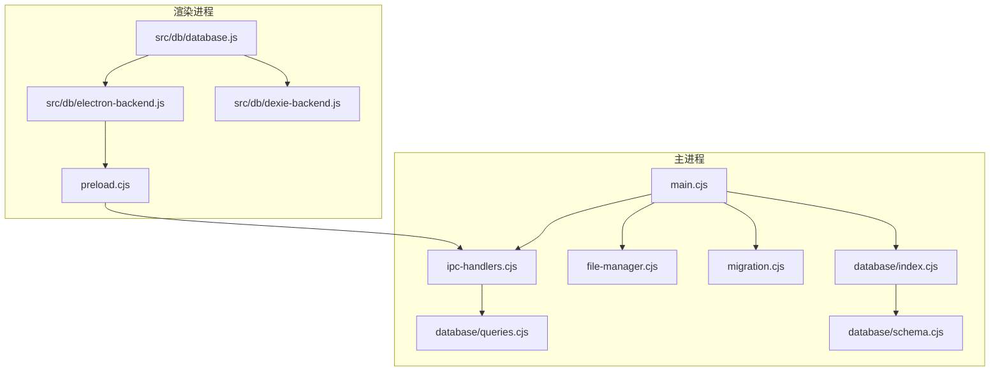
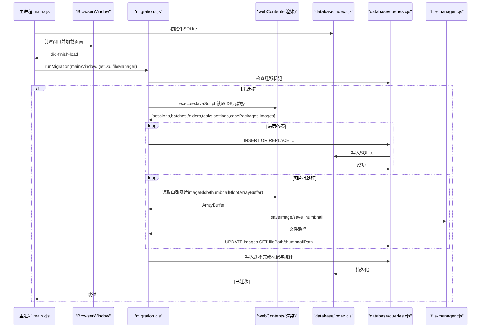
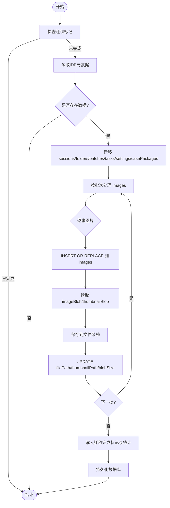
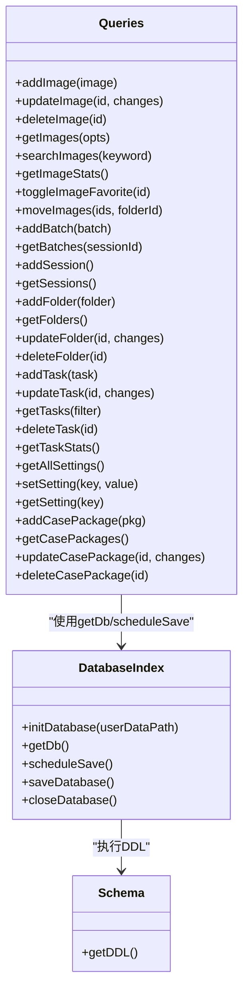
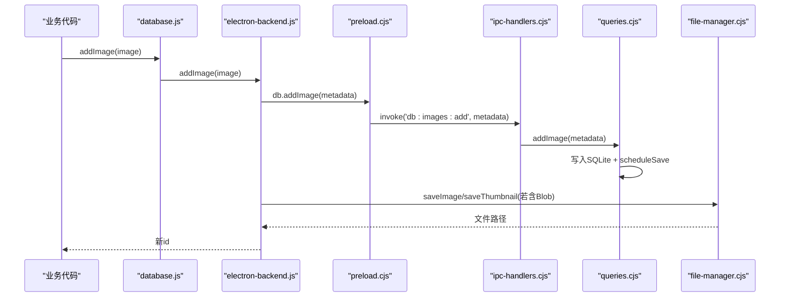
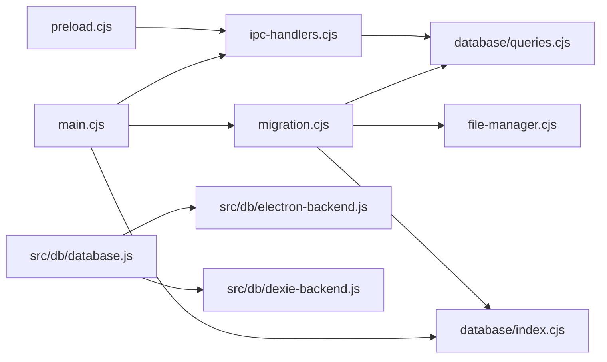

# 数据迁移系统

<cite>
**本文引用的文件**   
- [app/electron/migration.cjs](file://app/electron/migration.cjs)
- [app/electron/database/index.cjs](file://app/electron/database/index.cjs)
- [app/electron/database/schema.cjs](file://app/electron/database/schema.cjs)
- [app/electron/database/queries.cjs](file://app/electron/database/queries.cjs)
- [app/src/db/database.js](file://app/src/db/database.js)
- [app/src/db/electron-backend.js](file://app/src/db/electron-backend.js)
- [app/src/db/dexie-backend.js](file://app/src/db/dexie-backend.js)
- [app/electron/main.cjs](file://app/electron/main.cjs)
- [app/electron/preload.cjs](file://app/electron/preload.cjs)
- [app/electron/ipc-handlers.cjs](file://app/electron/ipc-handlers.cjs)
- [app/electron/file-manager.cjs](file://app/electron/file-manager.cjs)
</cite>

## 目录
1. [简介](#简介)
2. [项目结构](#项目结构)
3. [核心组件](#核心组件)
4. [架构总览](#架构总览)
5. [详细组件分析](#详细组件分析)
6. [依赖关系分析](#依赖关系分析)
7. [性能考量](#性能考量)
8. [故障排查指南](#故障排查指南)
9. [结论](#结论)

## 简介
本仓库实现了一个“IndexedDB → SQLite + 文件系统”的一次性数据迁移系统，用于在 Electron 首次启动时将浏览器端 Dexie（IndexedDB）中的元数据与图片二进制迁移到主进程内的 SQLite 数据库与本地文件系统。迁移过程：
- 通过渲染进程的 IndexedDB 读取所有表元数据（不含 Blob），再逐条写入 SQLite；
- 对 images 表的图片与缩略图 Blob，按批次从 IndexedDB 读取并持久化到文件系统，同时更新对应记录的 filePath/thumbnailPath 等字段；
- 迁移完成后写入标记设置项，避免重复执行；
- 迁移失败不阻止应用启动，保留 IndexedDB 作为回退。

该迁移系统与现有前端数据库抽象层（database.js）无缝集成，在 Electron 环境下自动选择 SQLite 后端，在浏览器环境下使用 Dexie 后端。

## 项目结构
与迁移相关的核心代码分布在以下位置：
- 迁移编排与流程控制：app/electron/migration.cjs
- SQLite 初始化、持久化与查询封装：app/electron/database/*
- 前端数据库策略门面与后端适配：app/src/db/*
- 主进程入口与迁移触发时机：app/electron/main.cjs
- IPC 桥接与预加载安全暴露：app/electron/preload.cjs, app/electron/ipc-handlers.cjs
- 文件系统存储层（原图/缩略图/导入图）：app/electron/file-manager.cjs

图表来源
- [app/electron/main.cjs:1-126](file://app/electron/main.cjs#L1-L126)
- [app/electron/database/index.cjs:1-93](file://app/electron/database/index.cjs#L1-L93)
- [app/electron/database/schema.cjs:1-115](file://app/electron/database/schema.cjs#L1-L115)
- [app/electron/database/queries.cjs:1-721](file://app/electron/database/queries.cjs#L1-L721)
- [app/electron/file-manager.cjs:1-196](file://app/electron/file-manager.cjs#L1-L196)
- [app/electron/migration.cjs:1-352](file://app/electron/migration.cjs#L1-L352)
- [app/electron/preload.cjs:1-82](file://app/electron/preload.cjs#L1-L82)
- [app/electron/ipc-handlers.cjs:1-63](file://app/electron/ipc-handlers.cjs#L1-L63)
- [app/src/db/database.js:1-98](file://app/src/db/database.js#L1-L98)
- [app/src/db/electron-backend.js:1-331](file://app/src/db/electron-backend.js#L1-L331)
- [app/src/db/dexie-backend.js:1-310](file://app/src/db/dexie-backend.js#L1-L310)

章节来源
- [app/electron/main.cjs:1-126](file://app/electron/main.cjs#L1-L126)
- [app/electron/migration.cjs:1-352](file://app/electron/migration.cjs#L1-L352)
- [app/electron/database/index.cjs:1-93](file://app/electron/database/index.cjs#L1-L93)
- [app/electron/database/schema.cjs:1-115](file://app/electron/database/schema.cjs#L1-L115)
- [app/electron/database/queries.cjs:1-721](file://app/electron/database/queries.cjs#L1-L721)
- [app/src/db/database.js:1-98](file://app/src/db/database.js#L1-L98)
- [app/src/db/electron-backend.js:1-331](file://app/src/db/electron-backend.js#L1-L331)
- [app/src/db/dexie-backend.js:1-310](file://app/src/db/dexie-backend.js#L1-L310)
- [app/electron/preload.cjs:1-82](file://app/electron/preload.cjs#L1-L82)
- [app/electron/ipc-handlers.cjs:1-63](file://app/electron/ipc-handlers.cjs#L1-L63)
- [app/electron/file-manager.cjs:1-196](file://app/electron/file-manager.cjs#L1-L196)

## 核心组件
- 迁移编排器（migration.cjs）
  - 负责检测是否已迁移、读取 IDB 元数据、分批写入 SQLite、处理图片/缩略图 Blob 落盘、记录迁移统计与完成标记。
- SQLite 数据库层（database/index.cjs + schema.cjs + queries.cjs）
  - index.cjs：sql.js 初始化、WAL 模式尝试、持久化与关闭；
  - schema.cjs：定义 images/batches/sessions/folders/tasks/settings/casePackages 七张表及索引；
  - queries.cjs：提供与前端一致的 30+ 个导出函数，统一打包 JSON data 列、去抖持久化、结果解包。
- 前端数据库门面（src/db/database.js）
  - 根据运行环境选择 electron-backend 或 dexie-backend，对外暴露一致 API。
- Electron 后端适配（src/db/electron-backend.js）
  - 将前端调用转为 IPC 调用，并在需要时读写文件系统（Blob 持久化）。
- 预加载与 IPC 桥（preload.cjs + ipc-handlers.cjs）
  - 向渲染进程暴露 db/fs 能力，映射到主进程 handlers。
- 文件系统存储（file-manager.cjs）
  - 管理 originals/thumbnails/imports 三类文件，提供读写删与统计接口。

章节来源
- [app/electron/migration.cjs:1-352](file://app/electron/migration.cjs#L1-L352)
- [app/electron/database/index.cjs:1-93](file://app/electron/database/index.cjs#L1-L93)
- [app/electron/database/schema.cjs:1-115](file://app/electron/database/schema.cjs#L1-L115)
- [app/electron/database/queries.cjs:1-721](file://app/electron/database/queries.cjs#L1-L721)
- [app/src/db/database.js:1-98](file://app/src/db/database.js#L1-L98)
- [app/src/db/electron-backend.js:1-331](file://app/src/db/electron-backend.js#L1-L331)
- [app/electron/preload.cjs:1-82](file://app/electron/preload.cjs#L1-L82)
- [app/electron/ipc-handlers.cjs:1-63](file://app/electron/ipc-handlers.cjs#L1-L63)
- [app/electron/file-manager.cjs:1-196](file://app/electron/file-manager.cjs#L1-L196)

## 架构总览
迁移系统在应用启动后、页面首次加载完成时触发，整体流程如下：

图表来源
- [app/electron/main.cjs:45-56](file://app/electron/main.cjs#L45-L56)
- [app/electron/migration.cjs:160-349](file://app/electron/migration.cjs#L160-L349)
- [app/electron/database/index.cjs:19-45](file://app/electron/database/index.cjs#L19-L45)
- [app/electron/database/queries.cjs:122-163](file://app/electron/database/queries.cjs#L122-L163)
- [app/electron/file-manager.cjs:34-73](file://app/electron/file-manager.cjs#L34-L73)

## 详细组件分析

### 迁移编排器（migration.cjs）
- 关键职责
  - 读取 IndexedDB 名称为 AIImageStudio 的所有对象存储，仅获取非 Blob 元数据；
  - 按表顺序插入 SQLite，保持原始 id（images 使用 INSERT OR REPLACE 绕过自增冲突）；
  - 图片与缩略图以 IMAGE_BATCH_SIZE=10 分批处理，逐条读取 ArrayBuffer 并写入文件系统，随后更新 filePath/thumbnailPath 与 blobSize；
  - tasks/settings/casePackages 的扩展字段统一打包进 data JSON 列；
  - 写入 migration_complete/migration_date/migration_stats 三处设置项，并持久化数据库。
- 错误处理
  - 整个迁移包裹 try/catch，失败仅打印日志，不影响应用继续启动；
  - 单个图片 Blob 保存失败会警告但不中断批量迁移。
- 复杂度与性能
  - 时间复杂度近似 O(N_images × (IDB读 + 磁盘写 + SQL更新))；
  - 每批图片后调用 saveDatabase() 减少内存占用与崩溃风险。

图表来源
- [app/electron/migration.cjs:160-349](file://app/electron/migration.cjs#L160-L349)

章节来源
- [app/electron/migration.cjs:1-352](file://app/electron/migration.cjs#L1-L352)

### SQLite 数据库层（index.cjs / schema.cjs / queries.cjs）
- index.cjs
  - 使用 sql.js 初始化数据库实例，支持从磁盘加载或新建；
  - 尝试启用 WAL 模式（兼容性问题忽略异常）；
  - 提供 scheduleSave 去抖保存与 closeDatabase 清理。
- schema.cjs
  - 定义七张表与若干索引，images 表包含大量可索引列与一个 data JSON 列；
  - 其他表如 batches/sessions/folders/tasks/settings/casePackages 均具备必要索引。
- queries.cjs
  - 提供与前端一致的 30+ 导出函数；
  - 对 images/tasks/casePackages 等表采用“固定列 + JSON data 列”的混合存储策略；
  - 所有写操作后调用 scheduleSave 进行去抖持久化。

图表来源
- [app/electron/database/index.cjs:1-93](file://app/electron/database/index.cjs#L1-L93)
- [app/electron/database/schema.cjs:1-115](file://app/electron/database/schema.cjs#L1-L115)
- [app/electron/database/queries.cjs:1-721](file://app/electron/database/queries.cjs#L1-L721)

章节来源
- [app/electron/database/index.cjs:1-93](file://app/electron/database/index.cjs#L1-L93)
- [app/electron/database/schema.cjs:1-115](file://app/electron/database/schema.cjs#L1-L115)
- [app/electron/database/queries.cjs:1-721](file://app/electron/database/queries.cjs#L1-L721)

### 前端数据库门面与后端适配（database.js / electron-backend.js / dexie-backend.js）
- database.js
  - 启动时检测 window.electronAPI.db 是否存在，存在则选择 Electron 后端，否则使用 Dexie 后端；
  - 对外暴露统一的 addImage/getImages/updateImage/deleteImage 等接口，上层业务无需感知差异。
- electron-backend.js
  - 将前端调用转换为 IPC 调用；
  - 对图片/缩略图 Blob 做转换与持久化，返回与 Dexie 一致的返回值格式；
  - 对部分方法（如 deleteBatch）在主进程未暴露时给出降级处理。
- dexie-backend.js
  - 基于 Dexie 的 IndexedDB 实现，保持与 Electron 后端一致的 API 语义与返回结构。

图表来源
- [app/src/db/database.js:22-30](file://app/src/db/database.js#L22-L30)
- [app/src/db/electron-backend.js:48-69](file://app/src/db/electron-backend.js#L48-L69)
- [app/electron/preload.cjs:6-44](file://app/electron/preload.cjs#L6-L44)
- [app/electron/ipc-handlers.cjs:12-21](file://app/electron/ipc-handlers.cjs#L12-L21)
- [app/electron/database/queries.cjs:122-163](file://app/electron/database/queries.cjs#L122-L163)
- [app/electron/file-manager.cjs:143-170](file://app/electron/file-manager.cjs#L143-L170)

章节来源
- [app/src/db/database.js:1-98](file://app/src/db/database.js#L1-L98)
- [app/src/db/electron-backend.js:1-331](file://app/src/db/electron-backend.js#L1-L331)
- [app/src/db/dexie-backend.js:1-310](file://app/src/db/dexie-backend.js#L1-L310)
- [app/electron/preload.cjs:1-82](file://app/electron/preload.cjs#L1-L82)
- [app/electron/ipc-handlers.cjs:1-63](file://app/electron/ipc-handlers.cjs#L1-L63)

### 文件系统存储层（file-manager.cjs）
- 目录组织
  - originals：生成的原图（png/jpg/jpeg/webp）；
  - thumbnails：缩略图（jpg）；
  - imports：用户导入参考图。
- 主要能力
  - saveImage/readImage/deleteImage；
  - saveThumbnail/readThumbnail；
  - saveImport；
  - getStorageStats 统计三类文件的数量与大小；
  - 注册 IPC 处理器供渲染进程调用。

章节来源
- [app/electron/file-manager.cjs:1-196](file://app/electron/file-manager.cjs#L1-L196)

## 依赖关系分析
- 主进程依赖
  - main.cjs 依赖 database/index.cjs、file-manager.cjs、migration.cjs、ipc-handlers.cjs；
  - migration.cjs 依赖 database/queries.cjs、database/index.cjs、file-manager.cjs；
  - ipc-handlers.cjs 依赖 database/queries.cjs。
- 渲染进程依赖
  - preload.cjs 暴露 db/fs 能力给渲染进程；
  - src/db/database.js 根据环境选择 electron-backend 或 dexie-backend。

图表来源
- [app/electron/main.cjs:1-126](file://app/electron/main.cjs#L1-L126)
- [app/electron/migration.cjs:1-352](file://app/electron/migration.cjs#L1-L352)
- [app/electron/database/index.cjs:1-93](file://app/electron/database/index.cjs#L1-L93)
- [app/electron/database/queries.cjs:1-721](file://app/electron/database/queries.cjs#L1-L721)
- [app/electron/file-manager.cjs:1-196](file://app/electron/file-manager.cjs#L1-L196)
- [app/electron/preload.cjs:1-82](file://app/electron/preload.cjs#L1-L82)
- [app/electron/ipc-handlers.cjs:1-63](file://app/electron/ipc-handlers.cjs#L1-L63)
- [app/src/db/database.js:1-98](file://app/src/db/database.js#L1-L98)
- [app/src/db/electron-backend.js:1-331](file://app/src/db/electron-backend.js#L1-L331)
- [app/src/db/dexie-backend.js:1-310](file://app/src/db/dexie-backend.js#L1-L310)

章节来源
- [app/electron/main.cjs:1-126](file://app/electron/main.cjs#L1-L126)
- [app/electron/migration.cjs:1-352](file://app/electron/migration.cjs#L1-L352)
- [app/electron/database/index.cjs:1-93](file://app/electron/database/index.cjs#L1-L93)
- [app/electron/database/queries.cjs:1-721](file://app/electron/database/queries.cjs#L1-L721)
- [app/electron/file-manager.cjs:1-196](file://app/electron/file-manager.cjs#L1-L196)
- [app/electron/preload.cjs:1-82](file://app/electron/preload.cjs#L1-L82)
- [app/electron/ipc-handlers.cjs:1-63](file://app/electron/ipc-handlers.cjs#L1-L63)
- [app/src/db/database.js:1-98](file://app/src/db/database.js#L1-L98)
- [app/src/db/electron-backend.js:1-331](file://app/src/db/electron-backend.js#L1-L331)
- [app/src/db/dexie-backend.js:1-310](file://app/src/db/dexie-backend.js#L1-L310)

## 性能考量
- 去抖持久化
  - SQLite 写操作通过 scheduleSave 延迟 300ms 合并写入，降低频繁 I/O 开销。
- 批量处理
  - 图片迁移按 10 张一批，每批后 saveDatabase，平衡内存与稳定性。
- 索引优化
  - images 表针对 folderId、model、favorite、status、batchId、storageZone 建立索引，提升常用查询性能。
- 大对象分离
  - 图片与缩略图以文件形式存储，数据库仅保存路径与元信息，避免数据库膨胀。
- 可能的优化点
  - 迁移阶段可考虑并行读取多张图片的 Blob（注意渲染进程并发限制）；
  - 对超大库可引入增量迁移与断点续传机制；
  - 在迁移期间显示进度反馈以提升用户体验。

[本节为通用指导，不涉及具体文件分析]

## 故障排查指南
- 迁移未执行
  - 检查 settings 中是否存在 migration_complete 标记；
  - 确认 did-finish-load 事件是否触发且 migrationDone 标志未被提前置位。
- 迁移失败但应用正常启动
  - 查看控制台日志中 “[Migration] Migration failed...” 的错误堆栈；
  - 确认 IndexedDB 名称是否为 AIImageStudio，以及目标表是否存在。
- 图片缺失或路径不正确
  - 核对 images.filePath/thumbnailPath 是否被正确更新；
  - 检查 file-manager 的 originals/thumbnails 目录是否存在对应文件。
- 性能问题
  - 观察迁移过程中 saveDatabase 调用频率与磁盘 I/O；
  - 适当调整 IMAGE_BATCH_SIZE 或迁移批处理策略。

章节来源
- [app/electron/migration.cjs:346-349](file://app/electron/migration.cjs#L346-L349)
- [app/electron/file-manager.cjs:115-138](file://app/electron/file-manager.cjs#L115-L138)
- [app/electron/database/index.cjs:58-75](file://app/electron/database/index.cjs#L58-L75)

## 结论
本迁移系统通过“元数据先迁、二进制后落盘”的策略，在保证应用稳定性的前提下实现了从 IndexedDB 到 SQLite + 文件系统的平滑过渡。其设计要点包括：
- 幂等与容错：迁移标记避免重复执行，异常不阻断启动；
- 前后端一致性：database.js 屏蔽底层差异，上层业务零改动；
- 可扩展性：schema 与 query 层清晰分层，便于后续演进（如增量迁移、分片存储等）。

[本节为总结性内容，不涉及具体文件分析]