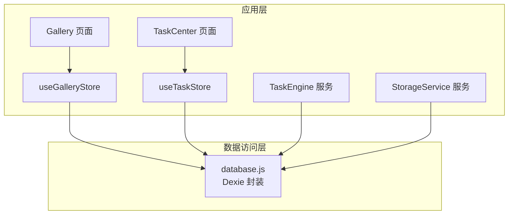
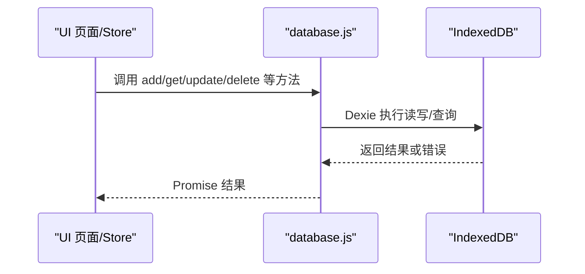
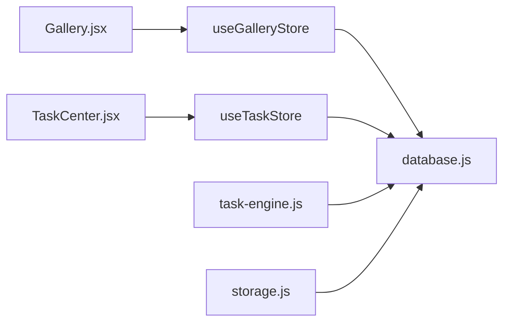

# 数据库层

<cite>
**本文引用的文件**   
- [app/src/db/database.js](file://app/src/db/database.js)
- [app/src/stores/useGalleryStore.js](file://app/src/stores/useGalleryStore.js)
- [app/src/stores/useTaskStore.js](file://app/src/stores/useTaskStore.js)
- [app/src/services/task-engine.js](file://app/src/services/task-engine.js)
- [app/src/pages/Gallery.jsx](file://app/src/pages/Gallery.jsx)
- [app/src/pages/TaskCenter.jsx](file://app/src/pages/TaskCenter.jsx)
- [app/src/services/storage.js](file://app/src/services/storage.js)
</cite>

## 更新摘要
**所做更改**   
- 新增状态过滤功能，支持按图片状态（pending/failed/completed）进行筛选
- 增强搜索功能，支持在提示词、模型和标签中进行关键词匹配
- 完善收藏切换功能，支持单个图片和批量收藏操作
- 优化文件夹组织功能，支持递归删除和自动清理引用
- 新增存储区域管理（热/冷），支持图片在不同存储层级间迁移
- 更新索引策略以支持更高效的状态查询和搜索操作

## 目录
1. [简介](#简介)
2. [项目结构](#项目结构)
3. [核心组件](#核心组件)
4. [架构总览](#架构总览)
5. [详细组件分析](#详细组件分析)
6. [依赖关系分析](#依赖关系分析)
7. [性能与索引优化](#性能与索引优化)
8. [数据迁移方案](#数据迁移方案)
9. [最佳实践](#最佳实践)
10. [故障排查指南](#故障排查指南)
11. [结论](#结论)

## 简介
本章节面向 AI Image Studio 的数据库层，基于 Dexie.js 对 IndexedDB 进行 ORM 封装。文档聚焦以下目标：
- 数据模型设计与表结构定义（Images、Batches、Tasks、Folders、Settings 等）
- 字段定义与业务规则说明
- CRUD 操作封装与复杂查询方法
- 索引策略与性能调优建议
- 数据迁移方案与最佳实践

**更新** 新增了状态过滤、搜索功能、收藏切换、文件夹组织和存储区域管理等核心功能的详细说明。

## 项目结构
数据库层位于 app/src/db/database.js，提供统一的数据库实例、表结构声明以及各实体的增删改查方法。上层 Store 与页面通过调用这些方法完成数据访问。

**图表来源**
- [app/src/pages/Gallery.jsx:1-529](file://app/src/pages/Gallery.jsx#L1-L529)
- [app/src/pages/TaskCenter.jsx:1-218](file://app/src/pages/TaskCenter.jsx#L1-L218)
- [app/src/stores/useGalleryStore.js:1-204](file://app/src/stores/useGalleryStore.js#L1-L204)
- [app/src/stores/useTaskStore.js:1-173](file://app/src/stores/useTaskStore.js#L1-L173)
- [app/src/services/task-engine.js:1-319](file://app/src/services/task-engine.js#L1-L319)
- [app/src/services/storage.js:194-349](file://app/src/services/storage.js#L194-L349)
- [app/src/db/database.js:1-348](file://app/src/db/database.js#L1-L348)

**章节来源**
- [app/src/db/database.js:1-348](file://app/src/db/database.js#L1-L348)

## 核心组件
- 数据库实例与版本管理：使用 Dexie 创建名为 AIImageStudio 的数据库，并通过 version(1).stores(...) 声明所有表及索引。
- 实体模块：
  - Images：图片记录，支持批量移动、收藏切换、搜索、统计等
  - Batches：生成批次，关联会话与提示词
  - Sessions：工作会话
  - Folders：文件夹树（父子关系）
  - Tasks：后台任务状态机与统计
  - Settings：键值配置
  - CasePackages：案例包（图片+提示词组合）

**章节来源**
- [app/src/db/database.js:20-31](file://app/src/db/database.js#L20-L31)

## 架构总览
下图展示了从 UI 到数据库的数据流与关键交互点。

**图表来源**
- [app/src/db/database.js:20-31](file://app/src/db/database.js#L20-L31)
- [app/src/stores/useGalleryStore.js:29-62](file://app/src/stores/useGalleryStore.js#L29-L62)
- [app/src/stores/useTaskStore.js:22-33](file://app/src/stores/useTaskStore.js#L22-L33)

## 详细组件分析

### 数据模型与表结构
- images
  - 主键：自增 id
  - 普通索引：batchId、folderId、model、favorite、createdAt、storageZone、status
  - 复合索引：[folderId+createdAt]、[status+createdAt]
  - 用途：存储生成/导入的图片元数据与展示信息
- batches
  - 主键：自增 id
  - 普通索引：sessionId、model、prompt、createdAt
  - 用途：一次提示词生成的批次集合
- sessions
  - 主键：自增 id
  - 普通索引：createdAt
  - 用途：工作会话时间线
- folders
  - 主键：自增 id
  - 普通索引：name、parentId、createdAt
  - 用途：用户自定义文件夹树
- tasks
  - 主键：自增 id
  - 普通索引：type、status、model、createdAt
  - 复合索引：[status+createdAt]
  - 用途：后台任务状态与进度
- settings
  - 主键：key
  - 用途：应用设置键值对
- casePackages
  - 主键：自增 id
  - 普通索引：imageId、createdAt
  - 用途：保存图片与提示词的组合包

**更新** 新增了 status 字段索引和 [status+createdAt] 复合索引，以支持更高效的状态查询。

**章节来源**
- [app/src/db/database.js:22-31](file://app/src/db/database.js#L22-L31)

### Images 实体
- 字段与默认值
  - favorite：布尔，默认 false
  - storageZone：字符串，默认 'hot'
  - status：字符串，默认 'completed'
  - createdAt：时间戳，默认 Date.now()
  - tags：数组，用于标签分类
- 常用操作
  - 新增：addImage
  - 查询：getImages（支持 folderId、model、favorite、status、orderBy、limit、offset）
  - 单条：getImage
  - 更新：updateImage
  - 删除：deleteImage、deleteImages
  - 搜索：searchImages（关键词在 prompt/model/tags 中的子串匹配）
  - 收藏切换：toggleImageFavorite
  - 批量移动：moveImages
  - 统计：getImageStats（按 storageZone 与 favorite 计数）
- 业务规则
  - 未指定 favorite/storageZone/status/createdAt 时自动填充默认值
  - 搜索为客户端过滤，适合中小规模数据；大数据量建议引入服务端或更高级索引
  - 批量移动使用 bulkUpdate 提升性能
  - 默认情况下排除 pending 和 failed 状态的图片

**更新** 新增了状态过滤功能和搜索功能的详细说明。

**章节来源**
- [app/src/db/database.js:43-147](file://app/src/db/database.js#L43-L147)

### Batches 实体
- 字段与默认值
  - createdAt：时间戳，默认 Date.now()
- 常用操作
  - 新增：addBatch
  - 查询：getBatches（按 createdAt 倒序，可选 sessionId 过滤、limit）
  - 单条：getBatch
  - 删除：deleteBatch（不级联删除 images）
- 业务规则
  - 删除批次不会删除其下的图片，保持数据独立性

**章节来源**
- [app/src/db/database.js:154-180](file://app/src/db/database.js#L154-L180)

### Sessions 实体
- 字段与默认值
  - createdAt：时间戳，默认 Date.now()
- 常用操作
  - 新增：addSession
  - 列表：getSessions（按 createdAt 倒序）
  - 单条：getSession

**章节来源**
- [app/src/db/database.js:186-199](file://app/src/db/database.js#L186-L199)

### Folders 实体
- 字段与默认值
  - parentId：父文件夹 id，默认 null
  - createdAt：时间戳，默认 Date.now()
- 常用操作
  - 新增：addFolder
  - 列表：getFolders（可按 parentId 获取子节点）
  - 单条：getFolder
  - 更新：updateFolder
  - 删除：deleteFolder（递归删除子文件夹，并将该文件夹下图片的 folderId 置空）
- 业务规则
  - 删除文件夹会"清空"其下图片归属，避免孤儿引用

**章节来源**
- [app/src/db/database.js:205-238](file://app/src/db/database.js#L205-L238)

### Tasks 实体
- 字段与默认值
  - status：任务状态，默认 'queued'
  - createdAt：时间戳，默认 Date.now()
- 常用操作
  - 新增：addTask
  - 查询：getTasks（按 createdAt 倒序，可选 status 过滤、limit）
  - 单条：getTask
  - 更新：updateTask
  - 删除：deleteTask
  - 统计：getTaskStats（total/active/queued/completed/failed）
- 业务规则
  - 状态机由 TaskEngine 驱动，持久化到 IndexedDB
  - 支持重试、取消、暂停/恢复等操作

**章节来源**
- [app/src/db/database.js:244-283](file://app/src/db/database.js#L244-L283)

### Settings 实体
- 字段
  - key：唯一键
  - value：任意可序列化值
- 常用操作
  - 读取：getSetting(key, defaultValue)
  - 写入：setSetting(key, value)
  - 全量：getAllSettings（转为对象映射）

**章节来源**
- [app/src/db/database.js:289-304](file://app/src/db/database.js#L289-L304)

### CasePackages 实体
- 字段与默认值
  - createdAt：时间戳，默认 Date.now()
- 常用操作
  - 新增：addCasePackage
  - 查询：getCasePackages（可按 imageId 过滤，否则按 createdAt 倒序）
  - 删除：deleteCasePackage

**章节来源**
- [app/src/db/database.js:310-326](file://app/src/db/database.js#L310-L326)

### 初始化入口
- initDatabase：打开数据库并输出日志，供应用启动时调用

**章节来源**
- [app/src/db/database.js:336-345](file://app/src/db/database.js#L336-L345)

## 依赖关系分析
- 页面与 Store 均通过 import * as db from '../db/database' 访问数据库方法
- TaskEngine 作为后台任务调度器，直接调用 database.js 的方法持久化任务状态与进度
- StorageService 利用数据库的存储区域管理功能实现热/冷存储迁移
- useGalleryStore 聚合了图片与文件夹的常见操作，并在 UI 变更时触发数据库更新

**图表来源**
- [app/src/pages/Gallery.jsx:1-529](file://app/src/pages/Gallery.jsx#L1-L529)
- [app/src/pages/TaskCenter.jsx:1-218](file://app/src/pages/TaskCenter.jsx#L1-L218)
- [app/src/stores/useGalleryStore.js:1-204](file://app/src/stores/useGalleryStore.js#L1-L204)
- [app/src/stores/useTaskStore.js:1-173](file://app/src/stores/useTaskStore.js#L1-L173)
- [app/src/services/task-engine.js:1-319](file://app/src/services/task-engine.js#L1-L319)
- [app/src/services/storage.js:194-349](file://app/src/services/storage.js#L194-L349)
- [app/src/db/database.js:1-348](file://app/src/db/database.js#L1-L348)

**章节来源**
- [app/src/stores/useGalleryStore.js:29-62](file://app/src/stores/useGalleryStore.js#L29-L62)
- [app/src/stores/useTaskStore.js:22-33](file://app/src/stores/useTaskStore.js#L22-L33)
- [app/src/services/task-engine.js:57-81](file://app/src/services/task-engine.js#L57-L81)
- [app/src/services/storage.js:226-320](file://app/src/services/storage.js#L226-L320)

## 性能与索引优化
- 现有索引设计
  - images：[folderId+createdAt]、[status+createdAt] 用于按文件夹/状态和时间排序的高效查询
  - tasks：[status+createdAt] 用于按状态和时间排序的高效查询
- 查询模式与复杂度
  - getImages：默认按 createdAt 倒序，支持 folderId 精确匹配、model/favorite/status 客户端过滤、limit/offset 分页
  - searchImages：客户端 substring 匹配，时间复杂度 O(n)，适合中小数据集
  - getTasks：按 createdAt 倒序，支持 status 精确匹配
- 优化建议
  - 大数据量搜索：将关键词检索下沉至后端或使用全文索引扩展；或在 IndexedDB 中维护 inverted index（需自行实现）
  - 分页：当前 getImages 使用数组切片，建议在 Dexie 中使用 offset/limit 原生能力以减少内存占用
  - 批量操作：已使用 bulkDelete/bulkUpdate，继续保持批量写路径
  - 只读缓存：对热点设置项（settings）可在内存中缓存，减少频繁读取
  - 存储区域管理：热/冷存储分离可减少主存储压力，提高查询性能

**更新** 新增了状态索引和存储区域管理的性能优化说明。

**章节来源**
- [app/src/db/database.js:56-83](file://app/src/db/database.js#L56-L83)
- [app/src/db/database.js:106-119](file://app/src/db/database.js#L106-L119)
- [app/src/db/database.js:252-260](file://app/src/db/database.js#L252-L260)
- [app/src/services/storage.js:288-320](file://app/src/services/storage.js#L288-L320)

## 数据迁移方案
- 当前版本
  - 使用 db.version(1).stores(...) 声明 schema，适用于首次安装与 v1 升级
- 迁移步骤建议
  - 递增版本号：db.version(2).stores({...}) 并在新版本中补充新字段与新索引
  - 迁移逻辑：在 version(2).upgrade(tx => {...}) 中对旧数据进行清洗、补齐默认值、重建索引
  - 回滚策略：谨慎处理破坏性变更，优先采用增量式字段添加与兼容逻辑
  - 验证：在升级后运行基础校验（如 counts、索引命中）确保一致性

**章节来源**
- [app/src/db/database.js:22-31](file://app/src/db/database.js#L22-L31)

## 最佳实践
- 统一数据访问入口
  - 所有读写通过 database.js 暴露的函数进行，避免在组件中直接操作 Dexie 实例
- 默认值与健壮性
  - 在 add* 方法中为关键字段提供默认值（如 favorite、storageZone、status、createdAt），降低上游调用负担
- 事务与批处理
  - 批量更新/删除使用 bulkUpdate/bulkDelete，减少往返次数
- 前端过滤与后端过滤结合
  - 简单过滤（model/favorite/status）可在前端进行；复杂条件（关键词、范围）建议在后端或更合适的索引上实现
- 事件驱动的状态同步
  - 使用 TaskEngine 的事件机制刷新任务列表，保证 UI 与持久化一致
- 存储区域管理
  - 合理使用热/冷存储分离，定期迁移不活跃数据到冷存储，优化存储空间和性能

**更新** 新增了存储区域管理的最佳实践建议。

**章节来源**
- [app/src/stores/useGalleryStore.js:125-146](file://app/src/stores/useGalleryStore.js#L125-L146)
- [app/src/stores/useTaskStore.js:39-64](file://app/src/stores/useTaskStore.js#L39-L64)
- [app/src/services/task-engine.js:215-220](file://app/src/services/task-engine.js#L215-L220)
- [app/src/services/storage.js:275-320](file://app/src/services/storage.js#L275-L320)

## 故障排查指南
- 常见问题定位
  - 数据库打开失败：检查 initDatabase 的异常捕获与浏览器环境兼容性
  - 查询结果为空：确认索引字段是否存在、过滤条件是否匹配
  - 任务状态不同步：检查 TaskEngine 事件监听是否正确注册与清理
  - 存储区域迁移失败：检查 OSS 连接配置和权限设置
- 调试建议
  - 在关键路径增加 console.log 或埋点，记录请求参数与返回结果
  - 对于批量操作，先在小数据集上验证正确性再扩大规模
  - 监控存储区域使用情况，及时调整迁移阈值

**更新** 新增了存储区域相关的故障排查建议。

**章节来源**
- [app/src/db/database.js:336-345](file://app/src/db/database.js#L336-L345)
- [app/src/stores/useTaskStore.js:39-64](file://app/src/stores/useTaskStore.js#L39-L64)
- [app/src/services/storage.js:203-219](file://app/src/services/storage.js#L203-L219)

## 结论
AI Image Studio 的数据库层以 Dexie.js 为核心，围绕 Images、Batches、Tasks、Folders、Settings、CasePackages 等实体提供了清晰的 CRUD 与查询封装。通过合理的索引设计与批量操作，兼顾了易用性与性能。新增的状态过滤、搜索功能、收藏切换、文件夹组织和存储区域管理等功能进一步增强了系统的完整性和实用性。后续可在大数据量场景下进一步优化搜索与分页策略，并完善数据迁移流程以确保长期演进的可维护性。

**更新** 总结了新增功能对整个数据库层的改进和价值。