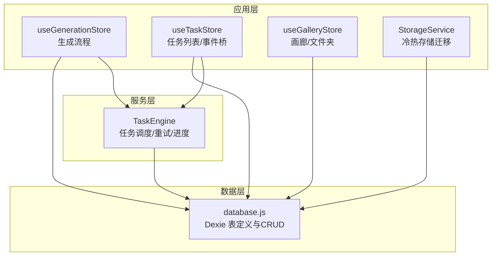
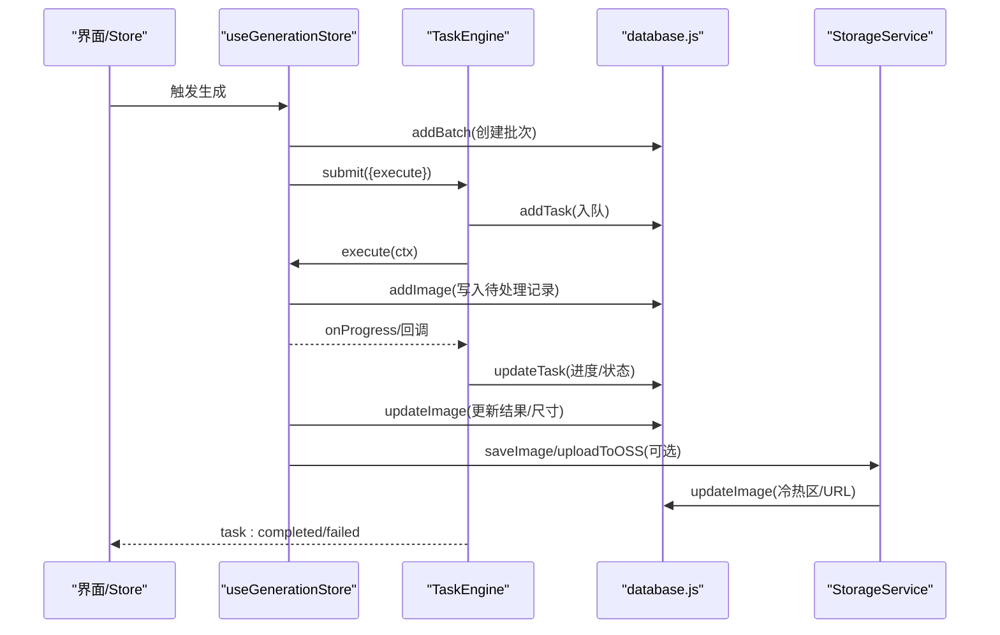
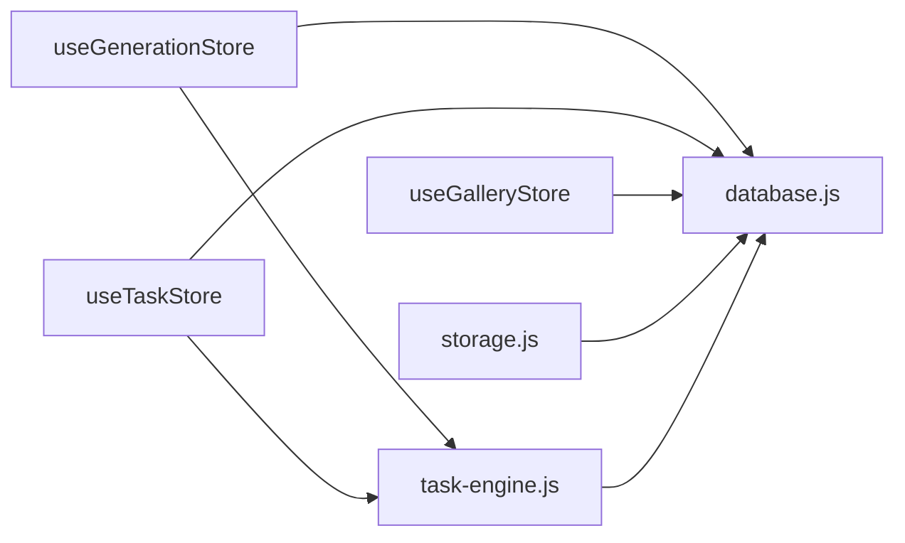

# 数据模型设计

<cite>
**本文引用的文件**   
- [database.js](file://app/src/db/database.js)
- [useGenerationStore.js](file://app/src/stores/useGenerationStore.js)
- [storage.js](file://app/src/services/storage.js)
- [task-engine.js](file://app/src/services/task-engine.js)
- [useTaskStore.js](file://app/src/stores/useTaskStore.js)
- [useGalleryStore.js](file://app/src/stores/useGalleryStore.js)
</cite>

## 目录
1. [简介](#简介)
2. [项目结构](#项目结构)
3. [核心组件](#核心组件)
4. [架构总览](#架构总览)
5. [详细组件分析](#详细组件分析)
6. [依赖关系分析](#依赖关系分析)
7. [性能考量](#性能考量)
8. [故障排查指南](#故障排查指南)
9. [结论](#结论)
10. [附录：字段与索引速查](#附录字段与索引速查)

## 简介
本文件为 AI Image Studio 的数据模型设计文档，聚焦于 IndexedDB（Dexie.js）中的七张核心表：Images、Batches、Sessions、Folders、Tasks、Settings、CasePackages。文档从字段定义、数据类型、业务规则、外键关联与引用完整性、约束与默认值、索引策略、验证与业务逻辑等方面进行全面说明，并结合实际代码路径展示数据模型的创建与使用方式。

## 项目结构
数据模型定义与访问集中在数据库层，其他模块通过服务与状态管理调用该层 API 完成读写操作。

图表来源
- [database.js:22-31](file://app/src/db/database.js#L22-L31)
- [useGenerationStore.js:112-290](file://app/src/stores/useGenerationStore.js#L112-L290)
- [task-engine.js:57-81](file://app/src/services/task-engine.js#L57-L81)
- [useTaskStore.js:23-64](file://app/src/stores/useTaskStore.js#L23-L64)
- [useGalleryStore.js:29-72](file://app/src/stores/useGalleryStore.js#L29-L72)
- [storage.js:51-80](file://app/src/services/storage.js#L51-L80)

章节来源
- [database.js:1-31](file://app/src/db/database.js#L1-L31)

## 核心组件
本节概述各实体的职责与关键行为。

- Images：记录生成的或上传的图片元数据与存储位置，支持收藏、分区（热/冷）、批量归属、文件夹组织等。
- Batches：一次提示词（prompt）触发的图片生成批次，用于聚合结果与回溯。
- Sessions：工作会话，将多个批次按会话分组。
- Folders：用户自定义的树形文件夹，用于组织图片。
- Tasks：后台任务记录，承载异步任务的执行状态、进度、错误与结果。
- Settings：键值对配置项，如 OSS 连接参数、容量阈值等。
- CasePackages：保存“图片+提示词”的组合包，便于复用。

章节来源
- [database.js:1-31](file://app/src/db/database.js#L1-L31)

## 架构总览
下图展示了数据模型在系统中的交互关系与主要数据流。

图表来源
- [useGenerationStore.js:112-290](file://app/src/stores/useGenerationStore.js#L112-L290)
- [task-engine.js:57-81](file://app/src/services/task-engine.js#L57-L81)
- [database.js:43-50](file://app/src/db/database.js#L43-L50)
- [storage.js:51-80](file://app/src/services/storage.js#L51-L80)

## 详细组件分析

### 实体与字段定义

#### Images（图片）
- 主键：id（自增）
- 索引与排序：
  - 单列索引：batchId、folderId、model、favorite、createdAt、storageZone
  - 复合索引：[folderId+createdAt]
- 常用字段与类型（根据使用推断）：
  - batchId：number | null（所属批次）
  - folderId：number | null（所属文件夹）
  - model：string（模型标识）
  - prompt：string（提示词）
  - url：string | null（原图 URL）
  - thumbnailUrl：string | null（缩略图 URL）
  - params：object（生成参数快照）
  - favorite：boolean（是否收藏）
  - storageZone：'hot'|'cold'（存储分区）
  - createdAt：number（时间戳）
  - width：number | null（宽）
  - height：number | null（高）
  - status：'pending'|'completed'|'failed'（生成状态）
  - taskId：string | null（关联任务 ID）
  - error：string | null（错误信息）
  - blobUrl：string | null（本地 Blob URL，热区）
  - blobSize：number | null（热区大小）
  - ossKey：string | null（冷区对象键）
  - ossUrl：string | null（冷区 URL）
  - tags：string[]（标签，搜索用）
- 默认值与约束：
  - favorite 默认 false
  - storageZone 默认 'hot'
  - createdAt 默认当前时间
  - 无数据库级外键；业务上由上层保证一致性
- 业务规则：
  - 删除文件夹时，其下所有图片的 folderId 置空（见 deleteFolder）
  - 热区满时自动迁移到冷区（见 StorageService.checkAndMigrate）
  - 支持关键词搜索（prompt/model/tags 子串匹配）

章节来源
- [database.js:22-31](file://app/src/db/database.js#L22-L31)
- [database.js:43-50](file://app/src/db/database.js#L43-L50)
- [database.js:56-76](file://app/src/db/database.js#L56-L76)
- [database.js:99-110](file://app/src/db/database.js#L99-L110)
- [database.js:129-138](file://app/src/db/database.js#L129-L138)
- [database.js:219-229](file://app/src/db/database.js#L219-L229)
- [storage.js:51-80](file://app/src/services/storage.js#L51-L80)
- [storage.js:204-244](file://app/src/services/storage.js#L204-L244)
- [storage.js:252-298](file://app/src/services/storage.js#L252-L298)

#### Batches（批次）
- 主键：id（自增）
- 索引：sessionId、model、prompt、createdAt
- 字段与类型：
  - sessionId：number | null（所属会话）
  - model：string
  - prompt：string
  - createdAt：number
- 默认值与约束：
  - createdAt 默认当前时间
  - 删除批次不会级联删除图片（显式注释）
- 业务规则：
  - 生成流程中先创建批次，再写入图片并回填 batchId

章节来源
- [database.js:22-31](file://app/src/db/database.js#L22-L31)
- [database.js:144-171](file://app/src/db/database.js#L144-L171)
- [useGenerationStore.js:119-126](file://app/src/stores/useGenerationStore.js#L119-L126)

#### Sessions（会话）
- 主键：id（自增）
- 索引：createdAt
- 字段与类型：
  - createdAt：number
- 默认值与约束：
  - createdAt 默认当前时间
- 业务规则：
  - 作为批次的父级分组，便于历史回溯

章节来源
- [database.js:22-31](file://app/src/db/database.js#L22-L31)
- [database.js:177-190](file://app/src/db/database.js#L177-L190)

#### Folders（文件夹）
- 主键：id（自增）
- 索引：name、parentId、createdAt
- 字段与类型：
  - name：string
  - parentId：number | null（父文件夹）
  - createdAt：number
- 默认值与约束：
  - parentId 默认 null
  - createdAt 默认当前时间
- 业务规则：
  - 删除文件夹会递归删除子文件夹，并将图片移出（folderId 置空）

章节来源
- [database.js:22-31](file://app/src/db/database.js#L22-L31)
- [database.js:196-229](file://app/src/db/database.js#L196-L229)
- [useGalleryStore.js:126-146](file://app/src/stores/useGalleryStore.js#L126-L146)

#### Tasks（任务）
- 主键：id（自增）
- 索引：type、status、model、createdAt、[status+createdAt]
- 字段与类型：
  - type：string（任务类型，如 generation）
  - status：'queued'|'running'|'completed'|'failed'|'cancelled'|'paused'
  - model：string
  - prompt：string
  - params：object
  - progress：number（0-100）
  - error：string | null
  - result：any | null
  - retryCount：number
  - createdAt：number
  - updatedAt：number
- 默认值与约束：
  - status 默认 'queued'
  - createdAt 默认当前时间
- 业务规则：
  - 状态机转换受控（见 TaskEngine）
  - 失败可重试，指数退避，最多 3 次
  - 支持取消、暂停、恢复

章节来源
- [database.js:22-31](file://app/src/db/database.js#L22-L31)
- [database.js:235-274](file://app/src/db/database.js#L235-L274)
- [task-engine.js:24-31](file://app/src/services/task-engine.js#L24-L31)
- [task-engine.js:57-81](file://app/src/services/task-engine.js#L57-L81)
- [task-engine.js:222-297](file://app/src/services/task-engine.js#L222-L297)
- [useTaskStore.js:66-87](file://app/src/stores/useTaskStore.js#L66-L87)

#### Settings（设置）
- 主键：key（唯一）
- 字段与类型：
  - key：string
  - value：any
- 默认值与约束：
  - getSetting(key, defaultValue) 在未命中时返回默认值
- 业务规则：
  - 典型键包括 OSS 配置、热区容量阈值等

章节来源
- [database.js:22-31](file://app/src/db/database.js#L22-L31)
- [database.js:280-295](file://app/src/db/database.js#L280-L295)
- [storage.js:20-42](file://app/src/services/storage.js#L20-L42)

#### CasePackages（案例包）
- 主键：id（自增）
- 索引：imageId、createdAt
- 字段与类型：
  - imageId：number（关联图片）
  - createdAt：number
- 默认值与约束：
  - createdAt 默认当前时间
- 业务规则：
  - 用于保存“图片+提示词”组合，可按图片查询或按时间倒序获取

章节来源
- [database.js:22-31](file://app/src/db/database.js#L22-L31)
- [database.js:301-317](file://app/src/db/database.js#L301-L317)

### 关系映射与引用完整性
- 弱外键（业务级）：
  - images.batchId → batches.id
  - images.folderId → folders.id
  - batches.sessionId → sessions.id
  - casePackages.imageId → images.id
- 引用完整性策略：
  - 未启用数据库级外键约束，采用应用层维护：
    - 删除文件夹时，将其下图片的 folderId 置空（避免悬挂引用）
    - 删除批次不级联删除图片（允许保留历史记录）
    - 删除图片前需确保相关任务/包已清理（由上层逻辑控制）

章节来源
- [database.js:219-229](file://app/src/db/database.js#L219-L229)
- [database.js:168-171](file://app/src/db/database.js#L168-L171)

### 索引策略与查询优化
- 单列索引：
  - images：batchId、folderId、model、favorite、createdAt、storageZone
  - tasks：type、status、model、createdAt
  - folders：name、parentId、createdAt
  - batches：sessionId、model、prompt、createdAt
  - casePackages：imageId、createdAt
- 复合索引：
  - images：[folderId+createdAt]（按文件夹+时间排序）
  - tasks：[status+createdAt]（按状态+时间排序）
- 常见查询模式：
  - 按文件夹分页浏览：where('folderId').equals(...) + orderBy('createdAt')
  - 按状态筛选任务：where('status').equals(...)
  - 关键词搜索：客户端 filter 匹配 prompt/model/tags

章节来源
- [database.js:22-31](file://app/src/db/database.js#L22-L31)
- [database.js:56-76](file://app/src/db/database.js#L56-L76)
- [database.js:243-251](file://app/src/db/database.js#L243-L251)
- [database.js:99-110](file://app/src/db/database.js#L99-L110)

### 数据验证与业务逻辑约束
- Images：
  - favorite 默认 false；storageZone 默认 'hot'；createdAt 默认当前时间
  - 删除文件夹后，folderId 置空
  - 热区容量超限自动迁移至冷区
- Batches：
  - createdAt 默认当前时间；删除不级联图片
- Sessions：
  - createdAt 默认当前时间
- Folders：
  - parentId 默认 null；删除递归清理子文件夹
- Tasks：
  - status 默认 'queued'；状态机受控；失败可重试（最多 3 次）
- Settings：
  - getSetting 支持默认值回退
- CasePackages：
  - createdAt 默认当前时间

章节来源
- [database.js:43-50](file://app/src/db/database.js#L43-L50)
- [database.js:144-171](file://app/src/db/database.js#L144-L171)
- [database.js:177-190](file://app/src/db/database.js#L177-L190)
- [database.js:196-229](file://app/src/db/database.js#L196-L229)
- [database.js:235-274](file://app/src/db/database.js#L235-L274)
- [database.js:280-295](file://app/src/db/database.js#L280-L295)
- [database.js:301-317](file://app/src/db/database.js#L301-L317)
- [storage.js:252-298](file://app/src/services/storage.js#L252-L298)

### 使用示例（以代码路径代替具体代码）
- 创建图片记录（含默认值填充）
  - [addImage 实现:43-50](file://app/src/db/database.js#L43-L50)
- 按条件查询图片（文件夹、模型、收藏、分页）
  - [getImages 实现:56-76](file://app/src/db/database.js#L56-L76)
- 关键词搜索（prompt/model/tags）
  - [searchImages 实现:99-110](file://app/src/db/database.js#L99-L110)
- 创建批次与图片（生成流程）
  - [useGenerationStore.generate 调用 addBatch/addImage:112-290](file://app/src/stores/useGenerationStore.js#L112-L290)
- 任务提交与状态更新
  - [TaskEngine.submit 持久化任务:57-81](file://app/src/services/task-engine.js#L57-L81)
  - [TaskEngine._runTask 更新进度/结果:222-297](file://app/src/services/task-engine.js#L222-L297)
- 冷热区迁移
  - [StorageService.saveImage/updateImage:51-80](file://app/src/services/storage.js#L51-80)
  - [StorageService.moveToColdZone/moveToHotZone:204-244](file://app/src/services/storage.js#L204-244)
  - [StorageService.checkAndMigrate:252-298](file://app/src/services/storage.js#L252-298)
- 文件夹管理与级联清空
  - [deleteFolder 清空图片 folderId 并递归删除子文件夹:219-229](file://app/src/db/database.js#L219-229)
  - [useGalleryStore.deleteFolder 联动刷新:138-146](file://app/src/stores/useGalleryStore.js#L138-146)

## 依赖关系分析
- 模块耦合：
  - useGenerationStore 依赖 database.js 与 task-engine.js
  - useTaskStore 依赖 database.js 与 task-engine.js
  - useGalleryStore 依赖 database.js
  - StorageService 依赖 database.js 与 settings store
- 外部依赖：
  - Dexie（IndexedDB 封装）
  - ali-oss（云存储）
  - zustand/immer（前端状态）
  - uuid（任务 ID）

图表来源
- [useGenerationStore.js:112-290](file://app/src/stores/useGenerationStore.js#L112-L290)
- [useTaskStore.js:23-64](file://app/src/stores/useTaskStore.js#L23-L64)
- [useGalleryStore.js:29-72](file://app/src/stores/useGalleryStore.js#L29-L72)
- [storage.js:51-80](file://app/src/services/storage.js#L51-L80)
- [task-engine.js:57-81](file://app/src/services/task-engine.js#L57-L81)
- [database.js:22-31](file://app/src/db/database.js#L22-L31)

## 性能考量
- 索引利用：
  - 使用 [folderId+createdAt] 与 [status+createdAt] 复合索引提升范围查询与排序性能
- 分页与限制：
  - getImages/getBatches/getTasks 支持 limit/offset 切片，避免一次性加载大量数据
- 冷热分层：
  - 热区（IndexedDB）提供快速预览；冷区（OSS）降低本地占用
  - 自动迁移策略基于阈值与创建时间顺序，优先迁移最旧图片
- 缩略图：
  - 生成固定最大尺寸的缩略图，减少首屏渲染压力

章节来源
- [database.js:22-31](file://app/src/db/database.js#L22-L31)
- [database.js:56-76](file://app/src/db/database.js#L56-L76)
- [storage.js:323-347](file://app/src/services/storage.js#L323-L347)
- [storage.js:252-298](file://app/src/services/storage.js#L252-L298)

## 故障排查指南
- 任务失败与重试：
  - 检查任务状态是否为 failed；查看 error 字段；确认是否达到最大重试次数
  - 参考：[TaskEngine._runTask 异常分支:259-297](file://app/src/services/task-engine.js#L259-297)
- 图片未显示或链接失效：
  - 检查 storageZone 与 blobUrl/ossUrl 是否正确；热区 URL 可能因页面刷新失效，需重新拉取或迁移
  - 参考：[StorageService.getImage/getThumbnail:87-114](file://app/src/services/storage.js#L87-114)
- 文件夹删除后图片仍可见：
  - 确认 deleteFolder 已将 folderId 置空；必要时刷新图库
  - 参考：[deleteFolder 级联逻辑:219-229](file://app/src/db/database.js#L219-229)
- 设置读取异常：
  - 使用 getSetting(key, defaultValue) 获取默认值，避免 undefined
  - 参考：[getSetting:280-283](file://app/src/db/database.js#L280-283)

章节来源
- [task-engine.js:259-297](file://app/src/services/task-engine.js#L259-L297)
- [storage.js:87-114](file://app/src/services/storage.js#L87-L114)
- [database.js:219-229](file://app/src/db/database.js#L219-L229)
- [database.js:280-283](file://app/src/db/database.js#L280-L283)

## 结论
AI Image Studio 的数据模型围绕图片生命周期展开，通过 Batches/Sessions/Folders/Tasks/Settings/CasePackages 等实体形成完整的工作流支撑。模型采用 Dexie 的轻量索引与复合索引策略，结合应用层的引用完整性维护，实现了高效且可扩展的前端数据管理。冷热分层与缩略图机制进一步优化了性能与体验。

## 附录：字段与索引速查
- Images
  - 索引：++id, batchId, folderId, model, favorite, createdAt, storageZone, [folderId+createdAt]
  - 关键字段：url/thumbnailUrl、params、width/height、status/taskId/error、blobUrl/blobSize、ossKey/ossUrl、tags
- Batches
  - 索引：++id, sessionId, model, prompt, createdAt
- Sessions
  - 索引：++id, createdAt
- Folders
  - 索引：++id, name, parentId, createdAt
- Tasks
  - 索引：++id, type, status, model, createdAt, [status+createdAt]
- Settings
  - 索引：key
- CasePackages
  - 索引：++id, imageId, createdAt

章节来源
- [database.js:22-31](file://app/src/db/database.js#L22-L31)