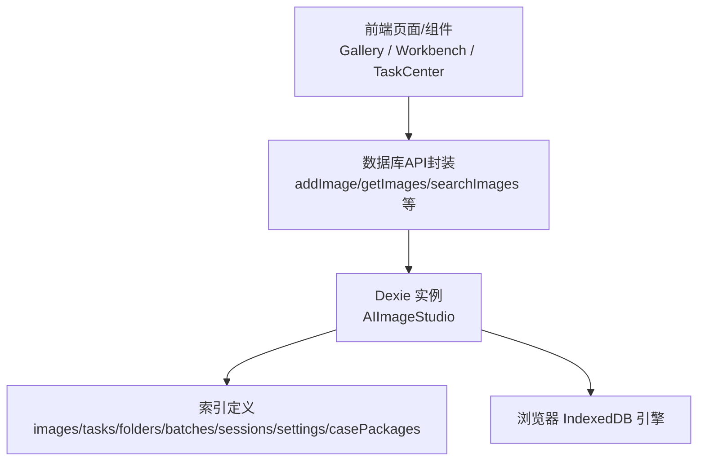
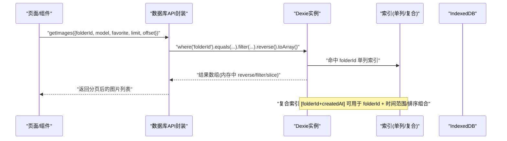
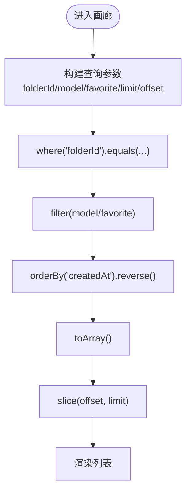

# 查询优化与索引

<cite>
**本文引用的文件**   
- [database.js](file://app/src/db/database.js)
</cite>

## 目录
1. [简介](#简介)
2. [项目结构](#项目结构)
3. [核心组件](#核心组件)
4. [架构总览](#架构总览)
5. [详细组件分析](#详细组件分析)
6. [依赖分析](#依赖分析)
7. [性能考虑](#性能考虑)
8. [故障排查指南](#故障排查指南)
9. [结论](#结论)
10. [附录](#附录)

## 简介
本文件面向 AI Image Studio 的数据库层，聚焦 Dexie.js（IndexedDB）在图片、批次、任务等核心表上的查询语法与性能优化。文档重点包括：
- 复合索引设计与使用场景，如 images 表的 [folderId+createdAt] 与 tasks 表的 [status+createdAt]
- 复杂查询最佳实践：过滤、排序、分页与搜索
- 不同查询模式的性能特征与优化建议
- 查询性能监控与调试方法
- 可复用的性能测试案例与对比思路

## 项目结构
本项目采用按功能域组织的前端结构，数据库访问集中在 app/src/db/database.js，对外暴露统一的增删改查函数，供页面与状态管理模块调用。

图表来源
- [database.js:20-31](file://app/src/db/database.js#L20-L31)

章节来源
- [database.js:1-31](file://app/src/db/database.js#L1-L31)

## 核心组件
- 数据库初始化与版本迁移：通过 Dexie 实例创建并声明表结构与索引
- 数据模型与索引：
  - images：主键自增，常用筛选字段 folderId、model、favorite、createdAt；复合索引 [folderId+createdAt]
  - batches：主键自增，按 sessionId 筛选，按 createdAt 排序
  - sessions：主键自增，按 createdAt 倒序
  - folders：主键自增，支持 parentId 层级查询
  - tasks：主键自增，按 status 筛选，复合索引 [status+createdAt]
  - settings：key/value 配置
  - casePackages：按 imageId 或 createdAt 查询
- 对外 API：提供 add/get/update/delete/bulk 操作及统计、搜索等高级能力

章节来源
- [database.js:20-31](file://app/src/db/database.js#L20-L31)
- [database.js:43-138](file://app/src/db/database.js#L43-L138)
- [database.js:144-171](file://app/src/db/database.js#L144-L171)
- [database.js:177-190](file://app/src/db/database.js#L177-L190)
- [database.js:196-229](file://app/src/db/database.js#L196-L229)
- [database.js:235-274](file://app/src/db/database.js#L235-L274)
- [database.js:280-295](file://app/src/db/database.js#L280-L295)
- [database.js:301-317](file://app/src/db/database.js#L301-L317)

## 架构总览
下图展示从页面到 IndexedDB 的完整调用路径，以及关键查询入口与索引命中情况。

图表来源
- [database.js:56-76](file://app/src/db/database.js#L56-L76)
- [database.js:22-31](file://app/src/db/database.js#L22-L31)

## 详细组件分析

### 索引与查询模式
- 单列索引
  - images.folderId：用于按文件夹快速定位图片集合
  - tasks.status：用于按任务状态筛选
  - batches.sessionId：用于按会话筛选批次
  - folders.parentId：用于按父级获取子文件夹
  - casePackages.imageId：用于按图片获取案例包
- 复合索引
  - images.[folderId+createdAt]：适合“某文件夹内按时间排序/范围”的场景
  - tasks.[status+createdAt]：适合“某状态下按时间排序/范围”的场景

章节来源
- [database.js:22-31](file://app/src/db/database.js#L22-L31)

### 图片查询（images）
- 典型用法
  - 按文件夹筛选：where('folderId').equals(folderId)
  - 内存过滤：filter(img => img.model === ...)、filter(img => img.favorite === ...)
  - 排序与分页：orderBy('createdAt').reverse().toArray()，再 slice(offset, limit)
- 性能要点
  - where 条件优先走索引；filter 为内存计算，应在小结果集上使用
  - 若需要“某文件夹内最近 N 条”，可结合 [folderId+createdAt] 复合索引进行范围查询，避免全表扫描
  - 当前实现将 reverse 与 slice 放在内存阶段，数据量大时可改为基于复合索引的范围查询提升性能

章节来源
- [database.js:56-76](file://app/src/db/database.js#L56-L76)
- [database.js:22-31](file://app/src/db/database.js#L22-L31)

### 任务查询（tasks）
- 典型用法
  - 按状态筛选：where('status').equals(status)
  - 默认按 createdAt 倒序，limit 控制数量
- 性能要点
  - 使用 [status+createdAt] 复合索引可实现“某状态下按时间倒序/范围”的高效查询
  - 对“进行中/排队中”等高频状态，建议直接基于复合索引做范围截取，减少内存处理

章节来源
- [database.js:243-251](file://app/src/db/database.js#L243-L251)
- [database.js:22-31](file://app/src/db/database.js#L22-L31)

### 搜索（images）
- 关键词搜索：遍历 prompt/model/tags 字段进行包含匹配
- 性能要点
  - 当前为全表 filter，适合小规模数据；当数据量增长时，建议引入全文检索方案（如服务端 ES 或前端扩展库），或将高频字段建立额外索引并在应用层预处理

章节来源
- [database.js:99-110](file://app/src/db/database.js#L99-L110)

### 批量更新与删除
- bulkUpdate：批量移动图片至文件夹
- bulkDelete：批量删除图片
- 性能要点
  - 批量操作优于逐条循环写入，降低事务开销

章节来源
- [database.js:123-127](file://app/src/db/database.js#L123-L127)
- [database.js:94-96](file://app/src/db/database.js#L94-L96)

### 统计接口
- getImageStats：一次性读取全部记录后在内存聚合
- getTaskStats：同上
- 性能要点
  - 数据量大时建议改用 Dexie 的 count()/each() 或分片聚合，避免 toArray() 导致内存峰值

章节来源
- [database.js:130-138](file://app/src/db/database.js#L130-L138)
- [database.js:265-274](file://app/src/db/database.js#L265-L274)

### 复合索引设计策略与实践
- 设计原则
  - 将“高选择性字段”置于复合索引前部，例如 folderId 在前，createdAt 在后
  - 将“排序字段”作为复合索引尾部，便于范围/排序复用
- 典型场景
  - images.[folderId+createdAt]：按文件夹分组并按时间倒序浏览
  - tasks.[status+createdAt]：按任务状态分组并按时间倒序查看

章节来源
- [database.js:22-31](file://app/src/db/database.js#L22-L31)

### 复杂查询最佳实践
- 过滤
  - 优先使用 where(...) 命中索引；filter(...) 仅用于小结果集二次筛选
- 排序
  - 尽量让 orderBy 与索引顺序一致，避免内存排序
- 分页
  - 对于大数据集，建议使用基于索引的范围查询替代内存 slice
- 搜索
  - 关键词搜索需权衡数据规模；必要时引入外部搜索引擎或预索引字段

章节来源
- [database.js:56-76](file://app/src/db/database.js#L56-L76)
- [database.js:99-110](file://app/src/db/database.js#L99-L110)

### 查询流程图（示例：按文件夹分页加载）

图表来源
- [database.js:56-76](file://app/src/db/database.js#L56-L76)

## 依赖分析
- 外部依赖
  - Dexie：IndexedDB 的 Promise 化封装，提供链式查询与索引声明
- 内部依赖
  - 页面/组件通过导入 database.js 暴露的函数完成读写
- 耦合关系
  - 数据库层与业务逻辑解耦良好，便于替换存储后端或增加缓存层

图表来源
- [database.js:14](file://app/src/db/database.js#L14)
- [database.js:20-31](file://app/src/db/database.js#L20-L31)

章节来源
- [database.js:14](file://app/src/db/database.js#L14)
- [database.js:20-31](file://app/src/db/database.js#L20-L31)

## 性能考虑
- 索引命中
  - 确保高频查询条件落在已建索引上，优先使用 where 而非 filter
  - 利用复合索引同时满足“分组+排序/范围”需求
- 内存压力
  - 避免在大结果集上使用 toArray() 后再 reverse/slice；应尽可能用索引范围限制返回量
- 批量操作
  - 使用 bulkUpdate/bulkDelete 减少事务次数
- 统计与计数
  - 避免全表扫描，考虑 count()/each() 或增量维护计数器
- 搜索
  - 关键词搜索在大数据下成本较高，建议分层：先索引过滤，再内存匹配；或引入外部搜索引擎

[本节为通用指导，不直接分析具体文件]

## 故障排查指南
- 打开数据库失败
  - 检查 initDatabase 的错误日志输出，确认 IndexedDB 可用性与权限
- 查询无结果
  - 核对 where 条件字段是否与索引一致；注意大小写与类型
- 性能退化
  - 观察是否大量使用 filter/reverse/slice 在内存阶段；评估是否可改写为基于复合索引的范围查询
- 统计异常
  - 检查是否因 toArray() 导致内存溢出；改用流式或计数方式

章节来源
- [database.js:327-336](file://app/src/db/database.js#L327-L336)

## 结论
通过合理设计复合索引与规范查询写法，可在不改动上层业务的前提下显著提升图片与任务的查询性能。建议优先落地以下优化：
- 将“按文件夹+时间范围/排序”的查询迁移到 images.[folderId+createdAt] 复合索引
- 将“按状态+时间范围/排序”的查询迁移到 tasks.[status+createdAt] 复合索引
- 以范围查询替代内存 reverse/slice，降低大结果集带来的内存与CPU开销

[本节为总结性内容，不直接分析具体文件]

## 附录

### 查询性能监控与调试方法
- 控制台日志
  - 使用 console.time/console.timeEnd 包裹关键查询，统计耗时
- 浏览器开发者工具
  - 使用 Application → IndexedDB 查看数据库对象与索引
  - 使用 Performance 面板录制查询过程，定位慢点
- 最小化复现
  - 构造固定数据集，对比不同查询路径的耗时差异

[本节为通用指导，不直接分析具体文件]

### 性能测试案例与对比思路
- 测试目标
  - 验证复合索引对“按文件夹+时间范围”查询的提升
  - 验证“按状态+时间范围”查询对任务列表的性能改善
- 步骤建议
  - 准备 N 条图片/任务数据，覆盖多种 folderId/status
  - 分别执行“内存 reverse/slice”与“基于复合索引范围”的两种查询
  - 记录平均耗时、P95/P99 耗时与内存峰值
- 预期结果
  - 复合索引方案在大数据量下显著降低响应时间与内存占用

[本节为通用指导，不直接分析具体文件]