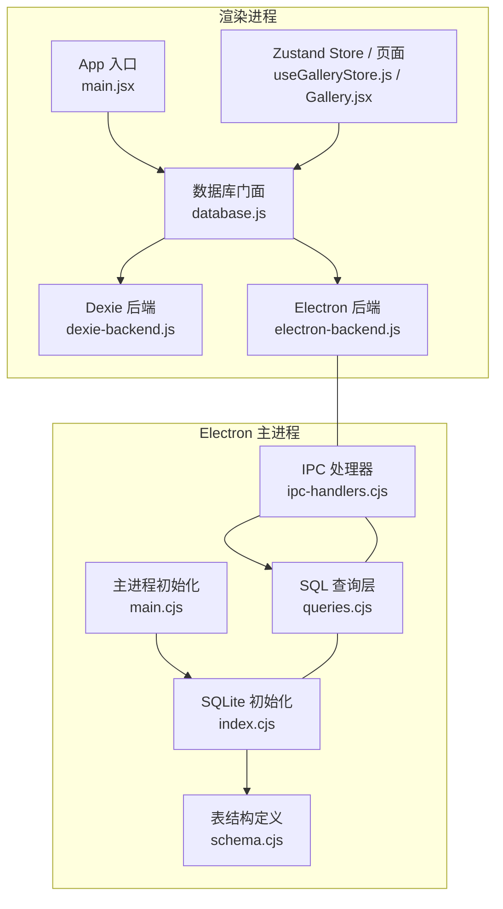
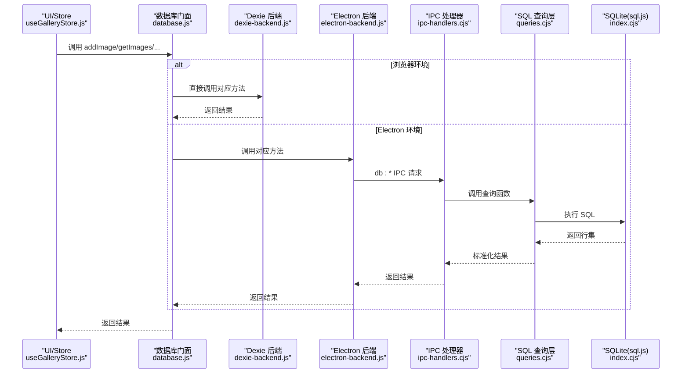
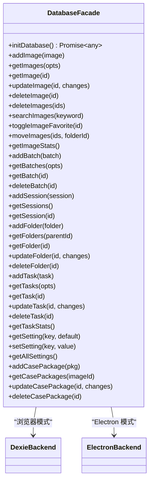
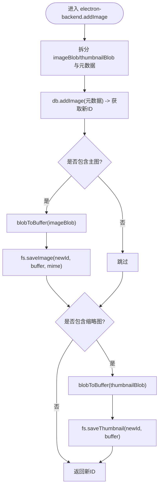
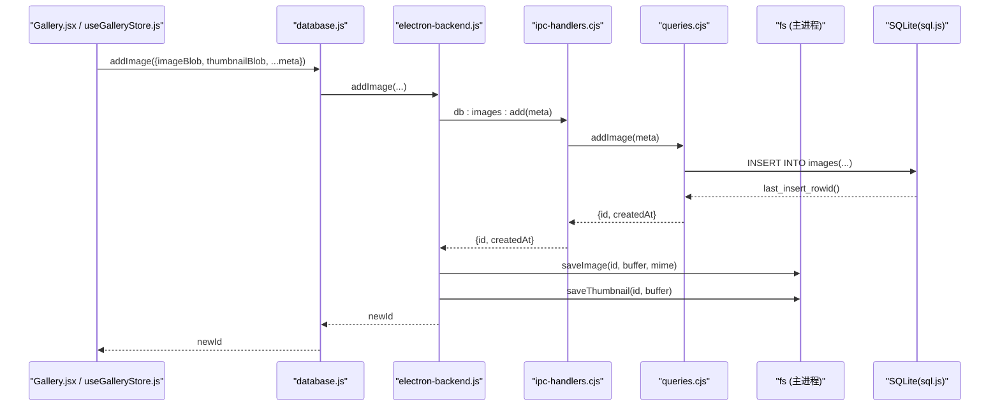
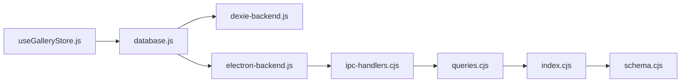
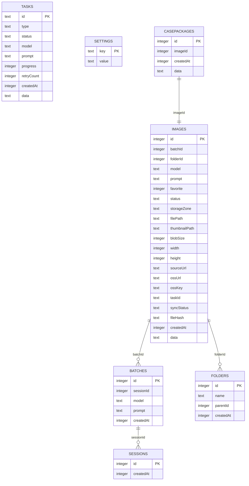

# 策略模式数据库抽象

<cite>
**本文引用的文件**   
- [database.js](file://app/src/db/database.js)
- [dexie-backend.js](file://app/src/db/dexie-backend.js)
- [electron-backend.js](file://app/src/db/electron-backend.js)
- [index.cjs](file://app/electron/database/index.cjs)
- [schema.cjs](file://app/electron/database/schema.cjs)
- [queries.cjs](file://app/electron/database/queries.cjs)
- [ipc-handlers.cjs](file://app/electron/ipc-handlers.cjs)
- [main.cjs](file://app/electron/main.cjs)
- [main.jsx](file://app/src/main.jsx)
- [useGalleryStore.js](file://app/src/stores/useGalleryStore.js)
- [useTaskStore.js](file://app/src/stores/useTaskStore.js)
- [useSettingsStore.js](file://app/src/stores/useSettingsStore.js)
- [Gallery.jsx](file://app/src/pages/Gallery.jsx)
</cite>

## 目录
1. [简介](#简介)
2. [项目结构](#项目结构)
3. [核心组件](#核心组件)
4. [架构总览](#架构总览)
5. [详细组件分析](#详细组件分析)
6. [依赖关系分析](#依赖关系分析)
7. [性能考量](#性能考量)
8. [故障排查指南](#故障排查指南)
9. [结论](#结论)
10. [附录](#附录)

## 简介
本仓库采用“策略模式”对数据库访问层进行抽象：在浏览器环境下使用 Dexie（IndexedDB），在 Electron 环境下通过 IPC 调用主进程的 SQLite（sql.js）。前端统一通过 facade 暴露的函数与默认导出代理访问数据，业务代码无需感知底层实现差异。该设计使得同一套 Zustand store、服务与页面可在两种运行时中无缝切换。

## 项目结构
围绕数据库抽象的关键路径如下：
- 启动阶段：渲染进程初始化时选择并打开后端；Electron 主进程初始化 SQLite 并注册 IPC。
- 策略分发：facade 根据运行环境创建具体后端实例，并将所有方法转发到对应实现。
- 查询层：Dexie 直接操作 IndexedDB；Electron 侧通过 IPC 将请求路由到 SQL 查询层。
- 持久化：Dexie 由浏览器管理；SQLite 通过 sql.js 内存库 + 定时落盘。

图表来源
- [main.jsx:12-29](file://app/src/main.jsx#L12-L29)
- [database.js:22-30](file://app/src/db/database.js#L22-L30)
- [dexie-backend.js:10-28](file://app/src/db/dexie-backend.js#L10-L28)
- [electron-backend.js:8-44](file://app/src/db/electron-backend.js#L8-L44)
- [main.cjs:72-86](file://app/electron/main.cjs#L72-L86)
- [index.cjs:19-45](file://app/electron/database/index.cjs#L19-L45)
- [ipc-handlers.cjs:10-60](file://app/electron/ipc-handlers.cjs#L10-L60)
- [queries.cjs:1-10](file://app/electron/database/queries.cjs#L1-L10)
- [schema.cjs:6-40](file://app/electron/database/schema.cjs#L6-L40)

章节来源
- [main.jsx:12-29](file://app/src/main.jsx#L12-L29)
- [database.js:1-30](file://app/src/db/database.js#L1-L30)
- [dexie-backend.js:1-30](file://app/src/db/dexie-backend.js#L1-L30)
- [electron-backend.js:1-44](file://app/src/db/electron-backend.js#L1-L44)
- [main.cjs:72-86](file://app/electron/main.cjs#L72-L86)
- [index.cjs:19-45](file://app/electron/database/index.cjs#L19-L45)
- [ipc-handlers.cjs:10-60](file://app/electron/ipc-handlers.cjs#L10-L60)
- [queries.cjs:1-10](file://app/electron/database/queries.cjs#L1-L10)
- [schema.cjs:6-40](file://app/electron/database/schema.cjs#L6-L40)

## 核心组件
- 数据库门面（策略入口）
  - 负责环境检测、后端选择、统一 API 转发与兼容旧版直连访问。
- Dexie 后端（浏览器）
  - 基于 Dexie 的表结构与索引，提供与 Electron 后端一致的接口。
- Electron 后端（桌面）
  - 通过 window.electronAPI.db.* 与 fs.* 进行 IPC 通信，并对返回值做归一化处理。
- SQLite 主进程层
  - 使用 sql.js 加载/保存数据库，执行 schema 初始化，并提供 debounced 落盘。
- SQL 查询层
  - 封装所有 CRUD 与统计查询，映射为与 Dexie 后端一致的数据形态。
- IPC 处理器
  - 将渲染进程请求映射到 queries.cjs 的具体函数。

章节来源
- [database.js:1-30](file://app/src/db/database.js#L1-L30)
- [dexie-backend.js:10-30](file://app/src/db/dexie-backend.js#L10-L30)
- [electron-backend.js:8-44](file://app/src/db/electron-backend.js#L8-L44)
- [index.cjs:19-45](file://app/electron/database/index.cjs#L19-L45)
- [queries.cjs:1-10](file://app/electron/database/queries.cjs#L1-L10)
- [ipc-handlers.cjs:10-60](file://app/electron/ipc-handlers.cjs#L10-L60)

## 架构总览
下图展示了从应用启动到数据读写的完整链路，以及策略模式如何屏蔽不同存储的差异。

图表来源
- [database.js:22-30](file://app/src/db/database.js#L22-L30)
- [dexie-backend.js:32-65](file://app/src/db/dexie-backend.js#L32-L65)
- [electron-backend.js:48-88](file://app/src/db/electron-backend.js#L48-L88)
- [ipc-handlers.cjs:12-21](file://app/electron/ipc-handlers.cjs#L12-L21)
- [queries.cjs:122-163](file://app/electron/database/queries.cjs#L122-L163)
- [index.cjs:19-45](file://app/electron/database/index.cjs#L19-L45)

## 详细组件分析

### 数据库门面（策略入口）
- 职责
  - 启动时自动检测 Electron 或浏览器环境，选择对应后端并 open。
  - 将所有命名导出转发至当前后端实例，保证上层零改动。
  - 默认导出一个 Proxy，兼容旧式直连表访问（如 db.casePackages.update）。
- 关键点
  - 环境判断依据 window.electronAPI?.db 是否存在。
  - 返回 backend.raw 供需要直连表的场景使用。

图表来源
- [database.js:22-97](file://app/src/db/database.js#L22-L97)
- [dexie-backend.js:289-309](file://app/src/db/dexie-backend.js#L289-L309)
- [electron-backend.js:308-330](file://app/src/db/electron-backend.js#L308-L330)

章节来源
- [database.js:1-97](file://app/src/db/database.js#L1-L97)

### Dexie 后端（浏览器）
- 职责
  - 定义 Dexie 版本与表结构，实现所有面向前端的数据库方法。
  - 提供 raw 属性以兼容旧式直连访问。
- 关键特性
  - 使用 orderBy/where/filter 组合条件查询，支持分页与过滤。
  - 搜索逻辑在客户端完成，包含 prompt/model/tags 等字段。
  - 删除文件夹时级联解绑图片并递归处理子文件夹。

章节来源
- [dexie-backend.js:10-30](file://app/src/db/dexie-backend.js#L10-L30)
- [dexie-backend.js:32-120](file://app/src/db/dexie-backend.js#L32-L120)
- [dexie-backend.js:166-199](file://app/src/db/dexie-backend.js#L166-L199)
- [dexie-backend.js:289-309](file://app/src/db/dexie-backend.js#L289-L309)

### Electron 后端（桌面）
- 职责
  - 通过 window.electronAPI.db.* 与 fs.* 进行 IPC 通信。
  - 将 Blob/ArrayBuffer 转换为可传输格式，并在读取时还原为 Blob。
  - 对返回值做归一化，确保与 Dexie 后端一致（例如自增 id、统计字段名）。
- 关键特性
  - getImages 在 JS 层补齐 Dexie 的默认状态过滤语义。
  - getImage 并行读取主图与缩略图，合并到返回对象。
  - updateImage 分离 blob 与元数据变更，分别持久化。

图表来源
- [electron-backend.js:48-69](file://app/src/db/electron-backend.js#L48-L69)
- [electron-backend.js:14-19](file://app/src/db/electron-backend.js#L14-L19)
- [electron-backend.js:22-37](file://app/src/db/electron-backend.js#L22-L37)

章节来源
- [electron-backend.js:8-44](file://app/src/db/electron-backend.js#L8-L44)
- [electron-backend.js:48-153](file://app/src/db/electron-backend.js#L48-L153)
- [electron-backend.js:308-330](file://app/src/db/electron-backend.js#L308-L330)

### SQLite 主进程层（sql.js）
- 职责
  - 初始化 sql.js，加载或创建数据库文件，执行 schema DDL。
  - 提供 scheduleSave 防抖落盘与 closeDatabase 关闭流程。
- 关键特性
  - WAL 模式尝试开启以提升并发（忽略不支持的错误）。
  - 写操作后 300ms 内批量写入磁盘，减少频繁 IO。

章节来源
- [index.cjs:19-45](file://app/electron/database/index.cjs#L19-L45)
- [index.cjs:58-75](file://app/electron/database/index.cjs#L58-L75)
- [index.cjs:80-90](file://app/electron/database/index.cjs#L80-L90)

### SQL 查询层（queries.cjs）
- 职责
  - 实现与 Dexie 后端一致的 30+ 个导出函数。
  - 将非索引字段打包进 JSON data 列，读写时进行序列化/反序列化。
  - 构建动态 UPDATE SET 子句，仅更新传入字段。
- 关键特性
  - images 表拆分为“索引列 + JSON data”，兼顾查询性能与扩展性。
  - 统计类查询使用聚合 SQL，避免全量拉取。
  - 删除文件夹时递归收集子节点 ID，并解绑关联图片。

章节来源
- [queries.cjs:122-163](file://app/electron/database/queries.cjs#L122-L163)
- [queries.cjs:217-257](file://app/electron/database/queries.cjs#L217-L257)
- [queries.cjs:271-295](file://app/electron/database/queries.cjs#L271-L295)
- [queries.cjs:415-438](file://app/electron/database/queries.cjs#L415-L438)

### IPC 处理器（ipc-handlers.cjs）
- 职责
  - 将渲染进程的 db:* 通道请求映射到 queries.cjs 的具体函数。
  - 同时挂载 OSS 同步相关通道。
- 关键特性
  - 每个 handler 只负责参数透传与返回值透传，保持薄桥接。

章节来源
- [ipc-handlers.cjs:10-60](file://app/electron/ipc-handlers.cjs#L10-L60)

### 应用启动与集成点
- 渲染进程
  - main.jsx 在启动时调用 initDatabase，随后加载设置并挂载 React。
- Electron 主进程
  - main.cjs 初始化 SQLite、注册 IPC、文件系统、协议、API 代理与 OSS 同步。

章节来源
- [main.jsx:12-29](file://app/src/main.jsx#L12-L29)
- [main.cjs:72-106](file://app/electron/main.cjs#L72-L106)

### 典型调用序列：添加图片（Electron 模式）

图表来源
- [database.js:34-38](file://app/src/db/database.js#L34-L38)
- [electron-backend.js:48-69](file://app/src/db/electron-backend.js#L48-L69)
- [ipc-handlers.cjs:12-12](file://app/electron/ipc-handlers.cjs#L12-L12)
- [queries.cjs:122-163](file://app/electron/database/queries.cjs#L122-L163)

## 依赖关系分析
- 耦合与内聚
  - 门面与后端之间松耦合，新增后端只需实现相同接口。
  - Electron 后端与 IPC/queries 强耦合，但职责清晰。
- 外部依赖
  - Dexie（IndexedDB）、sql.js（WASM SQLite）、Electron IPC。
- 潜在循环依赖
  - 无直接循环；store 仅依赖门面，不直接依赖后端。

图表来源
- [useGalleryStore.js:1-10](file://app/src/stores/useGalleryStore.js#L1-L10)
- [database.js:12-16](file://app/src/db/database.js#L12-L16)
- [dexie-backend.js:8-12](file://app/src/db/dexie-backend.js#L8-L12)
- [electron-backend.js:8-10](file://app/src/db/electron-backend.js#L8-L10)
- [ipc-handlers.cjs:6-8](file://app/electron/ipc-handlers.cjs#L6-L8)
- [queries.cjs:6-6](file://app/electron/database/queries.cjs#L6-L6)
- [index.cjs:6-8](file://app/electron/database/index.cjs#L6-L8)
- [schema.cjs:6-10](file://app/electron/database/schema.cjs#L6-L10)

章节来源
- [useGalleryStore.js:1-10](file://app/src/stores/useGalleryStore.js#L1-L10)
- [database.js:12-16](file://app/src/db/database.js#L12-L16)
- [dexie-backend.js:8-12](file://app/src/db/dexie-backend.js#L8-L12)
- [electron-backend.js:8-10](file://app/src/db/electron-backend.js#L8-L10)
- [ipc-handlers.cjs:6-8](file://app/electron/ipc-handlers.cjs#L6-L8)
- [queries.cjs:6-6](file://app/electron/database/queries.cjs#L6-L6)
- [index.cjs:6-8](file://app/electron/database/index.cjs#L6-L8)
- [schema.cjs:6-10](file://app/electron/database/schema.cjs#L6-L10)

## 性能考量
- 查询优化
  - Dexie 使用 orderBy/where 与复合索引提升筛选效率；Electron 侧使用 SQL 索引与聚合查询。
- 写入批量化
  - SQLite 侧采用 300ms 防抖落盘，降低频繁 IO 开销。
- 网络与内存
  - Electron 模式下图片以 Blob 形式在渲染进程缓存，刷新后重建 URL，避免重复下载。
- 兼容性折衷
  - Electron 端在 getImages 中对状态过滤进行 JS 层补齐，牺牲少量性能换取行为一致性。

[本节为通用指导，不涉及具体文件分析]

## 故障排查指南
- 常见问题定位
  - 启动失败：检查 main.jsx 的 initDatabase 是否成功；Electron 主进程是否完成 SQLite 初始化与 IPC 注册。
  - 数据不一致：确认 Electron 后端对返回值做了归一化（如统计字段 hot→hotZone）。
  - 图片缺失：检查 electron-backend 的 readBlob 与 fs.readImage/readThumbnail 是否正常返回 Blob。
  - 文件夹删除异常：确认递归删除逻辑与图片解绑顺序。
- 建议日志位置
  - 门面与环境选择：database.js
  - Dexie 后端：dexie-backend.js
  - Electron 后端：electron-backend.js
  - SQLite 初始化与落盘：index.cjs
  - SQL 查询错误：queries.cjs
  - IPC 映射：ipc-handlers.cjs

章节来源
- [database.js:22-30](file://app/src/db/database.js#L22-L30)
- [dexie-backend.js:25-28](file://app/src/db/dexie-backend.js#L25-L28)
- [electron-backend.js:41-44](file://app/src/db/electron-backend.js#L41-L44)
- [index.cjs:66-75](file://app/electron/database/index.cjs#L66-L75)
- [queries.cjs:165-193](file://app/electron/database/queries.cjs#L165-L193)
- [ipc-handlers.cjs:10-60](file://app/electron/ipc-handlers.cjs#L10-L60)

## 结论
通过策略模式，本项目实现了跨环境的数据库抽象：浏览器与 Electron 共享同一套 API，上层业务无需关心底层差异。Dexie 与 SQLite 两套实现均遵循统一的接口契约，并通过 IPC 与查询层完成数据持久化。该设计具备良好的可扩展性与可维护性，便于未来引入更多后端实现。

[本节为总结性内容，不涉及具体文件分析]

## 附录

### 数据模型概览（SQLite 表结构）

图表来源
- [schema.cjs:11-111](file://app/electron/database/schema.cjs#L11-L111)