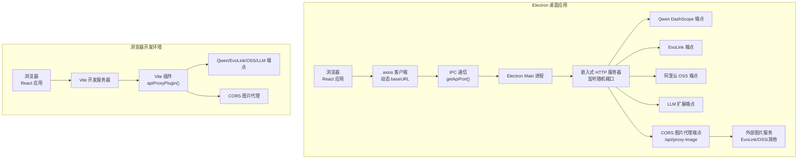
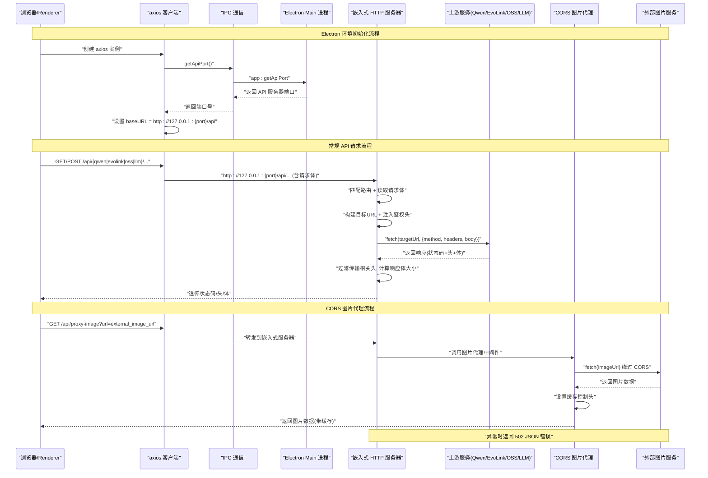
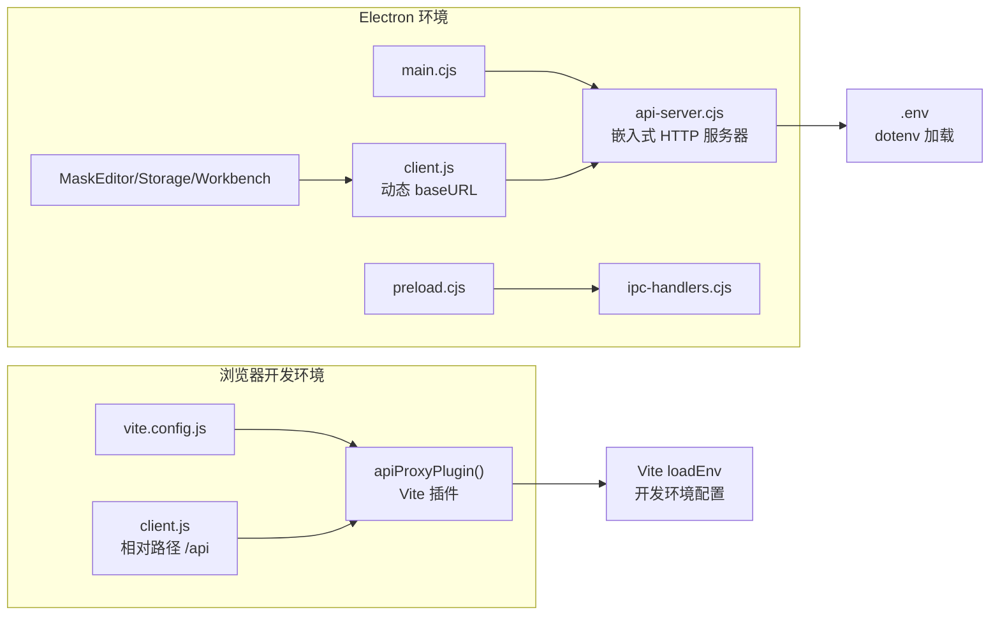

# API 代理服务

<cite>
**本文引用的文件**
- [app/electron/api-server.cjs](file://app/electron/api-server.cjs)
- [app/src/server/api-proxy.js](file://app/src/server/api-proxy.js)
- [app/vite.config.js](file://app/vite.config.js)
- [app/package.json](file://app/package.json)
- [app/src/services/api/client.js](file://app/src/services/api/client.js)
- [app/electron/main.cjs](file://app/electron/main.cjs)
- [app/electron/preload.cjs](file://app/electron/preload.cjs)
- [app/electron/ipc-handlers.cjs](file://app/electron/ipc-handlers.cjs)
- [app/src/components/MaskEditor.jsx](file://app/src/components/MaskEditor.jsx)
- [app/src/services/storage.js](file://app/src/services/storage.js)
- [app/src/pages/Workbench.jsx](file://app/src/pages/Workbench.jsx)
</cite>

## 更新摘要
**变更内容**
- **重大架构变更**：API 代理从 Vite 开发服务器插件迁移到 Electron 主进程内嵌 HTTP 服务器
- **新增嵌入式 HTTP 服务器**：在 Electron main 进程中启动独立的 API 代理服务器，监听随机端口
- **动态端口发现机制**：通过 IPC 通信让渲染进程动态获取 API 服务器端口
- **环境自适应客户端**：axios 客户端自动检测运行环境并调整 baseURL
- **保持向后兼容**：Vite 插件版本保留用于浏览器开发环境
- **统一代理功能**：支持 Qwen、EvoLink、OSS、LLM 和 CORS 图片代理

## 目录
1. [简介](#简介)
2. [项目结构](#项目结构)
3. [核心组件](#核心组件)
4. [架构总览](#架构总览)
5. [详细组件分析](#详细组件分析)
6. [依赖关系分析](#依赖关系分析)
7. [性能与可靠性](#性能与可靠性)
8. [部署指南](#部署指南)
9. [调试与排错](#调试与排错)
10. [结论](#结论)

## 简介
本文件为 AI Image Studio 的 API 代理服务提供完整技术文档。**重要架构变更**：API 代理已从 Vite 开发服务器插件迁移到 Electron 主进程内嵌 HTTP 服务器，实现了生产环境的独立代理服务，不再依赖 Vite 开发服务器。

该服务现在支持两种运行模式：
- **Electron 桌面应用**：使用嵌入式 HTTP 服务器，监听本地随机端口
- **浏览器开发环境**：保留 Vite 插件模式用于开发调试

代理层承担以下职责：
- **路由分发**：按 /api/qwen、/api/evolink、/api/oss、/api/llm、/api/proxy-image 前缀将请求转发到对应后端
- **鉴权注入**：自动注入 Bearer Token 或 OSS 访问头
- **请求体处理**：兼容不同环境的 body-parser 行为，确保正确转发
- **响应透传**：过滤不安全的传输相关头，避免浏览器重复解压
- **错误转发**：将上游异常转换为统一的 502 JSON 错误
- **CORS 绕过**：通过专用图片代理端点解决外部图片加载的跨域问题
- **动态端口管理**：在 Electron 环境中自动发现 API 服务器端口

此外，客户端通过 axios 实例智能选择正确的 baseURL，在 Electron 环境下指向嵌入式服务器，在浏览器环境下使用相对路径。

## 项目结构
API 代理服务现在由两个主要部分组成：
- **嵌入式 HTTP 服务器**（Electron 主进程）：生产环境的主要实现
- **Vite 插件**（开发环境）：浏览器开发时的备用方案

**图表来源**
- [app/electron/api-server.cjs:236-247](file://app/electron/api-server.cjs#L236-L247)
- [app/src/server/api-proxy.js:121-221](file://app/src/server/api-proxy.js#L121-L221)
- [app/src/services/api/client.js:22-37](file://app/src/services/api/client.js#L22-L37)

## 核心组件
- **嵌入式 HTTP 服务器**：基于 Node.js http.createServer 构建，在 Electron main 进程中启动
- **通用代理函数**：读取请求体、构建目标 URL、注入额外请求头、转发请求、透传响应与状态码、统一错误处理
- **CORS 图片代理函数**：专门处理外部图片 URL 的跨域问题，支持缓存控制
- **环境变量加载**：使用 dotenv 模块读取 .env 中的配置项
- **动态端口发现**：通过 IPC 通信让渲染进程获取 API 服务器实际端口
- **环境自适应客户端**：axios 客户端根据运行环境自动调整 baseURL
- **proxyImageUrl 工具函数**：自动重写外部图片 URL 为代理格式

关键要点
- 所有密钥仅存在于 Node 侧，不会进入浏览器打包产物
- 支持 POST/PUT/PATCH 的请求体转发，兼容不同环境的 body-parser 行为
- 自动计算 Content-Length，避免上游因分块编码导致的长度不一致
- 过滤 transfer-encoding、connection、content-encoding、content-length 等头部，防止浏览器二次解压或长度错误
- **CORS 代理提供 24 小时缓存控制，提升图片加载性能**
- **Electron 环境自动发现 API 服务器端口，无需手动配置**

**章节来源**
- [app/electron/api-server.cjs:61-116](file://app/electron/api-server.cjs#L61-L116)
- [app/electron/api-server.cjs:190-222](file://app/electron/api-server.cjs#L190-L222)
- [app/src/services/api/client.js:22-37](file://app/src/services/api/client.js#L22-L37)
- [app/src/services/api/client.js:182-188](file://app/src/services/api/client.js#L182-L188)

## 架构总览
下图展示了新的嵌入式 HTTP 服务器架构，包括 Electron 环境和浏览器环境的完整调用链。

**图表来源**
- [app/electron/api-server.cjs:145-228](file://app/electron/api-server.cjs#L145-L228)
- [app/src/services/api/client.js:22-37](file://app/src/services/api/client.js#L22-L37)
- [app/electron/main.cjs:94-102](file://app/electron/main.cjs#L94-L102)

## 详细组件分析

### 嵌入式 HTTP 服务器
**重大更新** - 替代 Vite 插件的生产环境实现：

- **HTTP 服务器创建**：使用 Node.js http.createServer 创建独立服务器
- **随机端口监听**：监听 127.0.0.1:0，系统自动分配可用端口
- **环境变量加载**：通过 dotenv 模块从 .env 文件加载配置，采用多候选路径策略（依次检查 `__dirname`、`__dirname/..`、`__dirname/../app`、`__dirname/app`），Electron 环境额外追加 `app.getAppPath()` 路径，确保各种运行环境下均能正确定位 .env
- **路由匹配器**：自定义 matchRoute 函数支持精确前缀匹配
- **统一请求处理**：handleRequest 函数集中处理所有路由逻辑

**章节来源**
- [app/electron/api-server.cjs:236-247](file://app/electron/api-server.cjs#L236-L247)
- [app/electron/api-server.cjs:133-143](file://app/electron/api-server.cjs#L133-L143)
- [app/electron/api-server.cjs:145-228](file://app/electron/api-server.cjs#L145-L228)
- [app/electron/api-server.cjs:21-60](file://app/electron/api-server.cjs#L21-L60)

### 动态端口发现机制
**新增功能** - 解决 Electron 环境中 API 服务器端口动态分配的问题：

- **IPC 通信接口**：通过 `app:getApiPort` 通道暴露端口信息
- **预加载脚本桥接**：preload.cjs 暴露 electronAPI.getApiPort() 给渲染进程
- **客户端自动检测**：axios 拦截器在请求前动态获取端口并设置 baseURL
- **环境自适应**：Electron 环境使用完整 URL，浏览器环境使用相对路径

**章节来源**
- [app/electron/preload.cjs:66-67](file://app/electron/preload.cjs#L66-67)
- [app/electron/ipc-handlers.cjs:10-60](file://app/electron/ipc-handlers.cjs#L10-60)
- [app/src/services/api/client.js:22-37](file://app/src/services/api/client.js#L22-L37)

### 路由与中间件
- `/api/qwen/*`：转发至 Qwen DashScope，注入 Authorization: Bearer <key>
- `/api/evolink/*`：转发至 EvoLink，注入 Authorization: Bearer <key>
- `/api/oss/*`：转发至阿里云 OSS REST 端点，注入 x-oss-access-key-id、x-oss-access-key-secret、Host
- `/api/llm/*`：转发至 LLM 扩展服务，注入 Authorization: Bearer <key>
- `/api/proxy-image`：CORS 图片代理，接收 url 参数，绕过外部服务跨域限制

每个路由均基于环境变量动态拼接目标地址，并通过通用代理函数完成转发。

**章节来源**
- [app/electron/api-server.cjs:148-222](file://app/electron/api-server.cjs#L148-L222)

### CORS 图片代理端点
**功能增强** - 在嵌入式服务器中实现相同功能的图片代理：

- **URL 参数验证**：检查必需的 url 参数是否存在
- **SSRF 防护**：拦截对内网地址的请求（127.0.0.1、localhost、169.254.169.254、0.0.0.0、10.x、192.168.x、172.x），返回 403，防止服务端被利用访问内部网络
- **外部请求转发**：使用 fetch 直接获取外部图片资源
- **响应处理**：透传原始 Content-Type 并设置缓存控制
- **错误处理**：区分上游错误和代理错误，返回适当的状态码
- **缓存优化**：设置 Cache-Control: public, max-age=86400（24小时缓存）

**章节来源**
- [app/electron/api-server.cjs:190-222](file://app/electron/api-server.cjs#L190-L222)
- [app/src/server/api-proxy.js:256-294](file://app/src/server/api-proxy.js#L256-L294)

### proxyImageUrl 工具函数
**功能增强** - 支持 Electron 环境的智能 URL 重写：

- **智能识别**：检测 data:、blob: 和已代理的 URL，直接返回原值
- **自动重写**：将 http(s) URL 包装为 /api/proxy-image?url=encodeURIComponent(...)
- **安全编码**：使用 encodeURIComponent 确保 URL 参数安全传递
- **环境兼容**：注释说明 Electron 环境下 baseURL 会在请求拦截器中处理

**章节来源**
- [app/src/services/api/client.js:182-188](file://app/src/services/api/client.js#L182-L188)

### 组件集成
CORS 代理功能已在多个组件中集成，部分组件需要更新以使用新的工具函数：

#### MaskEditor 组件
- **当前实现**：直接使用硬编码的 `/api/proxy-image` URL
- **建议改进**：使用 `proxyImageUrl()` 工具函数以获得更好的环境兼容性

#### StorageService
- **功能正常**：在 getImage 方法中使用代理获取外部图片
- **缓存优化**：缓存 blob URL 以提升后续访问性能

#### Workbench 页面
- **功能正常**：在 imageToBase64 函数中使用代理作为回退方案
- **确保兼容**：外部图片能够正确转换为 Base64 格式

**章节来源**
- [app/src/components/MaskEditor.jsx:450-456](file://app/src/components/MaskEditor.jsx#L450-L456)
- [app/src/services/storage.js:128-148](file://app/src/services/storage.js#L128-L148)
- [app/src/pages/Workbench.jsx:347-361](file://app/src/pages/Workbench.jsx#L347-361)

### 请求体处理
- **简化实现**：嵌入式服务器使用标准的流式读取，不依赖 Vite 内部中间件
- **Promise 封装**：将事件驱动的流读取封装为 Promise，便于异步处理
- **错误处理**：完善的错误捕获和拒绝处理

**章节来源**
- [app/electron/api-server.cjs:40-47](file://app/electron/api-server.cjs#L40-L47)

### 目标 URL 构建
- **防御性校验**：当 base 为空时抛出明确错误，提示检查 .env 中对应的环境变量，避免拼出无效 URL
- **路径清理**：去除 base 末尾多余斜杠
- **路径连接**：保证 path 以单个斜杠连接
- **通用性**：用于拼接 Qwen/EvoLink/OSS/LLM 的基础地址与具体路径

**章节来源**
- [app/electron/api-server.cjs:139-146](file://app/electron/api-server.cjs#L139-L146)
- [app/src/server/api-proxy.js:51-58](file://app/src/server/api-proxy.js#L51-L58)

### 通用代理流程
- **请求头合并**：合并 extraHeaders 与 Content-Type
- **长度计算**：根据实际 body 设置 Content-Length
- **请求发起**：使用 fetch 发起请求
- **响应透传**：透传状态码与响应头（过滤特定头）
- **数据处理**：读取 arrayBuffer 后转 Buffer 输出
- **异常处理**：捕获异常并返回 502 JSON 错误

**章节来源**
- [app/electron/api-server.cjs:61-116](file://app/electron/api-server.cjs#L61-L116)

### 环境变量与配置项
嵌入式服务器通过 dotenv 模块加载以下变量（示例键名）：
- VITE_QWEN_API_KEY、VITE_QWEN_API_BASE
- VITE_EVOLINK_API_KEY、VITE_EVOLINK_API_BASE
- VITE_OSS_ACCESS_KEY_ID、VITE_OSS_ACCESS_KEY_SECRET、VITE_OSS_BUCKET、VITE_OSS_REGION
- VITE_EXPANSION_LLM_KEY、VITE_EXPANSION_LLM_BASE

这些变量仅在 Node 环境可用，不会被打包进浏览器代码。

**环境变量加载策略**：
- **api-proxy.js（Vite 插件）**：通过 `import.meta.url` + `fileURLToPath` + `resolve` 从插件文件位置向上两级推导 `APP_ROOT`，作为 `loadEnv` 的 envDir，不再依赖 `server.config.root`（后者在嵌套项目结构下可能不指向 `app/`）
- **api-server.cjs（Electron 服务器）**：采用多候选路径策略，依次检查 `__dirname`、`__dirname/..`、`__dirname/../app`、`__dirname/app`，Electron 环境时额外追加 `app.getAppPath()` 路径

**启动时校验**：
- `validateBaseUrl` 函数在启动阶段对所有 Base URL 执行 `new URL()` 校验，不合法时打印错误日志
- 诊断日志中的 API Key 使用 `maskKey` 脱敏处理（前 4 位 + `***`），避免完整密钥泄露

**章节来源**
- [app/electron/api-server.cjs:21-94](file://app/electron/api-server.cjs#L21-L94)
- [app/src/server/api-proxy.js:18-20](file://app/src/server/api-proxy.js#L18-L20)

### 客户端集成与环境自适应
**重大更新** - 支持双环境运行的智能客户端：

- **环境检测**：自动检测是否在 Electron 环境中运行
- **动态端口获取**：通过 IPC 获取 API 服务器实际端口
- **baseURL 自适应**：Electron 环境使用完整 URL，浏览器环境使用相对路径
- **请求拦截器**：在每次请求前动态解析 baseURL
- **长超时客户端**：提供专门的长超时客户端用于同步图像生成类接口
- **重试机制**：内置指数退避重试与取消信号支持

**章节来源**
- [app/src/services/api/client.js:22-37](file://app/src/services/api/client.js#L22-L37)
- [app/src/services/api/client.js:62-76](file://app/src/services/api/client.js#L62-76)
- [app/src/services/api/client.js:50-57](file://app/src/services/api/client.js#L50-57)

### 测试页面
- **功能保留**：ApiTest 页面提供对各模型适配器的端到端测试按钮
- **兼容性**：通过 TaskEngine 提交任务，展示进度与结果，便于验证代理链路

**章节来源**
- [app/src/pages/ApiTest.jsx:86-203](file://app/src/pages/ApiTest.jsx#L86-L203)

## 依赖关系分析
**架构变更** - 新的依赖关系图展示了嵌入式服务器和 Vite 插件的双模式支持：

**图表来源**
- [app/electron/main.cjs:96-102](file://app/electron/main.cjs#L96-L102)
- [app/electron/api-server.cjs:236-247](file://app/electron/api-server.cjs#L236-L247)
- [app/src/services/api/client.js:22-37](file://app/src/services/api/client.js#L22-L37)
- [app/vite.config.js:3-7](file://app/vite.config.js#L3-7)

**章节来源**
- [app/electron/main.cjs:96-102](file://app/electron/main.cjs#L96-L102)
- [app/electron/api-server.cjs:236-247](file://app/electron/api-server.cjs#L236-L247)
- [app/src/services/api/client.js:22-37](file://app/src/services/api/client.js#L22-L37)
- [app/vite.config.js:3-7](file://app/vite.config.js#L3-7)

## 性能与可靠性
- **请求体处理优化**：嵌入式服务器使用标准流式读取，减少中间件开销
- **内存管理**：显式设置 Content-Length，避免上游因分块编码导致的不一致
- **响应头过滤**：过滤 content-encoding/content-length 等头，避免浏览器二次解压或长度错误
- **统一错误处理**：将网络/上游异常转换为 502 JSON，便于前端重试与提示
- **前端重试机制**：提供指数退避重试与可取消请求，提升鲁棒性
- **CORS 图片代理优化**：提供 24 小时缓存控制，显著减少重复请求
- **端口动态分配**：避免端口冲突，提高部署灵活性
- **环境自适应**：自动检测运行环境，提供最佳的性能体验
- **安全增强**：SSRF 防护拦截内网地址请求、API Key 日志脱敏、启动时 URL 合法性校验、buildTargetUrl 空值防御

**章节来源**
- [app/electron/api-server.cjs:61-116](file://app/electron/api-server.cjs#L61-L116)
- [app/electron/api-server.cjs:203-215](file://app/electron/api-server.cjs#L203-L215)
- [app/src/services/api/client.js:95-113](file://app/src/services/api/client.js#L95-113)

## 部署指南

### Electron 桌面应用部署
**新架构优势** - 嵌入式服务器完全独立于 Vite 开发服务器：

- **自动启动**：API 服务器在 Electron main 进程启动时自动初始化
- **端口管理**：系统自动分配可用端口，无需手动配置
- **环境隔离**：API 服务器与 UI 进程完全分离，提高稳定性
- **生产就绪**：打包后的应用包含完整的代理服务，无需外部依赖
- **环境变量打包**：electron-builder.yml 的 files 中已包含 `.env`，确保打包后的应用能正确加载环境变量。多候选路径策略确保在各种启动方式下均能定位到 .env 文件

**章节来源**
- [app/electron/main.cjs:96-102](file://app/electron/main.cjs#L96-L102)
- [app/electron/api-server.cjs:236-247](file://app/electron/api-server.cjs#L236-L247)

### 浏览器开发环境
**向后兼容** - 保留 Vite 插件模式用于开发调试：

- **开发脚本**：package.json 中 dev 命令同时启动 Vite 和 Electron
- **插件注册**：在 vite.config.js 中注册 apiProxyPlugin
- **环境变量**：建议使用 .env 文件管理敏感配置

**章节来源**
- [app/package.json:9-17](file://app/package.json#L9-17)
- [app/vite.config.js:3-7](file://app/vite.config.js#L3-7)

### 纯 Web 部署
**架构限制** - 嵌入式 HTTP 服务器仅适用于 Electron 环境：

对于纯 Web 部署场景，需要采用反向代理方案：

Nginx/Apache/Caddy 反向代理配置思路：
- location /api/qwen/ → 转发到 Qwen 基础地址，追加原路径
- location /api/evolink/ → 转发到 EvoLink 基础地址，追加原路径  
- location /api/oss/ → 转发到 OSS 域名，追加原路径，并注入必要头
- location /api/llm/ → 转发到 LLM 基础地址，追加原路径
- location /api/proxy-image/ → 转发到图片代理服务，处理 CORS 问题
- 同时设置合理的超时、缓存与日志

注意
- 生产环境不应暴露任何密钥到前端
- 如需在服务端注入鉴权头，应在反向代理层或独立后端服务中完成
- CORS 图片代理在生产环境中需要特别注意安全性，建议添加访问控制和速率限制

[本节为通用部署指导，未直接分析具体源码文件]

## 调试与排错

### 常见问题
- **401/403 认证失败**：检查 .env 中对应 API Key 是否正确
- **404 路径错误**：确认上游基础地址与路径拼接是否正确
- **502 代理错误**：查看服务端控制台日志，定位上游网络或协议问题
- **图片无法显示**：检查 CORS 代理是否正常工作，确认外部图片 URL 可访问
- **端口冲突**：Electron 环境使用随机端口，避免手动配置端口冲突
- **IPC 通信失败**：检查 preload 脚本是否正确暴露 getApiPort 接口
- **环境变量加载失败**：检查启动日志中的诊断信息，确认 .env 文件是否在候选路径中被找到。Vite 插件环境下确认 `APP_ROOT` 是否正确指向 `app/`，Electron 环境下确认 `__dirname` 的实际值和多候选路径检查结果
- **SSRF 403 拦截**：若图片代理返回 403，检查目标 URL 是否包含内网地址（如 127.0.0.1、10.x、192.168.x、172.x 等）

### 日志与监控
- **嵌入式服务器日志**：打印请求方法、目标 URL、请求体大小、响应状态码、Content-Type 与响应体大小
- **CORS 图片代理日志**：特别记录外部 URL、响应状态、Content-Type 和图片大小
- **IPC 通信日志**：记录端口获取和 API 服务器启动信息
- **客户端日志**：记录 baseURL 解析和请求重定向过程

**章节来源**
- [app/electron/api-server.cjs:62-115](file://app/electron/api-server.cjs#L62-L115)
- [app/electron/api-server.cjs:202-215](file://app/electron/api-server.cjs#L202-L215)
- [app/electron/main.cjs:98-102](file://app/electron/main.cjs#L98-L102)

### 端到端验证
- **使用 ApiTest 页面**：点击各模型测试按钮，观察日志与结果面板
- **检查 Network 面板**：核对 /api/* 请求是否被正确转发与响应
- **验证端口发现**：在控制台查看 API 服务器端口获取过程
- **测试 CORS 代理**：直接在浏览器中访问 /api/proxy-image?url=外部图片URL，验证图片能否正常加载

**章节来源**
- [app/src/pages/ApiTest.jsx:86-203](file://app/src/pages/ApiTest.jsx#L86-L203)

### CORS 代理调试技巧
- **检查浏览器控制台**：是否有跨域错误或端口获取失败警告
- **验证外部图片 URL**：确认外部图片 URL 是否可直接访问
- **确认代理端点响应**：检查代理端点返回正确的 Content-Type
- **检查缓存控制头**：确认 Cache-Control 头是否正确设置
- **使用 Network 面板**：查看完整的请求响应链和端口信息

### Electron 环境特定调试
- **检查主进程日志**：查看 API 服务器启动和端口分配信息
- **验证 IPC 通信**：确认 getApiPort 调用成功返回端口号
- **检查渲染进程日志**：查看 baseURL 解析和请求重定向过程
- **端口冲突排查**：确认没有其他进程占用分配的端口

**章节来源**
- [app/electron/main.cjs:98-102](file://app/electron/main.cjs#L98-L102)
- [app/src/services/api/client.js:24-34](file://app/src/services/api/client.js#L24-34)

## 结论
**重大架构升级**：AI Image Studio 的 API 代理服务已成功从 Vite 插件模式迁移到嵌入式 HTTP 服务器架构，实现了生产环境的独立代理服务。新的架构具有以下优势：

- **环境独立性**：Electron 桌面应用不再依赖 Vite 开发服务器，完全自包含
- **动态端口管理**：自动发现和分配端口，避免配置复杂性和端口冲突
- **环境自适应**：客户端智能检测运行环境，提供一致的 API 调用体验
- **向后兼容**：保留 Vite 插件模式用于浏览器开发环境
- **统一代理功能**：支持所有现有功能，包括 Qwen、EvoLink、OSS、LLM 和 CORS 图片代理

对于生产环境，嵌入式 HTTP 服务器提供了更好的稳定性和性能。对于开发环境，Vite 插件模式保持了原有的开发体验。这种双模式架构确保了应用在不同部署场景下的最佳表现。

**新增的 CORS 图片代理功能**有效解决了外部图片加载的跨域问题，特别是 EvoLink 等服务的安全限制。通过嵌入式服务器的统一管理，整个代理层的可靠性和可维护性得到了显著提升。