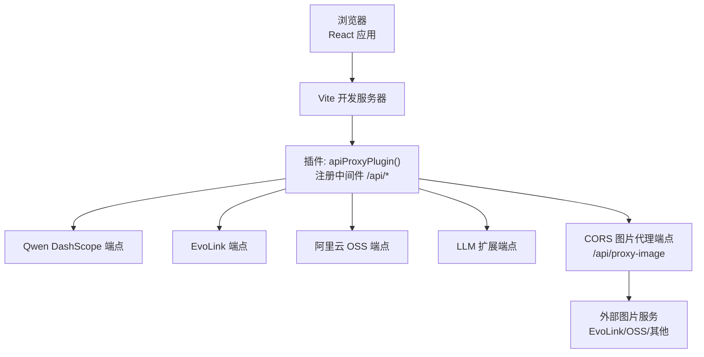
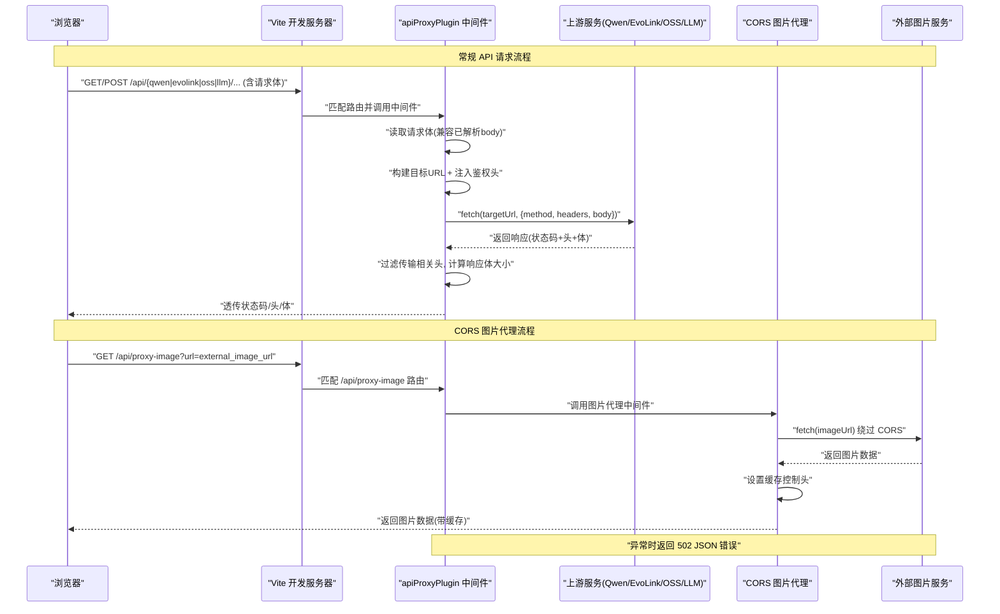
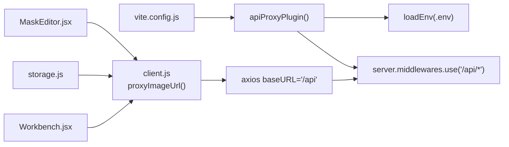

# API 代理服务

<cite>
**本文引用的文件**
- [app/src/server/api-proxy.js](file://app/src/server/api-proxy.js)
- [app/vite.config.js](file://app/vite.config.js)
- [app/package.json](file://app/package.json)
- [app/src/services/api/client.js](file://app/src/services/api/client.js)
- [app/src/pages/ApiTest.jsx](file://app/src/pages/ApiTest.jsx)
- [app/src/components/MaskEditor.jsx](file://app/src/components/MaskEditor.jsx)
- [app/src/services/storage.js](file://app/src/services/storage.js)
- [app/src/pages/Workbench.jsx](file://app/src/pages/Workbench.jsx)
</cite>

## 更新摘要
**变更内容**
- 新增 `/api/proxy-image` CORS 代理端点，专门用于绕过 EvoLink 等外部服务的跨域限制
- 添加 `proxyImageUrl()` 工具函数，自动将外部图片 URL 重写为代理格式
- 在多个组件中集成 CORS 代理功能，包括 MaskEditor、StorageService 和 Workbench
- 更新架构图以反映新的图片代理流程

## 目录
1. [简介](#简介)
2. [项目结构](#项目结构)
3. [核心组件](#核心组件)
4. [架构总览](#架构总览)
5. [详细组件分析](#详细组件分析)
6. [依赖关系分析](#依赖关系分析)
7. [性能与可靠性](#性能与可靠性)
8. [部署指南](#部署指南)
9. [调试与排错](#调试与排错)
10. [结论](#结论)

## 简介
本文件为 AI Image Studio 的 API 代理服务提供完整技术文档。该服务以 Vite 开发服务器插件的形式实现，负责在开发环境下统一转发前端对多个 AI 模型与云服务的请求，包括：
- 通义千问（DashScope）图像生成接口
- EvoLink（GPT-image-2、Nano Banana 2）
- 阿里云 OSS
- 扩展 LLM（兼容 DashScope/OpenAI 风格）
- **新增：CORS 图片代理（绕过外部服务跨域限制）**

代理层承担以下职责：
- 路由分发：按 /api/qwen、/api/evolink、/api/oss、/api/llm、/api/proxy-image 前缀将请求转发到对应后端
- 鉴权注入：自动注入 Bearer Token 或 OSS 访问头
- 请求体处理：兼容 Vite 中间件已解析 body 的情况，确保正确转发
- 响应透传：过滤不安全的传输相关头，避免浏览器重复解压
- 错误转发：将上游异常转换为统一的 502 JSON 错误
- **CORS 绕过：通过专用图片代理端点解决外部图片加载的跨域问题**

此外，客户端通过 axios 实例统一以 /api 前缀发起请求，天然规避跨域问题。

## 项目结构
API 代理服务由一个 Vite 插件构成，并在 vite.config.js 中注册。前端通过统一的 HTTP 客户端调用 /api/* 路径，由插件拦截并转发至目标服务。

**图表来源**
- [app/vite.config.js:1-12](file://app/vite.config.js#L1-L12)
- [app/src/server/api-proxy.js:121-221](file://app/src/server/api-proxy.js#L121-L221)

## 核心组件
- Vite 插件入口：导出一个工厂函数，返回插件对象，在 configureServer 钩子中挂载中间件
- 通用代理函数：读取请求体、构建目标 URL、注入额外请求头、转发请求、透传响应与状态码、统一错误处理
- **CORS 图片代理函数：专门处理外部图片 URL 的跨域问题，支持缓存控制**
- 环境变量加载：使用 Vite 的 loadEnv 读取 .env 中的配置项，避免泄露到客户端
- **proxyImageUrl 工具函数：自动重写外部图片 URL 为代理格式**

关键要点
- 所有密钥仅存在于 Node 侧，不会进入浏览器打包产物
- 支持 POST/PUT/PATCH 的请求体转发，兼容 Vite 内部 body-parser 已消费流的情况
- 自动计算 Content-Length，避免上游因分块编码导致的长度不一致
- 过滤 transfer-encoding、connection、content-encoding、content-length 等头部，防止浏览器二次解压或长度错误
- **CORS 代理提供 24 小时缓存控制，提升图片加载性能**

**章节来源**
- [app/src/server/api-proxy.js:25-116](file://app/src/server/api-proxy.js#L25-L116)
- [app/src/server/api-proxy.js:121-221](file://app/src/server/api-proxy.js#L121-L221)
- [app/src/services/api/client.js:145-157](file://app/src/services/api/client.js#L145-L157)

## 架构总览
下图展示了从浏览器到各上游服务的完整调用链，以及代理层的关键处理步骤，包括新增的 CORS 图片代理流程。

**图表来源**
- [app/src/server/api-proxy.js:55-116](file://app/src/server/api-proxy.js#L55-L116)
- [app/src/server/api-proxy.js:185-214](file://app/src/server/api-proxy.js#L185-L214)

## 详细组件分析

### 路由与中间件
- /api/qwen/*：转发至 Qwen DashScope，注入 Authorization: Bearer <key>
- /api/evolink/*：转发至 EvoLink，注入 Authorization: Bearer <key>
- /api/oss/*：转发至阿里云 OSS REST 端点，注入 x-oss-access-key-id、x-oss-access-key-secret、Host
- /api/llm/*：转发至 LLM 扩展服务，注入 Authorization: Bearer <key>
- **/api/proxy-image：CORS 图片代理，接收 url 参数，绕过外部服务跨域限制**

每个路由均基于环境变量动态拼接目标地址，并通过通用代理函数完成转发。

**章节来源**
- [app/src/server/api-proxy.js:139-214](file://app/src/server/api-proxy.js#L139-L214)

### CORS 图片代理端点
**新增功能** - 专门解决外部图片加载的跨域问题：

- **URL 参数验证**：检查必需的 url 参数是否存在
- **外部请求转发**：使用 fetch 直接获取外部图片资源
- **响应处理**：透传原始 Content-Type 并设置缓存控制
- **错误处理**：区分上游错误和代理错误，返回适当的状态码
- **缓存优化**：设置 Cache-Control: public, max-age=86400（24小时缓存）

**章节来源**
- [app/src/server/api-proxy.js:185-214](file://app/src/server/api-proxy.js#L185-L214)

### proxyImageUrl 工具函数
**新增功能** - 自动重写外部图片 URL：

- **智能识别**：检测 data:、blob: 和已代理的 URL，直接返回原值
- **自动重写**：将 http(s) URL 包装为 /api/proxy-image?url=encodeURIComponent(...)
- **安全编码**：使用 encodeURIComponent 确保 URL 参数安全传递

**章节来源**
- [app/src/services/api/client.js:145-157](file://app/src/services/api/client.js#L145-L157)

### 组件集成
CORS 代理功能已在多个组件中集成：

#### MaskEditor 组件
- 检测外部图片 URL（http:// 或 https://）
- 自动通过代理端点加载图片，避免 Canvas 跨域污染

#### StorageService
- 在 getImage 方法中使用代理获取外部图片
- 缓存 blob URL 以提升后续访问性能

#### Workbench 页面
- 在 imageToBase64 函数中使用代理作为回退方案
- 确保外部图片能够正确转换为 Base64 格式

**章节来源**
- [app/src/components/MaskEditor.jsx:450-456](file://app/src/components/MaskEditor.jsx#L450-L456)
- [app/src/services/storage.js:101-116](file://app/src/services/storage.js#L101-L116)
- [app/src/pages/Workbench.jsx:347-361](file://app/src/pages/Workbench.jsx#L347-L361)

### 请求体处理
- 若 req.body 已由 Vite 中间件解析，则直接转为 Buffer
- 否则监听 data/end 事件手动拼装 Buffer
- 针对 POST/PUT/PATCH 方法才读取请求体

**章节来源**
- [app/src/server/api-proxy.js:25-39](file://app/src/server/api-proxy.js#L25-L39)

### 目标 URL 构建
- 去除 base 末尾多余斜杠
- 保证 path 以单个斜杠连接
- 用于拼接 Qwen/EvoLink/OSS/LLM 的基础地址与具体路径

**章节来源**
- [app/src/server/api-proxy.js:45-49](file://app/src/server/api-proxy.js#L45-L49)

### 通用代理流程
- 合并 extraHeaders 与 Content-Type
- 根据实际 body 设置 Content-Length
- 使用 fetch 发起请求
- 透传状态码与响应头（过滤特定头）
- 读取 arrayBuffer 后转 Buffer 输出
- 捕获异常并返回 502 JSON 错误

**章节来源**
- [app/src/server/api-proxy.js:55-116](file://app/src/server/api-proxy.js#L55-L116)

### 环境变量与配置项
插件在启动时通过 Vite 的 loadEnv 读取以下变量（示例键名）：
- VITE_QWEN_API_KEY、VITE_QWEN_API_BASE
- VITE_EVOLINK_API_KEY、VITE_EVOLINK_API_BASE
- VITE_OSS_ACCESS_KEY_ID、VITE_OSS_ACCESS_KEY_SECRET、VITE_OSS_BUCKET、VITE_OSS_REGION
- VITE_EXPANSION_LLM_KEY、VITE_EXPANSION_LLM_BASE

这些变量仅在 Node 环境可用，不会被打包进浏览器代码。

**章节来源**
- [app/src/server/api-proxy.js:126-137](file://app/src/server/api-proxy.js#L126-L137)

### 客户端集成与跨域规避
- 前端 axios 实例 baseURL 设置为 /api，所有请求经 Vite 开发服务器本地转发，无需跨域
- 提供长超时客户端用于同步图像生成类接口
- 内置重试与取消信号支持，便于上层任务编排
- **新增 proxyImageUrl 工具函数，自动处理外部图片的跨域问题**

**章节来源**
- [app/src/services/api/client.js:18-33](file://app/src/services/api/client.js#L18-L33)
- [app/src/services/api/client.js:38-88](file://app/src/services/api/client.js#L38-88)
- [app/src/services/api/client.js:145-157](file://app/src/services/api/client.js#L145-L157)

### 测试页面
- ApiTest 页面提供对各模型适配器的端到端测试按钮
- 通过 TaskEngine 提交任务，展示进度与结果，便于验证代理链路

**章节来源**
- [app/src/pages/ApiTest.jsx:86-203](file://app/src/pages/ApiTest.jsx#L86-L203)

## 依赖关系分析
- Vite 插件在 vite.config.js 中注册，作为开发服务器中间件生效
- 插件依赖 Vite 提供的 loadEnv 与 server.middlewares.use
- 前端通过 axios 统一走 /api 前缀，避免跨域
- **新增：proxyImageUrl 工具函数被多个组件导入使用**

**图表来源**
- [app/vite.config.js:1-12](file://app/vite.config.js#L1-L12)
- [app/src/server/api-proxy.js:121-221](file://app/src/server/api-proxy.js#L121-L221)
- [app/src/services/api/client.js:145-157](file://app/src/services/api/client.js#L145-L157)
- [app/src/components/MaskEditor.jsx:450-456](file://app/src/components/MaskEditor.jsx#L450-L456)
- [app/src/services/storage.js:101-116](file://app/src/services/storage.js#L101-L116)
- [app/src/pages/Workbench.jsx:347-361](file://app/src/pages/Workbench.jsx#L347-L361)

**章节来源**
- [app/vite.config.js:1-12](file://app/vite.config.js#L1-L12)
- [app/src/server/api-proxy.js:121-221](file://app/src/server/api-proxy.js#L121-L221)
- [app/src/services/api/client.js:18-33](file://app/src/services/api/client.js#L18-L33)

## 性能与可靠性
- 请求体读取策略兼顾 Vite 内部中间件行为，减少重复解析开销
- 显式设置 Content-Length，避免上游因分块编码导致的不一致
- 过滤 content-encoding/content-length 等头，避免浏览器二次解压或长度错误
- 统一错误处理，将网络/上游异常转换为 502 JSON，便于前端重试与提示
- 前端提供指数退避重试与可取消请求，提升鲁棒性
- **CORS 图片代理提供 24 小时缓存控制，显著减少重复请求**
- **代理端点支持多种图片格式的自动 Content-Type 识别**

**章节来源**
- [app/src/server/api-proxy.js:55-116](file://app/src/server/api-proxy.js#L55-L116)
- [app/src/server/api-proxy.js:203-208](file://app/src/server/api-proxy.js#L203-L208)
- [app/src/services/api/client.js:38-88](file://app/src/services/api/client.js#L38-L88)

## 部署指南

### 开发环境
- 运行脚本：package.json 中 dev 命令启动 Vite 开发服务器
- 插件在开发模式下启用，/api/* 路由由 Vite 中间件处理
- 建议将敏感配置放入 .env 文件，并确保不被版本控制

**章节来源**
- [app/package.json:6-9](file://app/package.json#L6-L9)
- [app/vite.config.js:5-11](file://app/vite.config.js#L5-L11)

### 生产环境反向代理
由于当前代理逻辑位于 Vite 开发服务器插件中，生产构建产物不包含该中间件。推荐在生产环境使用 Nginx/Apache/Caddy 等反向代理，将 /api/* 请求转发到后端服务或外部 API。

Nginx 示例思路（概念性说明）
- location /api/qwen/ -> 转发到 Qwen 基础地址，追加原路径
- location /api/evolink/ -> 转发到 EvoLink 基础地址，追加原路径
- location /api/oss/ -> 转发到 OSS 域名，追加原路径，并注入必要头
- location /api/llm/ -> 转发到 LLM 基础地址，追加原路径
- **location /api/proxy-image/ -> 转发到图片代理服务，处理 CORS 问题**
- 同时设置合理的超时、缓存与日志

注意
- 生产环境不应暴露任何密钥到前端
- 如需在服务端注入鉴权头，应在反向代理层或独立后端服务中完成
- **CORS 图片代理在生产环境中需要特别注意安全性，建议添加访问控制和速率限制**

[本节为通用部署指导，未直接分析具体源码文件]

## 调试与排错

### 常见问题
- 401/403 认证失败：检查 .env 中对应 API Key 是否正确
- 404 路径错误：确认上游基础地址与路径拼接是否正确
- 502 代理错误：查看服务端控制台日志，定位上游网络或协议问题
- **图片无法显示：检查 CORS 代理是否正常工作，确认外部图片 URL 可访问**
- **CORS 错误：确保使用 /api/proxy-image 而非直接访问外部 URL**

### 日志与监控
- 代理层打印了请求方法、目标 URL、请求体大小、响应状态码、Content-Type 与响应体大小，便于快速定位问题
- **CORS 图片代理特别记录了外部 URL、响应状态、Content-Type 和图片大小**
- 建议在开发阶段开启更详细的日志，生产环境按需降级

**章节来源**
- [app/src/server/api-proxy.js:55-116](file://app/src/server/api-proxy.js#L55-L116)
- [app/src/server/api-proxy.js:195-208](file://app/src/server/api-proxy.js#L195-L208)

### 端到端验证
- 使用 ApiTest 页面点击各模型测试按钮，观察日志与结果面板
- 结合浏览器开发者工具的网络面板，核对 /api/* 请求是否被正确转发与响应
- **测试 CORS 代理：直接在浏览器中访问 /api/proxy-image?url=外部图片URL，验证图片能否正常加载**

**章节来源**
- [app/src/pages/ApiTest.jsx:86-203](file://app/src/pages/ApiTest.jsx#L86-L203)

### CORS 代理调试技巧
- 检查浏览器控制台是否有跨域错误
- 验证外部图片 URL 是否可直接访问
- 确认代理端点返回正确的 Content-Type
- 检查缓存控制头是否正确设置
- 使用 Network 面板查看完整的请求响应链

## 结论
本代理服务以轻量插件形式嵌入 Vite 开发服务器，集中管理多模型与云服务的前端请求转发，屏蔽跨域与鉴权细节，并提供一致的错误与日志体验。**新增的 CORS 图片代理功能有效解决了外部图片加载的跨域问题，特别是 EvoLink 等服务的安全限制**。对于生产环境，建议采用标准反向代理方案承载 /api/* 路由，保持密钥安全与高可用，并为图片代理端点添加适当的安全措施。