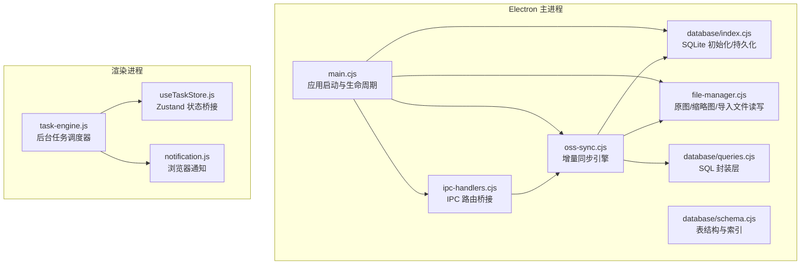
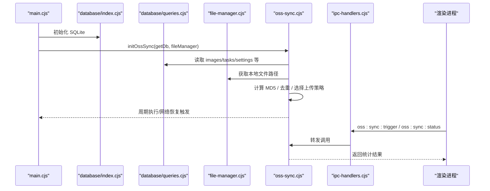
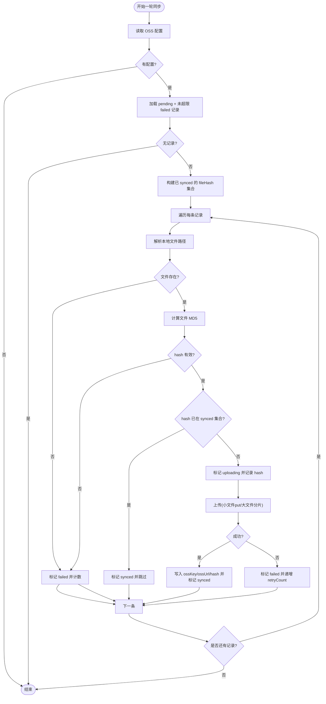
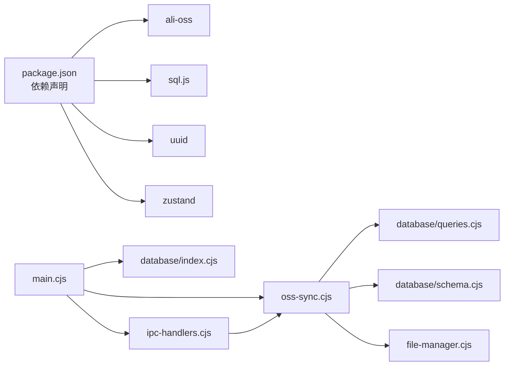

# OSS 增量备份引擎

<cite>
**本文引用的文件**   
- [oss-sync.cjs](file://app/electron/oss-sync.cjs)
- [main.cjs](file://app/electron/main.cjs)
- [ipc-handlers.cjs](file://app/electron/ipc-handlers.cjs)
- [database/index.cjs](file://app/electron/database/index.cjs)
- [database/schema.cjs](file://app/electron/database/schema.cjs)
- [database/queries.cjs](file://app/electron/database/queries.cjs)
- [file-manager.cjs](file://app/electron/file-manager.cjs)
- [task-engine.js](file://app/src/services/task-engine.js)
- [useTaskStore.js](file://app/src/stores/useTaskStore.js)
- [notification.js](file://app/src/services/notification.js)
- [package.json](file://app/package.json)
</cite>

## 目录
1. [简介](#简介)
2. [项目结构](#项目结构)
3. [核心组件](#核心组件)
4. [架构总览](#架构总览)
5. [详细组件分析](#详细组件分析)
6. [依赖关系分析](#依赖关系分析)
7. [性能与可靠性](#性能与可靠性)
8. [故障排查指南](#故障排查指南)
9. [结论](#结论)

## 简介
本仓库包含一个面向 AI 图像生成应用的“OSS 增量备份引擎”。该引擎运行在 Electron 主进程，负责将本地生成的图片自动、去重地同步到阿里云对象存储（OSS）。其关键特性包括：
- 基于数据库状态机的增量同步（pending → uploading → synced/failed）
- 每 5 分钟定时扫描待同步队列，失败项带最大重试次数
- 相同 fileHash 的去重机制，避免重复上传
- 大文件分片上传（阈值可配），提升稳定性与吞吐
- 网络恢复时自动触发一次同步
- 通过 IPC 暴露配置与状态查询接口，供渲染进程使用

## 项目结构
与 OSS 增量备份相关的代码主要位于 electron 主进程侧，配合前端任务中心与通知能力形成完整闭环。

图表来源
- [main.cjs:70-116](file://app/electron/main.cjs#L70-L116)
- [oss-sync.cjs:339-357](file://app/electron/oss-sync.cjs#L339-L357)
- [database/index.cjs:19-45](file://app/electron/database/index.cjs#L19-L45)
- [database/schema.cjs:6-115](file://app/electron/database/schema.cjs#L6-L115)
- [database/queries.cjs:1-120](file://app/electron/database/queries.cjs#L1-120)
- [file-manager.cjs:17-30](file://app/electron/file-manager.cjs#L17-L30)
- [ipc-handlers.cjs:55-60](file://app/electron/ipc-handlers.cjs#L55-L60)
- [task-engine.js:33-41](file://app/src/services/task-engine.js#L33-L41)
- [useTaskStore.js:14-20](file://app/src/stores/useTaskStore.js#L14-L20)
- [notification.js:78-103](file://app/src/services/notification.js#L78-L103)

章节来源
- [main.cjs:70-116](file://app/electron/main.cjs#L70-L116)
- [oss-sync.cjs:1-446](file://app/electron/oss-sync.cjs#L1-L446)
- [database/index.cjs:1-93](file://app/electron/database/index.cjs#L1-L93)
- [database/schema.cjs:1-115](file://app/electron/database/schema.cjs#L1-L115)
- [database/queries.cjs:1-721](file://app/electron/database/queries.cjs#L1-L721)
- [file-manager.cjs:1-196](file://app/electron/file-manager.cjs#L1-L196)
- [ipc-handlers.cjs:1-63](file://app/electron/ipc-handlers.cjs#L1-L63)
- [task-engine.js:1-319](file://app/src/services/task-engine.js#L1-L319)
- [useTaskStore.js:1-173](file://app/src/stores/useTaskStore.js#L1-L173)
- [notification.js:1-113](file://app/src/services/notification.js#L1-L113)

## 核心组件
- OSS 增量同步引擎（oss-sync.cjs）
  - 负责读取配置、扫描 pending/failed 记录、计算文件 hash、去重、选择上传策略（普通/分片）、更新状态与重试计数。
- 文件系统层（file-manager.cjs）
  - 提供原图、缩略图、导入文件的读写与路径解析，供同步引擎定位本地文件。
- 数据访问层（database/*）
  - index.cjs：sql.js 实例管理、WAL 模式尝试、延迟落盘；schema.cjs：表结构定义；queries.cjs：统一 SQL 封装与 JSON data 列合并。
- IPC 桥接（ipc-handlers.cjs）
  - 将数据库与 OSS 相关操作暴露为 db:* 与 oss:* 通道，供渲染进程调用。
- 应用入口（main.cjs）
  - 初始化数据库、注册 IPC、创建 FileManager、启动 API 代理、初始化 OSS 同步并监听系统事件。
- 前端任务与通知（task-engine.js, useTaskStore.js, notification.js）
  - 虽非 OSS 同步直接实现，但构成整体异步任务与用户反馈体系，便于理解应用上下文。

章节来源
- [oss-sync.cjs:1-446](file://app/electron/oss-sync.cjs#L1-L446)
- [file-manager.cjs:1-196](file://app/electron/file-manager.cjs#L1-L196)
- [database/index.cjs:1-93](file://app/electron/database/index.cjs#L1-L93)
- [database/schema.cjs:1-115](file://app/electron/database/schema.cjs#L1-L115)
- [database/queries.cjs:1-721](file://app/electron/database/queries.cjs#L1-L721)
- [ipc-handlers.cjs:1-63](file://app/electron/ipc-handlers.cjs#L1-L63)
- [main.cjs:70-116](file://app/electron/main.cjs#L70-L116)
- [task-engine.js:1-319](file://app/src/services/task-engine.js#L1-L319)
- [useTaskStore.js:1-173](file://app/src/stores/useTaskStore.js#L1-L173)
- [notification.js:1-113](file://app/src/services/notification.js#L1-L113)

## 架构总览
下图展示了从应用启动到增量同步执行的端到端流程，以及各模块之间的交互关系。

图表来源
- [main.cjs:70-116](file://app/electron/main.cjs#L70-L116)
- [oss-sync.cjs:339-357](file://app/electron/oss-sync.cjs#L339-L357)
- [database/index.cjs:19-45](file://app/electron/database/index.cjs#L19-L45)
- [database/queries.cjs:1-120](file://app/electron/database/queries.cjs#L1-120)
- [file-manager.cjs:100-111](file://app/electron/file-manager.cjs#L100-L111)
- [ipc-handlers.cjs:55-60](file://app/electron/ipc-handlers.cjs#L55-L60)

## 详细组件分析

### OSS 增量同步引擎（oss-sync.cjs）
- 设计要点
  - 状态机：pending → uploading → synced/failed，失败项按 retryCount 控制重试上限。
  - 去重：基于文件内容 MD5 的 fileHash，已 synced 的 hash 直接跳过。
  - 上传策略：小于阈值的文件走 put，大于阈值的走 multipartUpload（支持并行分片）。
  - 定时与恢复：启动后延时一轮，随后每 5 分钟执行一次；系统 resume 时触发一次。
  - 并发保护：isSyncing 标志防止同一时刻多轮同步。
- 关键流程（runSyncRound）
  - 读取 OSS 配置（settings 表 key='oss'）
  - 拉取 pending 与未超限的 failed 记录
  - 构建已 synced 的 fileHash 集合
  - 逐条处理：定位本地文件 → 计算 hash → 去重判断 → 标记 uploading → 上传 → 写入 ossKey/ossUrl/fileHash → 更新状态
  - 异常处理：失败则标记 failed 并递增 retryCount
- 对外接口
  - initOssSync/getDbFn/fm：初始化定时器与首次执行
  - triggerSync：手动触发（防并发）
  - getSyncStatus：统计 pending/uploading/synced/failed/total
  - getOssConfig/setOssConfig：配置读写
  - stopOssSync/onNetworkResume：停止与网络恢复回调

图表来源
- [oss-sync.cjs:232-330](file://app/electron/oss-sync.cjs#L232-L330)

章节来源
- [oss-sync.cjs:1-446](file://app/electron/oss-sync.cjs#L1-L446)

### 文件系统层（file-manager.cjs）
- 职责
  - 统一管理 originals/thumbnails/imports 三类文件目录
  - 提供 save/read/delete 等方法，并按 id 推断扩展名
  - 提供 getImagePath/getThumbnailPath 供同步引擎定位文件
  - 提供 getStorageStats 用于统计磁盘占用
- 与同步引擎协作
  - 当 DB 中 filePath 不可用时，回退到 getImagePath(id) 查找实际路径

章节来源
- [file-manager.cjs:17-139](file://app/electron/file-manager.cjs#L17-L139)
- [file-manager.cjs:100-111](file://app/electron/file-manager.cjs#L100-L111)

### 数据访问层（database/*）
- index.cjs
  - 初始化 sql.js 实例，加载或创建数据库，尝试开启 WAL 模式，提供 scheduleSave 延迟落盘与 closeDatabase 关闭资源。
- schema.cjs
  - 定义 images/batches/sessions/folders/tasks/settings/casePackages 等表及索引。
- queries.cjs
  - 统一封装所有表的增删改查，images/tasks/casePackages 等表采用“索引列 + JSON data 列”的混合存储策略，update 时进行 JSON 合并。

章节来源
- [database/index.cjs:1-93](file://app/electron/database/index.cjs#L1-L93)
- [database/schema.cjs:1-115](file://app/electron/database/schema.cjs#L1-L115)
- [database/queries.cjs:1-721](file://app/electron/database/queries.cjs#L1-L721)

### IPC 桥接（ipc-handlers.cjs）
- 将数据库与 OSS 相关操作映射为 db:* 与 oss:* 通道
- 提供 oss:sync:trigger、oss:sync:status、oss:config:get、oss:config:set 等接口

章节来源
- [ipc-handlers.cjs:1-63](file://app/electron/ipc-handlers.cjs#L1-L63)

### 应用入口（main.cjs）
- 初始化顺序：数据库 → 注册 IPC → 初始化 FileManager → 注册文件 IPC → 注册 app:// 协议 → 启动 API 代理 → 初始化 OSS 同步 → 监听 powerMonitor.resume → 创建窗口
- 退出前：停止 OSS 同步、关闭数据库

章节来源
- [main.cjs:70-116](file://app/electron/main.cjs#L70-L116)

### 前端任务与通知（辅助参考）
- task-engine.js：后台任务调度器，支持并发、FIFO、指数退避重试、进度上报、事件广播
- useTaskStore.js：将 TaskEngine 事件桥接到 Zustand 状态，驱动 UI 刷新
- notification.js：浏览器通知封装，任务完成/失败时推送

章节来源
- [task-engine.js:1-319](file://app/src/services/task-engine.js#L1-L319)
- [useTaskStore.js:1-173](file://app/src/stores/useTaskStore.js#L1-L173)
- [notification.js:1-113](file://app/src/services/notification.js#L1-L113)

## 依赖关系分析
- 外部依赖
  - ali-oss：阿里云 OSS SDK，用于上传
  - sql.js：内存 SQLite，用于主进程本地持久化
  - uuid：任务 ID 生成（前端任务引擎）
  - zustand：前端状态管理
- 内部依赖
  - oss-sync.cjs 依赖 database/queries.cjs 与 file-manager.cjs
  - main.cjs 协调初始化与生命周期
  - ipc-handlers.cjs 作为渲染进程与主进程的桥梁

图表来源
- [package.json:19-33](file://app/package.json#L19-L33)
- [main.cjs:70-116](file://app/electron/main.cjs#L70-L116)
- [oss-sync.cjs:15-17](file://app/electron/oss-sync.cjs#L15-L17)
- [database/index.cjs:1-93](file://app/electron/database/index.cjs#L1-L93)
- [database/schema.cjs:1-115](file://app/electron/database/schema.cjs#L1-L115)
- [database/queries.cjs:1-721](file://app/electron/database/queries.cjs#L1-L721)
- [file-manager.cjs:1-196](file://app/electron/file-manager.cjs#L1-L196)
- [ipc-handlers.cjs:1-63](file://app/electron/ipc-handlers.cjs#L1-L63)

章节来源
- [package.json:1-43](file://app/package.json#L1-L43)
- [main.cjs:70-116](file://app/electron/main.cjs#L70-L116)
- [oss-sync.cjs:1-446](file://app/electron/oss-sync.cjs#L1-L446)
- [database/index.cjs:1-93](file://app/electron/database/index.cjs#L1-L93)
- [database/schema.cjs:1-115](file://app/electron/database/schema.cjs#L1-L115)
- [database/queries.cjs:1-721](file://app/electron/database/queries.cjs#L1-L721)
- [file-manager.cjs:1-196](file://app/electron/file-manager.cjs#L1-L196)
- [ipc-handlers.cjs:1-63](file://app/electron/ipc-handlers.cjs#L1-L63)

## 性能与可靠性
- 去重优化
  - 基于 fileHash 的全局去重，避免重复上传，显著降低带宽与时间开销。
- 分片上传
  - 超过阈值的文件采用分片上传，提高大文件上传成功率与吞吐。
- 批量与延迟持久化
  - 数据库写操作通过 scheduleSave 聚合落盘，减少频繁 IO。
- 并发控制
  - 同步引擎单轮串行处理，避免对 OSS 与磁盘造成瞬时压力；可通过调整定时频率平衡实时性与负载。
- 错误恢复
  - 失败项按 retryCount 限制重试次数，结合网络恢复事件触发一次同步，增强鲁棒性。

[本节为通用指导，不直接分析具体文件]

## 故障排查指南
- 无法连接 OSS
  - 检查 settings 表中 key='oss' 的配置是否包含 region/accessKeyId/accessKeySecret/bucket/prefix 等必要字段。
  - 确认网络连通性与鉴权信息正确。
- 文件找不到
  - 若 DB 中 filePath 不存在，引擎会回退到 FileManager.getImagePath(id) 查找；如仍为空，将标记 failed。
- 重复上传
  - 确认 fileHash 计算正常且已写入；检查是否存在脏数据导致 hash 不一致。
- 同步卡住
  - 检查 isSyncing 标志位与定时器是否正常；查看日志输出中的 Round complete 统计。
- 权限与协议
  - 确保 app:// 协议与自定义 scheme 特权已注册，避免渲染进程访问受限。

章节来源
- [oss-sync.cjs:153-173](file://app/electron/oss-sync.cjs#L153-L173)
- [oss-sync.cjs:268-330](file://app/electron/oss-sync.cjs#L268-L330)
- [oss-sync.cjs:339-357](file://app/electron/oss-sync.cjs#L339-L357)
- [file-manager.cjs:100-111](file://app/electron/file-manager.cjs#L100-L111)
- [main.cjs:88-90](file://app/electron/main.cjs#L88-L90)

## 结论
OSS 增量备份引擎以轻量、可靠的方式实现了本地图片到云端的自动化同步。通过状态机、哈希去重、分片上传与延迟持久化等机制，在保证一致性的同时兼顾了性能与容错。配合 IPC 与前端任务/通知体系，形成了完整的用户体验闭环。建议在生产环境中根据业务规模调优分片大小、并行度与同步间隔，并完善监控与告警。