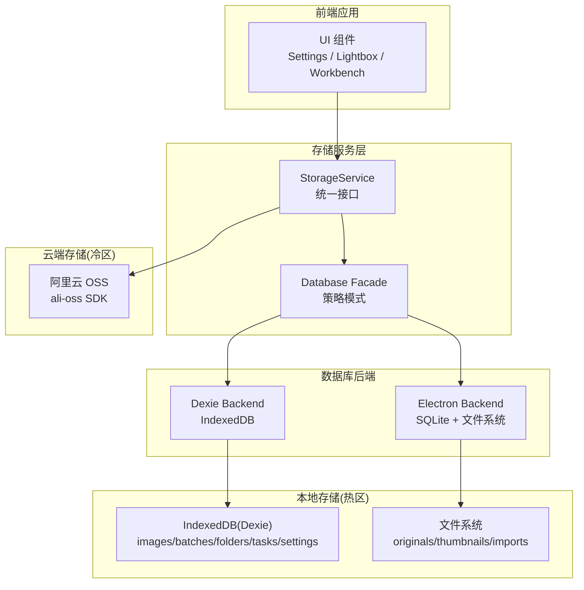
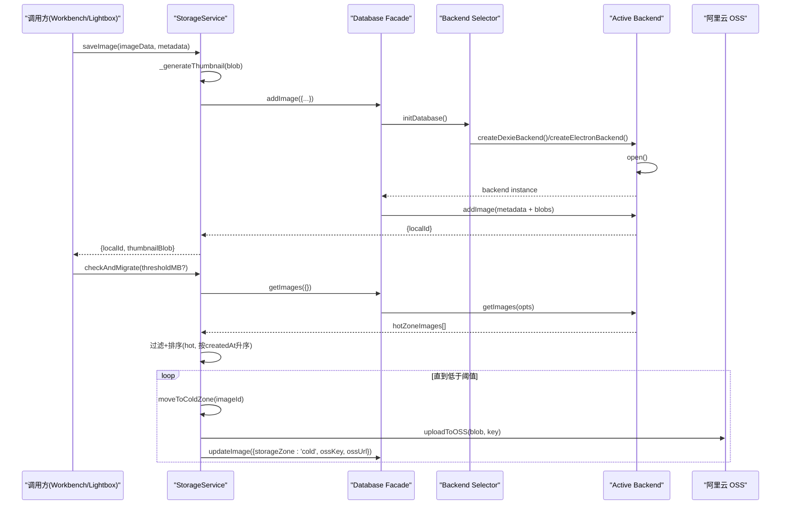
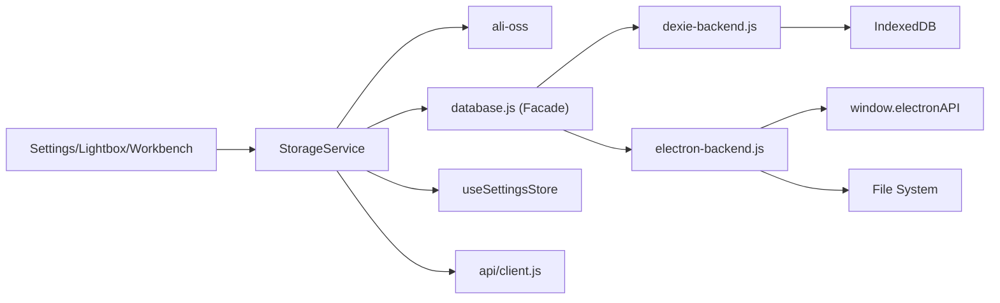

# 存储服务

<cite>
**本文引用的文件**   
- [app/src/services/storage.js](file://app/src/services/storage.js)
- [app/src/db/database.js](file://app/src/db/database.js)
- [app/src/db/dexie-backend.js](file://app/src/db/dexie-backend.js)
- [app/src/db/electron-backend.js](file://app/src/db/electron-backend.js)
- [app/src/stores/useSettingsStore.js](file://app/src/stores/useSettingsStore.js)
- [app/src/pages/Settings.jsx](file://app/src/pages/Settings.jsx)
- [app/src/components/Lightbox.jsx](file://app/src/components/Lightbox.jsx)
- [app/src/pages/Workbench.jsx](file://app/src/pages/Workbench.jsx)
- [app/src/services/api/client.js](file://app/src/services/api/client.js)
- [app/electron/file-manager.cjs](file://app/electron/file-manager.cjs)
- [app/electron/protocol.cjs](file://app/electron/protocol.cjs)
</cite>

## 更新摘要
**变更内容**   
- 新增双后端数据库架构支持（浏览器端 IndexedDB + 桌面端 SQLite）
- 实现策略模式数据库抽象层，自动环境检测
- 增强文件系统访问机制，支持 Electron 本地存储
- 改进路径解析和缩略图生成机制
- 优化冷热数据迁移策略

## 目录
1. [简介](#简介)
2. [项目结构](#项目结构)
3. [核心组件](#核心组件)
4. [架构总览](#架构总览)
5. [详细组件分析](#详细组件分析)
6. [依赖关系分析](#依赖关系分析)
7. [性能与缓存策略](#性能与缓存策略)
8. [错误处理与重试机制](#错误处理与重试机制)
9. [扩展指南：新增存储后端](#扩展指南新增存储后端)
10. [故障排查](#故障排查)
11. [结论](#结论)

## 简介
本文件为 AI Image Studio 的"存储服务"提供全面文档。该服务采用"冷热分层"的抽象设计模式，结合新的双后端数据库架构，将热数据（高频访问）保存在浏览器本地 IndexedDB 或桌面端 SQLite，冷数据（长期归档）保存在阿里云 OSS。通过统一的 StorageService 接口对外暴露上传、下载、删除、列表管理、冷热迁移、统计等能力，屏蔽底层存储差异，便于后续扩展更多云存储后端。

**更新** 新增了双后端数据库架构支持，在浏览器环境下使用 Dexie/IndexedDB，在 Electron 环境下使用 SQLite 通过 IPC 通信，实现了跨平台的数据持久化方案。

## 项目结构
- 存储服务实现位于 app/src/services/storage.js，封装了 IndexedDB 与阿里云 OSS 的调用逻辑
- **新增** 数据库抽象层位于 app/src/db/database.js，采用策略模式自动选择后端
- **新增** Dexie 后端实现位于 app/src/db/dexie-backend.js，处理浏览器端 IndexedDB 操作
- **新增** Electron 后端实现位于 app/src/electron-backend.js，处理桌面端 SQLite 和文件系统访问
- 设置持久化由 useSettingsStore 管理，包含存储配置（如 hotCapacity、OSS 相关字段）
- UI 层在 Settings 页面提供 OSS 连接测试与保存；Lightbox 和 Workbench 通过 StorageService 获取图片 Blob 或 URL



**图表来源**
- [app/src/services/storage.js:1-457](file://app/src/services/storage.js#L1-L457)
- [app/src/db/database.js:1-98](file://app/src/db/database.js#L1-L98)
- [app/src/db/dexie-backend.js:1-310](file://app/src/db/dexie-backend.js#L1-L310)
- [app/src/db/electron-backend.js:1-331](file://app/src/db/electron-backend.js#L1-L331)

**章节来源**
- [app/src/services/storage.js:1-457](file://app/src/services/storage.js#L1-L457)
- [app/src/db/database.js:1-98](file://app/src/db/database.js#L1-L98)
- [app/src/db/dexie-backend.js:1-310](file://app/src/db/dexie-backend.js#L1-L310)
- [app/src/db/electron-backend.js:1-331](file://app/src/db/electron-backend.js#L1-L331)
- [app/src/stores/useSettingsStore.js:1-179](file://app/src/stores/useSettingsStore.js#L1-L179)

## 核心组件
- **StorageService**：统一存储接口，负责热/冷区读写、缩略图生成、冷热迁移、统计查询、OSS 连接测试等
- **Database Facade**：策略模式门面类，自动检测运行环境并选择合适的数据库后端
- **Dexie Backend**：浏览器端后端实现，基于 Dexie 的 images 表维护元数据与 blobUrl/thumbnailUrl/blobSize 等字段
- **Electron Backend**：桌面端后端实现，通过 IPC 与 SQLite 和文件系统交互，支持 Blob 序列化传输
- **FileManager**：文件系统管理器，负责图片原图、缩略图的 CRUD 操作和路径管理
- **设置存储**：useSettingsStore 持久化 storageConfig（含 hotCapacity、OSS 配置），供 StorageService 动态读取

**更新** 新增了 Database Facade 和双后端架构，实现了跨平台的数据库抽象。

**章节来源**
- [app/src/services/storage.js:45-457](file://app/src/services/storage.js#L45-L457)
- [app/src/db/database.js:18-30](file://app/src/db/database.js#L18-L30)
- [app/src/db/dexie-backend.js:10-310](file://app/src/db/dexie-backend.js#L10-L310)
- [app/src/db/electron-backend.js:8-331](file://app/src/db/electron-backend.js#L8-L331)
- [app/electron/file-manager.cjs:17-139](file://app/electron/file-manager.cjs#L17-L139)
- [app/src/stores/useSettingsStore.js:42-179](file://app/src/stores/useSettingsStore.js#L42-L179)

## 架构总览
StorageService 作为门面类，向上提供统一 API，向下组合数据库抽象层与阿里云 OSS。其关键流程包括：
- **写入路径**：saveImage -> 生成缩略图 -> 写入数据库记录与 Blob URL -> 可选 moveToColdZone 上传至 OSS
- **读取路径**：getImage/getThumbnail -> 优先从热区 Blob URL 读取；若为冷区则 downloadFromOSS 拉取并回填热区
- **迁移路径**：checkAndMigrate -> 计算热区用量 -> 按创建时间升序挑选旧图 -> moveToColdZone 迁移
- **环境检测**：initDatabase() 自动检测 window.electronAPI 是否存在，选择对应的后端实现



**图表来源**
- [app/src/services/storage.js:53-101](file://app/src/services/storage.js#L53-L101)
- [app/src/db/database.js:22-30](file://app/src/db/database.js#L22-L30)
- [app/src/db/dexie-backend.js:32-39](file://app/src/db/dexie-backend.js#L32-L39)
- [app/src/db/electron-backend.js:48-69](file://app/src/db/electron-backend.js#L48-L69)

## 详细组件分析

### 统一存储接口：StorageService
- **热区操作**
  - saveImage：接收 Blob 或 URL，解析为 Blob，生成缩略图，写入数据库记录与 Blob URL，返回 localId 与缩略图 Blob
  - getImage/getThumbnail：根据 id 读取记录，通过 fetch 从 blobUrl 获取 Blob
  - deleteImage：释放对象 URL 并删除记录
- **冷区操作**
  - uploadToOSS：构造 ali-oss 客户端，put 上传，返回 OSS URL
  - downloadFromOSS：get 下载，兼容 Blob/Uint8Array，返回 Blob
  - checkOSSConnection：headBucket 校验 Bucket 权限与连通性
- **冷热迁移**
  - moveToColdZone：从热区拉取 Blob，上传到 OSS，更新记录为 cold，并释放热区 Blob URL
  - moveToHotZone：从 OSS 下载回热区，重建 Blob URL
  - checkAndMigrate：按阈值自动迁移最旧图片至冷区
- **统计**
  - getStorageStats：汇总热/冷区数量与已用字节数

**更新** 增强了 getImage 方法的容错机制，支持从远程 URL 代理获取图片并缓存。

```mermaid
classDiagram
class StorageServiceClass {
+saveImage(imageData, metadata) Promise~{localId, thumbnailBlob}~
+getImage(id) Promise~Blob|null~
+getThumbnail(id) Promise~Blob|null~
+deleteImage(id) Promise~void~
+uploadToOSS(blob, key, overrides) Promise~string~
+downloadFromOSS(key, override) Promise~Blob~
+checkOSSConnection(override) Promise~{ok,msg}~
+moveToColdZone(imageId) Promise~string~
+moveToHotZone(imageId) Promise~void~
+checkAndMigrate(thresholdMB) Promise~number~
+getStorageStats() Promise~object~
-_generateThumbnail(blob) Promise~Blob|null~
-_loadImage(blob) Promise~HTMLImageElement~
-_calculateThumbnailSize(img) ~{width,height}~
}
```

**图表来源**
- [app/src/services/storage.js:45-457](file://app/src/services/storage.js#L45-L457)

**章节来源**
- [app/src/services/storage.js:53-101](file://app/src/services/storage.js#L53-L101)
- [app/src/services/storage.js:108-151](file://app/src/services/storage.js#L108-L151)
- [app/src/services/storage.js:158-178](file://app/src/services/storage.js#L158-L178)
- [app/src/services/storage.js:184-192](file://app/src/services/storage.js#L184-L192)
- [app/src/services/storage.js:202-261](file://app/src/services/storage.js#L202-L261)
- [app/src/services/storage.js:268-362](file://app/src/services/storage.js#L268-L362)

### 数据库抽象层：策略模式实现
- **Database Facade**：统一导出所有数据库操作函数，内部委托给当前激活的后端
- **环境检测**：initDatabase() 检查 window.electronAPI?.db 是否存在，自动选择后端
- **后端工厂**：createDexieBackend() 和 createElectronBackend() 分别创建不同环境的后端实例
- **接口一致性**：两个后端实现完全相同的 API 接口，确保上层代码无需修改

**更新** 新增了完整的双后端架构，支持浏览器和桌面端的无缝切换。

**章节来源**
- [app/src/db/database.js:18-30](file://app/src/db/database.js#L18-L30)
- [app/src/db/database.js:32-98](file://app/src/db/database.js#L32-L98)

### Dexie 后端实现：浏览器端 IndexedDB
- **数据库初始化**：使用 Dexie 创建 AIImageStudio 数据库，定义 images、batches、folders、tasks、settings、casePackages 等表
- **索引优化**：为常用查询字段建立复合索引，如 [folderId+createdAt]
- **查询支持**：支持按 folderId、model、favorite、status 等条件筛选，支持分页和排序
- **Blob 存储**：直接存储 imageBlob 和 thumbnailBlob 二进制数据，避免重复网络请求

**章节来源**
- [app/src/db/dexie-backend.js:10-120](file://app/src/db/dexie-backend.js#L10-L120)
- [app/src/db/dexie-backend.js:122-310](file://app/src/db/dexie-backend.js#L122-L310)

### Electron 后端实现：桌面端 SQLite + 文件系统
- **IPC 通信**：通过 window.electronAPI.db.* 和 window.electronAPI.fs.* 与主进程通信
- **Blob 序列化**：blobToBuffer() 将 Blob 转换为 ArrayBuffer 进行 IPC 传输
- **文件持久化**：图片数据存储在 {userDataPath}/ai-image-studio/images/{originals,thumbnails,imports}/ 目录下
- **路径安全**：防止路径遍历攻击，只允许访问预定义的子目录
- **协议支持**：注册 app:// 自定义协议，支持直接从文件系统加载图片

**更新** 新增了完整的桌面端支持，包括文件系统管理和安全协议。

**章节来源**
- [app/src/db/electron-backend.js:8-153](file://app/src/db/electron-backend.js#L8-L153)
- [app/src/db/electron-backend.js:155-331](file://app/src/db/electron-backend.js#L155-L331)
- [app/electron/file-manager.cjs:17-139](file://app/electron/file-manager.cjs#L17-L139)
- [app/electron/protocol.cjs:18-93](file://app/electron/protocol.cjs#L18-L93)

### 设置与配置：useSettingsStore
- **存储配置项**
  - zone、autoCleanupDays、thumbnailMaxDimension、ossBucket、ossRegion、accessKeyId、accessKeySecret、hotCapacity 等
- **持久化**
  - loadSettings/saveSettings 将 modelConfigs/storageConfig/expansionConfig/generalConfig/isSetupComplete 持久化到 settings 表
- **默认值**
  - DEFAULT_STORAGE_CONFIG 包含环境变量注入的默认配置

**章节来源**
- [app/src/stores/useSettingsStore.js:42-179](file://app/src/stores/useSettingsStore.js#L42-L179)

### 用户界面集成
- **Settings 页面**
  - 提供 OSS 连接测试按钮，调用 StorageService.checkOSSConnection，展示成功/失败信息
- **Lightbox 组件**
  - 打开大图时通过 StorageService.getImage 获取 Blob，用于预览
  - 支持从冷区图片直接打开局部重绘编辑器
- **Workbench 工作区**
  - 生成结果中尝试通过 StorageService.getImage 获取 Blob，失败时回退到 URL 直链下载
- **API 客户端**
  - proxyImageUrl() 函数统一处理外部图片 URL 的代理访问

**更新** 增强了图片显示逻辑，支持多种图片来源和代理机制。

**章节来源**
- [app/src/pages/Settings.jsx:160-170](file://app/src/pages/Settings.jsx#L160-L170)
- [app/src/components/Lightbox.jsx:68-78](file://app/src/components/Lightbox.jsx#L68-L78)
- [app/src/components/Lightbox.jsx:111-129](file://app/src/components/Lightbox.jsx#L111-L129)
- [app/src/services/api/client.js:182-188](file://app/src/services/api/client.js#L182-L188)

## 依赖关系分析
- **StorageService 依赖**
  - ali-oss：用于与阿里云 OSS 交互
  - ../db/database：数据库抽象层，自动选择后端
  - ../stores/useSettingsStore：读取当前存储配置（Bucket/Region/AccessKey/hotCapacity）
  - ../services/api/client：URL 代理和 HTTP 客户端
- **数据库层依赖**
  - Dexie：IndexedDB 封装库（仅浏览器端）
  - window.electronAPI：IPC 通信接口（仅桌面端）
- **外部依赖**
  - 浏览器 API：URL.createObjectURL/revokeObjectURL、Canvas、fetch
  - Node.js API：fs、path（仅桌面端主进程）

**更新** 新增了数据库抽象层和双后端依赖关系。



**图表来源**
- [app/src/services/storage.js:10-13](file://app/src/services/storage.js#L10-L13)
- [app/src/db/database.js:12-13](file://app/src/db/database.js#L12-L13)
- [app/src/db/dexie-backend.js:8](file://app/src/db/dexie-backend.js#L8)
- [app/src/db/electron-backend.js:8-9](file://app/src/db/electron-backend.js#L8-L9)

**章节来源**
- [app/src/services/storage.js:10-13](file://app/src/services/storage.js#L10-L13)
- [app/src/db/database.js:12-13](file://app/src/db/database.js#L12-L13)
- [app/src/stores/useSettingsStore.js:8-11](file://app/src/stores/useSettingsStore.js#L8-L11)

## 性能与缓存策略
- **缩略图生成**
  - 使用 Canvas 将原图缩放至最大维度 200px，降低首屏渲染压力与网络传输体积
- **热区缓存**
  - 热区图片以 Blob URL 形式驻留在内存，避免重复网络请求；删除时主动 revokeObjectURL 释放内存
  - **新增** Electron 模式下图片持久化到文件系统，支持应用重启后恢复
- **冷热迁移**
  - 当热区使用量超过阈值（默认 100GB，可配置），按 createdAt 升序迁移最旧图片至冷区，保证热区容量可控
- **统计与监控**
  - getStorageStats 汇总热/冷区数量与已用字节，便于 UI 展示与告警
- **双重缓存**
  - **新增** 浏览器端同时缓存 imageBlob 和 blobUrl，桌面端缓存到文件系统，提高访问效率

**更新** 增强了缓存策略，支持跨会话的数据持久化。

**章节来源**
- [app/src/services/storage.js:387-411](file://app/src/services/storage.js#L387-L411)
- [app/src/services/storage.js:316-362](file://app/src/services/storage.js#L316-L362)
- [app/src/services/storage.js:368-378](file://app/src/services/storage.js#L368-L378)
- [app/electron/file-manager.cjs:115-138](file://app/electron/file-manager.cjs#L115-L138)

## 错误处理与重试机制
- **OSS 配置校验**
  - getOSSClient 在缺少必要配置时抛出错误，阻止无效请求
- **上传/下载异常**
  - uploadToOSS/downloadFromOSS 捕获异常并抛出带上下文的错误消息，便于上层提示
- **连接测试**
  - checkOSSConnection 区分 403/404 等状态码，给出明确原因（无权限/Bucket 不存在）
- **迁移容错**
  - checkAndMigrate 在单条迁移失败时继续下一条，不中断整体流程
- **数据库错误**
  - **新增** 双后端架构下，每个后端都有独立的错误处理逻辑
- **重试建议**
  - 当前未内置指数退避重试。建议在调用处增加重试包装（例如最多 3 次，间隔递增），并对网络超时与鉴权错误做差异化处理

**更新** 增强了错误处理机制，支持双后端架构的错误隔离。

**章节来源**
- [app/src/services/storage.js:21-43](file://app/src/services/storage.js#L21-L43)
- [app/src/services/storage.js:202-261](file://app/src/services/storage.js#L202-L261)
- [app/src/services/storage.js:349-358](file://app/src/services/storage.js#L349-L358)
- [app/src/db/electron-backend.js:14-37](file://app/src/db/electron-backend.js#L14-L37)

## 扩展指南：新增存储后端
目标：在不改动现有调用方的前提下，新增一个云存储后端（如腾讯云 COS、AWS S3）。

步骤
1. **新增后端适配器**
   - 新建文件 app/src/services/storage-adapters/<provider>.js，实现统一方法签名：
     - upload(blob, key, options) => Promise<string>
     - download(key, options) => Promise<Blob>
     - headBucket(options) => Promise<void>
   - 参考 StorageService.uploadToOSS/downloadFromOSS/checkOSSConnection 的实现风格
2. **注册与选择**
   - 在 StorageService 中增加 provider 选择逻辑（可从 settings 读取），根据 provider 路由到对应适配器
   - 保持对外 API 不变（uploadToOSS/downloadFromOSS/checkOSSConnection 名称与参数）
3. **配置项**
   - 在 DEFAULT_STORAGE_CONFIG 中添加新提供商所需字段（如 endpoint、secretId/secretKey、bucket 等）
   - 在 Settings 页面增加对应输入控件与"测试连接"按钮
4. **迁移与兼容性**
   - 保留 OSS 的 ossKey/ossUrl 字段语义，为新提供商定义 providerKey/providerUrl 字段，避免破坏历史数据
5. **测试与回归**
   - 覆盖上传、下载、连接测试、冷热迁移全流程用例
   - 验证错误码映射与用户提示一致性

**更新** 基于现有的双后端架构经验，提供了更完善的扩展指导。

**章节来源**
- [app/src/services/storage.js:202-261](file://app/src/services/storage.js#L202-L261)
- [app/src/stores/useSettingsStore.js:42-48](file://app/src/stores/useSettingsStore.js#L42-L48)
- [app/src/pages/Settings.jsx:160-170](file://app/src/pages/Settings.jsx#L160-L170)

## 故障排查
- **无法上传到 OSS**
  - 检查 Bucket/Region/AccessKey 是否完整且正确；使用 Settings 页面的"测试连接"确认权限
  - 关注控制台日志中的 OSS 上传失败信息，必要时开启浏览器开发者工具查看网络请求
- **下载失败**
  - 确认图片处于冷区且有 ossKey；检查网络连接与 CORS 策略
- **热区空间不足**
  - 调整 hotCapacity 阈值；手动触发 checkAndMigrate 进行迁移
- **缩略图不显示**
  - 检查 _generateThumbnail 是否成功生成；确认 canvas.toBlob 回调执行
- **内存泄漏风险**
  - 确保删除图片时调用 URL.revokeObjectURL；避免长时间持有大 Blob 引用
- **数据库连接问题**
  - **新增** 检查环境检测逻辑是否正确；确认 window.electronAPI 是否可用
  - **新增** 浏览器端检查 IndexedDB 权限；桌面端检查 SQLite 文件权限
- **文件系统访问失败**
  - **新增** 检查 app:// 协议是否正确注册；确认 FileManager 路径权限

**更新** 新增了双后端架构相关的故障排查指南。

**章节来源**
- [app/src/pages/Settings.jsx:160-170](file://app/src/pages/Settings.jsx#L160-L170)
- [app/src/services/storage.js:202-261](file://app/src/services/storage.js#L202-L261)
- [app/src/services/storage.js:316-362](file://app/src/services/storage.js#L316-L362)
- [app/src/services/storage.js:387-411](file://app/src/services/storage.js#L387-L411)
- [app/src/db/database.js:22-30](file://app/src/db/database.js#L22-L30)
- [app/electron/protocol.cjs:48-52](file://app/electron/protocol.cjs#L48-L52)

## 结论
StorageService 通过冷热分层与统一接口，结合新的双后端数据库架构，有效平衡了浏览器的本地性能与云端的长期存储需求。策略模式的数据库抽象层实现了跨平台的无缝切换，Dexie 和 Electron 后端分别针对各自环境进行了优化。结合 IndexedDB/SQLite 的灵活查询与 OSS 的高可用，系统具备良好的可扩展性与运维友好性。建议在生产环境中补充重试与熔断策略，完善监控指标，并持续优化缩略图与迁移策略以提升用户体验。

**更新** 新的双后端架构显著提升了应用的跨平台能力和数据持久化可靠性，为未来的功能扩展奠定了坚实基础。