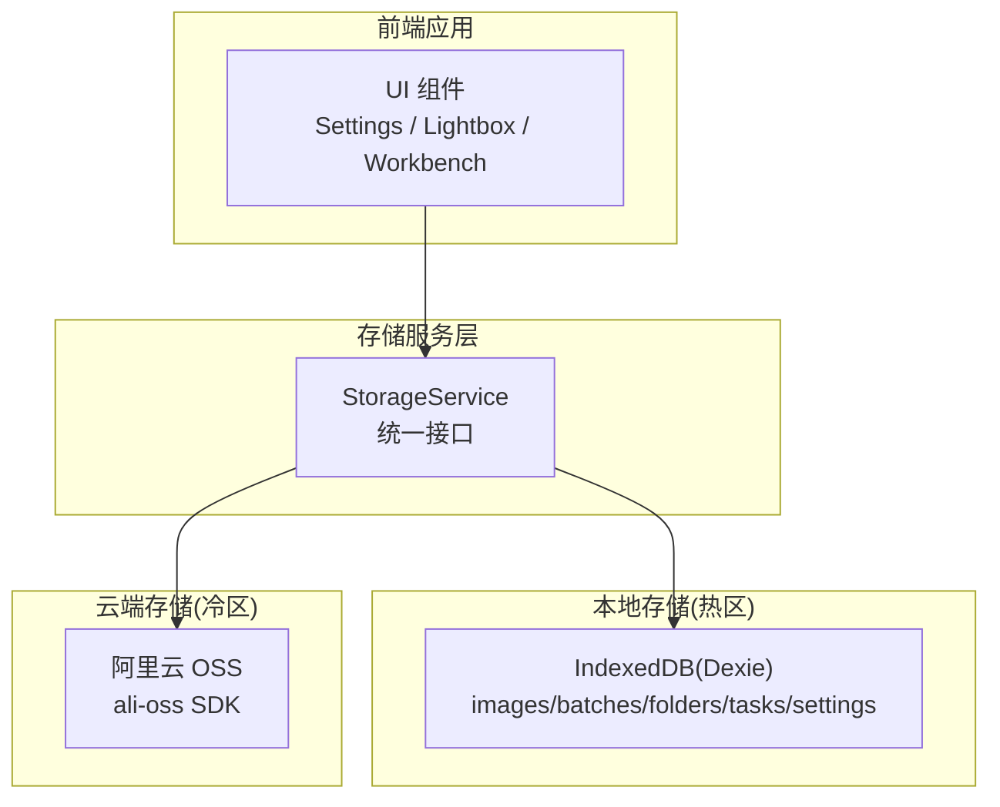
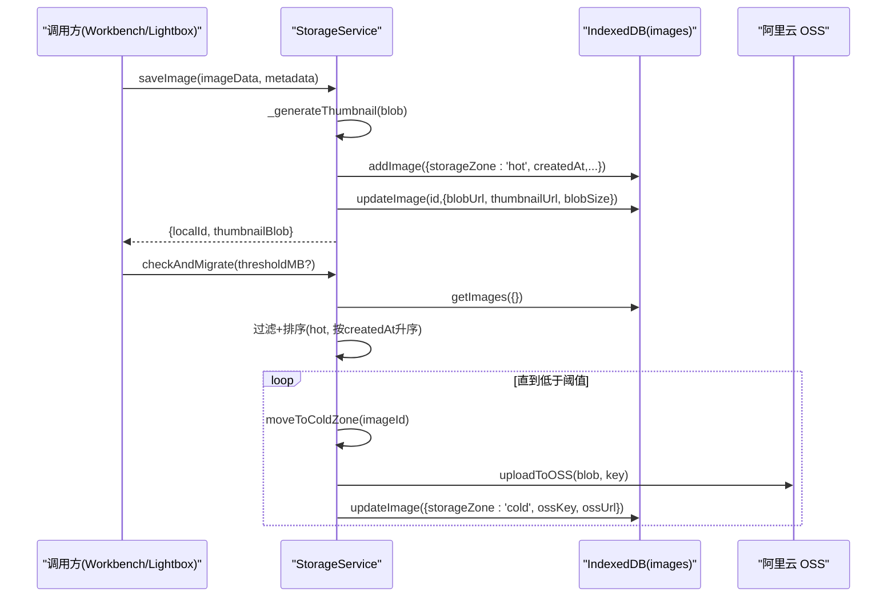
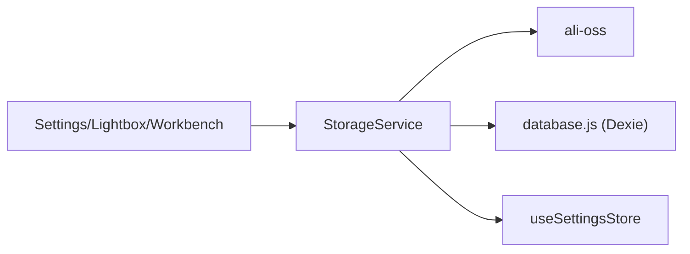

# 存储服务

<cite>
**本文引用的文件**   
- [app/src/services/storage.js](file://app/src/services/storage.js)
- [app/src/db/database.js](file://app/src/db/database.js)
- [app/src/stores/useSettingsStore.js](file://app/src/stores/useSettingsStore.js)
- [app/src/pages/Settings.jsx](file://app/src/pages/Settings.jsx)
- [app/src/components/Lightbox.jsx](file://app/src/components/Lightbox.jsx)
- [app/src/pages/Workbench.jsx](file://app/src/pages/Workbench.jsx)
</cite>

## 目录
1. [简介](#简介)
2. [项目结构](#项目结构)
3. [核心组件](#核心组件)
4. [架构总览](#架构总览)
5. [详细组件分析](#详细组件分析)
6. [依赖关系分析](#依赖关系分析)
7. [性能与缓存策略](#性能与缓存策略)
8. [错误处理与重试机制](#错误处理与重试机制)
9. [扩展指南：新增存储后端](#扩展指南新增存储后端)
10. [故障排查](#故障排查)
11. [结论](#结论)

## 简介
本文件为 AI Image Studio 的“存储服务”提供全面文档。该服务采用“冷热分层”的抽象设计模式，将热数据（高频访问）保存在浏览器本地 IndexedDB，冷数据（长期归档）保存在阿里云 OSS。通过统一的 StorageService 接口对外暴露上传、下载、删除、列表管理、冷热迁移、统计等能力，屏蔽底层存储差异，便于后续扩展更多云存储后端。

## 项目结构
- 存储服务实现位于 app/src/services/storage.js，封装了 IndexedDB 与阿里云 OSS 的调用逻辑。
- 数据库层使用 Dexie.js 对 IndexedDB 进行结构化操作，定义 images、batches、folders、tasks、settings 等表。
- 设置持久化由 useSettingsStore 管理，包含存储配置（如 hotCapacity、OSS 相关字段）。
- UI 层在 Settings 页面提供 OSS 连接测试与保存；Lightbox 和 Workbench 通过 StorageService 获取图片 Blob 或 URL。



图表来源
- [app/src/services/storage.js:1-393](file://app/src/services/storage.js#L1-L393)
- [app/src/db/database.js:1-339](file://app/src/db/database.js#L1-L339)
- [app/src/stores/useSettingsStore.js:1-162](file://app/src/stores/useSettingsStore.js#L1-L162)
- [app/src/pages/Settings.jsx:1-200](file://app/src/pages/Settings.jsx#L1-L200)
- [app/src/components/Lightbox.jsx:1-120](file://app/src/components/Lightbox.jsx#L1-L120)
- [app/src/pages/Workbench.jsx:1-350](file://app/src/pages/Workbench.jsx#L1-L350)

章节来源
- [app/src/services/storage.js:1-393](file://app/src/services/storage.js#L1-L393)
- [app/src/db/database.js:1-339](file://app/src/db/database.js#L1-L339)
- [app/src/stores/useSettingsStore.js:1-162](file://app/src/stores/useSettingsStore.js#L1-L162)
- [app/src/pages/Settings.jsx:1-200](file://app/src/pages/Settings.jsx#L1-L200)
- [app/src/components/Lightbox.jsx:1-120](file://app/src/components/Lightbox.jsx#L1-L120)
- [app/src/pages/Workbench.jsx:1-350](file://app/src/pages/Workbench.jsx#L1-L350)

## 核心组件
- StorageService：统一存储接口，负责热/冷区读写、缩略图生成、冷热迁移、统计查询、OSS 连接测试等。
- IndexedDB 数据层：基于 Dexie 的 images 表维护元数据与 blobUrl/thumbnailUrl/blobSize 等字段，支持按条件查询、批量更新、统计计数。
- 设置存储：useSettingsStore 持久化 storageConfig（含 hotCapacity、OSS 配置），供 StorageService 动态读取。

章节来源
- [app/src/services/storage.js:44-393](file://app/src/services/storage.js#L44-L393)
- [app/src/db/database.js:22-138](file://app/src/db/database.js#L22-L138)
- [app/src/stores/useSettingsStore.js:25-162](file://app/src/stores/useSettingsStore.js#L25-L162)

## 架构总览
StorageService 作为门面类，向上提供统一 API，向下组合 IndexedDB 与阿里云 OSS。其关键流程包括：
- 写入路径：saveImage -> 生成缩略图 -> 写入 IndexedDB 记录与 Blob URL -> 可选 moveToColdZone 上传至 OSS。
- 读取路径：getImage/getThumbnail -> 优先从热区 Blob URL 读取；若为冷区则 downloadFromOSS 拉取并回填热区。
- 迁移路径：checkAndMigrate -> 计算热区用量 -> 按创建时间升序挑选旧图 -> moveToColdZone 迁移。



图表来源
- [app/src/services/storage.js:51-79](file://app/src/services/storage.js#L51-L79)
- [app/src/services/storage.js:204-226](file://app/src/services/storage.js#L204-L226)
- [app/src/services/storage.js:252-298](file://app/src/services/storage.js#L252-L298)
- [app/src/db/database.js:43-86](file://app/src/db/database.js#L43-L86)

## 详细组件分析

### 统一存储接口：StorageService
- 热区操作
  - saveImage：接收 Blob 或 URL，解析为 Blob，生成缩略图，写入 IndexedDB 记录与 Blob URL，返回 localId 与缩略图 Blob。
  - getImage/getThumbnail：根据 id 读取记录，通过 fetch 从 blobUrl 获取 Blob。
  - deleteImage：释放对象 URL 并删除记录。
- 冷区操作
  - uploadToOSS：构造 ali-oss 客户端，put 上传，返回 OSS URL。
  - downloadFromOSS：get 下载，兼容 Blob/Uint8Array，返回 Blob。
  - checkOSSConnection：headBucket 校验 Bucket 权限与连通性。
- 冷热迁移
  - moveToColdZone：从热区拉取 Blob，上传到 OSS，更新记录为 cold，并释放热区 Blob URL。
  - moveToHotZone：从 OSS 下载回热区，重建 Blob URL。
  - checkAndMigrate：按阈值自动迁移最旧图片至冷区。
- 统计
  - getStorageStats：汇总热/冷区数量与已用字节数。

```mermaid
classDiagram
class StorageServiceClass {
+saveImage(imageData, metadata) Promise~{localId, thumbnailBlob}~
+getImage(id) Promise~Blob|null~
+getThumbnail(id) Promise~Blob|null~
+deleteImage(id) Promise~void~
+uploadToOSS(blob, key, overrides) Promise~string~
+downloadFromOSS(key, override) Promise~Blob~
+checkOSSConnection(override) Promise~{ok,msg}~
+moveToColdZone(imageId) Promise~string~
+moveToHotZone(imageId) Promise~void~
+checkAndMigrate(thresholdMB) Promise~number~
+getStorageStats() Promise~object~
-_generateThumbnail(blob) Promise~Blob|null~
-_loadImage(blob) Promise~HTMLImageElement~
-_calculateThumbnailSize(img) ~{width,height}~
}
```

图表来源
- [app/src/services/storage.js:44-393](file://app/src/services/storage.js#L44-L393)

章节来源
- [app/src/services/storage.js:51-79](file://app/src/services/storage.js#L51-L79)
- [app/src/services/storage.js:87-114](file://app/src/services/storage.js#L87-L114)
- [app/src/services/storage.js:120-128](file://app/src/services/storage.js#L120-L128)
- [app/src/services/storage.js:138-174](file://app/src/services/storage.js#L138-L174)
- [app/src/services/storage.js:181-197](file://app/src/services/storage.js#L181-L197)
- [app/src/services/storage.js:204-244](file://app/src/services/storage.js#L204-L244)
- [app/src/services/storage.js:252-314](file://app/src/services/storage.js#L252-L314)

### 索引数据库层：Dexie images 表
- 关键字段
  - id、batchId、folderId、model、favorite、createdAt、storageZone、blobUrl、thumbnailUrl、blobSize、ossKey、ossUrl 等。
- 常用操作
  - addImage/updateImage/deleteImage/getImages/searchImages/toggleImageFavorite/moveImages/getImageStats。
- 索引与排序
  - 默认按 createdAt 倒序；支持 folderId 精确匹配、model/favorite 过滤、limit/offset 分页。

章节来源
- [app/src/db/database.js:22-138](file://app/src/db/database.js#L22-L138)

### 设置与配置：useSettingsStore
- 存储配置项
  - zone、autoCleanupDays、thumbnailMaxDimension、ossBucket、ossRegion、accessKeyId、accessKeySecret、hotCapacity 等。
- 持久化
  - loadSettings/saveSettings 将 modelConfigs/storageConfig/expansionConfig/generalConfig/isSetupComplete 持久化到 settings 表。

章节来源
- [app/src/stores/useSettingsStore.js:25-162](file://app/src/stores/useSettingsStore.js#L25-L162)

### 用户界面集成
- Settings 页面
  - 提供 OSS 连接测试按钮，调用 StorageService.checkOSSConnection，展示成功/失败信息。
- Lightbox 组件
  - 打开大图时通过 StorageService.getImage 获取 Blob，用于预览。
- Workbench 工作区
  - 生成结果中尝试通过 StorageService.getImage 获取 Blob，失败时回退到 URL 直链下载。

章节来源
- [app/src/pages/Settings.jsx:150-170](file://app/src/pages/Settings.jsx#L150-L170)
- [app/src/components/Lightbox.jsx:55-70](file://app/src/components/Lightbox.jsx#L55-L70)
- [app/src/pages/Workbench.jsx:200-220](file://app/src/pages/Workbench.jsx#L200-L220)
- [app/src/pages/Workbench.jsx:310-330](file://app/src/pages/Workbench.jsx#L310-L330)

## 依赖关系分析
- StorageService 依赖
  - ali-oss：用于与阿里云 OSS 交互。
  - ../db/database：IndexedDB 读写。
  - ../stores/useSettingsStore：读取当前存储配置（Bucket/Region/AccessKey/hotCapacity）。
- 外部依赖
  - Dexie：IndexedDB 封装库。
  - 浏览器 API：URL.createObjectURL/revokeObjectURL、Canvas、fetch。



图表来源
- [app/src/services/storage.js:10-12](file://app/src/services/storage.js#L10-L12)
- [app/src/db/database.js:14-31](file://app/src/db/database.js#L14-L31)
- [app/src/stores/useSettingsStore.js:1-12](file://app/src/stores/useSettingsStore.js#L1-L12)

章节来源
- [app/src/services/storage.js:10-12](file://app/src/services/storage.js#L10-L12)
- [app/src/db/database.js:14-31](file://app/src/db/database.js#L14-L31)
- [app/src/stores/useSettingsStore.js:1-12](file://app/src/stores/useSettingsStore.js#L1-L12)

## 性能与缓存策略
- 缩略图生成
  - 使用 Canvas 将原图缩放至最大维度 200px，降低首屏渲染压力与网络传输体积。
- 热区缓存
  - 热区图片以 Blob URL 形式驻留在内存，避免重复网络请求；删除时主动 revokeObjectURL 释放内存。
- 冷热迁移
  - 当热区使用量超过阈值（默认 100GB，可配置），按 createdAt 升序迁移最旧图片至冷区，保证热区容量可控。
- 统计与监控
  - getStorageStats 汇总热/冷区数量与已用字节，便于 UI 展示与告警。

章节来源
- [app/src/services/storage.js:323-347](file://app/src/services/storage.js#L323-L347)
- [app/src/services/storage.js:252-298](file://app/src/services/storage.js#L252-L298)
- [app/src/services/storage.js:304-314](file://app/src/services/storage.js#L304-L314)

## 错误处理与重试机制
- OSS 配置校验
  - getOSSClient 在缺少必要配置时抛出错误，阻止无效请求。
- 上传/下载异常
  - uploadToOSS/downloadFromOSS 捕获异常并抛出带上下文的错误消息，便于上层提示。
- 连接测试
  - checkOSSConnection 区分 403/404 等状态码，给出明确原因（无权限/Bucket 不存在）。
- 迁移容错
  - checkAndMigrate 在单条迁移失败时继续下一条，不中断整体流程。
- 重试建议
  - 当前未内置指数退避重试。建议在调用处增加重试包装（例如最多 3 次，间隔递增），并对网络超时与鉴权错误做差异化处理。

章节来源
- [app/src/services/storage.js:29-42](file://app/src/services/storage.js#L29-L42)
- [app/src/services/storage.js:138-174](file://app/src/services/storage.js#L138-L174)
- [app/src/services/storage.js:181-197](file://app/src/services/storage.js#L181-L197)
- [app/src/services/storage.js:282-294](file://app/src/services/storage.js#L282-L294)

## 扩展指南：新增存储后端
目标：在不改动现有调用方的前提下，新增一个云存储后端（如腾讯云 COS、AWS S3）。

步骤
1. 新增后端适配器
   - 新建文件 app/src/services/storage-adapters/<provider>.js，实现统一方法签名：
     - upload(blob, key, options) => Promise<string>
     - download(key, options) => Promise<Blob>
     - headBucket(options) => Promise<void>
   - 参考 StorageService.uploadToOSS/downloadFromOSS/checkOSSConnection 的实现风格。
2. 注册与选择
   - 在 StorageService 中增加 provider 选择逻辑（可从 settings 读取），根据 provider 路由到对应适配器。
   - 保持对外 API 不变（uploadToOSS/downloadFromOSS/checkOSSConnection 名称与参数）。
3. 配置项
   - 在 DEFAULT_STORAGE_CONFIG 中添加新提供商所需字段（如 endpoint、secretId/secretKey、bucket 等）。
   - 在 Settings 页面增加对应输入控件与“测试连接”按钮。
4. 迁移与兼容性
   - 保留 OSS 的 ossKey/ossUrl 字段语义，为新提供商定义 providerKey/providerUrl 字段，避免破坏历史数据。
5. 测试与回归
   - 覆盖上传、下载、连接测试、冷热迁移全流程用例。
   - 验证错误码映射与用户提示一致性。

章节来源
- [app/src/services/storage.js:138-174](file://app/src/services/storage.js#L138-L174)
- [app/src/services/storage.js:181-197](file://app/src/services/storage.js#L181-L197)
- [app/src/stores/useSettingsStore.js:25-31](file://app/src/stores/useSettingsStore.js#L25-L31)
- [app/src/pages/Settings.jsx:150-170](file://app/src/pages/Settings.jsx#L150-L170)

## 故障排查
- 无法上传到 OSS
  - 检查 Bucket/Region/AccessKey 是否完整且正确；使用 Settings 页面的“测试连接”确认权限。
  - 关注控制台日志中的 OSS 上传失败信息，必要时开启浏览器开发者工具查看网络请求。
- 下载失败
  - 确认图片处于冷区且有 ossKey；检查网络连接与 CORS 策略。
- 热区空间不足
  - 调整 hotCapacity 阈值；手动触发 checkAndMigrate 进行迁移。
- 缩略图不显示
  - 检查 _generateThumbnail 是否成功生成；确认 canvas.toBlob 回调执行。
- 内存泄漏风险
  - 确保删除图片时调用 URL.revokeObjectURL；避免长时间持有大 Blob 引用。

章节来源
- [app/src/pages/Settings.jsx:150-170](file://app/src/pages/Settings.jsx#L150-L170)
- [app/src/services/storage.js:138-174](file://app/src/services/storage.js#L138-L174)
- [app/src/services/storage.js:252-298](file://app/src/services/storage.js#L252-L298)
- [app/src/services/storage.js:323-347](file://app/src/services/storage.js#L323-L347)

## 结论
StorageService 通过冷热分层与统一接口，有效平衡了浏览器的本地性能与云端的长期存储需求。结合 IndexedDB 的灵活查询与 OSS 的高可用，系统具备良好的可扩展性与运维友好性。建议在生产环境中补充重试与熔断策略，完善监控指标，并持续优化缩略图与迁移策略以提升用户体验。