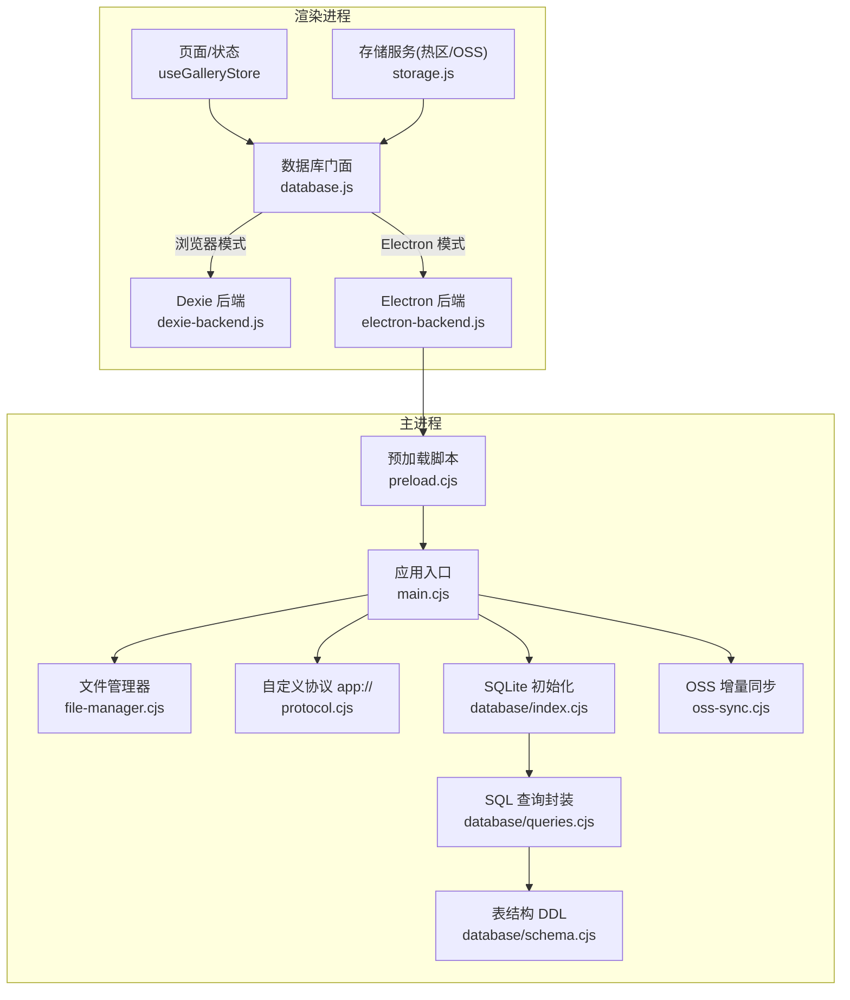
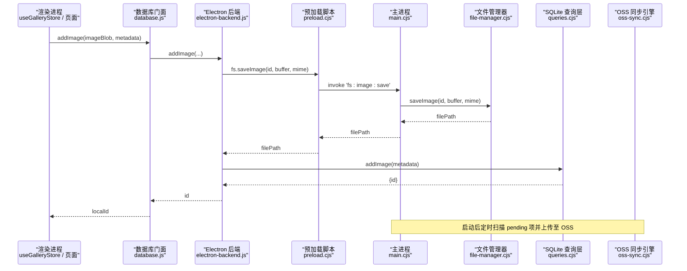
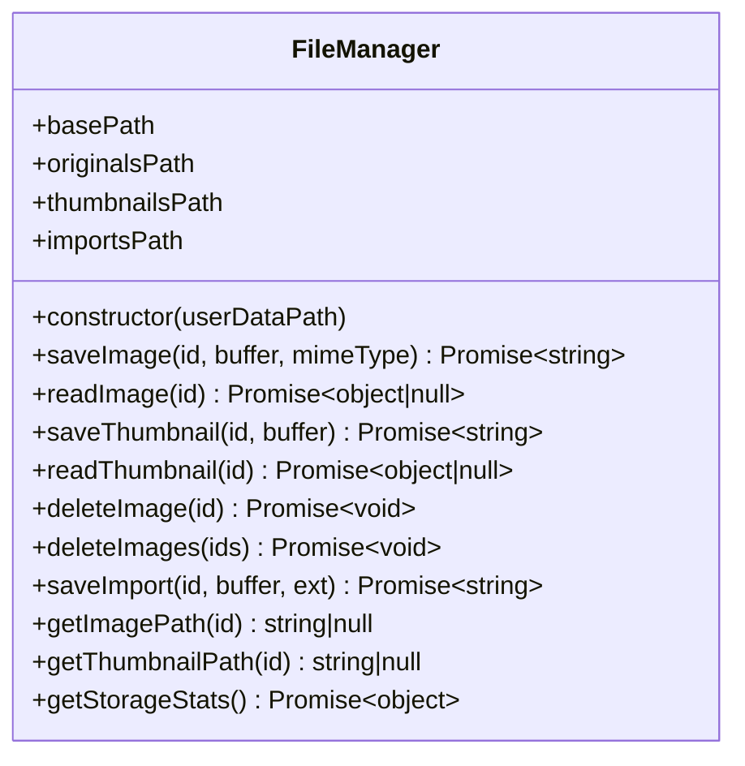
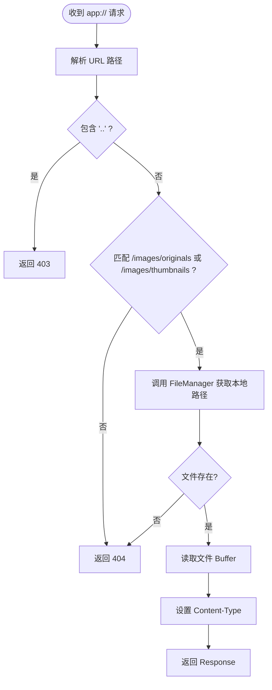
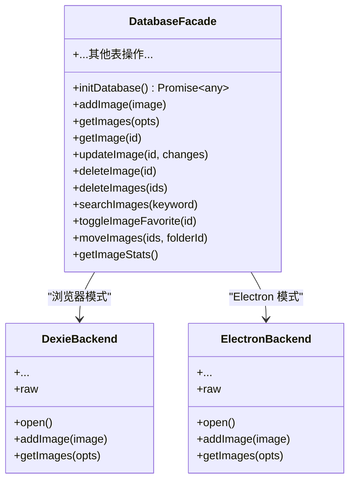
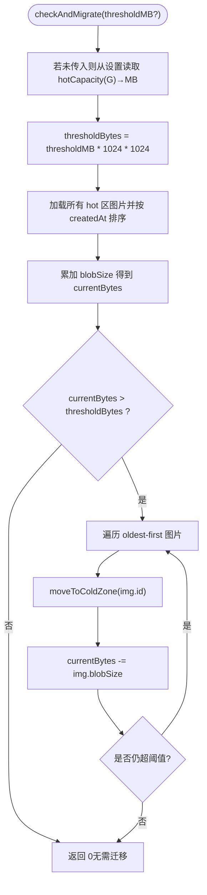
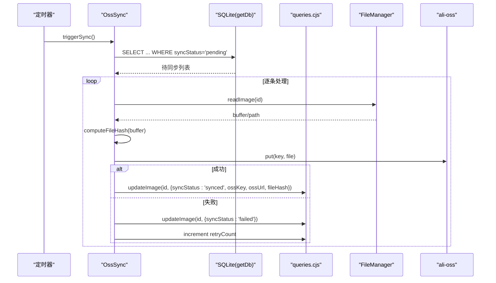
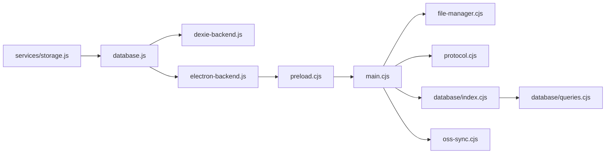

# 文件系统管理

<cite>
**本文引用的文件列表**
- [app/electron/file-manager.cjs](file://app/electron/file-manager.cjs)
- [app/electron/protocol.cjs](file://app/electron/protocol.cjs)
- [app/electron/main.cjs](file://app/electron/main.cjs)
- [app/electron/preload.cjs](file://app/electron/preload.cjs)
- [app/src/db/database.js](file://app/src/db/database.js)
- [app/src/db/dexie-backend.js](file://app/src/db/dexie-backend.js)
- [app/src/db/electron-backend.js](file://app/src/db/electron-backend.js)
- [app/electron/database/index.cjs](file://app/electron/database/index.cjs)
- [app/electron/database/schema.cjs](file://app/electron/database/schema.cjs)
- [app/electron/database/queries.cjs](file://app/electron/database/queries.cjs)
- [app/electron/oss-sync.cjs](file://app/electron/oss-sync.cjs)
- [app/src/services/storage.js](file://app/src/services/storage.js)
- [app/src/stores/useGalleryStore.js](file://app/src/stores/useGalleryStore.js)
</cite>

## 目录
1. [简介](#简介)
2. [项目结构](#项目结构)
3. [核心组件](#核心组件)
4. [架构总览](#架构总览)
5. [详细组件分析](#详细组件分析)
6. [依赖关系分析](#依赖关系分析)
7. [性能与容量管理](#性能与容量管理)
8. [故障排查指南](#故障排查指南)
9. [结论](#结论)
10. [附录](#附录)

## 简介
本文件围绕“文件系统管理”主题，系统性梳理该图像工作室应用在 Electron 环境下的本地文件存储、缩略图生成、IndexedDB 热区缓存、SQLite 元数据持久化以及阿里云 OSS 冷区备份的完整链路。文档面向不同技术背景的读者，提供从高层架构到代码级实现的渐进式说明，并辅以可视化图示帮助理解关键流程与数据流。

## 项目结构
与文件系统管理相关的模块主要分布在以下位置：
- Electron 主进程侧：负责本地磁盘读写、数据库初始化、协议路由、OSS 同步调度等
- 渲染进程侧（前端）：通过 IPC 调用主进程能力，同时使用 IndexedDB 做热区缓存和缩略图生成
- 数据库层：Dexie（浏览器模式）与 SQLite（Electron 模式）双后端统一抽象

图表来源
- [app/electron/main.cjs:1-126](file://app/electron/main.cjs#L1-L126)
- [app/electron/preload.cjs:1-82](file://app/electron/preload.cjs#L1-L82)
- [app/electron/file-manager.cjs:1-196](file://app/electron/file-manager.cjs#L1-L196)
- [app/electron/protocol.cjs:1-93](file://app/electron/protocol.cjs#L1-L93)
- [app/electron/database/index.cjs:1-93](file://app/electron/database/index.cjs#L1-L93)
- [app/electron/database/schema.cjs:1-115](file://app/electron/database/schema.cjs#L1-L115)
- [app/electron/database/queries.cjs:1-200](file://app/electron/database/queries.cjs#L1-L200)
- [app/electron/oss-sync.cjs:1-445](file://app/electron/oss-sync.cjs#L1-L445)
- [app/src/db/database.js:1-98](file://app/src/db/database.js#L1-L98)
- [app/src/db/dexie-backend.js:1-310](file://app/src/db/dexie-backend.js#L1-L310)
- [app/src/db/electron-backend.js:1-331](file://app/src/db/electron-backend.js#L1-L331)
- [app/src/services/storage.js:1-457](file://app/src/services/storage.js#L1-L457)

章节来源
- [app/electron/main.cjs:1-126](file://app/electron/main.cjs#L1-L126)
- [app/electron/preload.cjs:1-82](file://app/electron/preload.cjs#L1-L82)
- [app/electron/file-manager.cjs:1-196](file://app/electron/file-manager.cjs#L1-L196)
- [app/electron/protocol.cjs:1-93](file://app/electron/protocol.cjs#L1-L93)
- [app/electron/database/index.cjs:1-93](file://app/electron/database/index.cjs#L1-L93)
- [app/electron/database/schema.cjs:1-115](file://app/electron/database/schema.cjs#L1-L115)
- [app/electron/database/queries.cjs:1-200](file://app/electron/database/queries.cjs#L1-L200)
- [app/electron/oss-sync.cjs:1-445](file://app/electron/oss-sync.cjs#L1-L445)
- [app/src/db/database.js:1-98](file://app/src/db/database.js#L1-L98)
- [app/src/db/dexie-backend.js:1-310](file://app/src/db/dexie-backend.js#L1-L310)
- [app/src/db/electron-backend.js:1-331](file://app/src/db/electron-backend.js#L1-L331)
- [app/src/services/storage.js:1-457](file://app/src/services/storage.js#L1-L457)

## 核心组件
- 文件管理器（FileManager）：封装原图、缩略图、导入图片的本地读写、删除与统计；注册 IPC 接口供渲染进程调用；配合 app:// 协议实现资源访问。
- 数据库门面（database.js）：策略模式选择 Dexie 或 Electron 后端，屏蔽差异，对外暴露统一 API。
- Electron 后端（electron-backend.js）：将 Blob 写入本地文件系统，并将元数据写入 SQLite；读取时合并文件内容与元数据。
- 存储服务（StorageService）：在浏览器模式下以 IndexedDB 为热区，支持缩略图生成、OSS 上传下载、冷热区迁移与容量检查。
- 自定义协议（protocol.cjs）：将 app:// 请求映射到本地文件路径，安全校验后返回二进制响应。
- OSS 同步引擎（oss-sync.cjs）：定时扫描待同步项，计算文件哈希去重，分片上传大文件，失败重试，网络恢复自动触发。

章节来源
- [app/electron/file-manager.cjs:1-196](file://app/electron/file-manager.cjs#L1-L196)
- [app/src/db/database.js:1-98](file://app/src/db/database.js#L1-L98)
- [app/src/db/electron-backend.js:1-331](file://app/src/db/electron-backend.js#L1-L331)
- [app/src/services/storage.js:1-457](file://app/src/services/storage.js#L1-L457)
- [app/electron/protocol.cjs:1-93](file://app/electron/protocol.cjs#L1-L93)
- [app/electron/oss-sync.cjs:1-445](file://app/electron/oss-sync.cjs#L1-L445)

## 架构总览
下图展示了从渲染进程发起保存操作到最终落盘与元数据持久化的端到端流程，包括热区缓存、本地文件落盘、SQLite 记录与 OSS 同步的协作关系。

图表来源
- [app/src/db/database.js:1-98](file://app/src/db/database.js#L1-L98)
- [app/src/db/electron-backend.js:1-331](file://app/src/db/electron-backend.js#L1-L331)
- [app/electron/preload.cjs:1-82](file://app/electron/preload.cjs#L1-L82)
- [app/electron/main.cjs:1-126](file://app/electron/main.cjs#L1-L126)
- [app/electron/file-manager.cjs:1-196](file://app/electron/file-manager.cjs#L1-L196)
- [app/electron/database/queries.cjs:1-200](file://app/electron/database/queries.cjs#L1-L200)
- [app/electron/oss-sync.cjs:1-445](file://app/electron/oss-sync.cjs#L1-L445)

## 详细组件分析

### 文件管理器（FileManager）
- 职责
  - 维护 images 目录结构：originals、thumbnails、imports
  - 提供原图、缩略图的保存、读取、删除与批量删除
  - 提供导入图片保存与路径查询
  - 提供存储统计（按目录计数与大小）
  - 注册 IPC 处理器，暴露给渲染进程
- 关键点
  - 构造时确保目录存在
  - 读取原图时尝试多种扩展名以兼容不同格式
  - 删除原图时遍历可能存在的扩展名一并清理
  - 统计函数对每个目录进行 readdir + stat 汇总
- 复杂度
  - 单文件读写 O(1)
  - 统计 O(N)（N 为目录下文件数）

图表来源
- [app/electron/file-manager.cjs:1-196](file://app/electron/file-manager.cjs#L1-L196)

章节来源
- [app/electron/file-manager.cjs:1-196](file://app/electron/file-manager.cjs#L1-L196)

### 自定义协议（app://）
- 职责
  - 注册 app:// 特权 scheme，允许标准网络 API 访问本地资源
  - 将 app://images/originals/{id}.png 与 thumbnails 路由映射到本地文件
  - 安全检查防止路径穿越
  - 返回带正确 Content-Type 的 Response
- 关键点
  - 必须在 app ready 之前注册特权 scheme
  - 解析 URL 路径并提取 id，再交由 FileManager 获取真实路径
  - 不存在则返回 404

图表来源
- [app/electron/protocol.cjs:1-93](file://app/electron/protocol.cjs#L1-L93)
- [app/electron/file-manager.cjs:1-196](file://app/electron/file-manager.cjs#L1-L196)

章节来源
- [app/electron/protocol.cjs:1-93](file://app/electron/protocol.cjs#L1-L93)

### 数据库门面与后端策略
- 门面（database.js）
  - 根据运行环境选择 Dexie 或 Electron 后端
  - 统一导出所有数据库操作，上层无需感知差异
- Dexie 后端（dexie-backend.js）
  - 定义 IndexedDB 表结构与索引
  - 提供增删改查、搜索、统计等
- Electron 后端（electron-backend.js）
  - 将 imageBlob/thumbnailBlob 转换为 ArrayBuffer 并通过 IPC 保存到本地文件
  - 读取时将文件内容包装为 Blob 附加到记录上
  - 保持与 Dexie 后端一致的返回值语义

图表来源
- [app/src/db/database.js:1-98](file://app/src/db/database.js#L1-L98)
- [app/src/db/dexie-backend.js:1-310](file://app/src/db/dexie-backend.js#L1-L310)
- [app/src/db/electron-backend.js:1-331](file://app/src/db/electron-backend.js#L1-L331)

章节来源
- [app/src/db/database.js:1-98](file://app/src/db/database.js#L1-L98)
- [app/src/db/dexie-backend.js:1-310](file://app/src/db/dexie-backend.js#L1-L310)
- [app/src/db/electron-backend.js:1-331](file://app/src/db/electron-backend.js#L1-L331)

### 存储服务（热区/OSS）
- 职责
  - 热区：使用 IndexedDB 缓存 Blob 与缩略图，提升首屏与交互速度
  - 缩略图：基于 Canvas 生成最大边长 200px 的缩略图
  - 冷区：上传到阿里云 OSS，支持下载与连接测试
  - 冷热区迁移：当热区使用量超过阈值时，按创建时间升序迁移最旧图片
  - 统计：汇总热/冷区数量与已用字节
- 关键点
  - getImage 优先使用 blobUrl，其次 imageBlob，最后回退到远程代理拉取并缓存
  - moveToColdZone 会释放本地 blobUrl 以节省内存
  - checkAndMigrate 从设置中读取 hotCapacity（GB），换算为 MB 阈值

图表来源
- [app/src/services/storage.js:1-457](file://app/src/services/storage.js#L1-L457)

章节来源
- [app/src/services/storage.js:1-457](file://app/src/services/storage.js#L1-L457)

### OSS 增量同步引擎
- 职责
  - 每 5 分钟扫描 images 表中 syncStatus=pending 的记录
  - 计算本地文件 MD5 去重，避免重复上传
  - 大于阈值的文件走分片上传，失败最多重试 5 次
  - 成功更新 ossKey/ossUrl/fileHash，失败标记 failed 并累计重试次数
  - 网络恢复时自动触发一次同步
- 关键点
  - 使用 getDb 直接执行 SQL 聚合统计同步状态
  - 与 FileManager 协作读取本地文件路径
  - 与 queries.cjs 协作更新元数据字段

图表来源
- [app/electron/oss-sync.cjs:1-445](file://app/electron/oss-sync.cjs#L1-L445)
- [app/electron/database/queries.cjs:1-200](file://app/electron/database/queries.cjs#L1-L200)
- [app/electron/file-manager.cjs:1-196](file://app/electron/file-manager.cjs#L1-L196)

章节来源
- [app/electron/oss-sync.cjs:1-445](file://app/electron/oss-sync.cjs#L1-L445)

### 应用入口与生命周期
- 初始化顺序
  - 注册 app:// 特权 scheme
  - 初始化 SQLite 数据库（加载或新建，执行 schema，WAL 模式尝试）
  - 注册数据库与文件系统的 IPC handlers
  - 启动 API 代理服务器
  - 初始化 OSS 同步引擎并监听网络恢复事件
  - 创建主窗口并在首次加载完成后执行迁移任务
- 关闭顺序
  - 停止 OSS 同步
  - 关闭数据库并持久化

章节来源
- [app/electron/main.cjs:1-126](file://app/electron/main.cjs#L1-L126)
- [app/electron/database/index.cjs:1-93](file://app/electron/database/index.cjs#L1-L93)
- [app/electron/database/schema.cjs:1-115](file://app/electron/database/schema.cjs#L1-L115)

## 依赖关系分析
- 耦合与内聚
  - FileManager 仅依赖 Node fs/path，内聚性强，职责单一
  - database.js 作为门面解耦了 Dexie 与 Electron 后端的使用方
  - electron-backend.js 桥接 IPC 与本地文件系统，承担跨进程数据序列化/反序列化
  - protocol.cjs 与 FileManager 松耦合，通过方法调用获取本地路径
  - oss-sync.cjs 与 FileManager、queries.cjs 协作完成上传与元数据更新
- 外部依赖
  - sql.js（WASM）用于 Electron 主进程中的 SQLite
  - ali-oss SDK 用于浏览器端直传 OSS（需配置 Bucket/Region/AccessKey）
  - Dexie 用于浏览器端 IndexedDB 封装

图表来源
- [app/src/db/database.js:1-98](file://app/src/db/database.js#L1-L98)
- [app/src/db/dexie-backend.js:1-310](file://app/src/db/dexie-backend.js#L1-L310)
- [app/src/db/electron-backend.js:1-331](file://app/src/db/electron-backend.js#L1-L331)
- [app/electron/preload.cjs:1-82](file://app/electron/preload.cjs#L1-L82)
- [app/electron/main.cjs:1-126](file://app/electron/main.cjs#L1-L126)
- [app/electron/file-manager.cjs:1-196](file://app/electron/file-manager.cjs#L1-L196)
- [app/electron/protocol.cjs:1-93](file://app/electron/protocol.cjs#L1-L93)
- [app/electron/database/index.cjs:1-93](file://app/electron/database/index.cjs#L1-L93)
- [app/electron/database/queries.cjs:1-200](file://app/electron/database/queries.cjs#L1-L200)
- [app/electron/oss-sync.cjs:1-445](file://app/electron/oss-sync.cjs#L1-L445)
- [app/src/services/storage.js:1-457](file://app/src/services/storage.js#L1-L457)

章节来源
- [app/src/db/database.js:1-98](file://app/src/db/database.js#L1-L98)
- [app/src/db/dexie-backend.js:1-310](file://app/src/db/dexie-backend.js#L1-L310)
- [app/src/db/electron-backend.js:1-331](file://app/src/db/electron-backend.js#L1-L331)
- [app/electron/preload.cjs:1-82](file://app/electron/preload.cjs#L1-L82)
- [app/electron/main.cjs:1-126](file://app/electron/main.cjs#L1-L126)
- [app/electron/file-manager.cjs:1-196](file://app/electron/file-manager.cjs#L1-L196)
- [app/electron/protocol.cjs:1-93](file://app/electron/protocol.cjs#L1-L93)
- [app/electron/database/index.cjs:1-93](file://app/electron/database/index.cjs#L1-L93)
- [app/electron/database/queries.cjs:1-200](file://app/electron/database/queries.cjs#L1-L200)
- [app/electron/oss-sync.cjs:1-445](file://app/electron/oss-sync.cjs#L1-L445)
- [app/src/services/storage.js:1-457](file://app/src/services/storage.js#L1-L457)

## 性能与容量管理
- 热区优化
  - 使用 IndexedDB 缓存 Blob 与缩略图，减少网络与磁盘 IO
  - 页面刷新后重建 blobUrl，保证同一会话内的快速访问
- 缩略图生成
  - 基于 Canvas 生成固定尺寸缩略图，降低大图渲染开销
- 冷热区迁移
  - 当热区使用量超过阈值时，按创建时间升序迁移最旧图片至 OSS
  - 迁移后释放本地 blobUrl，避免内存泄漏
- 统计与监控
  - 提供热/冷区数量与已用字节统计，便于容量规划
  - OSS 同步提供 pending/uploading/synced/failed 状态统计

[本节为通用指导，不直接分析具体文件]

## 故障排查指南
- 无法读取本地图片
  - 确认 app:// 协议已注册且未被拦截
  - 检查 FileManager 对应 ID 的文件是否存在
  - 查看 protocol.cjs 的路径解析与安全校验日志
- 缩略图缺失
  - 确认缩略图文件是否存在于 thumbnails 目录
  - 检查 electron-backend 读取缩略图逻辑是否正常包装 Blob
- 热区容量告警
  - 检查 storage.js 的阈值计算与迁移循环
  - 关注 moveToColdZone 的异常日志与 OSS 配置是否正确
- OSS 同步失败
  - 检查网络恢复事件是否触发
  - 查看同步状态统计与失败重试计数
  - 确认 Bucket/Region/AccessKey 权限与 CORS 设置

章节来源
- [app/electron/protocol.cjs:1-93](file://app/electron/protocol.cjs#L1-L93)
- [app/electron/file-manager.cjs:1-196](file://app/electron/file-manager.cjs#L1-L196)
- [app/src/db/electron-backend.js:1-331](file://app/src/db/electron-backend.js#L1-L331)
- [app/src/services/storage.js:1-457](file://app/src/services/storage.js#L1-L457)
- [app/electron/oss-sync.cjs:1-445](file://app/electron/oss-sync.cjs#L1-L445)

## 结论
本文件系统管理方案通过“热区 IndexedDB + 本地文件 + SQLite 元数据 + OSS 冷区”的分层设计，兼顾了性能、可靠性与可观测性。FileManager 提供稳定的本地文件 I/O 能力，database.js 的策略模式屏蔽了多后端差异，protocol.cjs 让本地资源像 HTTP 一样被访问，oss-sync.cjs 实现了可靠的增量备份。整体架构清晰、职责分明，易于扩展与维护。

[本节为总结性内容，不直接分析具体文件]

## 附录
- 目录结构约定
  - originals：生成的原图
  - thumbnails：缩略图
  - imports：用户导入的参考图
- 关键常量
  - 缩略图最大边长：200px
  - OSS 分片上传阈值：10MB
  - 同步间隔：5 分钟
  - 最大重试次数：5 次

[本节为补充信息，不直接分析具体文件]