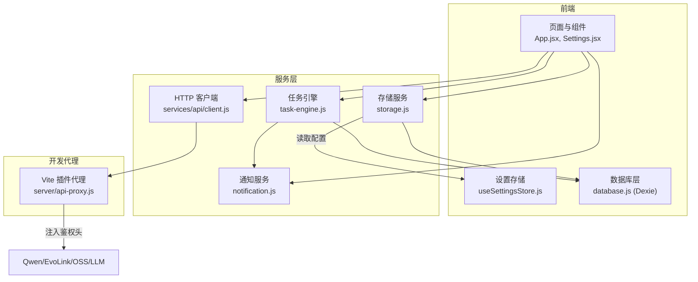
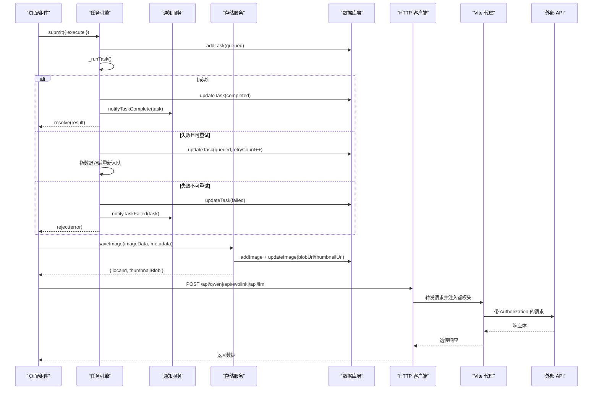
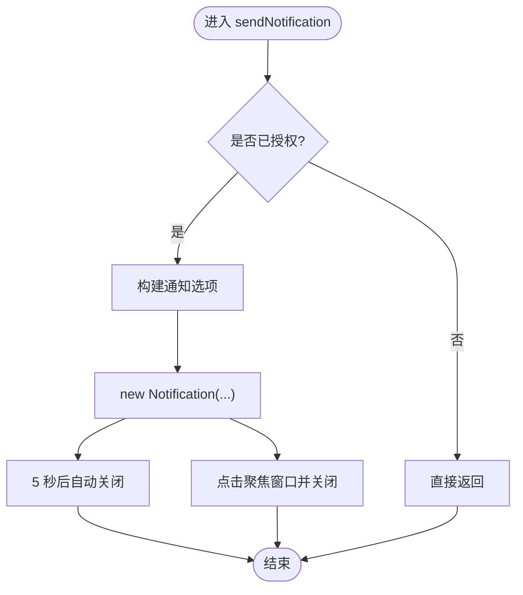
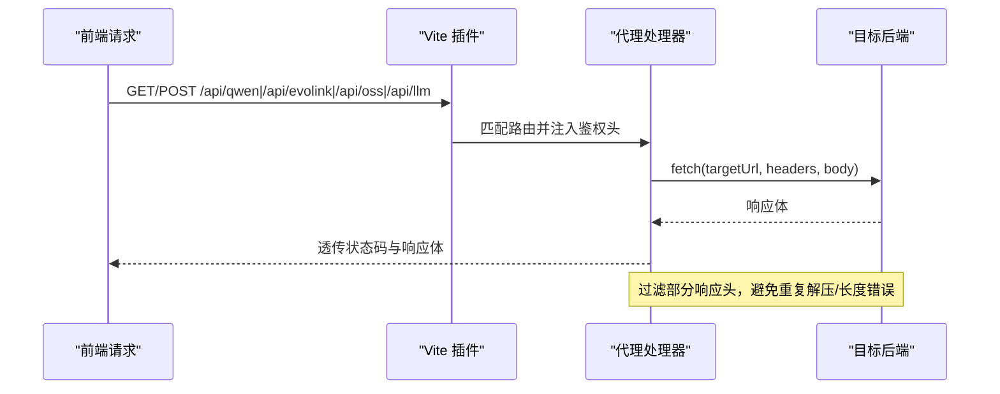
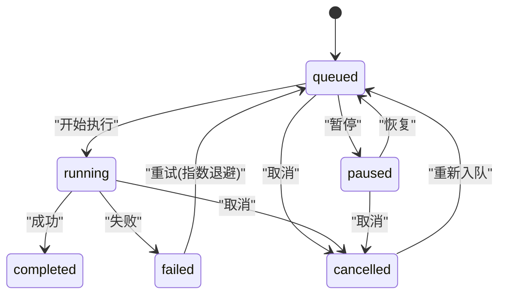
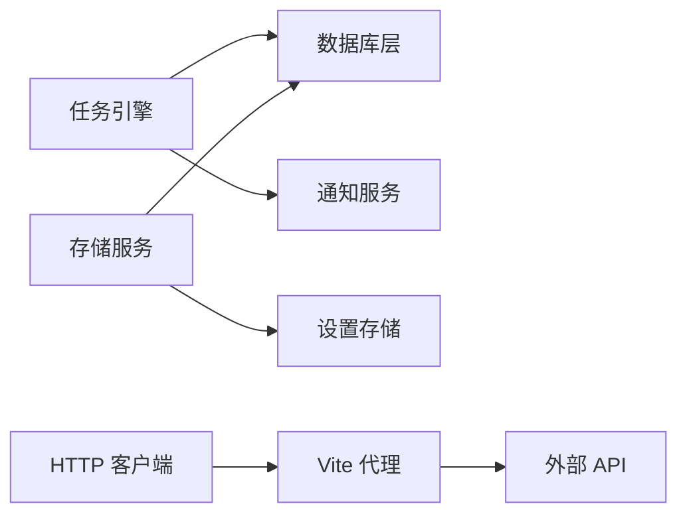

# 服务层

<cite>
**本文引用的文件**   
- [app/src/services/notification.js](file://app/src/services/notification.js)
- [app/src/services/storage.js](file://app/src/services/storage.js)
- [app/src/server/api-proxy.js](file://app/src/server/api-proxy.js)
- [app/src/services/task-engine.js](file://app/src/services/task-engine.js)
- [app/src/db/database.js](file://app/src/db/database.js)
- [app/src/stores/useSettingsStore.js](file://app/src/stores/useSettingsStore.js)
- [app/vite.config.js](file://app/vite.config.js)
- [app/package.json](file://app/package.json)
- [app/src/App.jsx](file://app/src/App.jsx)
- [app/src/pages/Settings.jsx](file://app/src/pages/Settings.jsx)
- [app/src/services/api/client.js](file://app/src/services/api/client.js)
</cite>

## 目录
1. [简介](#简介)
2. [项目结构](#项目结构)
3. [核心组件](#核心组件)
4. [架构总览](#架构总览)
5. [详细组件分析](#详细组件分析)
6. [依赖关系分析](#依赖关系分析)
7. [性能考虑](#性能考虑)
8. [故障排查指南](#故障排查指南)
9. [结论](#结论)
10. [附录：扩展与集成示例](#附录扩展与集成示例)

## 简介
本文件面向 AI Image Studio 的服务层，聚焦以下核心服务的实现与使用：
- 通知服务：封装浏览器原生 Notification API，提供任务完成/失败等场景的系统级通知。
- 存储服务：统一抽象本地热区（IndexedDB）与云端冷区（阿里云 OSS），并提供缩略图生成、冷热迁移、容量检查与统计。
- 服务端代理：基于 Vite 插件的中间件，将 /api/* 请求转发到 Qwen、EvoLink、OSS、LLM 等后端，注入鉴权头并屏蔽敏感配置泄露。
- 任务引擎：后台任务调度器，支持并发控制、FIFO 队列、指数退避重试、状态机、进度上报与持久化。

文档同时覆盖初始化配置、错误处理策略、性能优化技巧，以及扩展开发指南与集成示例。

## 项目结构
服务层位于 app/src/services 与 app/src/server 下，配合数据库层与设置存储共同构成应用运行时能力。



图表来源
- [app/src/App.jsx:1-200](file://app/src/App.jsx#L1-L200)
- [app/src/pages/Settings.jsx:1-200](file://app/src/pages/Settings.jsx#L1-L200)
- [app/src/services/notification.js:1-113](file://app/src/services/notification.js#L1-L113)
- [app/src/services/storage.js:1-393](file://app/src/services/storage.js#L1-L393)
- [app/src/services/task-engine.js:1-319](file://app/src/services/task-engine.js#L1-L319)
- [app/src/services/api/client.js:1-146](file://app/src/services/api/client.js#L1-L146)
- [app/src/server/api-proxy.js:1-190](file://app/src/server/api-proxy.js#L1-L190)
- [app/src/db/database.js:1-339](file://app/src/db/database.js#L1-L339)
- [app/src/stores/useSettingsStore.js:1-162](file://app/src/stores/useSettingsStore.js#L1-L162)

章节来源
- [app/src/App.jsx:1-200](file://app/src/App.jsx#L1-L200)
- [app/src/pages/Settings.jsx:1-200](file://app/src/pages/Settings.jsx#L1-L200)
- [app/vite.config.js:1-13](file://app/vite.config.js#L1-L13)
- [app/package.json:1-30](file://app/package.json#L1-L30)

## 核心组件
本节概述各服务的职责与对外接口要点，便于快速上手与定位问题。

- 通知服务
  - 功能：申请权限、发送系统通知、任务完成/失败通知、通用信息通知。
  - 关键点：权限缓存、自动关闭、点击聚焦窗口、错误静默降级。
  - 典型用法：在应用启动时请求权限；任务完成后调用完成/失败通知。

- 存储服务
  - 功能：图片保存到 IndexedDB（热区）、缩略图生成、从 OSS 上传/下载、冷热迁移、容量检查与自动迁移、存储统计。
  - 关键点：懒加载 OSS 配置、Blob URL 生命周期管理、Canvas 缩略图、按创建时间顺序迁移最旧数据。
  - 典型用法：保存图像后返回本地 ID 与缩略图 Blob；需要长期保留时移动到冷区。

- 服务端代理
  - 功能：Vite 开发服务器中间件，将 /api/qwen、/api/evolink、/api/oss、/api/llm 路由转发至对应后端，注入鉴权头。
  - 关键点：从环境变量读取密钥、统一 body 读取、响应头过滤与体流回写、异常转 502 JSON。
  - 典型用法：前端通过 /api/* 发起请求，避免跨域与密钥泄露。

- 任务引擎
  - 功能：任务提交、取消、重试、暂停/恢复、事件监听、进度上报、持久化、指数退避重试。
  - 关键点：最大并发、FIFO 队列、状态机、AbortController 支持、失败可重试判定。
  - 典型用法：submit 提交执行函数，内部更新状态、触发事件、必要时调用通知服务。

章节来源
- [app/src/services/notification.js:1-113](file://app/src/services/notification.js#L1-L113)
- [app/src/services/storage.js:1-393](file://app/src/services/storage.js#L1-L393)
- [app/src/server/api-proxy.js:1-190](file://app/src/server/api-proxy.js#L1-L190)
- [app/src/services/task-engine.js:1-319](file://app/src/services/task-engine.js#L1-L319)

## 架构总览
下图展示服务层与周边模块的交互关系，包括请求链路、数据持久化与配置来源。



图表来源
- [app/src/services/task-engine.js:1-319](file://app/src/services/task-engine.js#L1-L319)
- [app/src/services/notification.js:1-113](file://app/src/services/notification.js#L1-L113)
- [app/src/services/storage.js:1-393](file://app/src/services/storage.js#L1-L393)
- [app/src/services/api/client.js:1-146](file://app/src/services/api/client.js#L1-L146)
- [app/src/server/api-proxy.js:1-190](file://app/src/server/api-proxy.js#L1-L190)
- [app/src/db/database.js:1-339](file://app/src/db/database.js#L1-L339)

## 详细组件分析

### 通知服务（Browser Notification API 封装）
- 设计要点
  - 权限管理：首次请求权限并缓存结果，避免重复弹窗。
  - 通知发送：构造标题、正文、图标、标签、图片等选项，默认 5 秒自动关闭，点击聚焦窗口。
  - 业务通知：任务完成/失败分别格式化提示内容，包含模型名、图片数量或错误摘要。
- 错误处理
  - 不支持 API 时输出警告并返回 false。
  - 已拒绝权限时直接返回 false。
  - 发送异常捕获并记录日志，不阻断主流程。
- 使用建议
  - 在应用启动阶段调用权限请求。
  - 在任务引擎完成/失败回调中调用相应通知方法。



图表来源
- [app/src/services/notification.js:1-113](file://app/src/services/notification.js#L1-L113)

章节来源
- [app/src/services/notification.js:1-113](file://app/src/services/notification.js#L1-L113)
- [app/src/App.jsx:1-200](file://app/src/App.jsx#L1-L200)

### 存储服务（热区 IndexedDB + 冷区 OSS）
- 设计要点
  - 热区：以 Blob URL 形式保存在 IndexedDB，用于快速预览与编辑。
  - 冷区：通过 ali-oss SDK 上传到阿里云 OSS，用于长期归档。
  - 缩略图：使用 Canvas 生成最大 200px 尺寸的缩略图，提升列表渲染性能。
  - 冷热迁移：当热区容量超过阈值时，按创建时间由旧到新迁移到冷区，释放内存与存储空间。
  - 配置来源：OSS 配置从设置存储懒加载，支持运行时覆盖。
- 关键流程
  - 保存图像：解析输入为 Blob → 生成缩略图 → 写入数据库 → 维护 Blob URL。
  - 获取图像/缩略图：根据记录中的 Blob URL 拉取。
  - 上传/下载 OSS：构造客户端并调用 put/get，兼容浏览器环境。
  - 冷热迁移：计算当前热区占用，循环迁移直至低于阈值。
- 错误处理
  - OSS 配置缺失抛出明确错误。
  - 上传/下载失败包装为统一错误消息。
  - 连接测试区分 403/404 等常见错误码并给出友好提示。
- 性能优化
  - 缩略图尺寸限制，减少渲染压力。
  - 删除时及时 revokeObjectURL，防止内存泄漏。
  - 迁移过程逐条进行，失败不影响后续项。

```mermaid
classDiagram
class StorageServiceClass {
+saveImage(imageData, metadata) Promise~{localId, thumbnailBlob}~
+getImage(id) Promise~Blob|null~
+getThumbnail(id) Promise~Blob|null~
+deleteImage(id) Promise~void~
+uploadToOSS(blob, key, overrides) Promise~string~
+downloadFromOSS(key, override) Promise~Blob~
+checkOSSConnection(override) Promise~{ok,msg}~
+moveToColdZone(imageId) Promise~string~
+moveToHotZone(imageId) Promise~void~
+checkAndMigrate(thresholdMB) Promise~number~
+getStorageStats() Promise~object~
-_generateThumbnail(blob) Promise~Blob|null~
-_loadImage(blob) Promise~HTMLImageElement~
-_calculateThumbnailSize(img) ~{width,height}~
}
class DatabaseLayer {
+addImage(...)
+updateImage(...)
+getImage(...)
+deleteImage(...)
+getImages(...)
+getImageStats()
}
class SettingsStore {
+getState() storageConfig
}
StorageServiceClass --> DatabaseLayer : "读写记录"
StorageServiceClass --> SettingsStore : "读取 OSS 配置"
```

图表来源
- [app/src/services/storage.js:1-393](file://app/src/services/storage.js#L1-L393)
- [app/src/db/database.js:1-339](file://app/src/db/database.js#L1-L339)
- [app/src/stores/useSettingsStore.js:1-162](file://app/src/stores/useSettingsStore.js#L1-L162)

章节来源
- [app/src/services/storage.js:1-393](file://app/src/services/storage.js#L1-L393)
- [app/src/db/database.js:1-339](file://app/src/db/database.js#L1-L339)
- [app/src/stores/useSettingsStore.js:1-162](file://app/src/stores/useSettingsStore.js#L1-L162)
- [app/src/pages/Settings.jsx:1-200](file://app/src/pages/Settings.jsx#L1-L200)

### 服务端代理（Vite 插件）
- 设计要点
  - 路由映射：/api/qwen、/api/evolink、/api/oss、/api/llm 四个前缀。
  - 鉴权注入：为 Qwen/EvoLink/LLM 注入 Bearer Token；为 OSS 注入 AccessKey 相关头。
  - Body 处理：兼容 Vite 已解析 req.body 的情况，否则手动拼接 Buffer。
  - 响应透传：过滤 transfer-encoding/connection/CORS/content-encoding/content-length 等头部，避免浏览器二次解压或长度不一致。
  - 错误处理：代理异常返回 502 与 JSON 错误体。
- 配置来源
  - 通过 loadEnv 读取 .env 变量，如 VITE_QWEN_API_KEY、VITE_EVOLINK_API_KEY、VITE_OSS_*、VITE_EXPANSION_LLM_*。
- 集成方式
  - 在 vite.config.js 中注册插件，并在 dev 模式下启用。



图表来源
- [app/src/server/api-proxy.js:1-190](file://app/src/server/api-proxy.js#L1-L190)
- [app/vite.config.js:1-13](file://app/vite.config.js#L1-L13)

章节来源
- [app/src/server/api-proxy.js:1-190](file://app/src/server/api-proxy.js#L1-L190)
- [app/vite.config.js:1-13](file://app/vite.config.js#L1-L13)
- [app/package.json:1-30](file://app/package.json#L1-L30)

### 任务引擎（后台任务调度器）
- 设计要点
  - 并发控制：可配置最大并发数，默认 3。
  - 队列与状态机：FIFO 队列，状态流转受限于预定义转换表。
  - 重试机制：对 5xx 或网络错误进行指数退避重试，最多 3 次。
  - 事件系统：订阅 task:queued/started/progress/completed/retry/failed/cancelled/paused 等事件。
  - 持久化：所有状态变更落库，确保刷新后可恢复。
  - 取消/暂停：通过 AbortController 中断运行中任务，或将队列项标记为 paused。
- 关键流程
  - 提交任务：持久化初始状态 → 入队 → 尝试出队执行。
  - 执行任务：构造上下文（含信号、进度回调、taskId）→ 调用用户提供的 execute → 更新状态与结果。
  - 失败处理：判断是否可重试 → 指数退避 → 重新入队或标记失败。
  - 通知联动：完成/失败时调用通知服务。



图表来源
- [app/src/services/task-engine.js:1-319](file://app/src/services/task-engine.js#L1-L319)

章节来源
- [app/src/services/task-engine.js:1-319](file://app/src/services/task-engine.js#L1-L319)
- [app/src/services/notification.js:1-113](file://app/src/services/notification.js#L1-L113)
- [app/src/db/database.js:1-339](file://app/src/db/database.js#L1-L339)

## 依赖关系分析
- 组件耦合
  - 任务引擎依赖数据库层与通知服务，形成“调度-持久化-通知”闭环。
  - 存储服务依赖数据库层与设置存储，解耦了 OSS 配置来源。
  - HTTP 客户端通过 /api 前缀与 Vite 代理协作，屏蔽跨域与鉴权细节。
- 外部依赖
  - Dexie（IndexedDB 封装）、ali-oss（云存储）、axios（HTTP 客户端）、uuid（任务 ID）。
- 潜在风险
  - 代理层对响应头的过滤需保持与上游一致，避免压缩/编码差异导致前端解析异常。
  - 热区容量阈值过大可能导致 IndexedDB 增长过快，应结合业务定期清理或迁移。



图表来源
- [app/src/services/task-engine.js:1-319](file://app/src/services/task-engine.js#L1-L319)
- [app/src/services/storage.js:1-393](file://app/src/services/storage.js#L1-L393)
- [app/src/services/api/client.js:1-146](file://app/src/services/api/client.js#L1-L146)
- [app/src/server/api-proxy.js:1-190](file://app/src/server/api-proxy.js#L1-L190)

章节来源
- [app/src/services/task-engine.js:1-319](file://app/src/services/task-engine.js#L1-L319)
- [app/src/services/storage.js:1-393](file://app/src/services/storage.js#L1-L393)
- [app/src/services/api/client.js:1-146](file://app/src/services/api/client.js#L1-L146)
- [app/src/server/api-proxy.js:1-190](file://app/src/server/api-proxy.js#L1-L190)

## 性能考虑
- 通知服务
  - 避免频繁弹窗：使用 tag 去重，合并同类通知。
  - 短生命周期：自动关闭，降低 UI 干扰。
- 存储服务
  - 缩略图尺寸上限 200px，显著降低渲染开销。
  - 删除时及时 revokeObjectURL，避免内存泄漏。
  - 冷热迁移按创建时间排序，优先迁移最旧数据，减少热点访问抖动。
- 任务引擎
  - 合理设置最大并发，避免过多并行导致后端限流或前端卡顿。
  - 指数退避重试避免雪崩式重试风暴。
- HTTP 客户端
  - 长耗时同步生成接口使用独立实例与更长超时，避免误判超时。
  - 全局拦截器统一重试与错误归一化，减少重复逻辑。

[本节为通用指导，无需特定文件引用]

## 故障排查指南
- 通知未显示
  - 检查是否已调用权限请求，且权限未被拒绝。
  - 确认浏览器是否支持 Notification API。
- OSS 上传/下载失败
  - 验证 Bucket/Region/AccessKey 是否正确。
  - 使用 checkOSSConnection 进行连通性测试，关注 403/404 等错误码。
- 代理 502 错误
  - 检查环境变量是否加载正确，确认目标后端可达。
  - 查看代理日志中的请求体大小与响应状态。
- 任务反复失败
  - 观察错误类型是否为可重试（5xx/网络错误）。
  - 调整最大并发与重试次数，避免资源争用。

章节来源
- [app/src/services/notification.js:1-113](file://app/src/services/notification.js#L1-L113)
- [app/src/services/storage.js:1-393](file://app/src/services/storage.js#L1-L393)
- [app/src/server/api-proxy.js:1-190](file://app/src/server/api-proxy.js#L1-L190)
- [app/src/services/task-engine.js:1-319](file://app/src/services/task-engine.js#L1-L319)

## 结论
AI Image Studio 的服务层围绕“通知、存储、代理、任务”四大能力构建，采用清晰的职责划分与良好的错误处理策略。通过 IndexedDB 与 OSS 的双层存储、Vite 代理的统一鉴权注入、以及具备重试与事件的任务引擎，整体具备良好的可扩展性与稳定性。建议在上线前完善容量阈值策略与监控告警，并结合业务需求持续优化并发与重试参数。

[本节为总结性内容，无需特定文件引用]

## 附录：扩展与集成示例

### 初始化配置
- 应用启动
  - 打开数据库、加载设置、请求通知权限。
  - 参考路径：
    - [数据库初始化:327-336](file://app/src/db/database.js#L327-L336)
    - [设置加载:109-135](file://app/src/stores/useSettingsStore.js#L109-L135)
    - [通知权限请求入口:1-200](file://app/src/App.jsx#L1-L200)
- 代理插件注册
  - 在 vite.config.js 中引入并注册 apiProxyPlugin。
  - 参考路径：
    - [Vite 配置:1-13](file://app/vite.config.js#L1-L13)

### 错误处理策略
- 通知服务：权限与发送异常均被捕获并降级，不阻塞主流程。
- 存储服务：OSS 配置校验、上传/下载异常包装为统一错误；连接测试区分常见错误码。
- 代理层：统一返回 502 与 JSON 错误体，便于前端识别。
- 任务引擎：可重试错误分类、指数退避、最终失败通知。

章节来源
- [app/src/services/notification.js:1-113](file://app/src/services/notification.js#L1-L113)
- [app/src/services/storage.js:1-393](file://app/src/services/storage.js#L1-L393)
- [app/src/server/api-proxy.js:1-190](file://app/src/server/api-proxy.js#L1-L190)
- [app/src/services/task-engine.js:1-319](file://app/src/services/task-engine.js#L1-L319)

### 性能优化技巧
- 缩略图尺寸限制与按需生成。
- 热区容量阈值与自动迁移。
- 任务并发与重试退避参数调优。
- 长耗时接口使用专用 axios 实例与更长时间超时。

章节来源
- [app/src/services/storage.js:1-393](file://app/src/services/storage.js#L1-L393)
- [app/src/services/task-engine.js:1-319](file://app/src/services/task-engine.js#L1-L319)
- [app/src/services/api/client.js:1-146](file://app/src/services/api/client.js#L1-L146)

### 服务扩展开发指南
- 新增模型适配器
  - 在 services/api/index.js 中导出新适配器，并在 getModelAdapter 中增加分支。
  - 参考路径：
    - [适配器工厂:1-39](file://app/src/services/api/index.js#L1-L39)
- 新增代理路由
  - 在 server/api-proxy.js 中添加新的 server.middlewares.use 路由，注入必要鉴权头。
  - 参考路径：
    - [代理中间件:121-189](file://app/src/server/api-proxy.js#L121-L189)
- 新增存储后端
  - 在存储服务中新增 upload/download 方法，复用 getOSSClient 模式，适配新 SDK。
  - 参考路径：
    - [OSS 客户端构建:20-42](file://app/src/services/storage.js#L20-L42)
- 任务扩展
  - 在任务引擎中扩展状态机与事件，确保持久化与通知联动。
  - 参考路径：
    - [状态机与事件:18-31](file://app/src/services/task-engine.js#L18-L31)
    - [事件发射:189-211](file://app/src/services/task-engine.js#L189-L211)

### 集成示例（步骤说明）
- 在页面中集成通知
  - 启动时调用权限请求；任务完成后调用完成/失败通知。
  - 参考路径：
    - [通知权限入口:1-200](file://app/src/App.jsx#L1-L200)
    - [通知服务:1-113](file://app/src/services/notification.js#L1-113)
- 在页面中集成存储
  - 保存图像后获得本地 ID 与缩略图；需要归档时移动到冷区。
  - 参考路径：
    - [存储服务:44-128](file://app/src/services/storage.js#L44-L128)
- 在页面中集成任务
  - 提交任务并监听事件，更新 UI 进度与状态。
  - 参考路径：
    - [任务引擎:57-92](file://app/src/services/task-engine.js#L57-L92)
- 在页面中测试连接
  - 使用 Settings 页面对 Qwen/EvoLink/OSS/LLM 进行连通性测试。
  - 参考路径：
    - [设置页测试逻辑:88-200](file://app/src/pages/Settings.jsx#L88-L200)