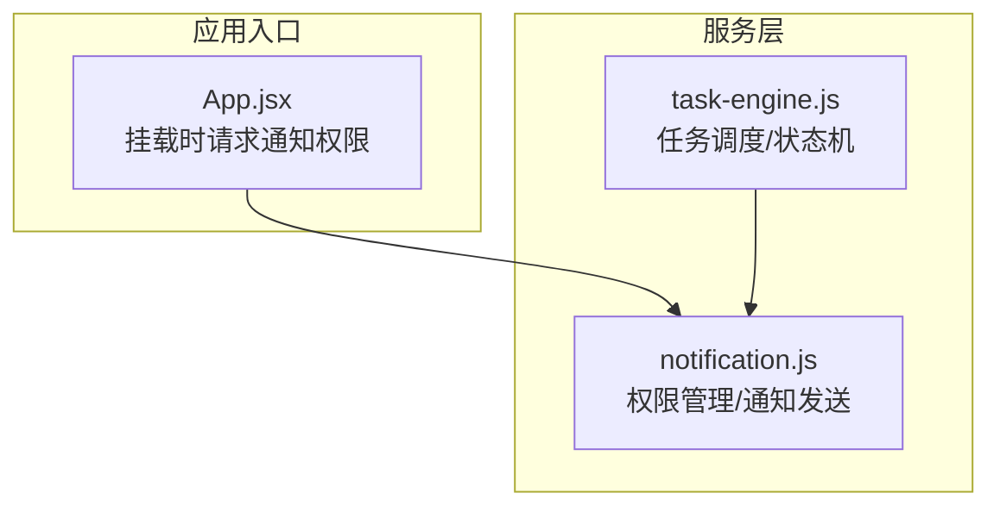
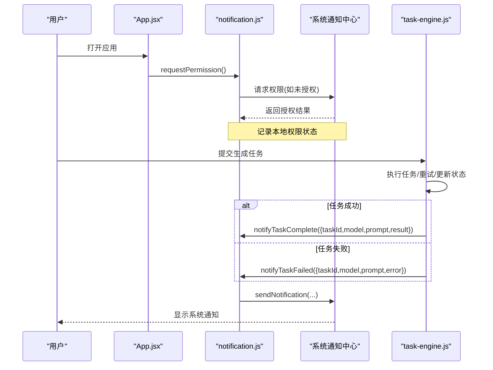
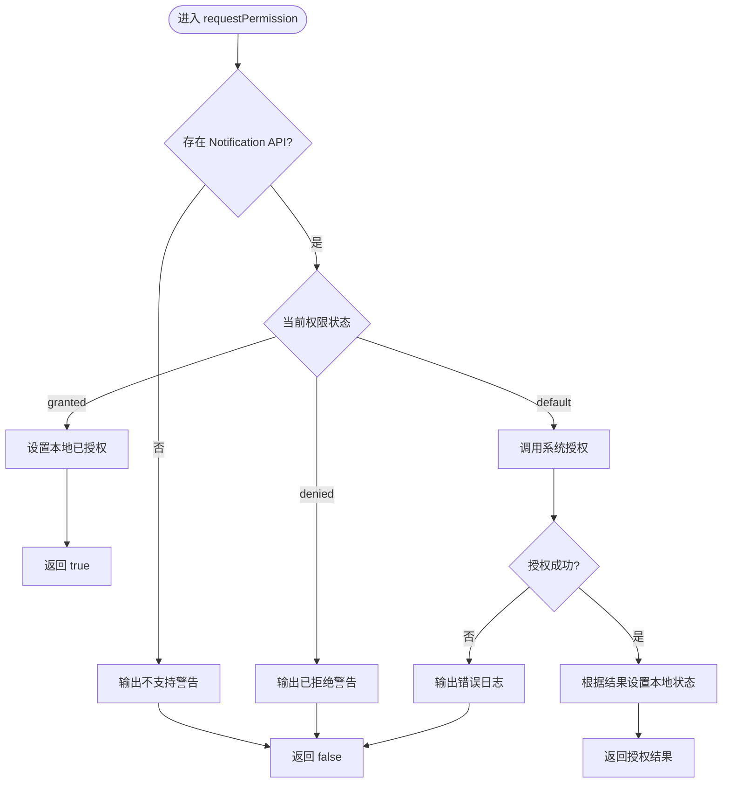
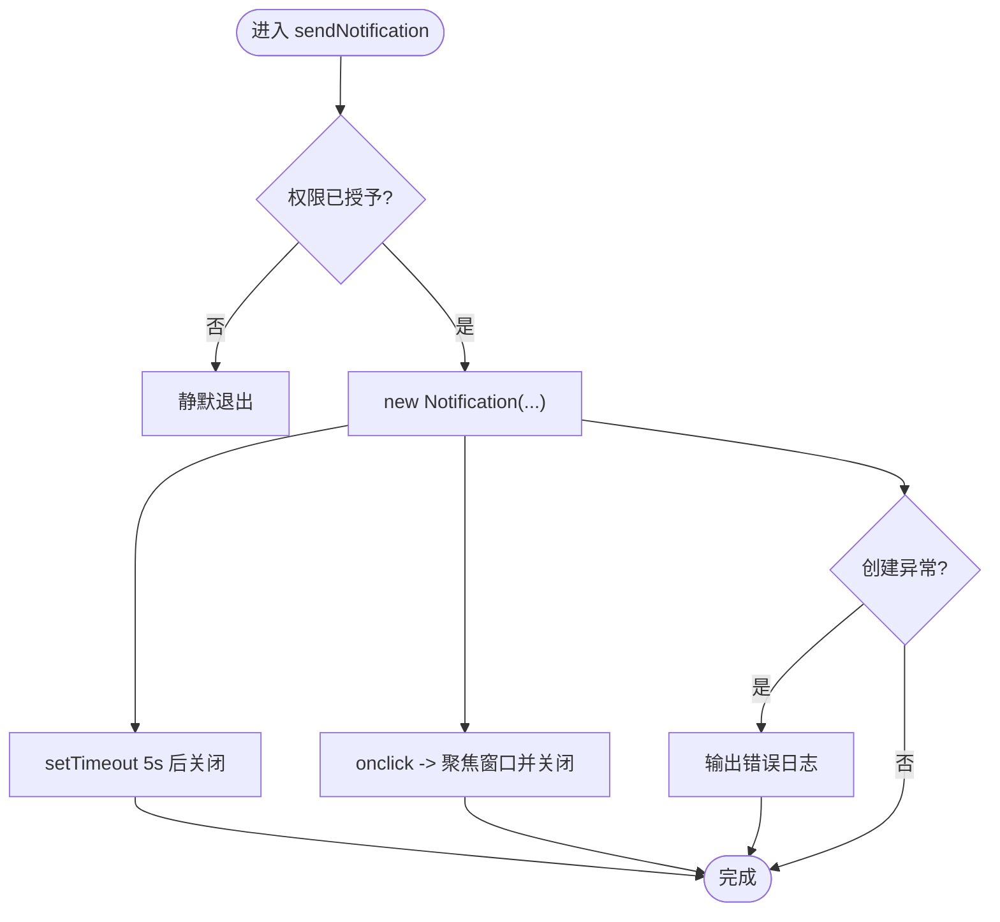
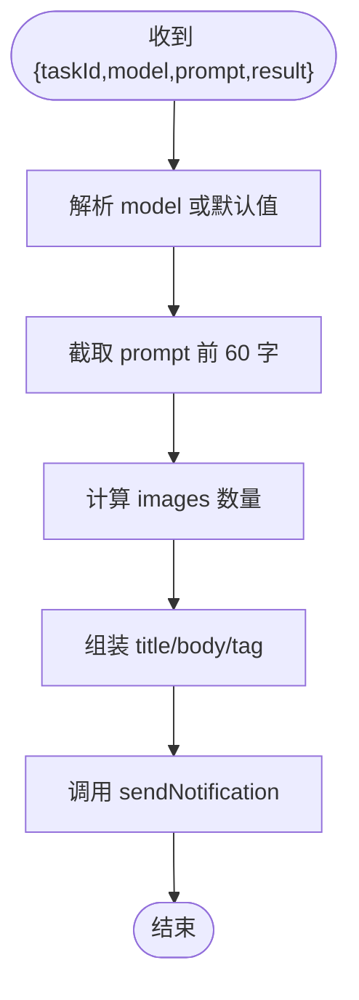
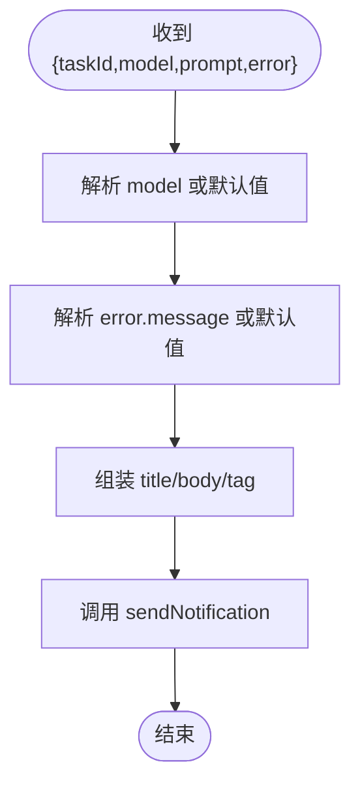
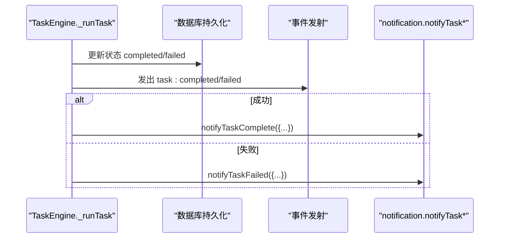
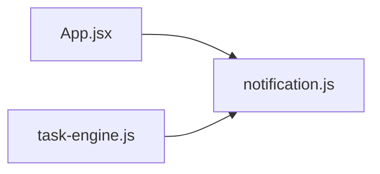

# 通知服务

<cite>
**本文引用的文件**
- [app/src/services/notification.js](file://app/src/services/notification.js)
- [app/src/services/task-engine.js](file://app/src/services/task-engine.js)
- [app/src/App.jsx](file://app/src/App.jsx)
</cite>

## 目录
1. [简介](#简介)
2. [项目结构](#项目结构)
3. [核心组件](#核心组件)
4. [架构总览](#架构总览)
5. [详细组件分析](#详细组件分析)
6. [依赖关系分析](#依赖关系分析)
7. [性能与体验考量](#性能与体验考量)
8. [故障排查指南](#故障排查指南)
9. [结论](#结论)
10. [附录：最佳实践与集成示例](#附录最佳实践与集成示例)

## 简介
本文件为 AI Image Studio 的通知服务提供系统化文档，聚焦浏览器原生 Notification API 的封装实现。内容涵盖权限请求机制、通知发送逻辑、错误处理策略，以及 notifyTaskComplete、notifyTaskFailed、notifyInfo 等核心方法的使用方式与数据格式设计。同时给出跨浏览器兼容性建议、用户授权流程、应用启动时初始化权限的方法，以及在任务执行过程中集成通知的具体示例路径。

## 项目结构
通知服务位于 services 层，被任务引擎在任务完成/失败时调用；应用入口在 App 组件中于挂载时发起权限请求。

图表来源
- [app/src/App.jsx:281-284](file://app/src/App.jsx#L281-L284)
- [app/src/services/notification.js:19-43](file://app/src/services/notification.js#L19-L43)
- [app/src/services/task-engine.js:254-291](file://app/src/services/task-engine.js#L254-L291)

章节来源
- [app/src/services/notification.js:1-113](file://app/src/services/notification.js#L1-L113)
- [app/src/services/task-engine.js:1-319](file://app/src/services/task-engine.js#L1-L319)
- [app/src/App.jsx:1-364](file://app/src/App.jsx#L1-L364)

## 核心组件
- 权限请求：requestPermission
  - 检测浏览器是否支持 Notification API
  - 若已授予或拒绝则直接返回结果
  - 否则调用系统授权弹窗并缓存结果
- 通知发送：sendNotification（内部）
  - 二次校验权限后创建系统通知
  - 设置默认图标、标签、自动关闭与点击行为
- 业务通知方法：
  - notifyTaskComplete：任务成功完成
  - notifyTaskFailed：任务失败
  - notifyInfo：通用信息通知

章节来源
- [app/src/services/notification.js:19-43](file://app/src/services/notification.js#L19-L43)
- [app/src/services/notification.js:49-72](file://app/src/services/notification.js#L49-L72)
- [app/src/services/notification.js:78-112](file://app/src/services/notification.js#L78-L112)

## 架构总览
通知服务作为独立模块，向上暴露统一接口；任务引擎在关键生命周期节点触发通知；应用入口负责首次权限申请。

图表来源
- [app/src/App.jsx:281-284](file://app/src/App.jsx#L281-L284)
- [app/src/services/notification.js:19-43](file://app/src/services/notification.js#L19-L43)
- [app/src/services/notification.js:49-72](file://app/src/services/notification.js#L49-L72)
- [app/src/services/task-engine.js:254-291](file://app/src/services/task-engine.js#L254-L291)

## 详细组件分析

### 权限管理：requestPermission
- 能力检测：若 window 不存在 Notification，直接返回 false 并输出警告日志
- 快速路径：
  - 已 granted：标记本地已授权并返回 true
  - 已 denied：输出警告并返回 false
- 异步授权：调用系统授权 API，捕获异常并返回 false
- 状态缓存：维护 _permissionGranted 避免重复请求

图表来源
- [app/src/services/notification.js:19-43](file://app/src/services/notification.js#L19-L43)

章节来源
- [app/src/services/notification.js:19-43](file://app/src/services/notification.js#L19-L43)

### 通知发送：sendNotification（内部）
- 双重校验：本地缓存 + 运行时权限检查
- 构造参数：标题、正文、图标、标签、图片、静音开关
- 交互增强：
  - 5 秒自动关闭
  - 点击通知聚焦窗口并关闭
- 异常保护：try/catch 捕获创建失败的异常并记录日志

图表来源
- [app/src/services/notification.js:49-72](file://app/src/services/notification.js#L49-L72)

章节来源
- [app/src/services/notification.js:49-72](file://app/src/services/notification.js#L49-L72)

### 任务完成通知：notifyTaskComplete
- 输入对象字段：
  - taskId：可选，用于唯一标识
  - model：模型名称，缺省使用“未知模型”
  - prompt：提示词，截取前 60 字符预览
  - result.images：数组长度用于统计生成图片数量
- 输出通知：
  - 标题固定为“✓ 生成完成”
  - 正文包含模型名、图片数量与提示词预览
  - tag 以 task-complete- 前缀拼接 taskId 或时间戳

图表来源
- [app/src/services/notification.js:78-88](file://app/src/services/notification.js#L78-L88)

章节来源
- [app/src/services/notification.js:78-88](file://app/src/services/notification.js#L78-L88)

### 任务失败通知：notifyTaskFailed
- 输入对象字段：
  - taskId：可选
  - model：模型名称，缺省使用“未知模型”
  - prompt：提示词（保留以便后续扩展）
  - error.message：错误消息，缺省使用“未知错误”
- 输出通知：
  - 标题固定为“✗ 生成失败”
  - 正文包含模型名与错误消息
  - tag 以 task-failed- 前缀拼接 taskId 或时间戳

图表来源
- [app/src/services/notification.js:94-103](file://app/src/services/notification.js#L94-L103)

章节来源
- [app/src/services/notification.js:94-103](file://app/src/services/notification.js#L94-L103)

### 通用信息通知：notifyInfo
- 入参：title、body
- 输出：带 info- 前缀的唯一 tag，便于去重或定位

章节来源
- [app/src/services/notification.js:110-112](file://app/src/services/notification.js#L110-L112)

### 任务引擎中的通知集成
- 成功路径：任务完成后调用 notifyTaskComplete，传入 taskId、model、prompt、result
- 失败路径：任务最终失败时调用 notifyTaskFailed，传入 taskId、model、prompt、error

图表来源
- [app/src/services/task-engine.js:254-291](file://app/src/services/task-engine.js#L254-L291)

章节来源
- [app/src/services/task-engine.js:254-291](file://app/src/services/task-engine.js#L254-L291)

## 依赖关系分析
- App.jsx 在挂载时调用 requestPermission，确保尽早获取用户授权
- task-engine.js 在任务生命周期结束时调用通知方法
- notification.js 仅依赖浏览器原生 Notification API，无其他外部库耦合

图表来源
- [app/src/App.jsx:281-284](file://app/src/App.jsx#L281-L284)
- [app/src/services/task-engine.js:15-16](file://app/src/services/task-engine.js#L15-L16)
- [app/src/services/notification.js:1-113](file://app/src/services/notification.js#L1-L113)

章节来源
- [app/src/App.jsx:281-284](file://app/src/App.jsx#L281-L284)
- [app/src/services/task-engine.js:15-16](file://app/src/services/task-engine.js#L15-L16)
- [app/src/services/notification.js:1-113](file://app/src/services/notification.js#L1-L113)

## 性能与体验考量
- 权限判断短路：已在内存中缓存授权状态，避免重复系统弹窗
- 通知轻量：仅传递必要字段，避免大对象序列化开销
- 自动关闭：5 秒自动关闭减少桌面通知堆积
- 点击聚焦：提升用户从通知回到应用的效率
- 标签去重：通过 tag 区分不同场景，便于系统级合并或替换

[本节为通用指导，不直接分析具体文件]

## 故障排查指南
- 浏览器不支持
  - 现象：控制台输出“不支持 Notification API”
  - 原因：旧版或特殊环境未实现该 API
  - 处理：降级为应用内 Toast 或站内信
- 权限被拒绝
  - 现象：控制台输出“权限已被拒绝”，且不会弹出系统通知
  - 处理：引导用户在浏览器设置中开启通知权限
- 权限请求异常
  - 现象：控制台输出“权限请求失败”
  - 处理：检查页面上下文（例如是否在 iframe 中）、HTTPS 要求、用户手势限制
- 发送失败
  - 现象：控制台输出“发送失败”
  - 处理：检查 icon/image 资源路径、标签冲突、系统通知配额限制

章节来源
- [app/src/services/notification.js:20-42](file://app/src/services/notification.js#L20-L42)
- [app/src/services/notification.js:69-71](file://app/src/services/notification.js#L69-L71)

## 结论
通知服务以最小依赖封装了浏览器原生 Notification API，提供了清晰的权限管理与三类通知方法。通过与任务引擎的集成，实现了任务完成/失败时的即时反馈。整体实现简洁健壮，具备较好的可维护性与可扩展性。

[本节为总结性内容，不直接分析具体文件]

## 附录：最佳实践与集成示例

### 权限管理最佳实践
- 应用启动即请求：在应用根组件挂载时调用 requestPermission，避免延迟导致错过用户交互时机
- 尊重用户选择：若已拒绝，不要反复弹窗，可在设置页提供指引
- 兼容降级：在不支持的浏览器中回退到应用内提示

章节来源
- [app/src/App.jsx:281-284](file://app/src/App.jsx#L281-L284)
- [app/src/services/notification.js:19-43](file://app/src/services/notification.js#L19-L43)

### 任务完成通知格式设计
- 必需字段：model、prompt、result.images
- 可选字段：taskId（用于唯一标识）
- 展示要点：模型名、图片数量、提示词预览（截断）

章节来源
- [app/src/services/notification.js:78-88](file://app/src/services/notification.js#L78-L88)

### 任务失败通知格式设计
- 必需字段：model、error.message
- 可选字段：taskId、prompt（便于后续扩展）
- 展示要点：模型名、错误消息

章节来源
- [app/src/services/notification.js:94-103](file://app/src/services/notification.js#L94-L103)

### 在任务执行过程中集成通知
- 成功回调：在任务状态更新为 completed 后调用 notifyTaskComplete
- 失败回调：在任务状态更新为 failed 后调用 notifyTaskFailed
- 参考路径：
  - 成功调用位置：[app/src/services/task-engine.js:254-257](file://app/src/services/task-engine.js#L254-L257)
  - 失败调用位置：[app/src/services/task-engine.js:289-291](file://app/src/services/task-engine.js#L289-L291)

章节来源
- [app/src/services/task-engine.js:254-291](file://app/src/services/task-engine.js#L254-L291)

### 通用信息通知示例
- 适用场景：配置变更、版本提示、操作确认等
- 调用方式：notifyInfo(title, body)
- 参考路径：[app/src/services/notification.js:110-112](file://app/src/services/notification.js#L110-L112)

章节来源
- [app/src/services/notification.js:110-112](file://app/src/services/notification.js#L110-L112)