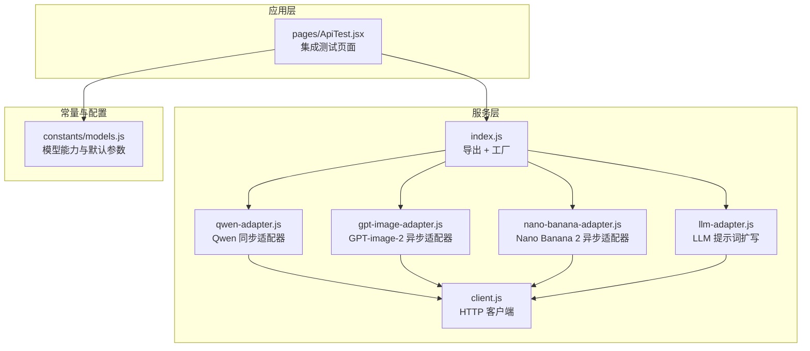
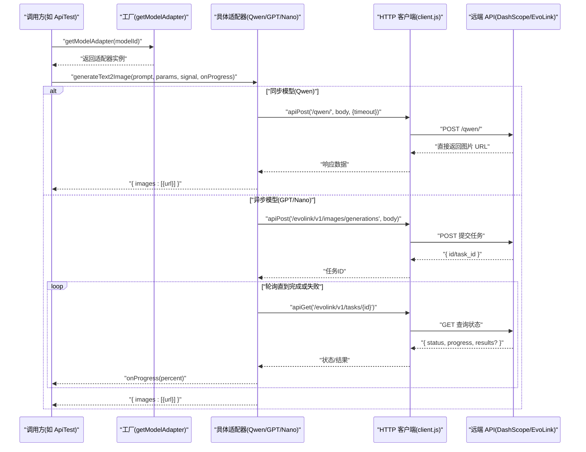
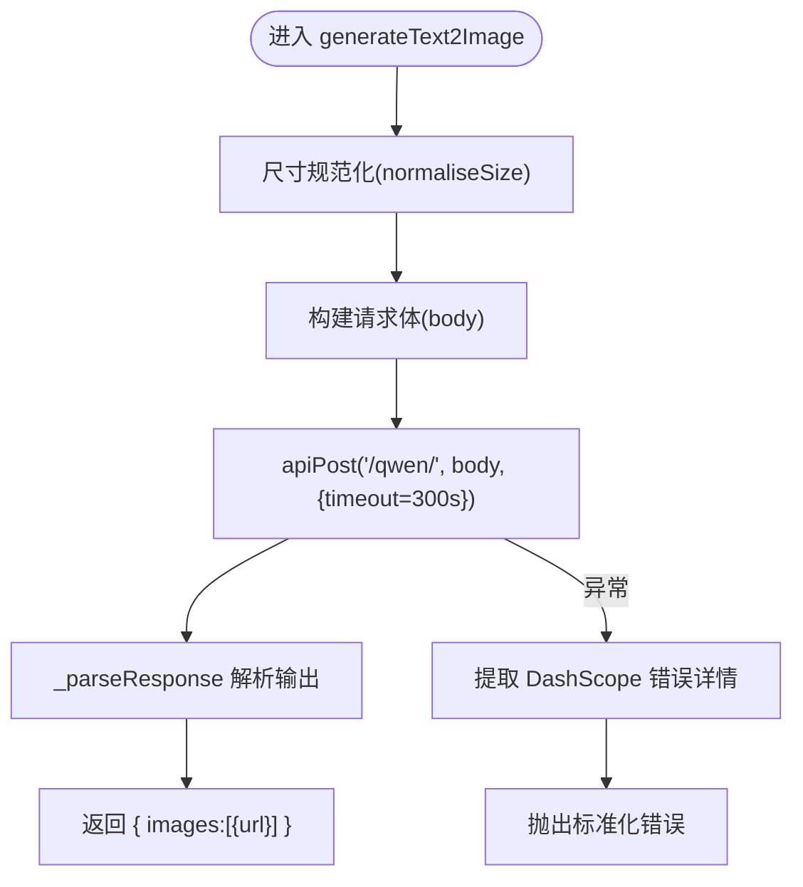
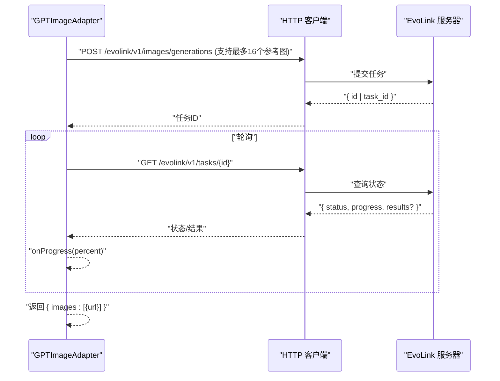
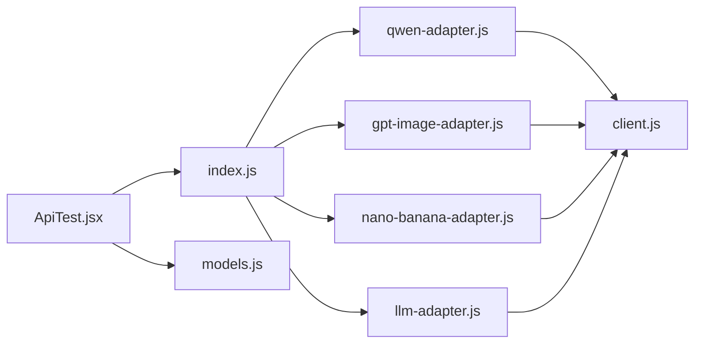

# API 适配器模式

<cite>
**本文引用的文件**
- [app/src/services/api/index.js](file://app/src/services/api/index.js)
- [app/src/services/api/client.js](file://app/src/services/api/client.js)
- [app/src/services/api/qwen-adapter.js](file://app/src/services/api/qwen-adapter.js)
- [app/src/services/api/gpt-image-adapter.js](file://app/src/services/api/gpt-image-adapter.js)
- [app/src/services/api/nano-banana-adapter.js](file://app/src/services/api/nano-banana-adapter.js)
- [app/src/services/api/llm-adapter.js](file://app/src/services/api/llm-adapter.js)
- [app/src/constants/models.js](file://app/src/constants/models.js)
- [app/src/pages/ApiTest.jsx](file://app/src/pages/ApiTest.jsx)
</cite>

## 更新摘要
**所做更改**
- 更新了 GPT-image-2 适配器的多参考图像支持和分辨率选项功能
- 修正了 Nano Banana 2 的质量映射逻辑
- 增强了 Qwen Image 3 的提示词扩展模式支持
- 更新了模型能力配置和参数映射规则

## 目录
1. [简介](#简介)
2. [项目结构](#项目结构)
3. [核心组件](#核心组件)
4. [架构总览](#架构总览)
5. [详细组件分析](#详细组件分析)
6. [依赖关系分析](#依赖关系分析)
7. [性能考虑](#性能考虑)
8. [故障排查指南](#故障排查指南)
9. [结论](#结论)
10. [附录：扩展新模型适配器的步骤](#附录扩展新模型适配器的步骤)

## 简介
本文件面向 AI Image Studio 的"API 适配器模式"实现，系统性阐述统一接口设计、多模型支持机制、工厂与动态创建、参数映射规则、响应标准化、错误处理策略，以及测试与扩展方法。通过适配器模式，系统屏蔽不同 AI 提供商（如 DashScope、EvoLink）在协议、超时、轮询、结果格式等方面的差异，向上层提供一致的任务提交、进度回调与结果返回能力。

## 项目结构
- 适配器位于 services/api 目录，按模型拆分独立适配器类，并通过 index.js 暴露统一入口与工厂函数。
- HTTP 客户端封装于 client.js，提供重试、取消、拦截器与便捷方法。
- 模型元数据与能力定义集中于 constants/models.js，用于 UI 展示与参数校验。
- ApiTest.jsx 作为集成测试页面，演示如何调用工厂获取适配器并执行任务。

图表来源
- [app/src/services/api/index.js:1-39](file://app/src/services/api/index.js#L1-L39)
- [app/src/services/api/client.js:1-146](file://app/src/services/api/client.js#L1-L146)
- [app/src/services/api/qwen-adapter.js:1-209](file://app/src/services/api/qwen-adapter.js#L1-L209)
- [app/src/services/api/gpt-image-adapter.js:1-431](file://app/src/services/api/gpt-image-adapter.js#L1-L431)
- [app/src/services/api/nano-banana-adapter.js:1-281](file://app/src/services/api/nano-banana-adapter.js#L1-L281)
- [app/src/services/api/llm-adapter.js:1-150](file://app/src/services/api/llm-adapter.js#L1-L150)
- [app/src/constants/models.js:1-110](file://app/src/constants/models.js#L1-L110)
- [app/src/pages/ApiTest.jsx:1-391](file://app/src/pages/ApiTest.jsx#L1-L391)

章节来源
- [app/src/services/api/index.js:1-39](file://app/src/services/api/index.js#L1-L39)
- [app/src/services/api/client.js:1-146](file://app/src/services/api/client.js#L1-L146)
- [app/src/constants/models.js:1-110](file://app/src/constants/models.js#L1-L110)
- [app/src/pages/ApiTest.jsx:1-391](file://app/src/pages/ApiTest.jsx#L1-L391)

## 核心组件
- 统一 HTTP 客户端（client.js）
  - 提供 apiGet/apiPost/apiPut/apiDelete 等便捷方法。
  - 内置请求/响应拦截器：统一错误归一化、指数退避重试、AbortController 取消支持。
  - 针对长耗时同步生成（如 Qwen）提供 longRunningClient，默认 5 分钟超时。
- 适配器工厂（index.js）
  - getModelAdapter(modelId) 根据模型 ID 动态返回对应适配器实例。
  - getLLMAdapter() 单例返回 LLM 适配器，用于提示词扩写。
- 模型适配器
  - QwenAdapter：同步调用 DashScope，内部做尺寸规范化与响应解析。
  - GPTImageAdapter：基于 EvoLink 异步任务，提交后轮询直至完成。
  - NanoBananaAdapter：基于 EvoLink 异步任务，支持文本到图像与图像到图像。
  - LLMAdapter：DashScope OpenAI 风格 chat/completions，将简短描述扩写为多个高质量提示词。
- 模型元数据（models.js）
  - 定义各模型的能力、支持尺寸、质量档位、默认参数等，供 UI 与业务逻辑使用。

章节来源
- [app/src/services/api/client.js:1-146](file://app/src/services/api/client.js#L1-L146)
- [app/src/services/api/index.js:1-39](file://app/src/services/api/index.js#L1-L39)
- [app/src/services/api/qwen-adapter.js:1-209](file://app/src/services/api/qwen-adapter.js#L1-L209)
- [app/src/services/api/gpt-image-adapter.js:1-431](file://app/src/services/api/gpt-image-adapter.js#L1-L431)
- [app/src/services/api/nano-banana-adapter.js:1-281](file://app/src/services/api/nano-banana-adapter.js#L1-L281)
- [app/src/services/api/llm-adapter.js:1-150](file://app/src/services/api/llm-adapter.js#L1-L150)
- [app/src/constants/models.js:1-110](file://app/src/constants/models.js#L1-L110)

## 架构总览
适配器模式在本系统中的职责边界清晰：
- 上层仅依赖统一的工厂与一致的适配器方法签名（如 generateText2Image）。
- 具体模型差异（同步/异步、轮询策略、参数键名、响应结构）被隔离在各适配器内。
- HTTP 客户端负责网络层面的通用关注点（重试、取消、超时、错误归一化）。

图表来源
- [app/src/services/api/index.js:15-31](file://app/src/services/api/index.js#L15-L31)
- [app/src/services/api/qwen-adapter.js:60-105](file://app/src/services/api/qwen-adapter.js#L60-L105)
- [app/src/services/api/gpt-image-adapter.js:275-295](file://app/src/services/api/gpt-image-adapter.js#L275-L295)
- [app/src/services/api/nano-banana-adapter.js:215-233](file://app/src/services/api/nano-banana-adapter.js#L215-L233)
- [app/src/services/api/client.js:94-146](file://app/src/services/api/client.js#L94-L146)

## 详细组件分析

### 统一 HTTP 客户端（client.js）
- 功能要点
  - 两个 axios 实例：普通与长耗时（longRunningClient），分别设置 60s 与 300s 超时。
  - 请求拦截器：注入 AbortSignal，便于取消。
  - 响应拦截器：统一错误归一化；对可重试错误进行指数退避重试（最多 3 次）；支持 _noRetry 由调用方自行控制重试。
  - 便捷方法：apiGet/apiPost/apiPut/apiDelete，自动选择合适实例与超时。
- 复杂度与性能
  - 重试采用指数退避，避免雪崩；长耗时任务使用专用实例，避免阻塞短请求。
- 错误处理
  - 将后端 data.message 与 HTTP 状态码归一化为标准对象，便于上层统一处理。

章节来源
- [app/src/services/api/client.js:1-146](file://app/src/services/api/client.js#L1-L146)

### 工厂与动态创建（index.js）
- 功能要点
  - getModelAdapter(modelId)：根据字符串 modelId 返回对应适配器实例；未知 ID 抛出错误。
  - getLLMAdapter()：单例返回 LLM 适配器，避免重复创建。
- 扩展性
  - 新增模型只需在 switch 分支中增加映射，即可被上层透明使用。

章节来源
- [app/src/services/api/index.js:1-39](file://app/src/services/api/index.js#L1-L39)

### Qwen 适配器（qwen-adapter.js）
- 行为特征
  - 同步 API：一次 POST 即返回结果，但可能耗时较长，因此使用长超时。
  - 尺寸规范化：T2I 要求尺寸为 16 的倍数，I2I 要求 32 的倍数，内部 normaliseSize 自动对齐。
  - 响应解析：从 output.choices[].message.content 中提取 image URL，统一为 { images:[{url}] }。
- 参数映射
  - 输入参数包含 prompt_extend、prompt_extend_mode、n、size、negative_prompt、watermark、seed 等。
  - **更新**：新增 `prompt_extend_mode` 参数支持，默认为 'direct'，允许更灵活的提示词扩展策略。
  - seed 非负时才传入，否则省略以使用服务端随机。
- 错误处理
  - 提取 DashScope 错误信息（code/message/request_id），包装为标准错误抛出。

图表来源
- [app/src/services/api/qwen-adapter.js:28-35](file://app/src/services/api/qwen-adapter.js#L28-L35)
- [app/src/services/api/qwen-adapter.js:60-105](file://app/src/services/api/qwen-adapter.js#L60-L105)
- [app/src/services/api/qwen-adapter.js:179-207](file://app/src/services/api/qwen-adapter.js#L179-L207)

章节来源
- [app/src/services/api/qwen-adapter.js:1-209](file://app/src/services/api/qwen-adapter.js#L1-L209)

### GPT-image-2 适配器（gpt-image-adapter.js）
- 行为特征
  - 异步任务：先提交任务，再轮询任务状态，直至 completed/succeeded 或失败。
  - 轮询策略：初始间隔 2s，指数增长至最大 10s，最长等待 5 分钟；支持 AbortSignal 取消。
  - 提交重试：postWithRetry 对网络/代理 5xx 错误进行指数退避重试（最多 3 次）。
- 参数映射
  - 支持 size、quality（low/medium/high/auto）、n 等；当 quality 为 auto 时不传入以避免不被识别。
  - **更新**：新增 `resolution` 参数支持，支持 "1K"、"2K"、"4K" 分辨率选项，与 size 比例配合使用。
  - **更新**：最大参考图像数量从 1 提升到 16，支持更丰富的图像到图像生成场景。
- 响应标准化
  - parseSubmitResponse 兼容多种上游返回形状（id/task_id、data/results/output、inline data 数组、error 对象）。
  - pollResult 同样兼容多种结果位置与字段，最终统一为 { images:[{url}] }。

图表来源
- [app/src/services/api/gpt-image-adapter.js:275-295](file://app/src/services/api/gpt-image-adapter.js#L275-L295)
- [app/src/services/api/gpt-image-adapter.js:33-91](file://app/src/services/api/gpt-image-adapter.js#L33-L91)
- [app/src/services/api/gpt-image-adapter.js:115-154](file://app/src/services/api/gpt-image-adapter.js#L115-L154)

章节来源
- [app/src/services/api/gpt-image-adapter.js:1-431](file://app/src/services/api/gpt-image-adapter.js#L1-L431)

### Nano Banana 2 适配器（nano-banana-adapter.js）
- 行为特征
  - 异步任务：与 GPT-image-2 类似，基于 EvoLink 的提交+轮询流程。
  - 支持文本到图像与图像到图像（image_urls）。
- 参数映射
  - 支持 size（auto/比例）、quality（0.5K/1K/2K/4K）、n 等。
  - **更新**：修复了质量映射逻辑，确保 UI 质量级别（low/medium/high）正确映射到 API 质量值（1K/2K/4K）。
- 响应标准化
  - parseSubmitResponse 与 parseResults 统一返回 { images:[{url}] }。

章节来源
- [app/src/services/api/nano-banana-adapter.js:1-281](file://app/src/services/api/nano-banana-adapter.js#L1-L281)

### LLM 适配器（llm-adapter.js）
- 行为特征
  - 使用 DashScope OpenAI 风格 chat/completions 接口，将用户简短描述扩写为多条高质量提示词。
  - 内置 system prompt 指导模型输出 JSON 数组，并具备鲁棒的解析容错（去除 markdown 代码块、正则抽取数组）。
- 参数映射
  - 支持 temperature、max_tokens 等；model 可通过环境变量覆盖。
- 返回值
  - 返回 string[] 形式的提示词变体列表。

章节来源
- [app/src/services/api/llm-adapter.js:1-150](file://app/src/services/api/llm-adapter.js#L1-L150)

### 模型元数据与能力（models.js）
- 内容
  - 定义 qwen-image-3、gpt-image-2、nanobanana-2 的名称、提供者、能力开关、支持尺寸、质量档位、默认参数等。
  - **更新**：GPT-image-2 的 maxRefs 从 1 提升到 16，支持更多参考图像。
  - **更新**：Nano Banana 2 的质量档位配置保持为 ['0.5K', '1K', '2K', '4K']。
- 用途
  - 驱动 UI 渲染（下拉框、按钮启用/禁用）、参数校验与默认值填充。

章节来源
- [app/src/constants/models.js:1-110](file://app/src/constants/models.js#L1-L110)

### 集成测试示例（ApiTest.jsx）
- 用法
  - 通过 getModelAdapter 获取具体适配器，调用 generateText2Image 并传入信号与进度回调。
  - 展示成功/失败日志与结果图片预览。
- 价值
  - 验证端到端流程，包括工厂创建、适配器调用、HTTP 客户端重试与取消、进度上报。

章节来源
- [app/src/pages/ApiTest.jsx:1-391](file://app/src/pages/ApiTest.jsx#L1-L391)

## 依赖关系分析
- 耦合度
  - 适配器仅依赖 HTTP 客户端与自身解析逻辑，彼此解耦。
  - 工厂集中管理实例创建，降低上层耦合。
- 外部依赖
  - axios 作为底层 HTTP 库；DashScope/EvoLink 作为上游服务。
- 潜在循环依赖
  - 当前无循环导入；适配器之间相互独立。

图表来源
- [app/src/services/api/index.js:1-39](file://app/src/services/api/index.js#L1-L39)
- [app/src/services/api/client.js:1-146](file://app/src/services/api/client.js#L1-L146)
- [app/src/pages/ApiTest.jsx:1-391](file://app/src/pages/ApiTest.jsx#L1-L391)
- [app/src/constants/models.js:1-110](file://app/src/constants/models.js#L1-L110)

章节来源
- [app/src/services/api/index.js:1-39](file://app/src/services/api/index.js#L1-L39)
- [app/src/services/api/client.js:1-146](file://app/src/services/api/client.js#L1-L146)
- [app/src/pages/ApiTest.jsx:1-391](file://app/src/pages/ApiTest.jsx#L1-L391)
- [app/src/constants/models.js:1-110](file://app/src/constants/models.js#L1-L110)

## 性能考虑
- 超时与重试
  - 长耗时同步任务使用专用客户端（5 分钟），避免短请求被拖慢。
  - 指数退避重试减少瞬时抖动导致的失败率。
- 轮询优化
  - 渐进式增大轮询间隔，上限封顶，避免频繁请求造成压力。
- 取消与资源释放
  - 通过 AbortSignal 支持中断长时间任务，及时释放资源。
- 结果缓存建议
  - 上游返回的图片 URL 有效期有限（例如 Qwen 24 小时），建议在本地缓存以降低二次加载成本。
- **更新**：GPT-image-2 支持更多参考图像（最多16个），在处理大量图像时需要关注内存使用和传输性能。

[本节为通用性能建议，无需源码引用]

## 故障排查指南
- 常见错误类型
  - 网络/代理错误：客户端会捕获并重试；若仍失败，检查代理配置与网络连通性。
  - 上游业务错误：适配器会将 error.message/code 归一化并抛出，查看控制台日志中的完整响应结构。
  - 轮询超时：异步任务超过最大等待时间会抛错，检查服务端任务状态与进度。
- 定位技巧
  - 查看适配器内部的 console.log 输出，确认请求体与响应结构是否符合预期。
  - 使用 ApiTest 页面逐项验证各模型连接与生成流程。
- 恢复策略
  - 适当提高重试次数或退避间隔；对关键路径开启更详细的日志。
  - 对于同步长耗时任务，确保前端有合理的取消与超时提示。
- **更新**：GPT-image-2 多参考图像场景下，注意检查 image_urls 数组长度是否在 1-16 范围内。

章节来源
- [app/src/services/api/client.js:38-88](file://app/src/services/api/client.js#L38-L88)
- [app/src/services/api/gpt-image-adapter.js:33-91](file://app/src/services/api/gpt-image-adapter.js#L33-L91)
- [app/src/services/api/nano-banana-adapter.js:26-76](file://app/src/services/api/nano-banana-adapter.js#L26-L76)
- [app/src/services/api/qwen-adapter.js:41-49](file://app/src/services/api/qwen-adapter.js#L41-L49)
- [app/src/pages/ApiTest.jsx:1-391](file://app/src/pages/ApiTest.jsx#L1-L391)

## 结论
通过适配器模式，AI Image Studio 实现了多模型接入的统一抽象：上层仅需关心统一方法与参数，而将协议差异、轮询策略、错误归一化等细节下沉到适配器与 HTTP 客户端中。该设计具备良好的可扩展性与可维护性，配合工厂与单例机制，进一步简化了调用方的复杂度。

**更新**：最新的增强包括 GPT-image-2 的多参考图像支持（最多16张）、分辨率选项、Nano Banana 2 的质量映射修复，以及 Qwen Image 3 的提示词扩展模式，进一步提升了系统的灵活性和用户体验。

[本节为总结性内容，无需源码引用]

## 附录：扩展新模型适配器的步骤
- 新建适配器类
  - 在 services/api 下新增 xxx-adapter.js，实现与现有适配器一致的对外方法（如 generateText2Image、generateImage2Image 等）。
  - 遵循统一的参数映射与响应标准化约定：最终返回 { images:[{url}] }。
- 注册到工厂
  - 在 index.js 的 getModelAdapter 中添加新的 modelId 到适配器类的映射。
- 更新模型元数据
  - 在 constants/models.js 中补充新模型的名称、提供者、能力、尺寸、质量档位与默认参数。
  - **注意**：正确设置 maxRefs 限制，参考现有模型的配置方式。
- 集成测试
  - 在 ApiTest.jsx 中为新模型添加测试按钮，验证端到端流程。
- 注意事项
  - 若为异步任务，需实现提交+轮询流程，并支持 AbortSignal 与进度回调。
  - 若为同步长耗时任务，使用 longRunningClient 并合理设置超时。
  - 做好错误归一化与日志记录，便于问题定位。
  - **更新**：参考 GPT-image-2 的最新实现，考虑支持多参考图像和分辨率选项等高级特性。

[本节为概念性指导，无需源码引用]