# Electron 桌面应用架构

<cite>
**本文引用的文件**   
- [main.cjs](file://app/electron/main.cjs)
- [preload.cjs](file://app/electron/preload.cjs)
- [ipc-handlers.cjs](file://app/electron/ipc-handlers.cjs)
- [database/index.cjs](file://app/electron/database/index.cjs)
- [file-manager.cjs](file://app/electron/file-manager.cjs)
- [api-server.cjs](file://app/electron/api-server.cjs)
- [protocol.cjs](file://app/electron/protocol.cjs)
- [App.jsx](file://app/src/App.jsx)
- [main.jsx](file://app/src/main.jsx)
- [database.js](file://app/src/db/database.js)
- [task-engine.js](file://app/src/services/task-engine.js)
- [useTaskStore.js](file://app/src/stores/useTaskStore.js)
- [notification.js](file://app/src/services/notification.js)
- [vite.config.js](file://app/vite.config.js)
- [package.json](file://app/package.json)
</cite>

## 目录
1. [简介](#简介)
2. [项目结构](#项目结构)
3. [核心组件](#核心组件)
4. [架构总览](#架构总览)
5. [详细组件分析](#详细组件分析)
6. [依赖关系分析](#依赖关系分析)
7. [性能考量](#性能考量)
8. [故障排查指南](#故障排查指南)
9. [结论](#结论)
10. [附录](#附录)

## 简介
本项目是一个基于 Electron + React 的 AI 图像生成工作站，提供多模型统一工作流、提示词工程、批量生成、知识库与全量资产管理能力。主进程负责数据库（SQLite via sql.js）、本地文件系统、API 代理、自定义协议与 OSS 同步；渲染进程使用 React + Zustand 管理 UI 状态，并通过 IPC 安全访问主进程能力。

## 项目结构
- 主进程（Electron）
  - 入口与生命周期：[main.cjs](file://app/electron/main.cjs)
  - 预加载脚本与安全桥接：[preload.cjs](file://app/electron/preload.cjs)
  - IPC 路由与数据库查询映射：[ipc-handlers.cjs](file://app/electron/ipc-handlers.cjs)
  - SQLite 初始化与持久化：[database/index.cjs](file://app/electron/database/index.cjs)
  - 本地图片存储层：[file-manager.cjs](file://app/electron/file-manager.cjs)
  - 内嵌 HTTP API 代理服务器：[api-server.cjs](file://app/electron/api-server.cjs)
  - 自定义 app:// 协议处理：[protocol.cjs](file://app/electron/protocol.cjs)
- 渲染进程（React/Vite）
  - 应用壳与路由：[App.jsx](file://app/src/App.jsx)
  - 启动引导与设置加载：[main.jsx](file://app/src/main.jsx)
  - 数据库策略门面（Dexie/Electron 后端选择）：[database.js](file://app/src/db/database.js)
  - 任务引擎与通知：[task-engine.js](file://app/src/services/task-engine.js)、[notification.js](file://app/src/services/notification.js)
  - 任务状态管理（Zustand）：[useTaskStore.js](file://app/src/stores/useTaskStore.js)
- 构建与打包
  - Vite 配置与插件：[vite.config.js](file://app/vite.config.js)
  - 包管理与脚本：[package.json](file://app/package.json)

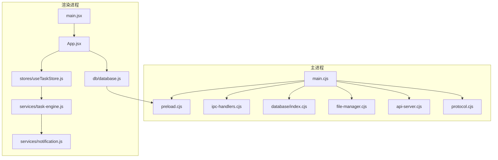

**图表来源** 
- [main.cjs:1-126](file://app/electron/main.cjs#L1-L126)
- [preload.cjs:1-82](file://app/electron/preload.cjs#L1-L82)
- [ipc-handlers.cjs:1-63](file://app/electron/ipc-handlers.cjs#L1-L63)
- [database/index.cjs:1-93](file://app/electron/database/index.cjs#L1-L93)
- [file-manager.cjs:1-196](file://app/electron/file-manager.cjs#L1-L196)
- [api-server.cjs:1-250](file://app/electron/api-server.cjs#L1-L250)
- [protocol.cjs:1-93](file://app/electron/protocol.cjs#L1-L93)
- [main.jsx:1-32](file://app/src/main.jsx#L1-L32)
- [App.jsx:1-364](file://app/src/App.jsx#L1-L364)
- [database.js:1-98](file://app/src/db/database.js#L1-L98)
- [task-engine.js:1-319](file://app/src/services/task-engine.js#L1-L319)
- [useTaskStore.js:1-173](file://app/src/stores/useTaskStore.js#L1-L173)
- [notification.js:1-113](file://app/src/services/notification.js#L1-L113)

**章节来源**
- [main.cjs:1-126](file://app/electron/main.cjs#L1-L126)
- [package.json:1-43](file://app/package.json#L1-L43)

## 核心组件
- 主进程入口与初始化流程
  - 注册特权 scheme、初始化 SQLite、注册 IPC、创建 FileManager、注册 app:// 协议、启动 API 代理、初始化 OSS 同步、创建主窗口并监听页面导航与迁移触发。
- 预加载桥接
  - 通过 contextBridge 暴露 db/fs/oss/app 等安全接口给渲染进程，所有调用均经 ipcRenderer.invoke 转发到主进程。
- 数据库层
  - 主进程侧使用 sql.js 在内存中运行 SQLite，按 300ms 节流写入磁盘；渲染进程通过策略门面自动选择 Dexie（浏览器）或 IPC（Electron）。
- 文件系统层
  - 统一管理 originals/thumbnails/imports 三类图片读写与统计，IPC 暴露保存/读取/删除/统计接口。
- API 代理服务器
  - 内嵌 http 服务，将 /api/qwen、/api/evolink、/api/oss、/api/llm、/api/proxy-image 转发至上游，注入鉴权头并回写响应。
- 自定义协议
  - 注册 app:// 为特权 scheme，将 images/originals 与 thumbnails 路径映射到本地文件，支持 CORS 与 fetch。
- 任务引擎与通知
  - 单例任务调度器，支持并发控制、重试退避、进度上报、事件驱动；完成后触发系统通知。
- 状态管理
  - useTaskStore 订阅 TaskEngine 事件，刷新任务列表并计算活跃任务数，供 UI 展示。

**章节来源**
- [main.cjs:68-126](file://app/electron/main.cjs#L68-L126)
- [preload.cjs:1-82](file://app/electron/preload.cjs#L1-L82)
- [database/index.cjs:1-93](file://app/electron/database/index.cjs#L1-L93)
- [database.js:1-98](file://app/src/db/database.js#L1-L98)
- [file-manager.cjs:1-196](file://app/electron/file-manager.cjs#L1-L196)
- [api-server.cjs:1-250](file://app/electron/api-server.cjs#L1-L250)
- [protocol.cjs:1-93](file://app/electron/protocol.cjs#L1-L93)
- [task-engine.js:1-319](file://app/src/services/task-engine.js#L1-L319)
- [useTaskStore.js:1-173](file://app/src/stores/useTaskStore.js#L1-L173)
- [notification.js:1-113](file://app/src/services/notification.js#L1-L113)

## 架构总览
整体采用“主进程能力 + 渲染进程 UI”的分层架构：
- 渲染进程通过预加载桥接访问主进程能力（数据库、文件、OSS、应用信息）。
- 主进程集中管理资源（SQLite、文件系统、HTTP 代理、协议），保证安全与一致性。
- 任务引擎在渲染进程运行，持久化任务状态到数据库，并通过事件驱动更新 UI。

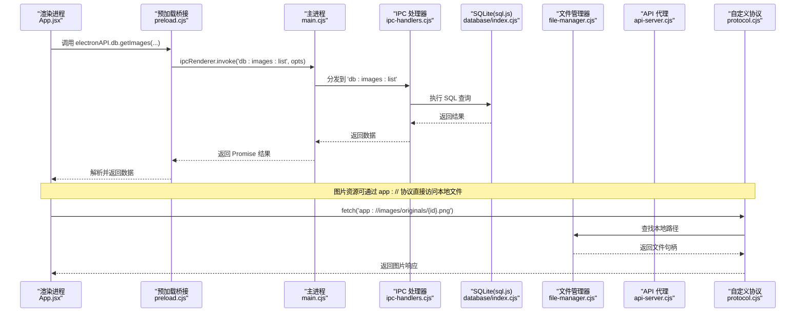

**图表来源** 
- [App.jsx:1-364](file://app/src/App.jsx#L1-L364)
- [preload.cjs:1-82](file://app/electron/preload.cjs#L1-L82)
- [main.cjs:1-126](file://app/electron/main.cjs#L1-L126)
- [ipc-handlers.cjs:1-63](file://app/electron/ipc-handlers.cjs#L1-L63)
- [database/index.cjs:1-93](file://app/electron/database/index.cjs#L1-L93)
- [file-manager.cjs:1-196](file://app/electron/file-manager.cjs#L1-L196)
- [api-server.cjs:1-250](file://app/electron/api-server.cjs#L1-L250)
- [protocol.cjs:1-93](file://app/electron/protocol.cjs#L1-L93)

## 详细组件分析

### 主进程初始化与窗口生命周期
- 关键职责
  - 注册特权 scheme（必须在 app ready 之前）
  - 初始化 SQLite 并运行 schema DDL
  - 注册 IPC handlers（数据库、OSS）
  - 初始化 FileManager 并注册文件操作 IPC
  - 注册 app:// 协议
  - 启动 API 代理服务器并暴露端口
  - 初始化 OSS 增量同步与网络恢复重试
  - 创建主窗口，监听首次加载与 SPA 导航，触发 IndexedDB → SQLite 迁移
- 设计要点
  - 使用 did-finish-load 与 lastUrl 区分首次加载与后续导航，避免重复迁移
  - before-quit 时停止 OSS 同步并关闭数据库，确保数据落盘

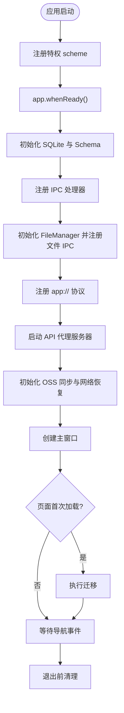

**图表来源** 
- [main.cjs:12-126](file://app/electron/main.cjs#L12-L126)

**章节来源**
- [main.cjs:12-126](file://app/electron/main.cjs#L12-L126)

### 预加载桥接与安全边界
- 暴露能力
  - db.*：覆盖 images/batches/sessions/folders/tasks/settings/casePackages 等全部表操作
  - fs.*：图片原图/缩略图/导入文件的保存、读取、删除与统计
  - oss.*：触发同步、获取状态、配置读写
  - app.*：获取应用路径、版本、API 端口
- 安全策略
  - 仅通过 contextBridge.exposeInMainWorld 暴露必要方法
  - 所有调用均经 ipcRenderer.invoke，禁止渲染进程直接访问 Node/Electron API

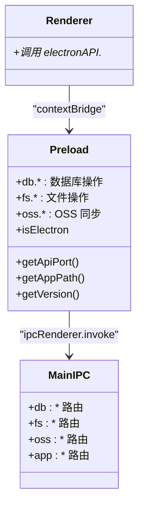

**图表来源** 
- [preload.cjs:1-82](file://app/electron/preload.cjs#L1-L82)
- [ipc-handlers.cjs:1-63](file://app/electron/ipc-handlers.cjs#L1-L63)

**章节来源**
- [preload.cjs:1-82](file://app/electron/preload.cjs#L1-L82)
- [ipc-handlers.cjs:1-63](file://app/electron/ipc-handlers.cjs#L1-L63)

### 数据库层（策略门面 + sql.js）
- 渲染进程策略门面
  - initDatabase 自动检测 window.electronAPI?.db 是否存在，选择 Electron 后端（IPC）或 Dexie 后端（IndexedDB）
  - 对外导出统一函数集合，Zustand 与页面无需感知差异
- 主进程 SQLite
  - 使用 sql.js 在内存中运行 SQLite，WAL 模式尝试开启
  - 每次写操作后 300ms 节流写入磁盘，关闭时强制落盘
  - 启动时执行 schema DDL，确保表结构存在

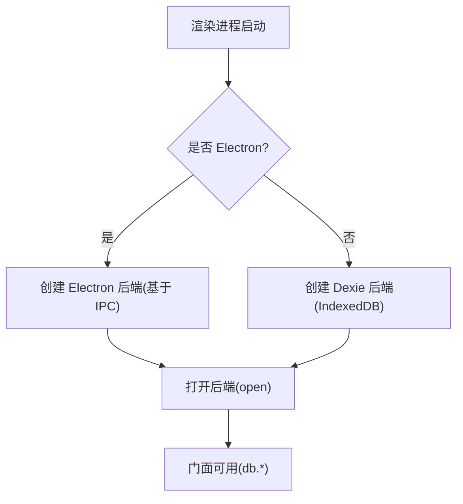

**图表来源** 
- [database.js:1-98](file://app/src/db/database.js#L1-L98)
- [database/index.cjs:1-93](file://app/electron/database/index.cjs#L1-L93)

**章节来源**
- [database.js:1-98](file://app/src/db/database.js#L1-L98)
- [database/index.cjs:1-93](file://app/electron/database/index.cjs#L1-L93)

### 文件系统层（FileManager）
- 目录组织
  - originals：生成的原图
  - thumbnails：缩略图
  - imports：用户导入参考图
- 能力
  - 保存/读取/删除原图与缩略图
  - 批量删除
  - 导入图片保存
  - 存储统计（数量与大小）
  - 路径查询（供 app:// 协议使用）
- IPC 暴露
  - fs:image:*、fs:thumbnail:*、fs:import:*、fs:stats

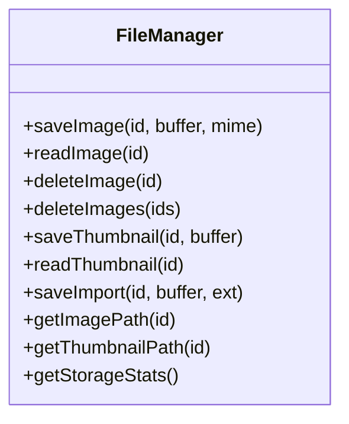

**图表来源** 
- [file-manager.cjs:17-139](file://app/electron/file-manager.cjs#L17-L139)

**章节来源**
- [file-manager.cjs:1-196](file://app/electron/file-manager.cjs#L1-L196)

### API 代理服务器
- 路由
  - /api/qwen/* → Qwen DashScope
  - /api/evolink/* → EvoLink（GPT-image-2、Nano Banana 2）
  - /api/oss/* → 阿里云 OSS
  - /api/llm/* → Expansion LLM
  - /api/proxy-image → 外部图片 CORS 代理
- 特性
  - 从 .env 读取密钥与基础地址
  - 统一代理逻辑：读取请求体、拼接目标 URL、注入额外头、回写状态码与响应头、返回 body
  - 错误处理：502 代理错误、404 未匹配、参数校验失败

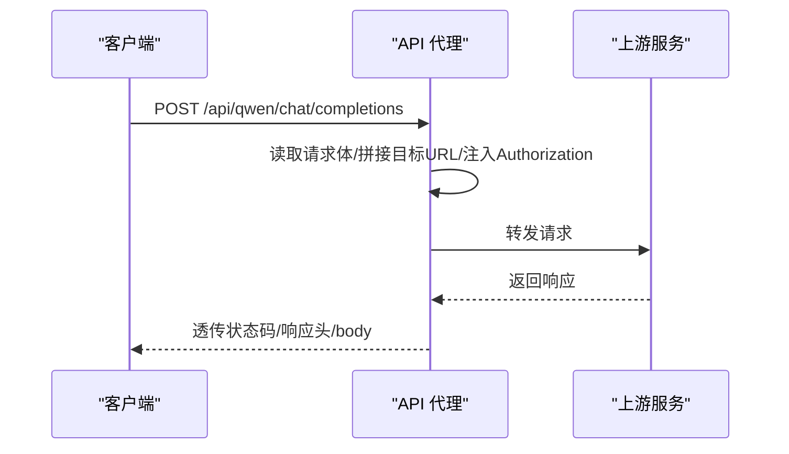

**图表来源** 
- [api-server.cjs:145-228](file://app/electron/api-server.cjs#L145-L228)

**章节来源**
- [api-server.cjs:1-250](file://app/electron/api-server.cjs#L1-L250)

### 自定义协议（app://）
- 特权 scheme 注册
  - 标准协议、安全、支持 fetch、CORS、流式传输
- 路由映射
  - /images/originals/{id}.{ext} → 原图
  - /images/thumbnails/{id}.jpg → 缩略图
- 安全检查
  - 阻止路径遍历（..）
  - 不存在则返回 404

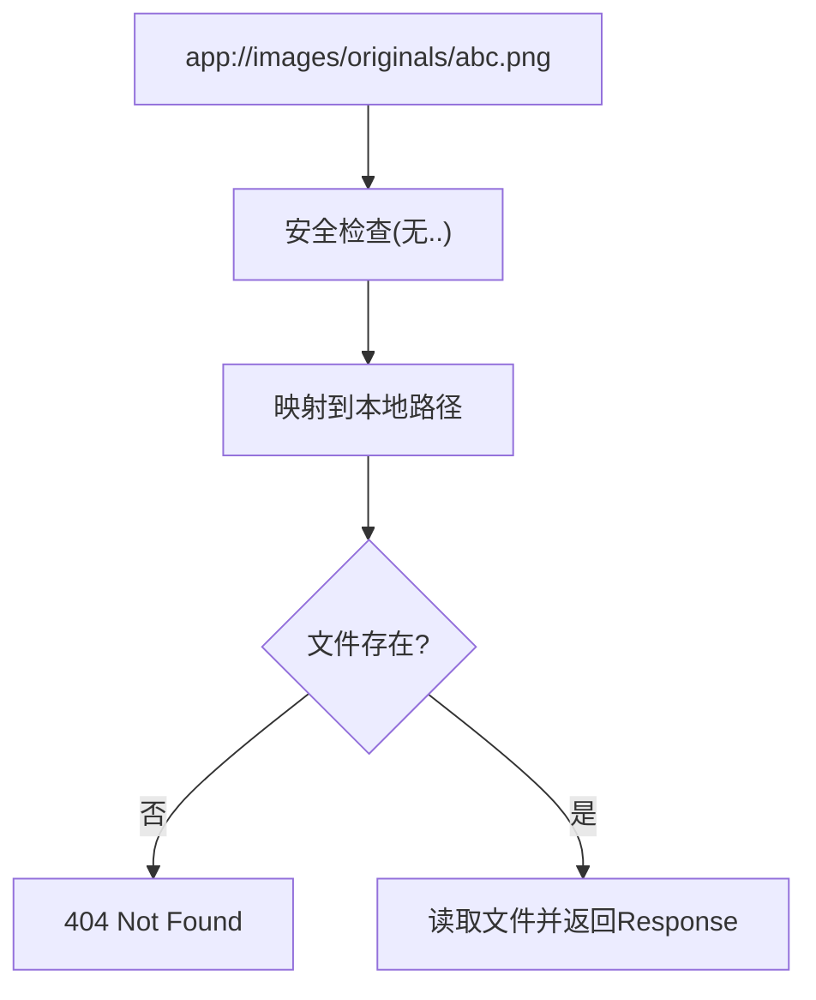

**图表来源** 
- [protocol.cjs:18-90](file://app/electron/protocol.cjs#L18-L90)

**章节来源**
- [protocol.cjs:1-93](file://app/electron/protocol.cjs#L1-L93)

### 任务引擎与通知
- 任务状态机
  - queued → running → completed/failed/cancelled/paused
  - failed → queued（重试）
  - cancelled → queued（重入队）
- 功能
  - 最大并发、FIFO 队列、指数退避重试（最多 3 次）
  - 进度上报、事件驱动（on/off/_emit）
  - 完成/失败时触发系统通知
- 与 Zustand 集成
  - useTaskStore 订阅所有事件，刷新任务列表并计算活跃任务数

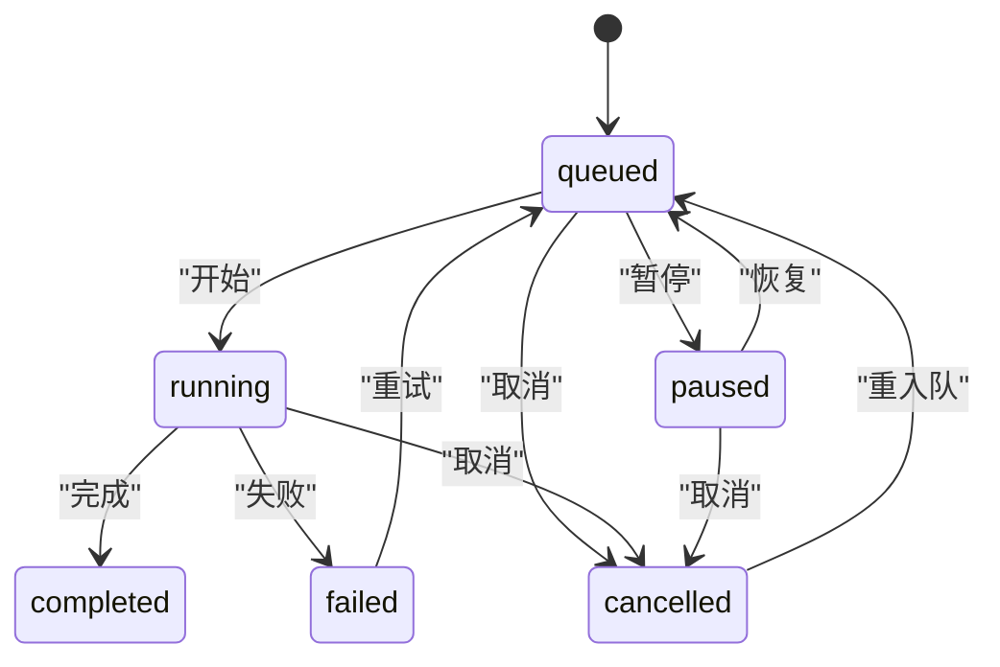

**图表来源** 
- [task-engine.js:24-31](file://app/src/services/task-engine.js#L24-L31)

**章节来源**
- [task-engine.js:1-319](file://app/src/services/task-engine.js#L1-L319)
- [useTaskStore.js:1-173](file://app/src/stores/useTaskStore.js#L1-L173)
- [notification.js:1-113](file://app/src/services/notification.js#L1-L113)

### 应用壳与路由
- 全局布局
  - 左侧导航栏、主内容区、任务面板、快捷方式遮罩、全局灯箱、遮罩编辑器
- 懒加载页面
  - Workbench、Gallery、KnowledgeBase、TaskCenter、Settings、SetupWizard、ApiTest
- 初始化
  - 启动时加载任务、初始化任务引擎桥接、请求通知权限

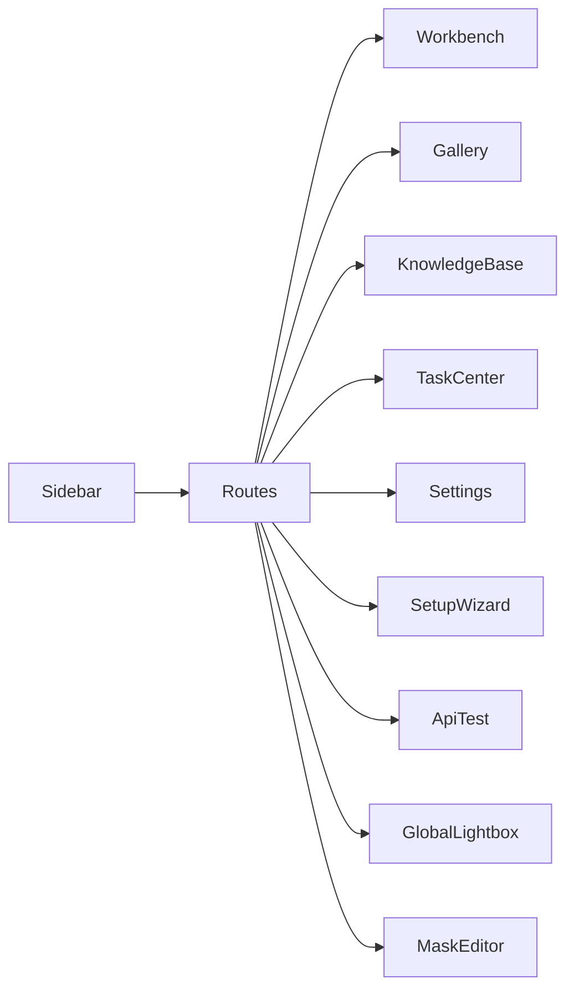

**图表来源** 
- [App.jsx:297-351](file://app/src/App.jsx#L297-L351)

**章节来源**
- [App.jsx:1-364](file://app/src/App.jsx#L1-L364)
- [main.jsx:1-32](file://app/src/main.jsx#L1-L32)

## 依赖关系分析
- 模块耦合
  - main.cjs 聚合各子系统（数据库、文件、协议、API、OSS、IPC）
  - preload.cjs 作为唯一桥接点，降低渲染进程对主进程的耦合面
  - database.js 策略门面屏蔽后端差异，提升可移植性
  - task-engine.js 与 useTaskStore.js 通过事件解耦，便于扩展
- 外部依赖
  - sql.js（SQLite in-memory）
  - ali-oss（OSS 同步）
  - axios（可选，当前主要用 fetch）
  - dexie（浏览器端 IndexedDB）
  - zustand（状态管理）
  - react-router-dom（路由）
  - vite + electron-builder（构建与打包）

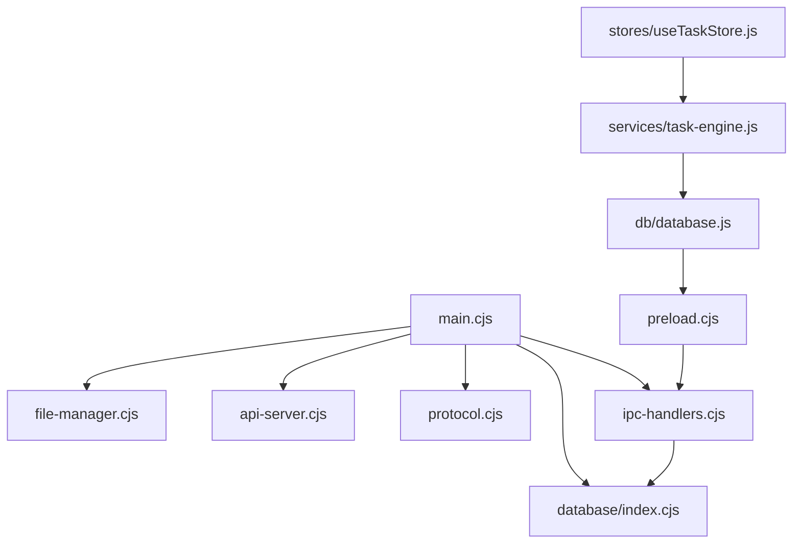

**图表来源** 
- [main.cjs:1-126](file://app/electron/main.cjs#L1-L126)
- [preload.cjs:1-82](file://app/electron/preload.cjs#L1-L82)
- [ipc-handlers.cjs:1-63](file://app/electron/ipc-handlers.cjs#L1-L63)
- [database/index.cjs:1-93](file://app/electron/database/index.cjs#L1-L93)
- [database.js:1-98](file://app/src/db/database.js#L1-L98)
- [task-engine.js:1-319](file://app/src/services/task-engine.js#L1-L319)
- [useTaskStore.js:1-173](file://app/src/stores/useTaskStore.js#L1-L173)

**章节来源**
- [package.json:1-43](file://app/package.json#L1-L43)

## 性能考量
- 数据库写入节流
  - 300ms 合并写入，减少频繁磁盘 I/O，提高吞吐
- 并发与队列
  - 任务引擎默认最大并发 3，可按需调整，避免阻塞 UI
- 图片缓存
  - app:// 协议返回 Cache-Control，缩短二次加载时间
- 代理优化
  - 统一代理逻辑复用，减少重复代码；按需注入头部，避免多余开销

[本节为通用指导，不直接分析具体文件]

## 故障排查指南
- 数据库初始化失败
  - 检查 userData 路径与文件权限；确认 schema DDL 执行成功
  - 关注 closeDatabase 是否在退出前被调用，防止数据丢失
- API 代理 502/404
  - 检查 .env 变量是否正确；确认上游服务可达；查看日志中的 targetUrl 与 headers
- app:// 协议 404
  - 确认图片 ID 与扩展名正确；检查路径遍历拦截与文件是否存在
- 任务无法完成
  - 查看任务状态与错误信息；确认重试次数与退避策略；检查网络错误分类逻辑

**章节来源**
- [database/index.cjs:66-93](file://app/electron/database/index.cjs#L66-L93)
- [api-server.cjs:109-128](file://app/electron/api-server.cjs#L109-L128)
- [protocol.cjs:48-68](file://app/electron/protocol.cjs#L48-L68)
- [task-engine.js:259-305](file://app/src/services/task-engine.js#L259-L305)

## 结论
该架构以主进程为中心，集中管理敏感资源与外部服务，渲染进程专注于 UI 与交互。通过预加载桥接与策略门面，既保证了安全性，又提升了跨环境兼容性。任务引擎与通知机制增强了用户体验，API 代理简化了多模型接入。整体设计清晰、可扩展性强，适合持续迭代与功能扩展。

[本节为总结性内容，不直接分析具体文件]

## 附录
- 开发脚本
  - dev：并行启动 Vite 与 Electron
  - build：生产构建
  - electron:build：打包 Windows 应用
- 构建配置
  - base 设置为相对路径，适配 Electron 本地加载
  - 启用 api-proxy 插件用于开发期代理

**章节来源**
- [package.json:9-17](file://app/package.json#L9-L17)
- [vite.config.js:1-14](file://app/vite.config.js#L1-L14)