# Electron 桌面应用架构

<cite>
**本文引用的文件**   
- [main.cjs](file://app/electron/main.cjs)
- [preload.cjs](file://app/electron/preload.cjs)
- [ipc-handlers.cjs](file://app/electron/ipc-handlers.cjs)
- [database/index.cjs](file://app/electron/database/index.cjs)
- [database/queries.cjs](file://app/electron/database/queries.cjs)
- [file-manager.cjs](file://app/electron/file-manager.cjs)
- [api-server.cjs](file://app/electron/api-server.cjs)
- [protocol.cjs](file://app/electron/protocol.cjs)
- [App.jsx](file://app/src/App.jsx)
- [main.jsx](file://app/src/main.jsx)
- [database.js](file://app/src/db/database.js)
- [http-backend.js](file://app/src/db/http-backend.js)
- [electron-backend.js](file://app/src/db/electron-backend.js)
- [task-engine.js](file://app/src/services/task-engine.js)
- [useTaskStore.js](file://app/src/stores/useTaskStore.js)
- [notification.js](file://app/src/services/notification.js)
- [client.js](file://app/src/services/api/client.js)
- [Gallery.jsx](file://app/src/pages/Gallery.jsx)
- [storage.js](file://app/src/services/storage.js)
- [vite.config.js](file://app/vite.config.js)
- [package.json](file://app/package.json)
</cite>

## 更新摘要
**所做更改**   
- 新增Buffer优化和API端口注入机制章节，详细说明生产环境下的性能改进
- 更新缩略图加载优化部分，反映Gallery显示在生产构建中的改进
- 增强HTTP后端章节，说明Buffer传输优化和二进制数据处理
- 更新预加载桥接部分，反映同步API端口注入机制
- 更新详细组件分析，涵盖新的Buffer优化和端口管理功能

## 目录
1. [简介](#简介)
2. [项目结构](#项目结构)
3. [核心组件](#核心组件)
4. [架构总览](#架构总览)
5. [详细组件分析](#详细组件分析)
6. [依赖关系分析](#依赖关系分析)
7. [性能考量](#性能考量)
8. [故障排查指南](#故障排查指南)
9. [结论](#结论)
10. [附录](#附录)

## 简介
本项目是一个基于 Electron + React 的 AI 图像生成工作站，提供多模型统一工作流、提示词工程、批量生成、知识库与全量资产管理能力。主进程负责数据库（SQLite via sql.js）、本地文件系统、REST API服务器、API 代理、自定义协议与 OSS 同步；渲染进程使用 React + Zustand 管理 UI 状态，并通过 IPC 或 HTTP API 安全访问主进程能力。

**更新** 新增了Buffer优化机制、API端口动态注入和缩略图加载优化，显著提升生产环境性能和用户体验。

## 项目结构
- 主进程（Electron）
  - 入口与生命周期：[main.cjs](file://app/electron/main.cjs)
  - 预加载脚本与安全桥接：[preload.cjs](file://app/electron/preload.cjs)
  - IPC 路由与数据库查询映射：[ipc-handlers.cjs](file://app/electron/ipc-handlers.cjs)
  - SQLite 初始化与持久化：[database/index.cjs](file://app/electron/database/index.cjs)
  - 数据库查询层：[database/queries.cjs](file://app/electron/database/queries.cjs)
  - 本地图片存储层：[file-manager.cjs](file://app/electron/file-manager.cjs)
  - 内嵌 REST API 服务器：[api-server.cjs](file://app/electron/api-server.cjs)
  - 自定义 app:// 协议处理：[protocol.cjs](file://app/electron/protocol.cjs)
- 渲染进程（React/Vite）
  - 应用壳与路由：[App.jsx](file://app/src/App.jsx)
  - 启动引导与设置加载：[main.jsx](file://app/src/main.jsx)
  - 数据库策略门面（Dexie/Electron/HTTP 后端选择）：[database.js](file://app/src/db/database.js)
  - HTTP 后端实现（浏览器模式）：[http-backend.js](file://app/src/db/http-backend.js)
  - Electron IPC 后端实现：[electron-backend.js](file://app/src/db/electron-backend.js)
  - 任务引擎与通知：[task-engine.js](file://app/src/services/task-engine.js)、[notification.js](file://app/src/services/notification.js)
  - 任务状态管理（Zustand）：[useTaskStore.js](file://app/src/stores/useTaskStore.js)
  - API客户端与端口管理：[client.js](file://app/src/services/api/client.js)
  - 画廊页面与缩略图优化：[Gallery.jsx](file://app/src/pages/Gallery.jsx)
  - 存储服务与缩略图生成：[storage.js](file://app/src/services/storage.js)
- 构建与打包
  - Vite 配置与插件：[vite.config.js](file://app/vite.config.js)
  - 包管理与脚本：[package.json](file://app/package.json)

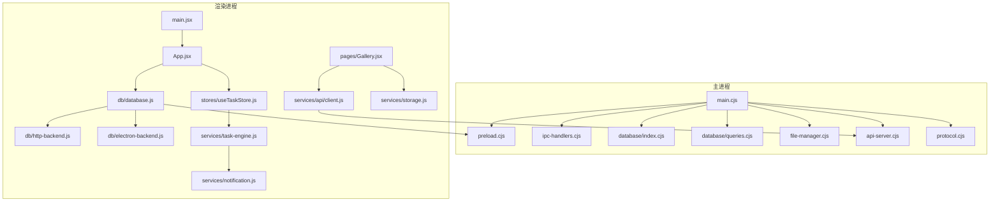

**图表来源** 
- [main.cjs:1-128](file://app/electron/main.cjs#L1-L128)
- [preload.cjs:1-82](file://app/electron/preload.cjs#L1-L82)
- [ipc-handlers.cjs:1-63](file://app/electron/ipc-handlers.cjs#L1-L63)
- [database/index.cjs:1-93](file://app/electron/database/index.cjs#L1-L93)
- [database/queries.cjs:1-721](file://app/electron/database/queries.cjs#L1-L721)
- [file-manager.cjs:1-196](file://app/electron/file-manager.cjs#L1-L196)
- [api-server.cjs:1-606](file://app/electron/api-server.cjs#L1-L606)
- [protocol.cjs:1-93](file://app/electron/protocol.cjs#L1-L93)
- [main.jsx:1-32](file://app/src/main.jsx#L1-L32)
- [App.jsx:1-364](file://app/src/App.jsx#L1-L364)
- [database.js:1-114](file://app/src/db/database.js#L1-L114)
- [http-backend.js:1-345](file://app/src/db/http-backend.js#L1-L345)
- [electron-backend.js:1-346](file://app/src/db/electron-backend.js#L1-L346)
- [task-engine.js:1-319](file://app/src/services/task-engine.js#L1-L319)
- [useTaskStore.js:1-173](file://app/src/stores/useTaskStore.js#L1-L173)
- [notification.js:1-113](file://app/src/services/notification.js#L1-L113)
- [client.js:1-193](file://app/src/services/api/client.js#L1-L193)
- [Gallery.jsx:1-539](file://app/src/pages/Gallery.jsx#L1-L539)
- [storage.js:1-456](file://app/src/services/storage.js#L1-L456)

**章节来源**
- [main.cjs:1-128](file://app/electron/main.cjs#L1-L128)
- [package.json:1-43](file://app/package.json#L1-L43)

## 核心组件
- 主进程入口与初始化流程
  - 注册特权 scheme、初始化 SQLite、注册 IPC、创建 FileManager、注册 app:// 协议、启动 REST API 服务器、初始化 OSS 同步、创建主窗口并监听页面导航与迁移触发。
- 预加载桥接
  - 通过 contextBridge 暴露 db/fs/oss/app 等安全接口给渲染进程，所有调用均经 ipcRenderer.invoke 转发到主进程。**新增** 同步API端口注入机制，在页面脚本执行前完成端口获取。
- 数据库层
  - 主进程侧使用 sql.js 在内存中运行 SQLite，按 300ms 节流写入磁盘；渲染进程通过策略门面自动选择 Dexie（浏览器）、IPC（Electron）或 HTTP（浏览器访问Electron）。**新增** Buffer优化和缩略图预加载机制。
- 文件系统层
  - 统一管理 originals/thumbnails/imports 三类图片读写与统计，IPC 暴露保存/读取/删除/统计接口。**新增** Buffer.from优化和二进制数据传输优化。
- REST API 服务器
  - 内嵌 http 服务，提供 /api/db/* 数据库REST端点、/api/qwen、/api/evolink、/api/oss、/api/llm、/api/proxy-image 外部API代理，注入鉴权头并回写响应。**新增** Buffer优化和CORS代理增强。
- 自定义协议
  - 注册 app:// 为特权 scheme，将 images/originals 与 thumbnails 路径映射到本地文件，支持 CORS 与 fetch。
- 任务引擎与通知
  - 单例任务调度器，支持并发控制、重试退避、进度上报、事件驱动；完成后触发系统通知。
- 状态管理
  - useTaskStore 订阅 TaskEngine 事件，刷新任务列表并计算活跃任务数，供 UI 展示。
- **新增** API客户端与端口管理
  - 动态解析API端口，支持Electron生产环境和开发环境的无缝切换，提供统一的HTTP请求封装。
- **新增** Gallery缩略图优化
  - 智能缩略图加载策略，优先使用blob URL，支持远程URL的CORS代理，提升生产环境显示性能。

**更新** 新增了Buffer优化机制、API端口动态注入和缩略图加载优化，显著提升生产环境性能和用户体验。

**章节来源**
- [main.cjs:68-128](file://app/electron/main.cjs#L68-L128)
- [preload.cjs:1-82](file://app/electron/preload.cjs#L1-L82)
- [database/index.cjs:1-93](file://app/electron/database/index.cjs#L1-L93)
- [database/queries.cjs:1-721](file://app/electron/database/queries.cjs#L1-L721)
- [database.js:1-114](file://app/src/db/database.js#L1-L114)
- [http-backend.js:1-345](file://app/src/db/http-backend.js#L1-L345)
- [electron-backend.js:1-346](file://app/src/db/electron-backend.js#L1-L346)
- [file-manager.cjs:1-196](file://app/electron/file-manager.cjs#L1-L196)
- [api-server.cjs:1-606](file://app/electron/api-server.cjs#L1-L606)
- [protocol.cjs:1-93](file://app/electron/protocol.cjs#L1-L93)
- [task-engine.js:1-319](file://app/src/services/task-engine.js#L1-L319)
- [useTaskStore.js:1-173](file://app/src/stores/useTaskStore.js#L1-L173)
- [notification.js:1-113](file://app/src/services/notification.js#L1-L113)
- [client.js:1-193](file://app/src/services/api/client.js#L1-L193)
- [Gallery.jsx:1-539](file://app/src/pages/Gallery.jsx#L1-L539)
- [storage.js:1-456](file://app/src/services/storage.js#L1-L456)

## 架构总览
整体采用"主进程能力 + 渲染进程 UI"的分层架构，新增REST API层支持跨进程通信：**新增** Buffer优化和API端口动态注入机制：
- 渲染进程通过预加载桥接访问主进程能力（数据库、文件、OSS、应用信息），或通过HTTP API访问SQLite。
- 主进程集中管理资源（SQLite、文件系统、REST API、HTTP代理、协议），保证安全与一致性。
- REST API服务器提供标准化的数据库操作接口，支持浏览器模式下的数据访问。
- 任务引擎在渲染进程运行，持久化任务状态到数据库，并通过事件驱动更新 UI。
- **新增** API客户端动态解析端口，支持Electron生产环境的无缝连接。
- **新增** Gallery智能缩略图加载，优先使用本地缓存，提升显示性能。

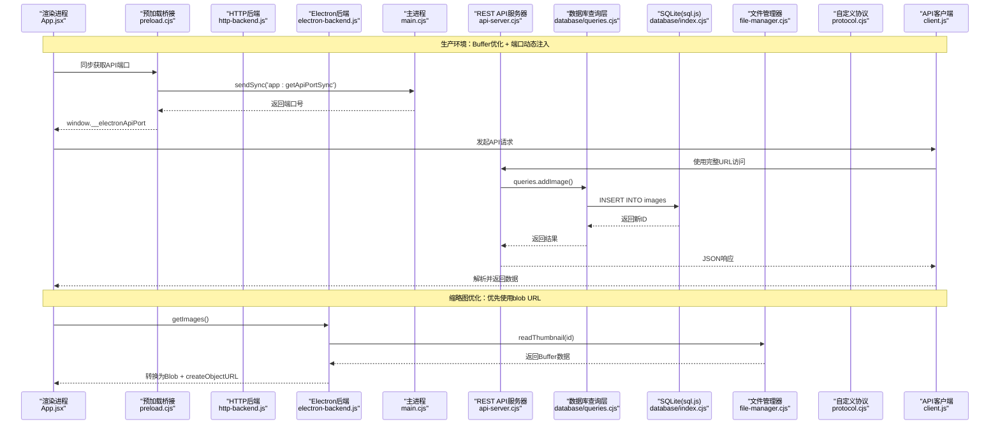

**图表来源** 
- [App.jsx:1-364](file://app/src/App.jsx#L1-L364)
- [preload.cjs:1-82](file://app/electron/preload.cjs#L1-L82)
- [http-backend.js:1-345](file://app/src/db/http-backend.js#L1-L345)
- [electron-backend.js:1-346](file://app/src/db/electron-backend.js#L1-L346)
- [main.cjs:1-128](file://app/electron/main.cjs#L1-L128)
- [api-server.cjs:1-606](file://app/electron/api-server.cjs#L1-L606)
- [database/queries.cjs:1-721](file://app/electron/database/queries.cjs#L1-L721)
- [database/index.cjs:1-93](file://app/electron/database/index.cjs#L1-L93)
- [file-manager.cjs:1-196](file://app/electron/file-manager.cjs#L1-L196)
- [protocol.cjs:1-93](file://app/electron/protocol.cjs#L1-L93)
- [client.js:1-193](file://app/src/services/api/client.js#L1-L193)

## 详细组件分析

### 主进程初始化与窗口生命周期
- 关键职责
  - 注册特权 scheme（必须在 app ready 之前）
  - 初始化 SQLite 并运行 schema DDL
  - 注册 IPC handlers（数据库、OSS）
  - 初始化 FileManager 并注册文件操作 IPC
  - 注册 app:// 协议
  - 启动 REST API 服务器并暴露端口
  - 初始化 OSS 增量同步与网络恢复重试
  - 创建主窗口，监听首次加载与 SPA 导航，触发 IndexedDB → SQLite 迁移
- 设计要点
  - 使用 did-finish-load 与 lastUrl 区分首次加载与后续导航，避免重复迁移
  - before-quit 时停止 OSS 同步并关闭数据库，确保数据落盘
  - 开发环境固定端口19527，生产环境随机端口
  - **新增** 同步API端口获取机制，支持preload阶段零竞态条件获取

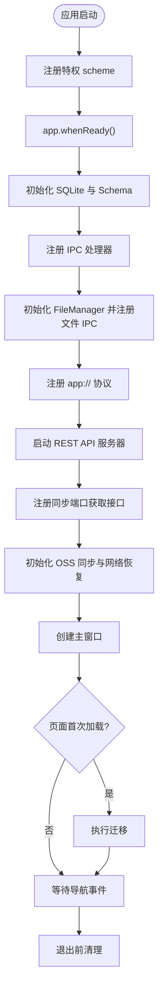

**图表来源** 
- [main.cjs:12-128](file://app/electron/main.cjs#L12-L128)

**章节来源**
- [main.cjs:12-128](file://app/electron/main.cjs#L12-L128)

### 预加载桥接与安全边界
- 暴露能力
  - db.*：覆盖 images/batches/sessions/folders/tasks/settings/casePackages 等全部表操作
  - fs.*：图片原图/缩略图/导入文件的保存、读取、删除与统计
  - oss.*：触发同步、获取状态、配置读写
  - app.*：获取应用路径、版本、API 端口
- 安全策略
  - 仅通过 contextBridge.exposeInMainWorld 暴露必要方法
  - 所有调用均经 ipcRenderer.invoke，禁止渲染进程直接访问 Node/Electron API
- **新增** 同步API端口注入
  - 在preload阶段使用sendSync同步获取API端口
  - 设置window.__electronApiPort全局变量
  - 零竞态条件，确保页面脚本执行前端口可用

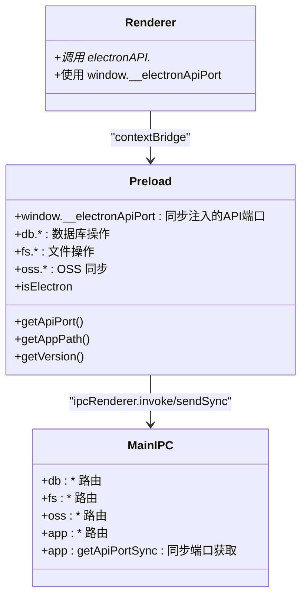

**图表来源** 
- [preload.cjs:1-82](file://app/electron/preload.cjs#L1-L82)
- [ipc-handlers.cjs:1-63](file://app/electron/ipc-handlers.cjs#L1-L63)

**章节来源**
- [preload.cjs:1-82](file://app/electron/preload.cjs#L1-L82)
- [ipc-handlers.cjs:1-63](file://app/electron/ipc-handlers.cjs#L1-L63)

### 数据库层（策略门面 + 多后端支持）
- 渲染进程策略门面
  - initDatabase 自动检测运行环境，选择最优后端：
    - Electron IPC 后端（优先）：直接访问主进程SQLite
    - HTTP 后端（次优）：通过REST API访问SQLite
    - Dexie 后端（降级）：使用IndexedDB
  - 对外导出统一函数集合，Zustand 与页面无需感知差异
- 主进程 SQLite
  - 使用 sql.js 在内存中运行 SQLite，WAL 模式尝试开启
  - 每次写操作后 300ms 节流写入磁盘，关闭时强制落盘
  - 启动时执行 schema DDL，确保表结构存在
- **新增** Buffer优化和缩略图预加载
  - Electron后端：使用Uint8Array优化Buffer转换
  - 缩略图预加载：getImages时主动加载thumbnailBlob
  - Blob URL缓存：避免重复创建对象URL

**更新** 新增Buffer优化机制和缩略图预加载，提升Electron模式下的性能表现。

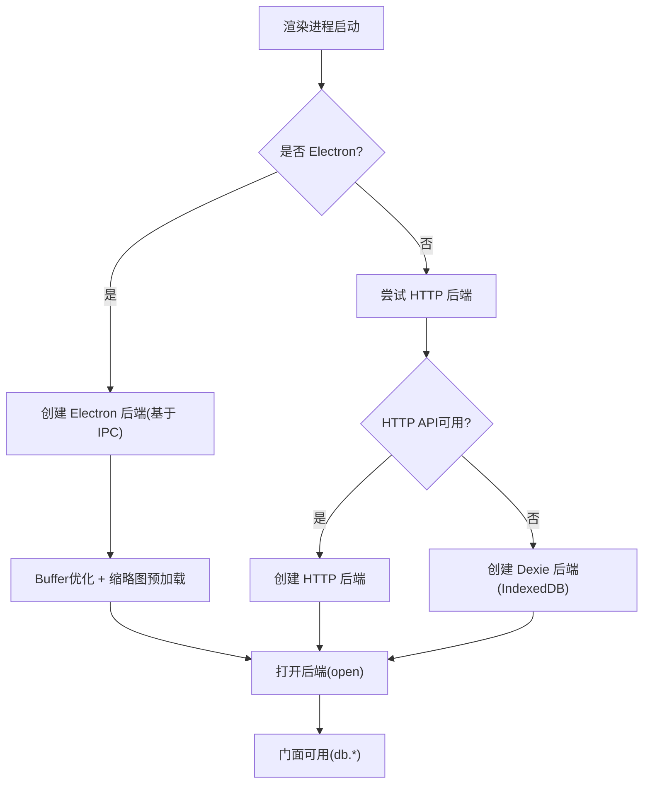

**图表来源** 
- [database.js:1-114](file://app/src/db/database.js#L1-L114)
- [electron-backend.js:1-346](file://app/src/db/electron-backend.js#L1-L346)
- [database/index.cjs:1-93](file://app/electron/database/index.cjs#L1-L93)

**章节来源**
- [database.js:1-114](file://app/src/db/database.js#L1-L114)
- [electron-backend.js:1-346](file://app/src/db/electron-backend.js#L1-L346)
- [database/index.cjs:1-93](file://app/electron/database/index.cjs#L1-L93)

### REST API 服务器
- 路由架构
  - `/api/db/*` → SQLite数据库REST API（25+端点）
  - `/api/qwen/*` → Qwen DashScope API代理
  - `/api/evolink/*` → EvoLink API代理
  - `/api/oss/*` → 阿里云OSS代理
  - `/api/llm/*` → Expansion LLM代理
  - `/api/proxy-image` → 外部图片CORS代理
- 数据库API端点
  - Images: add/update/delete/list/search/stats/toggleFavorite/move
  - Batches: add/list
  - Sessions: add/list
  - Folders: add/list/update/delete
  - Tasks: add/update/list/delete/stats
  - Settings: getAll/set/get
  - CasePackages: add/list/update/delete
- 特性
  - 从 .env 读取密钥与基础地址
  - 统一代理逻辑：读取请求体、拼接目标 URL、注入额外头、回写状态码与响应头、返回 body
  - 错误处理：502 代理错误、404 未匹配、参数校验失败
  - 二进制文件上传/下载支持（图片文件、缩略图）
- **新增** Buffer优化
  - 使用Buffer.concat优化请求体处理
  - Buffer.from(arrayBuffer)高效转换
  - Content-Length精确设置，提升传输效率

**更新** 新增Buffer优化机制，提升二进制数据传输性能。

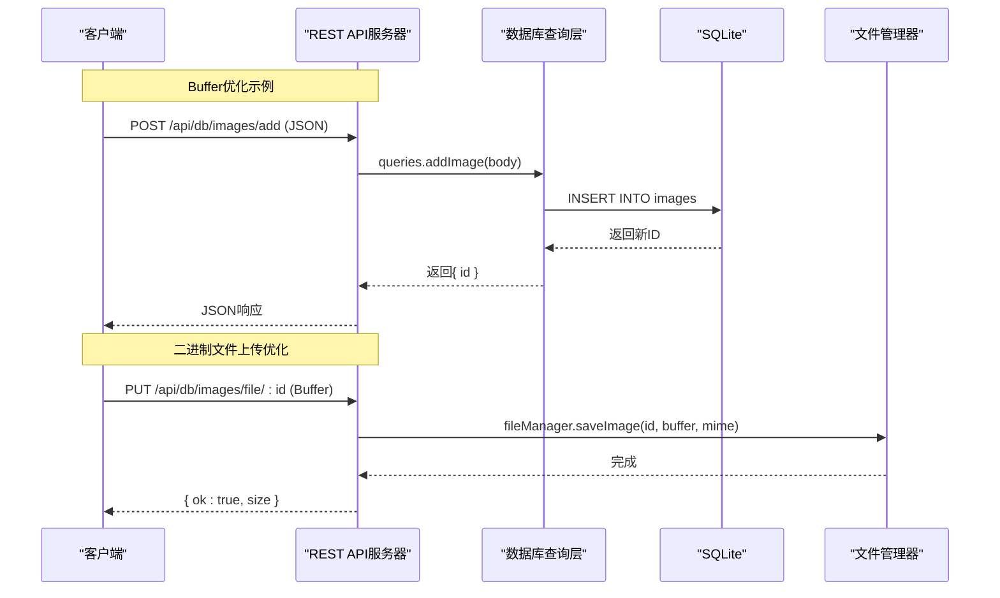

**图表来源** 
- [api-server.cjs:182-458](file://app/electron/api-server.cjs#L182-L458)
- [database/queries.cjs:122-318](file://app/electron/database/queries.cjs#L122-L318)

**章节来源**
- [api-server.cjs:1-606](file://app/electron/api-server.cjs#L1-L606)
- [database/queries.cjs:1-721](file://app/electron/database/queries.cjs#L1-L721)

### HTTP 后端（浏览器模式）
- 设计目标
  - 在浏览器环境中通过HTTP访问Electron主进程的SQLite数据库
  - 保持与Electron IPC后端相同的API接口
  - 支持二进制文件的两步上传机制
- 实现方式
  - 所有数据库操作通过fetch调用/api/db/*端点
  - 二进制文件分两步：先POST元数据获取ID，再PUT原始二进制数据
  - 自动处理Blob转换和URL对象创建
- 兼容性
  - 完全兼容现有的数据库策略门面
  - 无需修改现有业务代码即可切换后端
- **新增** Buffer优化
  - blobToArrayBuffer辅助函数优化二进制处理
  - Uint8Array转换减少内存占用
  - 错误处理和异常恢复机制

**更新** 新增Buffer优化和错误处理机制，提升浏览器模式下的稳定性。

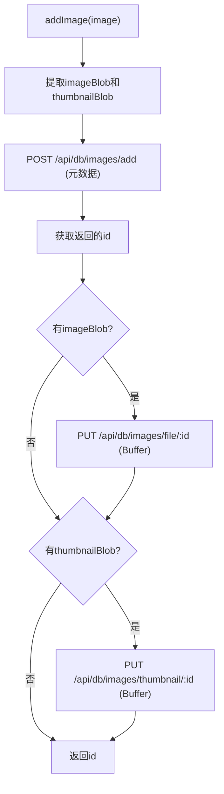

**图表来源** 
- [http-backend.js:86-103](file://app/src/db/http-backend.js#L86-L103)

**章节来源**
- [http-backend.js:1-345](file://app/src/db/http-backend.js#L1-L345)

### 文件系统层（FileManager）
- 目录组织
  - originals：生成的原图
  - thumbnails：缩略图
  - imports：用户导入参考图
- 能力
  - 保存/读取/删除原图与缩略图
  - 批量删除
  - 导入图片保存
  - 存储统计（数量与大小）
  - 路径查询（供 app:// 协议使用）
- IPC 暴露
  - fs:image:*、fs:thumbnail:*、fs:import:*、fs:stats
- **新增** Buffer优化
  - Buffer.from(buffer)优化IPC数据传输
  - 二进制数据直接传递，避免序列化开销
  - 错误处理和异常恢复

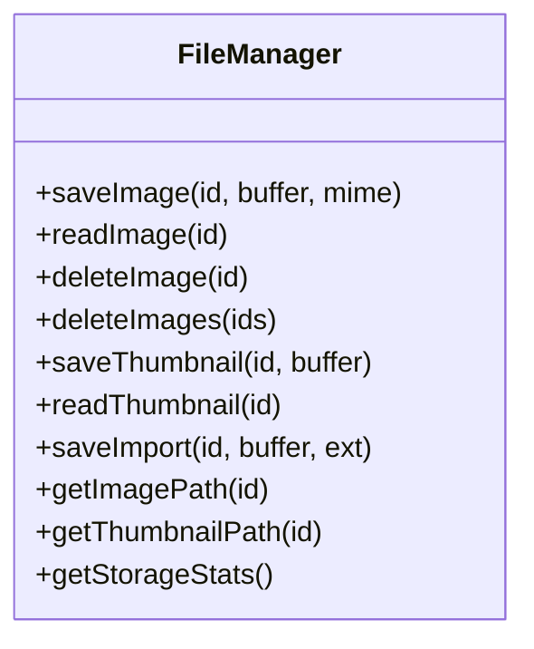

**图表来源** 
- [file-manager.cjs:17-139](file://app/electron/file-manager.cjs#L17-L139)

**章节来源**
- [file-manager.cjs:1-196](file://app/electron/file-manager.cjs#L1-L196)

### 自定义协议（app://）
- 特权 scheme 注册
  - 标准协议、安全、支持 fetch、CORS、流式传输
- 路由映射
  - /images/originals/{id}.{ext} → 原图
  - /images/thumbnails/{id}.jpg → 缩略图
- 安全检查
  - 阻止路径遍历（..）
  - 不存在则返回 404

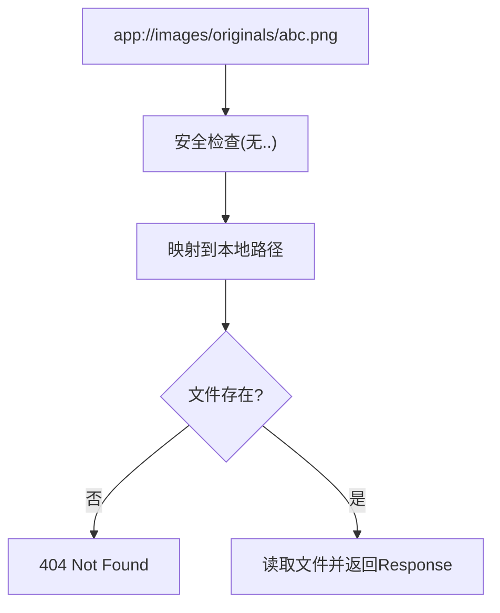

**图表来源** 
- [protocol.cjs:18-90](file://app/electron/protocol.cjs#L18-L90)

**章节来源**
- [protocol.cjs:1-93](file://app/electron/protocol.cjs#L1-L93)

### 任务引擎与通知
- 任务状态机
  - queued → running → completed/failed/cancelled/paused
  - failed → queued（重试）
  - cancelled → queued（重入队）
- 功能
  - 最大并发、FIFO 队列、指数退避重试（最多 3 次）
  - 进度上报、事件驱动（on/off/_emit）
  - 完成/失败时触发系统通知
- 与 Zustand 集成
  - useTaskStore 订阅所有事件，刷新任务列表并计算活跃任务数

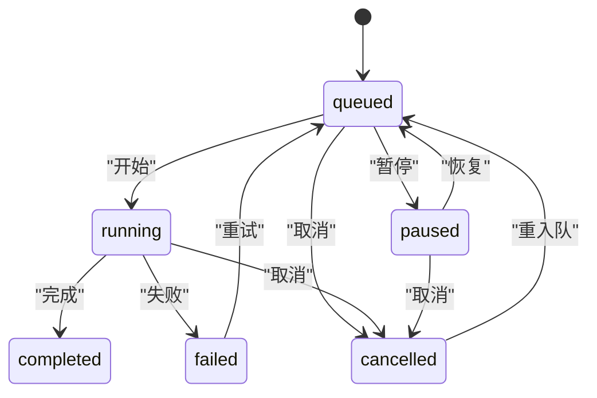

**图表来源** 
- [task-engine.js:24-31](file://app/src/services/task-engine.js#L24-L31)

**章节来源**
- [task-engine.js:1-319](file://app/src/services/task-engine.js#L1-L319)
- [useTaskStore.js:1-173](file://app/src/stores/useTaskStore.js#L1-L173)
- [notification.js:1-113](file://app/src/services/notification.js#L1-L113)

### API客户端与端口管理
- **新增** 动态端口解析
  - resolveApiBase函数异步获取API端口
  - 支持Electron IPC和浏览器环境自动切换
  - 缓存机制避免重复端口查询
- **新增** 请求拦截器
  - 自动改写baseURL指向正确的API服务器
  - 统一错误处理和重试机制
  - AbortController支持请求取消
- **新增** CORS代理优化
  - proxyImageUrl函数智能处理远程图片URL
  - Electron生产环境使用完整URL
  - 开发环境使用相对路径

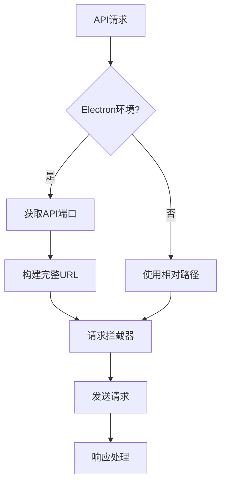

**图表来源** 
- [client.js:22-37](file://app/src/services/api/client.js#L22-L37)
- [client.js:62-76](file://app/src/services/api/client.js#L62-L76)
- [client.js:182-190](file://app/src/services/api/client.js#L182-L190)

**章节来源**
- [client.js:1-193](file://app/src/services/api/client.js#L1-L193)

### Gallery缩略图优化
- **新增** 智能缩略图加载策略
  - getImageDisplayUrl函数优先使用blob URL
  - 支持thumbnailUrl和url的降级处理
  - 远程URL自动通过CORS代理
- **新增** 生产环境优化
  - 利用window.__electronApiPort直接访问API
  - 避免Vite代理开销，提升响应速度
  - 缩略图预加载和缓存机制
- **新增** 用户体验改进
  - 快速缩略图显示，减少加载时间
  - 错误处理和空状态显示
  - 懒加载和分页优化

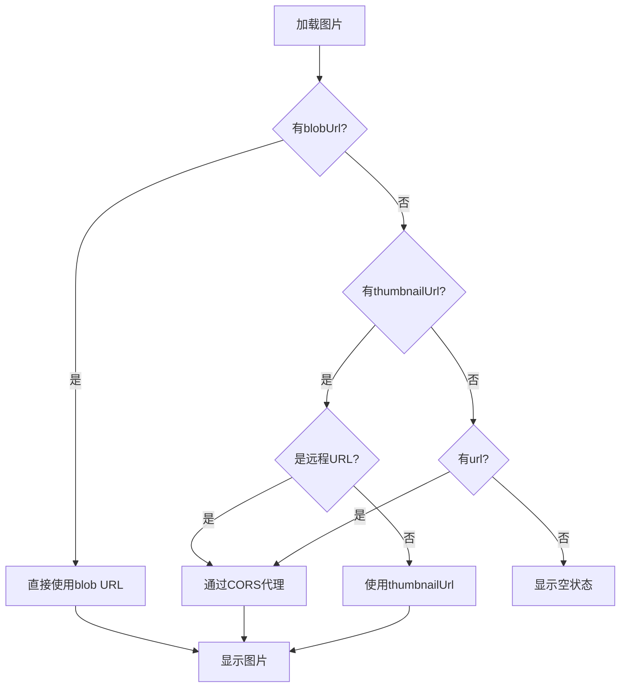

**图表来源** 
- [Gallery.jsx:28-39](file://app/src/pages/Gallery.jsx#L28-L39)
- [client.js:182-190](file://app/src/services/api/client.js#L182-L190)

**章节来源**
- [Gallery.jsx:1-539](file://app/src/pages/Gallery.jsx#L1-L539)
- [client.js:1-193](file://app/src/services/api/client.js#L1-L193)

### 应用壳与路由
- 全局布局
  - 左侧导航栏、主内容区、任务面板、快捷方式遮罩、全局灯箱、遮罩编辑器
- 懒加载页面
  - Workbench、Gallery、KnowledgeBase、TaskCenter、Settings、SetupWizard、ApiTest
- 初始化
  - 启动时加载任务、初始化任务引擎桥接、请求通知权限

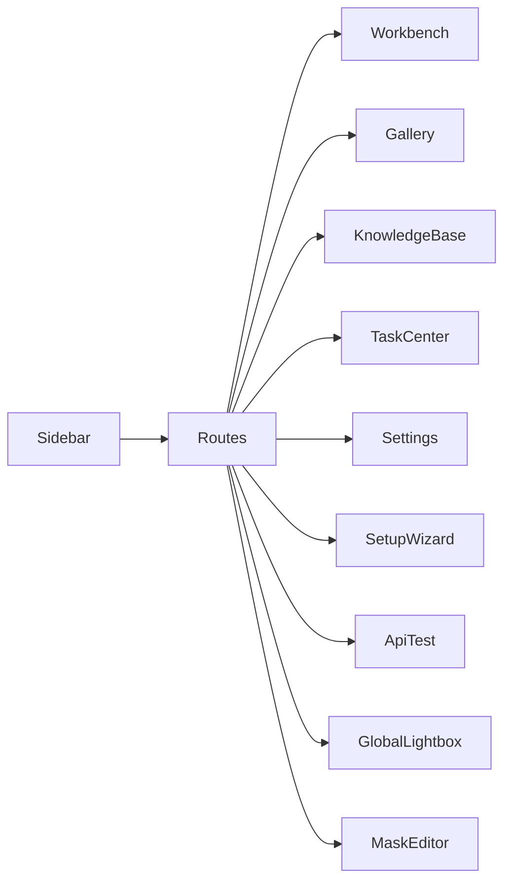

**图表来源** 
- [App.jsx:297-351](file://app/src/App.jsx#L297-L351)

**章节来源**
- [App.jsx:1-364](file://app/src/App.jsx#L1-L364)
- [main.jsx:1-32](file://app/src/main.jsx#L1-L32)

## 依赖关系分析
- 模块耦合
  - main.cjs 聚合各子系统（数据库、文件、协议、API、OSS、IPC）
  - preload.cjs 作为唯一桥接点，降低渲染进程对主进程的耦合面
  - database.js 策略门面屏蔽后端差异，提升可移植性
  - task-engine.js 与 useTaskStore.js 通过事件解耦，便于扩展
  - api-server.cjs 提供统一的REST API接口，支持多种后端
- 外部依赖
  - sql.js（SQLite in-memory）
  - ali-oss（OSS 同步）
  - axios（可选，当前主要用 fetch）
  - dexie（浏览器端 IndexedDB）
  - zustand（状态管理）
  - react-router-dom（路由）
  - vite + electron-builder（构建与打包）
- **新增** 依赖关系
  - client.js 提供统一的API客户端和端口管理
  - Gallery.jsx 依赖优化后的缩略图加载机制
  - storage.js 提供缩略图生成和尺寸计算

**更新** 新增API客户端和Gallery优化的依赖关系。

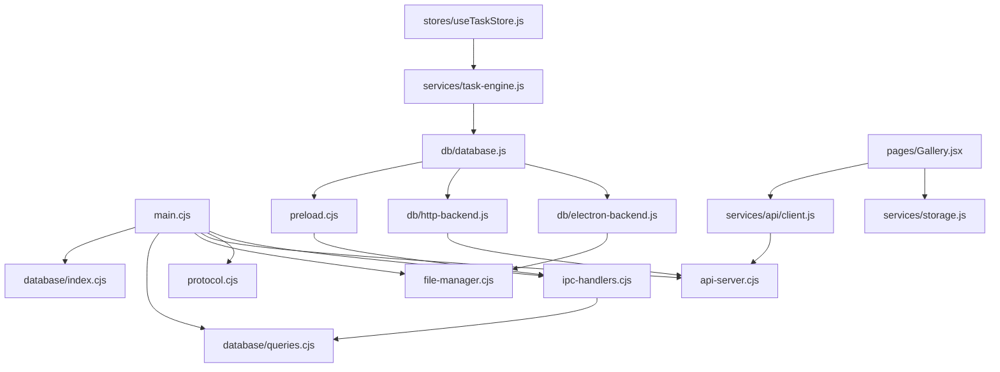

**图表来源** 
- [main.cjs:1-128](file://app/electron/main.cjs#L1-L128)
- [preload.cjs:1-82](file://app/electron/preload.cjs#L1-L82)
- [ipc-handlers.cjs:1-63](file://app/electron/ipc-handlers.cjs#L1-L63)
- [database/index.cjs:1-93](file://app/electron/database/index.cjs#L1-L93)
- [database/queries.cjs:1-721](file://app/electron/database/queries.cjs#L1-L721)
- [database.js:1-114](file://app/src/db/database.js#L1-L114)
- [http-backend.js:1-345](file://app/src/db/http-backend.js#L1-L345)
- [electron-backend.js:1-346](file://app/src/db/electron-backend.js#L1-L346)
- [task-engine.js:1-319](file://app/src/services/task-engine.js#L1-L319)
- [useTaskStore.js:1-173](file://app/src/stores/useTaskStore.js#L1-L173)
- [client.js:1-193](file://app/src/services/api/client.js#L1-L193)
- [Gallery.jsx:1-539](file://app/src/pages/Gallery.jsx#L1-L539)
- [storage.js:1-456](file://app/src/services/storage.js#L1-L456)

**章节来源**
- [package.json:1-43](file://app/package.json#L1-L43)

## 性能考量
- 数据库写入节流
  - 300ms 合并写入，减少频繁磁盘 I/O，提高吞吐
- 并发与队列
  - 任务引擎默认最大并发 3，可按需调整，避免阻塞 UI
- 图片缓存
  - app:// 协议返回 Cache-Control，缩短二次加载时间
- 代理优化
  - 统一代理逻辑复用，减少重复代码；按需注入头部，避免多余开销
- REST API优化
  - 二进制文件分块传输，避免大文件内存溢出
  - HTTP连接复用，减少TCP握手开销
- **新增** Buffer优化
  - 使用Buffer.from和Uint8Array优化二进制数据处理
  - 减少序列化/反序列化开销
  - 精确的Content-Length设置提升传输效率
- **新增** 端口管理优化
  - 同步端口获取避免竞态条件
  - 端口缓存减少重复查询
  - 动态URL构建提升连接性能
- **新增** 缩略图加载优化
  - 优先使用blob URL避免网络请求
  - 缩略图预加载提升首屏显示速度
  - 智能降级策略确保用户体验

**更新** 新增Buffer优化、端口管理和缩略图加载的性能优化考虑。

## 故障排查指南
- 数据库初始化失败
  - 检查 userData 路径与文件权限；确认 schema DDL 执行成功
  - 关注 closeDatabase 是否在退出前被调用，防止数据丢失
- REST API 502/404
  - 检查 .env 变量是否正确；确认上游服务可达；查看日志中的 targetUrl 与 headers
  - 确认/api/db端点是否正确路由到数据库查询层
- HTTP后端连接失败
  - 确认Electron主进程已启动且API服务器正在监听
  - 检查Vite代理配置是否正确指向19527端口
- app:// 协议 404
  - 确认图片 ID 与扩展名正确；检查路径遍历拦截与文件是否存在
- 任务无法完成
  - 查看任务状态与错误信息；确认重试次数与退避策略；检查网络错误分类逻辑
- **新增** API端口相关问题
  - 检查window.__electronApiPort是否正确注入
  - 确认preload阶段的sendSync调用是否成功
  - 验证Electron生产环境下的端口动态解析
- **新增** Buffer传输问题
  - 检查二进制数据的Buffer.from转换是否正确
  - 确认Content-Type和Content-Length设置
  - 验证IPC传输中的Buffer序列化/反序列化
- **新增** 缩略图加载问题
  - 检查gallery页面的getImageDisplayUrl逻辑
  - 确认CORS代理配置和远程URL处理
  - 验证blob URL的生命周期管理

**更新** 新增API端口、Buffer传输和缩略图加载的故障排查指南。

**章节来源**
- [database/index.cjs:66-93](file://app/electron/database/index.cjs#L66-L93)
- [api-server.cjs:109-128](file://app/electron/api-server.cjs#L109-L128)
- [database.js:32-44](file://app/src/db/database.js#L32-L44)
- [protocol.cjs:48-68](file://app/electron/protocol.cjs#L48-L68)
- [task-engine.js:259-305](file://app/src/services/task-engine.js#L259-L305)
- [preload.cjs:3-7](file://app/electron/preload.cjs#L3-L7)
- [client.js:22-37](file://app/src/services/api/client.js#L22-L37)
- [Gallery.jsx:28-39](file://app/src/pages/Gallery.jsx#L28-L39)

## 结论
该架构以主进程为中心，集中管理敏感资源与外部服务，渲染进程专注于 UI 与交互。通过预加载桥接与策略门面，既保证了安全性，又提升了跨环境兼容性。新增的REST API服务器提供了标准化的数据库访问接口，支持浏览器模式下的SQLite访问。任务引擎与通知机制增强了用户体验，API 代理简化了多模型接入。整体设计清晰、可扩展性强，适合持续迭代与功能扩展。

**更新** 新增的Buffer优化机制、API端口动态注入和缩略图加载优化显著提升了生产环境性能和用户体验，使应用更加稳定和高效。

## 附录
- 开发脚本
  - dev：并行启动 Vite 与 Electron，自动启动REST API服务器
  - build：生产构建
  - electron:build：打包 Windows 应用
- 构建配置
  - base 设置为相对路径，适配 Electron 本地加载
  - 启用 api-proxy 插件用于开发期代理
  - Vite代理配置：/api/db → http://127.0.0.1:19527
- **新增** 端口管理配置
  - 开发环境固定端口19527
  - 生产环境随机端口，通过IPC同步获取
  - 支持Electron和浏览器环境的无缝切换
- **新增** Buffer优化配置
  - 使用Node.js原生Buffer类优化二进制处理
  - 配置适当的Content-Type和Content-Length
  - 优化IPC传输中的Buffer序列化

**更新** 新增端口管理和Buffer优化的配置说明。

**章节来源**
- [package.json:9-17](file://app/package.json#L9-L17)
- [vite.config.js:1-20](file://app/vite.config.js#L1-L20)
- [main.cjs:94-104](file://app/electron/main.cjs#L94-L104)
- [client.js:22-37](file://app/src/services/api/client.js#L22-L37)